# Build a Banking App Part 4: Concepts of State Management

## ⚡ What You Can Do in the Next 5 Minutes

**Quick Start Pathway for Busy Developers**

```mermaid
flowchart LR
    A[⚡ 5 minutes] --> B[Diagnose state issues]
    B --> C[Create central state object]
    C --> D[Add updateState function]
    D --> E[See immediate improvements]
```



- **Minute 1**: Test the current state issue - log in, refresh page, observe logout
- **Minute 2**: Replace `let account = null` with `let state = { account: null }`
- **Minute 3**: Create a simple `updateState()` function for controlled updates
- **Minute 4**: Update one function to use the new pattern
- **Minute 5**: Test the improved predictability and debugging capability

**Quick Diagnostic Test**:
```javascript
// Before: Scattered state
let account = null; // Lost on refresh!

// After: Centralized state
let state = Object.freeze({ account: null }); // Controlled and trackable!
```

**Why This Matters**: In 5 minutes, you'll experience the transformation from chaotic state management to predictable, debuggable patterns. This is the foundation that makes complex applications maintainable.

## 🗺️ Your Learning Journey Through State Management Mastery


**Your Journey Destination**: By the end of this lesson, you'll have built a professional-grade state management system that handles persistence, data freshness, and predictable updates - the same patterns used in production applications.

## Pre-Lecture Quiz

[Pre-lecture quiz](https://ff-quizzes.netlify.app/web/quiz/47)

## Introduction

State management is like the navigation system on the Voyager spacecraft – when everything's working smoothly, you barely notice it's there. But when things go wrong, it becomes the difference between reaching interstellar space and drifting lost in the cosmic void. In web development, state represents everything your application needs to remember: user login status, form data, navigation history, and temporary interface states.

As your banking app has evolved from a simple login form into a more sophisticated application, you've likely encountered some common challenges. Refresh the page and users get logged out unexpectedly. Close the browser and all progress disappears. Debug a problem and you're hunting through multiple functions that all modify the same data in different ways.

These aren't signs of poor coding – they're the natural growing pains that occur when applications reach a certain complexity threshold. Every developer faces these challenges as their apps transition from "proof of concept" to "production ready."

In this lesson, we'll implement a centralized state management system that transforms your banking app into a reliable, professional application. You'll learn to manage data flows predictably, persist user sessions appropriately, and create the smooth user experience that modern web applications require.

## Prerequisites

Before diving into state management concepts, you'll need to have your development environment properly set up and your banking app foundation in place. This lesson builds directly on the concepts and code from previous parts of this series.

Make sure you have the following components ready before proceeding:

**Required Setup:**
- Complete the [data fetching lesson](../3-data/README.md) - your app should successfully load and display account data
- Install [Node.js](https://nodejs.org) on your system for running the backend API
- Start the [server API](../api/README.md) locally to handle account data operations

**Testing Your Environment:**

Verify that your API server is running correctly by executing this command in a terminal:

```sh
curl http://localhost:5000/api
# -> should return "Bank API v1.0.0" as a result
```

**What this command does:**
- **Sends** a GET request to your local API server
- **Tests** the connection and verifies the server is responding
- **Returns** the API version information if everything is working correctly

## 🧠 State Management Architecture Overview


**Core Principle**: Professional state management balances predictability, persistence, and performance to create reliable user experiences that scale from simple interactions to complex application workflows.

---

## Diagnosing the Current State Issues

Like Sherlock Holmes examining a crime scene, we need to understand exactly what's happening in our current implementation before we can solve the mystery of disappearing user sessions.

Let's conduct a simple experiment that reveals the underlying state management challenges:

**🧪 Try This Diagnostic Test:**
1. Log into your banking app and navigate to the dashboard
2. Refresh the browser page
3. Observe what happens to your login status

If you're redirected back to the login screen, you've discovered the classic state persistence problem. This behavior occurs because our current implementation stores user data in JavaScript variables that reset with each page load.

**Current Implementation Problems:**

The simple `account` variable from our [previous lesson](../3-data/README.md) creates three significant issues that affect both user experience and code maintainability:

| Problem | Technical Cause | User Impact |
|---------|--------|----------------|
| **Session Loss** | Page refresh clears JavaScript variables | Users must re-authenticate frequently |
| **Scattered Updates** | Multiple functions modify state directly | Debugging becomes increasingly difficult |
| **Incomplete Cleanup** | Logout doesn't clear all state references | Potential security and privacy concerns |

**The Architectural Challenge:**

Like the Titanic's compartmentalized design that seemed robust until multiple compartments flooded simultaneously, fixing these issues individually won't address the underlying architectural problem. We need a comprehensive state management solution.

> 💡 **What are we actually trying to accomplish here?**

[State management](https://en.wikipedia.org/wiki/State_management) is really about solving two fundamental puzzles:

1. **Where's My Data?**: Keeping track of what information we have and where it's coming from
2. **Is Everyone on the Same Page?**: Making sure what users see matches what's actually happening

**Our Game Plan:**

Instead of chasing our tails, we're going to create a **centralized state management** system. Think of it like having one really organized person in charge of all the important stuff:


**Understanding this data flow:**
- **Centralizes** all application state in one location
- **Routes** all state changes through controlled functions
- **Ensures** the UI stays synchronized with the current state
- **Provides** a clear, predictable pattern for data management

> 💡 **Professional Insight**: This lesson focuses on fundamental concepts. For complex applications, libraries like [Redux](https://redux.js.org) provide more advanced state management features. Understanding these core principles will help you master any state management library.

> ⚠️ **Advanced Topic**: We won't cover automatic UI updates triggered by state changes, as this involves [Reactive Programming](https://en.wikipedia.org/wiki/Reactive_programming) concepts. Consider this an excellent next step for your learning journey!

### Task: Centralize State Structure

Let's begin transforming our scattered state management into a centralized system. This first step establishes the foundation for all the improvements that follow.

**Step 1: Create a Central State Object**

Replace the simple `account` declaration:

```js
let account = null;
```

With a structured state object:

```js
let state = {
  account: null
};
```

**Here's why this change matters:**
- **Centralizes** all application data in one location
- **Prepares** the structure for adding more state properties later
- **Creates** a clear boundary between state and other variables
- **Establishes** a pattern that scales as your app grows

**Step 2: Update State Access Patterns**

Update your functions to use the new state structure:

**In `register()` and `login()` functions**, replace:
```js
account = ...
```

With:
```js
state.account = ...
```

**In `updateDashboard()` function**, add this line at the top:
```js
const account = state.account;
```

**What these updates accomplish:**
- **Maintains** existing functionality while improving structure
- **Prepares** your code for more sophisticated state management
- **Creates** consistent patterns for accessing state data
- **Establishes** the foundation for centralized state updates

> 💡 **Note**: This refactoring doesn't immediately solve our problems, but it creates the essential foundation for the powerful improvements coming next!

### 🎯 Pedagogical Check-in: Centralization Principles

**Pause and Reflect**: You've just implemented the foundation of centralized state management. This is a crucial architectural decision.

**Quick Self-Assessment**:
- Can you explain why centralizing state in one object is better than scattered variables?
- What would happen if you forgot to update a function to use `state.account`?
- How does this pattern prepare your code for more advanced features?

**Real-World Connection**: The centralization pattern you've learned is the foundation of modern frameworks like Redux, Vuex, and React Context. You're building the same architectural thinking used in major applications.

**Challenge Question**: If you needed to add user preferences (theme, language) to your app, where would you add them in the state structure? How would this scale?

## Implementing Controlled State Updates

With our state centralized, the next step involves establishing controlled mechanisms for data modifications. This approach ensures predictable state changes and easier debugging.

The core principle resembles air traffic control: instead of allowing multiple functions to modify state independently, we'll channel all changes through a single, controlled function. This pattern provides clear oversight of when and how data changes occur.

**Immutable State Management:**

We'll treat our `state` object as [*immutable*](https://en.wikipedia.org/wiki/Immutable_object), meaning we never modify it directly. Instead, each change creates a new state object with the updated data.

While this approach might initially seem inefficient compared to direct modifications, it provides significant advantages for debugging, testing, and maintaining application predictability.

**Benefits of immutable state management:**

| Benefit | Description | Impact |
|---------|-------------|--------|
| **Predictability** | Changes only happen through controlled functions | Easier to debug and test |
| **History Tracking** | Each state change creates a new object | Enables undo/redo functionality |
| **Side Effect Prevention** | No accidental modifications | Prevents mysterious bugs |
| **Performance Optimization** | Easy to detect when state actually changed | Enables efficient UI updates |

**JavaScript Immutability with `Object.freeze()`:**

JavaScript provides [`Object.freeze()`](https://developer.mozilla.org/docs/Web/JavaScript/Reference/Global_Objects/Object/freeze) to prevent object modifications:

```js
const immutableState = Object.freeze({ account: userData });
// Any attempt to modify immutableState will throw an error
```

**Breaking down what happens here:**
- **Prevents** direct property assignments or deletions
- **Throws** exceptions if modification attempts are made
- **Ensures** state changes must go through controlled functions
- **Creates** a clear contract for how state can be updated

> 💡 **Deep Dive**: Learn about the difference between *shallow* and *deep* immutable objects in the [MDN documentation](https://developer.mozilla.org/docs/Web/JavaScript/Reference/Global_Objects/Object/freeze#What_is_shallow_freeze). Understanding this distinction is crucial for complex state structures.


### Task

Let's create a new `updateState()` function:

```js
function updateState(property, newData) {
  state = Object.freeze({
    ...state,
    [property]: newData
  });
}
```

In this function, we're creating a new state object and copy data from the previous state using the [*spread (`...`) operator*](https://developer.mozilla.org/docs/Web/JavaScript/Reference/Operators/Spread_syntax#Spread_in_object_literals). Then we override a particular property of the state object with the new data using the [bracket notation](https://developer.mozilla.org/docs/Web/JavaScript/Guide/Working_with_Objects#Objects_and_properties) `[property]` for assignment. Finally, we lock the object to prevent modifications using `Object.freeze()`. We only have the `account` property stored in the state for now, but with this approach you can add as many properties as you need in the state.

We'll also update the `state` initialization to make sure the initial state is frozen too:

```js
let state = Object.freeze({
  account: null
});
```

After that, update the `register` function by replacing the `state.account = result;` assignment with:

```js
updateState('account', result);
```

Do the same with the `login` function, replacing `state.account = data;` with:

```js
updateState('account', data);
```

We'll now take the chance to fix the issue of account data not being cleared when the user clicks on *Logout*.

Create a new function `logout()`:

```js
function logout() {
  updateState('account', null);
  navigate('/login');
}
```

In `updateDashboard()`, replace the redirection `return navigate('/login');` with `return logout()`;

Try registering a new account, logging out and in again to check that everything still works correctly.

> Tip: you can take a look at all state changes by adding `console.log(state)` at the bottom of `updateState()` and opening up the console in your browser's development tools.

## Implementing Data Persistence

The session loss issue we identified earlier requires a persistence solution that maintains user state across browser sessions. This transforms our application from a temporary experience into a reliable, professional tool.

Consider how atomic clocks maintain precise time even through power outages by storing critical state in non-volatile memory. Similarly, web applications need persistent storage mechanisms to preserve essential user data across browser sessions and page refreshes.

**Strategic Questions for Data Persistence:**

Before implementing persistence, consider these critical factors:

| Question | Banking App Context | Decision Impact |
|----------|-------------------|----------------|
| **Is the data sensitive?** | Account balance, transaction history | Choose secure storage methods |
| **How long should it persist?** | Login state vs. temporary UI preferences | Select appropriate storage duration |
| **Does the server need it?** | Authentication tokens vs. UI settings | Determine sharing requirements |

**Browser Storage Options:**

Modern browsers provide several storage mechanisms, each designed for different use cases:

**Primary Storage APIs:**

1. **[`localStorage`](https://developer.mozilla.org/docs/Web/API/Window/localStorage)**: Persistent [Key/Value storage](https://en.wikipedia.org/wiki/Key%E2%80%93value_database)
   - **Persists** data across browser sessions indefinitely  
   - **Survives** browser restarts and computer reboots
   - **Scoped** to the specific website domain
   - **Perfect** for user preferences and login states

2. **[`sessionStorage`](https://developer.mozilla.org/docs/Web/API/Window/sessionStorage)**: Temporary session storage
   - **Functions** identically to localStorage during active sessions
   - **Clears** automatically when the browser tab closes
   - **Ideal** for temporary data that shouldn't persist

3. **[HTTP Cookies](https://developer.mozilla.org/docs/Web/HTTP/Cookies)**: Server-shared storage
   - **Automatically** sent with every server request
   - **Perfect** for [authentication](https://en.wikipedia.org/wiki/Authentication) tokens
   - **Limited** in size and can impact performance

**Data Serialization Requirement:**

Both `localStorage` and `sessionStorage` only store [strings](https://developer.mozilla.org/docs/Web/JavaScript/Reference/Global_Objects/String):

```js
// Convert objects to JSON strings for storage
const accountData = { user: 'john', balance: 150 };
localStorage.setItem('account', JSON.stringify(accountData));

// Parse JSON strings back to objects when retrieving
const savedAccount = JSON.parse(localStorage.getItem('account'));
```

**Understanding serialization:**
- **Converts** JavaScript objects to JSON strings using [`JSON.stringify()`](https://developer.mozilla.org/docs/Web/JavaScript/Reference/Global_Objects/JSON/stringify)
- **Reconstructs** objects from JSON using [`JSON.parse()`](https://developer.mozilla.org/docs/Web/JavaScript/Reference/Global_Objects/JSON/parse)
- **Handles** complex nested objects and arrays automatically
- **Fails** on functions, undefined values, and circular references

> 💡 **Advanced Option**: For complex offline applications with large datasets, consider the [`IndexedDB` API](https://developer.mozilla.org/docs/Web/API/IndexedDB_API). It provides a full client-side database but requires more complex implementation.


### Task: Implement localStorage Persistence

Let's implement persistent storage so users stay logged in until they explicitly log out. We'll use `localStorage` to store account data across browser sessions.

**Step 1: Define Storage Configuration**

```js
const storageKey = 'savedAccount';
```

**What this constant provides:**
- **Creates** a consistent identifier for our stored data
- **Prevents** typos in storage key references
- **Makes** it easy to change the storage key if needed
- **Follows** best practices for maintainable code

**Step 2: Add Automatic Persistence**

Add this line at the end of the `updateState()` function:

```js
localStorage.setItem(storageKey, JSON.stringify(state.account));
```

**Breaking down what happens here:**
- **Converts** the account object to a JSON string for storage
- **Saves** the data using our consistent storage key
- **Executes** automatically whenever state changes occur
- **Ensures** stored data is always synchronized with current state

> 💡 **Architecture Benefit**: Because we centralized all state updates through `updateState()`, adding persistence required only one line of code. This demonstrates the power of good architectural decisions!

**Step 3: Restore State on App Load**

Create an initialization function to restore saved data:

```js
function init() {
  const savedAccount = localStorage.getItem(storageKey);
  if (savedAccount) {
    updateState('account', JSON.parse(savedAccount));
  }

  // Our previous initialization code
  window.onpopstate = () => updateRoute();
  updateRoute();
}

init();
```

**Understanding the initialization process:**
- **Retrieves** any previously saved account data from localStorage
- **Parses** the JSON string back into a JavaScript object
- **Updates** the state using our controlled update function
- **Restores** the user's session automatically on page load
- **Executes** before route updates to ensure state is available

**Step 4: Optimize Default Route**

Update the default route to take advantage of persistence:

In `updateRoute()`, replace:
```js
// Replace: return navigate('/login');
return navigate('/dashboard');
```

**Why this change makes sense:**
- **Leverages** our new persistence system effectively
- **Allows** the dashboard to handle authentication checks
- **Redirects** to login automatically if no saved session exists
- **Creates** a more seamless user experience

**Testing Your Implementation:**

1. Log into your banking app
2. Refresh the browser page
3. Verify you remain logged in and on the dashboard
4. Close and reopen your browser
5. Navigate back to your app and confirm you're still logged in

🎉 **Achievement Unlocked**: You've successfully implemented persistent state management! Your app now behaves like a professional web application.

### 🎯 Pedagogical Check-in: Persistence Architecture

**Architecture Understanding**: You've implemented a sophisticated persistence layer that balances user experience with data management complexity.

**Key Concepts Mastered**:
- **JSON Serialization**: Converting complex objects to storable strings
- **Automatic Synchronization**: State changes trigger persistent storage
- **Session Recovery**: Apps can restore user context after interruptions
- **Centralized Persistence**: One update function handles all storage

**Industry Connection**: This persistence pattern is fundamental to Progressive Web Apps (PWAs), offline-first applications, and modern mobile web experiences. You're building production-level capabilities.

**Reflection Question**: How would you modify this system to handle multiple user accounts on the same device? Consider privacy and security implications.

## Balancing Persistence with Data Freshness

Our persistence system successfully maintains user sessions, but introduces a new challenge: data staleness. When multiple users or applications modify the same server data, local cached information becomes outdated.

This situation resembles Viking navigators who relied on both stored star charts and current celestial observations. The charts provided consistency, but navigators needed fresh observations to account for changing conditions. Similarly, our application needs both persistent user state and current server data.

**🧪 Discovering the Data Freshness Problem:**

1. Log into the dashboard using the `test` account
2. Run this command in a terminal to simulate a transaction from another source:

```sh
curl --request POST \
     --header "Content-Type: application/json" \
     --data "{ \"date\": \"2020-07-24\", \"object\": \"Bought book\", \"amount\": -20 }" \
     http://localhost:5000/api/accounts/test/transactions
```

3. Refresh your dashboard page in the browser
4. Observe whether you see the new transaction

**What this test demonstrates:**
- **Shows** how local storage can become "stale" (outdated)
- **Simulates** real-world scenarios where data changes occur outside your app
- **Reveals** the tension between persistence and data freshness

**The Data Staleness Challenge:**

| Problem | Cause | User Impact |
|---------|-------|-------------|
| **Stale Data** | localStorage never expires automatically | Users see outdated information |
| **Server Changes** | Other apps/users modify the same data | Inconsistent views across platforms |
| **Cache vs. Reality** | Local cache doesn't match server state | Poor user experience and confusion |

**Solution Strategy:**

We'll implement a "refresh on load" pattern that balances the benefits of persistence with the need for fresh data. This approach maintains the smooth user experience while ensuring data accuracy.


### Task: Implement Data Refresh System

We'll create a system that automatically fetches fresh data from the server while maintaining the benefits of our persistent state management.

**Step 1: Create Account Data Updater**

```js
async function updateAccountData() {
  const account = state.account;
  if (!account) {
    return logout();
  }

  const data = await getAccount(account.user);
  if (data.error) {
    return logout();
  }

  updateState('account', data);
}
```

**Understanding this function's logic:**
- **Checks** if a user is currently logged in (state.account exists)
- **Redirects** to logout if no valid session is found
- **Fetches** fresh account data from the server using the existing `getAccount()` function
- **Handles** server errors gracefully by logging out invalid sessions
- **Updates** the state with fresh data using our controlled update system
- **Triggers** automatic localStorage persistence through the `updateState()` function

**Step 2: Create Dashboard Refresh Handler**

```js
async function refresh() {
  await updateAccountData();
  updateDashboard();
}
```

**What this refresh function accomplishes:**
- **Coordinates** the data refresh and UI update process
- **Waits** for fresh data to be loaded before updating the display
- **Ensures** the dashboard shows the most current information
- **Maintains** a clean separation between data management and UI updates

**Step 3: Integrate with Route System**

Update your route configuration to trigger refresh automatically:

```js
const routes = {
  '/login': { templateId: 'login' },
  '/dashboard': { templateId: 'dashboard', init: refresh }
};
```

**How this integration works:**
- **Executes** the refresh function every time the dashboard route loads
- **Ensures** fresh data is always displayed when users navigate to the dashboard
- **Maintains** the existing route structure while adding data freshness
- **Provides** a consistent pattern for route-specific initialization

**Testing Your Data Refresh System:**

1. Log into your banking app
2. Run the curl command from earlier to create a new transaction
3. Refresh your dashboard page or navigate away and back
4. Verify that the new transaction appears immediately

🎉 **Perfect Balance Achieved**: Your app now combines the smooth experience of persistent state with the accuracy of fresh server data!

## 📈 Your State Management Mastery Timeline


**🎓 Graduation Milestone**: You've successfully built a complete state management system using the same principles that power Redux, Vuex, and other professional state libraries. These patterns scale from simple apps to enterprise applications.

**🔄 Next Level Capabilities**:
- Ready to master state management frameworks (Redux, Zustand, Pinia)
- Prepared to implement real-time features with WebSockets
- Equipped to build offline-first Progressive Web Apps
- Foundation set for advanced patterns like state machines and observers

## GitHub Copilot Agent Challenge 🚀

Use the Agent mode to complete the following challenge:

**Description:** Implement a comprehensive state management system with undo/redo functionality for the banking app. This challenge will help you practice advanced state management concepts including state history tracking, immutable updates, and user interface synchronization.

**Prompt:** Create an enhanced state management system that includes: 1) A state history array that tracks all previous states, 2) Undo and redo functions that can revert to previous states, 3) UI buttons for undo/redo operations on the dashboard, 4) A maximum history limit of 10 states to prevent memory issues, and 5) Proper cleanup of history when the user logs out. Ensure the undo/redo functionality works with account balance changes and persists across browser refreshes.

Learn more about [agent mode](https://code.visualstudio.com/blogs/2025/02/24/introducing-copilot-agent-mode) here.

## 🚀 Challenge: Storage Optimization

Your implementation now handles user sessions, data refresh, and state management effectively. However, consider whether our current approach optimally balances storage efficiency with functionality.

Like chess masters who distinguish between essential pieces and expendable pawns, effective state management requires identifying which data must persist versus which should always be fresh from the server.

**Optimization Analysis:**

Evaluate your current localStorage implementation and consider these strategic questions:
- What's the minimum information required to maintain user authentication?
- Which data changes frequently enough that local caching provides little benefit?
- How can storage optimization improve performance without degrading user experience?

This type of architectural analysis distinguishes experienced developers who consider both functionality and efficiency in their solutions.

**Implementation Strategy:**
- **Identify** the essential data that must persist (likely just user identification)
- **Modify** your localStorage implementation to store only critical session data
- **Ensure** fresh data is always loaded from the server on dashboard visits
- **Test** that your optimized approach maintains the same user experience

**Advanced Consideration:**
- **Compare** the trade-offs between storing full account data vs. just authentication tokens
- **Document** your decisions and reasoning for future team members

This challenge will help you think like a professional developer who considers both user experience and application efficiency. Take your time to experiment with different approaches!

## Post-Lecture Quiz

[Post-lecture quiz](https://ff-quizzes.netlify.app/web/quiz/48)

## Assignment

[Implement "Add transaction" dialog](assignment.md)

Here's an example result after completing the assignment:


