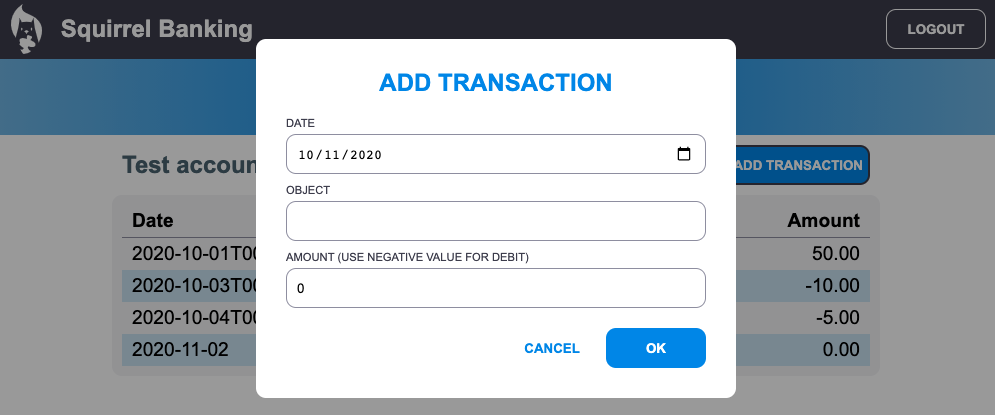

# Conceptos de gestión del estado

## [Pre-lecture prueba](https://ashy-river-0debb7803.1.azurestaticapps.net/quiz/47)

### Introducción

A medida que una aplicación web crece, mantener un seguimiento limpio de todos los flujos de datos se convierte en un desafío. Qué código obtiene los datos, qué página los consume, dónde y cuándo debe actualizarse, es fácil terminar con un código desordenado y difícil de mantener. Esto es especialmente cierto cuando necesita compartir datos entre diferentes páginas de su aplicación, por ejemplo, los datos del usuario. El concepto de *gestión estatal* siempre ha existido en todo tipo de programas, pero a medida que las aplicaciones web siguen creciendo en complejidad, ahora es un punto clave en el que pensar durante el desarrollo.

En esta parte final, revisaremos la aplicación que creamos para repensar cómo se administra el estado, lo que permite la compatibilidad con la actualización del navegador en cualquier momento y la persistencia de datos en las sesiones de los usuarios.

### Requisito previo

Debe haber completado la parte [obtención de datos](../3-data/README.md) de la aplicación web para esta lección. También necesita instalar [Node.js](https://nodejs.org) y [ejecutar la API del servidor](../api/README.md) localmente para poder administrar los datos de la cuenta.

Puede probar que el servidor está funcionando correctamente ejecutando este comando en una terminal:


```sh
curl http://localhost:5000/api
# -> debe devolver "API bancaria v1.0.0" como resultado
```

---

## Repensar la gestión del estado

En la [lección anterior](../3-data/README.md), empezamos con un concepto básico de estado en nuestra aplicación con la variable global `account` que contiene los datos bancarios del usuario actualmente conectado. Sin embargo, nuestra implementación actual tiene algunas fallas. Intente actualizar la página cuando esté en el panel. Pero ¿qué pasa?

Hay 3 problemas con el código actual:

- El estado no persiste, ya que una actualización del navegador lo lleva de regreso a la página de inicio de sesión.
- Hay múltiples funciones que modifican el estado. A medida que la aplicación crece, puede dificultar el seguimiento de los cambios y es fácil olvidarse de actualizar uno.
- El estado no se limpia, cuando hace clic en *Cerrar sesión*, los datos de la cuenta siguen ahí aunque esté en la página de inicio de sesión.

Podríamos actualizar nuestro código para abordar estos problemas uno por uno, pero crearía más duplicación de código y haría que la aplicación sea más compleja y difícil de mantener. O podríamos hacer una pausa por unos minutos y repensar nuestra estrategia.

> ¿Qué problemas estamos realmente tratando de resolver aquí?

La [gestión del estado](https://en.wikipedia.org/wiki/State_management) se trata de encontrar un buen enfoque para resolver estos dos problemas particulares:

- ¿Cómo mantener los flujos de datos en una aplicación fáciles de entender?
- ¿Cómo mantener los datos de estado siempre sincronizados con la interfaz de usuario (y viceversa)?

Una vez que se haya ocupado de esto, es posible que cualquier otro problema que pueda tener ya esté solucionado o que sea más fácil de solucionar. Hay muchos enfoques posibles para resolver estos problemas, pero optaremos por una solución común que consiste en **centralizar los datos y las formas de cambiarlos**. Los flujos de datos serían así:


> No cubriremos aquí la parte en la que los datos activan automáticamente la actualización de la vista, ya que está vinculada a conceptos más avanzados de [Programación reactiva](https://en.wikipedia.org/wiki/Reactive_programming). Es un buen tema de seguimiento si estás preparado para una inmersión profunda.

✅ Hay muchas bibliotecas con diferentes enfoques para la administración del estado, [Redux](https://redux.js.org) es una opción popular. Eche un vistazo a los conceptos y patrones utilizados, ya que a menudo es una buena manera de aprender qué problemas potenciales puede enfrentar en aplicaciones web grandes y cómo se pueden resolver.

### Tarea

Comenzaremos con un poco de refactorización. Reemplace la declaración `account`:

```js
let account = null;
```

Con:

```js
let state = {
  account: null
};
```

La idea es *centralizar* todos los datos de nuestra aplicación en un solo objeto de estado. Solo tenemos "cuenta" por ahora en el estado, por lo que no cambia mucho, pero crea un camino fácil para las evoluciones.

También tenemos que actualizar las funciones usándolo. En las funciones `register()` y `login()`, reemplace `account=...` con `state.account=...`;

En la parte superior de la función `updateDashboard()`, agregue esta línea:

```js
const account = state.account;
```

Esta refactorización por sí sola no trajo muchas mejoras, pero la idea era sentar las bases para los próximos cambios.

## Seguimiento de cambios de datos

Ahora que hemos implementado el objeto `state` para almacenar nuestros datos, el siguiente paso es centralizar las actualizaciones. El objetivo es facilitar el seguimiento de los cambios y cuándo ocurren.

Para evitar que se realicen cambios en el objeto `state`, también es una buena práctica considerarlo [*inmutable*](https://en.wikipedia.org/wiki/Immutable_object), lo que significa que no se puede modificar en absoluto. También significa que debe crear un nuevo objeto de estado si desea cambiar algo en él. Al hacer esto, crea una protección contra [efectos secundarios](https://en.wikipedia.org/wiki/Side_effect_(computer_science)) potencialmente no deseados y abre posibilidades para nuevas funciones en su aplicación, como implementar deshacer / rehacer, al mismo tiempo que facilita la depuración. Por ejemplo, puede registrar todos los cambios realizados en el estado y mantener un historial de los cambios para comprender el origen de un error.

En JavaScript, puede usar [`Object.freeze()`](https://developer.mozilla.org/docs/Web/JavaScript/Reference/Global_Objects/Object/freeze) para crear una versión inmutable de un objeto. Si intenta realizar cambios en un objeto inmutable, se generará una excepción.

✅ ¿Conoce la diferencia entre un objeto *superficial* y un objeto inmutable *profundo*? Puede leer sobre esto [aquí](https://developer.mozilla.org/docs/Web/JavaScript/Reference/Global_Objects/Object/freeze#What_is_shallow_freeze).

### Tarea

Creemos una nueva función `updateState()`:

```js
function updateState(property, newData) {
  state = Object.freeze({
    ...state,
    [property]: newData
  });
}
```

En esta función, estamos creando un nuevo objeto de estado y copiamos datos del estado anterior usando el operador [*spread (`...`)*](https://developer.mozilla.org/docs/Web/JavaScript/Reference/Operators/Spread_syntax#Spread_in_object_literals). Luego anulamos una propiedad particular del objeto de estado con los nuevos datos usando la [notación de corchetes](https://developer.mozilla.org/docs/Web/JavaScript/Guide/Working_with_Objects#Objects_and_properties) `[property]` para asignación. Finalmente, bloqueamos el objeto para evitar modificaciones usando `Object.freeze()`. Solo tenemos la propiedad `account` almacenada en el estado por ahora, pero con este enfoque puede agregar tantas propiedades como necesite en el estado.

También actualizaremos la inicialización del `estado` para asegurarnos de que el estado inicial también esté congelado:

```js
let state = Object.freeze({
  account: null
});
```

Después de eso, actualice la función `register` reemplazando la asignación `state.account = result;` con:

```js
updateState('account', result);
```

Haz lo mismo con la función `login`, reemplazando `state.account = data;` con:

```js
updateState('account', data);
```

Ahora aprovecharemos la oportunidad para solucionar el problema de que los datos de la cuenta no se borran cuando el usuario hace clic en *Cerrar sesión*.

Cree una nueva función `logout()`:

```js
function logout() {
  updateState('account', null);
  navigate('/login');
}
```

En `updateDashboard()`, reemplace la redirección `return navigate('/login');` por `return logout()`;

Intente registrar una nueva cuenta, cierre la sesión y vuelva a iniciarla para comprobar que todo sigue funcionando correctamente.

> Consejo: puede echar un vistazo a todos los cambios de estado agregando `console.log(state)` en la parte inferior de `updateState()` y abriendo la consola en las herramientas de desarrollo de su navegador.

## Persiste el estado

La mayoría de las aplicaciones web necesitan conservar los datos para poder funcionar correctamente. Todos los datos críticos generalmente se almacenan en una base de datos y se accede a ellos a través de una API de servidor, como los datos de la cuenta de usuario en nuestro caso. Pero a veces, también es interesante conservar algunos datos en la aplicación cliente que se ejecuta en su navegador, para una mejor experiencia de usuario o para mejorar el rendimiento de carga.

Cuando desee conservar los datos en su navegador, hay algunas preguntas importantes que debe hacerse:

- *¿Son los datos confidenciales?* Debe evitar almacenar datos confidenciales en el cliente, como contraseñas de usuario.
- *¿Por cuánto tiempo necesita conservar estos datos?* ¿Planea acceder a estos datos solo para la sesión actual o desea que se almacenen para siempre?

Hay varias formas de almacenar información dentro de una aplicación web, dependiendo de lo que desee lograr. Por ejemplo, puede utilizar las URL para almacenar una consulta de búsqueda y hacer que se pueda compartir entre los usuarios. También puede utilizar [cookies HTTP](https://developer.mozilla.org/docs/Web/HTTP/Cookies) si los datos deben compartirse con el servidor, como [autenticación](https://en.wikipedia.org/wiki/Authentication) de la información.

Otra opción es utilizar una de las muchas API del navegador para almacenar datos. Dos de ellos son particularmente interesantes:

- [`localStorage`](https://developer.mozilla.org/docs/Web/API/Window/localStorage): un [almacén de claves / valores](https://en.wikipedia.org/wiki/Key%E2%80%93value_database) que permite conservar datos específicos del sitio web actual en diferentes sesiones. Los datos guardados en él nunca caducan.
- [`sessionStorage`](https://developer.mozilla.org/docs/Web/API/Window/sessionStorage): este funciona igual que `localStorage` excepto que los datos almacenados en él se borran cuando finaliza la sesión (cuando se cierra el navegador).

Tenga en cuenta que estas dos API solo permiten almacenar [cadenas](https://developer.mozilla.org/docs/Web/JavaScript/Reference/Global_Objects/String). Si desea almacenar objetos complejos, deberá serializarlos al formato [JSON](https://developer.mozilla.org/docs/Web/JavaScript/Reference/Global_Objects/JSON) usando [`JSON.stringify()`](https://developer.mozilla.org/docs/Web/JavaScript/Reference/Global_Objects/JSON/stringify).

✅ Si desea crear una aplicación web que no funcione con un servidor, también es posible crear una base de datos en el cliente usando la [API de IndexedDB](https://developer.mozilla.org/docs/Web/API/IndexedDB_API). Este está reservado para casos de uso avanzados o si necesita almacenar una cantidad significativa de datos, ya que es más complejo de usar.

### Tarea

Queremos que nuestros usuarios permanezcan conectados hasta que hagan clic explícitamente en el botón *Cerrar sesión*, por lo que usaremos `localStorage` para almacenar los datos de la cuenta. Primero, definamos una clave que usaremos para almacenar nuestros datos.

```js
const storageKey = 'savedAccount';
```

Luego agregue esta línea al final de la función `updateState()`:

```js
localStorage.setItem(storageKey, JSON.stringify(state.account));
```

Con esto, los datos de la cuenta de usuario serán persistentes y siempre actualizados ya que centralizamos previamente todas nuestras actualizaciones de estado. Aquí es donde comenzamos a beneficiarnos de todas nuestras refactorizaciones anteriores 🙂.

A medida que se guardan los datos, también tenemos que encargarnos de restaurarlos cuando se carga la aplicación. Ya que comenzaremos a tener más código de inicialización, puede ser una buena idea crear una nueva función `init`, que también incluya nuestro código anterior al final de `app.js`:

```js
function init() {
  const savedAccount = localStorage.getItem(storageKey);
  if (savedAccount) {
    updateState('account', JSON.parse(savedAccount));
  }

  // Nuestro código de inicialización anterior
  window.onpopstate = () => updateRoute();
  updateRoute();
}

init();
```

Aquí recuperamos los datos guardados y, si hay alguno, actualizamos el estado en consecuencia. Es importante hacer esto *antes* de actualizar la ruta, ya que puede haber un código que dependa del estado durante la actualización de la página.

También podemos hacer que la página *Panel de control* sea nuestra página predeterminada de la aplicación, ya que ahora estamos conservando los datos de la cuenta. Si no se encuentran datos, el panel se encarga de redirigir a la página *Iniciar sesión* de todos modos. En `updateRoute()`, reemplace el respaldo `return navigate('/login');` con `return navigate('dashboard');`.

Ahora inicie sesión en la aplicación e intente actualizar la página, debe permanecer en el tablero. Con esa actualización nos hemos ocupado de todos nuestros problemas iniciales ...

## Actualizar los datos

... Pero también podríamos haber creado uno nuevo. Oups.

Vaya al panel de control con la cuenta `test`, luego ejecute este comando en una terminal para crear una nueva transacción:

```sh
curl --request POST \
     --header "Content-Type: application/json" \
     --data "{ \"date\": \"2020-07-24\", \"object\": \"Bought book\", \"amount\": -20 }" \
     http://localhost:5000/api/accounts/test/transactions
```

Intente actualizar la página del panel en el navegador ahora. ¿Qué ocurre? ¿Ves la nueva transacción?

El estado se conserva indefinidamente gracias al `localStorage`, pero eso también significa que nunca se actualiza hasta que cierre la sesión de la aplicación y vuelva a iniciarla.

Una posible estrategia para solucionarlo es volver a cargar los datos de la cuenta cada vez que se carga el panel, para evitar que se atasquen los datos.

### Tarea

Cree una nueva función `updateAccountData`:

```js
async function updateAccountData() {
  const account = state.account;
  if (!account) {
    return logout();
  }

  const data = await getAccount(account.user);
  if (data.error) {
    return logout();
  }

  updateState('account', data);
}
```

Este método comprueba que estamos conectados actualmente y luego vuelve a cargar los datos de la cuenta desde el servidor.

Cree otro nombre de función `refresh`:

```js
async function refresh() {
  await updateAccountData();
  updateDashboard();
}
```

Éste actualiza los datos de la cuenta, luego se encarga de actualizar el HTML de la página del tablero. Es lo que necesitamos llamar cuando se carga la ruta del tablero. Actualice la definición de ruta con:

```js
const routes = {
  '/login': { templateId: 'login' },
  '/dashboard': { templateId: 'dashboard', init: refresh }
};
```

Intente volver a cargar el panel ahora, debería mostrar los datos de la cuenta actualizados.

---

## 🚀 Desafío

Ahora que recargamos los datos de la cuenta cada vez que se carga el panel, ¿cree que aún necesitamos conservar *todos los datos de la cuenta*?

Intente trabajar juntos para cambiar lo que se guarda y carga desde `localStorage` para incluir solo lo que es absolutamente necesario para que la aplicación funcione.

## [Post-lecture prueba](https://ashy-river-0debb7803.1.azurestaticapps.net/quiz/48)

## Asignación

[Implementar el cuadro de diálogo "Agregar transacción"](assignment.es.md)

Aquí hay un ejemplo de resultado después de completar la tarea:


