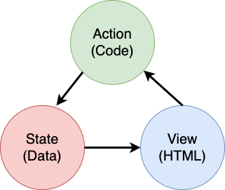

# Creare un'App Bancaria Parte 4: Concetti di Gestione dello Stato

## Quiz Pre-Lezione

[Quiz Pre-Lezione](https://calm-wave-0d1a32b03.1.azurestaticapps.net/quiz/47?loc=it)

### Introduzione

Man mano che un'applicazione web cresce, diventa una sfida tenere traccia di tutti i flussi di dati. Quale codice riceve i dati, quale pagina li consuma, dove e quando deve essere aggiornata ... è facile ritrovarsi con codice disordinato e difficile da mantenere. Ciò è particolarmente vero quando è necessario condividere dati tra diverse pagine della propria app, ad esempio i dati dell'utente. Il concetto di *gestione dello stato* è sempre esistito in tutti i tipi di programmi, ma poiché le app web continuano a crescere in complessità, ora è un punto chiave su cui riflettere durante lo sviluppo.

In questa parte finale, si esaminerà l'app creata per ripensare a come viene gestito lo stato, consentendo il supporto per l'aggiornamento del browser in qualsiasi momento e persistendo i dati tra le sessioni utente.

### Prerequisito

È necessario aver completato la parte di [recupero dei dati](../../3-data/translations/README.it.md) dell'app web per questa lezione. È inoltre necessario installare [Node.js](https://nodejs.org) ed [eseguire l'API del server](../../api/translations/README.it.md) in locale in modo da ottenere i dati dell'account.

Si può verificare che il server funzioni correttamente eseguendo questo comando in un terminale:

```sh
curl http://localhost:5000/api
# -> dovrebbe restituire "Bank API v1.0.0" come risultato
```

---

## Ripensare la gestione dello stato

Nella [lezione precedente](../../3-data/translations/README.it.md), è stato introdotto un concetto basico di stato nell'app con la variabile globale `account` che contiene i dati bancari per l'utente attualmente connesso. Tuttavia, l'attuale implementazione presenta alcuni difetti. Si provi ad aggiornare la pagina quando ci si trova nella pagina del cruscotto. Che cosa accade?

Ci sono 3 problemi con il codice corrente:

- Lo stato non è persistente, poiché un aggiornamento del browser riporta alla pagina di accesso.
- Esistono più funzioni che modificano lo stato. Man mano che l'app cresce, può essere difficile tenere traccia delle modifiche ed è facile dimenticare di aggiornarne una.
- Lo stato non viene cancellato, quando si fa clic su *Logout* i dati dell'account sono ancora lì anche se si è nella pagina di accesso.

Si potrebbe aggiornare il codice per affrontare questi problemi uno per uno, ma creerebbe più duplicazioni del codice e renderebbe l'app più complessa e difficile da mantenere. Oppure ci si potrebbe fermare per qualche minuto e ripensare alla strategia.

> Quali problemi si stanno davvero cercando di risolvere qui?

La [gestione dello stato](https://en.wikipedia.org/wiki/State_management) consiste nel trovare un buon approccio per risolvere questi due problemi particolari:

- Come mantenere comprensibile il flusso di dati in un'app?
- Come mantenere i dati di stato sempre sincronizzati con l'interfaccia utente (e viceversa)?

Una volta che ci si è preso cura di questi, qualsiasi altro problema che si potrebbe avere potrebbe essere già stato risolto o essere diventato più facile da sistemare. Ci sono molti possibili approcci per risolvere questi problemi, ma si andrà con una soluzione comune che consiste nel **centralizzare i dati e le modalità per cambiarli**. Il flusso di dati andrebbe così:



> Non verrà trattata qui la parte in cui i dati attivano automaticamente l'aggiornamento della vista, poiché è legato a concetti più avanzati di [programmazione reattiva](https://en.wikipedia.org/wiki/Reactive_programming). È un buon argomento da sviluppare successivamente se si è pronti per un'immersione profonda.

✅ Esistono molte librerie con approcci diversi alla gestione dello stato, [Redux](https://redux.js.org)  è un'opzione popolare. Dare un'occhiata ai concetti e ai modelli utilizzati spesso è un buon modo per apprendere quali potenziali problemi si potrebbe dover affrontare nelle grandi app web e come risolverli.

### Attività

Si inizierà con un po' di refattorizzazione. Sostituire la dichiarazione di `account` :

```js
let account = null;
```

Con:

```js
let state = {
  account: null
};
```

L'idea è *centralizzare* tutti i dati dell'app in un unico oggetto di stato. Per ora c'è solo `account` nello stato, quindi non cambia molto, ma crea un percorso per le evoluzioni.

Si devono anche aggiornare le funzioni che lo utilizzano. Nelle funzioni `register()` e `login()` , sostituire `account = ...` con `state.account = ...`;

Nella parte superiore della funzione `updateDashboard()`, aggiungere questa riga:

```js
const account = state.account;
```

Questa refattorizzazione di per sé non ha portato molti miglioramenti, ma l'idea era di gettare le basi per i prossimi cambiamenti.

## Tenere traccia delle modifiche ai dati

Ora che si è impostato l'oggetto `state` per memorizzare i dati, il passaggio successivo è centralizzare gli aggiornamenti. L'obiettivo è rendere più facile tenere traccia di eventuali modifiche e quando si verificano.

Per evitare che vengano apportate modifiche all'oggetto `state` è anche una buona pratica considerarlo [*immutabile*](https://en.wikipedia.org/wiki/Immutable_object), nel senso che non può essere modificato affatto. Significa anche che si deve creare un nuovo oggetto di stato se si vuole cambiare qualcosa in esso. In questo modo, si crea una protezione [dagli effetti collaterali](https://it.wikipedia.org/wiki/Effetto_collaterale_(informatica)) potenzialmente indesiderati e si aprono possibilità per nuove funzionalità nella propria app come l'implementazione di funzioni di annulla/ripristina, semplificando anche il debug. Ad esempio, è possibile registrare tutte le modifiche apportate allo stato e conservare una cronologia delle modifiche per comprendere l'origine di un bug.

In JavaScript, si può  utilizzare [`Object.freeze()`](https://developer.mozilla.org/it/docs/Web/JavaScript/Reference/Global_Objects/Object/freeze) per creare una versione immutabile di un oggetto. Se si prova ad apportare modifiche a un oggetto immutabile, verrà sollevata un'eccezione.

✅ Si conosce la differenza tra un oggetto *shallow* e uno *deep* immutabile? Si può leggere [qui](https://developer.mozilla.org/docs/Web/JavaScript/Reference/Global_Objects/Object/freeze#What_is_shallow_freeze) per saperne di più.

### Attività

Creare una nuova funzione `updateState()` :

```js
function updateState(property, newData) {
  state = Object.freeze({
    ...state,
    [property]: newData
  });
}
```

In questa funzione, si crea un nuovo oggetto di stato e si copiano i dati dallo stato precedente utilizzando l' [*operatore spread (`...`)*](https://developer.mozilla.org/it/docs/Web/JavaScript/Reference/Operators/Spread_syntax). Quindi si sovrascrive una particolare proprietà dell'oggetto state con i nuovi dati usando la [notazione tra parentesi quadre](https://developer.mozilla.org/docs/Web/JavaScript/Guide/Working_with_Objects#Objects_and_properties) `[property]` per l'assegnazione. Infine, si blocca l'oggetto per impedire modifiche utilizzando `Object.freeze()`. Per ora si ha solo la proprietà `account` memorizzata nello stato, ma con questo approccio si possono aggiungere tutte le proprietà che servono nello stato.

Si aggiornerà anche l'inizializzazione di `state` per assicurarsi che anche lo stato iniziale sia congelato:

```js
let state = Object.freeze({
  account: null
});
```

Successivamente, aggiornare la funzione `register` sostituendo l'istruzione `state.account = result;` con:

```js
updateState('account', result);
```

Fare lo stesso con la funzione `login` , sostituendo `state.account = data;` con:

```js
updateState('account', data);
```

Si coglie ora l'occasione per risolvere il problema della mancata cancellazione dei dati dell'account quando l'utente fa clic su *Logout*.

Creare una nuova funzione `logout ()`:

```js
function logout() {
  updateState('account', null);
  navigate('/login');
}
```

In `updateDashboard()`, sostituire il reindirizzamento `return navigate('/ login');` con `return logout()`;

Provare a registrare un nuovo account, a disconnettersi e ad accedere nuovamente per verificare che tutto funzioni ancora correttamente.

> Suggerimento: si può dare un'occhiata a tutti i cambiamenti di stato aggiungendo `console.log (state)` nella parte inferiore di `updateState()` e aprendo la console negli strumenti di sviluppo del  browser.

## Persistere lo stato

La maggior parte delle app web  deve conservare i dati per poter funzionare correttamente. Tutti i dati critici vengono solitamente archiviati su un database e accessibili tramite un'API del server, come nel nostro caso i dati dell'account utente. Ma a volte è anche interessante mantenere alcuni dati sulla parte client dell'app in esecuzione nel browser, per una migliore esperienza utente o per migliorare le prestazioni di caricamento.

Quando si vuole mantenere i dati nel browser, ci sono alcune domande importanti da porsi:

- *I dati sono sensibili?* Si dovrebbe evitare di memorizzare dati sensibili sul client, come le password degli utenti.
- *Per quanto tempo si ha bisogno di conservare questi dati?* Si prevede di accedere a questi dati solo per la sessione corrente o si desidera che vengano memorizzati per sempre?

Esistono diversi modi per archiviare le informazioni all'interno di un'app web, a seconda di ciò che si desidera ottenere. Ad esempio, si possono utilizzare gli URL per memorizzare una interrogazione di ricerca e renderla condivisibile tra gli utenti. Si possono anche utilizzare i [cookie HTTP](https://developer.mozilla.org/it/docs/Web/HTTP/Cookies) se i dati devono essere condivisi con il server, come le informazioni di [autenticazione](https://it.wikipedia.org/wiki/Autenticazione) .

Un'altra opzione è utilizzare una delle tante API del browser per la memorizzazione dei dati. Due di loro sono particolarmente interessanti:

- [`localStorage`](https://developer.mozilla.org/it/docs/Web/API/Window/localStorage): un [archivio chiave/valore](https://en.wikipedia.org/wiki/Key%E2%80%93value_database) che consente di persistere i dati specifici del sito Web corrente in diverse sessioni. I dati salvati in esso non scadono mai.
- [`sessionStorage`](https://developer.mozilla.org/it/docs/Web/API/Window/sessionStorage): funziona come `localStorage` tranne per il fatto che i dati in esso memorizzati vengono cancellati al termine della sessione (alla chiusura del browser).

Notare che entrambe queste API consentono solo di memorizzare [stringhe](https://developer.mozilla.org/it/docs/Web/JavaScript/Reference/Global_Objects/String). Se si desidera archiviare oggetti complessi, si dovranno serializzare nel formato [JSON](https://developer.mozilla.org/it/docs/Web/JavaScript/Reference/Global_Objects/JSON) utilizzando [`JSON.stringify()`](https://developer.mozilla.org/it/docs/Web/JavaScript/Reference/Global_Objects/JSON/stringify).

✅ Se si desidera creare un'app web che non funziona con un server, è anche possibile creare un database sul client utilizzando l' [`API` IndexedDB](https://developer.mozilla.org/it/docs/Web/API/IndexedDB_API). Questo è riservato a casi d'uso avanzati o se è necessario archiviare una quantità significativa di dati, poiché è più complesso da usare.

### Attività

Si vuole che gli utenti rimangano collegati fino a quando non fanno clic esplicitamente sul pulsante *Logout* , quindi si utilizzerà `localStorage` per memorizzare i dati dell'account. Per prima cosa, si definisce una chiave che verrà usata per memorizzare i  dati.

```js
const storageKey = 'savedAccount';
```

Aggiungere quindi questa riga alla fine della funzione `updateState()`:

```js
localStorage.setItem(storageKey, JSON.stringify(state.account));
```

Con questo, i dati dell'account utente verranno mantenuti e sempre aggiornati poiché si sono centralizzati in precedenza tutti gli aggiornamenti di stato. È qui che si inizia a trarre vantaggio da tutte le rifattorizzazioni precedenti 🙂.

Poiché i dati vengono salvati, ci si deve anche occupare di ripristinarli quando l'app viene caricata. Dato che si inizierà ad avere più codice di inizializzazione, potrebbe essere una buona idea creare una nuova funzione di inizializzazione `init` , che includa anche il codice precedente nella parte inferiore di `app.js`:

```js
function init() {
  const savedAccount = localStorage.getItem(storageKey);
  if (savedAccount) {
    updateState('account', JSON.parse(savedAccount));
  }

  // Il codice di inizializzazione precedente
  window.onpopstate = () => updateRoute();
  updateRoute();
}

init();
```

Qui si recuperano i dati salvati e, se ce ne sono, si aggiorna lo stato di conseguenza. È importante farlo *prima* di aggiornare la rotta, poiché potrebbe esserci del codice che si basa sullo stato durante l'aggiornamento della pagina.

Si può anche rendere la pagina del *cruscotto* la pagina predefinita dell'applicazione, poiché ora si sta persistendo i dati dell'account. Se non vengono trovati dati, il cruscotto si occupa comunque di reindirizzare alla pagina di *Login* . In `updateRoute()`, sostituire le istruzioni di contingenza `return navigate ('/login');` con `return navigate ('/dashboard') ;`.

Ora accedere all'app e provare ad aggiornare la pagina, si dovrebbe rimanere sul cruscotto. Con quell'aggiornamento ci si è presi cura di tutti i problemi iniziali...

## Aggiornare i dati

...Si potrebbe uttavia anche averne creato uno nuovo. Oops!

Andare al cruscotto utilizzando l'account `test`, quindi eseguire questo comando su un terminale per creare una nuova transazione:

```sh
curl --request POST \
     --header "Content-Type: application/json" \
     --data "{ \"date\": \"2020-07-24\", \"object\": \"Bought book\", \"amount\": -20 }" \
     http://localhost:5000/api/accounts/test/transactions
```

Provare subito ad aggiornare la pagina del cruscotto nel browser. Che cosa accade? Si vede la nuova transazione?

Lo stato viene mantenuto indefinitamente grazie a `localStorage`, ma ciò significa anche che non viene aggiornato fino a quando non si esce dall'app e si accede di nuovo!

Una possibile strategia per risolvere questo problema è ricaricare i dati dell'account ogni volta che viene caricato il cruscotto, per evitare lo stallo dei dati.

### Attività

Creare una nuova funzione `updateAccountData`:

```js
async function updateAccountData() {
  const account = state.account;
  if (!account) {
    return logout();
  }

  const data = await getAccount(account.user);
  if (data.error) {
    return logout();
  }

  updateState('account', data);
}
```

Questo metodo controlla che si sia attualmente collegati, quindi ricarica i dati dell'account dal server.

Creare un'altra funzione chiamata `refresh`:

```js
async function refresh() {
  await updateAccountData();
  updateDashboard();
}
```

Questa aggiorna i dati dell'account, quindi si occupa dell'aggiornamento dell'HTML della pagina del cruscotto. È ciò che si deve chiamare quando viene caricata la rotta del cruscotto (dashboard). Aggiornare la definizione del percorso con:

```js
const routes = {
  '/login': { templateId: 'login' },
  '/dashboard': { templateId: 'dashboard', init: refresh }
};
```

Provare a ricaricare il cruscotto ora, dovrebbe visualizzare i dati dell'account aggiornati.

---

## 🚀 Sfida

Ora che i dati dell'account vengono ricaricati ogni volta che viene caricato il cruscotto, si pensa che sia ancora necessario persistere *tutti i dati dell'account* ?

Provare a lavorare insieme per cambiare ciò che viene salvato e caricato da `localStorage` per includere solo ciò che è assolutamente necessario per il funzionamento dell'app.

## Quiz Post-Lezione

[Quiz post-lezione](https://calm-wave-0d1a32b03.1.azurestaticapps.net/quiz/48?loc=it)

## Compito

[Implementare la finestra di dialogo "Aggiungi transazione"](assignment.it.md)

Ecco un esempio di risultato dopo aver completato il compito:


