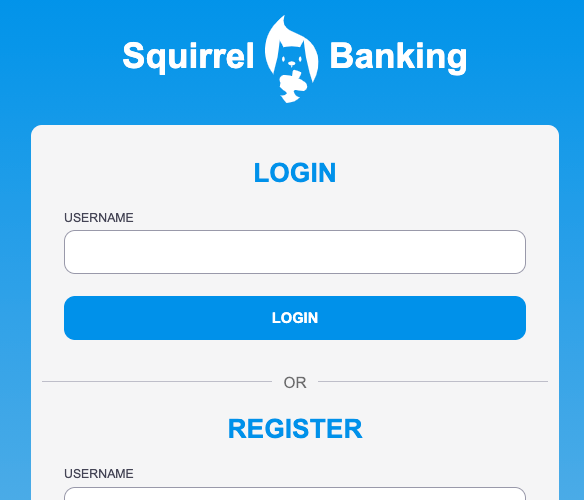

# :dollar: Créer une banque

Dans ce projet, vous apprendrez à créer une banque fictive. Ces leçons comprennent des instructions sur la façon de mettre en page une application Web et de fournir des itinéraires, de construire des formulaires, de gérer l'état et de récupérer les données d'une API à partir de laquelle vous pouvez récupérer les données de la banque.

|  |  |
|--------------------------------|--------------------------------|

## Leçons

1. [Modèles HTML et itinéraires dans une application Web](../1-template-route/translations/README.fr.md)
2. [Créer un formulaire de connexion et d'inscription](../2-forms/translations/README.fr.md)
3. [Méthodes d'extraction et d'utilisation des données](../3-data/translations/README.fr.md)
4. [Concepts de gestion de l'État](../4-state-management/translations/README.fr.md)

### Crédits

Ces leçons ont été rédigées avec :hearts: par [Yohan Lasorsa](https://twitter.com/sinedied).

Si vous souhaitez apprendre comment créer l'[API serveur](../api/translations/README.fr.md) utilisée dans ces leçons, vous pouvez suivre [cette série de videos](https://aka.ms/NodeBeginner) (en particulier les vidéos 17 à 21).

Vous pouvez également jeter un coup d'œil à [ce tutoriel d'apprentissage interactif](https://aka.ms/learn/express-api). 
