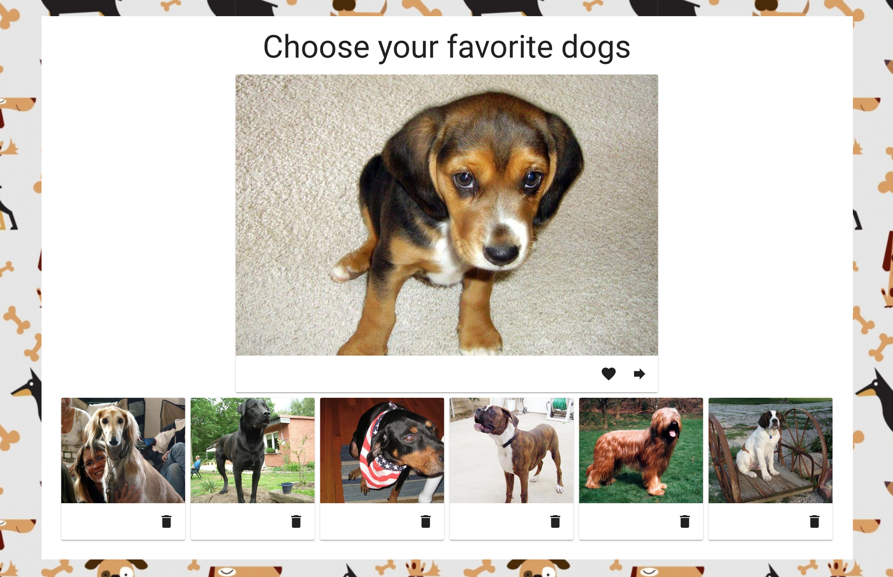

# A Taste of Vue: Build A Simple Pet Fetching Web App

| **Project&nbsp;Goal**           | Get started with Vue.js basics and simple API calls                                                                                       |
| ------------------------------- | ----------------------------------------------------------------------------------------------------------------------------------------- |
| **What&nbsp;you’ll&nbsp;learn** | Setting up your Vue app, components basics, performing simple REST API calls using Axios                                                  |
| **Tools you’ll need**           | A modern browser like Chrome. A [GitHub](https://github.com) account, [VS Code editor](https://code.visualstudio.com/), and the [Vue CLI installed](https://cli.vuejs.org/). |
| **Time needed to complete**     | 1 hour                                                                                                                                    |
| **Just want to try the app?**   | [CodeSandbox link](https://codesandbox.io/s/web-1-mini-workshop-koj8w)                                                                    |

# Instructions

## Scaffold your app

We'll start from scratch on your local computer. Navigate to an area where you want to create your new web app and use your terminal or command line to use the Vue CLI to scaffold an app. Type: `vue create my-pet-app`. A folder with that name will be created in your specified location. 

Answer the CLI questions to create a Vue 2* app:

`Default ([Vue 2] babel, eslint)`

* Vue 3 is out and many folks are using it, but the styling library we use in this tutorial does not yet support it yet, so we will stick to Vue 2 for now.

Your app is scaffolded and initialized. Navigate to the folder and run the app as it looks so far:

`cd my-pet-app && npm run serve`

Your app should open in a browser window - you'll see the Vue logo and some text.

Open the folder in VS Code. You'll see several files.

---

We're going to build an application to load random dog images and store them to a favorites list:



Take a look at the code that was scaffolded the CLI for a basic Vue.js app. Navigate to `src/main.js`. This is the main starting point of a Vue.js app. Note that in this file you import parts of Vue from its npm package: `import { createApp } from 'vue'";`. The app also imports other needed dependencies from npm to build the app. You can always check out the root `package.json` to find out which dependencies are needed.

`main.js` also initializes the app as a new Vue.js app, imports the `App.vue` file and sets the div into which the app code will be injected.

```js
import Vue from 'vue'
import App from './App.vue'

Vue.config.productionTip = false

new Vue({
  render: h => h(App),
}).$mount('#app')
```

Open up `App.vue` in the `src` folder. In this file, the 'home' component is built. It contains the three main parts of a Vue.js Single File Component (SFC): a template, a script block, and a style block.

Note the first div in the template block has the id of 'app' - this is the div where the app code will be injected. There's also a `<HelloWorld>` component included underneath the logo image. This is an example of an SFC being included into `App.vue`.

Open `components/HelloWorld.vue` and you'll find the source of the list of links that appears embedded in `App.vue`. This file also includes a script block with a `msg` variable and some more styles in a `<style>` block.

We're going to rip this sample app apart and build a new one! Let's get started.

## Add the Styles

Let's start in `App.vue`, since we don't have to make any changes to `main.js`. Add the following style block at the bottom of the file, replacing the current `<style>` block:

```css
<style>
img {
  max-width: 100%;
}

h1 {
  padding-bottom: 15px;
}

.dogs-layout {
  width: 100%;
  background: #fff center repeat;
  background-image: url("https://github.com/FrontEndFoxes/projects/blob/main/petshop/images/bg3.jpg?raw=true");
}

.dogs-overlay {
  width: 100%;
  padding: 20px;
  background-color: #fff;
  display: flex;
  flex-direction: column;
  align-items: center;
}

@media (max-width: 768px) {
  .dogs-overlay {
    margin: 0;
  }
}

.dog-card {
  width: 100%;
  max-width: 600px;
}
</style>
```

> 💡 Notice we don't use `<scoped>` as part of the style block. The 'scoped' keyword ensures that your styles will remain valid only for the current SFC, but we're going to make these styles universal.

This style block uses a path to an external image hosted on GitHub, rather than to a relative path. This is because we're quickly styling the app; normally you'd just add an image on a relative path such as `/images/myImage.png`. If you want to, download a different background image to your app and store it in the assets folder. You can reference it by naming it appropriately and editing the `.dogs-layout` class: `background-image: url("assets/local-background-file.png");`

Adding the stylesheet didn't do much to our template except break the existing styles. Let's fix the template!


## Install Vuetify

Before we edit the template, we're going to install Vuetify. Vuetify is a cool library that gives a Material Design styling to your Vue apps.

> 💡 Vuetify is a semantic component framework for Vue. It aims to provide clean, semantic and reusable components for building your application. You can find full documentation for it [here](https://vuetifyjs.com/en/getting-started/quick-start)

Install it by stopping the app in the terminal (ctrl-c) and typing `npm i vuetify`.

Check whether the dependency is installed by opening `package.json` and checking the "dependencies" object. It should look like this:

```json
"dependencies": {
    "core-js": "^3.6.5",
    "vue": "^2.6.11",
    "vuetify": "^2.4.9"
},
```
> Don't forget to restart your app: `npm run serve`.

Vuetify works via a plugin structure. In the `/src` folder of your project, create a new folder called `plugins` and inside that a new file called `vuetify.js`.

In the new `vuetify.js` file, add this code to bootstrap the plugin:

```js
import Vue from 'vue';
import Vuetify from 'vuetify';
import 'vuetify/dist/vuetify.min.css';
Vue.use(Vuetify);

export default new Vuetify();
```

Next, initialize Vuetify by opening `main.js` and adding these lines under the second `import` (line 3):

```js
import vuetify from '@/plugins/vuetify';
```

Then, change the Vue initialization at the bottom of `main.js` to this:

```js
new Vue({
	vuetify,
	render: (h) => h(App),
}).$mount('#app');
```

This ensures that Vuetify's themes and components will be available throughout the Vue app.

We are going to use icons in this app, so we also have to add Material icons into the `head` part of the `index.html` file. This file is in the `public` folder. Insert this line after the `<title>` tag:

```html
<link href="https://fonts.googleapis.com/css?family=Roboto:100,300,400,500,700,900|Material+Icons" rel="stylesheet" />
```

Let's also change the page title to `Dog Lover`. To do so, we have to change the content of the `title` tag:

```html
<title>Dog Lover</title>
```

Then, overwrite the current template in `App.vue` with this markup:

```html
<template>
	<v-app>
		<v-main class="dogs-layout">
			<v-container fill-height>
				<div class="dogs-overlay">
					<h1 class="display-2 text-xs-center">Choose your favorite dogs</h1>
					<v-card class="dog-card">
						<v-img height="400px"></v-img>
						<v-card-actions>
							<v-spacer></v-spacer>
							<v-btn icon>
								<v-icon>favorite</v-icon>
							</v-btn>
							<v-btn icon>
								<v-icon>forward</v-icon>
							</v-btn>
						</v-card-actions>
					</v-card>
				</div>
			</v-container>
		</v-main>
	</v-app>
</template>
```

Your app should refresh (if it doesn't, use the manual refresh button in the app preview address bar). Wow, that made a big change!

> 💡 Note the use of `<v-app>` in this template markup - this is a requirement of Vuetify and is a sure sign you'll have a Vuetify-themed app. We're also using a bunch of Vuetify layout elements like `v-container` and UI components like `v-card` and `v-btn`.

## Add some data

At this point, we need to start populating our UI with some data. First thing we want to do is to display a dog image inside our `v-card`. Let's add a static link just to test how it looks. In `App.vue`'s template, change the `src` property of `v-img`:

```html
<v-img height="400px" src="https://images.dog.ceo/breeds/chihuahua/n02085620_3407.jpg"></v-img>
```

How cute! 🐶

But the idea is to make this link dynamic, so it's time to create your first Vue variable. First, you have to add `data()` to your Vue component. This function should return an object of our Vue variables. Let's create one in the `<script>` block. Overwrite the current `<script>` block in `App.vue`:

```js
<script>
export default {
  data() {
    return {
      currentDogLink: ""
    };
  }
};
</script>
```

> 💡 At this point you can remove the `HelloWorld.vue` file from the `components` folder as we won't need it.

Now you have a variable called `currentDogLink` and its default value is an empty string. We will use this variable to provide a link to a current dog in `v-img`. First, we will set the `currentDogLink` value by overwriting the data block we just added in `App.vue`:

```js
data() {
  return {
    currentDogLink: "https://images.dog.ceo/breeds/chihuahua/n02085620_3407.jpg"
  };
}
```

Now we have to change the template to make the `src` property _dynamic_ so it can use the value of the variable we just populated above. To do this we need a `v-bind` directive or its shortcut, `:`. Again in `App.vue`, edit the `<v-img>` tag to remove its hard-coded value:

```html
<v-img height="400px" :src="currentDogLink"></v-img>
```

> 💡 The `v-bind` directive dynamically binds one or more attributes, or a component prop to an expression. That little `:` makes all the difference!

Great! Now it's time to load some dogs from an API!


## Add Axios

To perform API calls we will need a library called [Axios](https://github.com/axios/axios). It's a promise-based HTTP client that works both in the browser and in other node.js environments.

> 💡 Originally, Vue supported its own way of making API calls using .ajax; but this resource was deprecated as Axios's standalone library worked very well for this purpose, removing the need for an integrated solution. Read more about this decision [here](https://medium.com/the-vue-point/retiring-vue-resource-871a82880af4).

First, add Axios's library to your project dependencies. To do so using the command line, stop your app (ctrl-c) and type `npm i axios`. Install the latest version.

Import Axios into the component where we will perform our API call - `App.vue`. In that component's script block, add this line right under `<script>`:

```js
import axios from 'axios';
```

At this point your script part of `App.vue` should look like this:

```js
<script>
import axios from "axios";
export default {
  data() {
    return {
      currentDogLink:
        "https://images.dog.ceo/breeds/chihuahua/n02085620_3407.jpg"
    };
  }
};
</script>
```

Now we are ready to load an image from the API.

## Call the API

Let's perform our first API call. To do so, we will create a `loadNewDog` _method_ inside our component.

> 💡 The `methods` property is a list of functions that hang off of an object — typically the Vue instance itself or a Vue component.

Let's add it right after the `data` function:

```js
data() {
  return {
    currentDogLink:
      "https://images.dog.ceo/breeds/chihuahua/n02085620_3407.jpg"
  };
},
methods: {
 loadNewDog() {}
}
```

For now this method does nothing but we want it to load a new dog from the API. First we have to check which endpoint we have to use. Looking at the API's [documentation](https://dog.ceo/dog-api/), we learn that we need to use `https://dog.ceo/api/breeds/image/random` as our endpoint. It will provide a random dog image.

To perform a GET request Axios uses the `axios.get` method. The result will be a JavaScript promise, so we have to provide success and failure callbacks to manage its lifecycle. For now, let's simply print the query result to console. Still in `App.vue`, edit the `loadNewDog(){}` method by placing this snippet between the curly brackets:

```js
axios
	.get('https://dog.ceo/api/breeds/image/random')
	.then((response) => {
		console.log(response);
	})
	.catch((error) => {
		console.log(error);
	});
```

We want a new image to replace the old one right when the component is created, so let's add a `created()` hook right after `methods`:

```js
created() {}
```

> 💡 Note: Make sure to add a comma after the methods object and then add the created() hook!

> This is our app's first lifecycle hook! These are very useful when you want fine control over when to run blocks of code. Read more [here](https://vuejs.org/v2/guide/instance.html#Instance-Lifecycle-Hooks)

Inside the created hook we will call our method.

```js
created() {
  this.loadNewDog();
}
```

Now after clicking the refresh button in the browser window, you should see an object in your console. Drill into it by clicking its left-hand arrow. We are interested in its `data` field. You can see we have a status `success` and a message with an image URL.

## Use the API

Let's replace our `currentDogLink` with the loaded one. At this point we can remove its static value:

```js
data() {
  return {
    currentDogLink: ""
  };
},
```

Inside the `loadNewDog` method instead of printing result to the console we will assign `response.data.message` (which is actually the image URL) to the `currentDogLink` property:

```js
loadNewDog() {
  axios
    .get("https://dog.ceo/api/breeds/image/random")
    .then(response => {
      this.currentDogLink = response.data.message;
    })
    .catch(error => {
      console.log(error);
    });
}
```

Now every time you refresh the page, you will have a shiny new dog image! 🎉

We also want to call the same method when the 'Next' arrow is clicked. Let's add a click handler to this button. We can use the `v-on` directive or its shortcut `@`. In the template, edit the "forward" icon `v-btn`:

```html
<v-btn icon @click="loadNewDog">
	<v-icon>forward</v-icon>
</v-btn>
```

Now we can load new images simply by clicking on the 'Next' button.

## Build the Favorites List

We want to let a user add dog images to a personal list of their favorites and show the gallery of these images right below our current dog view. To store the links we need one more data property - an array called `favoriteDogs`. Let's add it right after `currentDogLink` and make it empty by default:

```js
data() {
  return {
    currentDogLink: "",
    favoriteDogs: []
  };
},
```

To display the favorite dogs we should make changes to our template. Let's add the following code snippet right after the closing `</v-card>` tag

```html
<v-container grid-list-md fluid>
	<v-layout wrap>
		<v-flex xs6 sm4 md2>
			<v-card class="dog-card">
				<v-img height="150px"></v-img>
				<v-card-actions>
					<v-spacer></v-spacer>
					<v-btn icon>
						<v-icon>delete</v-icon>
					</v-btn>
				</v-card-actions>
			</v-card>
		</v-flex>
	</v-layout>
</v-container>
```

You can see an empty card with a 'Delete' button right after the current dog view. Now we need to find a way to show `favoriteDogs` items inside of these cards.

To render a list of items based on an array Vue has a `v-for` directive, which will iterate through this array and render each item. Let's add this directive to our opening `v-flex` element that will show the array of favorite cards in the new container you just added:

```html
<v-flex xs6 sm4 md2 v-for="(pet, index) in favoriteDogs" :key="pet"></v-flex>
```

Here `pet` is the reference to the _current array element_ and `index` is the _index of this element_ inside the array.

> 💡 Remember, we chose this name inside the directive; if we had written `v-for="(dog, number) in favoriteDogs"` each item would be called `dog` and its index would be called `number`).

To properly loop over your array of favorite dogs and append another one, you need to provide a unique key attribute for each item. In our case, the `pet` itself will be the key.

You can see that our empty card disappeared. It's fine! We have an empty `favoriteDogs` array so there's simply nothing to render right now.

One thing left to do is to bind `pet` (which will be the image link) to the `src` property of the `v-img` component in the cards you're building:

```html
<v-img height="150px" :src="pet"></v-img>
```

Now it's time to like some dogs 💖🐶!

## Adding Dogs to Favorites

We will create a new method called `addToFavorites`. It will add the value of `currentDogLink` to the `favoriteDogs` array (JavaScript has a `push` array method for this purpose). Let's place it after the `loadNewDog` one _(don't miss the comma!)_

```js
addToFavorites() {
  this.favoriteDogs.push(this.currentDogLink);
}
```

And of course we need to bind it to the 'Like' button in the top card:

```html
<v-btn icon @click="addToFavorites">
	<v-icon>favorite</v-icon>
</v-btn>
```

Now try to click on the 'favorite' button! You can see how our gallery is filling with the dogs' images 🖼️

There is one issue: now we can add one image a few times. To prevent this we should check if the `currentDogLink` is already inside the `favoriteDogs` array and if it's is, we will disable the 'favorite' button. Instead of placing this complex logic inside the template, we will create a _computed_ property.

> 💡 Computed properties can be used to do quick calculations of properties that are displayed in the view. These calculations will be cached and will only update when their dependencies are changed.

Let's add `computed` right after the `created()` hook (don't forget the comma after the close of `created()`) and create a property named `isAlreadyInFavorites` in it.

```js
  computed: {
    isAlreadyInFavorites() {}
  }
```

Any computed property should be a function returning the result of calculations. Let's check the index of `currentDogLink` inside the `favoriteDogs` array. If it is greater than -1 (in other words if the array contains such an element), the function will return `true`, otherwise it will return `false`:

```js
computed: {
	isAlreadyInFavorites() {
	  return this.favoriteDogs.indexOf(this.currentDogLink) > -1;
	}
}
```

Now we can add a dynamic `disabled` attribute to the 'Like' button in the top card and set it equal to `isAlreadyInFavorites`.

```html
<v-btn icon @click="addToFavorites" :disabled="isAlreadyInFavorites">
	<v-icon>favorite</v-icon>
</v-btn>
```

Try to add the dog to favorites. Now you can see that the 'favorite' icon is greyed-out and you cannot click it again.

## Removing Dogs from Favorites

What if you stopped liking one of the dogs' images? In this unlikely event, you will need a way to remove it from the `favoriteDogs` array. We need one more method for this, so let's add it after the `addToFavorites` (add a comma after `addToFavorites` closing bracket):

```js
removeFromFavorites() {}
```

Of course we should specify somehow what dog we want to remove from the array. Fortunately, we have the `index` parameter. Let's pass it to our method and remove the element with the given index from the `favoriteDogs` array:

```js
removeFromFavorites(index) {
  this.favoriteDogs.splice(index, 1);
}
```

> 💡 Here the splice() method changes the contents of an array by removing existing elements. The first argument is the index of the element we want to start with and the second argument is the number of elements we want to remove.

Now we have to bind this new method to the 'Delete' button with a click handler:

```html
<v-btn icon @click="removeFromFavorites(index)">
	<v-icon>delete</v-icon>
</v-btn>
```

> 💡 Don't forget to pass `index` to the `removeFromFavorites` method! When we don't pass any parameters, we can simply skip the brackets as we did for the `addToFavorites` method.

Try to add and remove some dogs from favorites. IT WORKS!

**🎊Congratulations, you've finished the base project!🎊**

## Push your work to a repository on your GitHub account

**TODO - add instructions here on pushing to GH

## Supplement 1: Creating a Dog Component

At this point we want to abstract a single dog card from the Favorites grid into a separate component to learn how parent and child components communicate.

We have a `components` folder but for now it's empty. Let's create a new file here and name it `Dog.vue`.

Open this file and add `<template></template>` and `<script></script>` tags. Now our file looks this way:

```html
<template> </template>

<script></script>
```

Now copy the whole `v-card` component that contains the favorite dogs (it's near the bottom, and has the css class `dog-card`) from `App.vue` and paste it inside the template tag. You can delete it from `App.vue`.

We now need a way to pass the dog image we want to view from the parent to the child. To do so, Vue uses `props`.

> 💡 Props are custom attributes you can register on a component. When a value is passed to a prop attribute, it becomes a \_prop_erty on that component instance. In our case the `Dog` component will have a `dog` property, passed from its parent `App` component.

Let's add a `props` option to our `Dog.vue` component. First, we need to create an export statement inside our `script` tag (so later we will be able to import our `Dog` component inside the `App` one). Add this code block to `Dog.vue`:

```js
<script>export default {}</script>
```

Now we can add a `props` option to this object and a prop `dog`:

```js
<script>
  export default {
    props: {
      dog: {
        type: String
      }
    }
  };
</script>
```

Here we are also specifying the type of our dog - it will be a string containing the dog image URL.

In our template in `Dog.vue` we should replace `pet` with `dog`, because we don't have any `pet`s inside the `Dog` component, only a passed `dog` property. Now our template should look like this:

```html
<template>
	<v-card class="dog-card">
		<v-img height="150px" :src="dog"></v-img>
		<v-card-actions>
			<v-spacer></v-spacer>
			<v-btn icon @click="removeFromFavorites(index)">
				<v-icon>delete</v-icon>
			</v-btn>
		</v-card-actions>
	</v-card>
</template>
```

Now let's move back to our `App.vue` component and make some changes. First of all we should import our newly created `Dog` component into `App.vue`. Add this string before the `export default` statement in the `<script>` block:

```js
import Dog from './components/Dog';
```

Now we have to 'explain' to the `App` component that it has a child component inside it. Vue uses a `components` option for this. Let's add a component option above the `data()` one:

```js
export default {
  components: {
    appDog: Dog
  },
  data() {
    return {
      currentDogLink: "",
      favoriteDogs: []
    };
  },
```

> 💡 For each property in the components object, the key will be the name of the custom element, while the value will contain the options object for the component

> 💡 For the component name you can either use a camel-case (`appDog`) or kebab-case (`'app-dog'`). Keep in mind that a camel-case name will be 'translated' to kebab-case in HTML tag names. So we will use the HTML custom tag `<app-dog>` and it will render a `Dog` component.

In `App.vue`, place the custom tag in the space where you deleted the card earlier, overwriting the `<v-flex>` tag:

```html
<v-flex xs6 sm4 md2 v-for="(pet, index) in favoriteDogs" :key="pet">
	<app-dog></app-dog>
</v-flex>
```

We have to pass a `dog` prop to our `Dog` component. It will be done with the familiar `v-bind` directive (remember, you can use its `:` shortcut). Edit the code you just added to `App.vue`:

```html
<v-flex xs6 sm4 md2 v-for="(pet, index) in favoriteDogs" :key="pet">
	<app-dog :dog="pet" @remove="removeFromFavorites(index)"></app-dog>
</v-flex>
```

Now if you try to add a dog to Favorites you will see the dogs in the grid again! But we have one issue: deleting a dog will cause a bunch of errors in console. The reason is we don't have a `removeFromFavorites` method inside the `Dog.vue` and it knows nothing about `index` as well.

Instead of using the method, we will replace it with an _event emitter_ to the `delete` button inside the Dog component.

```html
<v-btn icon @click="$emit('remove')"></v-btn>
```

By using `$emit`, we are sending a message to our parent component (in this case it's `App.vue`): 'Hi, something is happening here! Please read this message and react to it'.

Now when the `Dog` component emits the `remove` event (i.e. on 'Delete' button click), its parent `App` component will call `removeFromFavorites` method (which removes a certain dog from its favorites array).

**🎊You've finished Supplement 1!🎊**

## Supplement 2: Add Animations

Now let's make our application more appealing by adding some animation effects to it.

> 💡 Vue provides a `transition` wrapper component, allowing you to add entering/leaving transitions for any element or component in the following contexts:
> -   Conditional rendering (using `v-if`)
> -   Conditional display (using `v-show`)
> -   Dynamic components
> -   Component root nodes

Let's try to animate the image of the current dog. First, we need to add a `v-if` directive to it to provide the proper context for the future transition. In `App.vue`, edit the main dog's card:

```html
<v-img v-if="currentDogLink" height="400px" :src="currentDogLink"></v-img>
```

But now `currentDogLink` will always return `true`! Let's set it to the empty string every time we're clicking the 'Next' button, so before the next image is loaded, `currentDogLink` will return `false`:

```js
loadNewDog() {
  this.currentDogLink = "";
  axios.get("https://dog.ceo/api/breeds/image/random").then(response => {
    this.currentDogLink = response.data.message;
  });
},
```

Now you can observe this ugly effect: the image disappears every time the user clicks 'Next'. We will fix it with the fade animation effect. Let's wrap the `v-img` in a `<transition>` tag and provide it with a name attribute `fade`.

```html
<transition name="fade">
	<v-img v-if="currentDogLink" height="400px" :src="currentDogLink"></v-img>
</transition>
```

This will give us a bunch of CSS classes starting from `fade-`. There will be `enter`/`leave` which is the position that the animation starts with on the first frame, `enter-active`/`leave-active` while the animation is running - this is the one you’d place the animation properties themselves on, and `enter-to`/`leave-to`, which specifies where the element should be on the last frame.

Now that we have our hooks, we can create the transition using them. Edit the CSS in `App.vue` by adding the following classes:

```css
.fade-enter-active,
.fade-leave-active {
	transition: opacity 1s ease;
}
.fade-enter,
.fade-leave-to {
	opacity: 0;
}
```

The `.fade-enter-active` and `.fade-leave-active` classes will be where we apply the actual transition. This isn't anything Vue-specific - just normal CSS. The `ease` property specifies a transition effect with a slow start, then fast, then ending slowly.

Now you can see that the dog picture has a nice fade effect when you click 'next'!

Let's also add some effects to our favorite dogs grid. To animate the list rendered with `v-for`, Vue uses the `transition-group` tag.

> 💡 Unlike `<transition>`, `transition-group` renders an actual element: a `<span>` by default. You can change the element that’s rendered with the tag attribute.
Elements inside are _always_ required to have a unique key attribute.

In `App.vue`, replace the `<v-layout>` component surrounding the `<app-dog>` nested component with `v-transition-group` and provide it with a proper tag attribute and class:

```html
<transition-group name="slide" tag="v-layout" class="wrap">
	<v-flex xs6 sm4 md2 v-for="(pet, index) in favoriteDogs" :key="pet">
		<app-dog :dog="pet" @remove="removeFromFavorites(index)"></app-dog>
	</v-flex>
</transition-group>
```

`transition-group` will render as a `v-layout` component now. The class `wrap` is needed to wrap grid elements to the next row (it replaces the `wrap` attribute of `v-layout`). We also gave our new transition a name `slide`.

Now we can use CSS classes to describe the slide transition - add these classes to the CSS in `App.vue`:

```css
.slide-enter-active {
	transition: all 0.3s ease;
}
.slide-enter,
.slide-leave-to {
	transform: translateX(10px);
	opacity: 0;
}
```

Great! We have a nice animation when we add a new dog to the grid. But there are no effects on delete. There is a `-move` class, which is added when items are changing positions. Like the other classes, its prefix will match the value of a provided `name` attribute (`slide` in our case). So we need to add some more styles:

```css
.slide-leave-active {
	position: absolute;
}

.slide-move {
	transition: transform 0.5s;
}
```

> 💡 Notice the `position: absolute` on items that are leaving! It's done to remove them from the natural flow, triggering the move transition on the rest of the items.

Now our list has a nice move animation after deleting its element!

**🎊You've finished Supplement 2!🎊**

##[Assignment: Build a new App](assignment.md)

## Authors

Made with ❤️ by Natalia Tepluhina, updated by Jen Looper
