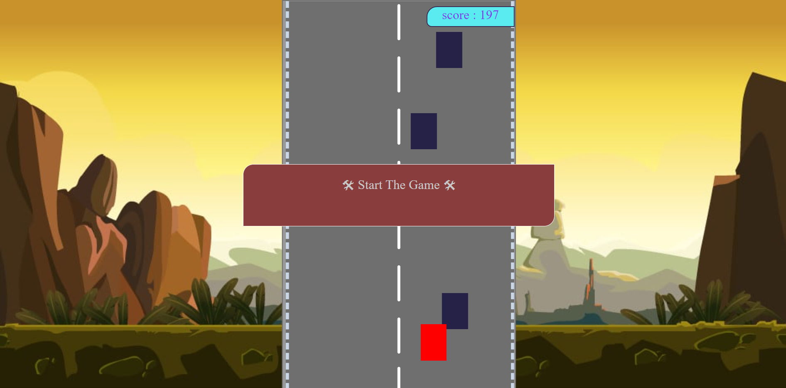

# Car Game 🚕
Everyone loves playing games. And in this project I am done with a simple game which can make you happpy.

---
## 🔗 Introduction
---
In this game, I have used simple `HTML` `CSS` and `JavaScript`. In `HTML` I created some `div` and some lines with some importaing informations. In `CSS` there is lines of code to design `HTML` to look web page better. `Javascript` is the file where all the structure is running. Programmed that for increasing the level of Game and it will be more harder to play.

---
### Car Game Screenshort

* Red car is the player car 
* Blue cars are enemies and you need to save your car from enemies

---
Written with ♥️ by [Akshay Kumar Kushwaha](https://github.com/xiakshay)

🙏 Thank You 

