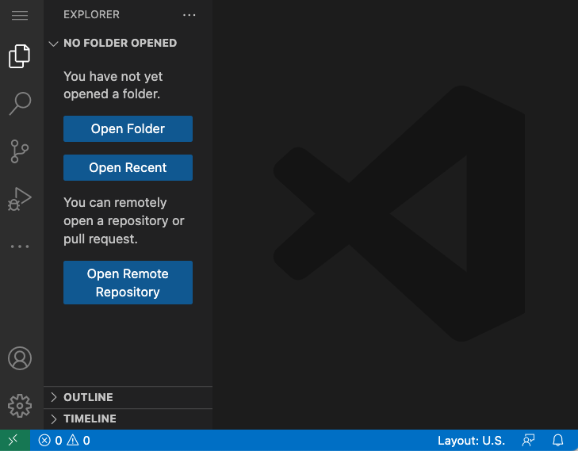
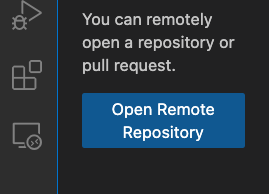
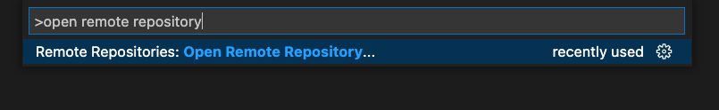
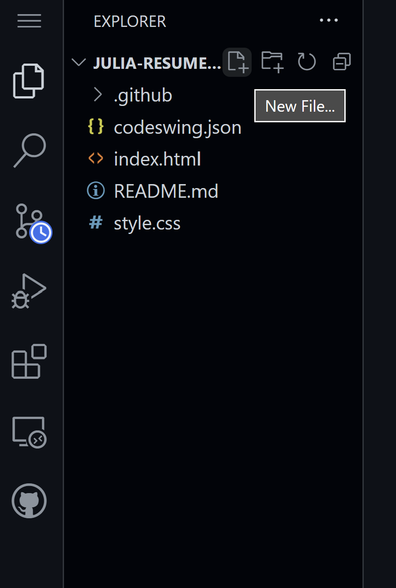
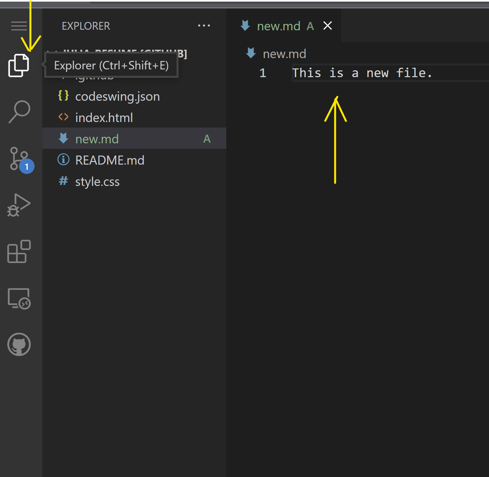
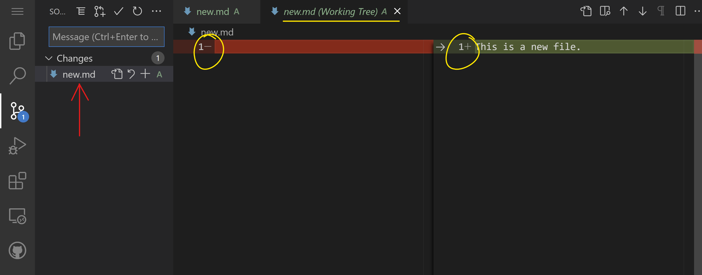
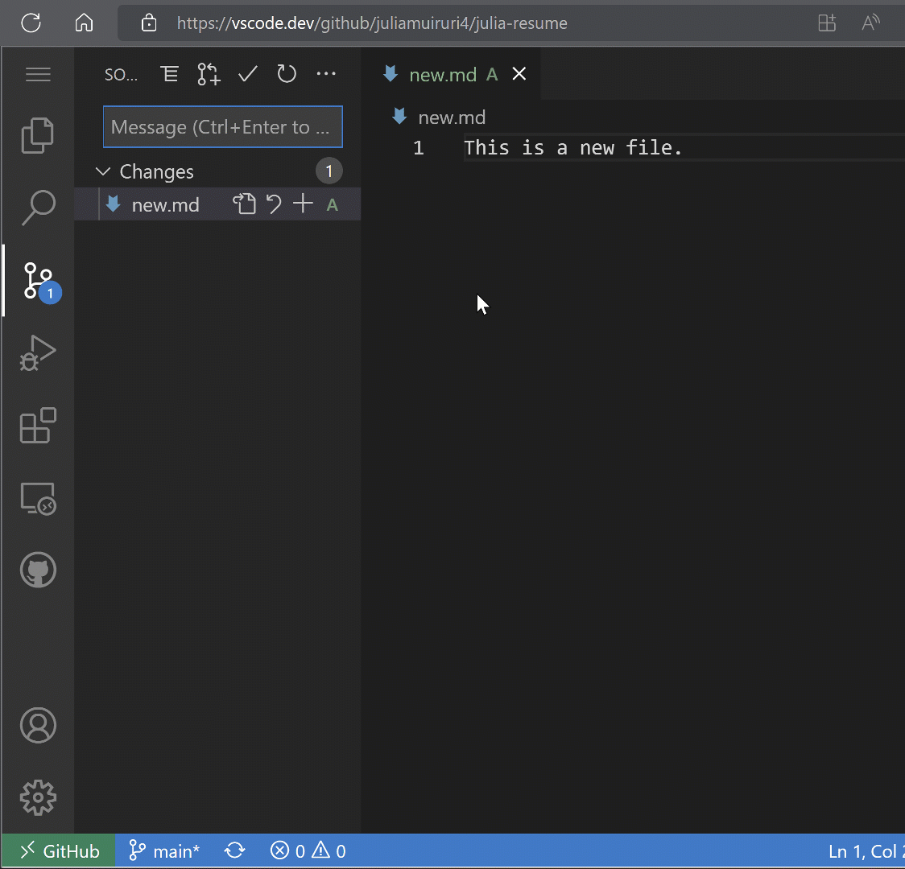
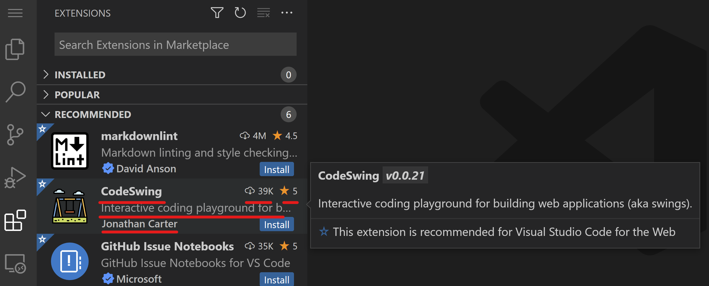
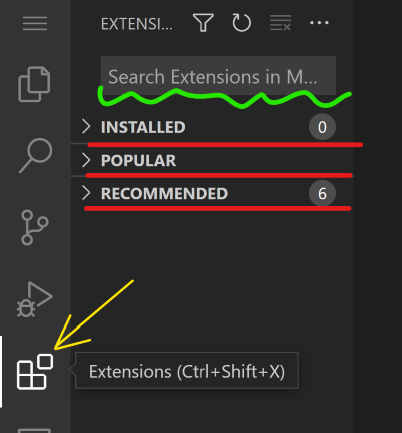
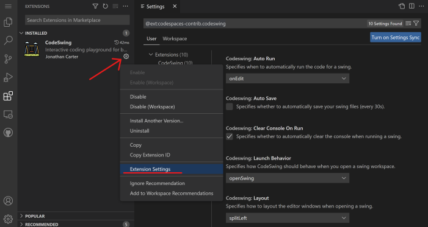

# Using a code editor

This lesson covers the basics of using [VSCode.dev](https://vscode.dev) a code editor for the web so that you can make changes to your code and contribute to a project without installing anything in your computer.

<!----
TODO: add an optional image

> Sketchnote by [Author name](https://example.com)
---->

<!---
## Pre-Lecture Quiz
[Pre-lecture quiz](https://ashy-river-0debb7803.1.azurestaticapps.net/quiz/3)
---->

## Learning objectives

In this lesson, you'll learn how to:

- Use a code editor in a code project
- Keep track of changes with version control
- Customize the editor for development

### Prerequisites

Before you begin, you'll need to create an account with [GitHub](https://github.com). Navigate to [GitHub](https://github.com/) and create an account if you haven't already.

### Introduction

A code editor is an essential tool for writing programs and collaborating with existing coding projects. Once you understand the basics of an editor and how to make use of its features, you'll be able to apply them when writing code.

## Getting started with VSCode.dev

[VSCode.dev](https://vscode.dev) is a code editor on the web. You don't need to install anything in order to use it, just like opening any other website. To get started with the editor, open the following link: [https://vscode.dev](https://vscode.dev). If you aren't signed in into [GitHub](https://github.com/), follow the prompts to sign in or create a new account and then sign in.

Once it loads, it should look similar to this image:



There are three main sections, starting from the far left and moving to the right:

1. The _activity bar_ which includes some icons, like the magnifying glass 🔎, the gear ⚙️  and a few others
1. The expanded activity bar which defaults to the _Explorer_, called the _side bar_.
1. And finally, the code area to the right.

Click on each of the icons to display a different menu. Once done, click on the _Explorer_ so you are back where you started.

When you start creating code or modifying existing code, it will happen in the biggest area to the right. You'll use this area to visualize existing code as well, which you'll do next.


## Open a GitHub repository

The first thing you'll need is to open a GitHub repository. There are multiple ways of opening a repository. In this section you'll see two different ways you can open a repository so that you can start working on changes.

### 1. With the editor

Use the editor itself to open a remote repository. If you go to [VSCode.dev](https://vscode.dev) you will see an _"Open Remote Repository"_ button:



You can also use the command palette. The command palette is an input box where you can type any word that is part of a command or an action to find the right command to execute. Use the menu to the top-left, then select _View_, and then pick _Command Palette_, or using the following keyboard shortcut: Ctrl-Shift-P (on MacOS it would be Command-Shift-P).



Once the menu opens, type _open remote repository_, and then select the first option. Multiple repositories that you are part of or that you've opened recently will show up. You can also use a full GitHub URL to select one. Use the following URL and paste into the box:

```
https://github.com/microsoft/Web-Dev-For-Beginners
```

✅ If successful, you'll see all files for this repository loaded in the text editor.


### 2. Using the URL

You can also use a url directly to load a repository. For example, the full URL for the current repo is [https://github.com/microsoft/Web-Dev-For-Beginners](https://github.com/microsoft/Web-Dev-For-Beginners), but you can swap the GitHub domain with `VSCode.dev/github` and load the repository directly. The resulting URL would be [https://vscode.dev/github/microsoft/Web-Dev-For-Beginners](https://vscode.dev/github/microsoft/Web-Dev-For-Beginners).


## Edit files
Once you have opened the repository on the browser/ vscode.dev, the next step would be to make updates or changes to the project.

### 1. Create a new file

You can either create a file inside an existing folder, or create it in the root directory/folder. To create a new file, open a location/directory to which you want the file to be saved and select the _'New file ...'_ icon on the activity bar _(left)_, give it a name and hit enter.



### 2. Edit and save a file on the repository

Using vscode.dev is helpful whenever you want to make quick updates to your project without having to load any software locally.
To update your code, click the 'Explorer' icon, also located on the activity bar to view files & folders in the repository.
Select a file to open it on the code area, make your changes and save.



Once you are done updating your project, select the _`source control`_ icon which contains all the new changes you have made to your repository.

To view the changes you made to your project, select the file(s) in the `Changes` folder in the expanded activity bar. This will open a 'Working Tree' for you to visually see the changes you made to the file. Red shows an ommission to the project, while green signifies an addition.



If you are safisfied with the changes you made, hover on the `Changes` folder and click the `+` button to stage the changes. Staging simply means preparing your changes to commit them to GitHub.

If however you are not comfortable with some changes and you want to discard them, hover on the `Changes` folder and select the `undo` icon.

Then, type in a `commit message` _(A description of the change you have made to the project)_, click the `check icon` to commit and push your changes.

Once done working on your project, select the `hamburger menu icon` at the top left to return to the repository on github.com.



## Using extensions
Installing extensions on VSCode allows you to add new features and customized development environment options on your editor to improve your development workflow. These extensions also help you add support for multiple programming languages and are often either generic extensions or language-based extensions.

To browse through the list of all available extensions, click the _`Extensions icon`_ on the activity bar and start typing the name of the extension on the text field labelled _'Search Extensions in Marketplace'_.
You will see a list of extensions, each one containing **the extension name, publisher's name, a 1 sentense description, number of downloads** and **a star rating**.



You can also view all previously installed extensions by expanding the _`Installed folder`_ , popular extensions used by most developers in the _`Popular folder`_ and recommended extensions for you either by users in the same workspace or based on your recently opened files in the _`recommended folder`_ .




### 1. Install Extensions
To install an extension, type the extension's name in the search field and click on it to view additional information about the extension on the code area once it appears on the expanded activity bar.

You can either click the _blue install button_ on the expanded activity bar to install or use the install button that appears on the code area once you select the extension to load additional information.


### 2. Customize Extensions
After installing the extension, you may need to modify its behaviour and customize it based on your preferences. To do this, select the Extensions icon, and this time, your extension will appear in the _Installed folder_, click on the _**Gear icon**_ and navigate to _Extensions Setting_



### 3. Manage Extensions
After installing and using your extension, vscode.dev offers options to manage your extension based on different needs. For example, you may choose to:
- **Disable:**  _(You temporarily disable an extension when you no longer need it but don't want to uninstall it completely)_

    Select the installed extension on the expanded activity bar > click the Gear icon > select 'Disable' or 'Disable (Workspace)' **OR** Open the extension on the code area and click the blue Disable button.

   
- **Uninstall:** Select installed extension on the expanded activity bar > click the Gear icon > select 'Uninstall' **OR** Open the extension on the code area and click the blue Uninstall button.


---

## Assignment
[Create a resume website using vscode.dev](https://github.com/microsoft/Web-Dev-For-Beginners/blob/main/8-code-editor/1-using-a-code-editor/assignment.md)


<!----
## Post-Lecture Quiz
[Post-lecture quiz](https://ashy-river-0debb7803.1.azurestaticapps.net/quiz/4)
---->

## Review & Self Study

Read more about [VSCode.dev](https://code.visualstudio.com/docs/editor/vscode-web?WT.mc_id=academic-0000-alfredodeza) and some of its other features.
