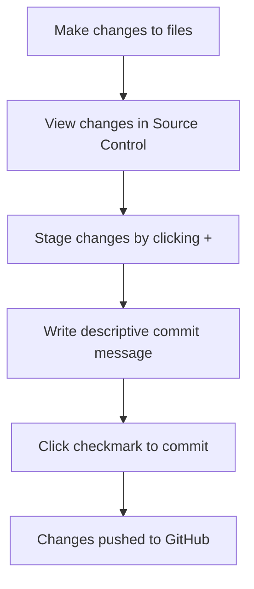

# Using a Code Editor: Mastering VSCode.dev

Ever wished you could code anywhere without worrying about software installations or carrying your laptop everywhere? Well, you're in for a treat! Today we're diving into VSCode.dev – a game-changing browser-based code editor that's like having a professional development studio that lives in the cloud.

Here's what makes this so exciting: imagine you're at school, a coffee shop, or visiting a friend, and suddenly you get an idea for your website or need to fix a quick bug. With VSCode.dev, you just open a browser tab and boom – you're coding with the same powerful tools professional developers use every day. No downloads, no "sorry, I can't install software on this computer" moments.

By the time we're done here, you'll be editing code like a pro, managing projects effortlessly, and even tracking your changes with Git – all from your browser. These aren't just cool tricks; they're the real skills that'll power your entire web development journey ahead.

## What You'll Learn

After we walk through this together, you'll be able to:

- Navigate VSCode.dev like it's your second home – finding everything you need without getting lost
- Open any GitHub repository in your browser and start editing immediately (this one's pretty magical!)
- Use Git to track your changes and save your progress like a pro
- Supercharge your editor with extensions that make coding faster and more fun
- Create and organize project files with confidence

## What You'll Need

Don't worry – the setup for this is super simple:

- A free [GitHub account](https://github.com) (if you don't have one, no stress – we'll walk you through it!)
- Basic comfort with using a web browser (if you can navigate websites, you're all set)
- Having done our GitHub Basics lesson helps, but isn't required

> 💡 **New to GitHub?** No problem! [Creating an account](https://github.com/) takes just a minute and it's completely free. Think of it as your coding passport – you'll use it everywhere in the dev world.

## Why Web-Based Code Editors Are Game-Changers

Let me paint you a picture: remember the old days when you needed to install heavy software on every computer you wanted to code on? Those days are over! A code editor is basically your coding headquarters – where you write, edit, and organize all your code. But unlike basic text editors (think Notepad), professional code editors are like having a smart assistant that highlights your code, catches mistakes, and keeps everything organized.

VSCode.dev takes all that power and puts it in your browser. Here's why this is such a big deal:

**Why you'll love web-based editing:**

| What's Awesome | What It Means | Why You'll Care |
|---------|-------------|----------|
| **Works Everywhere** | Any computer with a browser becomes your coding machine | Code at school, home, library – wherever! |
| **Zero Hassle Setup** | Click a link and you're coding | No "can I install this?" conversations |
| **Always Fresh** | You automatically get the latest features | No update notifications interrupting your flow |
| **Cloud-Powered** | Your GitHub repositories are just a click away | Everything syncs perfectly |

**Think about it** – this completely changes the game:
- No more "I can't work on this because I'm not on my computer"
- Your coding environment looks and feels the same whether you're on Windows, Mac, or Chromebook
- You can jump into any project and start collaborating immediately
- Your computer's storage stays happy (no massive downloads!)

## Let's Jump Into VSCode.dev!

Ready to see some magic? We're about to explore VSCode.dev, and I think you'll be amazed at how much power is packed into a simple browser tab. This isn't just any web app – it's got all the professional tools you'd expect from a desktop application.

First things first: head over to [vscode.dev](https://vscode.dev) in your browser. Pretty cool, right? No download bars, no "please restart your computer" messages – just pure coding goodness loading up instantly.

### Connecting Your GitHub Account

Here's where things get really exciting! When VSCode.dev asks if you want to sign in with GitHub, definitely say yes. Trust me on this one – it's like unlocking a whole new level of awesome.

**Here's what happens when you connect:**
- All your GitHub repositories show up right in the editor (no more tab-switching!)
- Your favorite settings and extensions follow you to any device you use
- You can save your work directly to GitHub without leaving the page
- Everything stays personalized just the way you like it

### Getting to Know Your New Workspace

Once everything loads up, you'll see a beautifully clean workspace that's designed to keep you focused on what matters – your code!

**Here's your tour of the neighborhood:**
- **Activity Bar** (that strip on the left): Your main navigation with Explorer 📁, Search 🔍, Source Control 🌿, Extensions 🧩, and Settings ⚙️
- **Sidebar** (the panel next to it): Changes to show you relevant info based on what you've selected
- **Editor Area** (the big space in the middle): This is where the magic happens – your main coding area

**Take a moment to explore:**
- Click around those Activity Bar icons and see what each one does
- Notice how the sidebar updates to show different information – pretty neat, right?
- The Explorer view (📁) is probably where you'll spend most of your time, so get comfortable with it

## Opening GitHub Repositories (This Is Where It Gets Fun!)

Okay, here's where VSCode.dev really shows off. You can open and edit any GitHub repository right in your browser – no cloning, no downloading, no "let me set this up on my machine first." Want to fix a typo in someone's documentation? Done. Need to explore how a cool project works? Easy. Want to contribute to open source? You're just a click away!

I'll show you two ways to do this, and both are super handy depending on what you're trying to do.

### Method 1: The Point-and-Click Way

This is perfect when you're starting fresh in VSCode.dev and want to open a specific repository. It's straightforward and beginner-friendly:

**Here's how to do it:**

1. Head to [vscode.dev](https://vscode.dev) if you're not already there
2. Look for the "Open Remote Repository" button on the welcome screen and click it

   

3. Paste in any GitHub repository URL (try this one: `https://github.com/microsoft/Web-Dev-For-Beginners`)
4. Hit Enter and watch the magic happen!

**Pro tip - The Command Palette shortcut:**

Want to feel like a coding wizard? Try this keyboard shortcut: Ctrl+Shift+P (or Cmd+Shift+P on Mac) to open the Command Palette:

**The Command Palette is like having a search engine for everything you can do:**
- Type "open remote" and it'll find the repository opener for you
- It remembers repositories you've opened recently (super handy!)
- Once you get used to it, you'll feel like you're coding at lightning speed
- It's basically VSCode.dev's version of "Hey Siri, but for coding"

### Method 2: The URL Trick (This One's My Favorite!)

Okay, get ready for what might be the coolest web development trick you'll learn today. You can edit ANY GitHub repository by just changing the URL. Seriously, it's that simple!

**Here's the magic formula:**

| What You're Looking At | Normal GitHub URL | VSCode.dev URL (Just Change This Part!) |
|----------------|---------------------|----------------|
| **Any Public Repo** | `github.com/microsoft/Web-Dev-For-Beginners` | `vscode.dev/github/microsoft/Web-Dev-For-Beginners` |
| **Your Own Projects** | `github.com/your-username/my-project` | `vscode.dev/github/your-username/my-project` |
| **Someone's Cool Project** | `github.com/their-username/awesome-repo` | `vscode.dev/github/their-username/awesome-repo` |

**The secret sauce:**
- Just swap `github.com` with `vscode.dev/github` – that's it!
- Everything else stays exactly the same
- Works with any repository you can normally see on GitHub
- Boom – you're editing in seconds, not minutes

> 💡 **Life-changing tip**: Bookmark the VSCode.dev versions of your favorite repositories. I have bookmarks like "Edit My Portfolio" and "Fix Documentation" that take me straight to editing mode!

**Which method should you use?**
- **The interface way**: Great when you're exploring or can't remember exact repository names
- **The URL trick**: Perfect for lightning-fast access when you know exactly where you're going

## Working with Files and Projects

Now that you've got a repository open, let's start building! VSCode.dev gives you everything you need to create, edit, and organize your code files. Think of it as your digital workshop – every tool is right where you need it.

Let's dive into the everyday tasks that'll make up most of your coding workflow.

### Creating New Files

Adding new files is super easy and works with all the file types you'll use in web development – HTML, CSS, JavaScript, you name it.

**Here's how to create a file:**

1. Find the folder where you want to add your file in the Explorer sidebar
2. Hover over that folder name and you'll see a "New File" icon (📄+) appear – click it!
3. Type your filename with its extension (like `style.css`, `script.js`, or `index.html`)
4. Hit Enter and voilà – your new file is ready to go!

**Some friendly naming tips:**
- Give your files descriptive names that make sense later (trust me, "untitled1.js" will confuse you next week!)
- Always include the file extension – it helps VSCode give you the right colors and suggestions
- Keep things organized from the start – your future self will thank you
- Stick to lowercase and use hyphens instead of spaces (like `my-awesome-styles.css`)

### Editing and Saving Files

This is where the real fun begins! VSCode.dev's editor is packed with helpful features that make coding feel smooth and intuitive. It's like having a really smart writing assistant, but for code.

**Your editing workflow:**

1. Click on any file in the Explorer to open it in the main area
2. Start typing and watch VSCode.dev help you out with colors, suggestions, and error spotting
3. Save your work with Ctrl+S (Windows/Linux) or Cmd+S (Mac) – though it auto-saves too!

**The cool stuff that happens while you code:**
- Your code gets beautifully color-coded so it's easy to read
- VSCode.dev suggests completions as you type (like autocorrect, but way smarter)
- It catches typos and errors before you even save
- You can have multiple files open in tabs, just like in a browser
- Everything saves automatically in the background

> ⚠️ **Quick tip**: Even though auto-save has your back, hitting Ctrl+S or Cmd+S is still a good habit. It immediately saves everything and triggers some extra helpful features like error checking.

### Version Control with Git (Don't Worry, It's Easier Than It Sounds!)

Here's one of my favorite VSCode.dev features – built-in Git support! If Git feels intimidating, think of it as a "save game" system for your code. You can create checkpoints of your work and always go back if something breaks. Plus, you can do it all without leaving your browser!

**Getting familiar with Source Control:**

1. Click the Source Control icon (🌿) in the Activity Bar – this shows all your changes
2. You'll see any files you've modified listed in the "Changes" section
3. Green highlights show what you've added, red shows what you've removed (like track changes in a word processor)

**Saving your work (the commit workflow):**

**Here's your step-by-step process:**
- Click the "+" icon next to files you want to save (this "stages" them)
- Double-check that you're happy with all your staged changes
- Write a short note explaining what you did (this is your "commit message")
- Click the checkmark button to save everything to GitHub
- If you change your mind about something, the undo icon lets you discard changes

**Writing good commit messages (this is easier than you think!):**
- Just describe what you did, like "Add contact form" or "Fix broken navigation"
- Keep it short and sweet – think tweet length, not essay
- Start with action words like "Add", "Fix", "Update", or "Remove"
- **Good examples**: "Add responsive navigation menu", "Fix mobile layout issues", "Update colors for better accessibility"

> 💡 **Quick navigation tip**: Use the hamburger menu (☰) at the top left to jump back to your GitHub repository and see your committed changes online. It's like a portal between your editing environment and your project's home on GitHub!

## Supercharge Your Coding with Extensions

Okay, this is where VSCode.dev goes from "pretty cool" to "absolutely amazing." Extensions are like apps for your code editor – they add superpowers that make coding faster, easier, and way more fun. Want your code to format itself perfectly? There's an extension for that. Want to see a live preview of your website while you code? Yep, there's one for that too!

The extension marketplace is like a candy store for developers – thousands of free tools created by the coding community to solve real problems we all face. The best part? You can pick and choose exactly what you want, creating a coding environment that feels perfectly tailored to how you like to work.

### Finding Your Perfect Extensions

The extension marketplace is really well organized, so you won't get lost trying to find what you need. It's designed to help you discover both specific tools and cool stuff you didn't even know existed!

**Getting to the marketplace:**

1. Click the Extensions icon (🧩) in the Activity Bar
2. Browse around or search for something specific
3. Click on anything that looks interesting to learn more about it

**What you'll see in there:**

| Section | What's Inside | Why It's Helpful |
|----------|---------|----------|
| **Installed** | Extensions you've already added | Your personal coding toolkit |
| **Popular** | The crowd favorites | What most developers swear by |
| **Recommended** | Smart suggestions for your project | VSCode.dev's helpful recommendations |

**What makes browsing easy:**
- Each extension shows ratings, download counts, and real user reviews
- You get screenshots and clear descriptions of what each one does
- Everything's clearly marked with compatibility info
- Similar extensions are suggested so you can compare options

### Installing Extensions (It's Super Easy!)

Adding new powers to your editor is as simple as clicking a button. Extensions install in seconds and start working immediately – no restarts, no waiting around.

**Here's all you need to do:**

1. Search for what you want (try searching "live server" or "prettier")
2. Click on one that looks good to see more details
3. Read through what it does and check out the ratings
4. Hit that blue "Install" button and you're done!

**What happens behind the scenes:**
- The extension downloads and sets itself up automatically
- New features appear in your interface right away
- Everything starts working immediately (seriously, it's that fast!)
- If you're signed in, the extension syncs to all your devices

**Some extensions I'd recommend starting with:**
- **Live Server**: See your website update in real-time as you code (this one's magical!)
- **Prettier**: Makes your code look clean and professional automatically
- **Auto Rename Tag**: Change one HTML tag and its partner updates too
- **Bracket Pair Colorizer**: Color-codes your brackets so you never get lost
- **GitLens**: Supercharges your Git features with tons of helpful info

### Customizing Your Extensions

Most extensions come with settings you can tweak to make them work exactly how you like. Think of it like adjusting the seat and mirrors in a car – everyone has their preferences!

**Tweaking extension settings:**

1. Find your installed extension in the Extensions panel
2. Look for the little gear icon (⚙️) next to its name and click it
3. Choose "Extension Settings" from the dropdown
4. Adjust things until they feel just right for your workflow

**Common things you might want to adjust:**
- How your code gets formatted (tabs vs spaces, line length, etc.)
- Which keyboard shortcuts trigger different actions
- What file types the extension should work with
- Turning specific features on or off to keep things clean

### Keeping Your Extensions Organized

As you discover more cool extensions, you'll want to keep your collection tidy and running smoothly. VSCode.dev makes this really easy to manage.

**Your extension management options:**

| What You Can Do | When It's Helpful | Pro Tip |
|--------|---------|----------|
| **Disable** | Testing if an extension is causing issues | Better than uninstalling if you might want it back |
| **Uninstall** | Completely removing extensions you don't need | Keeps your environment clean and fast |
| **Update** | Getting the latest features and bug fixes | Usually happens automatically, but worth checking |

**How I like to manage extensions:**
- Every few months, I review what I've installed and remove anything I'm not using
- I keep extensions updated so I get the latest improvements and security fixes
- If something seems slow, I temporarily disable extensions to see if one of them is the culprit
- I read the update notes when extensions get major updates – sometimes there are cool new features!

> ⚠️ **Performance tip**: Extensions are awesome, but having too many can slow things down. Focus on the ones that genuinely make your life easier and don't be afraid to uninstall ones you never use.

## GitHub Copilot Agent Challenge 🚀

Ready to put all these skills together? Here's a fun challenge that'll help you practice everything we've covered while building something real!

**Your mission:** Create a complete web development workflow using VSCode.dev that shows off your new professional project management skills.

**What you're going to build:** Use the Agent mode to help you set up a project that includes:
1. Fork an existing repository or create a brand new one from scratch
2. Build a proper project structure with HTML, CSS, and JavaScript files that actually work together
3. Install and configure at least 3 extensions that'll make your development process smoother
4. Practice making meaningful commits with clear, descriptive messages
5. Try creating a feature branch and making some changes (don't worry, you can't break anything!)
6. Document everything in a README.md file that explains your workflow and what you learned

By the end of this challenge, you'll have a real project that demonstrates you know your way around VSCode.dev like a pro. Plus, you'll have a workflow you can use for all your future projects!

## Assignment

Time to take these skills for a real test drive! I've got a hands-on project that'll let you practice everything we've covered: [Create a resume website using VSCode.dev](./assignment.md)

This assignment walks you through building a professional resume website entirely in your browser. You'll use all the VSCode.dev features we've explored, and by the end, you'll have both a great-looking website and solid confidence in your new workflow.

## Keep Exploring and Growing Your Skills

You've got a solid foundation now, but there's so much more cool stuff to discover! Here are some resources and ideas for taking your VSCode.dev skills to the next level:

**Official docs worth bookmarking:**
- [VSCode Web Documentation](https://code.visualstudio.com/docs/editor/vscode-web?WT.mc_id=academic-0000-alfredodeza) – The complete guide to browser-based editing
- [GitHub Codespaces](https://docs.github.com/en/codespaces) – For when you want even more power in the cloud

**Cool features to experiment with next:**
- **Keyboard Shortcuts**: Learn the key combos that'll make you feel like a coding ninja
- **Workspace Settings**: Set up different environments for different types of projects
- **Multi-root Workspaces**: Work on multiple repositories at the same time (super handy!)
- **Terminal Integration**: Access command-line tools right in your browser

**Ideas for practicing:**
- Jump into some open-source projects and contribute using VSCode.dev – it's a great way to give back!
- Try out different extensions to find your perfect setup
- Create project templates for the types of sites you build most often
- Practice Git workflows like branching and merging – these skills are gold in team projects

---

**Congratulations – you've just unlocked a superpower!** 🎉 You can now code professionally from literally anywhere with just a browser tab. Whether you're working on a school computer, borrowing a friend's laptop, or even using a tablet, you've got a complete development environment at your fingertips.

This isn't just a cool party trick – you've learned skills that professional developers use every day. Browser-based development is the future, and you're already there! From quick bug fixes to major project collaborations, you're equipped with a flexible, powerful workflow that'll grow with you as you take on bigger and more exciting coding challenges.

Now go build something amazing! 🚀