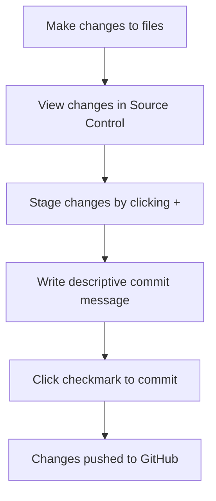

# Using a Code Editor: Mastering VSCode.dev

Welcome to the world of web-based code editing! In this lesson, you'll discover how to use VSCode.dev, a powerful browser-based code editor that brings professional development tools directly to your web browser. Think of it as having a complete development environment that follows you everywhere – no downloads, no installations, just pure coding power at your fingertips.

Modern web development requires tools that are flexible, accessible, and powerful. VSCode.dev delivers all three by providing the same editing experience you'd get from a desktop application, but with the convenience of running entirely in your browser. This means you can code on any device, from anywhere, whether you're using a school computer, a friend's laptop, or even a tablet.

By the end of this lesson, you'll be confidently editing code, managing projects, tracking changes with version control, and customizing your development environment with extensions. These skills form the foundation of professional web development and will serve you throughout your coding journey.

## Learning Objectives

After completing this lesson, you'll be able to:

- Navigate and efficiently use VSCode.dev's interface for any coding project
- Open and edit GitHub repositories directly in your browser
- Track and commit changes using built-in Git version control
- Install and manage extensions to enhance your development workflow
- Create, edit, and organize files within web-based projects

## Prerequisites

Before starting this lesson, you'll need:

- A free [GitHub account](https://github.com) for managing code repositories and accessing VSCode.dev's full features
- Basic familiarity with web browsers and file management
- Completion of the GitHub Basics lesson (recommended)

> 💡 **Getting Started**: If you don't have a GitHub account yet, [create one here](https://github.com/). It's free and essential for modern web development collaboration!

## Understanding Web-Based Code Editors

A code editor serves as your primary workspace for writing, editing, and managing code. Unlike simple text editors, professional code editors provide syntax highlighting, error detection, file organization, and integration with development tools. VSCode.dev brings all these capabilities to your browser with several key advantages.

**Key benefits of web-based editing:**

| Benefit | Description | Impact |
|---------|-------------|---------|
| **Device Independence** | Works on any computer with a modern browser | Code from school, home, or anywhere |
| **Zero Setup** | No downloads or installations required | Start coding immediately |
| **Automatic Updates** | Always runs the latest version | Access newest features without manual updates |
| **Cloud Integration** | Direct connection to GitHub repositories | Seamless collaboration and backup |

**Here's why web-based editors are revolutionary:**
- **Eliminates** the traditional barrier of software installation
- **Provides** consistent experience across different devices and operating systems
- **Enables** instant collaboration and sharing with team members
- **Reduces** storage requirements on your local device

## Getting Started with VSCode.dev

Let's dive into VSCode.dev and explore its powerful interface. This web-based editor provides all the tools you need for professional development work, accessible through any modern web browser.

To begin, navigate to [vscode.dev](https://vscode.dev) in your browser. Notice that there's no download prompt or installation process – the editor loads directly in your browser tab.

### Connecting Your GitHub Account

For the best experience, sign in with your GitHub account when prompted. This connection unlocks powerful features including repository access, settings synchronization, and extension management.

**Signing in provides these benefits:**
- **Accesses** your GitHub repositories directly in the editor
- **Synchronizes** your settings and extensions across devices
- **Enables** direct commits and pull requests from the browser
- **Maintains** your personalized development environment

### Understanding the Interface

Once loaded, VSCode.dev presents a clean, organized workspace designed for efficient coding:

**The interface consists of three main areas:**
- **Activity Bar** (left edge): Contains icons for Explorer 📁, Search 🔍, Source Control 🌿, Extensions 🧩, and Settings ⚙️
- **Sidebar** (left panel): **Displays** contextual information based on your Activity Bar selection
- **Editor Area** (main space): **Provides** the primary workspace for viewing and editing your code files

**Getting familiar with the layout:**
- **Click** through different Activity Bar icons to explore available features
- **Observe** how the sidebar content changes based on your selection
- **Return** to the Explorer view (📁) to see your project files and folders

## Opening GitHub Repositories

One of VSCode.dev's most powerful features is its ability to open and edit GitHub repositories directly in your browser. This means you can contribute to projects, make quick fixes, or explore codebases without cloning anything to your local machine.

There are two efficient methods to open repositories, each suited for different workflows and use cases.

### Method 1: Using the Interface

This method works well when you're already in VSCode.dev and want to open a specific repository:

**Step-by-step process:**

1. **Navigate** to [vscode.dev](https://vscode.dev) in your browser
2. **Click** the "Open Remote Repository" button on the welcome screen

   

3. **Paste** your GitHub repository URL (for example: `https://github.com/microsoft/Web-Dev-For-Beginners`)
4. **Press** Enter to load the repository

**Alternative using Command Palette:**

For a faster approach, use the Command Palette (Ctrl+Shift+P on Windows/Linux, or Cmd+Shift+P on Mac):

**Here's what happens when you use the Command Palette:**
- **Opens** a search interface for all available VSCode.dev commands
- **Provides** quick access to "Open Remote Repository" functionality
- **Enables** keyboard-driven workflow for experienced developers
- **Displays** recently opened repositories for quick access

### Method 2: Direct URL Transformation

This method offers the fastest way to open any GitHub repository directly in VSCode.dev. It's perfect for quick edits or when someone shares a repository link with you.

**URL transformation technique:**

| Repository Type | Original GitHub URL | VSCode.dev URL |
|----------------|---------------------|----------------|
| **Public Repository** | `github.com/microsoft/Web-Dev-For-Beginners` | `vscode.dev/github/microsoft/Web-Dev-For-Beginners` |
| **Your Repository** | `github.com/your-username/my-project` | `vscode.dev/github/your-username/my-project` |
| **Forked Repository** | `github.com/your-username/forked-repo` | `vscode.dev/github/your-username/forked-repo` |

**Understanding the transformation:**
- **Replaces** `github.com` with `vscode.dev/github` in any repository URL
- **Maintains** the same path structure for user and repository names
- **Works** with both public repositories and private ones you have access to
- **Provides** instant access without additional navigation steps

> 💡 **Pro Tip**: Bookmark the VSCode.dev version of repositories you frequently edit. This creates instant access to your most important projects!

**When to use each method:**
- **Interface method**: Best for browsing and exploring new repositories
- **URL transformation**: Ideal for quick access to known repositories or when clicking links from documentation

## Working with Files and Projects

Once you have a repository open in VSCode.dev, you can perform all the essential file operations needed for web development. The interface provides intuitive tools for creating, editing, organizing, and tracking changes to your code.

Let's explore the core file management capabilities that make VSCode.dev a complete development environment.

### Creating New Files

Adding new files to your project is straightforward and supports all common web development file types including HTML, CSS, JavaScript, and configuration files.

**To create a new file:**

1. **Navigate** to your desired folder location in the Explorer sidebar
2. **Click** the "New File" icon (📄+) that appears when hovering over folder names
3. **Type** your filename including the appropriate extension (e.g., `style.css`, `script.js`, `index.html`)
4. **Press** Enter to create the file

**Best practices for file creation:**
- **Uses** descriptive names that clearly indicate the file's purpose
- **Includes** proper file extensions for syntax highlighting and IntelliSense
- **Organizes** files into logical folder structures from the start
- **Follows** common naming conventions (lowercase, hyphens instead of spaces)

### Editing and Saving Files

VSCode.dev provides a full-featured editing experience with syntax highlighting, auto-completion, and error detection for web development languages.

**Editing workflow:**

1. **Click** any file in the Explorer to open it in the main editor area
2. **Make** your changes using the full-featured code editor
3. **Save** your work using Ctrl+S (Windows/Linux) or Cmd+S (Mac)

**Key editing features:**
- **Provides** syntax highlighting for HTML, CSS, JavaScript, and many other languages
- **Offers** intelligent code completion and suggestions as you type
- **Detects** errors and provides helpful error messages
- **Supports** multiple files open simultaneously in tabs
- **Includes** automatic saving that preserves your work as you type

> ⚠️ **Auto-Save Note**: VSCode.dev automatically saves your changes, but manually saving (Ctrl+S or Cmd+S) ensures your work is immediately preserved and triggers additional features like error checking.

### Version Control with Git

One of VSCode.dev's most powerful features is its integrated Git version control system. This allows you to track changes, create commits, and push updates directly to GitHub without leaving your browser.

**Understanding the Source Control interface:**

1. **Click** the Source Control icon (🌿) in the Activity Bar to view all changes
2. **Review** modified files, which appear in the "Changes" section
3. **See** additions highlighted in green and deletions in red

**The commit workflow:**

**Step-by-step commit process:**
- **Stages** individual files by clicking the "+" icon next to each changed file
- **Reviews** all staged changes before committing
- **Writes** a clear, descriptive commit message explaining what changed
- **Commits** and pushes changes by clicking the checkmark button
- **Discards** unwanted changes using the undo icon if needed

**Writing effective commit messages:**
- **Describes** what the commit accomplishes in present tense
- **Keeps** the first line under 50 characters for readability
- **Uses** specific action verbs like "Add", "Fix", "Update", or "Remove"
- **Examples**: "Add responsive navigation menu", "Fix mobile layout issues", "Update color scheme for accessibility"

> 💡 **Navigation Tip**: Use the hamburger menu (☰) at the top left to return to your GitHub repository and see your committed changes online.

## Enhancing Your Workflow with Extensions

Extensions are one of VSCode.dev's most powerful features, allowing you to customize and enhance your development environment. Think of extensions as specialized tools that add new capabilities, from language support and themes to debugging tools and productivity enhancers.

The VSCode extension marketplace contains thousands of community-created tools designed to make web development more efficient, enjoyable, and powerful. By carefully selecting extensions, you can create a personalized development environment tailored to your specific needs and projects.

### Discovering and Managing Extensions

The Extensions marketplace in VSCode.dev provides easy access to tools that can transform your coding experience. The interface is designed to help you find exactly what you need, whether you're looking for specific functionality or browsing for inspiration.

**Accessing the Extensions marketplace:**

1. **Click** the Extensions icon (🧩) in the Activity Bar
2. **Browse** the different categories or use the search functionality
3. **Explore** extension details, ratings, and user reviews

**Understanding extension categories:**

| Category | Purpose | Examples |
|----------|---------|----------|
| **Installed** | Extensions you've already added | Your personal toolkit |
| **Popular** | Most-downloaded extensions | Industry standards and favorites |
| **Recommended** | Suggestions based on your workspace | Tailored to your current project type |

**Key marketplace features:**
- **Displays** detailed information including ratings, download counts, and user reviews
- **Provides** screenshots and documentation for each extension
- **Shows** compatibility information and system requirements
- **Offers** related extensions and alternatives for comparison

### Installing Extensions

Adding new functionality to VSCode.dev is straightforward and immediate. Extensions install quickly and become available right away, often without requiring a restart.

**Installation process:**

1. **Search** for your desired extension using keywords or exact names
2. **Click** on the extension to view its details page
3. **Review** the description, features, and user ratings
4. **Click** the blue "Install" button

**What happens during installation:**
- **Downloads** the extension files to your browser-based environment
- **Integrates** new features into the VSCode.dev interface
- **Activates** the extension automatically for immediate use
- **Syncs** with your GitHub account so the extension appears on other devices

**Recommended extensions for web development:**
- **Live Server**: **Provides** local development server with auto-refresh
- **Prettier**: **Formats** your code automatically for consistency
- **Auto Rename Tag**: **Updates** matching HTML tags simultaneously
- **Bracket Pair Colorizer**: **Highlights** matching brackets with colors
- **GitLens**: **Enhances** Git capabilities with advanced history and blame features

### Customizing Extension Settings

Most extensions provide customization options that allow you to tailor their behavior to match your workflow preferences. These settings help you optimize each tool for maximum productivity.

**Accessing extension settings:**

1. **Locate** your installed extension in the Extensions panel
2. **Click** the gear icon (⚙️) next to the extension name
3. **Select** "Extension Settings" from the dropdown menu
4. **Modify** settings according to your preferences

**Common customization options:**
- **Adjusts** formatting rules and style preferences
- **Configures** keyboard shortcuts and trigger behaviors
- **Sets** file type associations and language preferences
- **Enables** or disables specific features within the extension

### Managing Your Extension Collection

As you discover more extensions, you'll want to organize and manage your collection effectively. VSCode.dev provides tools to help you maintain a clean, efficient development environment.

**Extension management options:**

| Action | Purpose | When to Use |
|--------|---------|-------------|
| **Disable** | Temporarily turn off without uninstalling | Testing conflicts or reducing clutter |
| **Uninstall** | Permanently remove from your environment | Extension no longer needed |
| **Update** | Get the latest version and features | Maintain security and functionality |

**Best practices for extension management:**
- **Reviews** your installed extensions periodically to remove unused ones
- **Keeps** extensions updated for the latest features and security patches
- **Disables** rather than uninstalls extensions you might use again
- **Reads** extension changelogs to understand new features and changes

> ⚠️ **Performance Tip**: While extensions are powerful, installing too many can impact performance. Focus on extensions that genuinely improve your workflow and disable any you're not actively using.

## GitHub Copilot Agent Challenge 🚀

Use the Agent mode to complete the following challenge:

**Description:** Create a comprehensive development workflow using VSCode.dev that demonstrates professional project management skills, from repository setup to collaborative features.

**Prompt:** Set up a complete web development project in VSCode.dev that includes:
1. Fork an existing repository or create a new one
2. Create a proper project structure with HTML, CSS, and JavaScript files
3. Install and configure at least 3 relevant extensions for web development
4. Make meaningful commits with descriptive messages
5. Create a feature branch and make changes
6. Document your workflow in a README.md file that explains your development process

Your final project should demonstrate mastery of VSCode.dev's interface, extension ecosystem, and version control integration.

## Assignment

Ready to put your new skills to the test? Complete this hands-on project: [Create a resume website using VSCode.dev](./assignment.md)

This assignment will guide you through creating a professional resume website entirely within your browser, demonstrating all the concepts covered in this lesson.

## Further Exploration and Self-Study

Continue building your expertise with these resources:

**Official Documentation:**
- [VSCode Web Documentation](https://code.visualstudio.com/docs/editor/vscode-web?WT.mc_id=academic-0000-alfredodeza) - Comprehensive guide to web-based editing
- [GitHub Codespaces](https://docs.github.com/en/codespaces) - Advanced cloud development environments

**Advanced Features to Explore:**
- **Keyboard Shortcuts**: Learn efficiency-boosting shortcuts for faster development
- **Workspace Settings**: Customize your environment for different project types
- **Multi-root Workspaces**: Work with multiple repositories simultaneously
- **Terminal Integration**: Access command-line tools directly in your browser

**Practice Suggestions:**
- **Contribute** to open-source projects using VSCode.dev
- **Experiment** with different extensions to find your optimal workflow
- **Create** templates for common project types you work on
- **Practice** Git workflows including branching, merging, and pull requests

---

**Congratulations!** You now have the skills to code professionally from anywhere, on any device, using VSCode.dev. This browser-based development environment opens up new possibilities for flexible, collaborative web development. Whether you're working on personal projects, contributing to open source, or collaborating with a team, you're equipped with a powerful, accessible development workflow.