# Using a Code Editor: Mastering VSCode.dev

Remember in *The Matrix* when Neo had to plug into a massive computer terminal to access the digital world? Today's web development tools are the opposite story – incredibly powerful capabilities accessible from anywhere. VSCode.dev is a browser-based code editor that brings professional development tools to any device with an internet connection.

Just like how the printing press made books accessible to everyone, not just scribes in monasteries, VSCode.dev democratizes coding. You can work on projects from a library computer, a school lab, or anywhere you have browser access. No installations, no "I need my specific setup" limitations.

By the end of this lesson, you'll understand how to navigate VSCode.dev, open GitHub repositories directly in your browser, and use Git for version control – all skills that professional developers rely on daily.

## ⚡ What You Can Do in the Next 5 Minutes

**Quick Start Pathway for Busy Developers**


- **Minute 1**: Navigate to [vscode.dev](https://vscode.dev) - no installation needed
- **Minute 2**: Sign in with GitHub to connect your repositories
- **Minute 3**: Try the URL trick: change `github.com` to `vscode.dev/github` in any repo URL
- **Minute 4**: Create a new file and watch syntax highlighting work automatically
- **Minute 5**: Make a change and commit it through the Source Control panel

**Quick Test URL**:
```
# Transform this:
github.com/microsoft/Web-Dev-For-Beginners

# Into this:
vscode.dev/github/microsoft/Web-Dev-For-Beginners
```

**Why This Matters**: In 5 minutes, you'll experience the freedom of coding anywhere with professional tools. This represents the future of development - accessible, powerful, and immediate.

## 🗺️ Your Learning Journey Through Cloud-Based Development


**Your Journey Destination**: By the end of this lesson, you'll have mastered a professional cloud development environment that works from any device, enabling you to code with the same tools used by developers at major tech companies.

## What You'll Learn

After we walk through this together, you'll be able to:

- Navigate VSCode.dev like it's your second home – finding everything you need without getting lost
- Open any GitHub repository in your browser and start editing immediately (this one's pretty magical!)
- Use Git to track your changes and save your progress like a pro
- Supercharge your editor with extensions that make coding faster and more fun
- Create and organize project files with confidence

## What You'll Need

The requirements are straightforward:

- A free [GitHub account](https://github.com) (we'll guide you through creation if needed)
- Basic familiarity with web browsers
- The GitHub Basics lesson provides helpful background, though it's not essential

> 💡 **New to GitHub?** Creating an account is free and takes minutes. Like how a library card gives you access to books worldwide, a GitHub account opens doors to code repositories across the internet.

## 🧠 Cloud Development Ecosystem Overview


**Core Principle**: Cloud-based development environments represent the future of coding - providing professional-grade tools that are accessible, collaborative, and platform-independent.

## Why Web-Based Code Editors Matter

Before the internet, scientists at different universities couldn't easily share research. Then came ARPANET in the 1960s, connecting computers across distances. Web-based code editors follow this same principle – making powerful tools accessible regardless of your physical location or device.

A code editor serves as your development workspace, where you write, edit, and organize code files. Unlike simple text editors, professional code editors provide syntax highlighting, error detection, and project management features.

VSCode.dev brings these capabilities to your browser:

**Web-based editing advantages:**

| Feature | Description | Practical Benefit |
|---------|-------------|----------|
| **Platform Independence** | Runs on any device with a browser | Work from different computers seamlessly |
| **No Installation Required** | Access through a web URL | Bypass software installation restrictions |
| **Automatic Updates** | Always runs the latest version | Access new features without manual updates |
| **Repository Integration** | Direct connection to GitHub | Edit code without local file management |

**Practical implications:**
- Work continuity across different environments
- Consistent interface regardless of operating system
- Immediate collaboration capabilities
- Reduced local storage requirements

## Exploring VSCode.dev

Just as Marie Curie's laboratory contained sophisticated equipment in a relatively simple space, VSCode.dev packs professional development tools into a browser interface. This web application provides the same core functionality as desktop code editors.

Start by navigating to [vscode.dev](https://vscode.dev) in your browser. The interface loads without downloads or system installations – a direct application of cloud computing principles.

### Connecting Your GitHub Account

Like how Alexander Graham Bell's telephone connected distant locations, linking your GitHub account bridges VSCode.dev with your code repositories. When prompted to sign in with GitHub, accepting this connection is recommended.

**GitHub integration provides:**
- Direct access to your repositories within the editor
- Synchronized settings and extensions across devices
- Streamlined saving workflow to GitHub
- Personalized development environment

### Getting to Know Your New Workspace

Once everything loads up, you'll see a beautifully clean workspace that's designed to keep you focused on what matters – your code!


**Here's your tour of the neighborhood:**
- **Activity Bar** (that strip on the left): Your main navigation with Explorer 📁, Search 🔍, Source Control 🌿, Extensions 🧩, and Settings ⚙️
- **Sidebar** (the panel next to it): Changes to show you relevant info based on what you've selected
- **Editor Area** (the big space in the middle): This is where the magic happens – your main coding area

**Take a moment to explore:**
- Click around those Activity Bar icons and see what each one does
- Notice how the sidebar updates to show different information – pretty neat, right?
- The Explorer view (📁) is probably where you'll spend most of your time, so get comfortable with it

```mermaid
flowchart TB
    subgraph "VSCode.dev Interface Architecture"
        A[Activity Bar] --> B[Explorer 📁]
        A --> C[Search 🔍]
        A --> D[Source Control 🌿]
        A --> E[Extensions 🧩]
        A --> F[Settings ⚙️]
        
        B --> G[File Tree]
        C --> H[Find & Replace]
        D --> I[Git Status]
        E --> J[Extension Marketplace]
        F --> K[Configuration]
        
        L[Sidebar] --> M[Context Panel]
        N[Editor Area] --> O[Code Files]
        P[Terminal/Output] --> Q[Command Line]
    end
```



## Opening GitHub Repositories

Before the internet, researchers had to physically travel to libraries to access documents. GitHub repositories work similarly – they're collections of code stored remotely. VSCode.dev eliminates the traditional step of downloading repositories to your local machine before editing.

This capability enables immediate access to any public repository for viewing, editing, or contributing. Here are two methods for opening repositories:

### Method 1: The Point-and-Click Way

This is perfect when you're starting fresh in VSCode.dev and want to open a specific repository. It's straightforward and beginner-friendly:

**Here's how to do it:**

1. Head to [vscode.dev](https://vscode.dev) if you're not already there
2. Look for the "Open Remote Repository" button on the welcome screen and click it

   

3. Paste in any GitHub repository URL (try this one: `https://github.com/microsoft/Web-Dev-For-Beginners`)
4. Hit Enter and watch the magic happen!

**Pro tip - The Command Palette shortcut:**

Want to feel like a coding wizard? Try this keyboard shortcut: Ctrl+Shift+P (or Cmd+Shift+P on Mac) to open the Command Palette:


**The Command Palette is like having a search engine for everything you can do:**
- Type "open remote" and it'll find the repository opener for you
- It remembers repositories you've opened recently (super handy!)
- Once you get used to it, you'll feel like you're coding at lightning speed
- It's basically VSCode.dev's version of "Hey Siri, but for coding"

### Method 2: URL Modification Technique

Like how HTTP and HTTPS use different protocols while maintaining the same domain structure, VSCode.dev uses a URL pattern that mirrors GitHub's addressing system. Any GitHub repository URL can be modified to open directly in VSCode.dev.

**URL transformation pattern:**

| Repository Type | GitHub URL | VSCode.dev URL |
|----------------|---------------------|----------------|
| **Public Repository** | `github.com/microsoft/Web-Dev-For-Beginners` | `vscode.dev/github/microsoft/Web-Dev-For-Beginners` |
| **Personal Project** | `github.com/your-username/my-project` | `vscode.dev/github/your-username/my-project` |
| **Any Accessible Repo** | `github.com/their-username/awesome-repo` | `vscode.dev/github/their-username/awesome-repo` |

**Implementation:**
- Replace `github.com` with `vscode.dev/github`
- Maintain all other URL components unchanged
- Works with any publicly accessible repository
- Provides immediate editing access

> 💡 **Life-changing tip**: Bookmark the VSCode.dev versions of your favorite repositories. I have bookmarks like "Edit My Portfolio" and "Fix Documentation" that take me straight to editing mode!

**Which method should you use?**
- **The interface way**: Great when you're exploring or can't remember exact repository names
- **The URL trick**: Perfect for lightning-fast access when you know exactly where you're going

### 🎯 Pedagogical Check-in: Cloud Development Access

**Pause and Reflect**: You've just learned two methods for accessing code repositories through a web browser. This represents a fundamental shift in how development works.

**Quick Self-Assessment**:
- Can you explain why web-based editing eliminates traditional "development environment setup"?
- What advantages does the URL modification technique provide over local git cloning?
- How does this approach change the way you might contribute to open source projects?

**Real-World Connection**: Major companies like GitHub, GitLab, and Replit have built their development platforms around these cloud-first principles. You're learning the same workflows used by professional development teams worldwide.

**Challenge Question**: How might cloud-based development change the way coding is taught in schools? Consider device requirements, software management, and collaborative possibilities.

## Working with Files and Projects

Now that you've got a repository open, let's start building! VSCode.dev gives you everything you need to create, edit, and organize your code files. Think of it as your digital workshop – every tool is right where you need it.

Let's dive into the everyday tasks that'll make up most of your coding workflow.

### Creating New Files

Like organizing blueprints in an architect's office, file creation in VSCode.dev follows a structured approach. The system supports all standard web development file types.

**File creation process:**

1. Navigate to the target folder in the Explorer sidebar
2. Hover over the folder name to reveal the "New File" icon (📄+)
3. Enter the filename including the appropriate extension (`style.css`, `script.js`, `index.html`)
4. Press Enter to create the file


**Naming conventions:**
- Use descriptive names that indicate file purpose
- Include file extensions for proper syntax highlighting
- Follow consistent naming patterns throughout projects
- Use lowercase letters and hyphens instead of spaces

### Editing and Saving Files

This is where the real fun begins! VSCode.dev's editor is packed with helpful features that make coding feel smooth and intuitive. It's like having a really smart writing assistant, but for code.

**Your editing workflow:**

1. Click on any file in the Explorer to open it in the main area
2. Start typing and watch VSCode.dev help you out with colors, suggestions, and error spotting
3. Save your work with Ctrl+S (Windows/Linux) or Cmd+S (Mac) – though it auto-saves too!


**The cool stuff that happens while you code:**
- Your code gets beautifully color-coded so it's easy to read
- VSCode.dev suggests completions as you type (like autocorrect, but way smarter)
- It catches typos and errors before you even save
- You can have multiple files open in tabs, just like in a browser
- Everything saves automatically in the background

> ⚠️ **Quick tip**: Even though auto-save has your back, hitting Ctrl+S or Cmd+S is still a good habit. It immediately saves everything and triggers some extra helpful features like error checking.

### Version Control with Git

Like how archaeologists create detailed records of excavation layers, Git tracks changes in your code over time. This system preserves project history and enables you to revert to previous versions when needed. VSCode.dev includes integrated Git functionality.

**Source Control interface:**

1. Access the Source Control panel via the 🌿 icon in the Activity Bar
2. Modified files appear in the "Changes" section
3. Color coding indicates change types: green for additions, red for deletions


**Saving your work (the commit workflow):**


**Here's your step-by-step process:**
- Click the "+" icon next to files you want to save (this "stages" them)
- Double-check that you're happy with all your staged changes
- Write a short note explaining what you did (this is your "commit message")
- Click the checkmark button to save everything to GitHub
- If you change your mind about something, the undo icon lets you discard changes

**Writing good commit messages (this is easier than you think!):**
- Just describe what you did, like "Add contact form" or "Fix broken navigation"
- Keep it short and sweet – think tweet length, not essay
- Start with action words like "Add", "Fix", "Update", or "Remove"
- **Good examples**: "Add responsive navigation menu", "Fix mobile layout issues", "Update colors for better accessibility"

> 💡 **Quick navigation tip**: Use the hamburger menu (☰) at the top left to jump back to your GitHub repository and see your committed changes online. It's like a portal between your editing environment and your project's home on GitHub!

## Enhancing Functionality with Extensions

Just as a craftsperson's workshop contains specialized tools for different tasks, VSCode.dev can be customized with extensions that add specific capabilities. These community-developed plugins address common development needs like code formatting, live preview, and enhanced Git integration.

The extension marketplace hosts thousands of free tools created by developers worldwide. Each extension solves particular workflow challenges, allowing you to build a personalized development environment suited to your specific needs and preferences.


### Finding Your Perfect Extensions

The extension marketplace is really well organized, so you won't get lost trying to find what you need. It's designed to help you discover both specific tools and cool stuff you didn't even know existed!

**Getting to the marketplace:**

1. Click the Extensions icon (🧩) in the Activity Bar
2. Browse around or search for something specific
3. Click on anything that looks interesting to learn more about it


**What you'll see in there:**

| Section | What's Inside | Why It's Helpful |
|----------|---------|----------|
| **Installed** | Extensions you've already added | Your personal coding toolkit |
| **Popular** | The crowd favorites | What most developers swear by |
| **Recommended** | Smart suggestions for your project | VSCode.dev's helpful recommendations |

**What makes browsing easy:**
- Each extension shows ratings, download counts, and real user reviews
- You get screenshots and clear descriptions of what each one does
- Everything's clearly marked with compatibility info
- Similar extensions are suggested so you can compare options

### Installing Extensions (It's Super Easy!)

Adding new powers to your editor is as simple as clicking a button. Extensions install in seconds and start working immediately – no restarts, no waiting around.

**Here's all you need to do:**

1. Search for what you want (try searching "live server" or "prettier")
2. Click on one that looks good to see more details
3. Read through what it does and check out the ratings
4. Hit that blue "Install" button and you're done!


**What happens behind the scenes:**
- The extension downloads and sets itself up automatically
- New features appear in your interface right away
- Everything starts working immediately (seriously, it's that fast!)
- If you're signed in, the extension syncs to all your devices

**Some extensions I'd recommend starting with:**
- **Live Server**: See your website update in real-time as you code (this one's magical!)
- **Prettier**: Makes your code look clean and professional automatically
- **Auto Rename Tag**: Change one HTML tag and its partner updates too
- **Bracket Pair Colorizer**: Color-codes your brackets so you never get lost
- **GitLens**: Supercharges your Git features with tons of helpful info

### Customizing Your Extensions

Most extensions come with settings you can tweak to make them work exactly how you like. Think of it like adjusting the seat and mirrors in a car – everyone has their preferences!

**Tweaking extension settings:**

1. Find your installed extension in the Extensions panel
2. Look for the little gear icon (⚙️) next to its name and click it
3. Choose "Extension Settings" from the dropdown
4. Adjust things until they feel just right for your workflow


**Common things you might want to adjust:**
- How your code gets formatted (tabs vs spaces, line length, etc.)
- Which keyboard shortcuts trigger different actions
- What file types the extension should work with
- Turning specific features on or off to keep things clean

### Keeping Your Extensions Organized

As you discover more cool extensions, you'll want to keep your collection tidy and running smoothly. VSCode.dev makes this really easy to manage.

**Your extension management options:**

| What You Can Do | When It's Helpful | Pro Tip |
|--------|---------|----------|
| **Disable** | Testing if an extension is causing issues | Better than uninstalling if you might want it back |
| **Uninstall** | Completely removing extensions you don't need | Keeps your environment clean and fast |
| **Update** | Getting the latest features and bug fixes | Usually happens automatically, but worth checking |

**How I like to manage extensions:**
- Every few months, I review what I've installed and remove anything I'm not using
- I keep extensions updated so I get the latest improvements and security fixes
- If something seems slow, I temporarily disable extensions to see if one of them is the culprit
- I read the update notes when extensions get major updates – sometimes there are cool new features!

> ⚠️ **Performance tip**: Extensions are awesome, but having too many can slow things down. Focus on the ones that genuinely make your life easier and don't be afraid to uninstall ones you never use.

### 🎯 Pedagogical Check-in: Development Environment Customization

**Architecture Understanding**: You've learned to customize a professional development environment using community-created extensions. This mirrors how enterprise development teams build standardized toolchains.

**Key Concepts Mastered**:
- **Extension Discovery**: Finding tools that solve specific development challenges
- **Environment Configuration**: Customizing tools to match personal or team preferences
- **Performance Optimization**: Balancing functionality with system performance
- **Community Collaboration**: Leveraging tools created by the global developer community

**Industry Connection**: Extension ecosystems power major development platforms like VS Code, Chrome DevTools, and modern IDEs. Understanding how to evaluate, install, and configure extensions is essential for professional development workflows.

**Reflection Question**: How would you approach setting up a standardized development environment for a team of 10 developers? Consider consistency, performance, and individual preferences.

## 📈 Your Cloud Development Mastery Timeline


**🎓 Graduation Milestone**: You've successfully mastered cloud-based development using the same tools and workflows employed by professional developers at major tech companies. These skills represent the future of software development.

**🔄 Next Level Capabilities**:
- Ready to explore advanced cloud development platforms (Codespaces, GitPod)
- Prepared to work in distributed development teams
- Equipped to contribute to open source projects globally
- Foundation set for modern DevOps and continuous integration practices

## GitHub Copilot Agent Challenge 🚀

Like the structured approach NASA uses for space missions, this challenge involves systematic application of VSCode.dev skills in a complete workflow scenario.

**Objective:** Demonstrate proficiency with VSCode.dev by establishing a comprehensive web development workflow.

**Project requirements:** Using Agent mode assistance, complete these tasks:
1. Fork an existing repository or create a new one
2. Establish a functional project structure with HTML, CSS, and JavaScript files
3. Install and configure three development-enhancing extensions
4. Practice version control with descriptive commit messages
5. Experiment with feature branch creation and modification
6. Document the process and learnings in a README.md file

This exercise consolidates all VSCode.dev concepts into a practical workflow that can be applied to future development projects.

Learn more about [agent mode](https://code.visualstudio.com/blogs/2025/02/24/introducing-copilot-agent-mode) here.

## Assignment

Time to take these skills for a real test drive! I've got a hands-on project that'll let you practice everything we've covered: [Create a resume website using VSCode.dev](./assignment.md)

This assignment walks you through building a professional resume website entirely in your browser. You'll use all the VSCode.dev features we've explored, and by the end, you'll have both a great-looking website and solid confidence in your new workflow.

## Keep Exploring and Growing Your Skills

You've got a solid foundation now, but there's so much more cool stuff to discover! Here are some resources and ideas for taking your VSCode.dev skills to the next level:

**Official docs worth bookmarking:**
- [VSCode Web Documentation](https://code.visualstudio.com/docs/editor/vscode-web?WT.mc_id=academic-0000-alfredodeza) – The complete guide to browser-based editing
- [GitHub Codespaces](https://docs.github.com/en/codespaces) – For when you want even more power in the cloud

**Cool features to experiment with next:**
- **Keyboard Shortcuts**: Learn the key combos that'll make you feel like a coding ninja
- **Workspace Settings**: Set up different environments for different types of projects
- **Multi-root Workspaces**: Work on multiple repositories at the same time (super handy!)
- **Terminal Integration**: Access command-line tools right in your browser

**Ideas for practicing:**
- Jump into some open-source projects and contribute using VSCode.dev – it's a great way to give back!
- Try out different extensions to find your perfect setup
- Create project templates for the types of sites you build most often
- Practice Git workflows like branching and merging – these skills are gold in team projects

---

**You've mastered browser-based development!** 🎉 Like how the invention of portable instruments allowed scientists to conduct research in remote locations, VSCode.dev enables professional coding from any internet-connected device.

These skills reflect current industry practices – many professional developers use cloud-based development environments for their flexibility and accessibility. You've learned a workflow that scales from individual projects to large team collaborations.

Apply these techniques to your next development project! 🚀