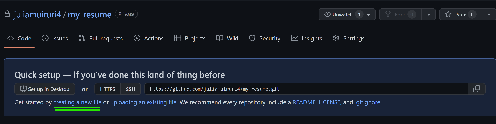
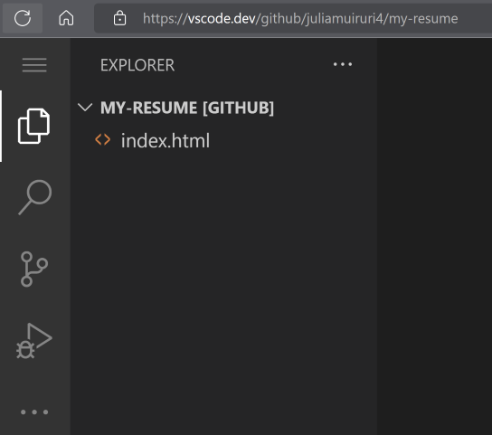
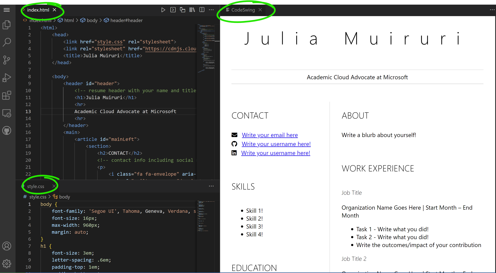

# Create a resume-website using vscode.dev

_How cool would it be to have a recruiter ask for your resume and you send them a url?_ 😎

<!----
TODO: add an optional image

> Sketchnote by [Author name](https://example.com)
---->

<!---
## Pre-Lecture Quiz
[Pre-lecture quiz](https://ashy-river-0debb7803.1.azurestaticapps.net/quiz/3)
---->

## Objectives

After this assignment, you'll learn how to:

- Create a website to showcase your resume

### Prerequisites

1. A GitHub account. Navigate to [GitHub](https://github.com/) and create an account if you haven't already.

## Steps

**Step 1:** Create a new GitHub Repository and give it a name `my-resume`


**Step 2** Create an `index.html` file in your repository. We will add at least one file while still on github.com because you cannot open an empty repository on vscode.dev

Click the `creating a new file` link, type in the name `index.html` and select the `Commit new file` button




**Step 3:** Open [VSCode.dev](https://vscode.dev) and select the `Open Remote Repository` button

Copy the url to the repository you just created for your resume site and paste it in the input box:

_Replace `your-username` with your github username_

```
https://github.com/your-username/my-resume
```

✅ If successful, you'll see your project and the index.html file open up on the text editor on the browser.




**Step 4:** Open the `index.html` file, paste in the code below on your code area and save

<details>
    <summary><b>HTML code responsible for the content on your resume website.</b></summary>
    
        <html>

            <head>
                <link href="style.css" rel="stylesheet">
                <link rel="stylesheet" href="https://cdnjs.cloudflare.com/ajax/libs/font-awesome/5.15.4/css/all.min.css">
                <title>Your Name Goes Here!</title>
            </head>
            <body>
                <header id="header">
                    <!-- resume header with your name and title -->
                    <h1>Your Name Goes Here!</h1>
                    <hr>
                    Your Role!
                    <hr>
                </header>
                <main>
                    <article id="mainLeft">
                        <section>
                            <h2>CONTACT</h2>
                            <!-- contact info including social media -->
                            <p>
                                <i class="fa fa-envelope" aria-hidden="true"></i>
                                <a href="mailto:username@domain.top-level domain">Write your email here</a>
                            </p>
                            <p>
                                <i class="fab fa-github" aria-hidden="true"></i>
                                <a href="github.com/yourGitHubUsername">Write your username here!</a>
                            </p>
                            <p>
                                <i class="fab fa-linkedin" aria-hidden="true"></i>
                                <a href="linkedin.com/yourLinkedInUsername">Write your username here!</a>
                            </p>
                        </section>
                        <section>
                            <h2>SKILLS</h2>
                            <!-- your skills -->
                            <ul>
                                <li>Skill 1!</li>
                                <li>Skill 2!</li>
                                <li>Skill 3!</li>
                                <li>Skill 4!</li>
                            </ul>
                        </section>
                        <section>
                            <h2>EDUCATION</h2>
                            <!-- your education -->
                            <h3>Write your course here!</h3>
                            <p>
                                Write your institution here!
                            </p>
                            <p>
                                Start - End Date
                            </p>
                        </section>            
                    </article>
                    <article id="mainRight">
                        <section>
                            <h2>ABOUT</h2>
                            <!-- about you -->
                            <p>Write a blurb about yourself!</p>
                        </section>
                        <section>
                            <h2>WORK EXPERIENCE</h2>
                            <!-- your work experience -->
                            <h3>Job Title</h3>
                            <p>
                                Organization Name Goes Here | Start Month – End Month
                            </p>
                            <ul>
                                    <li>Task 1 - Write what you did!</li>
                                    <li>Task 2 - Write what you did!</li>
                                    <li>Write the outcomes/impact of your contribution</li>
                                    
                            </ul>
                            <h3>Job Title 2</h3>
                            <p>
                                Organization Name Goes Here | Start Month – End Month
                            </p>
                            <ul>
                                    <li>Task 1 - Write what you did!</li>
                                    <li>Task 2 - Write what you did!</li>
                                    <li>Write the outcomes/impact of your contribution</li>
                                    
                            </ul>
                        </section>
                    </article>
                </main>
            </body>
        </html>
</details>

Add your resume details to replace the _placeholder text_ on the html code

**Step 5:** Hover on the My-Resume folder, click the `New File ...` icon and create 2 new files in your project: `style.css` and `codeswing.json` files 

**Step 6:** Open the `style.css` file, paste in the code below and save

 <details>
        <summary><b>CSS code to format the layout of the site.</b></summary>
            
            body {
                font-family: 'Segoe UI', Tahoma, Geneva, Verdana, sans-serif;
                font-size: 16px;
                max-width: 960px;
                margin: auto;
            }
            h1 {
                font-size: 3em;
                letter-spacing: .6em;
                padding-top: 1em;
                padding-bottom: 1em;
            }

            h2 {
                font-size: 1.5em;
                padding-bottom: 1em;
            }

            h3 {
                font-size: 1em;
                padding-bottom: 1em;
            }
            main { 
                display: grid;
                grid-template-columns: 40% 60%;
                margin-top: 3em;
            }
            header {
                text-align: center;
                margin: auto 2em;
            }

            section {
                margin: auto 1em 4em 2em;
            }

            i {
                margin-right: .5em;
            }

            p {
                margin: .2em auto
            }

            hr {
                border: none;
                background-color: lightgray;
                height: 1px;
            }

            h1, h2, h3 {
                font-weight: 100;
                margin-bottom: 0;
            }
            #mainLeft {
                border-right: 1px solid lightgray;
            }
            
</details>

**Step 6:** Open the `codeswing.json` file, paste in the code below and save

    {
    "scripts": [],
    "styles": []
    }


**Step 7:** Install the `Codeswing extension` to visualize the resume website on the code area. 

Click the _`Extensions`_ icon on the activity bar and type in Codeswing. Either click the _blue install button_ on the expanded activity bar to install or use the install button that appears on the code area once you select the extension to load additional information. Immediately after installing the extension, observe your code area to see the changes to your project 😃


This is what you will see on your on your screen after you install the extension.



If you are satisfied with the changes you made, hover on the `Changes` folder and click the `+` button to stage the changes.

Type in a commit message _(A description of the change you have made to the project)_ and commit your changes by clicking the `check`.Once done working on your project, select the hamburger menu icon at the top left to return to the repository on GitHub.

Congratulations 🎉 You have just created your resume website using vscode.dev in few steps.
## 🚀 Challenge

Open a remote repository you have permissions to make changes and update some files. Next, try creating a new branch with your changes and make a Pull Request.

<!----
## Post-Lecture Quiz
[Post-lecture quiz](https://ashy-river-0debb7803.1.azurestaticapps.net/quiz/4)
---->

## Review & Self Study

Read more about [VSCode.dev](https://code.visualstudio.com/docs/editor/vscode-web?WT.mc_id=academic-0000-alfredodeza) and some of its other features.
