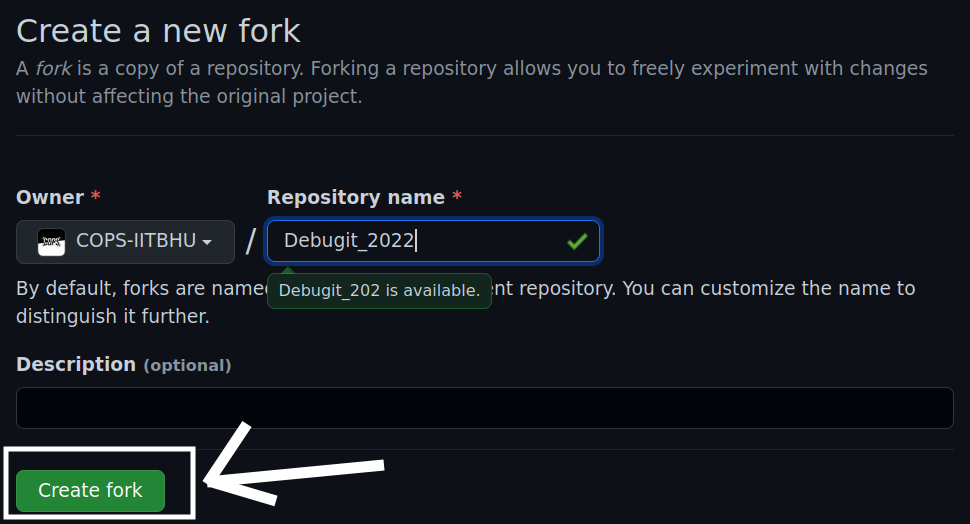
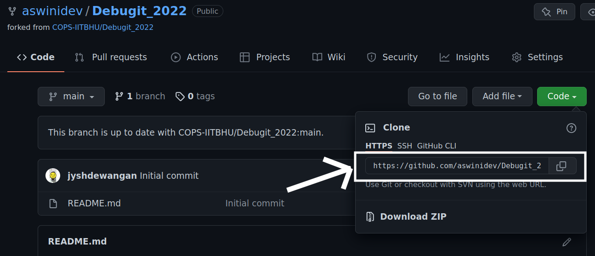
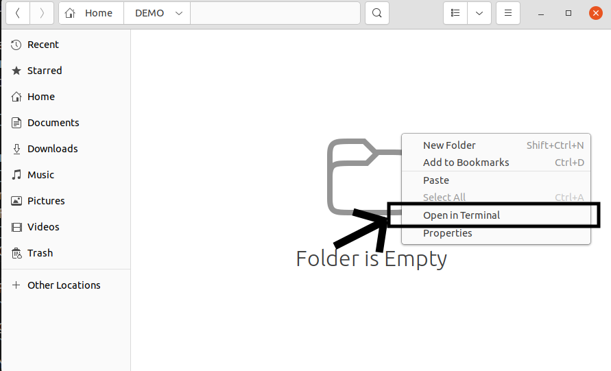
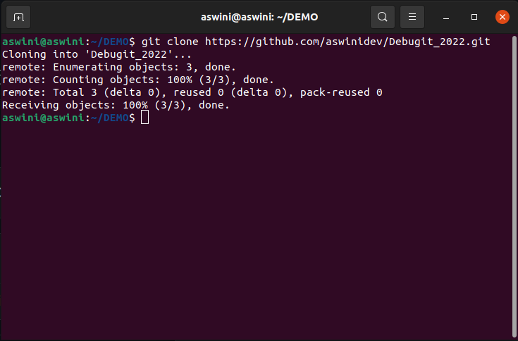
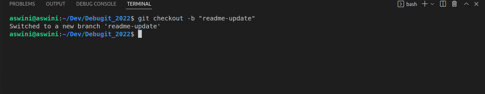
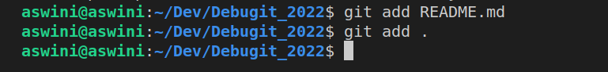
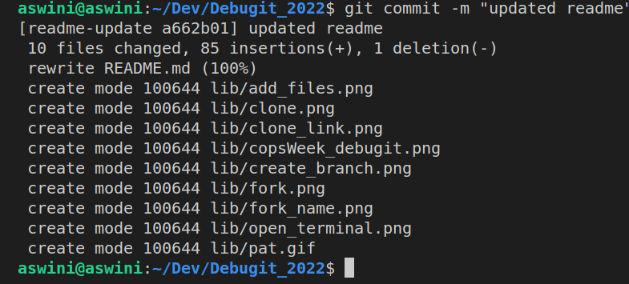
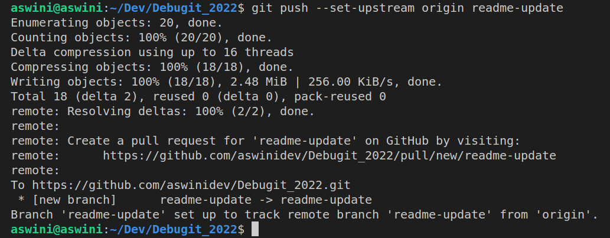
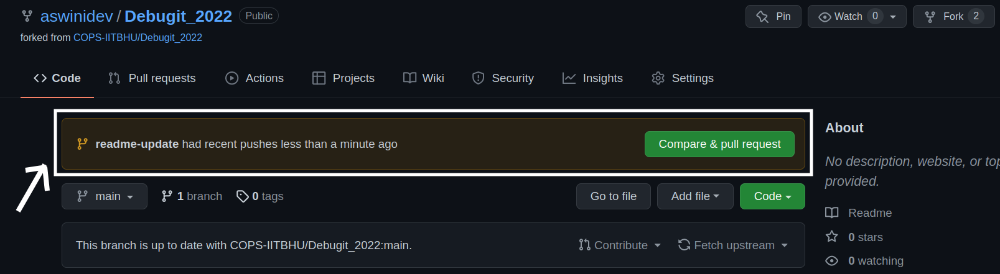
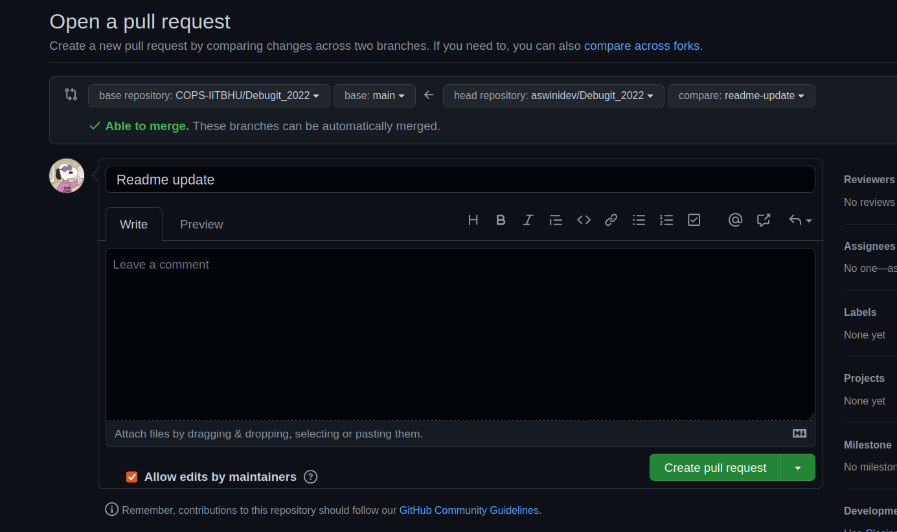

## Debugit 2022
[](https://hackalog.copsiitbhu.co.in/hackathon/debug-it-2022)

## Introduction
Debugit is a week long hackathon open to ideas in a very literal sense. You can make anything from the projects' list we'll share or ignite the inquisitive Bob the Builder inside you to make something exciting and completely new!

## How to make a submission?
Submissions are to be made through GitHub Pull Requests. To know more about how to make a GitHub Pull Request you can refer the [Fundamentals of Git](https://www.youtube.com/playlist?list=PLLt4yMoVgczVgFcTzT60U5IXtNX1qjHL9) playlist which contains everything that you would need.

## Make sure to include
  - A README.md file with your name, contact information, project description and how to run the code (and other necessary information).
  - A folder containing a demo video of your project.

## Here is a detailed step by step walkthrough if you don't know how to make a Debugit submission.

- Create a fork of this [repository](https://github.com/COPS-IITBHU/Debugit_2022)
 A fork is a copy of a repository. Forking a repository allows you to freely experiment with changes without affecting the original project. 
   1. Click on the fork icon in the repository that you might find at the top right corner.

   Demo:
   

   2. It will ask you what would you like to name the forked repository. By default they are named the same as the parent directory. Lets keep the name as it is.

   Demo:
   

- Clone the repository that you forked
  1. Find the link which you would need to clone and copy it.

   Demo:
   

  2. Go to the directory in which you want to clone your repository and open the terminal.

   Demo:
   

  3. Run the `git clone` command in the terminal (in case of windows, git bash terminal) and append the link that you copied.
     ```
     git clone <repository_link>
     ```

     Demo:
     

  4. You will find that the repository is cloned in the directory.
- Now you can open the directory in vs code and play with the code and complete your project. 
- After completing the project, its time to push your code:
  1. Open the vs code (or any other editor of your choice) terminal in the project folder. 
  2. Create a new branch in which you want to push your code using the following code.
     ```
     git checkout -b <branch_name>
     ```
     You can name your branch whatever you like.

     Demo:
     

  3. Check which branch are you on using the `git branch` command.
     ```
     git branch
     ```
  4. The branch name with a `*` on it is the current branch. If it is different from the branch that you created, then switch to your branch using the `git checkout`
     ```
     git checkout <branch_name>
     ```
  5. You can check the status of the files using 
     ```
     git status
     ```
  6. Add (Stage) all the files you want to upload using the `git add` command.
    To add individual files run the following command:
     ```
     git add <filename>
     ```
     If you want to add all the files from your project directory you can run
     ```
     git add .
     ```
     It is recommended not to add the some directories like node_modules directory in your commit. You can prevent it by adding it in a `.gitignore` file (For more reference [here](https://www.w3schools.com/git/git_ignore.asp?remote=github)).

     Demo:
     

  6. Commmit your code.
     You can commit all your staged code (to the local git repository) using the `git commit` command
    Run the following command:
     ```
     git commit -m "first commit"
     ```
     You can replace `first commit` with anything. It is actually a message to let you keep a brief track of what changes has been done in that commit.

     Demo:
     

  7. Push your code.
     Push all of your commited code using the `git push` command.
    Run the following command:
     ```
     git push --set-upstream origin <branch_name>
     ```

     Demo:
     

- Make the Pull Request and submit your code.
  1. After you push your code, it gets uploaded to your forked directory and creates a new branch that you created.
  2. If it notices any difference in the code of your forked repo and the parent repo. It automatically shows you an option to create a pull request.

    Demo:
    

  3. Write down a brief description of your project in the Pull Request description and give the PR a proper title and click on create pull request. Now GitHub might run some checks. If you pass all the checks, you are good to go.

    Demo:
     


- Pat yourself on the back

  

> All The Best 🎉🎉.