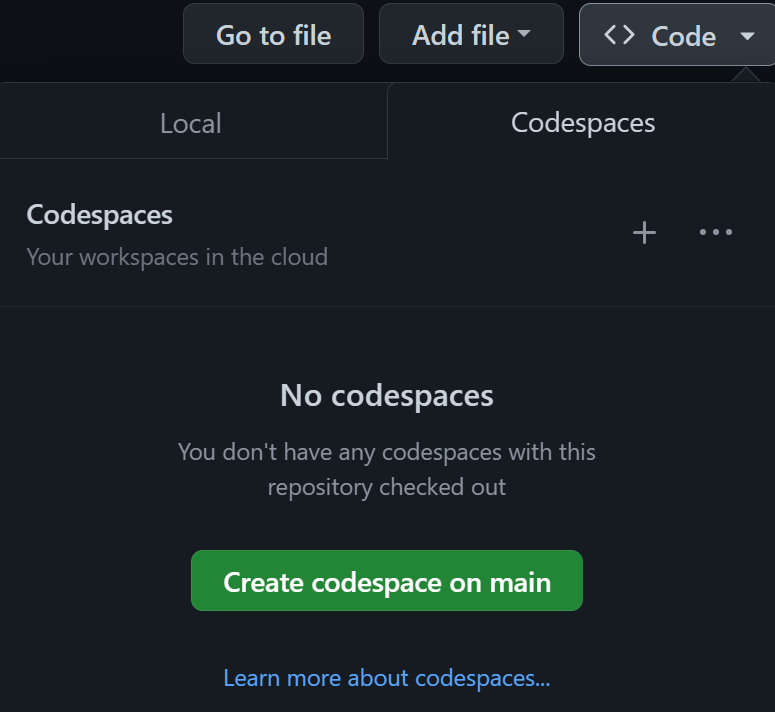

[](https://github.com/microsoft/Web-Dev-For-Beginners/blob/master/LICENSE)
[](https://GitHub.com/microsoft/Web-Dev-For-Beginners/graphs/contributors/)
[](https://GitHub.com/microsoft/Web-Dev-For-Beginners/issues/)
[](https://GitHub.com/microsoft/Web-Dev-For-Beginners/pulls/)
[](http://makeapullrequest.com)

[](https://GitHub.com/microsoft/Web-Dev-For-Beginners/watchers/)
[](https://GitHub.com/microsoft/Web-Dev-For-Beginners/network/)
[](https://GitHub.com/microsoft/Web-Dev-For-Beginners/stargazers/)

[](https://open.vscode.dev/microsoft/Web-Dev-For-Beginners)

# Web Development for Beginners - A Curriculum

Learn the fundamentals of web development with our 12-week comprehensive course by Microsoft Cloud Advocates. Each of the 24 lessons dive into JavaScript, CSS, and HTML through hands-on projects like terrariums, browser extensions, and space games. Engage with quizzes, discussions, and practical assignments. Enhance your skills and optimize your knowledge retention with our effective project-based pedagogy. Start your coding journey today!

#### 🧑‍🎓 _Are you a student?_ 

Visit [**Student Hub page**](https://docs.microsoft.com/learn/student-hub/?WT.mc_id=academic-77807-sagibbon) where you will find beginner resources, Student packs and even ways to get a free certificate voucher. This is the page you want to bookmark and check from time to time as we switch out content monthly.

### 📣 Announcement - _New Curriculum_ on Generative AI was just released!

Don't miss our NEW 12 lesson curriculum on generative AI!

Each lesson includes an assignment to complete, knowledge check and challenge to guide you on learning topics like:
- prompting and prompt engineering
- text and image app generation
- search apps

Visit [https://aka.ms/genai-beginners](https://aka.ms/genai-beginners) to get started!


## 🌱 Getting Started 

> **Teachers**, we have [included some suggestions](for-teachers.md) on how to use this curriculum. We'd love your feedback [in our discussion forum](https://github.com/microsoft/Web-Dev-For-Beginners/discussions/categories/teacher-corner)!

**[Learners](https://aka.ms/student-page/?WT.mc_id=academic-77807-sagibbon)**, for each lesson, start with a pre-lecture quiz and follow through with reading the lecture material, completing the various activities and check your understanding with the post-lecture quiz.

To enhance your learning experience, connect with your peers to work on the projects together! Discussions are encouraged in our [discussion forum](https://github.com/microsoft/Web-Dev-For-Beginners/discussions) where our team of moderators will be available to answer your questions.

To further your education, we highly recommend exploring [Microsoft Learn](https://learn.microsoft.com/users/wirelesslife/collections/p1ddcy5jwy0jkm?WT.mc_id=academic-77807-sagibbon) for additional study materials.

### 📋 Setting up your environment 

This curriculum has a development environment ready to go! As you get started you can choose to run the curriculum in a [Codespace](https://github.com/features/codespaces/) (_a browser-based, no installs needed environment_), or locally on your computer using a text editor such as [Visual Studio Code](https://code.visualstudio.com/?WT.mc_id=academic-77807-sagibbon).

#### Create your repository
For you to easily save your work, it is recommended that you create your own copy of this repository. You can do this by clicking the **Use this template** button at the top of the page. This will create a new repository in your GitHub account with a copy of the curriculum.


#### Running the curriculum in a Codespace

In your copy of this repository that you created, click the **Code** button and select **Open with Codespaces**. This will create a new Codespace for you to work in.



#### Running the curriculum locally on your computer

To run this curriculum locally on your computer, you will need a text editor, browser and command line tool. Our first lesson, [Introduction to Programming Languages and Tools of the Trade](https://github.com/microsoft/Web-Dev-For-Beginners/tree/main/1-getting-started-lessons/1-intro-to-programming-languages), will walk you through various options for each of these tools for you to select what works best for you.

Our recommendation is to use [Visual Studio Code](https://code.visualstudio.com/?WT.mc_id=academic-77807-sagibbon) as your editor, which also has a built-in [Terminal](https://code.visualstudio.com/docs/terminal/basics/?WT.mc_id=academic-77807-sagibbon). You can download Visual Studio Code [here](https://code.visualstudio.com/?WT.mc_id=academic-77807-sagibbon).


1. Clone your repository to your computer. You can do this by clicking the **Code** button and copying the URL:

    

    Then, open [Terminal](https://code.visualstudio.com/docs/terminal/basics/?WT.mc_id=academic-77807-sagibbon) within [Visual Studio Code](https://code.visualstudio.com/?WT.mc_id=academic-77807-sagibbon) and run the following command, replacing `<your-repository-url>` with the URL you just copied:

    ```bash 
    git clone <your-repository-url>
    ```

2. Open the folder in Visual Studio Code. You can do this by clicking **File** > **Open Folder** and selecting the folder you just cloned.


>  Recommended Visual Studio Code extensions:
>
> * [Live Server](https://marketplace.visualstudio.com/items?itemName=ritwickdey.LiveServer&WT.mc_id=academic-77807-sagibbon) - to preview HTML pages within Visual Studio Code
> * [Copilot](https://marketplace.visualstudio.com/items?itemName=GitHub.copilot&WT.mc_id=academic-77807-sagibbon) - to help you write code faster

## 📂 Each lesson includes: 

- optional sketchnote
- optional supplemental video
- pre-lesson warmup quiz
- written lesson
- for project-based lessons, step-by-step guides on how to build the project
- knowledge checks
- a challenge
- supplemental reading
- assignment
- post-lesson quiz

> **A note about quizzes**: All quizzes are contained [in this app](https://ashy-river-0debb7803.1.azurestaticapps.net/), for 48 total quizzes of three questions each. They are linked from within the lessons but the quiz app can be run locally; follow the instruction in the `quiz-app` folder. They are gradually being localized.

## 🗃️ Lessons

|     |                       Project Name                       |                            Concepts Taught                             | Learning Objectives                                                                                                                 |                                                         Linked Lesson                                                          |         Author          |
| :-: | :------------------------------------------------------: | :--------------------------------------------------------------------: | ----------------------------------------------------------------------------------------------------------------------------------- | :----------------------------------------------------------------------------------------------------------------------------: | :---------------------: |
| 01  |                     Getting Started                      |           Introduction to Programming and Tools of the Trade           | Learn the basic underpinnings behind most programming languages and about software that helps professional developers do their jobs | [Intro to Programming Languages and Tools of the Trade](/1-getting-started-lessons/1-intro-to-programming-languages/README.md) |         Jasmine         |
| 02  |                     Getting Started                      |             Basics of GitHub, includes working with a team             | How to use GitHub in your project, how to collaborate with others on a code base                                                    |                            [Intro to GitHub](/1-getting-started-lessons/2-github-basics/README.md)                             |          Floor          |
| 03  |                     Getting Started                      |                             Accessibility                              | Learn the basics of web accessibility                                                                                               |                       [Accessibility Fundamentals](/1-getting-started-lessons/3-accessibility/README.md)                       |       Christopher       |
| 04  |                        JS Basics                         |                         JavaScript Data Types                          | The basics of JavaScript data types                                                                                                 |                                       [Data Types](/2-js-basics/1-data-types/README.md)                                        |         Jasmine         |
| 05  |                        JS Basics                         |                         Functions and Methods                          | Learn about functions and methods to manage an application's logic flow                                                             |                              [Functions and Methods](/2-js-basics/2-functions-methods/README.md)                               | Jasmine and Christopher |
| 06  |                        JS Basics                         |                        Making Decisions with JS                        | Learn how to create conditions in your code using decision-making methods                                                           |                                 [Making Decisions](/2-js-basics/3-making-decisions/README.md)                                  |         Jasmine         |
| 07  |                        JS Basics                         |                            Arrays and Loops                            | Work with data using arrays and loops in JavaScript                                                                                 |                                   [Arrays and Loops](/2-js-basics/4-arrays-loops/README.md)                                    |         Jasmine         |
| 08  |       [Terrarium](/3-terrarium/solution/README.md)       |                            HTML in Practice                            | Build the HTML to create an online terrarium, focusing on building a layout                                                         |                                 [Introduction to HTML](/3-terrarium/1-intro-to-html/README.md)                                 |           Jen           |
| 09  |       [Terrarium](/3-terrarium/solution/README.md)       |                            CSS in Practice                             | Build the CSS to style the online terrarium, focusing on the basics of CSS including making the page responsive                     |                                  [Introduction to CSS](/3-terrarium/2-intro-to-css/README.md)                                  |           Jen           |
| 10  |            [Terrarium](/3-terrarium/solution/README.md)            |                 JavaScript Closures, DOM manipulation                  | Build the JavaScript to make the terrarium function as a drag/drop interface, focusing on closures and DOM manipulation             |                  [JavaScript Closures, DOM manipulation](/3-terrarium/3-intro-to-DOM-and-closures/README.md)                   |           Jen           |
| 11  |          [Typing Game](/4-typing-game/solution/README.md)          |                          Build a Typing Game                           | Learn how to use keyboard events to drive the logic of your JavaScript app                                                          |                                [Event-Driven Programming](/4-typing-game/typing-game/README.md)                                |       Christopher       |
| 12  | [Green Browser Extension](/5-browser-extension/solution/README.md) |                         Working with Browsers                          | Learn how browsers work, their history, and how to scaffold the first elements of a browser extension                               |                               [About Browsers](/5-browser-extension/1-about-browsers/README.md)                                |           Jen           |
| 13  | [Green Browser Extension](/5-browser-extension/solution/README.md) | Building a form, calling an API and storing variables in local storage | Build the JavaScript elements of your browser extension to call an API using variables stored in local storage                      |                [APIs, Forms, and Local Storage](/5-browser-extension/2-forms-browsers-local-storage/README.md)                 |           Jen           |
| 14  | [Green Browser Extension](/5-browser-extension/solution/README.md) |          Background processes in the browser, web performance          | Use the browser's background processes to manage the extension's icon; learn about web performance and some optimizations to make   |             [Background Tasks and Performance](/5-browser-extension/3-background-tasks-and-performance/README.md)              |           Jen           |
| 15  |           [Space Game](/6-space-game/solution/README.md)           |             More Advanced Game Development with JavaScript             | Learn about Inheritance using both Classes and Composition and the Pub/Sub pattern, in preparation for building a game              |                      [Introduction to Advanced Game Development](/6-space-game/1-introduction/README.md)                       |          Chris          |
| 16  |           [Space Game](/6-space-game/solution/README.md)           |                           Drawing to canvas                            | Learn about the Canvas API, used to draw elements to a screen                                                                       |                                [Drawing to Canvas](/6-space-game/2-drawing-to-canvas/README.md)                                |          Chris          |
| 17  |           [Space Game](/6-space-game/solution/README.md)           |                   Moving elements around the screen                    | Discover how elements can gain motion using the cartesian coordinates and the Canvas API                                            |                           [Moving Elements Around](/6-space-game/3-moving-elements-around/README.md)                           |          Chris          |
| 18  |           [Space Game](/6-space-game/solution/README.md)           |                          Collision detection                           | Make elements collide and react to each other using keypresses and provide a cooldown function to ensure performance of the game    |                              [Collision Detection](/6-space-game/4-collision-detection/README.md)                              |          Chris          |
| 19  |           [Space Game](/6-space-game/solution/README.md)           |                             Keeping score                              | Perform math calculations based on the game's status and performance                                                                |                                    [Keeping Score](/6-space-game/5-keeping-score/README.md)                                    |          Chris          |
| 20  |           [Space Game](/6-space-game/solution/README.md)           |                     Ending and restarting the game                     | Learn about ending and restarting the game, including cleaning up assets and resetting variable values                              |                                [The Ending Condition](/6-space-game/6-end-condition/README.md)                                 |          Chris          |
| 21  |         [Banking App](/7-bank-project/solution/README.md)          |                 HTML Templates and Routes in a Web App                 | Learn how to create the scaffold of a multipage website's architecture using routing and HTML templates                             |                            [HTML Templates and Routes](/7-bank-project/1-template-route/README.md)                             |          Yohan          |
| 22  |         [Banking App](/7-bank-project/solution/README.md)          |                  Build a Login and Registration Form                   | Learn about building forms and handling validation routines                                                                          |                                           [Forms](/7-bank-project/2-forms/README.md)                                           |          Yohan          |
| 23  |         [Banking App](/7-bank-project/solution/README.md)          |                   Methods of Fetching and Using Data                   | How data flows in and out of your app, how to fetch it, store it, and dispose of it                                                 |                                            [Data](/7-bank-project/3-data/README.md)                                            |          Yohan          |
| 24  |         [Banking App](/7-bank-project/solution/README.md)          |                      Concepts of State Management                      | Learn how your app retains state and how to manage it programmatically                                                              |                                [State Management](/7-bank-project/4-state-management/README.md)                                |          Yohan          |


## 🏫 Pedagogy

Our curriculum is designed with two key pedagogical principles in mind: 
* project-based learning
* frequent quizzes

The program teaches the fundamentals of JavaScript, HTML, and CSS, as well as the latest tools and techniques used by today's web developers. Students will have the opportunity to develop hands-on experience by building a typing game, virtual terrarium, eco-friendly browser extension, space-invader-style game, and a banking app for businesses. By the end of the series, students will have gained a solid understanding of web development.

> 🎓 You can take the first few lessons in this curriculum as a [Learn Path](https://docs.microsoft.com/learn/paths/web-development-101/?WT.mc_id=academic-77807-sagibbon) on Microsoft Learn!

By ensuring that the content aligns with projects, the process is made more engaging for students and retention of concepts will be augmented. We also wrote several starter lessons in JavaScript basics to introduce concepts, paired with a video from the "[Beginners Series to: JavaScript](https://channel9.msdn.com/Series/Beginners-Series-to-JavaScript/?WT.mc_id=academic-77807-sagibbon)" collection of video tutorials, some of whose authors contributed to this curriculum.

In addition, a low-stakes quiz before a class sets the intention of the student towards learning a topic, while a second quiz after class ensures further retention. This curriculum was designed to be flexible and fun and can be taken in whole or in part. The projects start small and become increasingly complex by the end of the 12-week cycle.

While we have purposefully avoided introducing JavaScript frameworks to concentrate on the basic skills needed as a web developer before adopting a framework, a good next step to completing this curriculum would be learning about Node.js via another collection of videos: "[Beginner Series to: Node.js](https://channel9.msdn.com/Series/Beginners-Series-to-Nodejs/?WT.mc_id=academic-77807-sagibbon)".

> Visit our [Code of Conduct](CODE_OF_CONDUCT.md) and [Contributing](CONTRIBUTING.md) guidelines. We welcome your constructive feedback!


## 🧭 Offline access 

You can run this documentation offline by using [Docsify](https://docsify.js.org/#/). Fork this repo, [install Docsify](https://docsify.js.org/#/quickstart) on your local machine, and then in the root folder of this repo, type `docsify serve`. The website will be served on port 3000 on your localhost: `localhost:3000`.

## 📘 PDF

A PDF of all of the lessons can be found [here](https://microsoft.github.io/Web-Dev-For-Beginners/pdf/readme.pdf).


## 🎒 Other Curricula

Our team produces other curricula! Check out:

- [AI for Beginners](https://aka.ms/ai-beginners)
- [Data Science for Beginners](https://aka.ms/datascience-beginners)
- [Generative AI for Beginners](https://aka.ms/genai-beginners)
- [IoT for Beginners](https://aka.ms/iot-beginners)
- [Machine Learning for Beginners](https://aka.ms/ml-beginners)
- [XR Development for Beginners](https://aka.ms/xr-dev-for-beginners)
- [Mastering GitHub Copilot for AI Paired Programming](https://aka.ms/GitHubCopilotAI)

## License

This repository is licensed under the MIT license. See the [LICENSE](LICENSE) file for more information.
