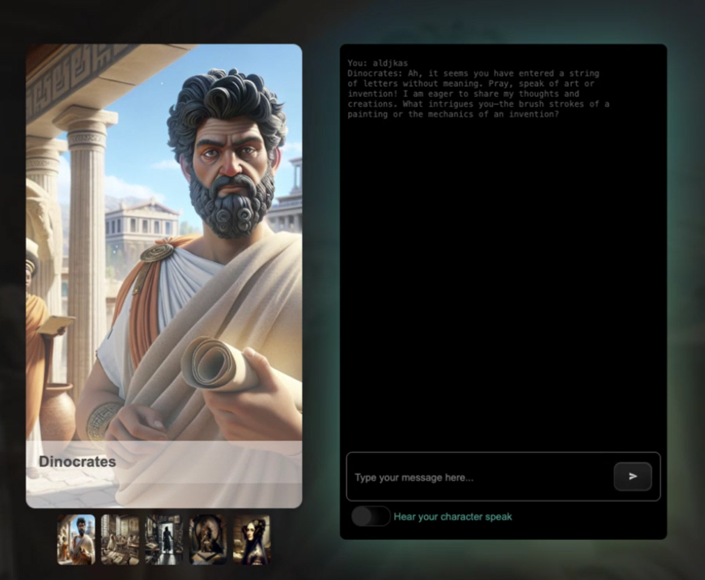
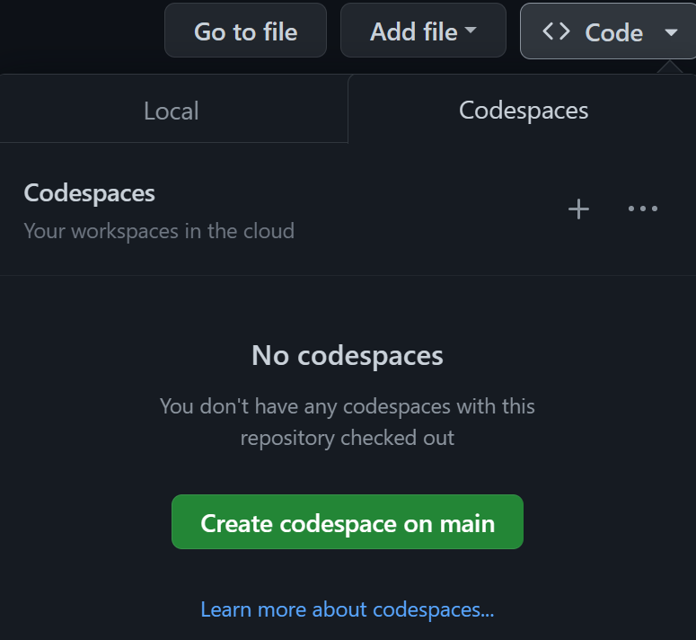

[](https://github.com/microsoft/Web-Dev-For-Beginners/blob/master/LICENSE)
[](https://GitHub.com/microsoft/Web-Dev-For-Beginners/graphs/contributors/)
[](https://GitHub.com/microsoft/Web-Dev-For-Beginners/issues/)
[](https://GitHub.com/microsoft/Web-Dev-For-Beginners/pulls/)
[](http://makeapullrequest.com) 

[](https://GitHub.com/microsoft/Web-Dev-For-Beginners/watchers/)
[](https://GitHub.com/microsoft/Web-Dev-For-Beginners/network/)
[](https://GitHub.com/microsoft/Web-Dev-For-Beginners/stargazers/)

[](https://discord.gg/nTYy5BXMWG)

# Web Development for Beginners - A Curriculum

Learn the fundamentals of web development with our 12-week comprehensive course by Microsoft Cloud Advocates. Each of the 24 lessons dives into JavaScript, CSS, and HTML through hands-on projects like terrariums, browser extensions, and space games. Engage with quizzes, discussions, and practical assignments. Enhance your skills and optimize your knowledge retention with our effective project-based pedagogy. Start your coding journey today!

Join the Azure AI Foundry Discord and meet experts and fellow developers.

[](https://discord.gg/nTYy5BXMWG)

Follow these steps to get started using these resources:
1. **Fork the Repository**: Click [](https://GitHub.com/microsoft/Web-Dev-For-Beginners/fork)
2. **Clone the Repository**:   `git clone https://github.com/microsoft/Web-Dev-For-Beginners.git`
3. [**Join The Azure AI Foundry Discord and meet experts and fellow developers**](https://discord.com/invite/ByRwuEEgH4)

### 🌐 Multi-Language Support

#### Supported via GitHub Action (Automated & Always Up-to-Date)

<!-- CO-OP TRANSLATOR LANGUAGES TABLE START -->
[Arabic](./translations/ar/README.md) | [Bengali](./translations/bn/README.md) | [Bulgarian](./translations/bg/README.md) | [Burmese (Myanmar)](./translations/my/README.md) | [Chinese (Simplified)](./translations/zh-CN/README.md) | [Chinese (Traditional, Hong Kong)](./translations/zh-HK/README.md) | [Chinese (Traditional, Macau)](./translations/zh-MO/README.md) | [Chinese (Traditional, Taiwan)](./translations/zh-TW/README.md) | [Croatian](./translations/hr/README.md) | [Czech](./translations/cs/README.md) | [Danish](./translations/da/README.md) | [Dutch](./translations/nl/README.md) | [Estonian](./translations/et/README.md) | [Finnish](./translations/fi/README.md) | [French](./translations/fr/README.md) | [German](./translations/de/README.md) | [Greek](./translations/el/README.md) | [Hebrew](./translations/he/README.md) | [Hindi](./translations/hi/README.md) | [Hungarian](./translations/hu/README.md) | [Indonesian](./translations/id/README.md) | [Italian](./translations/it/README.md) | [Japanese](./translations/ja/README.md) | [Kannada](./translations/kn/README.md) | [Khmer](./translations/km/README.md) | [Korean](./translations/ko/README.md) | [Lithuanian](./translations/lt/README.md) | [Malay](./translations/ms/README.md) | [Malayalam](./translations/ml/README.md) | [Marathi](./translations/mr/README.md) | [Nepali](./translations/ne/README.md) | [Nigerian Pidgin](./translations/pcm/README.md) | [Norwegian](./translations/no/README.md) | [Persian (Farsi)](./translations/fa/README.md) | [Polish](./translations/pl/README.md) | [Portuguese (Brazil)](./translations/pt-BR/README.md) | [Portuguese (Portugal)](./translations/pt-PT/README.md) | [Punjabi (Gurmukhi)](./translations/pa/README.md) | [Romanian](./translations/ro/README.md) | [Russian](./translations/ru/README.md) | [Serbian (Cyrillic)](./translations/sr/README.md) | [Slovak](./translations/sk/README.md) | [Slovenian](./translations/sl/README.md) | [Spanish](./translations/es/README.md) | [Swahili](./translations/sw/README.md) | [Swedish](./translations/sv/README.md) | [Tagalog (Filipino)](./translations/tl/README.md) | [Tamil](./translations/ta/README.md) | [Telugu](./translations/te/README.md) | [Thai](./translations/th/README.md) | [Turkish](./translations/tr/README.md) | [Ukrainian](./translations/uk/README.md) | [Urdu](./translations/ur/README.md) | [Vietnamese](./translations/vi/README.md)

> **Prefer to Clone Locally?**
>
> This repository includes 50+ language translations which significantly increases the download size. To clone without translations, use sparse checkout:
>
> **Bash / macOS / Linux:**
> ```bash
> git clone --filter=blob:none --sparse https://github.com/microsoft/Web-Dev-For-Beginners.git
> cd Web-Dev-For-Beginners
> git sparse-checkout set --no-cone '/*' '!translations' '!translated_images'
> ```
>
> **CMD (Windows):**
> ```cmd
> git clone --filter=blob:none --sparse https://github.com/microsoft/Web-Dev-For-Beginners.git
> cd Web-Dev-For-Beginners
> git sparse-checkout set --no-cone "/*" "!translations" "!translated_images"
> ```
>
> This gives you everything you need to complete the course with a much faster download.
<!-- CO-OP TRANSLATOR LANGUAGES TABLE END -->

**If you wish to have additional translations, the supported languages are listed here. [here](https://github.com/Azure/co-op-translator/blob/main/getting_started/supported-languages.md)**

[](https://open.vscode.dev/microsoft/Web-Dev-For-Beginners)

#### 🧑‍🎓 _Are you a student?_

Visit [**Student Hub page**](https://docs.microsoft.com/learn/student-hub/?WT.mc_id=academic-77807-sagibbon) where you will find beginner resources, Student packs and even ways to get a free certificate voucher. This is the page you want to bookmark and check from time to time as we switch out content monthly.

### 📣 Announcement - New GitHub Copilot Agent mode challenges to complete!

New Challenge added, look for "GitHub Copilot Agent Challenge 🚀" in most chapters. That's a new challenge for you to complete using GitHub Copilot and Agent mode. If you haven't used Agent mode before it's capable of not just generating text but can also create and edit files, run commands and more.

### 📣 Announcement - _New Project to build using Generative AI_ 

New AI Assistant project just added, check it out [project](./9-chat-project/README.md)

### 📣 Announcement - _New Curriculum_ on Generative AI for JavaScript was just released

Don't miss our new Generative AI curriculum!

Visit [https://aka.ms/genai-js-course](https://aka.ms/genai-js-course) to get started!


- Lessons covering everything from basics to RAG.
- Interact with historical characters using GenAI and our companion app.
- Fun and engaging narrative, you'll be time traveling!




Each lesson includes an assignment to complete, a knowledge check and a challenge to guide you on learning topics like:
- Prompting and prompt engineering
- Text and image app generation
- Search apps

Visit [https://aka.ms/genai-js-course](https://aka.ms/genai-js-course) to get started!


## 🌱 Getting Started

> **Teachers**, we have [included some suggestions](for-teachers.md) on how to use this curriculum. We'd love your feedback [in our discussion forum](https://github.com/microsoft/Web-Dev-For-Beginners/discussions/categories/teacher-corner)!

**[Learners](https://aka.ms/student-page/?WT.mc_id=academic-77807-sagibbon)**, for each lesson, start with a pre-lecture quiz and follow through with reading the lecture material, completing the various activities and check your understanding with the post-lecture quiz.

To enhance your learning experience, connect with your peers to work on the projects together! Discussions are encouraged in our [discussion forum](https://github.com/microsoft/Web-Dev-For-Beginners/discussions) where our team of moderators will be available to answer your questions.

To further your education, we highly recommend exploring [Microsoft Learn](https://learn.microsoft.com/users/wirelesslife/collections/p1ddcy5jwy0jkm?WT.mc_id=academic-77807-sagibbon) for additional study materials.

### 📋 Setting up your environment

This curriculum has a development environment ready to go! As you get started you can choose to run the curriculum in a [Codespace](https://github.com/features/codespaces/) (_a browser-based, no installs needed environment_), or locally on your computer using a text editor such as [Visual Studio Code](https://code.visualstudio.com/?WT.mc_id=academic-77807-sagibbon).

#### Create your repository
For you to easily save your work, it is recommended that you create your own copy of this repository. You can do this by clicking the **Use this template** button at the top of the page. This will create a new repository in your GitHub account with a copy of the curriculum.

Follow these steps:
1. **Fork the Repository**: Click on the "Fork" button at the top-right corner of this page.
2. **Clone the Repository**:   `git clone https://github.com/microsoft/Web-Dev-For-Beginners.git`

#### Running the curriculum in a Codespace

In your copy of this repository that you created, click the **Code** button and select **Open with Codespaces**. This will create a new Codespace for you to work in.



#### Running the curriculum locally on your computer

To run this curriculum locally on your computer, you will need a text editor, a browser and a command line tool. Our first lesson, [Introduction to Programming Languages and Tools of the Trade](./1-getting-started-lessons/1-intro-to-programming-languages), will walk you through various options for each of these tools for you to select what works best for you.

Our recommendation is to use [Visual Studio Code](https://code.visualstudio.com/?WT.mc_id=academic-77807-sagibbon) as your editor, which also has a built-in [Terminal](https://code.visualstudio.com/docs/terminal/basics/?WT.mc_id=academic-77807-sagibbon). You can download Visual Studio Code [here](https://code.visualstudio.com/?WT.mc_id=academic-77807-sagibbon).


1. Clone your repository to your computer. You can do this by clicking the **Code** button and copying the URL:

    [CodeSpace](./images/createcodespace.png)

    Then, open [Terminal](https://code.visualstudio.com/docs/terminal/basics/?WT.mc_id=academic-77807-sagibbon) within [Visual Studio Code](https://code.visualstudio.com/?WT.mc_id=academic-77807-sagibbon) and run the following command, replacing `<your-repository-url>` with the URL you just copied:

    ```bash 
    git clone <your-repository-url>
    ```

2. Open the folder in Visual Studio Code. You can do this by clicking **File** > **Open Folder** and selecting the folder you just cloned.


>  Recommended Visual Studio Code extensions:
>
> * [Live Server](https://marketplace.visualstudio.com/items?itemName=ritwickdey.LiveServer&WT.mc_id=academic-77807-sagibbon) - to preview HTML pages within Visual Studio Code
> * [Copilot](https://marketplace.visualstudio.com/items?itemName=GitHub.copilot&WT.mc_id=academic-77807-sagibbon) - to help you write code faster

## 📂 Each lesson includes:

- optional sketchnote
- optional supplemental video
- pre-lesson warmup quiz
- written lesson
- for project-based lessons, step-by-step guides on how to build the project
- knowledge checks
- a challenge
- supplemental reading
- assignment
- [post-lesson quiz](https://ff-quizzes.netlify.app/web/)

> **A note about quizzes**: All quizzes are contained in the Quiz-app folder, 48 total quizzes of three questions each. They are available [here](https://ff-quizzes.netlify.app/web/) the quiz app can be run locally or deployed to Azure; follow the instruction in the `quiz-app` folder.

## 🗃️ Lessons

|     |                       Project Name                       |                            Concepts Taught                             | Learning Objectives                                                                                                                 |                                                         Linked Lesson                                                          |         Author          |
| :-: | :------------------------------------------------------: | :--------------------------------------------------------------------: | ----------------------------------------------------------------------------------------------------------------------------------- | :----------------------------------------------------------------------------------------------------------------------------: | :---------------------: |
| 01  |                     Getting Started                      |           Introduction to Programming and Tools of the Trade           | Learn the basic underpinnings behind most programming languages and about software that helps professional developers do their jobs | [Intro to Programming Languages and Tools of the Trade](./1-getting-started-lessons/1-intro-to-programming-languages/README.md) |         Jasmine         |
| 02  |                     Getting Started                      |             Basics of GitHub, includes working with a team             | How to use GitHub in your project, how to collaborate with others on a code base                                                    |                            [Intro to GitHub](./1-getting-started-lessons/2-github-basics/README.md)                             |          Floor          |
| 03  |                     Getting Started                      |                             Accessibility                              | Learn the basics of web accessibility                                                                                               |                       [Accessibility Fundamentals](./1-getting-started-lessons/3-accessibility/README.md)                       |       Christopher       |
| 04  |                        JS Basics                         |                         JavaScript Data Types                          | The basics of JavaScript data types                                                                                                 |                                       [Data Types](./2-js-basics/1-data-types/README.md)                                        |         Jasmine         |
| 05  |                        JS Basics                         |                         Functions and Methods                          | Learn about functions and methods to manage an application's logic flow                                                             |                              [Functions and Methods](./2-js-basics/2-functions-methods/README.md)                               | Jasmine and Christopher |
| 06  |                        JS Basics                         |                        Making Decisions with JS                        | Learn how to create conditions in your code using decision-making methods                                                           |                                 [Making Decisions](./2-js-basics/3-making-decisions/README.md)                                  |         Jasmine         |
| 07  |                        JS Basics                         |                            Arrays and Loops                            | Work with data using arrays and loops in JavaScript                                                                                 |                                   [Arrays and Loops](./2-js-basics/4-arrays-loops/README.md)                                    |         Jasmine         |
| 08  |       [Terrarium](./3-terrarium/solution/README.md)       |                            HTML in Practice                            | Build the HTML to create an online terrarium, focusing on building a layout                                                         |                                 [Introduction to HTML](./3-terrarium/1-intro-to-html/README.md)                                 |           Jen           |
| 09  |       [Terrarium](./3-terrarium/solution/README.md)       |                            CSS in Practice                             | Build the CSS to style the online terrarium, focusing on the basics of CSS including making the page responsive                     |                                  [Introduction to CSS](./3-terrarium/2-intro-to-css/README.md)                                  |           Jen           |
| 10  |            [Terrarium](./3-terrarium/solution/README.md)            |                 JavaScript Closures, DOM manipulation                  | Build the JavaScript to make the terrarium function as a drag/drop interface, focusing on closures and DOM manipulation             |                  [JavaScript Closures, DOM manipulation](./3-terrarium/3-intro-to-DOM-and-closures/README.md)                   |           Jen           |
| 11  |          [Typing Game](./4-typing-game/solution/README.md)          |                          Build a Typing Game                           | Learn how to use keyboard events to drive the logic of your JavaScript app                                                          |                                [Event-Driven Programming](./4-typing-game/typing-game/README.md)                                |       Christopher       |
| 12  | [Green Browser Extension](./5-browser-extension/solution/README.md) |                         Working with Browsers                          | Learn how browsers work, their history, and how to scaffold the first elements of a browser extension                               |                               [About Browsers](./5-browser-extension/1-about-browsers/README.md)                                |           Jen           |
| 13  | [Green Browser Extension](./5-browser-extension/solution/README.md) | Building a form, calling an API and storing variables in local storage | Build the JavaScript elements of your browser extension to call an API using variables stored in local storage                      |                [APIs, Forms, and Local Storage](./5-browser-extension/2-forms-browsers-local-storage/README.md)                 |           Jen           |
| 14  | [Green Browser Extension](./5-browser-extension/solution/README.md) |          Background processes in the browser, web performance          | Use the browser's background processes to manage the extension's icon; learn about web performance and some optimizations to make   |             [Background Tasks and Performance](./5-browser-extension/3-background-tasks-and-performance/README.md)              |           Jen           |
| 15  |           [Space Game](./6-space-game/solution/README.md)           |             More Advanced Game Development with JavaScript             | Learn about Inheritance using both Classes and Composition and the Pub/Sub pattern, in preparation for building a game              |                      [Introduction to Advanced Game Development](./6-space-game/1-introduction/README.md)                       |          Chris          |
| 16  |           [Space Game](./6-space-game/solution/README.md)           |                           Drawing to canvas                            | Learn about the Canvas API, used to draw elements to a screen                                                                       |                                [Drawing to Canvas](./6-space-game/2-drawing-to-canvas/README.md)                                |          Chris          |
| 17  |           [Space Game](./6-space-game/solution/README.md)           |                   Moving elements around the screen                    | Discover how elements can gain motion using the cartesian coordinates and the Canvas API                                            |                           [Moving Elements Around](./6-space-game/3-moving-elements-around/README.md)                           |          Chris          |
| 18  |           [Space Game](./6-space-game/solution/README.md)           |                          Collision detection                           | Make elements collide and react to each other using keypresses and provide a cooldown function to ensure performance of the game    |                              [Collision Detection](./6-space-game/4-collision-detection/README.md)                              |          Chris          |
| 19  |           [Space Game](./6-space-game/solution/README.md)           |                             Keeping score                              | Perform math calculations based on the game's status and performance                                                                |                                    [Keeping Score](./6-space-game/5-keeping-score/README.md)                                    |          Chris          |
| 20  |           [Space Game](./6-space-game/solution/README.md)           |                     Ending and restarting the game                     | Learn about ending and restarting the game, including cleaning up assets and resetting variable values                              |                                [The Ending Condition](./6-space-game/6-end-condition/README.md)                                 |          Chris          |
| 21  |         [Banking App](./7-bank-project/solution/README.md)          |                 HTML Templates and Routes in a Web App                 | Learn how to create the scaffold of a multipage website's architecture using routing and HTML templates                             |                            [HTML Templates and Routes](./7-bank-project/1-template-route/README.md)                             |          Yohan          |
| 22  |         [Banking App](./7-bank-project/solution/README.md)          |                  Build a Login and Registration Form                   | Learn about building forms and handling validation routines                                                                          |                                           [Forms](./7-bank-project/2-forms/README.md)                                           |          Yohan          |
| 23  |         [Banking App](./7-bank-project/solution/README.md)          |                   Methods of Fetching and Using Data                   | How data flows in and out of your app, how to fetch it, store it, and dispose of it                                                 |                                            [Data](./7-bank-project/3-data/README.md)                                            |          Yohan          |
| 24  |         [Banking App](./7-bank-project/solution/README.md)          |                      Concepts of State Management                      | Learn how your app retains state and how to manage it programmatically                                                              |                                [State Management](./7-bank-project/4-state-management/README.md)                                |          Yohan          |
| 25 | [Browser/VScode Code](./8-code-editor/) | Working with VScode | Learn how to Using a code editor| [Use VScode Code Editor](./8-code-editor/1-using-a-code-editor/README.md) | Chris |
| 26 | [AI Assistants](./9-chat-project/README.md) | Working with AI | Learn how to build your own AI assistant | [AI Assistant project](./9-chat-project/README.md) | Chris |

## 🏫 Pedagogy

Our curriculum is designed with two key pedagogical principles in mind:
* project-based learning
* frequent quizzes

The program teaches the fundamentals of JavaScript, HTML, and CSS, as well as the latest tools and techniques used by today's web developers. Students will have the opportunity to develop hands-on experience by building a typing game, virtual terrarium, eco-friendly browser extension, space-invader-style game, and a banking app for businesses. By the end of the series, students will have gained a solid understanding of web development.

> 🎓 You can take the first few lessons in this curriculum as a [Learn Path](https://docs.microsoft.com/learn/paths/web-development-101/?WT.mc_id=academic-77807-sagibbon) on Microsoft Learn!

By ensuring that the content aligns with projects, the process is made more engaging for students and retention of concepts will be augmented. We also wrote several starter lessons in JavaScript basics to introduce concepts, paired with a video from the "[Beginners Series to: JavaScript](https://channel9.msdn.com/Series/Beginners-Series-to-JavaScript/?WT.mc_id=academic-77807-sagibbon)" collection of video tutorials, some of whose authors contributed to this curriculum.

In addition, a low-stakes quiz before a class sets the intention of the student towards learning a topic, while a second quiz after class ensures further retention. This curriculum was designed to be flexible and fun and can be taken in whole or in part. The projects start small and become increasingly complex by the end of the 12-week cycle.

While we have purposefully avoided introducing JavaScript frameworks to concentrate on the basic skills needed as a web developer before adopting a framework, a good next step to completing this curriculum would be learning about Node.js via another collection of videos: "[Beginner Series to: Node.js](https://channel9.msdn.com/Series/Beginners-Series-to-Nodejs/?WT.mc_id=academic-77807-sagibbon)".

> Visit our [Code of Conduct](CODE_OF_CONDUCT.md) and [Contributing](CONTRIBUTING.md) guidelines. We welcome your constructive feedback!


## 🧭 Offline access

You can run this documentation offline by using [Docsify](https://docsify.js.org/#/). Fork this repo, [install Docsify](https://docsify.js.org/#/quickstart) on your local machine, and then in the root folder of this repo, type `docsify serve`. The website will be served on port 3000 on your localhost: `localhost:3000`.

## 📘 PDF

A PDF of all of the lessons can be found [here](https://microsoft.github.io/Web-Dev-For-Beginners/pdf/readme.pdf).


## 🎒 Other Courses

Our team produces other courses! Check out:

<!-- CO-OP TRANSLATOR OTHER COURSES START -->
### LangChain
[](https://aka.ms/langchain4j-for-beginners)
[](https://aka.ms/langchainjs-for-beginners?WT.mc_id=m365-94501-dwahlin)
[](https://github.com/microsoft/langchain-for-beginners?WT.mc_id=m365-94501-dwahlin)
---

### Azure / Edge / MCP / Agents
[](https://github.com/microsoft/AZD-for-beginners?WT.mc_id=academic-105485-koreyst)
[](https://github.com/microsoft/edgeai-for-beginners?WT.mc_id=academic-105485-koreyst)
[](https://github.com/microsoft/mcp-for-beginners?WT.mc_id=academic-105485-koreyst)
[](https://github.com/microsoft/ai-agents-for-beginners?WT.mc_id=academic-105485-koreyst)

---
 
### Generative AI Series
[](https://github.com/microsoft/generative-ai-for-beginners?WT.mc_id=academic-105485-koreyst)
[-9333EA?style=for-the-badge&labelColor=E5E7EB&color=9333EA)](https://github.com/microsoft/Generative-AI-for-beginners-dotnet?WT.mc_id=academic-105485-koreyst)
[-C084FC?style=for-the-badge&labelColor=E5E7EB&color=C084FC)](https://github.com/microsoft/generative-ai-for-beginners-java?WT.mc_id=academic-105485-koreyst)
[-E879F9?style=for-the-badge&labelColor=E5E7EB&color=E879F9)](https://github.com/microsoft/generative-ai-with-javascript?WT.mc_id=academic-105485-koreyst)

---
 
### Core Learning
[](https://aka.ms/ml-beginners?WT.mc_id=academic-105485-koreyst)
[](https://aka.ms/datascience-beginners?WT.mc_id=academic-105485-koreyst)
[](https://aka.ms/ai-beginners?WT.mc_id=academic-105485-koreyst)
[](https://github.com/microsoft/Security-101?WT.mc_id=academic-96948-sayoung)
[](https://aka.ms/webdev-beginners?WT.mc_id=academic-105485-koreyst)
[](https://aka.ms/iot-beginners?WT.mc_id=academic-105485-koreyst)
[](https://github.com/microsoft/xr-development-for-beginners?WT.mc_id=academic-105485-koreyst)

---
 
### Copilot Series
[](https://aka.ms/GitHubCopilotAI?WT.mc_id=academic-105485-koreyst)
[](https://github.com/microsoft/mastering-github-copilot-for-dotnet-csharp-developers?WT.mc_id=academic-105485-koreyst)
[](https://github.com/microsoft/CopilotAdventures?WT.mc_id=academic-105485-koreyst)
<!-- CO-OP TRANSLATOR OTHER COURSES END -->

## Getting Help

If you get stuck or have any questions about building AI apps. Join fellow learners and experienced developers in discussions about MCP. It's a supportive community where questions are welcome and knowledge is shared freely.

[](https://discord.gg/nTYy5BXMWG)

If you have product feedback or errors while building visit:

[](https://aka.ms/foundry/forum)

## License

This repository is licensed under the MIT license. See the [LICENSE](LICENSE) file for more information.


## 🌐 Web Resources & Interactive Index
- [BACKYARD DIG HOLE 3D SIMULATOR](https://themindplays.pages.dev/backyard-dig-hole-3d-simulator.html)
- [POKER QUEST](https://skillplay.web.app/poker-quest.html)
- [BRIDGE FIGHT](https://skillplay.github.io/bridge-fight.html)
- [SUPER MX MOTOCROSS SIMULATOR](https://skillplay.github.io/super-mx-motocross-simulator.html)
- [SIMON SUPER RABBIT](https://skillplay.github.io/simon-super-rabbit.html)
- [BIKE STUNT RACING LEGEND](https://themindskillplayplay.pages.dev/bike-stunt-racing-legend.html)
- [TWO DOTS REMASTERED](https://themindskillplayplay.pages.dev/two-dots-remastered.html)
- [FASHION WORLD SIMULATOR](https://skillplay.github.io/fashion-world-simulator.html)
- [MUSCLE UP MASTER](https://themindskillplayplay.pages.dev/muscle-up-master.html)
- [ANTISTRESS SIMULATOR OF SEQUINS DIY](https://skillplay.github.io/antistress-simulator-of-sequins-diy.html)
- [DROP ANIMALS](https://skillplay.github.io/drop-animals.html)
- [MEGA MAKEUP SEASONS BEST](https://skillplay.github.io/mega-makeup-seasons-best.html)
- [PAPER WARS BATTLES AND UPGRADES](https://themindskillplayplay.pages.dev/paper-wars-battles-and-upgrades.html)
- [PIN PUZZLE SAVE THE SHEEP](https://themindskillplayplay.pages.dev/pin-puzzle-save-the-sheep.html)
- [ITALIAN BRAINROT DRAG MERGE PUZZLE](https://themindskillplayplay.pages.dev/italian-brainrot-drag-merge-puzzle.html)
- [CYBERPUNK CORPORATION](https://themindskillplayplay.pages.dev/cyberpunk-corporation.html)
- [NOSE HOSPITAL](https://skillplay.github.io/nose-hospital.html)
- [WORD HUNT](https://skillplay.github.io/word-hunt.html)
- [OPENGUESSR](https://skillplay.github.io/openguessr.html)
- [TOWER STACK 2026](https://skillplay.github.io/tower-stack-2026.html)
- [FISH SORT](https://skillplay.github.io/fish-sort.html)
- [STICKMAN DISMOUNT SIMULATOR](https://themindskillplayplay.pages.dev/stickman-dismount-simulator.html)
- [MERGE WAR](https://skillplay.github.io/merge-war.html)
- [ROLLANCE GOING BALLS](https://themindskillplayplay.pages.dev/rollance-going-balls.html)
- [ROAD CHASE SHOOTER REALISTIC GUNS](https://skillplay.github.io/road-chase-shooter-realistic-guns.html)
- [ALIEN WRECKAGE 1](https://themindskillplayplay.pages.dev/alien-wreckage-1.html)
- [BANK BOOM TUNG TUNG SAHUR](https://themindskillplayplay.pages.dev/bank-boom-tung-tung-sahur.html)
- [OBBY HALLOWEEN DANGER SKATE](https://skillplay.github.io/obby-halloween-danger-skate.html)
- [ASSOCIATION CONNECT WORD](https://themindskillplayplay.pages.dev/association-connect-word.html)
- [DIG OUT OF PRISON](https://skillplay.github.io/dig-out-of-prison.html)
- [WILD RACE MASTER 3D](https://themindskillplayplay.pages.dev/wild-race-master-3d.html)
- [HEXA TILE TRIO](https://skillplay.github.io/hexa-tile-trio.html)
- [MAGIC BRICK WARS](https://skillplay.github.io/magic-brick-wars.html)
- [STICKBOYS HOOK](https://themindskillplayplay.pages.dev/stickboys-hook.html)
- [THE WALL](https://themindskillplayplay.pages.dev/the-wall.html)
- [SODA BLOCK JAM](https://skillplay.github.io/soda-block-jam.html)
- [ANIME DOLL DIY COSPLAY GIRL](https://skillplay.github.io/anime-doll-diy-cosplay-girl.html)
- [TIC TAC TOE MATCH THREE](https://themindskillplayplay.pages.dev/tic-tac-toe-match-three.html)
- [ZUMBA STORY](https://themindskillplayplay.pages.dev/zumba-story.html)
- [BRAINROT MOB CLASH 3D](https://skillplay.github.io/brainrot-mob-clash-3d.html)
- [CS UPGRADE GUN](https://skillplay.web.app/cs-upgrade-gun.html)
- [PUZZLE BLOCKS CLASSIC](https://skillplay.github.io/puzzle-blocks-classic.html)
- [BLOCK LEGENDS](https://themindskillplayplay.pages.dev/block-legends.html)
- [LAMPHEAD](https://skillplay.web.app/lamphead.html)
- [VIRTUAL NEKO KITTY COLLECTOR](https://skillplay.github.io/virtual-neko-kitty-collector.html)
- [BOUNCY BARN](https://skillplay.web.app/bouncy-barn.html)
- [SOCCER TOURNAMENT](https://skillplay.github.io/soccer-tournament.html)
- [SLIDING PUZZLE](https://skillplay.github.io/sliding-puzzle.html)
- [CATEGORY MONSTER206](https://themindplays.pages.dev/category-monster206.html)
- [ZOMBIES WEAPON MERGE 4](https://skillplay.github.io/zombies-weapon-merge-4.html)
- [SCREW PUZZLE](https://skillplay.web.app/screw-puzzle.html)
- [BOWLING STARS](https://skillplay.web.app/bowling-stars.html)
- [MY DINOSAUR LAND](https://skillplay.web.app/my-dinosaur-land.html)
- [MERGE HOME MANIA](https://skillplay.web.app/merge-home-mania.html)
- [CATEGORY PUZZLE 6](https://themindplays.pages.dev/category-puzzle-6.html)
- [PIXEL SHOOT](https://skillplay.web.app/pixel-shoot.html)
- [STICKMAN IN SPACE](https://themindskillplayplay.pages.dev/stickman-in-space.html)
- [SINGLE STROKE ENERGY LINE PUZZLE](https://skillplay.web.app/single-stroke-energy-line-puzzle.html)
- [CATEGORY SECURLY](https://themindplays.pages.dev/category-securly.html)
- [CATEGORY TURN BASED30](https://skillplay.web.app/category-turn-based30.html)
- [CATEGORY QUIZ](https://skillplay.github.io/category-quiz.html)
- [SCHOOL TEACHER GAME SCHOOL DAY](https://skillplay.web.app/school-teacher-game-school-day.html)
- [ESCAPE OR DIE TROLL DEVIL LEVELS](https://themindplays.pages.dev/escape-or-die-troll-devil-levels.html)
- [STICKMAN ESCAPES FROM PRISON](https://themindplays.pages.dev/stickman-escapes-from-prison.html)
- [CATEGORY CLASSIC98](https://themindplays.pages.dev/category-classic98.html)
- [TEACHER SIMULATOR](https://skillplay.web.app/teacher-simulator.html)
- [KIDS COLORING](https://themindplays.pages.dev/kids-coloring.html)
- [CATEGORY ROGUELIKE38](https://themindplays.pages.dev/category-roguelike38.html)
- [CATEGORY SPEED158](https://skillplay.web.app/category-speed158.html)
- [STEAMPUNK MERGE TO BATTLE](https://themindskillplayplay.pages.dev/steampunk-merge-to-battle.html)
- [CATEGORY STICKMAN 2](https://skillplay.web.app/category-stickman-2.html)
- [PULL THE THREAD PUZZLE](https://themindplays.pages.dev/pull-the-thread-puzzle.html)
- [FOAM AND FIND](https://skillplay.github.io/foam-and-find.html)
- [HAMSTER COMBO IDLE](https://themindplays.pages.dev/hamster-combo-idle.html)
- [MAFIA BILLIARD TRICKS](https://skillplay.web.app/mafia-billiard-tricks.html)
- [COUNT AND BOUNCE](https://skillplay.web.app/count-and-bounce.html)
- [ROPE KING](https://themindplays.pages.dev/rope-king.html)
- [ROBOT TRANSFORM RACE](https://skillplay.web.app/robot-transform-race.html)
- [BIG BLOCK BLAST](https://themindskillplayplay.pages.dev/big-block-blast.html)
- [RUN NOW](https://themindplays.pages.dev/run-now.html)
- [DYNAMONS 9](https://themindskillplayplay.pages.dev/dynamons-9.html)
- [NUWPYS ADVENTURE](https://themindplays.pages.dev/nuwpys-adventure.html)
- [CONNECT EM ALL](https://themindplays.pages.dev/connect-em-all.html)
- [TILE CONNECT PAIR MATCH PUZZLE](https://skillplay.web.app/tile-connect-pair-match-puzzle.html)
- [SHOOT THE BOTTLE](https://themindplays.pages.dev/shoot-the-bottle.html)
- [CATEGORY POOL 2](https://themindplays.pages.dev/category-pool-2.html)
- [CAT EVOLUTION 2](https://themindskillplayplay.pages.dev/cat-evolution-2.html)
- [COLOR SAND PUZZLE](https://themindplays.pages.dev/color-sand-puzzle.html)
- [FUSION 2048](https://skillplay.web.app/fusion-2048.html)
- [BUBBLE SHOOTER CLASSIC](https://themindplays.pages.dev/bubble-shooter-classic.html)
- [CATEGORY CARDS](https://themindplays.pages.dev/category-cards.html)
- [HERO TRANSFORM RUN](https://skillplay.web.app/hero-transform-run.html)
- [STICKMAN TROLL THIEF PUZZLE](https://themindplay.github.io/stickman-troll-thief-puzzle.html)
- [LULUS FASHION WORLD](https://themindplays.pages.dev/lulus-fashion-world.html)
- [FIERCE BATTLE BREAKOUT](https://theskillquest.pages.dev/fierce-battle-breakout.html)
- [CATEGORY BASKETBALL 2](https://themindplays.pages.dev/category-basketball-2.html)
- [CATEGORY GUN238](https://theskillquest.pages.dev/category-gun238.html)
- [TWO BLOCKS](https://themindzone.pages.dev/two-blocks.html)
- [SORT WORKS NUTS ORDER](https://theskillquest.pages.dev/sort-works-nuts-order.html)
- [MINI GAMES RELAX COLLECTION 2](https://themindzone.pages.dev/mini-games-relax-collection-2.html)
- [PUZZLE BOX BRAIN FUN](https://skillplay.web.app/puzzle-box-brain-fun.html)
- [ASMR PET TREATMENT](https://thequizzone.pages.dev/asmr-pet-treatment.html)
- [ART PUZZLE MASTER](https://themindplays.pages.dev/art-puzzle-master.html)
- [WAR OF GUN](https://themindplays.pages.dev/war-of-gun.html)
- [WORD CROSS](https://themindzone.pages.dev/word-cross.html)
- [TOP HOG](https://skillplay.github.io/top-hog.html)
- [CITY BANANA MAN AGENT](https://thequizzone.pages.dev/city-banana-man-agent.html)
- [ARCHER GO](https://themindskillplayplay.pages.dev/archer-go.html)
- [FISH OUT OF WATER](https://themindplays.pages.dev/fish-out-of-water.html)
- [KITCHEN STAR](https://themindskillplayplay.pages.dev/kitchen-star.html)
- [CATEGORY HORROR 2](https://theskillquest.pages.dev/category-horror-2.html)
- [SAVE HER TOUR](https://skillplay.github.io/save-her-tour.html)
- [CATEGORY QUIZ](https://themindplays.pages.dev/category-quiz.html)
- [ELITE CHESS](https://themindplays.pages.dev/elite-chess.html)
- [CRAZY FRUIT MERGE](https://skillplay.web.app/crazy-fruit-merge.html)
- [EASTERN STAR VS CITY STYLE ICON](https://thequizzone.pages.dev/eastern-star-vs-city-style-icon.html)
- [CRAFTY TOWN MERGE CITY](https://themindplays.pages.dev/crafty-town-merge-city.html)
- [MAHJONG CONNECT GOLD](https://thequizzone.pages.dev/mahjong-connect-gold.html)
- [ROBOT TERMINATOR T REX](https://skillplay.web.app/robot-terminator-t-rex.html)
- [SUPER ONION BOY 2](https://theskillquest.pages.dev/super-onion-boy-2.html)
- [WOLF LIFE SIMULATOR](https://themindzone.pages.dev/wolf-life-simulator.html)
- [BRAIN PUZZLE TRICKY CHOICES](https://skillplay.web.app/brain-puzzle-tricky-choices.html)
- [MONSTER GIRLS BACK TO SCHOOL](https://thequizzone.pages.dev/monster-girls-back-to-school.html)
- [MINI GAMES RELAX COLLECTION 2](https://thequizzone.pages.dev/mini-games-relax-collection-2.html)
- [BUBLIX BUBBLE HIT](https://thequizzone.pages.dev/bublix-bubble-hit.html)
- [CHAMPIONS FC](https://themindplays.pages.dev/champions-fc.html)
- [FASHIONISTA AVATAR STUDIO DRESS UP](https://skillplay.web.app/fashionista-avatar-studio-dress-up.html)
- [STELLAR STYLE SPECTACLE FASHION](https://themindzone.pages.dev/stellar-style-spectacle-fashion.html)
- [MIRRORS PUZZLE](https://thequizzone.pages.dev/mirrors-puzzle.html)
- [BMG CRASHDAY 2025](https://skillplay.web.app/bmg-crashday-2025.html)
