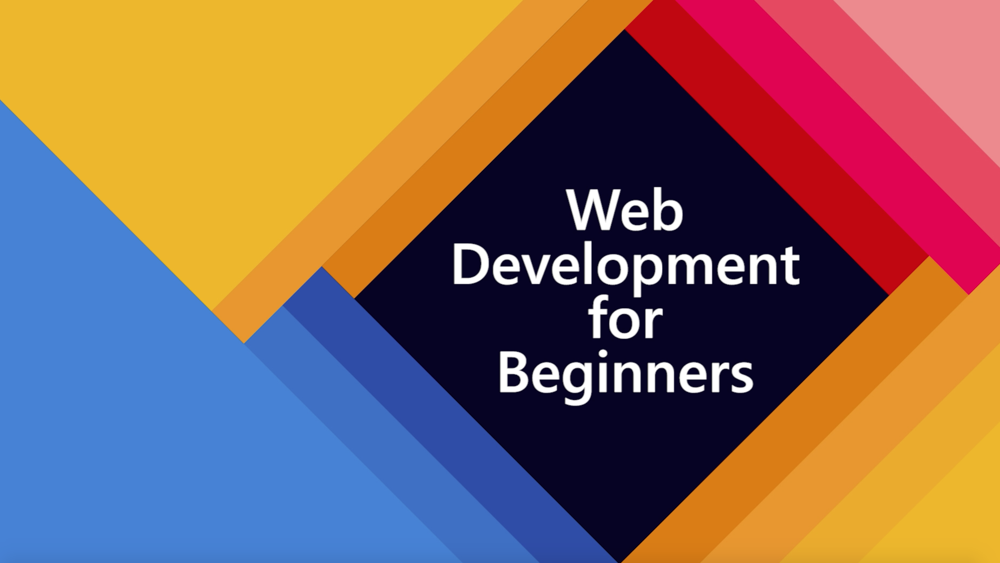

# Desenvolvimento Web para Iniciantes - Programa de Estudos

Azure Cloud Advocates da Microsoft têm o prazer de oferecer um curso de 12 semanas e 24 lições sobre o básico de JavaScript, CSS e HTML.
Cada lição possiu qizzes pré- e pós-lição , instruções escritas para completar a lição, uma solução, uma tarefa e mais.
Nossa pedagogia baseada em prática permite que você aprenda enquanto construi, uma forma de aprendizado eficaz e comprovada.

**Grandes agradecimentos aos nossos autores Jen Looper, Chris Noring, Christopher Harrison, Jasmine Greenaway, Yohan Lasorsa, Floor Drees, e Tomomi Imura!**

# Começando

> **Professores**, nós incluímos algumas [sugestões](for-teachers.pt.md) sobre como tilizar este curso. Adoraríamos o seu Feedback em nosso [fórum](https://github.com/microsoft/Web-Dev-For-Beginners/discussions/categories/teacher-corner)!

> **Estudantes**, para usar esse crrículo por conta própria, faça um fork do repositório inteiro, começando por um qizz pré-aula, veja a aula e então faça o resto das atividades.
Procure fazer os projetos baseado no que aprendeu ao invés de simplesmente copiar a solução que se encontra na pasta de soluções das atividades.
Uma boa opção seria criar um grupo de estudos e completar todos os conteúdos juntos.
Para estudos mais profundos, recomendamos que assista aos vídeos mencionados abaixo e procure pelo [Microsoft Learn](https://docs.microsoft.com/users/jenlooper-2911/collections/jg2gax8pzd6o81?WT.mc_id=academic-13441-cxa).

> 🎥 Clique na imagem acima para acessar um vídeo sobre o projeto e aqueles que o criaram !

## Pedagogia

Nós escolhemos dois princípos pedagógicos enquanto criávamos este curso: Garantir de que era baseado em práticas e que
tivesse quizzes frequentes.
Até o fim deste curso, estudantes terão construído um jogo de digitação, um terrário virtual, ums extensão de navegador 'verde' , um jogo do tipo 'space invaders', e um aplicativo bancário, e terão aprendido o básico de JavaScript, HTML, e CSS com um moderno conjunto de ferramentas do desenvolvimento web dos dias atuais 🎓 !!!

> 🎓 Você pode tomar as primeiras lições nesse curso como um [Learn Path](https://docs.microsoft.com/learn/paths/web-development-101?WT.mc_id=academic-13441-cxa) no Microsoft Learn!

Ao garantir que o conteúdo esteja alinhado com os projetos, o processo se torna mais envolvente para os alunos e a retenção dos conceitos será aumentada. Também escrevemos várias lições iniciais em noções básicas de JavaScript para introduzir conceitos, emparelhadas com o vídeo da coleção [accessible ici](https://www.youtube.com/playlist?list=PLb2HQ45KP0WsFop0pItGSUYl6baYjKEye) de vídeo-aulas, alguns de autores os quais contribuíram para este curso.

Além disso, um teste simples antes da aula define a intenção do aluno de aprender um tópico, enquanto um segundo teste após a aula garante maior retenção. Este currículo foi projetado para ser flexível e divertido e pode ser realizado no todo ou em partes. Os projetos começam pequenos e tornam-se cada vez mais complexos no final do ciclo de 12 semanas.

Embora tenhamos evitado propositadamente a introdução de frameworks JavaScript para nos concentrarmos nas habilidades básicas necessárias como desenvolvedor web antes de adotar um framework, uma próxima etapa para concluir este currículo seria aprender sobre Node.js por meio de outra coleção de vídeos:
[Coletânea inicial sobre Node.js](https://channel9.msdn.com/Series/Beginners-Series-to-Nodejs?WT.mc_id=academic-13441-cxa)

> Encontre nosso [código de condta](CODE_OF_CONDUCT.md), [guia para contribidores](CONTRIBUTING.md), e [o guia para traduções do curso](TRANSLATIONS.md).
Seu Feedback contrutivo é bem vindo.

>
## Cada lição inclui :

- Uma folha de rascunho opcional
- Um vídeo complementar opcional
- Quiz pré-aula para aquecimento
- Aula em versão escrita
- Um desafio
- Uma explicação **bem detalhada (passo a passo)** sobre como contruir o projeto
- Leitura complementar
- Exercícios
- Quiz pós-aula

> **Nota sobre os qizzes**: todos os qizzes se encontram [aqui](https://calm-wave-0d1a32b03.1.azurestaticapps.net/), um total de 48 quizzes, com 3 questões em cada.
Também podem ser acessados localmente pela pasta `quiz-app`.

## Lições

|       |                      Nome do projeto                       |                         Conceitos ensinados                         | Objetivos de aprendizado                                                                                                                         |                                                  Lição                                                   |         Autor          |
| :---: | :------------------------------------------------------: | :--------------------------------------------------------------------: | --------------------------------------------------------------------------------------------------------------------------------- | :------------------------------------------------------------------------------------------------------: | :---------------------: |
|  01   |                      Começando                      |                    Introdução à programação                     | Aprenda os fundamentos básicos por trás da maioria das linguagens de programação e sobre o software que ajuda os desenvolvedores profissionais a fazerem seus trabalhos                | [Introdução à programação](/1-getting-started-lessons/1-intro-to-programming-languages/translations/README.pt.md) |         Jasmine         |
|  02   |                      Começando                      |              Introdução às bases do Github, incluindo trabalho em equipe               | Como usar o GitHub em seu projeto, como colaborar com outras pessoas em uma base de código                                                                     |         [Introdução às bases do Github](/1-getting-started-lessons/2-github-basics/translations/README.pt.md)         |          Floor          |
|  03   |                      Começando                      |                             Acessibilidade                              | Apprendra as bases da acessibilidade na Web                                                                                     |            [Fundamentos da Acessibilidade](/1-getting-started-lessons/3-accessibility/translations/README.pt.md)            |       Christopher       |
|  04   |                        Básico de JS                         |                         Tipos de dados em JavaScript                          | O básico de dados em JavaScript                                                                                               |                            [Tipos de dados](/2-js-basics/1-data-types/translations/README.pt.md)                             |         Jasmine         |
|  05   |                        Básico de JS                         |                         Funções e métodos                          | Aprenda sobre Funções e métodos para gerenciar o fluxo de lógica de uma aplicação                                                           |                   [Funções e métodos](/2-js-basics/2-functions-methods/translations/README.pt.md)                    | Jasmine e Christopher |
|  06   |                        Básico de JS                         |                        Tomando decisões com JS                        | Aprenda como criar condições em seu código usando métodos de tomada de decisão methods                                                         |                      [Tomando decisões](/2-js-basics/3-making-decisions/translations/README.pt.md)                       |         Jasmine         |
|  07   |                        Básico de JS                         |                            Arrays e Loops                            | Trabalhe com dados usando arrays e loops em JavaScript                                                                               |                        [Arrays e Loops](/2-js-basics/4-arrays-loops/translations/README.pt.md)                         |         Jasmine         |
|  08   |       [Terrarium](/3-terrarium/solution/README.md)       |                            HTML na Prática                            | Construa o HTML para criar um terrário online, focando em construir um layout                                                       |                      [Introdução a HTML](/3-terrarium/1-intro-to-html/translations/README.pt-BR.md)                      |           Jen           |
|  09   |       [Terrarium](/3-terrarium/solution/README.md)       |                            CSS na Prática                             | Construa o CSS para estilizar o terrário online, focando no básico de inclusão CSS fazendo a página responsiva                   |                       [Introdução a CSS](/3-terrarium/2-intro-to-css/README.md)                       |           Jen           |
|  10   |            [Terrarium](/3-terrarium/solution/README.md)            |                 JavaScript closures, DOM manipulation                  | Construa o JavaScript para fazer o terrário funcionar como uma interface de arrastar / soltar, focando em fechamentos e manipulação de DOM           |       [JavaScript Closures, DOM manipulation](/3-terrarium/3-intro-to-DOM-and-closures/README.md)        |           Jen           |
|  11   |          [Typing Game](/4-typing-game/solution/README.md)          |                          Construa um jogo de digitação                           | Aprenda a usar eventos de teclado para conduzir a lógica de seu aplicativo JavaScript                                                        |                     [Programação Orientada a Eventos](/4-typing-game/typing-game/README.md)                     |       Christopher       |
|  12   | [Extensão de navegador verde](/5-browser-extension/solution/README.md) |                         Trabalhando com navegadores                          | Aprenda como os navegadores funcionam, seu histórico e como organizar os primeiros elementos de uma extensão do navegador                             |                    [Sobre navegadores](/5-browser-extension/1-about-browsers/README.md)                     |           Jen           |
|  13   | [Extensão de navegador verde](/5-browser-extension/solution/README.md) | Construindo um formulário, chamando uma API e armazenando variáveis ​​no armazenamento local | Construa os elementos JavaScript da extensão do seu navegador para chamar uma API usando variáveis ​​armazenadas no armazenamento local                    |     [APIs, Formulários e Armazenamento Local](/5-browser-extension/2-forms-browsers-local-storage/README.md)      |           Jen           |
|  14   | [Extensão de navegador verde](/5-browser-extension/solution/README.md) |          Processos em segundo plano no navegador, desempenho da web          | Use os processos de segundo plano do navegador para gerenciar o ícone da extensão; aprender sobre o desempenho da web e algumas otimizações para fazer |  [Tarefas e desempenho em segundo plano](/5-browser-extension/3-background-tasks-and-performance/README.md)   |           Jen           |
|  15   |        [Jogo Espacial](/6-space-game/solution/README.md)         |              Desenvolvimento de jogos mais avançado com JavaScript               | Saiba mais sobre herança usando classes e composição e o padrão Pub / Sub, na preparação para a construção de um jogo           |  [Introdução ao desenvolvimento avançado de um jogo em Javascript](/6-space-game/1-introduction/README.md)   |          Chris          |
|  16   |        [Jogo Espacial](/6-space-game/solution/README.md)         |                               Desenhar na tela                               | Saiba mais sobre a API Canvas, usada para desenhar elementos em uma tela                                                                 |                    [Desenhando na Tela](/6-space-game/2-drawing-to-canvas/README.md)                    |          Chris          |
|  17   |        [Jogo Espacial](/6-space-game/solution/README.md)         |                         Movendo elementos pela tela                          | Descubra como os elementos podem ganhar movimento usando as coordenadas cartesianas e a API Canvas                                                                            |                [Movendo elementos pela Tela](/6-space-game/3-moving-elements-around/README.md)                |          Chris          |
|  18   |        [Jogo Espacial](/6-space-game/solution/README.md)         |                          Detecção de Colisão                           | Faça os elementos colidirem e reagirem uns com os outros usando o pressionamento de teclas e fornecer uma função de resfriamento para garantir o desempenho do jogo  |                   [Detecção de Colisão](/6-space-game/4-collision-detection/README.md)                   |          Chris          |
|  19   |        [Jogo Espacial](/6-space-game/solution/README.md)         |                             Mantendo a pontuação                              | Faça cálculos matemáticos com base no status e no desempenho do jogo                                                              |                         [Mantendo a pontuação](/6-space-game/5-keeping-score/README.md)                         |          Chris          |
|  20   |        [Jogo Espacial](/6-space-game/solution/README.md)         |                       Terminando e reiniciando o jogo                        | Saiba mais sobre como encerrar e reiniciar o jogo, incluindo limpeza de ativos e redefinição de valores de variáveis                                                                    |                         [A condição de encerramento](/6-space-game/6-end-condition/README.md)                         |          Chris          |
|  21   |     [Banking App](/7-bank-project/solution/README.md)     |           Templates HTML e rotas em um aplicativo da web            | Aprenda a criar o andaime da arquitetura de um site de várias páginas usando modelos de roteamento e HTML                                               |                  [HTML Templates e Rotas](/7-bank-project/1-template-route/README.md)                  |          Yohan          |
|  22   |     [Banking App](/7-bank-project/solution/README.md)     |                    Criar um formulário de Login e Cadastro                    | Aprenda sobre a construção de formulários e rotinas de validação                                                |                             [Formulários](/7-bank-project/2-forms/README.md)                             |          Yohan          |
|  23   |     [Banking App](/7-bank-project/solution/README.md)     |                    Métodos de busca e uso de dados                    | Como os dados fluem para dentro e para fora do seu aplicativo, como buscá-los, armazená-los e descartá-los                                                                               |                               [Dados](/7-bank-project/3-data/README.md)                                |          Yohan          |
|  24   |     [Banking App](/7-bank-project/solution/README.md)     |                   Conceitos de Gestão do Estado                    | Saiba como seu aplicativo mantém o estado e como gerenciá-lo de maneira programática                                                                                 |                    [Gestão de estados](/7-bank-project/4-state-management/README.md)                    |          Yohan          |

## Acesso offline

Você pode utilizar essa documentação quando estiver offline através de [Docsify](https://docsify.js.org/#/). Faça um Fork desse repositório, [instale Docsify](https://docsify.js.org/#/quickstart) na sua máquina e digite `docsify serve` na pasta raiz desse repositório. O site estará disponível na porta 3000 em seu host local: `localhost:3000`.

## PDF

Um PDF de todas as lições pode ser encontrado [bem aqui](https://microsoft.github.io/Web-Dev-For-Beginners/pdf/readme.pdf)

## Outros Cursos

Nossa equipe produziu outros cursos! Veja só :

- [Machine Learning para iniciantes](https://aka.ms/ml-beginners)
- [IoT para iniciantes](https://aka.ms/iot-beginners)
- [Data Science para iniciantes](https://aka.ms/datascience-beginners)
