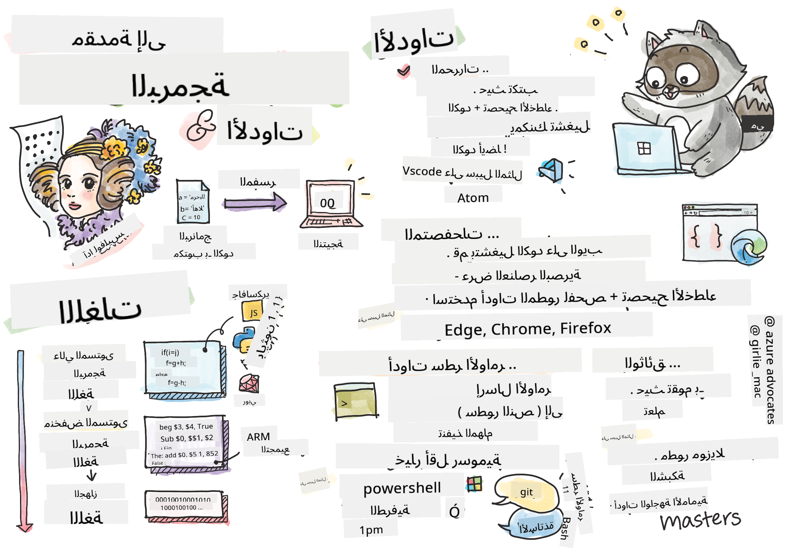
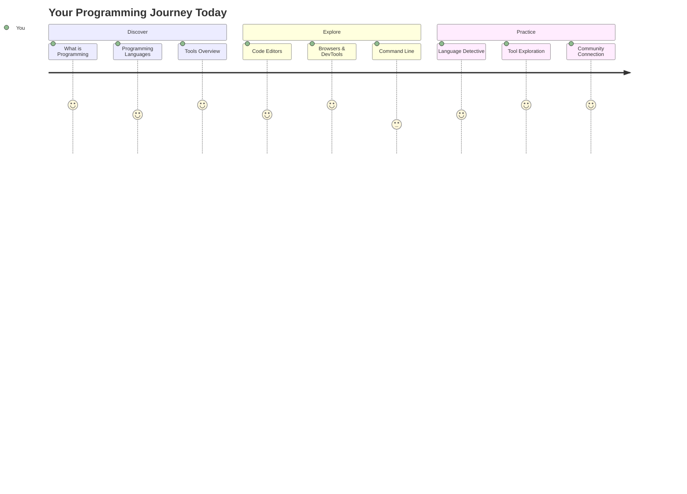
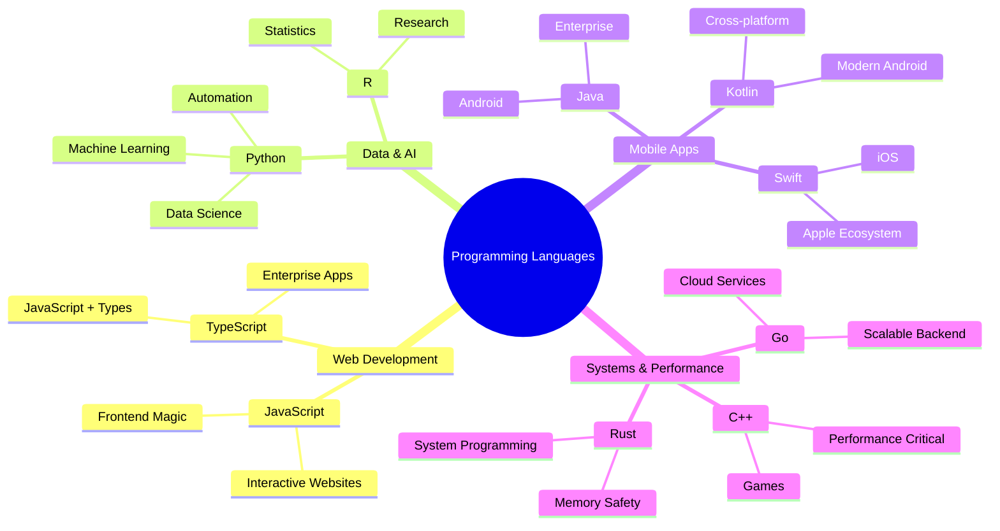
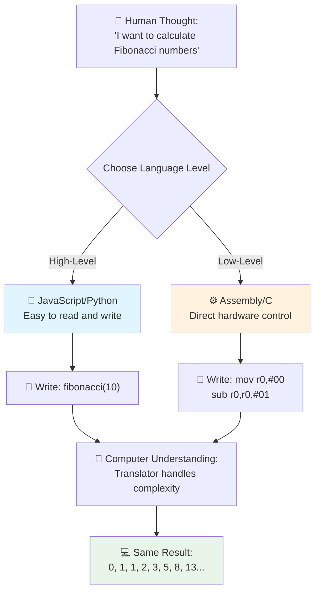
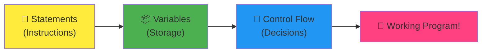
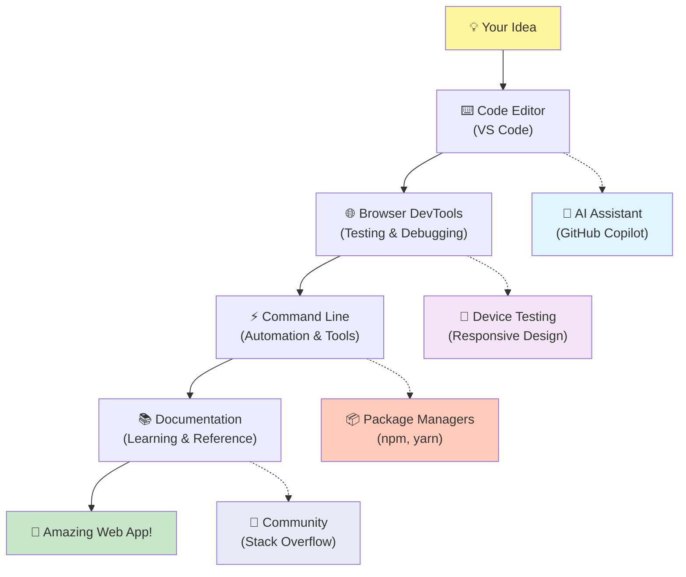
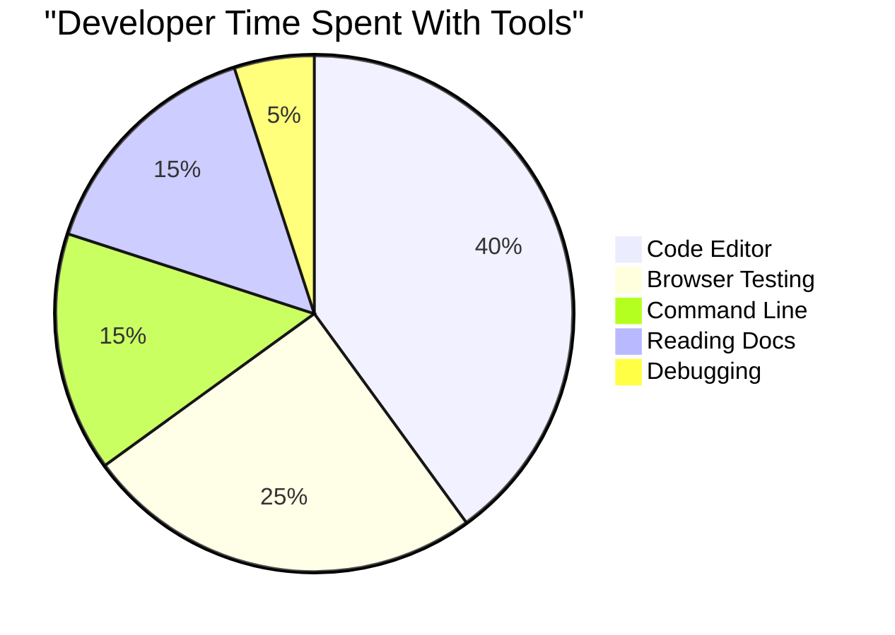
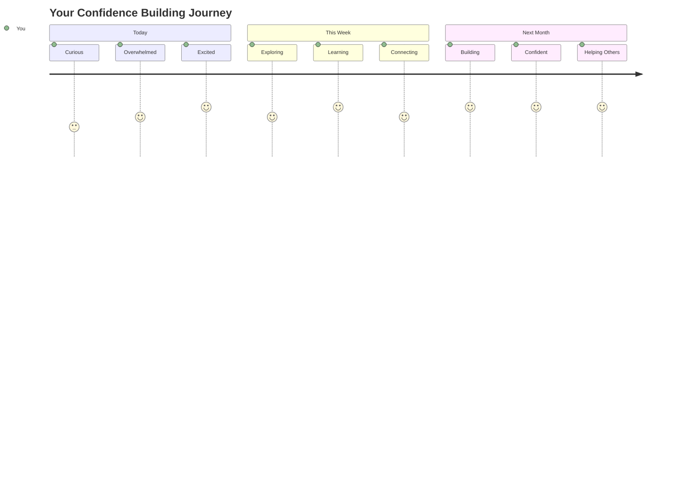

<!--
CO_OP_TRANSLATOR_METADATA:
{
  "original_hash": "d45ddcc54eb9232a76d08328b09d792e",
  "translation_date": "2025-11-03T12:28:46+00:00",
  "source_file": "1-getting-started-lessons/1-intro-to-programming-languages/README.md",
  "language_code": "ar"
}
-->
# مقدمة إلى لغات البرمجة وأدوات المطورين الحديثة

مرحبًا أيها المطور المستقبلي! 👋 هل يمكنني أن أخبرك بشيء يجعلني أشعر بالحماس كل يوم؟ أنت على وشك اكتشاف أن البرمجة ليست مجرد التعامل مع أجهزة الكمبيوتر – إنها امتلاك قوى خارقة حقيقية لتحويل أفكارك الأكثر جنونًا إلى واقع!

تعرف ذلك الشعور عندما تستخدم تطبيقك المفضل وكل شيء يعمل بسلاسة؟ عندما تضغط على زر ويحدث شيء سحري يجعلك تقول "واو، كيف فعلوا ذلك؟" حسنًا، شخص مثلك تمامًا – ربما جالس في مقهىه المفضل في الساعة الثانية صباحًا مع كوبه الثالث من الإسبريسو – كتب الكود الذي صنع تلك السحرية. وهنا ما سيذهلك: بنهاية هذا الدرس، لن تفهم فقط كيف فعلوا ذلك، بل ستكون متحمسًا لتجربته بنفسك!

انظر، أنا أفهم تمامًا إذا كانت البرمجة تبدو مخيفة الآن. عندما بدأت لأول مرة، كنت أعتقد بصراحة أنك بحاجة إلى أن تكون عبقريًا في الرياضيات أو أن تكون قد بدأت البرمجة منذ أن كنت في الخامسة من عمرك. لكن ما غير وجهة نظري تمامًا هو أن البرمجة تشبه تمامًا تعلم التحدث بلغة جديدة. تبدأ بـ "مرحبًا" و"شكرًا"، ثم تتقدم إلى طلب القهوة، وقبل أن تدرك، تجد نفسك تخوض مناقشات فلسفية عميقة! إلا أن الأمر هنا يتعلق بالتحدث مع أجهزة الكمبيوتر، وبصراحة؟ إنها أكثر شركاء المحادثة صبرًا – لا تحكم على أخطائك أبدًا ودائمًا متحمسة لتجربة مرة أخرى!

اليوم، سنستكشف الأدوات الرائعة التي تجعل تطوير الويب الحديث ليس فقط ممكنًا، بل ممتعًا للغاية. أنا أتحدث عن نفس المحررات والمتصفحات وطرق العمل التي يستخدمها المطورون في Netflix وSpotify واستوديوهات التطبيقات المستقلة المفضلة لديك كل يوم. وهنا الجزء الذي سيجعلك ترقص فرحًا: معظم هذه الأدوات الاحترافية والمعتمدة في الصناعة مجانية تمامًا!


> رسم توضيحي بواسطة [Tomomi Imura](https://twitter.com/girlie_mac)



## دعنا نرى ما تعرفه بالفعل!

قبل أن نبدأ في الأمور الممتعة، أنا فضولي – ماذا تعرف بالفعل عن عالم البرمجة هذا؟ وإذا كنت تنظر إلى هذه الأسئلة وتفكر "ليس لدي أي فكرة عن أي من هذا"، فهذا ليس فقط مقبولًا، بل مثالي! هذا يعني أنك في المكان الصحيح تمامًا. فكر في هذا الاختبار كتمرين تمدد قبل التمرين – نحن فقط نقوم بتسخين عضلات الدماغ!

[خذ اختبار ما قبل الدرس](https://forms.office.com/r/dru4TE0U9n?origin=lprLink)

## المغامرة التي سنخوضها معًا

حسنًا، أنا متحمس جدًا لما سنستكشفه اليوم! بصراحة، أتمنى أن أرى وجهك عندما تفهم بعض هذه المفاهيم. إليك الرحلة الرائعة التي سنخوضها معًا:

- **ما هي البرمجة حقًا (ولماذا هي أروع شيء على الإطلاق!)** – سنكتشف كيف أن الكود هو السحر الخفي الذي يشغل كل شيء حولك، من المنبه الذي يعرف بطريقة ما أنه صباح يوم الاثنين إلى الخوارزمية التي تختار لك توصيات Netflix المثالية.
- **لغات البرمجة وشخصياتها المذهلة** – تخيل أنك تدخل حفلة حيث لكل شخص قوى خارقة مختلفة وطرق لحل المشكلات. هذا هو عالم لغات البرمجة، وستحب التعرف عليها!
- **الأسس التي تجعل السحر الرقمي يحدث** – فكر في هذه كأروع مجموعة LEGO إبداعية. بمجرد أن تفهم كيف تتناسب هذه القطع معًا، ستدرك أنه يمكنك بناء أي شيء تحلم به.
- **أدوات احترافية ستجعلك تشعر وكأنك حصلت على عصا سحرية** – أنا لا أبالغ هنا – هذه الأدوات ستجعلك تشعر حقًا وكأن لديك قوى خارقة، والجزء الأفضل؟ إنها نفس الأدوات التي يستخدمها المحترفون!

> 💡 **إليك الأمر**: لا تفكر حتى في محاولة حفظ كل شيء اليوم! الآن، أريدك فقط أن تشعر بتلك الشرارة من الحماس حول ما هو ممكن. التفاصيل ستبقى بشكل طبيعي عندما نتدرب معًا – هكذا يحدث التعلم الحقيقي!

> يمكنك أخذ هذا الدرس على [Microsoft Learn](https://docs.microsoft.com/learn/modules/web-development-101/introduction-programming/?WT.mc_id=academic-77807-sagibbon)!

## إذًا ما هي البرمجة بالضبط؟

حسنًا، دعونا نتناول السؤال الذي يساوي مليون دولار: ما هي البرمجة حقًا؟

سأخبرك بقصة غيرت تمامًا طريقة تفكيري حول هذا الموضوع. الأسبوع الماضي، كنت أحاول شرح كيفية استخدام جهاز التحكم عن بعد الجديد للتلفزيون الذكي لوالدتي. وجدت نفسي أقول أشياء مثل "اضغط على الزر الأحمر، ولكن ليس الزر الأحمر الكبير، الزر الأحمر الصغير على اليسار... لا، يسارك الآخر... حسنًا، الآن اضغط عليه لمدة ثانيتين، ليس واحدة، وليس ثلاث..." يبدو مألوفًا؟ 😅

هذه هي البرمجة! إنها فن إعطاء تعليمات مفصلة للغاية، خطوة بخطوة، لشيء قوي جدًا ولكنه يحتاج إلى كل شيء مكتوب بشكل مثالي. إلا أنك بدلاً من شرح ذلك لوالدتك (التي يمكنها أن تسأل "أي زر أحمر؟!")، تشرحه لجهاز كمبيوتر (الذي يفعل بالضبط ما تقوله، حتى لو لم يكن ما قلته هو ما كنت تقصده).

إليك ما أدهشني عندما تعلمت هذا لأول مرة: أجهزة الكمبيوتر في الواقع بسيطة جدًا في جوهرها. إنها تفهم حرفيًا شيئين فقط – 1 و0، وهو ما يعني ببساطة "نعم" و"لا" أو "تشغيل" و"إيقاف". هذا كل شيء! ولكن هنا يأتي السحر – لا يتعين علينا التحدث بلغة 1 و0 كما لو كنا في فيلم ماتريكس. هنا تأتي **لغات البرمجة** لإنقاذنا. إنها مثل وجود أفضل مترجم في العالم يأخذ أفكارك البشرية العادية ويحولها إلى لغة الكمبيوتر.

وهنا ما يجعلني أشعر بالحماس كل صباح عندما أستيقظ: كل شيء رقمي في حياتك بدأ بشخص مثلك تمامًا، ربما جالسًا في بيجامته مع كوب قهوة، يكتب الكود على جهاز الكمبيوتر المحمول الخاص به. ذلك الفلتر في إنستغرام الذي يجعلك تبدو رائعًا؟ شخص ما برمجه. التوصية التي قادتك إلى أغنيتك المفضلة الجديدة؟ مطور بنى تلك الخوارزمية. التطبيق الذي يساعدك على تقسيم فاتورة العشاء مع أصدقائك؟ نعم، شخص ما فكر "هذا مزعج، أراهن أنني أستطيع إصلاح هذا" ثم... فعل ذلك!

عندما تتعلم البرمجة، فأنت لا تكتسب مهارة جديدة فقط – بل تصبح جزءًا من مجتمع رائع من حلّال المشاكل الذين يقضون أيامهم في التفكير، "ماذا لو استطعت بناء شيء يجعل يوم شخص ما أفضل قليلاً؟" بصراحة، هل هناك شيء أكثر روعة من ذلك؟

✅ **معلومة ممتعة للبحث عنها**: إليك شيء رائع يمكنك البحث عنه عندما يكون لديك وقت فراغ – من تعتقد أنه كان أول مبرمج كمبيوتر في العالم؟ سأعطيك تلميحًا: قد لا يكون الشخص الذي تتوقعه! قصة هذا الشخص رائعة حقًا وتظهر أن البرمجة كانت دائمًا تدور حول حل المشكلات الإبداعي والتفكير خارج الصندوق.

### 🧠 **وقت التحقق: كيف تشعر؟**

**خذ لحظة للتفكير:**
- هل فكرة "إعطاء تعليمات لأجهزة الكمبيوتر" أصبحت واضحة لك الآن؟
- هل يمكنك التفكير في مهمة يومية ترغب في أتمتتها باستخدام البرمجة؟
- ما هي الأسئلة التي تدور في ذهنك حول هذا الشيء المسمى البرمجة؟

> **تذكر**: من الطبيعي تمامًا إذا كانت بعض المفاهيم لا تزال غامضة الآن. تعلم البرمجة يشبه تعلم لغة جديدة – يستغرق وقتًا حتى يبني عقلك تلك الروابط العصبية. أنت تقوم بعمل رائع!

## لغات البرمجة مثل نكهات مختلفة من السحر

حسنًا، هذا قد يبدو غريبًا، لكن ابق معي – لغات البرمجة تشبه كثيرًا أنواع الموسيقى المختلفة. فكر في الأمر: لديك الجاز، الذي يتميز بالسلاسة والارتجال، والروك الذي يتميز بالقوة والبساطة، والكلاسيكية التي تتميز بالأناقة والتنظيم، والهيب هوب الذي يتميز بالإبداع والتعبير. كل نوع له طابعه الخاص، ومجتمعه الخاص من المعجبين المتحمسين، وكل واحد مثالي لمزاج ومناسبة مختلفة.

لغات البرمجة تعمل بنفس الطريقة تمامًا! لن تستخدم نفس اللغة لبناء لعبة هاتف ممتعة كما تستخدم لتحليل كميات هائلة من بيانات المناخ، تمامًا كما لن تشغل موسيقى الميتال الصاخبة في صف يوغا (حسنًا، ربما ليس في معظم صفوف اليوغا! 😄).

لكن هنا ما يدهشني كل مرة أفكر فيه: هذه اللغات تشبه وجود مترجم رائع وصبور بجانبك. يمكنك التعبير عن أفكارك بطريقة طبيعية لعقلك البشري، وهم يتولون كل العمل المعقد لتحويل ذلك إلى لغة 1 و0 التي تتحدثها أجهزة الكمبيوتر. إنه مثل وجود صديق يتحدث بطلاقة "الإبداع البشري" و"منطق الكمبيوتر" – ولا يتعب أبدًا، ولا يحتاج إلى استراحة قهوة، ولا يحكم عليك إذا سألت نفس السؤال مرتين!

### لغات البرمجة الشهيرة واستخداماتها



| اللغة | الأفضل لـ | لماذا هي شائعة |
|-------|------------|----------------|
| **JavaScript** | تطوير الويب، واجهات المستخدم | تعمل في المتصفحات وتشغل المواقع التفاعلية |
| **Python** | علم البيانات، الأتمتة، الذكاء الاصطناعي | سهلة القراءة والتعلم، مكتبات قوية |
| **Java** | التطبيقات المؤسسية، تطبيقات أندرويد | مستقلة عن المنصة، قوية للأنظمة الكبيرة |
| **C#** | تطبيقات ويندوز، تطوير الألعاب | دعم قوي من نظام مايكروسوفت |
| **Go** | خدمات السحابة، أنظمة الخلفية | سريعة، بسيطة، مصممة للحوسبة الحديثة |

### لغات عالية المستوى مقابل لغات منخفضة المستوى

حسنًا، هذا كان المفهوم الذي أربك عقلي عندما بدأت التعلم لأول مرة، لذا سأشاركك التشبيه الذي جعلني أفهمه أخيرًا – وأتمنى أن يساعدك أيضًا!

تخيل أنك تزور بلدًا لا تتحدث لغته، وتحتاج بشدة إلى العثور على أقرب حمام (كلنا مررنا بهذا، أليس كذلك؟ 😅):

- **البرمجة منخفضة المستوى** تشبه تعلم اللهجة المحلية بشكل جيد جدًا بحيث يمكنك التحدث مع الجدة التي تبيع الفاكهة في الزاوية باستخدام إشارات ثقافية، وعبارات محلية، ونكات داخلية لا يفهمها إلا من نشأ هناك. مثير للإعجاب للغاية وفعال جدًا... إذا كنت تتحدث بطلاقة! ولكن قد يكون الأمر مربكًا جدًا عندما تحاول فقط العثور على حمام.

- **البرمجة عالية المستوى** تشبه وجود ذلك الصديق المحلي الرائع الذي يفهمك تمامًا. يمكنك أن تقول "أنا بحاجة ماسة للعثور على حمام" بلغة بسيطة، وهم يتولون كل الترجمة الثقافية ويعطونك الاتجاهات بطريقة منطقية لعقلك غير المحلي.

بمصطلحات البرمجة:
- **اللغات منخفضة المستوى** (مثل Assembly أو C) تتيح لك إجراء محادثات مفصلة للغاية مع الأجهزة الفعلية للكمبيوتر، ولكن عليك التفكير مثل الآلة، وهو... حسنًا، دعنا نقول إنه تغيير عقلي كبير!
- **اللغات عالية المستوى** (مثل JavaScript، Python، أو C#) تتيح لك التفكير كإنسان بينما تتولى هي كل الحديث بلغة الآلة خلف الكواليس. بالإضافة إلى ذلك، لديها مجتمعات مرحبة مليئة بأشخاص يتذكرون كيف كان الأمر عندما كانوا مبتدئين ويريدون حقًا مساعدتك!

تخيل أي منها سأقترح عليك أن تبدأ به؟ 😉 اللغات عالية المستوى تشبه وجود عجلات تدريب لا تريد أبدًا إزالتها لأنها تجعل التجربة بأكملها أكثر متعة!



### دعني أريك لماذا اللغات عالية المستوى أكثر ودية

حسنًا، سأريك شيئًا يوضح تمامًا لماذا وقعت في حب اللغات عالية المستوى، ولكن أولاً – أحتاجك أن تعدني بشيء. عندما ترى المثال الأول للكود، لا تفزع! من المفترض أن يبدو مخيفًا. هذا هو النقطة التي أريد توضيحها!

سننظر إلى نفس المهمة مكتوبة بأسلوبين مختلفين تمامًا. كلاهما ينشئ ما يسمى تسلسل فيبوناتشي – إنه نمط رياضي جميل حيث كل رقم هو مجموع الرقمين السابقين: 0، 1، 1، 2، 3، 5، 8، 13... (معلومة ممتعة: ستجد هذا النمط في كل مكان في الطبيعة – دوامات بذور عباد الشمس، أنماط مخروط الصنوبر، وحتى طريقة تشكل المجرات!)

جاهز لرؤية الفرق؟ لنبدأ!

**لغة عالية المستوى (JavaScript) – صديقة للإنسان:**

```javascript
// Step 1: Basic Fibonacci setup
const fibonacciCount = 10;
let current = 0;
let next = 1;

console.log('Fibonacci sequence:');
```

**ما يفعله هذا الكود:**
- **تعريف** ثابت لتحديد عدد أرقام فيبوناتشي التي نريد إنشائها
- **تهيئة** متغيرين لتتبع الرقم الحالي والرقم التالي في التسلسل
- **إعداد** القيم الأولية (0 و1) التي تحدد نمط فيبوناتشي
- **عرض** رسالة تعريفية لتحديد الناتج

```javascript
// Step 2: Generate the sequence with a loop
for (let i = 0; i < fibonacciCount; i++) {
  console.log(`Position ${i + 1}: ${current}`);
  
  // Calculate next number in sequence
  const sum = current + next;
  current = next;
  next = sum;
}
```

**تفصيل ما يحدث هنا:**
- **التكرار** عبر كل موقع في التسلسل باستخدام حلقة `for`
- **عرض** كل رقم مع موقعه باستخدام تنسيق القالب النصي
- **حساب** الرقم التالي في تسلسل فيبوناتشي بإضافة القيم الحالية والتالية
- **تحديث** متغيرات التتبع للانتقال إلى التكرار التالي

```javascript
// Step 3: Modern functional approach
const generateFibonacci = (count) => {
  const sequence = [0, 1];
  
  for (let i = 2; i < count; i++) {
    sequence[i] = sequence[i - 1] + sequence[i - 2];
  }
  
  return sequence;
};

// Usage example
const fibSequence = generateFibonacci(10);
console.log(fibSequence);
```

**في المثال أعلاه، قمنا بـ:**
- **إنشاء** وظيفة قابلة لإعادة الاستخدام باستخدام صياغة وظيفة السهم الحديثة
- **بناء** مصفوفة لتخزين التسلسل الكامل بدلاً من عرضه رقمًا برقم
- **استخدام** فهرسة المصفوفة لحساب كل رقم جديد من القيم السابقة
- **إرجاع** التسلسل الكامل لاستخدامه بشكل مرن في أجزاء أخرى من البرنامج

**لغة منخفضة المستوى (ARM Assembly) – صديقة للكمبيوتر:**

```assembly
 area ascen,code,readonly
 entry
 code32
 adr r0,thumb+1
 bx r0
 code16
thumb
 mov r0,#00
 sub r0,r0,#01
 mov r1,#01
 mov r4,#10
 ldr r2,=0x40000000
back add r0,r1
 str r0,[r2]
 add r2,#04
 mov r3,r0
 mov r0,r1
 mov r1,r3
 sub r4,#01
 cmp r4,#00
 bne back
 end
```

لاحظ كيف أن نسخة JavaScript تُقرأ تقريبًا كتعليمات باللغة الإنجليزية، بينما تستخدم نسخة Assembly أوامر غامضة تتحكم مباشرة في معالج الكمبيوتر. كلاهما ينجز نفس المهمة، لكن اللغة عالية المستوى أسهل بكثير للفهم والكتابة والصيانة.

**الاختلافات الرئيسية التي ستلاحظها:**
- **الوضوح**: JavaScript تستخدم أسماء وصفية مثل `fibonacciCount` بينما Assembly تستخدم تسميات غامضة مثل `r0`, `r1`
- **التعليقات**: اللغات عالية المستوى تشجع على كتابة تعليقات توضيحية تجعل الكود واضحًا وسهل الفهم.
- **الهيكل**: التدفق المنطقي للغة JavaScript يتماشى مع الطريقة التي يفكر بها البشر في حل المشكلات خطوة بخطوة.
- **الصيانة**: تحديث إصدار JavaScript لتلبية متطلبات مختلفة أمر بسيط وواضح.

✅ **حول تسلسل فيبوناتشي**: هذا النمط الرقمي الرائع (حيث يساوي كل رقم مجموع الرقمين السابقين له: 0، 1، 1، 2، 3، 5، 8...) يظهر حرفيًا *في كل مكان* في الطبيعة! ستجده في دوامات عباد الشمس، أنماط أكواز الصنوبر، طريقة انحناء أصداف النوتيلوس، وحتى في كيفية نمو فروع الأشجار. إنه أمر مذهل كيف يمكن للرياضيات والبرمجة مساعدتنا في فهم وإعادة إنشاء الأنماط التي تستخدمها الطبيعة لخلق الجمال!

## اللبنات الأساسية التي تصنع السحر

حسنًا، الآن بعد أن رأيت كيف تبدو لغات البرمجة أثناء العمل، دعنا نحلل العناصر الأساسية التي تشكل كل برنامج تم كتابته على الإطلاق. فكر في هذه العناصر كالمكونات الأساسية لوصفتك المفضلة – بمجرد أن تفهم وظيفة كل منها، ستتمكن من قراءة وكتابة الكود في أي لغة تقريبًا!

هذا يشبه تعلم قواعد البرمجة. تذكر عندما كنت في المدرسة وتعلمت عن الأسماء والأفعال وكيفية تكوين الجمل؟ البرمجة لديها نسختها الخاصة من القواعد، وبصراحة، إنها أكثر منطقية وتسامحًا من قواعد اللغة الإنجليزية! 😄

### العبارات: التعليمات خطوة بخطوة

لنبدأ بـ **العبارات** – هذه مثل الجمل الفردية في محادثة مع جهاز الكمبيوتر الخاص بك. كل عبارة تخبر الكمبيوتر بفعل شيء محدد، مثل إعطاء توجيهات: "انعطف يسارًا هنا"، "توقف عند الضوء الأحمر"، "اركن في تلك البقعة".

ما أحبه في العبارات هو مدى سهولة قراءتها عادةً. انظر إلى هذا المثال:

```javascript
// Basic statements that perform single actions
const userName = "Alex";                    
console.log("Hello, world!");              
const sum = 5 + 3;                         
```

**ما يفعله هذا الكود:**
- **إعلان** متغير ثابت لتخزين اسم المستخدم
- **عرض** رسالة ترحيب في إخراج وحدة التحكم
- **حساب** وتخزين نتيجة عملية رياضية

```javascript
// Statements that interact with web pages
document.title = "My Awesome Website";      
document.body.style.backgroundColor = "lightblue";
```

**خطوة بخطوة، ما يحدث هنا:**
- **تعديل** عنوان صفحة الويب الذي يظهر في علامة تبويب المتصفح
- **تغيير** لون خلفية جسم الصفحة بالكامل

### المتغيرات: نظام ذاكرة البرنامج الخاص بك

حسنًا، **المتغيرات** هي واحدة من مفاهيمي المفضلة للتدريس لأنها تشبه الأشياء التي تستخدمها بالفعل كل يوم!

فكر في قائمة جهات الاتصال على هاتفك للحظة. أنت لا تحفظ أرقام الجميع – بدلاً من ذلك، تحفظ "أمي"، "أفضل صديق"، أو "مطعم البيتزا الذي يوصل حتى الساعة 2 صباحًا" وتترك هاتفك يتذكر الأرقام الفعلية. المتغيرات تعمل بنفس الطريقة تمامًا! إنها مثل حاويات مُعلمة حيث يمكن لبرنامجك تخزين المعلومات واسترجاعها لاحقًا باستخدام اسم منطقي.

ما هو رائع حقًا: يمكن أن تتغير المتغيرات أثناء تشغيل البرنامج (ومن هنا جاء اسم "متغير" – هل ترى ما فعلوه هنا؟). تمامًا كما قد تقوم بتحديث جهة اتصال مطعم البيتزا عندما تكتشف مكانًا أفضل، يمكن تحديث المتغيرات عندما يتعلم برنامجك معلومات جديدة أو تتغير الظروف!

دعني أريك كيف يمكن أن يكون هذا بسيطًا وجميلًا:

```javascript
// Step 1: Creating basic variables
const siteName = "Weather Dashboard";        
let currentWeather = "sunny";               
let temperature = 75;                       
let isRaining = false;                      
```

**فهم هذه المفاهيم:**
- **تخزين** القيم الثابتة في متغيرات `const` (مثل اسم الموقع)
- **استخدام** `let` للقيم التي يمكن أن تتغير أثناء تشغيل البرنامج
- **تعيين** أنواع بيانات مختلفة: نصوص، أرقام، وقيم منطقية (صحيح/خطأ)
- **اختيار** أسماء وصفية تشرح ما يحتويه كل متغير

```javascript
// Step 2: Working with objects to group related data
const weatherData = {                       
  location: "San Francisco",
  humidity: 65,
  windSpeed: 12
};
```

**في المثال أعلاه، قمنا بـ:**
- **إنشاء** كائن لتجميع معلومات الطقس ذات الصلة معًا
- **تنظيم** عدة أجزاء من البيانات تحت اسم متغير واحد
- **استخدام** أزواج المفتاح والقيمة لتسمية كل جزء من المعلومات بوضوح

```javascript
// Step 3: Using and updating variables
console.log(`${siteName}: Today is ${currentWeather} and ${temperature}°F`);
console.log(`Wind speed: ${weatherData.windSpeed} mph`);

// Updating changeable variables
currentWeather = "cloudy";                  
temperature = 68;                          
```

**دعنا نفهم كل جزء:**
- **عرض** المعلومات باستخدام القوالب النصية مع صيغة `${}`
- **الوصول** إلى خصائص الكائن باستخدام التدوين النقطي (`weatherData.windSpeed`)
- **تحديث** المتغيرات المعلنة باستخدام `let` لتعكس الظروف المتغيرة
- **دمج** عدة متغيرات لإنشاء رسائل ذات معنى

```javascript
// Step 4: Modern destructuring for cleaner code
const { location, humidity } = weatherData; 
console.log(`${location} humidity: ${humidity}%`);
```

**ما تحتاج إلى معرفته:**
- **استخراج** خصائص محددة من الكائنات باستخدام التعيين التفكيكي
- **إنشاء** متغيرات جديدة تلقائيًا بنفس أسماء مفاتيح الكائن
- **تبسيط** الكود عن طريق تجنب التدوين النقطي المتكرر

### تدفق التحكم: تعليم برنامجك التفكير

حسنًا، هنا حيث تصبح البرمجة مذهلة للغاية! **تدفق التحكم** هو أساسًا تعليم برنامجك كيفية اتخاذ قرارات ذكية، تمامًا كما تفعل كل يوم دون حتى التفكير في الأمر.

تخيل هذا: هذا الصباح ربما مررت بشيء مثل "إذا كان الجو ممطرًا، سأحمل مظلة. إذا كان الجو باردًا، سأرتدي معطفًا. إذا كنت متأخرًا، سأترك الإفطار وأحصل على قهوة في الطريق." عقلك يتبع هذه المنطقية الشرطية عشرات المرات كل يوم!

هذا ما يجعل البرامج تبدو ذكية وحيوية بدلاً من مجرد اتباع نص ممل ومتوقع. يمكنها بالفعل النظر في الموقف، وتقييم ما يحدث، والاستجابة بشكل مناسب. إنه مثل إعطاء برنامجك عقلًا يمكنه التكيف واتخاذ الخيارات!

هل تريد أن ترى كيف يعمل هذا بشكل جميل؟ دعني أريك:

```javascript
// Step 1: Basic conditional logic
const userAge = 17;

if (userAge >= 18) {
  console.log("You can vote!");
} else {
  const yearsToWait = 18 - userAge;
  console.log(`You'll be able to vote in ${yearsToWait} year(s).`);
}
```

**ما يفعله هذا الكود:**
- **التحقق** مما إذا كان عمر المستخدم يلبي متطلبات التصويت
- **تنفيذ** كتل كود مختلفة بناءً على نتيجة الشرط
- **حساب** وعرض المدة حتى أهلية التصويت إذا كان العمر أقل من 18
- **تقديم** ملاحظات محددة ومفيدة لكل سيناريو

```javascript
// Step 2: Multiple conditions with logical operators
const userAge = 17;
const hasPermission = true;

if (userAge >= 18 && hasPermission) {
  console.log("Access granted: You can enter the venue.");
} else if (userAge >= 16) {
  console.log("You need parent permission to enter.");
} else {
  console.log("Sorry, you must be at least 16 years old.");
}
```

**تفصيل ما يحدث هنا:**
- **دمج** شروط متعددة باستخدام المشغل `&&` (و)
- **إنشاء** تسلسل هرمي للشروط باستخدام `else if` لعدة سيناريوهات
- **التعامل** مع جميع الحالات الممكنة باستخدام عبارة `else` النهائية
- **تقديم** ملاحظات واضحة وقابلة للتنفيذ لكل حالة مختلفة

```javascript
// Step 3: Concise conditional with ternary operator
const votingStatus = userAge >= 18 ? "Can vote" : "Cannot vote yet";
console.log(`Status: ${votingStatus}`);
```

**ما يجب أن تتذكره:**
- **استخدام** المشغل الثلاثي (`? :`) للشروط ذات الخيارين البسيطين
- **كتابة** الشرط أولاً، متبوعًا بـ `?`، ثم النتيجة الصحيحة، ثم `:`، ثم النتيجة الخاطئة
- **تطبيق** هذا النمط عندما تحتاج إلى تعيين قيم بناءً على الشروط

```javascript
// Step 4: Handling multiple specific cases
const dayOfWeek = "Tuesday";

switch (dayOfWeek) {
  case "Monday":
  case "Tuesday":
  case "Wednesday":
  case "Thursday":
  case "Friday":
    console.log("It's a weekday - time to work!");
    break;
  case "Saturday":
  case "Sunday":
    console.log("It's the weekend - time to relax!");
    break;
  default:
    console.log("Invalid day of the week");
}
```

**هذا الكود يحقق ما يلي:**
- **مطابقة** قيمة المتغير مع عدة حالات محددة
- **تجميع** الحالات المتشابهة معًا (أيام الأسبوع مقابل عطلات نهاية الأسبوع)
- **تنفيذ** كتلة الكود المناسبة عند العثور على تطابق
- **تضمين** حالة `default` للتعامل مع القيم غير المتوقعة
- **استخدام** عبارات `break` لمنع الكود من الاستمرار إلى الحالة التالية

> 💡 **تشبيه واقعي**: فكر في تدفق التحكم كأنك تمتلك نظام GPS الأكثر صبرًا في العالم يقدم لك التوجيهات. قد يقول "إذا كان هناك ازدحام في شارع رئيسي، خذ الطريق السريع بدلاً من ذلك. إذا كان البناء يغلق الطريق السريع، جرب الطريق ذو المناظر الخلابة." البرامج تستخدم نفس النوع من المنطق الشرطي للاستجابة بذكاء لمواقف مختلفة وتقديم أفضل تجربة ممكنة للمستخدمين.

### 🎯 **اختبار المفاهيم: إتقان اللبنات الأساسية**

**دعنا نرى كيف تسير الأمور مع الأساسيات:**
- هل يمكنك شرح الفرق بين المتغير والعبارة بكلماتك الخاصة؟
- فكر في سيناريو واقعي حيث ستستخدم قرارًا إذا-ثم (مثل مثال التصويت لدينا)
- ما هو الشيء الذي فاجأك بشأن منطق البرمجة؟

**تعزيز سريع للثقة:**


✅ **ما القادم**: سنستمتع كثيرًا بالغوص أعمق في هذه المفاهيم بينما نواصل هذه الرحلة الرائعة معًا! الآن، ركز فقط على الشعور بالإثارة بشأن كل الإمكانيات المذهلة التي تنتظرك. المهارات والتقنيات المحددة ستترسخ بشكل طبيعي مع الممارسة – أعدك أن هذا سيكون أكثر متعة مما تتوقع!

## أدوات العمل

حسنًا، هذا هو الجزء الذي يجعلني متحمسًا لدرجة أنني بالكاد أستطيع التحكم في نفسي! 🚀 نحن على وشك الحديث عن الأدوات الرائعة التي ستجعلك تشعر وكأنك حصلت للتو على مفاتيح سفينة فضائية رقمية.

تعرف كيف يمتلك الطاهي تلك السكاكين المتوازنة تمامًا التي تبدو وكأنها امتداد لأيديهم؟ أو كيف يمتلك الموسيقي تلك الجيتار التي تبدو وكأنها تغني بمجرد لمسها؟ حسنًا، المطورون لديهم نسختهم الخاصة من هذه الأدوات السحرية، وإليك ما سيذهلك تمامًا – معظمها مجاني تمامًا!

أنا تقريبًا أقفز من الكرسي وأنا أفكر في مشاركة هذه الأدوات معك لأنها أحدثت ثورة كاملة في كيفية بناء البرمجيات. نحن نتحدث عن مساعدات برمجية مدعومة بالذكاء الاصطناعي يمكنها المساعدة في كتابة الكود الخاص بك (لست أمزح!)، بيئات سحابية حيث يمكنك بناء تطبيقات كاملة من أي مكان به اتصال واي فاي، وأدوات تصحيح الأخطاء متطورة لدرجة أنها تشبه امتلاك رؤية بالأشعة السينية لبرامجك.

وهنا الجزء الذي لا يزال يجعلني أشعر بالقشعريرة: هذه ليست "أدوات للمبتدئين" التي ستتجاوزها. هذه هي نفس الأدوات الاحترافية التي يستخدمها المطورون في Google وNetflix واستوديو التطبيقات المستقل الذي تحبه في هذه اللحظة بالذات. ستشعر وكأنك محترف تمامًا أثناء استخدامها!



### محررات الكود وبيئات التطوير المتكاملة: أصدقاؤك الرقميون الجدد

دعنا نتحدث عن محررات الكود – هذه ستصبح حقًا أماكنك المفضلة الجديدة! فكر فيها كملاذك الشخصي للبرمجة حيث ستقضي معظم وقتك في صياغة وإتقان إبداعاتك الرقمية.

لكن إليك ما هو سحري تمامًا بشأن المحررات الحديثة: إنها ليست مجرد محررات نصوص فاخرة. إنها مثل وجود أفضل مرشد برمجة بجانبك على مدار الساعة طوال أيام الأسبوع. إنها تلتقط أخطائك الإملائية قبل أن تلاحظها، تقترح تحسينات تجعلك تبدو كعبقري، تساعدك على فهم ما يفعله كل جزء من الكود، وبعضها يمكنه حتى التنبؤ بما ستكتبه وتقديم اقتراحات لإكمال أفكارك!

أتذكر عندما اكتشفت الإكمال التلقائي لأول مرة – شعرت حرفيًا وكأنني أعيش في المستقبل. تبدأ بكتابة شيء، ومحررك يقول، "مرحبًا، هل كنت تفكر في هذه الوظيفة التي تفعل بالضبط ما تحتاجه؟" إنه مثل وجود قارئ أفكار كرفيق برمجة!

**ما الذي يجعل هذه المحررات مذهلة للغاية؟**

محررات الكود الحديثة تقدم مجموعة رائعة من الميزات المصممة لتعزيز إنتاجيتك:

| الميزة | ما تفعله | لماذا تساعد |
|---------|--------------|--------------|
| **تمييز الصياغة** | تلوين أجزاء مختلفة من الكود | يجعل الكود أسهل للقراءة واكتشاف الأخطاء |
| **الإكمال التلقائي** | اقتراح الكود أثناء الكتابة | يسرع البرمجة ويقلل الأخطاء |
| **أدوات التصحيح** | تساعدك على العثور على الأخطاء وإصلاحها | توفر ساعات من وقت استكشاف الأخطاء |
| **الإضافات** | إضافة ميزات متخصصة | تخصيص المحرر لأي تقنية |
| **مساعدات الذكاء الاصطناعي** | اقتراح الكود والتفسيرات | تسريع التعلم والإنتاجية |

> 🎥 **مصدر فيديو**: هل تريد رؤية هذه الأدوات أثناء العمل؟ تحقق من هذا [فيديو أدوات العمل](https://youtube.com/watch?v=69WJeXGBdxg) للحصول على نظرة شاملة.

#### المحررات الموصى بها لتطوير الويب

**[Visual Studio Code](https://code.visualstudio.com/?WT.mc_id=academic-77807-sagibbon)** (مجاني)
- الأكثر شعبية بين مطوري الويب
- نظام إضافات ممتاز
- محطة مدمجة وتكامل Git
- **الإضافات التي يجب أن تمتلكها**:
  - [GitHub Copilot](https://marketplace.visualstudio.com/items?itemName=GitHub.copilot) - اقتراحات الكود المدعومة بالذكاء الاصطناعي
  - [Live Share](https://marketplace.visualstudio.com/items?itemName=MS-vsliveshare.vsliveshare) - التعاون في الوقت الفعلي
  - [Prettier](https://marketplace.visualstudio.com/items?itemName=esbenp.prettier-vscode) - تنسيق الكود تلقائيًا
  - [Code Spell Checker](https://marketplace.visualstudio.com/items?itemName=streetsidesoftware.code-spell-checker) - اكتشاف الأخطاء الإملائية في الكود

**[JetBrains WebStorm](https://www.jetbrains.com/webstorm/)** (مدفوع، مجاني للطلاب)
- أدوات تصحيح واختبار متقدمة
- إكمال الكود الذكي
- التحكم في الإصدارات مدمج

**بيئات التطوير السحابية** (أسعار متنوعة)
- [GitHub Codespaces](https://github.com/features/codespaces) - كامل VS Code في متصفحك
- [Replit](https://replit.com/) - رائع للتعلم ومشاركة الكود
- [StackBlitz](https://stackblitz.com/) - تطوير ويب كامل وفوري

> 💡 **نصيحة للبدء**: ابدأ بـ Visual Studio Code – إنه مجاني، يستخدم على نطاق واسع في الصناعة، ولديه مجتمع ضخم يقدم دروسًا وإضافات مفيدة.

### متصفحات الويب: مختبرك السري لتطوير البرمجيات

حسنًا، استعد لتفاجأ تمامًا! هل تعلم كيف كنت تستخدم المتصفحات لتصفح وسائل التواصل الاجتماعي ومشاهدة الفيديوهات؟ حسنًا، اتضح أنها كانت تخفي مختبرًا سريًا للمطورين مذهلًا طوال الوقت، فقط في انتظار أن تكتشفه!

كل مرة تنقر بزر الفأرة الأيمن على صفحة ويب وتختار "Inspect Element"، فإنك تفتح عالمًا مخفيًا من أدوات المطورين التي هي بصراحة أكثر قوة من بعض البرامج المكلفة التي كنت أدفع مئات الدولارات للحصول عليها. إنه مثل اكتشاف أن مطبخك العادي كان يخفي مختبرًا للطهاة المحترفين خلف لوحة سرية!
أول مرة أظهر لي أحدهم أدوات المطور في المتصفح، قضيت حوالي ثلاث ساعات فقط أضغط هنا وهناك وأقول: "انتظر، هل يمكنها فعل ذلك أيضًا؟!" يمكنك حرفيًا تعديل أي موقع في الوقت الفعلي، رؤية مدى سرعة تحميل كل شيء، اختبار كيف يبدو موقعك على أجهزة مختلفة، وحتى تصحيح أخطاء JavaScript مثل محترف حقيقي. إنه أمر مذهل للغاية!

**إليك لماذا المتصفحات هي سلاحك السري:**

عندما تنشئ موقعًا أو تطبيقًا ويب، تحتاج إلى رؤية كيف يبدو ويتصرف في العالم الحقيقي. المتصفحات لا تعرض عملك فقط، بل تقدم أيضًا ملاحظات تفصيلية حول الأداء، إمكانية الوصول، والمشكلات المحتملة.

#### أدوات المطور في المتصفح (DevTools)

تتضمن المتصفحات الحديثة مجموعات تطوير شاملة:

| فئة الأداة | ما تقوم به | مثال على الاستخدام |
|------------|------------|--------------------|
| **مفتش العناصر** | عرض وتعديل HTML/CSS في الوقت الفعلي | تعديل التصميم لرؤية النتائج فورًا |
| **الكونسول** | عرض رسائل الخطأ واختبار JavaScript | تصحيح المشكلات وتجربة الكود |
| **مراقب الشبكة** | تتبع كيفية تحميل الموارد | تحسين الأداء وأوقات التحميل |
| **مدقق إمكانية الوصول** | اختبار التصميم الشامل | ضمان عمل موقعك لجميع المستخدمين |
| **محاكي الأجهزة** | معاينة على أحجام شاشات مختلفة | اختبار التصميم المتجاوب دون الحاجة إلى أجهزة متعددة |

#### المتصفحات الموصى بها للتطوير

- **[Chrome](https://developers.google.com/web/tools/chrome-devtools/)** - أدوات DevTools معيار الصناعة مع وثائق شاملة
- **[Firefox](https://developer.mozilla.org/docs/Tools)** - أدوات ممتازة لشبكة CSS وإمكانية الوصول
- **[Edge](https://docs.microsoft.com/microsoft-edge/devtools-guide-chromium/?WT.mc_id=academic-77807-sagibbon)** - مبني على Chromium مع موارد تطوير من Microsoft

> ⚠️ **نصيحة اختبار مهمة**: اختبر دائمًا مواقعك في متصفحات متعددة! ما يعمل بشكل مثالي في Chrome قد يبدو مختلفًا في Safari أو Firefox. المطورون المحترفون يختبرون عبر جميع المتصفحات الرئيسية لضمان تجربة مستخدم متسقة.

### أدوات سطر الأوامر: بوابتك إلى قوى المطور الخارقة

حسنًا، دعونا نكون صادقين تمامًا هنا بشأن سطر الأوامر، لأنني أريدك أن تسمع هذا من شخص يفهم الأمر حقًا. عندما رأيته لأول مرة – مجرد شاشة سوداء مخيفة مع نص يومض – فكرت حرفيًا: "لا، بالتأكيد لا! يبدو هذا وكأنه شيء من فيلم هاكرز في الثمانينيات، وأنا بالتأكيد لست ذكيًا بما يكفي لهذا!" 😅

لكن إليك ما كنت أتمنى أن يخبرني به أحدهم حينها، وما سأخبرك به الآن: سطر الأوامر ليس مخيفًا – إنه في الواقع مثل إجراء محادثة مباشرة مع جهاز الكمبيوتر الخاص بك. فكر فيه كأنه الفرق بين طلب الطعام عبر تطبيق فاخر مع صور وقوائم (وهو لطيف وسهل) مقابل الدخول إلى مطعمك المحلي المفضل حيث يعرف الطاهي بالضبط ما تحب ويمكنه إعداد شيء مثالي بمجرد أن تقول "فاجئني بشيء رائع."

سطر الأوامر هو المكان الذي يذهب إليه المطورون ليشعروا وكأنهم سحرة حقيقيون. تكتب بضع كلمات تبدو سحرية (حسنًا، إنها مجرد أوامر، لكنها تبدو سحرية!)، تضغط على Enter، وبوم – لقد أنشأت هياكل مشاريع كاملة، قمت بتثبيت أدوات قوية من جميع أنحاء العالم، أو نشرت تطبيقك على الإنترنت ليشاهده الملايين. بمجرد أن تحصل على أول طعم لهذه القوة، يصبح الأمر إدمانًا بصراحة!

**لماذا سيصبح سطر الأوامر أداتك المفضلة:**

بينما تعتبر الواجهات الرسومية رائعة للعديد من المهام، يتفوق سطر الأوامر في الأتمتة، الدقة، والسرعة. تعمل العديد من أدوات التطوير بشكل أساسي من خلال واجهات سطر الأوامر، وتعلم استخدامها بكفاءة يمكن أن يحسن إنتاجيتك بشكل كبير.

```bash
# Step 1: Create and navigate to project directory
mkdir my-awesome-website
cd my-awesome-website
```

**ما يفعله هذا الكود:**
- **إنشاء** دليل جديد يسمى "my-awesome-website" لمشروعك
- **التنقل** إلى الدليل الذي تم إنشاؤه حديثًا لبدء العمل

```bash
# Step 2: Initialize project with package.json
npm init -y

# Install modern development tools
npm install --save-dev vite prettier eslint
npm install --save-dev @eslint/js
```

**خطوة بخطوة، ما يحدث هنا:**
- **تهيئة** مشروع Node.js جديد بإعدادات افتراضية باستخدام `npm init -y`
- **تثبيت** Vite كأداة بناء حديثة للتطوير السريع وبناء الإنتاج
- **إضافة** Prettier لتنسيق الكود تلقائيًا وESLint لفحص جودة الكود
- **استخدام** العلامة `--save-dev` لتحديد هذه كاعتماديات خاصة بالتطوير فقط

```bash
# Step 3: Create project structure and files
mkdir src assets
echo '<!DOCTYPE html><html><head><title>My Site</title></head><body><h1>Hello World</h1></body></html>' > index.html

# Start development server
npx vite
```

**في ما سبق، قمنا بـ:**
- **تنظيم** مشروعنا بإنشاء مجلدات منفصلة للكود المصدري والموارد
- **إنشاء** ملف HTML أساسي مع هيكل وثيقة مناسب
- **بدء** خادم تطوير Vite لإعادة التحميل المباشر واستبدال الوحدات الساخنة

#### أدوات سطر الأوامر الأساسية لتطوير الويب

| الأداة | الغرض | لماذا تحتاجها |
|--------|-------|---------------|
| **[Git](https://git-scm.com/)** | التحكم في الإصدارات | تتبع التغييرات، التعاون مع الآخرين، نسخ احتياطي لعملك |
| **[Node.js & npm](https://nodejs.org/)** | بيئة تشغيل JavaScript وإدارة الحزم | تشغيل JavaScript خارج المتصفحات، تثبيت أدوات التطوير الحديثة |
| **[Vite](https://vitejs.dev/)** | أداة بناء وخادم تطوير | تطوير سريع للغاية مع استبدال الوحدات الساخنة |
| **[ESLint](https://eslint.org/)** | جودة الكود | العثور على المشكلات في JavaScript وإصلاحها تلقائيًا |
| **[Prettier](https://prettier.io/)** | تنسيق الكود | الحفاظ على تنسيق الكود بشكل متسق وقابل للقراءة |

#### خيارات خاصة بالمنصات

**Windows:**
- **[Windows Terminal](https://docs.microsoft.com/windows/terminal/?WT.mc_id=academic-77807-sagibbon)** - محطة حديثة وغنية بالميزات
- **[PowerShell](https://docs.microsoft.com/powershell/?WT.mc_id=academic-77807-sagibbon)** 💻 - بيئة برمجة قوية
- **[Command Prompt](https://docs.microsoft.com/windows-server/administration/windows-commands/?WT.mc_id=academic-77807-sagibbon)** 💻 - سطر أوامر Windows التقليدي

**macOS:**
- **[Terminal](https://support.apple.com/guide/terminal/)** 💻 - تطبيق المحطة المدمج
- **[iTerm2](https://iterm2.com/)** - محطة محسنة مع ميزات متقدمة

**Linux:**
- **[Bash](https://www.gnu.org/software/bash/)** 💻 - الصدفة القياسية لنظام Linux
- **[KDE Konsole](https://docs.kde.org/trunk5/en/konsole/konsole/index.html)** - محاكي محطة متقدم

> 💻 = مثبت مسبقًا على نظام التشغيل

> 🎯 **مسار التعلم**: ابدأ بالأوامر الأساسية مثل `cd` (تغيير الدليل)، `ls` أو `dir` (عرض الملفات)، و`mkdir` (إنشاء مجلد). تدرب على أوامر سير العمل الحديثة مثل `npm install`، `git status`، و`code .` (يفتح الدليل الحالي في VS Code). مع تقدمك في الراحة، ستتعلم بشكل طبيعي المزيد من الأوامر المتقدمة وتقنيات الأتمتة.

### الوثائق: معلمك المتاح دائمًا للتعلم

حسنًا، دعني أشاركك سرًا صغيرًا سيجعلك تشعر بتحسن كبير بشأن كونك مبتدئًا: حتى أكثر المطورين خبرة يقضون جزءًا كبيرًا من وقتهم في قراءة الوثائق. وليس لأنهم لا يعرفون ما يفعلونه – بل لأن ذلك علامة على الحكمة!

فكر في الوثائق كأنك تمتلك وصولًا إلى أكثر المعلمين صبرًا ومعرفة الذين يتوفرون على مدار الساعة. عالق في مشكلة الساعة 2 صباحًا؟ الوثائق موجودة مع عناق افتراضي دافئ والإجابة التي تحتاجها بالضبط. تريد تعلم ميزة جديدة رائعة يتحدث عنها الجميع؟ الوثائق تدعمك بأمثلة خطوة بخطوة. تحاول فهم لماذا يعمل شيء ما بالطريقة التي يعمل بها؟ نعم، الوثائق جاهزة لتشرح لك بطريقة تجعلك تفهمها أخيرًا!

إليك شيء غير وجهة نظري تمامًا: عالم تطوير الويب يتحرك بسرعة كبيرة، ولا أحد (أعني لا أحد على الإطلاق!) يحتفظ بكل شيء في ذاكرته. لقد شاهدت مطورين كبار لديهم خبرة تزيد عن 15 عامًا يبحثون عن بناء جملة أساسي، وتعلم ماذا؟ هذا ليس محرجًا – إنه ذكي! الأمر لا يتعلق بامتلاك ذاكرة مثالية؛ بل يتعلق بمعرفة أين تجد الإجابات الموثوقة بسرعة وفهم كيفية تطبيقها.

**إليك أين يحدث السحر الحقيقي:**

يقضي المطورون المحترفون جزءًا كبيرًا من وقتهم في قراءة الوثائق – ليس لأنهم لا يعرفون ما يفعلونه، بل لأن مشهد تطوير الويب يتطور بسرعة كبيرة بحيث يتطلب البقاء على اطلاع مستمر التعلم المستمر. تساعدك الوثائق الجيدة على فهم ليس فقط *كيف* تستخدم شيئًا ما، بل *لماذا* و*متى* تستخدمه.

#### موارد الوثائق الأساسية

**[Mozilla Developer Network (MDN)](https://developer.mozilla.org/docs/Web)**
- المعيار الذهبي لوثائق تقنيات الويب
- أدلة شاملة لـ HTML، CSS، وJavaScript
- تتضمن معلومات توافق المتصفح
- تحتوي على أمثلة عملية وعروض تفاعلية

**[Web.dev](https://web.dev)** (من Google)
- أفضل ممارسات تطوير الويب الحديث
- أدلة تحسين الأداء
- مبادئ التصميم الشامل وإمكانية الوصول
- دراسات حالة من مشاريع العالم الحقيقي

**[Microsoft Developer Documentation](https://docs.microsoft.com/microsoft-edge/#microsoft-edge-for-developers)**
- موارد تطوير متصفح Edge
- أدلة تطبيقات الويب التقدمية
- رؤى تطوير عبر الأنظمة الأساسية

**[Frontend Masters Learning Paths](https://frontendmasters.com/learn/)**
- مناهج تعليمية منظمة
- دورات فيديو من خبراء الصناعة
- تمارين برمجة عملية

> 📚 **استراتيجية الدراسة**: لا تحاول حفظ الوثائق – بدلاً من ذلك، تعلم كيفية التنقل فيها بكفاءة. ضع إشارات مرجعية للمراجع المستخدمة بشكل متكرر وتدرب على استخدام وظائف البحث للعثور على معلومات محددة بسرعة.

### 🔧 **اختبار إتقان الأدوات: ما الذي يثير اهتمامك؟**

**خذ لحظة للتفكير:**
- أي أداة أنت متحمس لتجربتها أولاً؟ (لا توجد إجابة خاطئة!)
- هل لا يزال سطر الأوامر يبدو مخيفًا، أم أنك فضولي بشأنه؟
- هل يمكنك تخيل استخدام أدوات المطور في المتصفح لاستكشاف ما وراء الكواليس لمواقعك المفضلة؟



> **معلومة ممتعة**: يقضي معظم المطورين حوالي 40% من وقتهم في محرر الكود الخاص بهم، لكن لاحظ كم من الوقت يُخصص للاختبار، التعلم، وحل المشكلات. البرمجة ليست فقط كتابة الكود – إنها صناعة تجارب!

✅ **فكرة للتفكير**: إليك شيء مثير للتفكير – كيف تعتقد أن الأدوات لبناء المواقع (التطوير) قد تختلف عن الأدوات لتصميم كيف تبدو (التصميم)؟ إنه مثل الفرق بين أن تكون مهندسًا معماريًا يصمم منزلًا جميلًا والمقاول الذي يبنيه فعليًا. كلاهما ضروري، لكنهما يحتاجان إلى صناديق أدوات مختلفة! هذا النوع من التفكير سيساعدك حقًا على رؤية الصورة الأكبر لكيفية ظهور المواقع إلى الحياة.

## تحدي GitHub Copilot Agent 🚀

استخدم وضع الوكيل لإكمال التحدي التالي:

**الوصف:** استكشف ميزات محرر الكود الحديث أو بيئة التطوير المتكاملة (IDE) وأظهر كيف يمكن أن تحسن سير عملك كمطور ويب.

**المهمة:** اختر محرر كود أو بيئة تطوير متكاملة (مثل Visual Studio Code، WebStorm، أو IDE قائم على السحابة). قم بتحديد ثلاث ميزات أو إضافات تساعدك على كتابة، تصحيح، أو صيانة الكود بكفاءة أكبر. لكل منها، قدم شرحًا موجزًا عن كيفية تحسينها لسير عملك.

---

## 🚀 التحدي

**حسنًا، أيها المحقق، هل أنت مستعد لأول قضية لك؟**

الآن بعد أن حصلت على هذه الأساسيات الرائعة، لدي مغامرة ستساعدك على رؤية مدى تنوع وجاذبية عالم البرمجة حقًا. واستمع – هذا ليس عن كتابة الكود بعد، لذا لا يوجد ضغط هنا! فكر في نفسك كمحقق لغات برمجة في أول قضية مثيرة لك!

**مهمتك، إذا اخترت قبولها:**
1. **كن مستكشفًا للغات**: اختر ثلاث لغات برمجة من عوالم مختلفة تمامًا – ربما واحدة تبني مواقع، واحدة تنشئ تطبيقات جوال، وواحدة تحلل البيانات للعلماء. ابحث عن أمثلة لنفس المهمة البسيطة مكتوبة بكل لغة. أعدك أنك ستندهش تمامًا من مدى اختلافها أثناء القيام بنفس الشيء!

2. **اكتشف قصص أصلها**: ما الذي يجعل كل لغة مميزة؟ إليك حقيقة رائعة – كل لغة برمجة تم إنشاؤها لأن شخصًا ما فكر، "تعرف ماذا؟ يجب أن يكون هناك طريقة أفضل لحل هذه المشكلة المحددة." هل يمكنك معرفة ما كانت تلك المشكلات؟ بعض هذه القصص مثيرة للاهتمام حقًا!

3. **تعرف على المجتمعات**: تحقق من مدى ترحيب وشغف مجتمع كل لغة. البعض لديه ملايين المطورين الذين يشاركون المعرفة ويساعدون بعضهم البعض، والبعض الآخر أصغر ولكن مترابط للغاية وداعم. ستعجبك رؤية الشخصيات المختلفة لهذه المجتمعات!

4. **اتبع شعورك الداخلي**: أي لغة تبدو أكثر سهولة بالنسبة لك الآن؟ لا تقلق بشأن اتخاذ الخيار "المثالي" – فقط استمع إلى حدسك! لا توجد إجابة خاطئة هنا، ويمكنك دائمًا استكشاف الآخرين لاحقًا.

**عمل تحري إضافي**: حاول اكتشاف ما هي المواقع أو التطبيقات الرئيسية التي تم بناؤها بكل لغة. أضمن أنك ستُصدم عندما تعرف ما الذي يشغل Instagram، Netflix، أو تلك اللعبة الجوالة التي لا تستطيع التوقف عن لعبها!

> 💡 **تذكر**: أنت لا تحاول أن تصبح خبيرًا في أي من هذه اللغات اليوم. أنت فقط تتعرف على الحي قبل أن تقرر أين تريد أن تستقر. خذ وقتك، استمتع بالأمر، ودع فضولك يقودك!

## لنحتفل بما اكتشفته!

يا إلهي، لقد استوعبت الكثير من المعلومات الرائعة اليوم! أنا متحمس حقًا لرؤية مدى تأثير هذه الرحلة المذهلة عليك. وتذكر – هذا ليس اختبارًا تحتاج فيه إلى أن تكون مثاليًا. هذا أشبه بالاحتفال بكل الأشياء الرائعة التي تعلمتها عن هذا العالم المثير الذي أنت على وشك الغوص فيه!

[خذ اختبار ما بعد الدرس](https://ff-quizzes.netlify.app/web/)
## المراجعة والدراسة الذاتية

**خذ وقتك للاستكشاف واستمتع بذلك!**

لقد قطعت شوطًا كبيرًا اليوم، وهذا شيء تفخر به! الآن يأتي الجزء الممتع – استكشاف المواضيع التي أثارت فضولك. تذكر، هذا ليس واجبًا منزليًا – إنها مغامرة!

**استكشف ما يثير حماسك بعمق:**

**تفاعل مع لغات البرمجة:**
- قم بزيارة المواقع الرسمية لـ 2-3 لغات أثارت اهتمامك. لكل منها شخصيتها وقصتها الخاصة!
- جرب بعض منصات البرمجة عبر الإنترنت مثل [CodePen](https://codepen.io/)، [JSFiddle](https://jsfiddle.net/)، أو [Replit](https://replit.com/). لا تخف من التجربة – لن تكسر شيئًا!
- اقرأ عن كيفية نشأة لغتك المفضلة. صدقني، بعض هذه القصص الأصلية مثيرة للاهتمام وستساعدك على فهم سبب عمل اللغات بالطريقة التي تعمل بها.

**تعرف على أدواتك الجديدة:**
- قم بتنزيل Visual Studio Code إذا لم تقم بذلك بالفعل – إنه مجاني وستحبه!
- اقضِ بضع دقائق في تصفح سوق الإضافات. إنه مثل متجر التطبيقات لمحرر الكود الخاص بك!
- افتح أدوات المطور في متصفحك وانقر هنا وهناك. لا تقلق بشأن فهم كل شيء – فقط تعرّف على ما هو موجود.

**انضم إلى المجتمع:**
- تابع بعض مجتمعات المطورين على [Dev.to](https://dev.to/)، [Stack Overflow](https://stackoverflow.com/)، أو [GitHub](https://github.com/). مجتمع البرمجة مرحب جدًا بالمبتدئين!
- شاهد بعض الفيديوهات التعليمية للمبتدئين على YouTube. هناك العديد من المبدعين الرائعين الذين يتذكرون كيف كان الأمر عندما بدأوا.
- فكر في الانضمام إلى لقاءات محلية أو مجتمعات عبر الإنترنت. صدقني، المطورون يحبون مساعدة المبتدئين!

> 🎯 **اسمع، هذا ما أريدك أن تتذكره**: لا يُتوقع منك أن تصبح خبيرًا في البرمجة بين ليلة وضحاها! الآن، أنت فقط تتعرف على هذا العالم الجديد الرائع الذي ستصبح جزءًا منه. خذ وقتك، استمتع بالرحلة، وتذكر – كل مطور تعجب به كان يجلس في مكانك تمامًا، يشعر بالحماس وربما قليلًا من الارتباك. هذا طبيعي تمامًا، ويعني أنك تسير في الطريق الصحيح.

## المهمة

[قراءة الوثائق](assignment.md)

> 💡 **تلميح صغير لمهمتك**: سأكون سعيدًا جدًا برؤية أنك تستكشف بعض الأدوات التي لم نتحدث عنها بعد! تجاوز المحررات، المتصفحات، وأدوات سطر الأوامر التي تحدثنا عنها – هناك عالم مذهل من أدوات التطوير الرائعة ينتظر أن يتم اكتشافه. ابحث عن الأدوات التي يتم تحديثها بانتظام ولديها مجتمعات نشطة وداعمة (عادةً ما تكون هذه الأدوات لديها أفضل الشروحات وأكثر الأشخاص دعمًا عندما تواجه مشكلة وتحتاج إلى يد مساعدة ودية).

---

## 🚀 جدول رحلتك البرمجية

### ⚡ **ما يمكنك القيام به في الدقائق الخمس القادمة**
- [ ] ضع إشارة مرجعية على مواقع 2-3 لغات برمجة أثارت اهتمامك
- [ ] قم بتنزيل Visual Studio Code إذا لم تقم بذلك بالفعل
- [ ] افتح أدوات المطور في متصفحك (F12) وانقر هنا وهناك على أي موقع
- [ ] انضم إلى مجتمع برمجي واحد (Dev.to، Reddit r/webdev، أو Stack Overflow)

### ⏰ **ما يمكنك إنجازه خلال الساعة القادمة**
- [ ] أكمل اختبار ما بعد الدرس وفكر في إجاباتك
- [ ] قم بإعداد VS Code مع إضافة GitHub Copilot
- [ ] جرب مثال "Hello World" في لغتين برمجيتين مختلفتين عبر الإنترنت
- [ ] شاهد فيديو "يوم في حياة مطور" على YouTube
- [ ] ابدأ تحقيقك في لغات البرمجة (من التحدي)

### 📅 **مغامرتك لمدة أسبوع**
- [ ] أكمل المهمة واستكشف 3 أدوات تطوير جديدة
- [ ] تابع 5 مطورين أو حسابات برمجية على وسائل التواصل الاجتماعي
- [ ] حاول بناء شيء صغير على CodePen أو Replit (حتى لو كان مجرد "مرحبًا، [اسمك]!")
- [ ] اقرأ منشور مدونة لمطور عن رحلته البرمجية
- [ ] انضم إلى لقاء افتراضي أو شاهد حديثًا عن البرمجة
- [ ] ابدأ تعلم اللغة التي اخترتها من خلال الدروس عبر الإنترنت

### 🗓️ **تحولك خلال شهر**
- [ ] قم ببناء أول مشروع صغير لك (حتى لو كان مجرد صفحة ويب بسيطة!)
- [ ] ساهم في مشروع مفتوح المصدر (ابدأ بإصلاحات الوثائق)
- [ ] قم بتوجيه شخص بدأ للتو رحلته البرمجية
- [ ] أنشئ موقع محفظة المطور الخاص بك
- [ ] تواصل مع مجتمعات المطورين المحلية أو مجموعات الدراسة
- [ ] ابدأ التخطيط لمرحلة التعلم التالية

### 🎯 **التأمل النهائي**

**قبل أن تنتقل، خذ لحظة للاحتفال:**
- ما الشيء الذي أثار حماسك بشأن البرمجة اليوم؟
- ما الأداة أو المفهوم الذي تريد استكشافه أولاً؟
- كيف تشعر بشأن بدء رحلتك البرمجية؟
- ما السؤال الذي ترغب في طرحه على مطور الآن؟



> 🌟 **تذكر**: كل خبير كان يومًا ما مبتدئًا. كل مطور كبير شعر تمامًا كما تشعر الآن – بالحماس، وربما قليلًا من الارتباك، وبالتأكيد فضوليًا بشأن ما هو ممكن. أنت في صحبة رائعة، وهذه الرحلة ستكون مذهلة. مرحبًا بك في عالم البرمجة الرائع! 🎉

---

**إخلاء المسؤولية**:  
تم ترجمة هذا المستند باستخدام خدمة الترجمة بالذكاء الاصطناعي [Co-op Translator](https://github.com/Azure/co-op-translator). بينما نسعى لتحقيق الدقة، يرجى العلم أن الترجمات الآلية قد تحتوي على أخطاء أو عدم دقة. يجب اعتبار المستند الأصلي بلغته الأصلية المصدر الرسمي. للحصول على معلومات حاسمة، يُوصى بالترجمة البشرية الاحترافية. نحن غير مسؤولين عن أي سوء فهم أو تفسيرات خاطئة تنشأ عن استخدام هذه الترجمة.