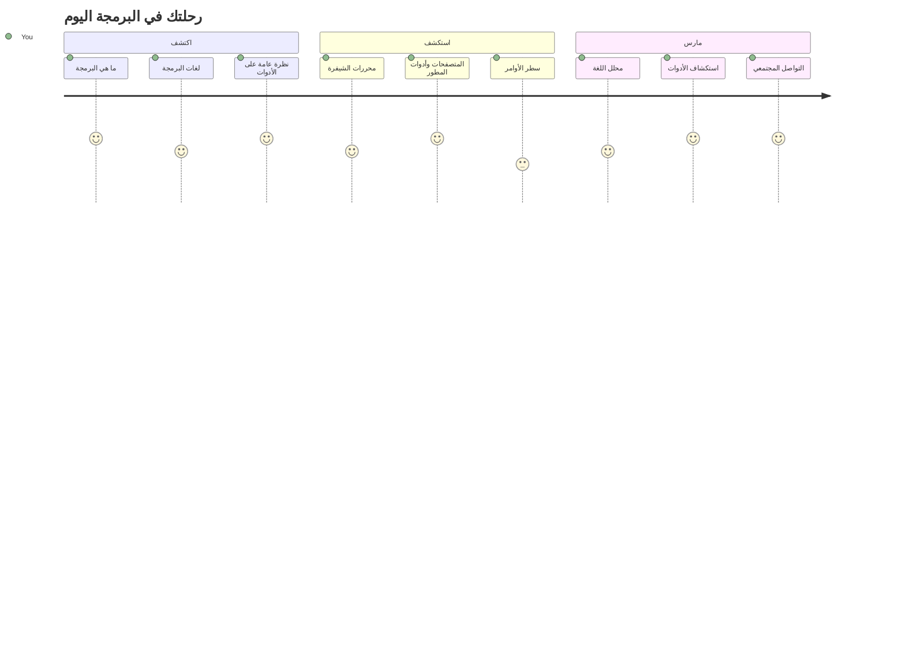
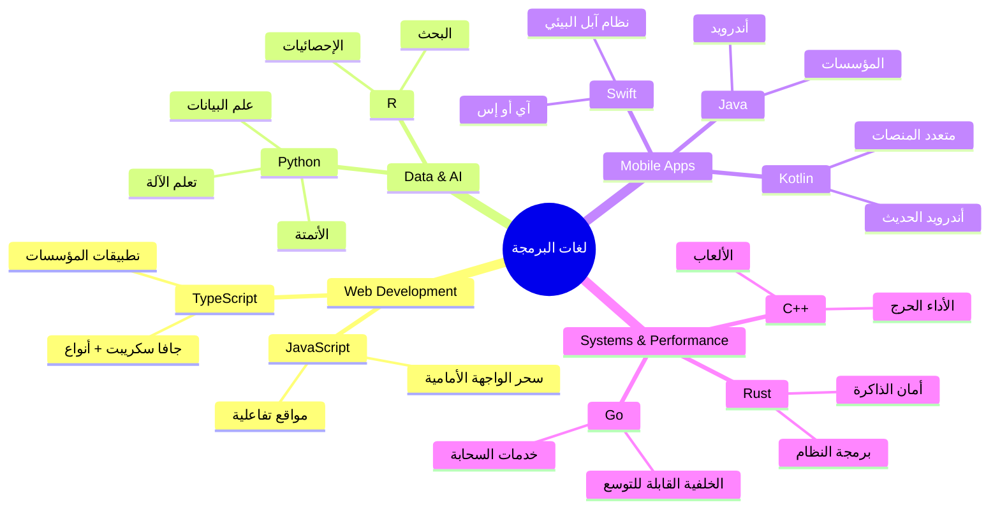
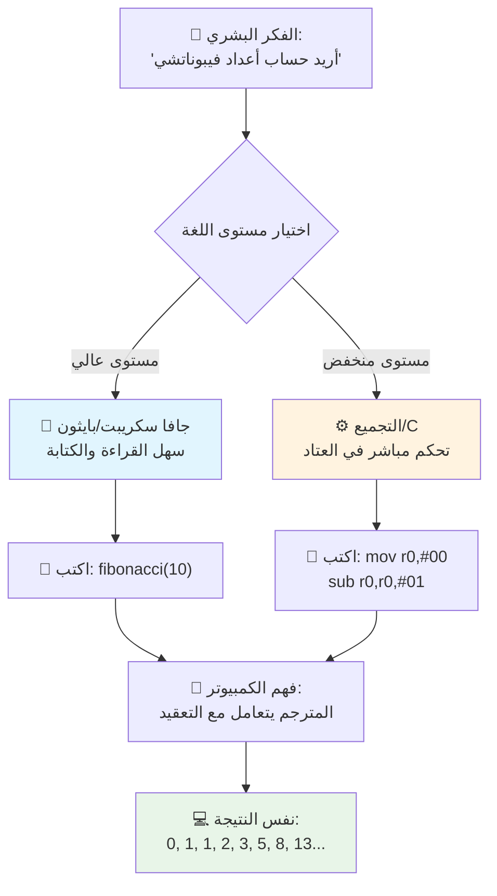
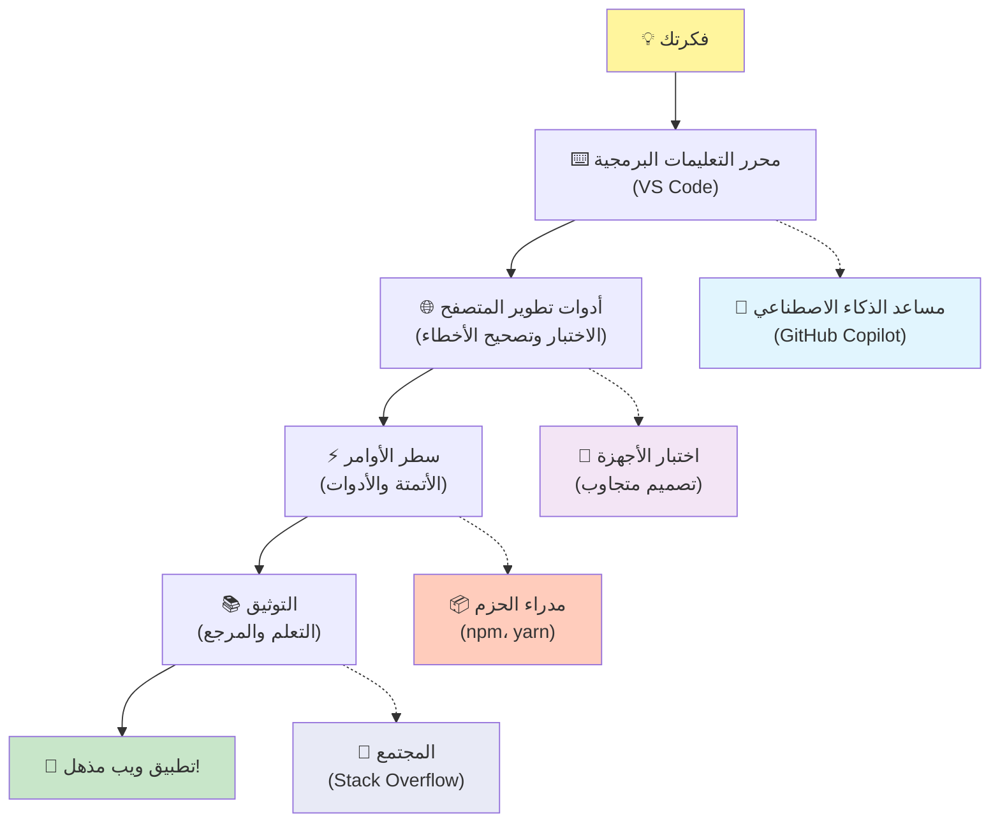
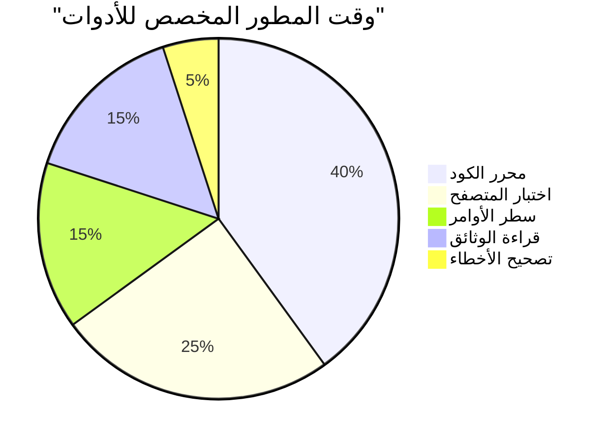
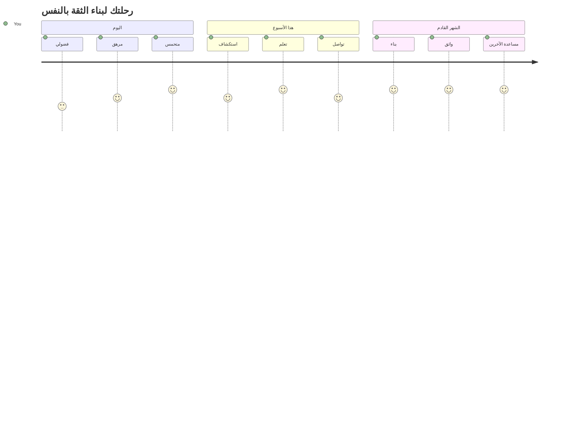

# مقدمة في لغات البرمجة وأدوات المطور الحديثة

مرحبًا بك، أيها المطور المستقبلي! 👋 هل يمكنني أن أخبرك بشيء لا يزال يمنحني قشعريرة في كل يوم؟ أنت على وشك اكتشاف أن البرمجة ليست مجرد أجهزة كمبيوتر – بل هي امتلاك قوى خارقة حقيقية لتحويل أفكارك الجامحة إلى واقع!

هل تعرف ذلك اللحظة عندما تستخدم تطبيقك المفضل ويسير كل شيء بسلاسة تامة؟ عندما تضغط على زر ويحدث شيء سحري تمامًا يجعلك تقول "واو، كيف فعلوا ذلك؟" حسنًا، شخص مثلك بالضبط – ربما يجلس في مقهاه المفضل الساعة 2 صباحًا مع إسبريسو ثالث – كتب الكود الذي صنع تلك السحر. وهنا ما سيذهلك: بنهاية هذا الدرس، لن تفهم فقط كيف فعلوا ذلك، بل ستتوق لتجربته بنفسك!

انظر، أنا أتفهم تمامًا إذا شعرت أن البرمجة مخيفة الآن. عندما بدأت لأول مرة، كنت أعتقد حقًا أنك تحتاج لأن تكون عبقريًا في الرياضيات أو قد كنت تبرمج منذ أن كان عمرك خمس سنوات. لكن إليك ما غيّر تمامًا نظرتي: البرمجة تشبه تمامًا تعلم إجراء محادثات في لغة جديدة. تبدأ بـ "مرحبًا" و"شكرًا"، ثم تتعلم كيف تطلب قهوة، وقبل أن تعرف ذلك، تكون تجري مناقشات فلسفية عميقة! ولكن في هذه الحالة، تجري محادثات مع أجهزة الكمبيوتر، وبصراحة؟ إنهم أكثر شركاء المحادثة صبرًا على الإطلاق – لا يحكمون على أخطائك وأبدًا متحمسون لتجربة المحاولة مرة أخرى!

اليوم، سوف نستكشف الأدوات الرائعة التي تجعل تطوير الويب الحديث ليس ممكنًا فقط، بل مدمنًا بشدة. أتحدث عن نفس المحررات والمتصفحات وسير العمل التي يستخدمها المطورون في Netflix وSpotify وأستوديو التطبيقات المستقلة المفضل لديك يوميًا. وهذه هي النقطة التي ستجعلك ترقص فرحًا: معظم هذه الأدوات الاحترافية والمعتمدة من الصناعة هي مجانية بالكامل!


> ملخص مرئي بواسطة [Tomomi Imura](https://twitter.com/girlie_mac)


```mermaid
journey
    title رحلتك في البرمجة اليوم
    section اكتشف
      ما هي البرمجة: 5: You
      لغات البرمجة: 4: You
      نظرة عامة على الأدوات: 5: You
    section استكشف
      محررات الشيفرة: 4: You
      المتصفحات وأدوات المطور: 5: You
      سطر الأوامر: 3: You
    section مارس
      محلل اللغة: 4: You
      استكشاف الأدوات: 5: You
      التواصل المجتمعي: 5: You
```
## لنرَ ما تعرفه بالفعل!

قبل أن نبدأ في الأشياء الممتعة، أنا فضولي – ما الذي تعرفه فعلاً عن هذا العالم البرمجي؟ وصدقني، إذا كنت تنظر إلى هذه الأسئلة وتفكر "ليس لدي أدنى فكرة عن أي من هذا"، هذا ليس مجرد مقبول، بل مثالي! هذا يعني أنك في المكان الصحيح تمامًا. اعتبر هذا الاختبار كتمرين الإحماء قبل التمرين – نحن فقط ندفّئ عضلات الدماغ!

[خذ اختبار ما قبل الدرس](https://ff-quizzes.netlify.app/web/)

## المغامرة التي سنخوضها معًا

حسنًا، أنا فعلاً متحمس جدًا لما سنستكشفه اليوم! حقًا، أتمنى لو أستطيع رؤية وجهك عندما تبدأ بعض هذه المفاهيم في أن تتضح لك. هذه هي الرحلة الرائعة التي سنخوضها معًا:

- **ما هي البرمجة في الواقع (ولماذا هي الأروع على الإطلاق!)** – سوف نكتشف كيف أن الكود هو السحر الخفي الذي يدعم كل شيء حولك، من ذلك المنبه الذي يعرف بطريقة ما أنه صباح الاثنين إلى الخوارزمية التي تنسق توصيات Netflix الخاصة بك بشكل مثالي
- **لغات البرمجة وشخصياتها المدهشة** – تخيل دخولك حفلة حيث كل شخص يمتلك قوى خارقة مختلفة تمامًا وطرقًا متنوعة لحل المشكلات. هذا هو عالم لغات البرمجة، وسوف تحب التعرف عليهم!
- **اللبنات الأساسية التي تجعل السحر الرقمي يحدث** – اعتبرها كأطقم LEGO الإبداعية المطلقة. بمجرد أن تفهم كيف ترتبط هذه القطع معًا، ستدرك أنك تستطيع بناء أي شيء تحلم به خيالك
- **أدوات احترافية ستجعلك تشعر وكأنك حصلت للتو على عصا الساحر** – أنا لا أبالغ هنا – هذه الأدوات ستجعلك تشعر حقًا بأن لديك قوى خارقة، وأفضل جزء؟ إنها نفس الأدوات التي يستخدمها المحترفون!

> 💡 **إليك الأمر**: لا تفكر حتى بمحاولة حفظ كل شيء اليوم! الآن، أريدك فقط أن تشعر بتلك الشرارة من الحماسة حول ما هو ممكن. التفاصيل ستتثبت تلقائيًا بينما نمارس معًا – هكذا يحدث التعلم الحقيقي!

> يمكنك أخذ هذا الدرس على [Microsoft Learn](https://learn.microsoft.com/en-us/learn/modules/web-development-101/introduction-programming/?WT.mc_id=academic-77807-sagibbon)!

## إذًا ما هو *البرمجة* بالضبط؟

حسنًا، دعنا نتناول سؤال المليون دولار: ما هي البرمجة، حقًا؟

سأعطيك قصة غيرت تمامًا كيف أفكر في هذا الموضوع. الأسبوع الماضي، كنت أحاول أن أشرح لأمي كيف تستخدم جهاز التحكم عن بعد الجديد للتلفاز الذكي الخاص بنا. وجدت نفسي أقول أشياء مثل "اضغطي على الزر الأحمر، لكن ليس الزر الأحمر الكبير، الزر الأحمر الصغير على اليسار... لا، اليسار الآخر... حسنًا، الآن اضغطيه لمدة ثانيتين، ليس واحدة، وليس ثلاث..." هل يبدو مألوفًا؟ 😅

هذا هو البرمجة! إنها فن إعطاء تعليمات مفصلة للغاية، خطوة بخطوة لشيء قوي لكنه يحتاج لأن يُوضّح كل شيء بشكل دقيق. باستثناء أنك لا تشرح لأمك (التي يمكنها أن تسأل "أي زر أحمر؟!"), بل تشرح لجهاز كمبيوتر (الذي يفعل بالضبط ما تقوله، حتى وإن لم يكن ما تقصده تمامًا).

وهذا ما أذهلني عندما تعلمت هذا لأول مرة: أجهزة الكمبيوتر في جوهرها بسيطة جدًا. فهي تفهم فقط شيئان – 1 و 0، وهو في الأساس "نعم" و "لا" أو "تشغيل" و "إيقاف". هذا كل شيء! لكن هنا يكمن السحر – لا نحتاج لأن نتحدث بالأصفار والواحدات كما في فيلم The Matrix. هنا تأتي **لغات البرمجة** لإنقاذنا. إنها مثل أفضل مترجم في العالم يأخذ أفكارك البشرية الطبيعية ويحولها إلى لغة الكمبيوتر.

وهذا ما لا يزال يمنحني قشعريرة حقيقية كل صباح عندما أستيقظ: حرفيًا *كل شيء* رقمي في حياتك بدأ مع شخص مثلك بالضبط، ربما جالسًا في بيجامته مع كوب قهوة، يكتب الكود على حاسوبه المحمول. ذلك الفلتر في إنستغرام الذي يجعلك تبدو مثاليًا؟ شخص ما برمج ذلك. التوصية التي أوصلتك لأغنيتك المفضلة الجديدة؟ مطور صنع تلك الخوارزمية. التطبيق الذي يساعدك في تقسيم فواتير العشاء مع أصدقائك؟ نعم، شخص قال "هذا مزعج، أعتقد أنني أستطيع إصلاح هذا" ثم... فعلها!

عندما تتعلم البرمجة، فأنت لا تكتسب مهارة جديدة فحسب – بل تصبح جزءًا من هذه المجتمع الرائع من حلالي المشكلات الذين يقضون أيامهم يفكرون، "ماذا لو استطعت بناء شيء يجعل يوم شخص ما أفضل قليلًا؟" بصراحة، هل هناك شيء أكثر روعة من هذا؟

✅ **صيد حقيقة ممتعة**: هنا شيء رائع لتحقق منه عندما يكون لديك وقت فراغ – من تعتقد أنه كان أول مبرمج حاسوب في العالم؟ سأعطيك تلميحًا: قد لا يكون من تتوقعه! القصة وراء هذا الشخص رائعة للغاية وتُظهر أن البرمجة كانت دائمًا عن حل المشكلات بشكل إبداعي والتفكير خارج الصندوق.

### 🧠 **وقت التقييم: كيف تشعر الآن؟**

**خذ لحظة للتفكير:**
- هل أصبح مفهوم "إعطاء تعليمات لأجهزة الكمبيوتر" واضحًا لك الآن؟
- هل يمكنك التفكير في مهمة يومية ترغب في أتمتتها عن طريق البرمجة؟
- ما هي الأسئلة التي تتبادر إلى ذهنك حول كل هذه البرمجة؟

> **تذكّر**: من الطبيعي تمامًا إذا شعرت أن بعض المفاهيم غير واضحة الآن. تعلم البرمجة يشبه تعلم لغة جديدة – يحتاج عقلك إلى وقت لبناء تلك المسارات العصبية. أنت تقوم بعمل رائع!

## لغات البرمجة مثل نكهات مختلفة من السحر

حسنًا، قد يبدو هذا غريبًا، لكن تمسك بي – لغات البرمجة تشبه كثيرًا أنواع الموسيقى المختلفة. فكر فيها: لديك الجاز، السلس والعفوي، والروك القوي والمباشر، والكلاسيكي الأنيق والمنظم، والهيب هوب الإبداعي والمعبر. كل نوع له أجوائه الخاصة، ومجتمع خاص من المعجبين المتحمسين، وكل واحد منهم مثالي لمزاج ومناسبات مختلفة.

لغات البرمجة تعمل بنفس الطريقة! لن تستخدم نفس اللغة لبناء لعبة موبايل ممتعة كما تستخدمها لتحليل كميات ضخمة من بيانات المناخ، تمامًا كما لن تعزف ميتال الموت في صف اليوغا (حسنًا، معظم صفوف اليوغا على أي حال! 😄).

لكن ما يذهلني في كل مرة أفكر فيه: هذه اللغات مثل وجود أفضل مترجم صبور وذكي في العالم يجلس بجانبك. يمكنك التعبير عن أفكارك بطريقة طبيعية لعقلك البشري، وهم يتولون كل العمل المعقد لترجمتها إلى الأصفار والواحدات التي تتحدث بها أجهزة الكمبيوتر فعليًا. إنه كأن لديك صديق يتقن تمامًا كلا من "الإبداع البشري" و"منطق الكمبيوتر" – وهم لا يتعبون أبدًا، ولا يحتاجون إلى استراحات قهوة، ولا يحكمون عليك إذا سألت نفس السؤال مرتين!

### لغات البرمجة الشائعة واستخداماتها


```mermaid
mindmap
  root((لغات البرمجة))
    Web Development
      JavaScript
        سحر الواجهة الأمامية
        مواقع تفاعلية
      TypeScript
        جافا سكريبت + أنواع
        تطبيقات المؤسسات
    Data & AI
      Python
        علم البيانات
        تعلم الآلة
        الأتمتة
      R
        الإحصائيات
        البحث
    Mobile Apps
      Java
        أندرويد
        المؤسسات
      Swift
        آي أو إس
        نظام آبل البيئي
      Kotlin
        أندرويد الحديث
        متعدد المنصات
    Systems & Performance
      C++
        الألعاب
        الأداء الحرج
      Rust
        أمان الذاكرة
        برمجة النظام
      Go
        خدمات السحابة
        الخلفية القابلة للتوسع
```
| اللغة | الأفضل لـ | لماذا هي شهيرة |
|----------|----------|------------------|
| **JavaScript** | تطوير الويب، واجهات المستخدم | تعمل في المتصفحات وتدعم المواقع التفاعلية |
| **Python** | علوم البيانات، الأتمتة، الذكاء الاصطناعي | سهلة القراءة والتعلم، مكتبات قوية |
| **Java** | تطبيقات المؤسسات، تطبيقات أندرويد | مستقلة عن المنصة، قوية للأنظمة الكبيرة |
| **C#** | تطبيقات ويندوز، تطوير الألعاب | دعم قوي من بيئة مايكروسوفت |
| **Go** | خدمات السحابة، الأنظمة الخلفية | سريع، بسيط، مصمم للحوسبة الحديثة |

### لغات المستوى العالي مقابل المنخفض

حسنًا، هذا كان بصراحة المفهوم الذي كسر عقلي عندما بدأت التعلم، لذلك سأشاركك التشبيه الذي جعلني أفهمه أخيرًا – وأتمنى أن يساعدك أيضًا!

تخيل أنك تزور بلدًا لا تتحدث لغته، وتحتاج بشدة إلى إيجاد أقرب حمام (كلنا مررنا بذلك، أليس كذلك؟ 😅):

- **البرمجة منخفضة المستوى** تشبه تعلم اللهجة المحلية جيدًا بحيث يمكنك التحدث مع الجدة التي تبيع الفاكهة في الزاوية باستخدام مراجع ثقافية، وتعابير محلية، ونكات داخلية لا يفهمها إلا من نشأ هناك. الأمر رائع جدًا وفعال للغاية... إذا كنت تتقنها! لكنه محير جدًا عندما تحاول فقط أن تجد حمامًا.

- **البرمجة عالية المستوى** مثل وجود صديق محلي مذهل يفهمك فقط. يمكنك أن تقول "أحتاج حقًا إلى إيجاد حمام" بالإنجليزية البسيطة، وهم يتولون الترجمة الثقافية ويعطونك الإرشادات بطريقة منطقية لعقلك الغريب.

في مصطلحات البرمجة:
- **لغات منخفضة المستوى** (مثل Assembly أو C) تتيح لك إجراء محادثات مفصلة للغاية مع مكونات الكمبيوتر الفعلية، لكن عليك التفكير كآلة، وهو ما... حسنًا، لنقل إنه تحول ذهني كبير!
- **لغات عالية المستوى** (مثل JavaScript، Python، أو C#) تسمح لك بالتفكير كبشر بينما تتولى كل التحدث بلغة الآلة خلف الكواليس. بالإضافة إلى أن لديها مجتمعات مضيافة مليئة بأشخاص يتذكرون كيف كان شعورهم كمبتدئين ويريدون حقًا المساعدة!

خمن أي واحدة سأنصحك أن تبدأ بها؟ 😉 لغات المستوى العالي مثل العجلات التدريبية التي لا تريد أن تخلعها أبدًا لأنها تجعل التجربة كلها أكثر متعة!


```mermaid
flowchart TB
    A["👤 الفكر البشري:<br/>'أريد حساب أعداد فيبوناتشي'"] --> B{اختيار مستوى اللغة}
    
    B -->|مستوى عالي| C["🌟 جافا سكريبت/بايثون<br/>سهل القراءة والكتابة"]
    B -->|مستوى منخفض| D["⚙️ التجميع/C<br/>تحكم مباشر في العتاد"]
    
    C --> E["📝 اكتب: fibonacci(10)"]
    D --> F["📝 اكتب: mov r0,#00<br/>sub r0,r0,#01"]
    
    E --> G["🤖 فهم الكمبيوتر:<br/>المترجم يتعامل مع التعقيد"]
    F --> G
    
    G --> H["💻 نفس النتيجة:<br/>0, 1, 1, 2, 3, 5, 8, 13..."]
    
    style C fill:#e1f5fe
    style D fill:#fff3e0
    style H fill:#e8f5e8
```
### دعني أوضح لك لماذا لغات المستوى العالي أكثر ودية

حسنًا، سأريك شيئًا يوضح تمامًا لماذا وقعت في حب لغات المستوى العالي، لكن أولًا – أحتاج منك أن تعدني بشيء. عندما ترى مثال الكود الأول، لا تفزع! من المفترض أن يبدو مخيفًا. هذه هي النقطة التي أريد إثباتها!

سوف ننظر إلى نفس المهمة مكتوبة بأسلوبين مختلفين تمامًا. كلاهما ينشئ ما يسمى بتسلسل فيبوناتشي – وهو نمط رياضي جميل حيث كل عدد هو مجموع العددين السابقين: 0، 1، 1، 2، 3، 5، 8، 13... (معلومة ممتعة: ستجد هذا النمط حرفيًا في كل مكان في الطبيعة – دوامات بذور عباد الشمس، أنماط مخروط الصنوبر وحتى طريقة تشكيل المجرات!)

هل أنت مستعد لرؤية الفرق؟ هيا بنا!

**لغة عالية المستوى (JavaScript) – صديقة للإنسان:**

```javascript
// الخطوة 1: الإعداد الأساسي لفايبوناتشي
const fibonacciCount = 10;
let current = 0;
let next = 1;

console.log('Fibonacci sequence:');
```

**ما يفعله هذا الكود:**
- **تعريف** ثابت لتحديد عدد أرقام فيبوناتشي التي نريد توليدها
- **تهيئة** متغيرين لتعقّب الرقم الحالي والرقم التالي في التسلسل
- **ضبط** القيم الابتدائية (0 و 1) التي تحدد نمط فيبوناتشي
- **عرض** رسالة عنوانية لتحديد ناتجنا

```javascript
// الخطوة 2: إنشاء التسلسل بحلقة
for (let i = 0; i < fibonacciCount; i++) {
  console.log(`Position ${i + 1}: ${current}`);
  
  // حساب الرقم التالي في التسلسل
  const sum = current + next;
  current = next;
  next = sum;
}
```

**تفصيل ما يحدث هنا:**
- **التكرار** عبر كل موضع في التسلسل باستخدام حلقة `for`
- **عرض** كل رقم مع موضعه باستخدام تنسيق النص القالب
- **حساب** الرقم التالي في تسلسل فيبوناتشي بجمع القيم الحالية والتالية
- **تحديث** متغيرات التعقّب للانتقال إلى التكرار التالي

```javascript
// الخطوة 3: النهج الوظيفي الحديث
const generateFibonacci = (count) => {
  const sequence = [0, 1];
  
  for (let i = 2; i < count; i++) {
    sequence[i] = sequence[i - 1] + sequence[i - 2];
  }
  
  return sequence;
};

// مثال على الاستخدام
const fibSequence = generateFibonacci(10);
console.log(fibSequence);
```

**في الأعلى، قمنا بـ:**
- **إنشاء** دالة قابلة لإعادة الاستخدام باستخدام صياغة الدوال الحديثة بالسهم
- **بناء** مصفوفة لتخزين التسلسل الكامل بدلًا من العرض الواحد تلو الآخر
- **استخدام** فهرسة المصفوفة لحساب كل رقم جديد اعتمادًا على القيم السابقة
- **إرجاع** التسلسل الكامل لاستخدام مرن في أجزاء أخرى من برنامجنا

**لغة منخفضة المستوى (ARM Assembly) – صديقة للكمبيوتر:**

```assembly
 area ascen,code,readonly
 entry
 code32
 adr r0,thumb+1
 bx r0
 code16
thumb
 mov r0,#00
 sub r0,r0,#01
 mov r1,#01
 mov r4,#10
 ldr r2,=0x40000000
back add r0,r1
 str r0,[r2]
 add r2,#04
 mov r3,r0
 mov r0,r1
 mov r1,r3
 sub r4,#01
 cmp r4,#00
 bne back
 end
```

لاحظ كيف أن نسخة JavaScript تُقرأ تقريبًا كتعليمات إنجليزية، بينما نسخة Assembly تستخدم أوامر مشفرة تتحكم مباشرة في معالج الكمبيوتر. كلاهما ينجز نفس المهمة بالضبط، لكن لغة المستوى العالي أسهل بكثير على البشر لفهمها وكتابتها وصيانتها.

**الفروق الرئيسية التي ستلاحظها:**
- **الوضوح**: يستخدم جافا سكريبت أسماء وصفية مثل `fibonacciCount` بينما يستخدم لغة التجميع تسميات مشفرة مثل `r0` و `r1`
- **التعليقات**: تشجع اللغات عالية المستوى على التعليقات الشارحة التي تجعل الكود وثائق ذاتية
- **الهيكل**: يتطابق تدفق جافا سكريبت المنطقي مع كيفية تفكير البشر حول المشاكل خطوة بخطوة
- **الصيانة**: تحديث إصدار جافا سكريبت لمتطلبات مختلفة أمر بسيط وواضح

✅ **عن متتالية فيبوناتشي**: هذا النمط العددي الرائع حقًا (حيث يساوي كل رقم مجموع الرقمين السابقين له: 0، 1، 1، 2، 3، 5، 8...) يظهر حرفياً *في كل مكان* في الطبيعة! ستجده في لفائف دوار الشمس، وأنماط أقماع الصنوبر، وطريقة انحناء أصداف الناوتيلوس، وحتى في كيفية نمو فروع الأشجار. من المذهل حقًا كيف تساعدنا الرياضيات والبرمجة على فهم وإعادة إنشاء الأنماط التي تستخدمها الطبيعة لخلق الجمال!

## اللبنات الأساسية التي تجعل السحر يحدث

حسنًا، الآن بعد أن رأيت كيف تبدو لغات البرمجة أثناء العمل، دعنا نكسر الأجزاء الأساسية التي تشكل حرفيًا كل برنامج تم كتابته على الإطلاق. فكر في هذه على أنها المكونات الأساسية في وصفتك المفضلة – بمجرد أن تفهم وظيفة كل منها، ستتمكن من قراءة وكتابة الكود في أي لغة تقريبًا!

هذا يشبه إلى حد كبير تعلم قواعد البرمجة. تذكر عندما كنت في المدرسة وتعلمت عن الأسماء، الأفعال، وكيفية تركيب الجمل؟ للبرمجة قواعدها الخاصة، وبصراحة، هي أكثر منطقية وتساهلاً بكثير من قواعد اللغة الإنجليزية! 😄

### الجمل البرمجية: التعليمات خطوة بخطوة

لنبدأ بـ **الجمل البرمجية** – هي مثل الجمل الفردية في حوار مع حاسوبك. كل جملة تخبر الحاسوب بتنفيذ شيء محدد، تمامًا مثل إعطاء الاتجاهات: "انعطف يسارًا هنا"، "توقف عند الضوء الأحمر"، "اركن في تلك البقعة".

ما أحببته في الجمل هو مدى سهولة قراءتها عادة. انظر هذا:

```javascript
// بيانات أساسية تقوم بأداء أفعال فردية
const userName = "Alex";                    
console.log("Hello, world!");              
const sum = 5 + 3;                         
```

**هذا ما يفعله هذا الكود:**
- **إعلان** متغير ثابت لتخزين اسم المستخدم
- **عرض** رسالة ترحيب على وحدة إخراج الكونسول
- **حساب** وتخزين نتيجة عملية رياضية

```javascript
// عبارات تتفاعل مع صفحات الويب
document.title = "My Awesome Website";      
document.body.style.backgroundColor = "lightblue";
```

**خطوة بخطوة، هذا ما يحدث:**
- **تعديل** عنوان صفحة الويب الذي يظهر في تبويب المتصفح
- **تغيير** لون خلفية جسم الصفحة بالكامل

### المتغيرات: نظام ذاكرة برنامجك

حسنًا، **المتغيرات** هي بصراحة من أفكاري المفضلة للتعليم لأنها تشبه أشياء تستخدمها كل يوم!

فكر في دفتر هاتفك لثانية. أنت لا تحفظ أرقام هواتف الجميع – بدلاً من ذلك، تحفظ "أمي"، "أفضل صديق"، أو "مطعم البيتزا الذي يوصل حتى الثانية صباحًا" وتترك هاتفك يتذكر الأرقام الفعلية. المتغيرات تعمل بنفس الطريقة! هي مثل حاويات معنونة حيث يمكن لبرنامجك تخزين المعلومات واسترجاعها لاحقًا باستخدام أسماء ذات معنى.

وهنا الجميل فعلاً: يمكن للمتغيرات أن تتغير أثناء تشغيل البرنامج (ومن هنا جاء اسم "متغير"). تمامًا كما قد تحدّث جهة اتصال مطعم البيتزا عندما تكتشف مكانًا أفضل، يمكن تحديث المتغيرات عندما يتعلم برنامجك معلومات جديدة أو تتغير الظروف!

دعني أوضح لك كيف يمكن أن يكون هذا بسيطًا جدًا:

```javascript
// الخطوة 1: إنشاء المتغيرات الأساسية
const siteName = "Weather Dashboard";        
let currentWeather = "sunny";               
let temperature = 75;                       
let isRaining = false;                      
```

**فهم هذه المفاهيم:**
- **تخزين** القيم الثابتة في متغيرات `const` (مثل اسم الموقع)
- **استخدام** `let` للقيم التي يمكن أن تتغير أثناء البرنامج
- **تعيين** أنواع بيانات مختلفة: سلاسل نصية، أرقام، وقيم صحيحة/خاطئة (boolean)
- **اختيار** أسماء وصفية تشرح محتوى كل متغير

```javascript
// الخطوة 2: العمل مع الكائنات لتجميع البيانات ذات الصلة
const weatherData = {                       
  location: "San Francisco",
  humidity: 65,
  windSpeed: 12
};
```

**في الأعلى، قمنا بـ:**
- **إنشاء** كائن لتجميع معلومات الطقس ذات الصلة معًا
- **تنظيم** عدة قطع بيانات تحت اسم متغير واحد
- **استخدام** أزواج المفتاح والقيمة لوضع علامات واضحة على كل معلومة

```javascript
// الخطوة 3: استخدام وتحديث المتغيرات
console.log(`${siteName}: Today is ${currentWeather} and ${temperature}°F`);
console.log(`Wind speed: ${weatherData.windSpeed} mph`);

// تحديث المتغيرات القابلة للتغيير
currentWeather = "cloudy";                  
temperature = 68;                          
```

**دعونا نفهم كل جزء:**
- **عرض** المعلومات باستخدام القوالب النصية مع تركيب `${}`
- **الوصول** إلى خصائص الكائن باستخدام النقطة (`weatherData.windSpeed`)
- **تحديث** المتغيرات المعلنة بـ `let` لتعكس الظروف المتغيرة
- **دمج** عدة متغيرات لإنشاء رسائل ذات معنى

```javascript
// الخطوة 4: التفكيك الحديث لكود أنظف
const { location, humidity } = weatherData; 
console.log(`${location} humidity: ${humidity}%`);
```

**ما تحتاج إلى معرفته:**
- **استخراج** خصائص محددة من الكائنات باستخدام التدمير (destructuring assignment)
- **إنشاء** متغيرات جديدة تلقائيًا بنفس أسماء مفاتيح الكائن
- **تبسيط** الكود بتجنب التكرار في كتابة النقطة

### تدفق التحكم: تعليم برنامجك كيفية التفكير

حسنًا، هنا تصبح البرمجة مذهلة حقًا! **تدفق التحكم** هو ببساطة تعليم برنامجك كيفية اتخاذ قرارات ذكية، تمامًا كما تفعل أنت يوميًا دون أن تفكر كثيرًا.

تخيل هذا: صباح اليوم ربما مررت بـ "إذا كانت تمطر، سأحمل مظلة. إذا كان الجو باردًا، سأرتدي سترة. إذا تأخرت، سأفوت الفطور وأخذ قهوة في الطريق." دماغك يتبع هذا المنطق الشرطي عشرات المرات يوميًا بشكل طبيعي!

هذا ما يجعل البرامج تبدو ذكية وحية بدلًا من اتباع سيناريو ممل ومتكرر فقط. يمكنها فعليًا النظر في الموقف، تقييم ما يحدث، والرد بشكل مناسب. كأنك تمنح برنامجك عقلًا قادرًا على التكيف واتخاذ القرارات!

هل تريد أن ترى كيف يعمل ذلك بشكل رائع؟ دعني أوضح لك:

```javascript
// الخطوة 1: منطق الشرط الأساسي
const userAge = 17;

if (userAge >= 18) {
  console.log("You can vote!");
} else {
  const yearsToWait = 18 - userAge;
  console.log(`You'll be able to vote in ${yearsToWait} year(s).`);
}
```

**ما يقوم به هذا الكود:**
- **التحقق** إذا كان عمر المستخدم يستوفي شرط التصويت
- **تنفيذ** كتل كود مختلفة حسب نتيجة الشرط
- **حساب** وعرض المدة المتبقية حتى يصبح المستخدم مؤهلاً للتصويت إذا كان عمره أقل من 18
- **تقديم** ملاحظات مفيدة ومحددة لكل سيناريو

```javascript
// الخطوة 2: شروط متعددة باستخدام عوامل منطقية
const userAge = 17;
const hasPermission = true;

if (userAge >= 18 && hasPermission) {
  console.log("Access granted: You can enter the venue.");
} else if (userAge >= 16) {
  console.log("You need parent permission to enter.");
} else {
  console.log("Sorry, you must be at least 16 years old.");
}
```

**تفصيل ما يحدث هنا:**
- **دمج** شروط متعددة باستخدام عامل `&&` (و)
- **إنشاء** تسلسل هرمي من الشروط باستخدام `else if` لسيناريوهات مختلفة
- **معالجة** جميع الحالات الممكنة عبر جملة `else` نهائية
- **تقديم** ملاحظات واضحة وقابلة للتنفيذ لكل حالة مختلفة

```javascript
// الخطوة 3: شرط مختصر باستخدام عامل التشغيل الثلاثي
const votingStatus = userAge >= 18 ? "Can vote" : "Cannot vote yet";
console.log(`Status: ${votingStatus}`);
```

**ما يجب تذكره:**
- **استخدام** عامل الثلاثي (`? :`) لشروط بسيطة ذات خيارين
- **كتابة** الشرط أولًا، يليها `?` ثم النتيجة الصحيحة، ثم `:` ثم النتيجة الخاطئة
- **تطبيق** هذا النمط عندما تحتاج إلى تعيين قيم بناءً على شروط

```javascript
// الخطوة 4: التعامل مع حالات محددة متعددة
const dayOfWeek = "Tuesday";

switch (dayOfWeek) {
  case "Monday":
  case "Tuesday":
  case "Wednesday":
  case "Thursday":
  case "Friday":
    console.log("It's a weekday - time to work!");
    break;
  case "Saturday":
  case "Sunday":
    console.log("It's the weekend - time to relax!");
    break;
  default:
    console.log("Invalid day of the week");
}
```

**يحقق هذا الكود ما يلي:**
- **مطابقة** قيمة المتغير مع عدة حالات محددة
- **تجميع** حالات مماثلة معًا (أيام الأسبوع مقابل عطلة نهاية الأسبوع)
- **تنفيذ** كتلة الكود المناسبة عندما يتم العثور على تطابق
- **تضمين** حالة `default` للتعامل مع القيم غير المتوقعة
- **استخدام** جمل `break` لمنع استمرار الكود للحالة التالية

> 💡 **تشبيه من الواقع**: فكر في تدفق التحكم كأنه نظام ملاحة GPS الأكثر صبرًا في العالم يعطيك الاتجاهات. قد يقول "إذا كان هناك ازدحام في الشارع الرئيسي، خذ الطريق السريع بدلاً من ذلك. إذا كان هناك بناء في الطريق السريع، جرب الطريق ذو المناظر الطبيعية." تستخدم البرامج نفس نوع المنطق الشرطي للرد بذكاء على المواقف المختلفة وتوفير أفضل تجربة للمستخدمين دائمًا.

### 🎯 **اختبار المفهوم: إتقان اللبنات الأساسية**

**لنرى كيف تسير مع الأساسيات:**
- هل تستطيع شرح الفرق بين المتغير والجملة البرمجية بكلماتك الخاصة؟
- فكر في سيناريو واقعي تستخدم فيه قرار إذا-ثم (مثل مثال التصويت)
- ما هو شيء واحد في منطق البرمجة فاجأك؟

**تعزيز سريع للثقة:**

```mermaid
flowchart LR
    A["📝 تعليمات<br/>(تعليمات)"] --> B["📦 متغيرات<br/>(تخزين)"] --> C["🔀 تدفق التحكم<br/>(قرارات)"] --> D["🎉 برنامج يعمل!"]
    
    style A fill:#ffeb3b
    style B fill:#4caf50
    style C fill:#2196f3
    style D fill:#ff4081
```
✅ **ما هو قادم**: سنستمتع كثيرًا بالغوص أعمق في هذه المفاهيم مع استمرار رحلتنا الرائعة معًا! الآن فقط ركز على الشعور بهذا الحماس حول كل الإمكانيات الرائعة المقبلة. المهارات والتقنيات المحددة ستتثبت طبيعيًا أثناء ممارستنا معًا – أعدك أن هذا سيكون ممتعًا أكثر مما تتوقع!

## أدوات المهنة

حسنًا، هنا أتحمس بشدة لدرجة لا أستطيع السيطرة على نفسي! 🚀 نحن على وشك التحدث عن الأدوات الرائعة التي ستجعلك تشعر وكأنك تسلمت مفاتيح مركبة فضائية رقمية.

تعرف كيف لدى الشيف تلك السكاكين المتوازنة تمامًا والتي تشعر وكأنها امتداد ليده؟ أو كيف لدى الموسيقي تلك الجيتار التي تبدو وكأنها تغني بمجرد أن يلمسها؟ حسنًا، لدى المطورين نسختنا الخاصة من هذه الأدوات السحرية، وهنا ما سيدهشك تمامًا – معظمها مجاني بالكامل!

أنا عمليًا أقفز على الكرسي وأنا أفكر في مشاركتها معك لأنها غيرت تمامًا طريقة بناء البرمجيات لدينا. نحن نتحدث عن مساعدين للبرمجة مدعومين بالذكاء الاصطناعي يمكنهم مساعدتك في كتابة الكود (أنا لا أمزح!)، وبيئات سحابية حيث يمكنك بناء تطبيقات كاملة من أي مكان متوفر فيه واي فاي، وأدوات تصحيح أخطاء متطورة للغاية كأنها تملك رؤية أشعة-X لبرامجك.

وهنا الجزء الذي لا زال يبعث في قلبي القشعريرة: هذه ليست "أدوات للمبتدئين" ستتجاوزها. هذه هي نفس الأدوات المهنية التي يستخدمها مطورو جوجل، ونتفلكس، واستوديو التطبيقات المستقلة الذين تحب معهم العمل في هذه اللحظة بالذات. ستشعر بأنك محترف حقًا أثناء استخدامها!


```mermaid
graph TD
    A["💡 فكرتك"] --> B["⌨️ محرر التعليمات البرمجية<br/>(VS Code)"] 
    B --> C["🌐 أدوات تطوير المتصفح<br/>(الاختبار وتصحيح الأخطاء)"]
    C --> D["⚡ سطر الأوامر<br/>(الأتمتة والأدوات)"]
    D --> E["📚 التوثيق<br/>(التعلم والمرجع)"]
    E --> F["🚀 تطبيق ويب مذهل!"]
    
    B -.-> G["🤖 مساعد الذكاء الاصطناعي<br/>(GitHub Copilot)"]
    C -.-> H["📱 اختبار الأجهزة<br/>(تصميم متجاوب)"]
    D -.-> I["📦 مدراء الحزم<br/>(npm، yarn)"]
    E -.-> J["👥 المجتمع<br/>(Stack Overflow)"]
    
    style A fill:#fff59d
    style F fill:#c8e6c9
    style G fill:#e1f5fe
    style H fill:#f3e5f5
    style I fill:#ffccbc
    style J fill:#e8eaf6
```
### محررات ومُتكاملات تطوير الشيفرة: أصدقاؤك الرقميون الجدد

دعنا نتحدث عن محررات الشيفرة – هذه بصراحة على وشك أن تصبح أماكنك المفضلة الجديدة للتواجد فيها! فكر فيها كملاذك الشخصي للبرمجة حيث ستقضي معظم وقتك في صياغة وتحسين إبداعاتك الرقمية.

لكن ما هو السحري حقًا في المحررات الحديثة: إنها ليست مجرد محررات نصوص مزخرفة. وكأن لديك معلم برمجة لامع وداعم جالس بجانبك 24/7. يلتقط أخطاء الكتابة قبل أن تلاحظها، يقترح تحسينات تجعلك تبدو كعبقري، يساعدك على فهم كل قطعة كود، وبعضها حتى يتنبأ بما أنت على وشك كتابته ويعرض إكمال فكرتك!

أتذكر عندما اكتشفت الإكمال التلقائي للمرة الأولى – شعرت حرفيًا كأنني أعيش في المستقبل. تبدأ في كتابة شيء، ومحررك يقول، "مهلاً، هل كنت تفكر في هذه الدالة التي تفعل بالضبط ما تحتاجه؟" إنه مثل وجود قارئ أفكار كرفيق برمجة!

**ما الذي يجعل هذه المحررات رائعة جدًا؟**

توفر محررات الشيفرة الحديثة مجموعة مذهلة من الميزات المصممة لتعزيز إنتاجيتك:

| الميزة | ماذا تفعل | لماذا تساعد |
|---------|--------------|--------------|
| **تمييز بناء الجملة** | يلوّن أجزاء مختلفة من الكود | يجعل الكود أسهل للقراءة واكتشاف الأخطاء |
| **الإكمال التلقائي** | يقترح الشيفرة أثناء الكتابة | يسرّع الترميز ويقلل الأخطاء الإملائية |
| **أدوات تصحيح الأخطاء** | تساعدك على العثور على الأخطاء وإصلاحها | توفر ساعات من الوقت في حل المشاكل |
| **الإضافات** | تضيف ميزات متخصصة | تخصص محررك لأي تقنية تستخدمها |
| **مساعدي الذكاء الاصطناعي** | يقترح الشيفرة ويشرحها | يسرّع التعلم والإنتاجية |

> 🎥 **مصدر فيديو**: هل تريد رؤية هذه الأدوات أثناء العمل؟ شاهد هذا الفيديو [Tools of the Trade video](https://youtube.com/watch?v=69WJeXGBdxg) لمحة شاملة.

#### المحررات الموصى بها لتطوير الويب

**[Visual Studio Code](https://code.visualstudio.com/?WT.mc_id=academic-77807-sagibbon)** (مجاني)
- الأكثر شعبية بين مطوري الويب
- نظام إضافات ممتاز
- مدمج به الطرفية وتكامل جيت
- **الإضافات الأساسية**:
  - [GitHub Copilot](https://marketplace.visualstudio.com/items?itemName=GitHub.copilot) - اقتراحات الشيفرة المدعومة بالذكاء الاصطناعي
  - [Live Share](https://marketplace.visualstudio.com/items?itemName=MS-vsliveshare.vsliveshare) - التعاون في الوقت الحقيقي
  - [Prettier](https://marketplace.visualstudio.com/items?itemName=esbenp.prettier-vscode) - تنسيق الشيفرة تلقائيًا
  - [Code Spell Checker](https://marketplace.visualstudio.com/items?itemName=streetsidesoftware.code-spell-checker) - اكتشاف الأخطاء الإملائية في الكود

**[JetBrains WebStorm](https://www.jetbrains.com/webstorm/)** (مدفوع، مجاني للطلاب)
- أدوات متقدمة للتصحيح والاختبار
- إكمال الشيفرة الذكي
- نظام تحكم بالإصدار مدمج

**بيئات تطوير متكاملة سحابية** (أسعار متنوعة)
- [GitHub Codespaces](https://github.com/features/codespaces) - نسخة كاملة من VS Code في المتصفح
- [Replit](https://replit.com/) - رائع للتعلم ومشاركة الشيفرة
- [StackBlitz](https://stackblitz.com/) - تطوير ويب فوري وكامل

> 💡 **نصيحة للبدء**: ابدأ بـ Visual Studio Code – مجاني، يستخدم على نطاق واسع في الصناعة، ويوجد مجتمع ضخم يصنع شروحات وإضافات مفيدة.

### متصفحات الويب: مختبر التطوير السري الخاص بك

حسنًا، استعد لأن ينفجر عقلك تمامًا! تعرف كيف كنت تستخدم المتصفحات للتصفح عبر وسائل التواصل الاجتماعي ومشاهدة الفيديوهات؟ إذًا اتضح أنها كانت تخبئ لك هذا المختبر المطور الرائع طوال الوقت، تنتظر فقط أن تكتشفه!

في كل مرة تضغط بزر الفأرة الأيمن على صفحة ويب وتختار "فحص العنصر"، تفتح عالمًا مخفيًا من أدوات المطور القوية التي هي في الحقيقة أقوى من بعض البرامج المكلفة التي كنت أدفع مئات الدولارات من أجلها. إنه يشبه اكتشاف أن مطبخك القديم العادي كان يخفي مختبر طهاة محترفين خلف لوحة سرية!
في المرة الأولى التي أظهر لي فيها شخص ما أدوات تطوير المتصفح (DevTools)، قضيت حوالي ثلاث ساعات فقط وأنا أضغط هنا وهناك وأقول "انتظر، هل يمكنه أن يفعل هذا أيضًا؟!" يمكنك حرفيًا تعديل أي موقع ويب في الوقت الحقيقي، ورؤية مدى سرعة تحميل كل شيء بالضبط، واختبار كيف يبدو موقعك على أجهزة مختلفة، وحتى تصحيح أخطاء جافا سكريبت مثل المحترف تمامًا. إنه أمر مذهل للغاية!

**إليك لماذا المتصفحات هي سلاحك السري:**

عندما تقوم بإنشاء موقع ويب أو تطبيق ويب، تحتاج إلى رؤية كيف يبدو وكيف يتصرف في العالم الحقيقي. المتصفحات لا تعرض عملك فقط، بل توفر أيضًا تعليقات تفصيلية حول الأداء، وسهولة الوصول، والمشكلات المحتملة.

#### أدوات مطوري المتصفح (DevTools)

تتضمن المتصفحات الحديثة مجموعات تطوير شاملة:

| فئة الأداة | ما تقوم به | حالة استخدام مثال |
|---------------|--------------|------------------|
| **مُفحص العناصر** | عرض وتحرير HTML/CSS في الوقت الحقيقي | ضبط التنسيق لرؤية النتائج الفورية |
| **وحدة التحكم** | عرض رسائل الخطأ واختبار جافا سكريبت | تصحيح المشاكل وتجربة الكود |
| **مراقب الشبكة** | تتبع كيفية تحميل الموارد | تحسين الأداء وأوقات التحميل |
| **مدقق سهولة الوصول** | اختبار التصميم الشامل | ضمان عمل موقعك لجميع المستخدمين |
| **محاكي الجهاز** | معاينة على أحجام شاشات مختلفة | اختبار التصميم المتجاوب دون الحاجة لأجهزة متعددة |

#### المتصفحات الموصى بها للتطوير

- **[Chrome](https://developers.google.com/web/tools/chrome-devtools/)** - أدوات تطوير معيار الصناعة مع وثائق موسعة
- **[Firefox](https://developer.mozilla.org/docs/Tools)** - أدوات ممتازة لـ CSS Grid وسهولة الوصول
- **[Edge](https://docs.microsoft.com/microsoft-edge/devtools-guide-chromium/?WT.mc_id=academic-77807-sagibbon)** - مبني على Chromium مع موارد تطوير مايكروسوفت

> ⚠️ **نصيحة اختبار مهمة**: اختبر مواقعك في عدة متصفحات دائمًا! ما يعمل بشكل مثالي في Chrome قد يبدو مختلفًا في Safari أو Firefox. يختبر المطورون المحترفون عبر جميع المتصفحات الرئيسية لضمان تجربة مستخدم متسقة.


### أدوات سطر الأوامر: بوابتك لقوى خارقة كمطور

حسنًا، دعنا نكون صادقين تمامًا هنا حول سطر الأوامر، لأنني أريدك أن تسمع هذا من شخص يفهم الأمر حقًا. عندما رأيته لأول مرة – تلك الشاشة السوداء المخيفة مع نص يومض – فكرت حرفيًا، "لا، بالتأكيد لا! هذا يبدو كشيء من فيلم هاكرز من الثمانينيات، وأنا بالتأكيد لست ذكيًا بما فيه الكفاية لذلك!" 😅

ولكن إليك ما كنت أتمنى لو أخبرني به أحد في ذلك الوقت، وما أخبرك به الآن: سطر الأوامر ليس مخيفًا – هو في الواقع مثل أن تجري محادثة مباشرة مع جهاز الكمبيوتر الخاص بك. فكر فيه كالفارق بين طلب الطعام عبر تطبيق أنيق مع صور وقوائم (وهو سهل وجميل) مقابل أن تدخل إلى مطعمك المحلي المفضل حيث يعرف الطباخ بالضبط ما تحب ويمكنه إعداد شيء مثالي بمجرد أن تقول "فاجئني بشيء مذهل."

سطر الأوامر هو المكان الذي يذهب إليه المطورون ليشعروا وكأنهم سحرة حقيقيون. تكتب بعض الكلمات التي تبدو سحرية (حسنًا، هي فقط أوامر، لكنها تبدو سحرية!)، تضغط Enter، وفجأة – لقد أنشأت هياكل مشاريع كاملة، أو ثبتت أدوات قوية من جميع أنحاء العالم، أو نشرت تطبيقك على الإنترنت ليشاهده الملايين. بمجرد أن تتذوق هذه القوة لأول مرة، ستصبح مدمنًا عليها بالفعل!

**لماذا ستصبح سطر الأوامر أداتك المفضلة:**

بينما الواجهات الرسومية رائعة للعديد من المهام، يتفوق سطر الأوامر في الأتمتة والدقة والسرعة. العديد من أدوات التطوير تعمل أساسًا من خلال واجهات سطر الأوامر، وتعلم استخدامها بكفاءة يمكن أن يحسن إنتاجيتك بشكل كبير.

```bash
# الخطوة 1: إنشاء والدخول إلى دليل المشروع
mkdir my-awesome-website
cd my-awesome-website
```

**ما يفعله هذا الكود:**
- **إنشاء** دليل جديد يسمى "my-awesome-website" لمشروعك
- **الانتقال** إلى الدليل الذي تم إنشاؤه حديثًا للبدء في العمل

```bash
# الخطوة 2: تهيئة المشروع باستخدام package.json
npm init -y

# تثبيت أدوات التطوير الحديثة
npm install --save-dev vite prettier eslint
npm install --save-dev @eslint/js
```

**خطوة بخطوة، هذا ما يحدث:**
- **تهيئة** مشروع Node.js جديد بالإعدادات الافتراضية باستخدام `npm init -y`
- **تثبيت** Vite كأداة بناء حديثة للتطوير السريع وبناءات الإنتاج
- **إضافة** Prettier لتنسيق الكود تلقائيًا و ESLint لفحص جودة الكود
- **استخدام** العلامة `--save-dev` لتعليم هذه الحزم كمصدر تطوير فقط

```bash
# الخطوة 3: إنشاء هيكل المشروع والملفات
mkdir src assets
echo '<!DOCTYPE html><html><head><title>My Site</title></head><body><h1>Hello World</h1></body></html>' > index.html

# بدء خادم التطوير
npx vite
```

**في الأعلى، قمنا بـ:**
- **تنظيم** مشروعنا بإنشاء مجلدات منفصلة للكود المصدري والموارد
- **إنشاء** ملف HTML أساسي مع هيكل مستند صحيح
- **بدء** خادم تطوير Vite للتحديث الحي واستبدال الوحدات الساخن

#### أدوات أساسية لسطر الأوامر لتطوير الويب

| الأداة | الغرض | لماذا تحتاجها |
|------|---------|-----------------|
| **[Git](https://git-scm.com/)** | التحكم في الإصدارات | تتبع التغييرات، التعاون مع الآخرين، النسخ الاحتياطي للعمل |
| **[Node.js & npm](https://nodejs.org/)** | وقت تشغيل جافا سكريبت وإدارة الحزم | تشغيل جافا سكريبت خارج المتصفحات، تثبيت أدوات تطوير حديثة |
| **[Vite](https://vitejs.dev/)** | أداة بناء وخادم تطوير | تطوير سريع جدًا مع استبدال الوحدات الحي |
| **[ESLint](https://eslint.org/)** | جودة الكود | اكتشاف وإصلاح المشاكل في جافا سكريبت تلقائيًا |
| **[Prettier](https://prettier.io/)** | تنسيق الكود | الحفاظ على تنسيق الكود متسق وسهل القراءة |

#### خيارات خاصة بالمنصات

**ويندوز:**
- **[Windows Terminal](https://docs.microsoft.com/windows/terminal/?WT.mc_id=academic-77807-sagibbon)** - طرفية حديثة وغنية بالميزات
- **[PowerShell](https://docs.microsoft.com/powershell/?WT.mc_id=academic-77807-sagibbon)** 💻 - بيئة برمجية قوية
- **[Command Prompt](https://learn.microsoft.com/windows-server/administration/windows-commands/windows-commands)** 💻 - سطر الأوامر التقليدي في ويندوز

**ماك أو إس:**
- **[Terminal](https://support.apple.com/guide/terminal/)** 💻 - تطبيق الطرفية المدمج
- **[iTerm2](https://iterm2.com/)** - طرفية محسنة مع ميزات متقدمة

**لينكس:**
- **[Bash](https://www.gnu.org/software/bash/)** 💻 - الغلاف القياسي في لينكس
- **[KDE Konsole](https://docs.kde.org/trunk5/en/konsole/konsole/index.html)** - محاكي طرفية متقدم

> 💻 = مثبت مسبقًا على نظام التشغيل

> 🎯 **مسار التعلم**: ابدأ بالأوامر الأساسية مثل `cd` (تغيير الدليل)، `ls` أو `dir` (قائمة الملفات)، و `mkdir` (إنشاء مجلد). مارس مع أوامر سير العمل الحديثة مثل `npm install`، `git status`، و `code .` (فتح الدليل الحالي في VS Code). مع ازدياد راحتك، ستتعلم تلقائيًا المزيد من الأوامر المتقدمة وتقنيات الأتمتة.


### التوثيق: معلم المعرفة المتوفر دائمًا

حسنًا، دعني أشاركك سرًا صغيرًا سيجعل شعورك أفضل كثيرًا كونك مبتدئًا: حتى المطورين الأكثر خبرة يقضون جزءًا كبيرًا من وقتهم في قراءة التوثيق. وليس لأنهم لا يعرفون ما يفعلون – بل لأنه علامة على الحكمة!

فكر في التوثيق كالوصول إلى أكثر المعلمين صبرًا ومعرفة في العالم والمتاحين على مدار الساعة. علقت في مشكلة الساعة 2 صباحًا؟ التوثيق هناك مع عناق افتراضي دافئ والجواب الذي تحتاجه بالضبط. تريد معرفة ميزة جديدة مثيرة يتحدث عنها الجميع؟ التوثيق يدعمك بأمثلة خطوة بخطوة. تحاول فهم لماذا يعمل شيء معين بهذه الطريقة؟ صحيح، التوثيق مستعد ليشرحها بطريقة تجعلك تفهم أخيرًا!

إليك شيء غيّر نظرتي تمامًا: عالم تطوير الويب يتحرك بسرعة مذهلة، ولا أحد (أعني لا أحد على الإطلاق!) يحتفظ بكل شيء في ذاكرته. شاهدت مطورين كبار يمتلكون أكثر من 15 عامًا من الخبرة يبحثون عن بناء جملة أساسي، وتعلم ماذا؟ هذا ليس محرجًا – هذا ذكي! الأمر ليس الحصول على ذاكرة مثالية، بل معرفة أين تجد إجابات موثوقة بسرعة وكيف تطبقها.

**هنا تحدث السحر الحقيقي:**

يقضي المطورون المحترفون جزءًا كبيرًا من وقتهم في قراءة التوثيق – ليس لأنهم لا يعرفون ما يفعلون، بل لأن بيئة تطوير الويب تتطور بسرعة كبيرة مما يتطلب تعلمًا مستمرًا. التوثيق الجيد يساعدك على فهم ليس فقط *كيفية* استخدام شيء ما، بل *لماذا* ومتى تستخدمه.

#### مصادر التوثيق الضرورية

**[Mozilla Developer Network (MDN)](https://developer.mozilla.org/docs/Web)**
- المعيار الذهبي لتوثيق تقنيات الويب
- أدلة شاملة لـ HTML و CSS و JavaScript
- تتضمن معلومات توافق المتصفحات
- تقدم أمثلة عملية وعروض تفاعلية

**[Web.dev](https://web.dev)** (من Google)
- أفضل الممارسات الحديثة في تطوير الويب
- إرشادات تحسين الأداء
- مبادئ سهولة الوصول والتصميم الشامل
- دراسات حالة من مشاريع حقيقية

**[Microsoft Developer Documentation](https://docs.microsoft.com/microsoft-edge/#microsoft-edge-for-developers)**
- موارد تطوير متصفح Edge
- أدلة التطبيقات التقدمية (PWA)
- رؤى عن التطوير متعدد المنصات

**[Frontend Masters Learning Paths](https://frontendmasters.com/learn/)**
- مناهج تعليم منظمة
- دورات فيديو من خبراء الصناعة
- تمارين برمجة عملية

> 📚 **استراتيجية الدراسة**: لا تحاول حفظ التوثيق – بدلاً من ذلك، تعلم كيفية التنقل فيه بكفاءة. ضع إشارة مرجعية على المراجع المستخدمة بشكل متكرر ومارس استخدام خاصية البحث لإيجاد معلومات محددة بسرعة.

### 🔧 **فحص إتقان الأدوات: ما الذي يهمك؟**

**خذ لحظة للتفكير:**
- ما الأداة التي أنت متحمس لتجربتها أولاً؟ (لا توجد إجابة خاطئة!)
- هل لا يزال سطر الأوامر مخيفًا بالنسبة لك، أم أنت فضولي تجاهه؟
- هل يمكنك تخيل استخدام أدوات تطوير المتصفح للتسلل خلف الكواليس في مواقعك المفضلة؟


```mermaid
pie title "وقت المطور المخصص للأدوات"
    "محرر الكود" : 40
    "اختبار المتصفح" : 25
    "سطر الأوامر" : 15
    "قراءة الوثائق" : 15
    "تصحيح الأخطاء" : 5
```
> **معلومة ممتعة**: معظم المطورين يقضون حوالي 40% من وقتهم في محرر الأكواد، لكن لاحظ كم من الوقت يُستخدم للاختبار، والتعلم، وحل المشكلات. البرمجة ليست فقط عن كتابة الكود – بل عن صياغة التجارب!

✅ **غذاء للتفكير**: إليك شيء مثير للتأمل – كيف تعتقد أن أدوات بناء المواقع (التطوير) قد تختلف عن أدوات تصميم كيف تبدو (التصميم)؟ الأمر مثل الفرق بين مهندس معماري يصمم بيتًا جميلاً والمقاول الذي يبنيه فعليًا. كلاهما ضروري، لكنهما يحتاجان لصناديق أدوات مختلفة! هذا النوع من التفكير سيساعدك حقًا على رؤية الصورة الأكبر لكيفية حياة المواقع.

## تحدي وكيل GitHub Copilot 🚀

استخدم وضع الوكيل لإكمال التحدي التالي:

**الوصف:** استكشف ميزات محرر شفرة حديث أو بيئة تطوير متكاملة (IDE) وأظهر كيف يمكنها تحسين سير عملك كمطور ويب.

**الموجه:** اختر محرر شفرة أو IDE (مثل Visual Studio Code، WebStorm، أو IDE مستضاف على السحابة). اذكر ثلاث ميزات أو إضافات تساعدك على كتابة وتصحيح أو صيانة الكود بشكل أكثر كفاءة. لكل منها، قدّم شرحًا موجزًا لكيف تفيد سير عملك.

---

## 🚀 التحدي

**حسنًا، أيها المحقق، هل أنت مستعد لقضيتك الأولى؟**

الآن بعد أن أصبحت تمتلك هذا الأساس الرائع، لدي مغامرة ستساعدك على رؤية مدى تنوع وعظمة عالم البرمجة. واسمع – الأمر ليس متعلقًا بكتابة الكود بعد، فلا ضغط هنا! اعتبر نفسك محقق لغات برمجة في قضيتك المثيرة الأولى!

**مهمتك، إذا قبلتها:**
1. **كن مستكشف لغات**: اختر ثلاث لغات برمجة من عوالم مختلفة تمامًا – ربما واحدة تبني مواقع، واحدة تخلق تطبيقات جوال، وأخرى تعالج البيانات العلمية. ابحث عن أمثلة لنفس المهمة البسيطة مكتوبة بكل لغة. أعدك بأنك ستندهش تمامًا من مدى اختلافها في الوقت نفسه الذي تقوم به بنفس الوظيفة!

2. **اكتشف قصص أصلها**: ما الذي يجعل كل لغة مميزة؟ هذه حقيقة رائعة – كل لغة برمجة تم إنشاؤها لأن شخصًا ما قال: "تعرف ماذا؟ يجب أن يكون هناك طريقة أفضل لحل هذه المشكلة بالذات." هل يمكنك اكتشاف ما كانت تلك المشكلات؟ بعضها قصصها مشوقة جدًا!

3. **تعرف على المجتمعات**: اطلع كيف كل مجتمع لغة مرحب وشغوف. بعضها يحتوي على ملايين المطورين الذين يشاركون المعرفة ويساعدون بعضهم، وأخرى أصغر لكنها مترابطة جدًا وداعمة. ستحب رؤية شخصيات هذه المجتمعات المختلفة!

4. **اتبع حدسك**: أي لغة تبدو أسهل بالنسبة لك الآن؟ لا تقلق بشأن اختيار "المثالي" – فقط استمع إلى إحساسك! بصراحة لا توجد إجابة خاطئة، ويمكنك دائمًا استكشاف أخرى لاحقًا.

**عمل تحقيق إضافي**: حاول اكتشاف المواقع أو التطبيقات الكبرى التي بُنيت بكل لغة. أضمن لك أنك ستصاب بالدهشة عندما تعرف من الذي يشغّل Instagram، Netflix، أو تلك اللعبة الجوال التي لا تستطيع التوقف عن لعبها!

> 💡 **تذكر**: لا تحاول أن تصبح خبيرًا في أي من هذه اللغات اليوم. أنت فقط تتعرف على الحي قبل أن تقرر أين تريد أن تنشئ متجرك. خذ وقتك، استمتع بالأمر، ودع فضولك يرشدك!

## هيا نحتفل بما اكتشفته!

يا إلهي، لقد استوعبت الكثير من المعلومات المذهلة اليوم! أنا حقًا متحمس لأرى كم من هذه الرحلة الرائعة بقي معك. وتذكر – هذا ليس اختبارًا تحتاج فيه أن تكون مثاليًا. إنه أشبه بالاحتفال بكل الأشياء الرائعة التي تعلمتها عن هذا العالم المدهش الذي ستغوص فيه قريبًا!

[خذ اختبار ما بعد الدرس](https://ff-quizzes.netlify.app/web/)

## المراجعة والدراسة الذاتية

**خذ وقتك للاستكشاف والاستمتاع!**
لقد غطيت الكثير اليوم، وهذا شيء تستحق الفخر به! الآن يأتي الجزء الممتع – استكشاف المواضيع التي أثارت فضولك. تذكر، هذا ليس واجبًا منزليًا – إنها مغامرة!

**اغص في أعماق ما يثير حماسك:**

**تعامل مباشرة مع لغات البرمجة:**
- زر المواقع الرسمية لـ 2-3 لغات برمجة جذبت انتباهك. كل واحدة لها شخصيتها وقصتها الخاصة!
- جرب بعض ساحات اللعب البرمجية عبر الإنترنت مثل [CodePen](https://codepen.io/)، [JSFiddle](https://jsfiddle.net/)، أو [Replit](https://replit.com/). لا تخف من التجربة – لا يمكنك كسر أي شيء!
- اقرأ عن كيف نشأت لغتك المفضلة. حقًا، بعض هذه القصص الأصلية مثيرة وستساعدك على فهم لماذا تعمل اللغات بهذا الشكل.

**تعرف على أدواتك الجديدة:**
- حمّل Visual Studio Code إذا لم تفعل ذلك بعد – إنه مجاني وستحبه!
- اقضِ بضع دقائق في تصفح سوق الامتدادات. إنه مثل متجر التطبيقات لمحرر الشيفرة الخاص بك!
- افتح أدوات المطور في متصفحك وانقر هنا وهناك. لا تقلق بشأن فهم كل شيء – فقط تعرّف على الموجود.

**انضم إلى المجتمع:**
- تابع بعض مجتمعات المطورين على [Dev.to](https://dev.to/)، [Stack Overflow](https://stackoverflow.com/)، أو [GitHub](https://github.com/). مجتمع البرمجة مرحب جدًا بالوافدين الجدد!
- شاهد بعض فيديوهات الترميز للمبتدئين على يوتيوب. هناك العديد من المبدعين الرائعين الذين يتذكرون ماذا يعني أن تبدأ.
- فكر في الانضمام إلى لقاءات محلية أو مجتمعات عبر الإنترنت. صدقني، المطورون يحبون مساعدة القادمين الجدد!

> 🎯 **استمع، هذا ما أريدك أن تتذكره**: لا يُتوقع منك أن تصبح ساحر برمجة بين عشية وضحاها! الآن، أنت فقط تتعرف على هذا العالم الجديد الرائع الذي على وشك أن تكون جزءًا منه. خذ وقتك، استمتع بالرحلة، وتذكر – كل مطور تعجب به كان جالسًا يومًا تمامًا حيث أنت الآن، يشعر بالحماس وربما القليل من الارتباك. هذا طبيعي تمامًا، ويعني أنك تسير في الطريق الصحيح!


## المهمة

[Reading the Docs](assignment.md)

> 💡 **دفعة صغيرة لمهمتك**: أود حقًا أن أراك تستكشف بعض الأدوات التي لم نتحدث عنها بعد! تخطَ المحررات والمتصفحات وأدوات سطر الأوامر التي تحدثنا عنها – هناك عالم كامل من أدوات التطوير الرائعة بانتظارك لتكتشفها. ابحث عن أدوات يتم صيانتها بنشاط ولها مجتمعات حيوية وداعمة (عادةً ما يكون لديهم أفضل الدروس وأكثر الأشخاص ودًا عندما تعلق وتحتاج لمساعدة).

---

## 🚀 جدول رحلتك في البرمجة

### ⚡ **ما يمكنك القيام به في الدقائق الخمس القادمة**
- [ ] احفظ 2-3 مواقع للغات برمجة جذبت اهتمامك
- [ ] حمّل Visual Studio Code إذا لم تفعل بعد
- [ ] افتح أدوات مطور المتصفح (F12) وانقر في أي موقع
- [ ] انضم إلى مجتمع برمجة واحد (Dev.to، Reddit r/webdev، أو Stack Overflow)

### ⏰ **ما يمكنك إنجازه خلال هذه الساعة**
- [ ] أكمل اختبار ما بعد الدرس وفكر في إجاباتك
- [ ] جهز VS Code مع امتداد GitHub Copilot
- [ ] جرّب مثال "Hello World" بلغتين برمجيتين مختلفتين عبر الإنترنت
- [ ] شاهد فيديو "يوم في حياة مطور" على يوتيوب
- [ ] ابدأ بالبحث عن لغات البرمجة (من التحدي)

### 📅 **مغامرتك التي تستمر لأسبوع**
- [ ] أكمل المهمة واستكشف 3 أدوات تطوير جديدة
- [ ] تابع 5 مطورين أو حسابات برمجة على وسائل التواصل الاجتماعي
- [ ] جرّب بناء شيء صغير في CodePen أو Replit (حتى مجرد "Hello, [اسمك]!")
- [ ] اقرأ تدوينة مطور عن رحلة برمجته
- [ ] انضم إلى لقاء افتراضي أو شاهد حديثًا برمجيًا
- [ ] ابدأ بتعلم لغتك المختارة من خلال الدروس عبر الإنترنت

### 🗓️ **تحولك خلال شهر**
- [ ] ابنِ مشروعك الصغير الأول (حتى صفحة ويب بسيطة تُحسب!)
- [ ] ساهم في مشروع مفتوح المصدر (ابدأ بإصلاح التوثيق)
- [ ] ارشد شخصًا يبدأ رحلته البرمجية للتو
- [ ] أنشئ موقعاً إلكترونياً لمحفظتك كمطور
- [ ] تواصل مع مجتمعات مطورين محلية أو مجموعات دراسة
- [ ] ابدأ بتخطيط هدف تعلمك التالي

### 🎯 **تأمل ختامي**

**قبل أن تتابع، خذ لحظة للاحتفال:**
- ما هو الشيء الذي أثار حماسك اليوم في البرمجة؟
- أي أداة أو مفهوم تريد استكشافه أولاً؟
- كيف تشعر حيال بدء هذه الرحلة البرمجية؟
- ما هو السؤال الذي تود طرحه على مطور الآن؟


```mermaid
journey
    title رحلتك لبناء الثقة بالنفس
    section اليوم
      فضولي: 3: You
      مرهق: 4: You
      متحمس: 5: You
    section هذا الأسبوع
      استكشاف: 4: You
      تعلم: 5: You
      تواصل: 4: You
    section الشهر القادم
      بناء: 5: You
      واثق: 5: You
      مساعدة الآخرين: 5: You
```
> 🌟 **تذكر**: كل خبير كان مبتدئًا يومًا ما. كل مطور متمرس شعر بنفس شعورك الآن – متحمس، ربما مرتبك قليلاً، وبالتأكيد فضولي حول ما هو ممكن. أنت في صحبة رائعة، وهذه الرحلة ستكون مذهلة. مرحبًا بك في العالم الرائع للبرمجة! 🎉

---

<!-- CO-OP TRANSLATOR DISCLAIMER START -->
**إخلاء المسؤولية**:  
تمت ترجمة هذا المستند باستخدام خدمة الترجمة الآلية [Co-op Translator](https://github.com/Azure/co-op-translator). بينما نسعى للدقة، يرجى العلم بأن التراجم الآلية قد تحتوي على أخطاء أو معلومات غير دقيقة. يجب اعتبار المستند الأصلي بلغته الأصلية المصدر الرسمي والمعتمد. للحصول على معلومات هامة، يُنصح بالترجمة البشرية المهنية. نحن غير مسؤولين عن أي سوء فهم أو تفسير ناتج عن استخدام هذه الترجمة.
<!-- CO-OP TRANSLATOR DISCLAIMER END -->