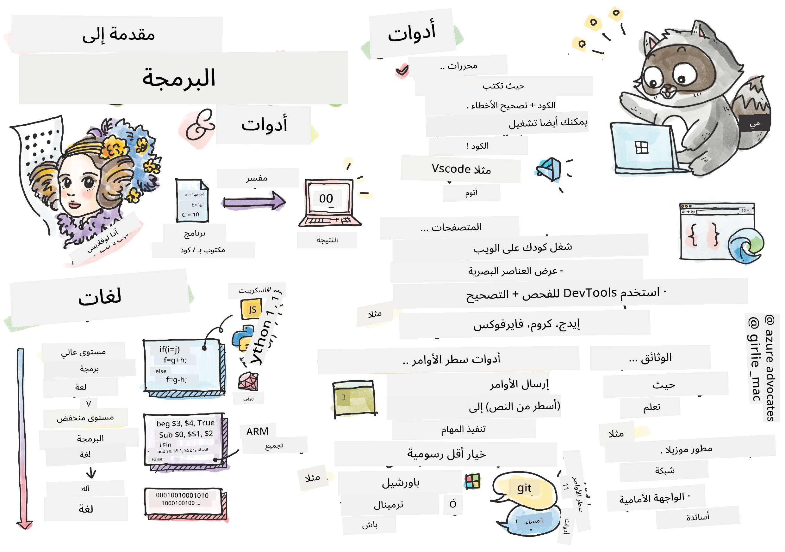
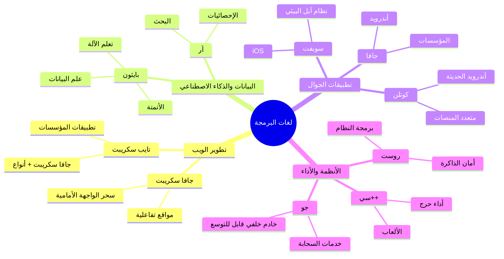
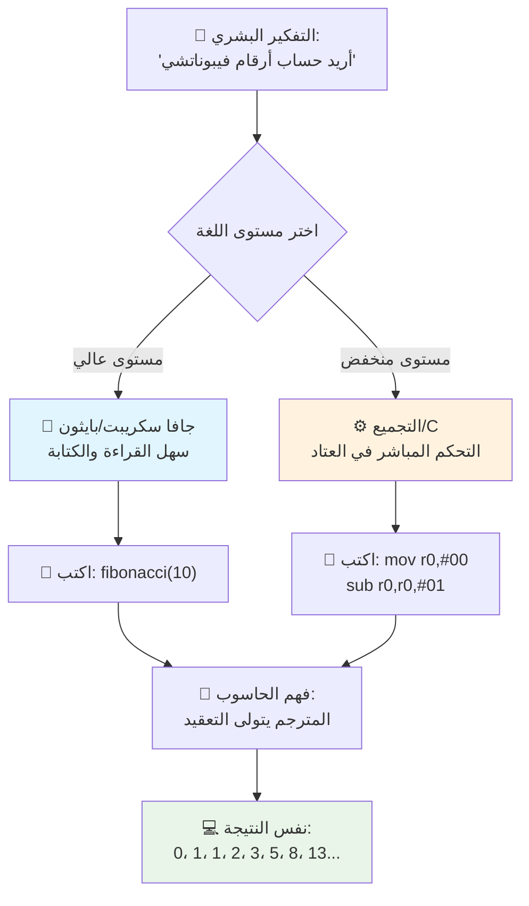
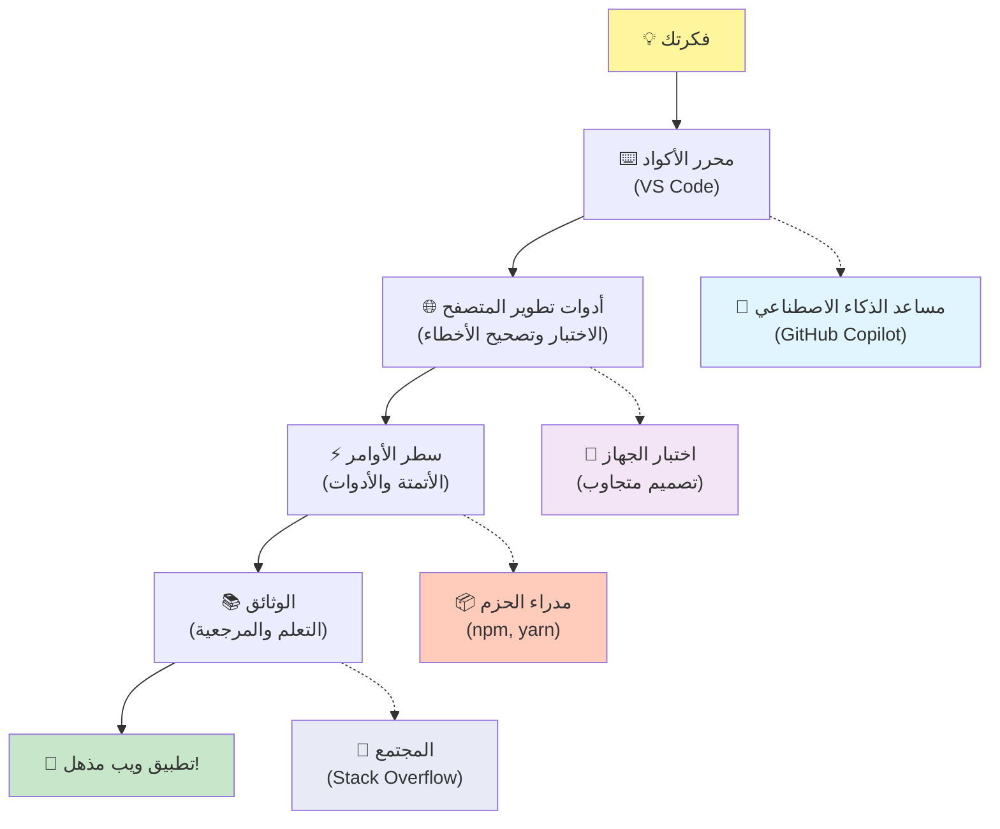
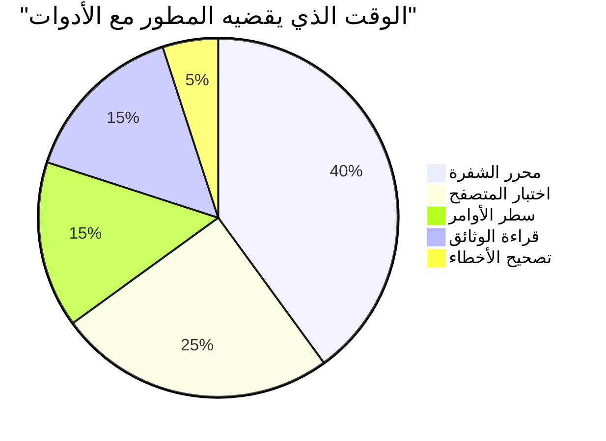
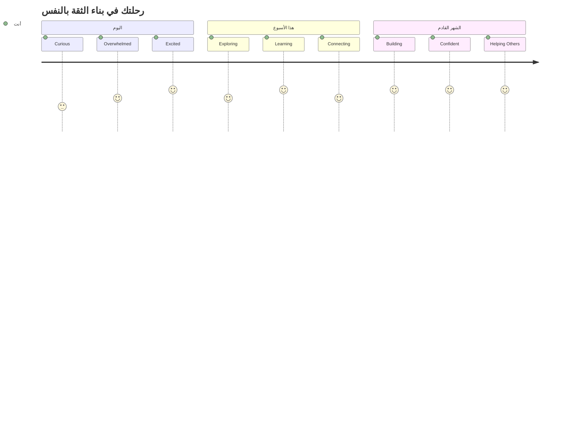

# مقدمة في لغات البرمجة وأدوات المطور الحديثة

مرحبًا أيها المطور المستقبلي! 👋 هل يمكنني أن أخبرك بشيء لا يزال يصيبني بالقشعريرة كل يوم؟ أنت على وشك اكتشاف أن البرمجة ليست مجرد أجهزة كمبيوتر – إنها عن امتلاك قوى خارقة حقيقية لإحياء أفكارك الأكثر جنونًا!

أتعرف ذلك اللحظة عندما تستخدم تطبيقك المفضل ويسير كل شيء على أكمل وجه؟ عندما تضغط زرًا يحدث شيء سحري تمامًا يجعلك تقول "رائع، كيف فعلوا ذلك؟" حسنًا، شخص ما مثلك تمامًا – ربما يجلس في مقهاه المفضل في الساعة 2 صباحًا مع الإسبريسو الثالث – كتب الشفرة التي خلقت تلك السحر. وهنا ما سيفجر عقلك: بحلول نهاية هذا الدرس، لن تفهم فقط كيف فعلوا ذلك، بل ستتشوق لتجربته بنفسك!

انظر، أنا أتفهم تمامًا إذا كانت البرمجة تبدو مخيفة الآن. عندما بدأت، كنت أعتقد بصدق أنك بحاجة لأن تكون عبقريًا في الرياضيات أو أنك كنت تبرمج منذ أن كنت في الخامسة من عمرك. ولكن هنا ما غيّر وجهة نظري تمامًا: البرمجة هي تمامًا مثل تعلم المحادثة بلغة جديدة. تبدأ بـ"مرحبا" و"شكرًا"، ثم تتدرج إلى طلب القهوة، وقبل أن تعرف، تكون تجري نقاشات فلسفية عميقة! باستثناء أنك في هذه الحالة، تجري المحادثات مع الحواسيب، وبصراحة؟ إنهم أكثر شركاء المحادثة صبرًا على الإطلاق – لا يحكمون على أخطائك ودائمًا متحمسون لتجربة ثانية!

اليوم، سنستكشف الأدوات المذهلة التي تجعل تطوير الويب الحديث ليس ممكنًا فحسب، بل مدمنًا حقيقيًا. أتحدث عن نفس المحررات والمتصفحات وسير العمل التي يستخدمها المطورون في نيتفليكس، سبوتيفاي، واستوديوهات التطبيقات المستقلة المفضلة لديك يوميًا. وهنا الجزء الذي سيجعلك ترقص فرحًا: معظم هذه الأدوات الاحترافية والمعتمدة على الصناعة هي مجانية تمامًا!


> مخطط مرسوم بواسطة [Tomomi Imura](https://twitter.com/girlie_mac)


```mermaid
journey
    title رحلتك البرمجية اليوم
    section اكتشف
      ما هو البرمجة: 5: You
      لغات البرمجة: 4: You
      نظرة عامة على الأدوات: 5: You
    section استكشف
      محررات الكود: 4: You
      المتصفحات وأدوات المطور: 5: You
      سطر الأوامر: 3: You
    section مارس
      محقق اللغة: 4: You
      استكشاف الأدوات: 5: You
      التواصل المجتمعي: 5: You
```
## لنرَ ما تعرفه بالفعل!

قبل أن نبدأ في الأشياء الممتعة، أنا فضولي – ما الذي تعرفه بالفعل عن عالم البرمجة هذا؟ واستمع، إذا كنت تنظر إلى هذه الأسئلة وتفكر "ليس لدي أدنى فكرة عن أي شيء من هذا"، فهذا ليس فقط مقبولًا، بل مثالي! هذا يعني أنك في المكان الصحيح تمامًا. فكر في هذا الاختبار كتمرين إحماء قبل التمرين – نحن فقط نقوم بتسخين عضلات الدماغ!

[خض اختبار ما قبل الدرس](https://ff-quizzes.netlify.app/web/)


## المغامرة التي سنخوضها معًا

حسنًا، أنا متحمس حقًا لما سنستكشفه اليوم! حقًا، أتمنى لو أستطيع رؤية وجهك عندما تتضح لك بعض هذه المفاهيم. إليك الرحلة الرائعة التي سنسيرها معًا:

- **ما هي البرمجة فعليًا (ولماذا هي أروع شيء على الإطلاق!)** – سنكتشف كيف أن الشفرة هي السحر الخفي الذي يدير كل شيء حولك، من ذلك المنبه الذي بطريقة ما يعرف أن اليوم هو الإثنين صباحًا إلى الخوارزمية التي تنسق توصيات نيتفليكس الخاصة بك بشكل مثالي
- **لغات البرمجة وشخصياتها الرائعة** – تخيل دخولك حفلة حيث يمتلك كل شخص قوى خارقة مختلفة تمامًا وطرقًا مختلفة لحل المشكلات. هذا هو عالم لغات البرمجة، وستحب لقائها!
- **الكتل الأساسية التي تجعل السحر الرقمي يحدث** – فكر في هذه كما لو كانت مجموعة LEGO الإبداعية النهائية. بمجرد أن تفهم كيف تتلاءم هذه القطع معًا، ستدرك أنه يمكنك بناء أي شيء تحلم به خيالك
- **الأدوات الاحترافية التي ستجعلك تشعر وكأنك تم تسليمك عصا ساحر** – لست أبالغ هنا – هذه الأدوات ستجعلك تشعر حقًا أن لديك قوى خارقة، والجزء الأفضل؟ إنها نفس الأدوات التي يستخدمها المحترفون!

> 💡 **إليك الأمر**: لا تفكر حتى في محاولة حفظ كل شيء اليوم! الآن، أريدك فقط أن تشعر بشرارة الحماس حول ما هو ممكن. التفاصيل ستثبت بشكل طبيعي أثناء ممارستنا معًا – هكذا يحدث التعلم الحقيقي!

> يمكنك أخذ هذا الدرس على [Microsoft Learn](https://learn.microsoft.com/en-us/learn/modules/web-development-101/introduction-programming/?WT.mc_id=academic-77807-sagibbon)!

## فما هو *البرمجة* بالضبط؟

حسنًا، دعنا نتناول سؤال المليون دولار: ما هي البرمجة حقًا؟

سأعطيك قصة غيرت تمامًا كيف أفكر في هذا. الأسبوع الماضي، كنت أحاول أن أشرح لأمي كيف تستخدم جهاز التحكم التلفزيوني الذكي الجديد لدينا. وجدت نفسي أقول أشياء مثل "اضغطي على الزر الأحمر، لكن ليس الزر الأحمر الكبير، الزر الأحمر الصغير على اليسار... لا، الجانب الآخر على اليسار... حسنًا، الآن اضغطي لمدة ثانيتين، ليست واحدة، وليست ثلاث..." هل يبدو مألوفًا؟ 😅

هذه هي البرمجة! إنها فن إعطاء تعليمات مفصلة للغاية، خطوة بخطوة، لشيء قوي جدًا لكنه يحتاج إلى كل شيء موضح تمامًا. إلا أن بدلًا من أن تشرح لأمك (التي يمكنها أن تسأل "أي زر أحمر؟!"), أنت تشرح للكمبيوتر (الذي ينفذ بالضبط ما تقول، حتى لو لم يكن ما قلته هو بالضبط ما قصدته).

ما أذهلني عندما تعلمت هذا لأول مرة: الحواسيب في جوهرها بسيطة للغاية. هي تفهم فعليًا شيئين فقط – 1 و0، وهما في الأساس تعني "نعم" و"لا" أو "تشغيل" و"إيقاف". هذا كل شيء! لكنها تصبح سحرية هنا – لا نحتاج لأن نتحدث بالواحدات والأصفار كما لو كنا في المصفوفة. هنا تأتي **لغات البرمجة** لإنقاذنا. فهي مثل وجود أفضل مترجم في العالم يأخذ أفكارك البشرية العادية ويحوّلها إلى لغة الكمبيوتر.

وهذا ما لا يزال يصيبني بالقشعريرة كل صباح عندما أستيقظ: فعليًا *كل* شيء رقمي في حياتك بدأ بشخص مثلك تمامًا، ربما يجلس في بيجامته مع كوب قهوة، يكتب الشفرة على حاسوبه المحمول. ذلك الفلتر في إنستغرام الذي يجعلك تبدو بلا عيوب؟ شخص ما برمج ذلك. التوصية التي قادتك إلى أغنيتك المفضلة الجديدة؟ مطور صنع تلك الخوارزمية. التطبيق الذي يساعدك في تقسيم فاتورة العشاء مع الأصدقاء؟ نعم، شخص فكر "هذا مزعج، أظن أنني يمكنني إصلاحه" ثم… فعلها!

عندما تتعلم البرمجة، لا تكتسب مهارة جديدة فحسب – بل تصبح جزءًا من هذه الجماعة الرائعة من حلالي المشكلات الذين يقضون أيامهم يفكرون، "ماذا لو استطعت بناء شيء يجعل يوم شخص ما أفضل بقليل؟" بصراحة، هل هناك شيء أروع من ذلك؟

✅ **مطاردة حقائق ممتعة**: إليك شيء رائع لتبحث عنه عندما يكون لديك بعض الوقت – من تعتقد أنه أول مبرمج حواسيب في العالم؟ سأعطيك تلميحًا: قد لا يكون من تتوقع! قصة هذا الشخص مثيرة للغاية وتظهر أن البرمجة كانت دائمًا عن حل المشكلات بإبداع والتفكير خارج الصندوق.

### 🧠 **وقت التقييم: كيف تشعر؟**

**خذ لحظة للتفكير:**
- هل أصبحت فكرة "إعطاء تعليمات للحواسيب" واضحة الآن؟
- هل يمكنك التفكير في مهمة يومية تود أتمتتها بالبرمجة؟
- ما هي الأسئلة التي تخطر ببالك حول موضوع البرمجة هذا؟

> **تذكر**: من الطبيعي تمامًا أن تبدو بعض المفاهيم غير واضحة الآن. تعلم البرمجة يشبه تعلم لغة جديدة – يحتاج دماغك وقتًا لبناء تلك المسارات العصبية. أنت تقوم بعمل رائع!

## لغات البرمجة مثل نكهات مختلفة من السحر

حسنًا، هذا قد يبدو غريبًا، لكن تمسك معي – لغات البرمجة تشبه كثيرًا أنواع الموسيقى المختلفة. فكر في الأمر: لديك الجاز، الذي هو سلس ويعتمد على الارتجال، والروك الذي هو قوي ومباشر، والكلاسيكي الذي أنيق ومنظم، والهيب هوب الذي مبدع ومعبر. لكل نمط جوه الخاص، وجمهور من المعجبين المتحمسين، وكل واحد منها مثالي لأمزجة ومناسبات مختلفة.

لغات البرمجة تعمل بنفس الطريقة! لن تستخدم نفس اللغة لبناء لعبة موبايل ممتعة كما تستخدم لتحليل كميات هائلة من بيانات المناخ، تمامًا كما أنك لن تعزف ديث ميتال في فصل يوجا (حسنًا، في معظم صفوف اليوجا على الأقل! 😄).

ولكن ما يفجر عقلي في كل مرة أفكر فيه: هذه اللغات هي مثل وجود أكثر مترجم عبقري وصبور في العالم جالس بجانبك. يمكنك التعبير عن أفكارك بطريقة طبيعية لدماغك البشري، وهم يتولون العمل المعقد للغاية لترجمتها إلى الواحدات والأصفار التي تتحدثها الحواسيب فعليًا. إنه كأن لديك صديقًا يجيد بطلاقة كل من "الإبداع البشري" و"منطق الكمبيوتر" – وهم لا يتعبون أبدًا، ولا يحتاجون إلى استراحات قهوة، ولا يحكمون عليك لأنك سألت نفس السؤال مرتين!

### لغات البرمجة الشهيرة واستخداماتها


```mermaid
mindmap
  root((لغات البرمجة))
    تطوير الويب
      جافا سكريبت
        سحر الواجهة الأمامية
        مواقع تفاعلية
      تايب سكريبت
        جافا سكريبت + أنواع
        تطبيقات المؤسسات
    البيانات والذكاء الاصطناعي
      بايثون
        علم البيانات
        تعلم الآلة
        الأتمتة
      آر
        الإحصائيات
        البحث
    تطبيقات الجوال
      جافا
        أندرويد
        المؤسسات
      سويفت
        iOS
        نظام آبل البيئي
      كوتلن
        أندرويد الحديثة
        متعدد المنصات
    الأنظمة والأداء
      سي++
        الألعاب
        أداء حرج
      روست
        أمان الذاكرة
        برمجة النظام
      جو
        خدمات السحابة
        خادم خلفي قابل للتوسع
```
| اللغة | الأفضل لـ | سبب شعبيتها |
|----------|----------|------------------|
| **JavaScript** | تطوير الويب، واجهات المستخدم | تعمل في المتصفحات وتدعم المواقع التفاعلية |
| **Python** | علم البيانات، الأتمتة، الذكاء الاصطناعي | سهلة القراءة والتعلم، مكتبات قوية |
| **Java** | تطبيقات المؤسسات، تطبيقات أندرويد | مستقلة عن المنصة، قوية للأنظمة الكبيرة |
| **C#** | تطبيقات ويندوز، تطوير الألعاب | دعم قوي من نظام مايكروسوفت |
| **Go** | خدمات السحابة، أنظمة الخادم الخلفي | سريعة، بسيطة، مصممة للحوسبة الحديثة |

### لغات المستوى العالي مقابل لغات المستوى المنخفض

حسنًا، هذا كان صراحة المفهوم الذي كسر عقلي عندما بدأت التعلم، لذلك سأشاركك التشبيه الذي جعل الأمر يتضح لي – وآمل حقًا أن يساعدك أيضًا!

تخيل أنك تزور دولة لا تتحدث لغتها، وتحتاج بشدة إلى إيجاد أقرب حمام (كلنا مررنا بذلك، أليس كذلك؟ 😅):

- **البرمجة منخفضة المستوى** مثل تعلم اللهجة المحلية جيدًا بحيث يمكنك الدردشة مع الجدة التي تبيع الفواكه على الزاوية باستخدام مراجع ثقافية، وتعابير محلية، ونكات داخلية لا يفهمها سوى من نشأ هناك. مثير للإعجاب وفعال جدًا... إذا كنت تجيدها! لكنها مربكة جدًا عندما تحاول فقط إيجاد حمام.

- **البرمجة عالية المستوى** مثل وجود صديق محلي رائع يفهمك تمامًا. يمكنك أن تقول "أحتاج بشدة إلى إيجاد حمام" بالإنجليزية البسيطة، وهو يتولى كل الترجمة الثقافية ويعطيك الاتجاهات بطريقة مفهومة لدماغك غير المحلي.

بمصطلحات البرمجة:
- **لغات المستوى المنخفض** (مثل Assembly أو C) تتيح لك محادثات مفصلة للغاية مع مكونات الكمبيوتر الحقيقية، لكنك تحتاج إلى التفكير كما تفكر الآلة، وهو... حسنًا، لنقل إنه تحول ذهني كبير جدًا!
- **لغات المستوى العالي** (مثل JavaScript، Python، أو C#) تتيح لك التفكير كبشر بينما تتولى هي كل لغة الآلة خلف الكواليس. بالإضافة إلى أنها تحوي مجتمعات ترحيبية مليئة بأشخاص يتذكرون كيف كان شعورهم عندما بدأوا ويريدون حقًا المساعدة!

خمن أيها سأقترح عليك أن تبدأ بها؟ 😉 لغات المستوى العالي مثل وجود عجلات تدريبية لن ترغب في إزالتها أبدًا لأنها تجعل التجربة كلها ممتعة جدًا!


```mermaid
flowchart TB
    A["👤 التفكير البشري:<br/>'أريد حساب أرقام فيبوناتشي'"] --> B{اختر مستوى اللغة}
    
    B -->|مستوى عالي| C["🌟 جافا سكريبت/بايثون<br/>سهل القراءة والكتابة"]
    B -->|مستوى منخفض| D["⚙️ التجميع/C<br/>التحكم المباشر في العتاد"]
    
    C --> E["📝 اكتب: fibonacci(10)"]
    D --> F["📝 اكتب: mov r0,#00<br/>sub r0,r0,#01"]
    
    E --> G["🤖 فهم الحاسوب:<br/>المترجم يتولى التعقيد"]
    F --> G
    
    G --> H["💻 نفس النتيجة:<br/>0، 1، 1، 2، 3، 5، 8، 13..."]
    
    style C fill:#e1f5fe
    style D fill:#fff3e0
    style H fill:#e8f5e8
```
### دعني أوضح لك لماذا لغات المستوى العالي أكثر ودية

حسنًا، سأريك شيئًا يمثل تمامًا لماذا أحببت لغات المستوى العالي، لكن أولًا – أحتاج منك وعدًا بشيء. عندما ترى المثال الأول للشفرة، لا تقلق! من المفترض أن يبدو مخيفًا. هذا هو بالضبط النقطة التي أريد توضيحها!

سننظر إلى نفس المهمة مكتوبة بأسلوبين مختلفين تمامًا. كلاهما ينشئ ما يسمى تسلسل فيبوناتشي – وهو نمط رياضي جميل حيث كل رقم هو مجموع الرقمين السابقين: 0، 1، 1، 2، 3، 5، 8، 13... (معلومة ممتعة: ستجد هذا النمط حرفيًا في كل مكان في الطبيعة – دوامات بذور دوار الشمس، أنماط مخروط الصنوبر، وحتى طريقة تكوين المجرات!)

هل أنت مستعد لرؤية الفرق؟ لنبدأ!

**لغة عالية المستوى (JavaScript) – مناسبة للبشر:**

```javascript
// الخطوة 1: إعداد الأساسي لفبوناتشي
const fibonacciCount = 10;
let current = 0;
let next = 1;

console.log('Fibonacci sequence:');
```

**هذا ما تفعله هذه الشفرة:**
- **تعريف** ثابت يحدد عدد أعداد فيبوناتشي التي نريد توليدها
- **تهيئة** متغيرين لتتبع الرقم الحالي والتالي في التسلسل
- **ضبط** القيم الابتدائية (0 و1) التي تحدد نمط فيبوناتشي
- **عرض** رسالة عنوان لتحديد ناتجنا

```javascript
// الخطوة 2: توليد التسلسل باستخدام حلقة
for (let i = 0; i < fibonacciCount; i++) {
  console.log(`Position ${i + 1}: ${current}`);
  
  // حساب الرقم التالي في التسلسل
  const sum = current + next;
  current = next;
  next = sum;
}
```

**توضيح ما يحدث هنا:**
- **التكرار** عبر كل موقع في التسلسل باستخدام حلقة `for`
- **عرض** كل رقم مع موقعه باستخدام تنسيق القوالب الحرفية
- **حساب** الرقم التالي في فيبوناتشي بجمع القيم الحالية والتالية
- **تحديث** متغيرات التتبع للانتقال للتكرار التالي

```javascript
// الخطوة ٣: النهج الوظيفي الحديث
const generateFibonacci = (count) => {
  const sequence = [0, 1];
  
  for (let i = 2; i < count; i++) {
    sequence[i] = sequence[i - 1] + sequence[i - 2];
  }
  
  return sequence;
};

// مثال على الاستخدام
const fibSequence = generateFibonacci(10);
console.log(fibSequence);
```

**في الأعلى، قمنا بـ:**
- **إنشاء** دالة قابلة لإعادة الاستخدام باستخدام صياغة الدالة الحديثة بالسهم
- **بناء** مصفوفة لتخزين التسلسل الكامل بدلاً من العرض واحدًا تلو الآخر
- **استخدام** فهرسة المصفوفة لحساب كل رقم جديد من القيم السابقة
- **إرجاع** التسلسل الكامل لاستخدام مرن في أجزاء أخرى من برنامجنا

**لغة منخفضة المستوى (ARM Assembly) – مناسبة للكمبيوتر:**

```assembly
 area ascen,code,readonly
 entry
 code32
 adr r0,thumb+1
 bx r0
 code16
thumb
 mov r0,#00
 sub r0,r0,#01
 mov r1,#01
 mov r4,#10
 ldr r2,=0x40000000
back add r0,r1
 str r0,[r2]
 add r2,#04
 mov r3,r0
 mov r0,r1
 mov r1,r3
 sub r4,#01
 cmp r4,#00
 bne back
 end
```

لاحظ كيف يبدو إصدار JavaScript كما لو كان تعليمات باللغة الإنجليزية تقريبًا، بينما يستخدم إصدار التجميع أوامر غامضة تتحكم مباشرة في معالج الكمبيوتر. كلاهما ينجز نفس المهمة بدقة، لكن لغة المستوى العالي أسهل بكثير على البشر لفهمها وكتابتها وصيانتها.

**الاختلافات الرئيسية التي ستلاحظها:**
- **سهولة القراءة**: يستخدم جافاسكريبت أسماء وصفية مثل `fibonacciCount` بينما يستخدم الأسمبلي تسميات مشفرة مثل `r0`، `r1`
- **التعليقات**: تشجع اللغات عالية المستوى على كتابة تعليقات تفسيرية تجعل الكود موثقًا ذاتيًا
- **الهيكلية**: يتطابق التدفق المنطقي لجافاسكريبت مع طريقة تفكير البشر في حل المشكلات خطوة بخطوة
- **الصيانة**: تحديث نسخة جافاسكريبت لمتطلبات مختلفة أمر بسيط وواضح

✅ **عن متتالية فيبوناتشي**: هذا النمط الرقمي الرائع تمامًا (حيث يساوي كل رقم مجموع الرقمين قبله: 0، 1، 1، 2، 3، 5، 8...) يظهر حرفيًا *في كل مكان* في الطبيعة! ستجده في دوامات عباد الشمس، ونمط الصنوبر، وطريقة تقوس صدفيات النوتيلوس، وحتى في كيفية نمو فروع الأشجار. إنه أمر مذهل حقًا كيف يمكن للرياضيات والكود مساعدتنا على فهم وإعادة إنشاء الأنماط التي تستخدمها الطبيعة لصنع الجمال!

## اللبنات الأساسية التي تجعل السحر يحدث

حسنًا، الآن بعد أن رأيت كيف تبدو لغات البرمجة في العمل، دعنا نحلل القطع الأساسية التي تشكل حرفيًا كل برنامج تم كتابته على الإطلاق. فكر في هذه كمكونات أساسية في وصفتك المفضلة — بمجرد أن تفهم وظيفة كل واحدة منها، ستتمكن من قراءة وكتابة الكود في أي لغة تقريبًا!

هذا يشبه إلى حد ما تعلم قواعد النحو للبرمجة. هل تتذكر في المدرسة عندما تعلمت عن الأسماء والأفعال وكيفية تركيب الجمل؟ للبرمجة نسختها الخاصة من القواعد، وبصراحة، هي أكثر منطقية وتسامحًا بكثير من قواعد اللغة الإنجليزية! 😄

### الجمل البرمجية: التعليمات خطوة بخطوة

لنبدأ بـ **الجمل البرمجية** – هذه تشبه جمل منفردة في محادثة مع جهاز الكمبيوتر الخاص بك. كل جملة تخبر الكمبيوتر أن ينفذ شيئًا محددًا، كأن تعطيه إرشادات: "انعطف يسارًا هنا"، "قف عند الإشارة الحمراء"، "اركن في هذا المكان".

ما يعجبني في الجمل البرمجية هو مدى سهولة قراءتها عادةً. ألقِ نظرة على هذا:

```javascript
// عبارات أساسية تنفذ إجراءات منفردة
const userName = "Alex";                    
console.log("Hello, world!");              
const sum = 5 + 3;                         
```
  
**إليك ما يفعله هذا الكود:**  
- **إعلان** عن متغير ثابت لحفظ اسم المستخدم  
- **عرض** رسالة ترحيب على مخرج الكونسول  
- **حساب** وتخزين نتيجة عملية رياضية  

```javascript
// بيانات تتفاعل مع صفحات الويب
document.title = "My Awesome Website";      
document.body.style.backgroundColor = "lightblue";
```
  
**خطوة بخطوة، إليك ما يحدث:**  
- **تعديل** عنوان صفحة الويب الذي يظهر على تبويب المتصفح  
- **تغيير** لون خلفية جسم الصفحة بالكامل  

### المتغيرات: نظام ذاكرة برنامجك

حسنًا، **المتغيرات** هي حقًا واحدة من مفاهيمي المفضلة جدًا للتدريس لأنها تشبه كثيرًا الأشياء التي تستخدمها يوميًا!

فكر في قائمة جهات اتصال هاتفك للحظة. أنت لا تحفظ أرقام الجميع عن ظهر قلب – بل تحفظ "أمي"، "أفضل صديق"، أو "مطعم البيتزا الذي يوصل حتى الساعة 2 صباحًا" وتترك لهاتفك أن يتذكر الأرقام الحقيقية. المتغيرات تعمل بنفس الطريقة! إنها كحاويات معنونة حيث يمكن لبرنامجك أن يخزن المعلومات ويستدعيها لاحقًا باستخدام اسم مفهوم فعلاً.

وهنا الجزء الرائع: يمكن للمتغيرات أن تتغير أثناء تشغيل البرنامج (ومن هنا جاء اسم "متغير" – هل لاحظت؟). تمامًا كما قد تقوم بتحديث جهة اتصال مطعم البيتزا حين تكتشف مكانًا أفضل، يمكن تحديث المتغيرات مع تعلم برنامجك معلومات جديدة أو تغير الظروف!

دعني أريك كيف يمكن أن يكون هذا بسيطًا وجميلاً:

```javascript
// الخطوة 1: إنشاء المتغيرات الأساسية
const siteName = "Weather Dashboard";        
let currentWeather = "sunny";               
let temperature = 75;                       
let isRaining = false;                      
```
  
**فهم هذه المفاهيم:**  
- **تخزين** القيم الثابتة في متغيرات `const` (مثل اسم الموقع)  
- **استخدام** `let` للقيم التي قد تتغير خلال البرنامج  
- **تعيين** أنواع بيانات مختلفة: نصوص، أرقام، وقيم منطقية (صح/خطأ)  
- **اختيار** أسماء وصفية تشرح محتوى كل متغير  

```javascript
// الخطوة 2: العمل مع الكائنات لتجميع البيانات ذات الصلة
const weatherData = {                       
  location: "San Francisco",
  humidity: 65,
  windSpeed: 12
};
```
  
**في المثال أعلاه، لقد:**  
- **أنشأنا** كائنًا لتجميع معلومات الطقس ذات الصلة معاً  
- **نظمنا** عدة بيانات تحت اسم متغير واحد  
- **استخدمنا** أزواج المفتاح والقيمة لتسمية كل جزء من المعلومات بوضوح  

```javascript
// الخطوة 3: استخدام وتحديث المتغيرات
console.log(`${siteName}: Today is ${currentWeather} and ${temperature}°F`);
console.log(`Wind speed: ${weatherData.windSpeed} mph`);

// تحديث المتغيرات القابلة للتغيير
currentWeather = "cloudy";                  
temperature = 68;                          
```
  
**لنفهم كل جزء:**  
- **عرض** المعلومات باستخدام القوالب النصية مع صيغة `${}`  
- **الوصول** إلى خصائص الكائن باستخدام النقطة (`weatherData.windSpeed`)  
- **تحديث** المتغيرات المعلنة بـ `let` لتعكس الظروف المتغيرة  
- **دمج** عدة متغيرات لصياغة رسائل ذات معنى  

```javascript
// الخطوة 4: التفكيك الحديث لكود أنظف
const { location, humidity } = weatherData; 
console.log(`${location} humidity: ${humidity}%`);
```
  
**ما تحتاج إلى معرفته:**  
- **استخراج** خصائص معينة من الكائنات باستخدام التفكيك  
- **إنشاء** متغيرات جديدة تلقائيًا بأسماء مفاتيح الكائن  
- **تبسيط** الكود بتجنب تكرار الصيغة النقطية  

### تدفق التحكم: تعليم برنامجك على التفكير

حسنًا، هذا هو الجزء الذي تصبح فيه البرمجة مذهلة حقًا! **تدفق التحكم** هو ببساطة تعليم برنامجك كيفية اتخاذ قرارات ذكية، تمامًا كما تفعل أنت كل يوم دون أن تفكر.

تخيل هذا: هذا الصباح ربما قلت لنفسك "إذا كانت تمطر، سأحمل مظلة. إذا كان الجو باردًا، سأرتدي جاكيتًا. إذا كنت متأخرًا، فسأتخطى الإفطار وأشرب القهوة في الطريق." دماغك يتبع هذا المنطق "إذا-ثم" عشرات المرات يوميًا بشكل تلقائي!

هذا ما يجعل البرامج تبدو ذكية وحية بدلًا من أن تتبع نصًا مملًا ومتوقعًا فقط. يمكنها فعلاً أن تنظر إلى الموقف، تقيم ما يحدث، وترد بشكل مناسب. إنه كأنك تمنح برنامجك عقلًا يمكنه التكيف واتخاذ القرارات!

هل تريد أن ترى كيف يعمل هذا بشكل رائع؟ دعني أريك:

```javascript
// الخطوة 1: المنطق الشرطي الأساسي
const userAge = 17;

if (userAge >= 18) {
  console.log("You can vote!");
} else {
  const yearsToWait = 18 - userAge;
  console.log(`You'll be able to vote in ${yearsToWait} year(s).`);
}
```
  
**إليك ما يفعله هذا الكود:**  
- **التحقق** مما إذا كان عمر المستخدم يفي بمتطلبات التصويت  
- **تنفيذ** كتل كود مختلفة بناءً على نتيجة الشرط  
- **حساب** وعرض المدة المتبقية حتى يحق للمستخدم التصويت إذا كان دون 18 عامًا  
- **تقديم** ملاحظات محددة ومفيدة لكل سيناريو  

```javascript
// الخطوة 2: شروط متعددة مع عوامل منطقية
const userAge = 17;
const hasPermission = true;

if (userAge >= 18 && hasPermission) {
  console.log("Access granted: You can enter the venue.");
} else if (userAge >= 16) {
  console.log("You need parent permission to enter.");
} else {
  console.log("Sorry, you must be at least 16 years old.");
}
```
  
**تفصيل ما يحدث هنا:**  
- **دمج** عدة حالات شرطية باستخدام العامل `&&` (و)  
- **إنشاء** تسلسل هرمي من الشروط باستخدام `else if` لسيناريوهات متعددة  
- **معالجة** جميع الحالات الممكنة بعبارة `else` النهائية  
- **تقديم** ملاحظات واضحة وقابلة للتنفيذ لكل حالة مختلفة  

```javascript
// الخطوة 3: شرط موجز باستخدام عامل ثلاثي
const votingStatus = userAge >= 18 ? "Can vote" : "Cannot vote yet";
console.log(`Status: ${votingStatus}`);
```
  
**ما يجب أن تتذكره:**  
- **استخدام** معامل الثلاثي (`? :`) لحالات شرطية بسيطة ذات خيارين  
- **كتابة** الشرط أولًا، تليه `?`، ثم نتيجة صحيحة، ثم `:`، ثم نتيجة خاطئة  
- **تطبيق** هذا النمط عندما تحتاج إلى تعيين قيم بناءً على شروط  

```javascript
// الخطوة 4: التعامل مع حالات محددة متعددة
const dayOfWeek = "Tuesday";

switch (dayOfWeek) {
  case "Monday":
  case "Tuesday":
  case "Wednesday":
  case "Thursday":
  case "Friday":
    console.log("It's a weekday - time to work!");
    break;
  case "Saturday":
  case "Sunday":
    console.log("It's the weekend - time to relax!");
    break;
  default:
    console.log("Invalid day of the week");
}
```
  
**ينجز هذا الكود التالي:**  
- **مقارنة** قيمة المتغير مع عدة حالات محددة  
- **تجميع** الحالات المتشابهة معًا (أيام الأسبوع مقابل عطلات نهاية الأسبوع)  
- **تنفيذ** كتلة الكود المناسبة عند العثور على تطابق  
- **تضمين** حالة `default` لمعالجة القيم غير المتوقعة  
- **استخدام** عبارات `break` لمنع استمرار تنفيذ الكود إلى الحالة التالية  

> 💡 **تشبيه من العالم الحقيقي**: فكر في تدفق التحكم كأن لديك جهاز GPS الصبور الأكثر في العالم يوجهك. قد يقول "إذا كان هناك ازدحام في شارع مين، خذ الطريق السريع بدلًا منه. إذا كان هناك إنشاءات تغلق الطريق السريع، جرب الطريق ذو المنظر الخلاب." تستخدم البرامج نفس نوع المنطق الشرطي للرد بذكاء على الحالات المختلفة ولتقديم أفضل تجربة للمستخدمين.

### 🎯 **فحص المفاهيم: إتقان اللبنات الأساسية**

**لنرَ مدى تقدمك في الأساسيات:**  
- هل يمكنك شرح الفرق بين المتغير والجملة البرمجية بكلماتك؟  
- فكر في سيناريو واقعي تستخدم فيه قرار إذا-ثم (مثل مثال التصويت)  
- ما هو شيء واحد في منطق البرمجة فاجأك؟

**تعزيز سريع للثقة:**  

```mermaid
flowchart LR
    A["📝 التعليمات<br/>(الأوامر)"] --> B["📦 المتغيرات<br/>(التخزين)"] --> C["🔀 سير التحكم<br/>(القرارات)"] --> D["🎉 البرنامج العامل!"]
    
    style A fill:#ffeb3b
    style B fill:#4caf50
    style C fill:#2196f3
    style D fill:#ff4081
```  
✅ **ما الذي سيأتي بعد ذلك**: سنستمتع كثيرًا بالتعمق أكثر في هذه المفاهيم بينما نواصل هذه الرحلة الرائعة معًا! الآن، ركز فقط على الشعور بالإثارة تجاه كل الإمكانيات المذهلة التي تنتظرك. المهارات والتقنيات المحددة ستترسخ تلقائيًا مع الممارسة – أعدك أن هذه ستكون أكثر متعة مما قد تتوقع!

## أدوات المهنة

حسنًا، هذا هو المكان الذي أشعر فيه بحماس لا يُوصف! 🚀 نحن على وشك التحدث عن الأدوات الرائعة التي ستجعلك تشعر وكأنك حصلت للتو على مفاتيح سفينة فضاء رقمية.

هل تعرف كيف يكون لدى الشيف سكاكين متوازنة تمامًا تشعر وكأنها امتداد ليديه؟ أو كيف يكون لدى الموسيقي غيتار يبدو كأنه يغني في اللحظة التي يلمسه فيها؟ حسنًا، لدى المطورين نسختهم الخاصة من هذه الأدوات السحرية، وهنا ما سيبهرك تمامًا – معظمها مجاني بالكامل!

أنا أتكلم وأتحرك على كرسيي بحماس وأنا أفكر في مشاركتها معك لأنها ثورت تمامًا طريقة بناء البرمجيات لدينا. نتحدث عن مساعدي برمجة مدعومين بالذكاء الاصطناعي يمكنهم مساعدتك في كتابة الكود (لست أمزح!)، وبيئات سحابية حيث يمكنك بناء تطبيقات كاملة من أي مكان يتوفر فيه واي فاي، وأدوات تصحيح أخطاء متطورة جدًا تشبه أن يكون لديك رؤية أشعة إكس لبرامجك.

وهنا الجزء الذي مازال يثير قشرتي: هذه ليست أدوات "للمبتدئين" ستتجاوزها بسرعة. هذه هي نفس الأدوات المهنية التي يستخدمها مطورو جوجل ونتفليكس واستوديوهات التطبيقات المستقلة التي تحبها في هذه اللحظة بالذات. ستشعر بأنك محترف حقيقي وأنت تستخدمها!


```mermaid
graph TD
    A["💡 فكرتك"] --> B["⌨️ محرر الأكواد<br/>(VS Code)"] 
    B --> C["🌐 أدوات تطوير المتصفح<br/>(الاختبار وتصحيح الأخطاء)"]
    C --> D["⚡ سطر الأوامر<br/>(الأتمتة والأدوات)"]
    D --> E["📚 الوثائق<br/>(التعلم والمرجعية)"]
    E --> F["🚀 تطبيق ويب مذهل!"]
    
    B -.-> G["🤖 مساعد الذكاء الاصطناعي<br/>(GitHub Copilot)"]
    C -.-> H["📱 اختبار الجهاز<br/>(تصميم متجاوب)"]
    D -.-> I["📦 مدراء الحزم<br/>(npm, yarn)"]
    E -.-> J["👥 المجتمع<br/>(Stack Overflow)"]
    
    style A fill:#fff59d
    style F fill:#c8e6c9
    style G fill:#e1f5fe
    style H fill:#f3e5f5
    style I fill:#ffccbc
    style J fill:#e8eaf6
```  
### محررات التعليمات البرمجية وبيئات التطوير المتكاملة: أصدقاؤك الرقميون الجدد

دعنا نتحدث عن محررات الكود – هذه على وشك أن تصبح أماكنك المفضلة حديثًا للتواجد! فكر فيها كمكانك الشخصي للترميز حيث ستقضي معظم وقتك في صياغة وتحسين إبداعاتك الرقمية.

لكن ما هو السحري حقًا في المحررات الحديثة: إنها ليست مجرد محررات نصوص عادية. إنها كأن لديك أذكى وأفضل مرشد للبرمجة جالس بجانبك 24/7. تكتشف أخطاء كتابتك قبل أن تلاحظها، تقترح تحسينات تجعلك تبدو عبقريًا، تساعدك على فهم وظيفة كل قطعة كود، وبإمكان بعضها حتى توقع ما تود كتابته وتقترح إنهاء أفكارك!

أتذكر عندما اكتشفت الإكمال التلقائي لأول مرة – شعرت حرفيًا وكأني أعيش في المستقبل. تبدأ بكتابة شيء، فيقول محررك "مرحبًا، هل كنت تفكر في هذه الدالة التي تفعل بالضبط ما تحتاج؟" إنه كأن لديك قارئ أفكار كرفيق ترميز!

**ما الذي يجعل هذه المحررات مذهلة جدًا؟**

تقدم محررات الكود الحديثة مجموعة مبهرة من الميزات المصممة لتعزيز إنتاجيتك:

| الميزة             | الوظيفة                      | الفائدة                              |
|-------------------|------------------------------|------------------------------------|
| **تمييز الصياغة**   | تلوين أجزاء مختلفة من الكود  | يجعل الكود أسهل للقراءة واكتشاف الأخطاء |
| **الإكمال التلقائي** | يقترح الكود أثناء الكتابة     | يسرّع البرمجة ويقلل الأخطاء الإملائية   |
| **أدوات تصحيح الأخطاء** | تساعدك على العثور وإصلاح الأخطاء | توفر ساعات من وقت حل المشاكل           |
| **الإضافات**       | تضيف ميزات متخصصة           | خصص محررك لأي تقنية تستخدمها          |
| **مساعدي الذكاء الاصطناعي** | يقترحون الكود والشروح       | يسرّعون التعلم والإنتاجية              |

> 🎥 **مصدر فيديو**: هل تريد رؤية هذه الأدوات في العمل؟ شاهد هذا [فيديو أدوات المهنة](https://youtube.com/watch?v=69WJeXGBdxg) لمحة شاملة.

#### المحررات الموصى بها لتطوير الويب

**[فيجوال ستوديو كود](https://code.visualstudio.com/?WT.mc_id=academic-77807-sagibbon)** (مجاني)  
- الأكثر شعبية بين مطوري الويب  
- نظام إضافات ممتاز  
- مدمج به الطرفية ودمج Git  
- **إضافات لا بد منها**:  
  - [GitHub Copilot](https://marketplace.visualstudio.com/items?itemName=GitHub.copilot) - اقتراحات كود مدعومة بالذكاء الاصطناعي  
  - [Live Share](https://marketplace.visualstudio.com/items?itemName=MS-vsliveshare.vsliveshare) - تعاون في الوقت الحقيقي  
  - [Prettier](https://marketplace.visualstudio.com/items?itemName=esbenp.prettier-vscode) - تنسيق الكود تلقائيًا  
  - [Code Spell Checker](https://marketplace.visualstudio.com/items?itemName=streetsidesoftware.code-spell-checker) - اكتشاف الأخطاء الإملائية في الكود  

**[JetBrains WebStorm](https://www.jetbrains.com/webstorm/)** (مدفوع، مجاني للطلاب)  
- أدوات تصحيح واختبار متقدمة  
- إكمال ذكي للكود  
- تحكم مدمج في الإصدارات  

**بيئات تطوير سحابية** (بأسعار مختلفة)  
- [GitHub Codespaces](https://github.com/features/codespaces) - VS Code كامل في المتصفح  
- [Replit](https://replit.com/) - ممتاز للتعلم ومشاركة الكود  
- [StackBlitz](https://stackblitz.com/) - تطوير ويب كامل وفوري  

> 💡 **نصيحة للمبتدئين**: ابدأ مع فيجوال ستوديو كود – إنه مجاني، واسع الاستخدام في الصناعة، ولديه مجتمع ضخم ينشئ دروس وإضافات مفيدة.

### متصفحات الويب: مختبرك السري للتطوير

حسنًا، استعد لأن ينفجر عقلك تمامًا! هل تعلم كيف كنت تستخدم المتصفحات لتصفح وسائل التواصل الاجتماعي ومشاهدة الفيديوهات؟ حسنًا، اتضح أنها كانت تخفي هذا المختبر السري المذهل للمطورين طوال الوقت، في انتظارك لاكتشافه!

في كل مرة تنقر بزر الماوس الأيمن على صفحة ويب وتختار "فحص العنصر"، فإنك تفتح عالمًا خفيًا من أدوات المطورين التي هي في الحقيقة أكثر قوة من بعض البرامج المكلفة التي كنت أدفع مئات الدولارات ثمنها. يشبه اكتشاف أن مطبخك العادي كان يخفي مختبر طهاة محترفين خلف لوح سري!
المرة الأولى التي عرّفني فيها شخص على أدوات مطوري المتصفح (DevTools)، قضيت حوالي ثلاث ساعات فقط وأنا أنقر هنا وهناك وأقول "انتظر، هل يمكنه فعل ذلك أيضًا؟!" يمكنك حرفيًا تعديل أي موقع ويب في الوقت الحقيقي، ورؤية مدى سرعة تحميل كل شيء بالضبط، واختبار كيف يبدو موقعك على أجهزة مختلفة، وحتى تصحيح أخطاء JavaScript كمحترف تمامًا. إنه أمر مذهل للغاية!

**إليك لماذا المتصفحات هي سلاحك السري:**

عندما تنشئ موقع ويب أو تطبيق ويب، تحتاج إلى رؤية كيف يبدو ويتصرف في العالم الحقيقي. المتصفحات لا تعرض فقط عملك بل توفر أيضًا تغذية راجعة مفصلة حول الأداء، وسهولة الوصول، والمشكلات المحتملة.

#### أدوات مطوري المتصفح (DevTools)

تتضمن المتصفحات الحديثة مجموعات تطوير شاملة:

| فئة الأداة | ماذا تفعل | مثال على الاستخدام |
|---------------|--------------|------------------|
| **مفتش العناصر** | عرض وتعديل HTML/CSS في الوقت الحقيقي | تعديل التنسيق لرؤية النتائج فورًا |
| **وحدة التحكم (Console)** | عرض رسائل الخطأ واختبار JavaScript | تصحيح المشكلات وتجربة الشيفرة |
| **مراقب الشبكة** | تتبع كيفية تحميل الموارد | تحسين الأداء وأوقات التحميل |
| **مدقق سهولة الوصول** | اختبار التصميم الشامل | ضمان عمل موقعك لجميع المستخدمين |
| **محاكي الأجهزة** | المعاينة على أحجام شاشات مختلفة | اختبار التصميم المتجاوب بدون وجود أجهزة متعددة |

#### المتصفحات الموصى بها للتطوير

- **[Chrome](https://developers.google.com/web/tools/chrome-devtools/)** - أدوات تطوير معيارية في الصناعة مع توثيق واسع
- **[Firefox](https://developer.mozilla.org/docs/Tools)** - أدوات ممتازة لـ CSS Grid وسهولة الوصول
- **[Edge](https://docs.microsoft.com/microsoft-edge/devtools-guide-chromium/?WT.mc_id=academic-77807-sagibbon)** - مبني على Chromium مع موارد مطوري مايكروسوفت

> ⚠️ **نصيحة اختبار مهمة**: اختبر مواقعك دائمًا في متصفحات متعددة! ما يعمل بشكل مثالي في Chrome قد يبدو مختلفًا في Safari أو Firefox. يختبر المطورون المحترفون عبر كل المتصفحات الرئيسية لضمان تجربة مستخدم متسقة.


### أدوات سطر الأوامر: بوابتك إلى قوى خارقة كمطور

حسنًا، دعنا نصارح أنفسنا هنا حول سطر الأوامر، لأنني أريدك أن تسمع هذا من شخص يفهمه حقًا. عندما رأيته لأول مرة - مجرد شاشة سوداء مخيفة بها نص يومض - فكرت حرفيًا، "لا، بالتأكيد لا! هذا يبدو كشيء من فيلم هاكرز من ثمانينيات القرن الماضي، وأنا بالتأكيد لست ذكيًا بما يكفي لهذا!" 😅

ولكن هنا ما كنت أتمنى أن يخبرني به شخص آنذاك، وما أخبرك به الآن: سطر الأوامر ليس مخيفًا – إنه فعليًا مثل التحدث مباشرة مع حاسوبك. فكر فيه كفرق بين طلب الطعام عبر تطبيق فاخر به صور وقوائم (وهو سهل وجميل) وبين الدخول إلى مطعمك المحلي المفضل حيث يعرف الشيف بالضبط ما تحب ويمكنه إعداد شيء مثالي بمجرد أن تقول "فاجئني بشيء رائع."

سطر الأوامر هو المكان الذي يشعر فيه المطورون كأنهم سحرة حقيقيون. تكتب بعض الكلمات التي تبدو سحرية (حسنًا، هي مجرد أوامر، لكنها تبدو سحرية!)، تضغط Enter، وفجأة – لقد أنشأت هياكل مشاريع كاملة، أو ثبتت أدوات قوية من جميع أنحاء العالم، أو نشرت تطبيقك على الإنترنت ليشاهده الملايين. بمجرد أن تتذوق هذه القوة لأول مرة، تصبح مدمنًا عليها!

**لماذا سيصبح سطر الأوامر أداتك المفضلة:**

بينما الواجهات الرسومية رائعة للعديد من المهام، يتفوق سطر الأوامر في الأتمتة والدقة والسرعة. تعمل العديد من أدوات التطوير بشكل أساسي من خلال واجهات سطر الأوامر، وتعلم استخدامها بكفاءة يمكن أن يحسن إنتاجيتك بشكل كبير.

```bash
# الخطوة 1: إنشاء مجلد المشروع والانتقال إليه
mkdir my-awesome-website
cd my-awesome-website
```

**ما يفعله هذا الكود:**
- **إنشاء** مجلد جديد يسمى "my-awesome-website" لمشروعك
- **الانتقال** إلى المجلد الذي تم إنشاؤه حديثًا لبدء العمل

```bash
# الخطوة 2: تهيئة المشروع باستخدام package.json
npm init -y

# تثبيت أدوات التطوير الحديثة
npm install --save-dev vite prettier eslint
npm install --save-dev @eslint/js
```

**خطوة بخطوة، هذا ما يحدث:**
- **تهيئة** مشروع Node.js جديد بالإعدادات الافتراضية باستخدام `npm init -y`
- **تثبيت** Vite كأداة بناء حديثة لتطوير وبناء سريع
- **إضافة** Prettier لتنسيق الشيفرة تلقائيًا و ESLint لفحص جودة الشيفرة
- **استخدام** العلامة `--save-dev` لوضع هذه التبعيات كاعتمادات خاصة بالتطوير فقط

```bash
# الخطوة 3: إنشاء هيكل المشروع والملفات
mkdir src assets
echo '<!DOCTYPE html><html><head><title>My Site</title></head><body><h1>Hello World</h1></body></html>' > index.html

# بدء خادم التطوير
npx vite
```

**في الأعلى، قمنا بـ:**
- **تنظيم** مشروعنا بإنشاء مجلدات منفصلة للكود المصدر والموارد
- **إنشاء** ملف HTML أساسي به هيكل مستند صحيح
- **تشغيل** خادم تطوير Vite لإعادة تحميل وتحديث سريع للموديولات الحية

#### أدوات سطر الأوامر الأساسية لتطوير الويب

| الأداة | الغرض | لماذا تحتاجها |
|------|---------|-----------------|
| **[Git](https://git-scm.com/)** | التحكم في الإصدارات | تتبع التغييرات، التعاون مع الآخرين، عمل نسخ احتياطية |
| **[Node.js & npm](https://nodejs.org/)** | بيئة تشغيل JavaScript وإدارة الحزم | تشغيل JavaScript خارج المتصفحات، تثبيت أدوات تطوير حديثة |
| **[Vite](https://vitejs.dev/)** | أداة بناء وخادم تطوير | تطوير سريع جدًا مع تحديث سريع للموديولات |
| **[ESLint](https://eslint.org/)** | جودة الكود | اكتشاف وإصلاح المشكلات في JavaScript تلقائيًا |
| **[Prettier](https://prettier.io/)** | تنسيق الكود | الحفاظ على تنسيق الشيفرة بشكل موحد وقابل للقراءة |

#### خيارات منصات محددة

**Windows:**
- **[Windows Terminal](https://docs.microsoft.com/windows/terminal/?WT.mc_id=academic-77807-sagibbon)** - محطة طرفية حديثة وغنية بالميزات
- **[PowerShell](https://docs.microsoft.com/powershell/?WT.mc_id=academic-77807-sagibbon)** 💻 - بيئة برمجة نصية قوية
- **[Command Prompt](https://docs.microsoft.com/windows-server/administration/windows-commands/?WT.mc_id=academic-77807-sagibbon)** 💻 - سطر الأوامر التقليدي في ويندوز

**macOS:**
- **[Terminal](https://support.apple.com/guide/terminal/)** 💻 - تطبيق الطرفية المدمج
- **[iTerm2](https://iterm2.com/)** - محطة طرفية محسنة بميزات متقدمة

**Linux:**
- **[Bash](https://www.gnu.org/software/bash/)** 💻 - الشل القياسي في لينوكس
- **[KDE Konsole](https://docs.kde.org/trunk5/en/konsole/konsole/index.html)** - محاكي طرفية متقدم

> 💻 = مثبت مسبقًا على نظام التشغيل

> 🎯 **مسار التعلم**: ابدأ بالأوامر الأساسية مثل `cd` (تغيير المجلد)، `ls` أو `dir` (عرض الملفات)، و `mkdir` (إنشاء مجلد). تدرب على أوامر سير العمل الحديثة مثل `npm install`، `git status`، و `code .` (يفتح المجلد الحالي في VS Code). مع الوقت، ستتقن تلقائيًا أوامر وتقنيات أتمتة متقدمة.


### التوثيق: معلمك المتاح دائمًا للتعلم

حسنًا، دعني أشاركك سرًا صغيرًا سيجعلك تشعر بتحسن كبير تجاه كونك مبتدئًا: حتى أكثر المطورين خبرة يقضون جزءًا كبيرًا من وقتهم في قراءة التوثيق. وليس لأنهم لا يعرفون ماذا يفعلون – بل هو دليل على الحكمة!

فكر في التوثيق كالوصول لأكثر المعلمين صبرًا وعلمًا في العالم والمتاحين 24/7. عالق في مشكلة في الثانية 2 صباحًا؟ التوثيق هنا مع حضن افتراضي دافئ وبالضبط الإجابة التي تحتاجها. تريد تعلم ميزة جديدة رائجة؟ التوثيق يدعمك بأمثلة خطوة بخطوة. تحاول فهم لماذا يعمل شيء ما بهذه الطريقة؟ بالطبع – التوثيق جاهز لشرح ذلك بطريقة تجعلك تفهم أخيرًا!

إليك شيء غير وجهة نظري تمامًا: عالم تطوير الويب يتغير بسرعة خارقة، ولا أحد (أعني حرفيًا لا أحد!) يحفظ كل شيء عن ظهر قلب. شاهدت مطورين كبار بخبرة 15+ سنة يبحثون عن قواعد أساسية، وتعرف ماذا؟ هذا ليس محرجًا – هذا ذكي! المسألة ليست في امتلاك ذاكرة مثالية، بل في معرفة أين تجد إجابات موثوقة بسرعة وكيفية تطبيقها.

**هنا يحدث السحر الحقيقي:**

يقضي المطورون المحترفون جزءًا كبيرًا من وقتهم في قراءة التوثيق – ليس لأنهم لا يعرفون ماذا يفعلون، بل لأن مجال تطوير الويب يتطور بسرعة هائلة والحفاظ على المعرفة المستحدثة يتطلب تعلمًا مستمرًا. التوثيق الرائع يساعدك على فهم ليس فقط *كيف* تستخدم شيئًا، بل و*لماذا* ومتى تستخدمه.

#### مصادر التوثيق الأساسية

**[Mozilla Developer Network (MDN)](https://developer.mozilla.org/docs/Web)**
- المعيار الذهبي لتوثيق تقنيات الويب
- أدلة شاملة لـ HTML، و CSS، و JavaScript
- يشمل معلومات توافق المتصفحات
- يحتوي على أمثلة عملية وعروض تفاعلية

**[Web.dev](https://web.dev)** (من Google)
- أفضل ممارسات تطوير الويب الحديثة
- أدلة تحسين الأداء
- مبادئ سهولة الوصول والتصميم الشامل
- دراسات حالة من مشاريع واقعية

**[Microsoft Developer Documentation](https://docs.microsoft.com/microsoft-edge/#microsoft-edge-for-developers)**
- موارد تطوير متصفح Edge
- أدلة Progressive Web App
- رؤى تطوير عبر المنصات

**[Frontend Masters Learning Paths](https://frontendmasters.com/learn/)**
- مناهج تعلم منظمة
- دورات فيديو من خبراء الصناعة
- تمرينات برمجية عملية

> 📚 **استراتيجية الدراسة**: لا تحاول حفظ التوثيق – بدلاً من ذلك، تعلم كيفية التنقل فيه بكفاءة. احفظ المراجع التي تستخدمها كثيرًا وتدرب على استخدام خاصية البحث لإيجاد المعلومات بسرعة.

### 🔧 **فحص إتقان الأدوات: ما الذي يلامسك؟**

**خذ لحظة للتفكير:**
- ما الأداة التي أنت متحمس لتجربتها أولاً؟ (لا توجد إجابة خاطئة!)
- هل لا يزال سطر الأوامر يبدو مخيفًا، أم أنك مهتم به؟
- هل يمكنك تخيل استخدام أدوات مطوري المتصفح للتجسس على خلفية مواقعك المفضلة؟


```mermaid
pie title "الوقت الذي يقضيه المطور مع الأدوات"
    "محرر الشفرة" : 40
    "اختبار المتصفح" : 25
    "سطر الأوامر" : 15
    "قراءة الوثائق" : 15
    "تصحيح الأخطاء" : 5
```
> **معلومة ممتعة**: يقضي معظم المطورين حوالي 40٪ من وقتهم في محرر الشيفرة الخاص بهم، لكن لاحظ كم من الوقت يذهب للاختبار والتعلم وحل المشكلات. البرمجة ليست مجرد كتابة شيفرة – إنها صياغة تجارب!

✅ **غذاء للتفكير**: إليك شيئًا مثيرًا للتفكير – كيف تعتقد أن أدوات بناء المواقع (التطوير) قد تختلف عن أدوات تصميم شكلها (التصميم)؟ مثل الفرق بين مهندس معماري يصمم منزلًا جميلًا والمقاول الذي يبنيه بالفعل. كلاهما ضروري لكن يحتاجان إلى أدوات مختلفة! هذا النوع من التفكير سيساعدك حقًا على رؤية الصورة الأكبر لكيفية حياة المواقع.

## تحدي GitHub Copilot Agent 🚀

استخدم وضع الوكيل لإكمال التحدي التالي:

**الوصف:** استكشف ميزات محرر شيفرة حديث أو IDE وشرح كيف يمكنه تحسين سير عملك كمطور ويب.

**المطلب:** اختر محرر شيفرة أو IDE (مثل Visual Studio Code، WebStorm، أو IDE قائم على السحابة). اذكر ثلاث ميزات أو امتدادات تساعدك على كتابة وتصحيح أو الحفاظ على الشيفرة بفعالية أكثر. لكل منها، قدم شرحًا مختصرًا عن كيفية استفادتك منها في سير العمل.

---

## 🚀 التحدي

**حسنًا، أيها المحقق، هل أنت مستعد لقضيتك الأولى؟**

الآن بعد أن أصبحت لديك هذه الأساسيات الرائعة، لدي مغامرة ستساعدك على رؤية مدى التنوع والروعة لعالم البرمجة. واستمع - هذه ليست حول كتابة الشيفرة بعد، فلا ضغط في هذا الأمر! اعتبر نفسك محقق لغات برمجة في قضيتك المثيرة الأولى!

**مهمتك، إذا قررت قبولها:**
1. **كن مستكشف لغات**: اختر ثلاث لغات برمجة من عوالم مختلفة تمامًا – ربما واحدة لبناء المواقع، وأخرى لإنشاء تطبيقات الهاتف المحمول، وثالثة لمعالجة البيانات للعلماء. ابحث عن أمثلة لنفس المهمة البسيطة مكتوبة بكل لغة. أعدك بأنك ستندهش تمامًا من مدى اختلافها بينما تؤدي نفس الشيء بالضبط!

2. **اكشف قصص نشأتها**: ما الذي يجعل كل لغة مميزة؟ هذه حقيقة رائعة – كل لغة برمجة تم إنشاؤها لأن شخصًا ما فكر، "تعرف ماذا؟ يجب أن تكون هناك طريقة أفضل لحل هذه المشكلة المحددة." هل يمكنك اكتشاف ما هي تلك المشكلات؟ بعض هذه القصص حقًا مثيرة!

3. **التقى المجتمعات**: اطلع على مدى ترحيب وشغف كل مجتمع للغة. بعضها يضم ملايين المطورين الذين يشاركون المعرفة ويساعدون بعضهم البعض، بينما البعض الآخر أصغر لكن مترابط وداعم بشكل كبير. ستحب رؤية الشخصيات المختلفة لهذه المجتمعات!

4. **تابع حدسك**: أي لغة تبدو أكثر قربًا منك حاليًا؟ لا تشغل بالك بالاختيار "المثالي" – فقط استمع إلى إحساسك! لا توجد إجابة خاطئة هنا، ويمكنك دائمًا استكشاف لغات أخرى لاحقًا.

**عمل تحقيق إضافي**: حاول اكتشاف ما هي المواقع أو التطبيقات الكبرى المبنية بكل لغة. أضمن لك أنك ستندهش عندما تعلم ما الذي يشغل إنستغرام، نيتفليكس، أو تلك اللعبة المحمولة التي لا تستطيع التوقف عن لعبها!

> 💡 **تذكر**: أنت لا تحاول أن تصبح خبيرًا في أي من هذه اللغات اليوم. أنت فقط تتعرف على الحي قبل أن تقرر أين تريد أن تقيم متجرك. خذ وقتك، استمتع، ودع فضولك يقودك!

## لنحتفل بما اكتشفته!

يا إلهي، لقد استوعبت قدرًا هائلًا من المعلومات الرائعة اليوم! أنا متحمس حقًا لرؤية مدى التمسك بهذه الرحلة المذهلة. وتذكر – هذا ليس اختبارًا تحتاج أن تجتازه بشكل مثالي. هذا أقرب إلى احتفال بكل الأشياء الرائعة التي تعلمتها عن هذا العالم الرائع الذي ستغوص فيه قريبًا!

[خض اختبار ما بعد الدرس](https://ff-quizzes.netlify.app/web/)

## مراجعة ودراسة ذاتية

**خذ وقتك للاستكشاف والاستمتاع!**
لقد غطيت الكثير اليوم، وهذا شيء تفخر به! والآن يأتي الجزء الممتع – استكشاف المواضيع التي أثارت فضولك. تذكّر، هذا ليس واجبًا منزليًا – بل هو مغامرة!

**اغص في العمق فيما يثير حماسك:**

**تعمّق في لغات البرمجة:**
- زر المواقع الرسمية لـ 2-3 لغات برمجة لفتت انتباهك. كل واحدة لها شخصيتها وقصتها الخاصة!
- جرّب بعض ساحات البرمجة الإلكترونية مثل [CodePen](https://codepen.io/)، [JSFiddle](https://jsfiddle.net/)، أو [Replit](https://replit.com/). لا تخف من التجربة – لا يمكنك كسر أي شيء!
- اقرأ عن كيف نشأت لغتك المفضلة. حقًا، بعض هذه القصص الأصلية مثيرة وستساعدك على فهم سبب عمل اللغات بالطريقة التي تعمل بها.

**تأقلم مع أدواتك الجديدة:**
- حمّل Visual Studio Code إذا لم تكن قد فعلت ذلك بالفعل – إنه مجاني وستعجبك بشدة!
- اقضِ بضع دقائق في تصفح سوق الإضافات. إنه مثل متجر تطبيقات لمحرر الكود الخاص بك!
- افتح أدوات المطور في متصفحك وانقر هنا وهناك. لا تقلق من فهم كل شيء – فقط تعرّف على ما هو موجود.

**انضم إلى المجتمع:**
- تابع بعض مجتمعات المطورين على [Dev.to](https://dev.to/)، [Stack Overflow](https://stackoverflow.com/)، أو [GitHub](https://github.com/). مجتمع البرمجة ترحيبي للغاية بالمبتدئين!
- شاهد بعض فيديوهات البرمجة الموجهة للمبتدئين على يوتيوب. هناك العديد من المبدعين الرائعين الذين يتذكرون كيف يكون الأمر عند البدء.
- فكر في الانضمام إلى لقاءات محلية أو مجتمعات إلكترونية. صدقني، المطورون يحبون مساعدة القادمين الجدد!

> 🎯 **اسمع، هذا ما أريدك أن تتذكره**: لن تتوقع أن تصبح ساحر برمجة بين عشية وضحاها! أنت الآن فقط تتعرف على هذا العالم الرائع الجديد الذي على وشك أن تكون جزءًا منه. خذ وقتك، استمتع بالرحلة، وتذكر – كل مطور تعجب به كان يجلس يومًا ما تمامًا حيث أنت الآن، يشعر بالحماس وربما بقليل من الارباك. هذا أمر طبيعي تمامًا، ويعني أنك تسير على الطريق الصحيح!


## المهمة

[Reading the Docs](assignment.md)

> 💡 **دفعة صغيرة لمهمتك**: سأكون سعيدًا جدًا إذا استكشفت بعض الأدوات التي لم نتطرق إليها بعد! تخطَ المحررات، والمتصفحات، وأدوات سطر الأوامر التي تحدثنا عنها بالفعل – هناك عالم هائل من أدوات التطوير الرائعة في انتظارك لاكتشافها. ابحث عن تلك التي تتم صيانتها بفاعلية وتتمتع بمجتمعات نابضة بالحياة ومساعدة (هذه عادةً ما تحتوي على أفضل الدروس وأكثر الأشخاص دعمًا عندما تعلق وتحتاج إلى يد صديقة).

---

## 🚀 جدول رحلتك البرمجية

### ⚡ **ما يمكنك فعله في الدقائق الخمس القادمة**
- [ ] احفظ في المفضلة مواقع 2-3 لغات برمجة لفتت انتباهك
- [ ] حمّل Visual Studio Code إذا لم تفعل ذلك بعد
- [ ] افتح أدوات المطور في متصفحك (F12) وانقر في أي موقع إلكتروني
- [ ] انضم إلى مجتمع برمجة واحد (Dev.to، Reddit r/webdev، أو Stack Overflow)

### ⏰ **ما يمكنك تحقيقه خلال هذه الساعة**
- [ ] أكمل اختبار ما بعد الدرس وتأمل في إجاباتك
- [ ] جهز VS Code مع إضافة GitHub Copilot
- [ ] جرّب مثال "مرحبًا بالعالم" بلغتين برمجيتين مختلفتين أونلاين
- [ ] شاهد فيديو "يوم في حياة مطور" على يوتيوب
- [ ] ابدأ في عمل تحقيقك الخاص حول لغات البرمجة (من التحدي)

### 📅 **مغامرتك التي تستمر أسبوعًا**
- [ ] أتمم المهمة واستكشف 3 أدوات تطوير جديدة
- [ ] تابع 5 مطورين أو حسابات برمجة على وسائل التواصل الاجتماعي
- [ ] جرّب بناء شيء صغير في CodePen أو Replit (حتى لو كان مجرد "مرحبًا، [اسمك]!")
- [ ] اقرأ تدوينة مطور واحدة عن رحلة برمجية لشخص ما
- [ ] انضم إلى لقاء افتراضي أو شاهد محاضرة برمجية
- [ ] ابدأ تعلم لغتك المختارة عبر الدروس الإلكترونية

### 🗓️ **تحولك الذي يستمر شهرًا**
- [ ] ابني مشروعك الصغير الأول (حتى صفحة ويب بسيطة تُحسب!)
- [ ] ساهم في مشروع مفتوح المصدر (ابدأ بإصلاح التوثيق)
- [ ] علم شخصًا بدأ رحلته البرمجية للتو
- [ ] أنشئ موقع ملفك الشخصي كمطور
- [ ] تواصل مع مجتمعات مطورين محلية أو مجموعات دراسة
- [ ] ابدأ تخطيط هدفك التعليمي التالي

### 🎯 **تقييم التأمل النهائي**

**قبل أن تتابع، خذ لحظة للاحتفال:**
- ما هو الشيء الذي أثار حماسك في البرمجة اليوم؟
- أي أداة أو مفهوم ترغب في استكشافه أولًا؟
- كيف تشعر حيال بدء هذه الرحلة البرمجية؟
- ما السؤال الذي تود طرحه على مطور الآن؟


```mermaid
journey
    title رحلتك في بناء الثقة بالنفس
    section اليوم
      Curious: 3: أنت
      Overwhelmed: 4: أنت
      Excited: 5: أنت
    section هذا الأسبوع
      Exploring: 4: أنت
      Learning: 5: أنت
      Connecting: 4: أنت
    section الشهر القادم
      Building: 5: أنت
      Confident: 5: أنت
      Helping Others: 5: أنت
```
> 🌟 **تذكّر**: كل خبير كان مبتدئًا يومًا ما. كل مطور كبير شعر بنفس شعورك الآن – متحمس، وربما مرتبك قليلاً، وبالتأكيد فضولي حول ما هو ممكن. أنت في صحبة رائعة، وهذه الرحلة ستكون مذهلة. مرحبًا بك في العالم الرائع للبرمجة! 🎉

---

<!-- CO-OP TRANSLATOR DISCLAIMER START -->
**تنويه**:  
تمت ترجمة هذا المستند باستخدام خدمة الترجمة الآلية [Co-op Translator](https://github.com/Azure/co-op-translator). بينما نسعى لتحقيق الدقة، يرجى الانتباه إلى أن الترجمات الآلية قد تحتوي على أخطاء أو عدم دقة. يجب اعتبار المستند الأصلي بلغته الأصلية المصدر الرسمي والمعتمد. للمعلومات الهامة أو الحرجة، يُنصح بالاعتماد على الترجمة الاحترافية البشرية. نحن غير مسؤولين عن أي سوء فهم أو تفسير خاطئ ناتج عن استخدام هذه الترجمة.
<!-- CO-OP TRANSLATOR DISCLAIMER END -->