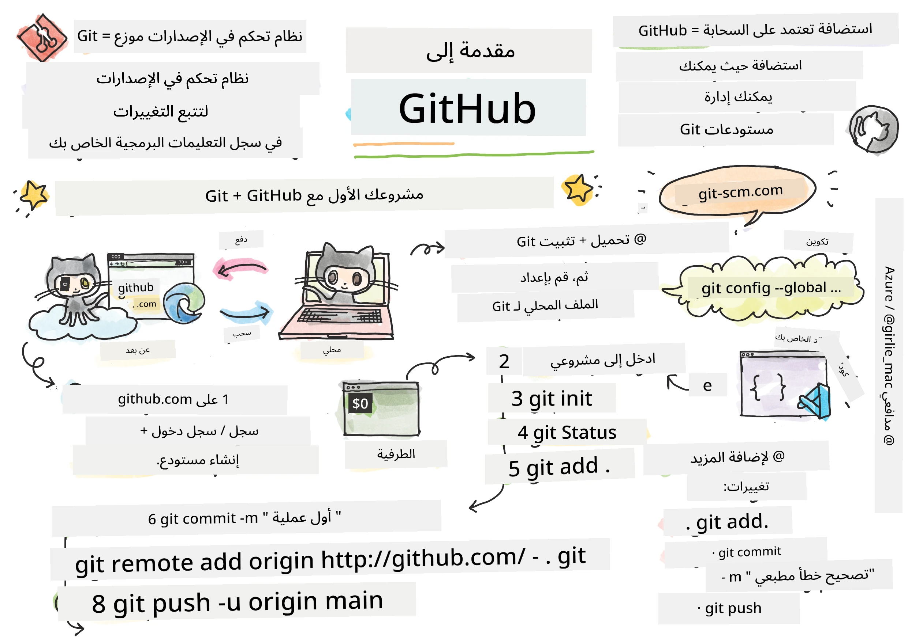
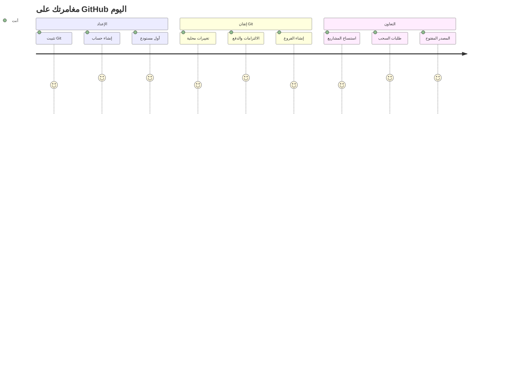
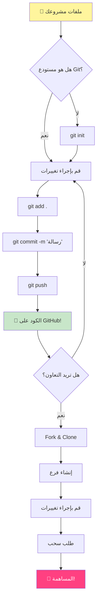
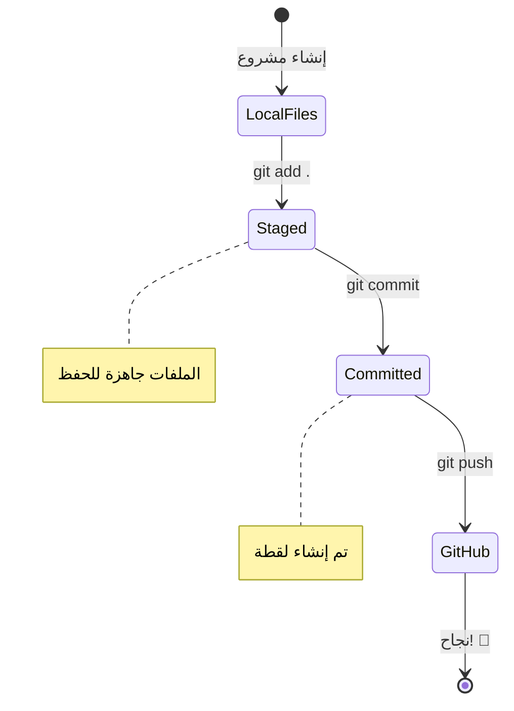
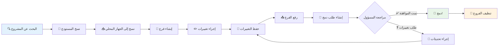
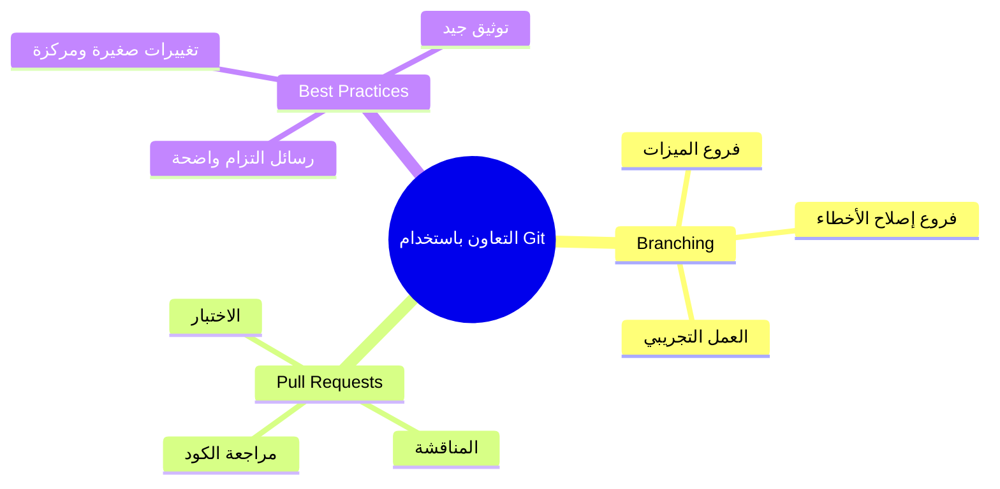
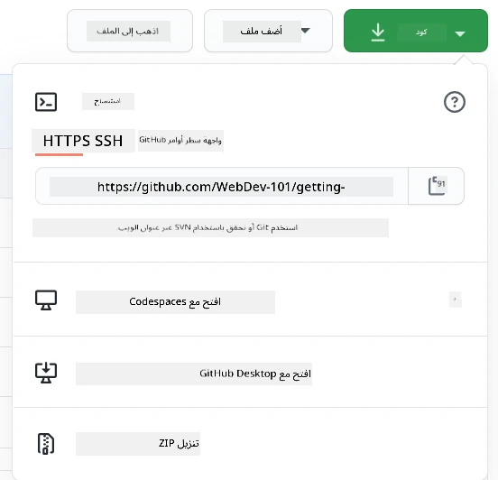
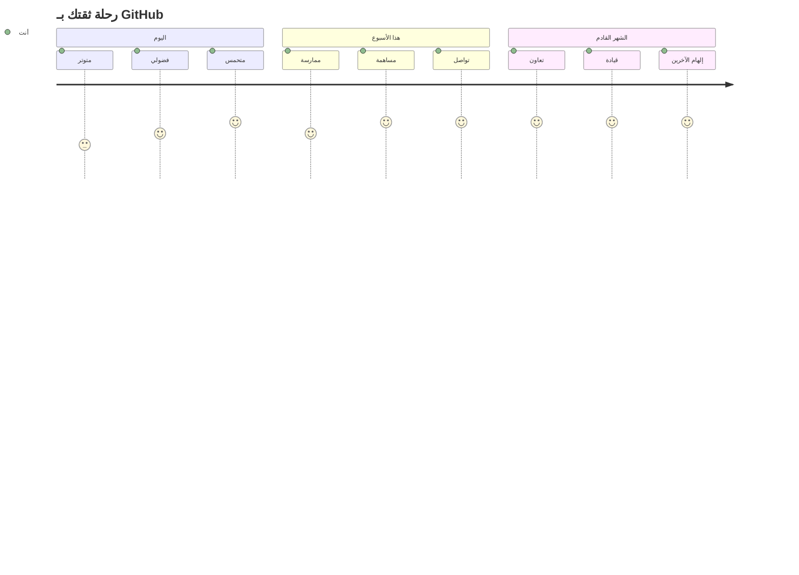

<!--
CO_OP_TRANSLATOR_METADATA:
{
  "original_hash": "5c383cc2cc23bb164b06417d1c107a44",
  "translation_date": "2025-11-25T11:44:30+00:00",
  "source_file": "1-getting-started-lessons/2-github-basics/README.md",
  "language_code": "ar"
}
-->
# مقدمة إلى GitHub

مرحبًا بك، أيها المطور المستقبلي! 👋 هل أنت مستعد للانضمام إلى ملايين المبرمجين حول العالم؟ أنا متحمس جدًا لتعريفك بـ GitHub – فكر فيه كأنه منصة التواصل الاجتماعي للمبرمجين، ولكن بدلاً من مشاركة صور الغداء، نحن نشارك الأكواد ونبني أشياء مذهلة معًا!

ما يدهشني حقًا هو أن كل تطبيق على هاتفك، وكل موقع تزوره، ومعظم الأدوات التي ستتعلم استخدامها تم بناؤها بواسطة فرق من المطورين الذين يتعاونون على منصات مثل GitHub. تطبيق الموسيقى الذي تحبه؟ شخص مثلك ساهم فيه. اللعبة التي لا تستطيع التوقف عن لعبها؟ نعم، ربما تم بناؤها بالتعاون عبر GitHub. والآن ستتعلم كيف تكون جزءًا من هذا المجتمع الرائع!

أعلم أن هذا قد يبدو كثيرًا في البداية – أذكر تمامًا عندما نظرت لأول مرة إلى صفحة GitHub الخاصة بي وقلت "ما هذا بحق السماء؟". ولكن إليك الأمر: كل مطور بدأ تمامًا من حيث أنت الآن. بنهاية هذا الدرس، سيكون لديك مستودع GitHub خاص بك (فكر فيه كأنه معرض مشاريعك الشخصي في السحابة)، وستعرف كيف تحفظ عملك، وتشاركه مع الآخرين، وحتى تساهم في مشاريع يستخدمها الملايين.

سنخوض هذه الرحلة معًا، خطوة بخطوة. لا استعجال، لا ضغط – فقط أنت وأنا وبعض الأدوات الرائعة التي ستصبح أصدقائك الجدد!


> رسم توضيحي بواسطة [Tomomi Imura](https://twitter.com/girlie_mac)


## اختبار ما قبل المحاضرة
[اختبار ما قبل المحاضرة](https://ff-quizzes.netlify.app)

## المقدمة

قبل أن نغوص في الأمور المثيرة حقًا، دعنا نجهز جهاز الكمبيوتر الخاص بك لبعض السحر مع GitHub! فكر في هذا كأنه تنظيم أدواتك الفنية قبل إنشاء تحفة فنية – وجود الأدوات المناسبة يجعل كل شيء أكثر سلاسة ومتعة.

سأرشدك شخصيًا خلال كل خطوة من خطوات الإعداد، وأعدك أن الأمر ليس مخيفًا كما قد يبدو للوهلة الأولى. إذا لم تفهم شيئًا على الفور، فهذا طبيعي تمامًا! أذكر تمامًا عندما كنت أعد بيئة التطوير الأولى لي وشعرت وكأنني أحاول قراءة رموز هيروغليفية قديمة. كل مطور مر بنفس ما تمر به الآن، متسائلًا إذا كان يفعل ذلك بشكل صحيح. تنبيه: إذا كنت هنا تتعلم، فأنت بالفعل تفعل ذلك بشكل صحيح! 🌟

في هذا الدرس، سنتناول:

- تتبع العمل الذي تقوم به على جهازك
- العمل على المشاريع مع الآخرين
- كيفية المساهمة في البرمجيات مفتوحة المصدر

### المتطلبات الأساسية

دعنا نجهز جهاز الكمبيوتر الخاص بك لبعض السحر مع GitHub! لا تقلق – هذا الإعداد شيء تحتاج إلى القيام به مرة واحدة فقط، وبعدها ستكون جاهزًا طوال رحلتك البرمجية.

حسنًا، لنبدأ بالأساسيات! أولاً، نحتاج إلى التحقق مما إذا كان Git مثبتًا بالفعل على جهازك. Git يشبه وجود مساعد ذكي جدًا يتذكر كل تغيير تقوم به في الكود الخاص بك – أفضل بكثير من الضغط على Ctrl+S كل ثانيتين (كلنا مررنا بذلك!).

دعنا نرى ما إذا كان Git مثبتًا بالفعل عن طريق كتابة هذا الأمر السحري في الطرفية:
`git --version`

إذا لم يكن Git مثبتًا بعد، لا تقلق! فقط توجه إلى [تنزيل Git](https://git-scm.com/downloads) وقم بتحميله. بمجرد تثبيته، نحتاج إلى تعريف Git بك بشكل صحيح:

> 💡 **الإعداد لأول مرة**: هذه الأوامر تخبر Git من أنت. سيتم إرفاق هذه المعلومات بكل عملية حفظ تقوم بها، لذا اختر اسمًا وبريدًا إلكترونيًا تشعر بالراحة في مشاركتهما علنًا.

```bash
git config --global user.name "your-name"
git config --global user.email "your-email"
```

للتحقق مما إذا كان Git قد تم تكوينه بالفعل، يمكنك كتابة:
```bash
git config --list
```

ستحتاج أيضًا إلى حساب GitHub، ومحرر أكواد (مثل Visual Studio Code)، وستحتاج إلى فتح الطرفية (أو: موجه الأوامر).

توجه إلى [github.com](https://github.com/) وأنشئ حسابًا إذا لم تكن قد فعلت ذلك بالفعل، أو قم بتسجيل الدخول واملأ ملفك الشخصي.

💡 **نصيحة حديثة**: فكر في إعداد [مفاتيح SSH](https://docs.github.com/en/authentication/connecting-to-github-with-ssh) أو استخدام [GitHub CLI](https://cli.github.com/) لتسهيل المصادقة بدون كلمات مرور.

✅ GitHub ليس مستودع الأكواد الوحيد في العالم؛ هناك آخرون، ولكن GitHub هو الأكثر شهرة.

### التحضير

ستحتاج إلى مجلد يحتوي على مشروع كود على جهازك المحلي (الكمبيوتر المحمول أو الكمبيوتر الشخصي)، ومستودع عام على GitHub، والذي سيعمل كمثال على كيفية المساهمة في مشاريع الآخرين.

### الحفاظ على أمان الكود الخاص بك

دعنا نتحدث عن الأمان للحظة – ولكن لا تقلق، لن نثقل عليك بأشياء مخيفة! فكر في هذه الممارسات الأمنية كأنها قفل سيارتك أو منزلك. إنها عادات بسيطة تصبح طبيعية وتحافظ على عملك الشاق محميًا.

سنوضح لك الطرق الحديثة والآمنة للعمل مع GitHub منذ البداية. بهذه الطريقة، ستطور عادات جيدة ستخدمك طوال مسيرتك البرمجية.

عند العمل مع GitHub، من المهم اتباع أفضل الممارسات الأمنية:

| مجال الأمان | أفضل ممارسة | لماذا هو مهم |
|-------------|-------------|---------------|
| **المصادقة** | استخدم مفاتيح SSH أو رموز الوصول الشخصية | كلمات المرور أقل أمانًا ويتم التخلص منها تدريجيًا |
| **المصادقة الثنائية** | قم بتمكين المصادقة الثنائية (2FA) على حساب GitHub الخاص بك | تضيف طبقة إضافية من الحماية للحساب |
| **أمان المستودع** | لا تقم أبدًا بحفظ معلومات حساسة | لا يجب أن تكون مفاتيح API وكلمات المرور في المستودعات العامة |
| **إدارة التبعيات** | قم بتمكين Dependabot للتحديثات | يحافظ على تبعياتك آمنة ومحدثة |

> ⚠️ **تذكير أمني حرج**: لا تقم أبدًا بحفظ مفاتيح API أو كلمات المرور أو أي معلومات حساسة في أي مستودع. استخدم المتغيرات البيئية وملفات `.gitignore` لحماية البيانات الحساسة.

**إعداد المصادقة الحديثة:**

```bash
# إنشاء مفتاح SSH (خوارزمية ed25519 الحديثة)
ssh-keygen -t ed25519 -C "your_email@example.com"

# إعداد Git لاستخدام SSH
git remote set-url origin git@github.com:username/repository.git
```

> 💡 **نصيحة احترافية**: مفاتيح SSH تلغي الحاجة إلى إدخال كلمات المرور بشكل متكرر وهي أكثر أمانًا من طرق المصادقة التقليدية.

---

## إدارة الكود الخاص بك كالمحترفين

حسنًا، هنا تبدأ الأمور تصبح مثيرة حقًا! 🎉 نحن على وشك تعلم كيفية تتبع وإدارة الكود الخاص بك مثل المحترفين، وبصراحة، هذا أحد الأشياء المفضلة لدي لتعليمها لأنه يغير اللعبة تمامًا.

تخيل هذا: أنت تكتب قصة مذهلة، وتريد تتبع كل مسودة، وكل تعديل رائع، وكل لحظة "انتظر، هذا عبقري!" على طول الطريق. هذا بالضبط ما يفعله Git لكودك! إنه مثل وجود دفتر ملاحظات مذهل يسافر عبر الزمن ويتذكر كل شيء – كل ضغطة مفتاح، كل تغيير، كل لحظة "أوه، هذا كسر كل شيء" التي يمكنك التراجع عنها فورًا.

سأكون صادقًا – قد يبدو هذا مربكًا في البداية. عندما بدأت، كنت أفكر "لماذا لا يمكنني فقط حفظ ملفاتي كالمعتاد؟" ولكن ثق بي في هذا: بمجرد أن تفهم Git (وستفهمه!)، ستحصل على تلك اللحظة التي تقول فيها "كيف كنت أبرمج بدون هذا؟" إنه مثل اكتشاف أنك تستطيع الطيران بعد أن كنت تمشي في كل مكان طوال حياتك!

لنفترض أن لديك مجلدًا محليًا يحتوي على مشروع كود وتريد البدء في تتبع تقدمك باستخدام git - نظام التحكم في الإصدارات. بعض الناس يقارنون استخدام git بكتابة رسالة حب لنفسك المستقبلية. عند قراءة رسائل الالتزام الخاصة بك بعد أيام أو أسابيع أو أشهر، ستتمكن من تذكر سبب اتخاذك لقرار معين، أو "التراجع" عن تغيير – هذا إذا كتبت رسائل "التزام" جيدة.


### المهمة: إنشاء مستودعك الأول!

> 🎯 **مهمتك (وأنا متحمس جدًا لك!)**: سنقوم بإنشاء مستودع GitHub الأول الخاص بك معًا! بحلول الوقت الذي ننتهي فيه هنا، سيكون لديك ركن صغير خاص بك على الإنترنت حيث يعيش كودك، وستكون قد قمت بأول "التزام" (هذا مصطلح المطورين لحفظ عملك بطريقة ذكية جدًا).
>
> هذه لحظة خاصة جدًا – أنت على وشك الانضمام رسميًا إلى مجتمع المطورين العالمي! ما زلت أتذكر الإثارة عند إنشاء المستودع الأول لي والتفكير "واو، أنا أفعل هذا حقًا!"

دعنا نسير في هذه المغامرة معًا، خطوة بخطوة. خذ وقتك مع كل جزء – لا توجد جائزة للاستعجال، وأعدك أن كل خطوة ستصبح منطقية. تذكر، كل نجم برمجي تعجب به كان يجلس يومًا ما بالضبط حيث أنت الآن، على وشك إنشاء مستودعه الأول. كم هذا رائع؟

> شاهد الفيديو
> 
> [](https://www.youtube.com/watch?v=9R31OUPpxU4)

**لنقم بذلك معًا:**

1. **إنشاء مستودعك على GitHub**. توجه إلى GitHub.com وابحث عن الزر الأخضر اللامع **New** (أو علامة **+** في الزاوية العلوية اليمنى). انقر عليه واختر **New repository**.

   إليك ما يجب فعله:
   1. امنح مستودعك اسمًا – اجعله شيئًا ذا معنى بالنسبة لك!
   1. أضف وصفًا إذا أردت (هذا يساعد الآخرين على فهم مشروعك)
   1. قرر ما إذا كنت تريده عامًا (يمكن للجميع رؤيته) أو خاصًا (فقط لك)
   1. أوصي بتحديد المربع لإضافة ملف README – إنه مثل الصفحة الأمامية لمشروعك
   1. انقر على **Create repository** واحتفل – لقد أنشأت مستودعك الأول! 🎉

2. **انتقل إلى مجلد مشروعك**. الآن دعنا نفتح الطرفية (لا تقلق، ليست مخيفة كما تبدو!). نحتاج إلى إخبار جهاز الكمبيوتر الخاص بك بمكان ملفات مشروعك. اكتب هذا الأمر:

   ```bash
   cd [name of your folder]
   ```

   **ما الذي نفعله هنا:**
   - نحن نقول لجهاز الكمبيوتر "مرحبًا، خذني إلى مجلد مشروعي"
   - هذا يشبه فتح مجلد معين على سطح المكتب، ولكننا نقوم بذلك باستخدام أوامر نصية
   - استبدل `[name of your folder]` باسم مجلد مشروعك الفعلي

3. **حوّل مجلدك إلى مستودع Git**. هنا يحدث السحر! اكتب:

   ```bash
   git init
   ```

   **ما الذي حدث للتو (أشياء رائعة جدًا!):**
   - قام Git بإنشاء مجلد مخفي `.git` في مشروعك – لن تراه، لكنه موجود!
   - أصبح مجلدك العادي الآن "مستودعًا" يمكنه تتبع كل تغيير تقوم به
   - فكر فيه كأنه يمنح مجلدك قوى خارقة لتذكر كل شيء

4. **تحقق مما يحدث**. دعنا نرى ما الذي يعتقده Git عن مشروعك الآن:

   ```bash
   git status
   ```

   **فهم ما يقوله Git:**
   
   قد ترى شيئًا يبدو كهذا:

   ```output
   Changes not staged for commit:
   (use "git add <file>..." to update what will be committed)
   (use "git restore <file>..." to discard changes in working directory)

        modified:   file.txt
        modified:   file2.txt
   ```

   **لا تقلق! هذا ما يعنيه:**
   - الملفات باللون **الأحمر** هي ملفات بها تغييرات لكنها ليست جاهزة للحفظ بعد
   - الملفات باللون **الأخضر** (عندما تراها) جاهزة للحفظ
   - Git يساعدك بإخبارك بالضبط بما يمكنك فعله بعد ذلك

   > 💡 **نصيحة احترافية**: أمر `git status` هو أفضل صديق لك! استخدمه في أي وقت تشعر فيه بالارتباك بشأن ما يحدث. إنه مثل سؤال Git "مرحبًا، ما الوضع الآن؟"

5. **جهّز ملفاتك للحفظ** (هذا يسمى "التجهيز"):

   ```bash
   git add .
   ```

   **ما الذي فعلناه للتو:**
   - أخبرنا Git "مرحبًا، أريد تضمين جميع ملفاتي في الحفظ التالي"
   - النقطة `.` تعني "كل شيء في هذا المجلد"
   - الآن ملفاتك "جاهزة" للخطوة التالية

   **هل تريد أن تكون أكثر انتقائية؟** يمكنك إضافة ملفات محددة فقط:

   ```bash
   git add [file or folder name]
   ```

   **لماذا قد ترغب في فعل ذلك؟**
   - أحيانًا تريد حفظ تغييرات ذات صلة معًا
   - يساعدك على تنظيم عملك في أجزاء منطقية
   - يجعل من السهل فهم ما تغير ومتى

   **غيرت رأيك؟** لا تقلق! يمكنك إزالة الملفات من التجهيز مثل هذا:

   ```bash
   # إلغاء تحديد كل شيء
   git reset
   
   # إلغاء تحديد ملف واحد فقط
   git reset [file name]
   ```

   لا تقلق – هذا لا يحذف عملك، فقط يخرج الملفات من "جاهزة للحفظ".

6. **احفظ عملك بشكل دائم** (قم بأول التزام لك!):

   ```bash
   git commit -m "first commit"
   ```

   **🎉 تهانينا! لقد قمت بأول التزام لك!**
   
   **ما الذي حدث للتو:**
   - أخذ Git "لقطة" لجميع الملفات الجاهزة في هذه اللحظة بالضبط
   - رسالة الالتزام "first commit" تشرح ما هو هذا الحفظ
   - أعطى Git هذه اللقطة معرفًا فريدًا حتى تتمكن دائمًا من العثور عليها لاحقًا
   - لقد بدأت رسميًا في تتبع تاريخ مشروعك!

   > 💡 **رسائل الالتزام المستقبلية**: بالنسبة لالتزاماتك القادمة، كن أكثر وصفًا! بدلاً من "تحديث الأشياء"، جرب "إضافة نموذج الاتصال إلى الصفحة الرئيسية" أو "إصلاح خطأ في قائمة التنقل". نفسك المستقبلية ستشكرك!

7. **اربط مشروعك المحلي بـ GitHub**. الآن، مشروعك موجود فقط على جهاز الكمبيوتر الخاص بك. دعنا نربطه بمستودع GitHub الخاص بك حتى تتمكن من مشاركته مع العالم!

   أولاً، انتقل إلى صفحة مستودع GitHub الخاص بك ونسخ عنوان URL. ثم عد إلى هنا واكتب:

   ```bash
   git remote add origin https://github.com/username/repository_name.git
   ```
   
   (استبدل هذا العنوان بعنوان مستودعك الفعلي!)

   **ما الذي فعلناه للتو:**
   - قمنا بإنشاء اتصال بين مشروعك المحلي ومستودع GitHub الخاص بك.
   - "Origin" هو مجرد اسم مستعار لمستودع GitHub الخاص بك – يشبه إضافة جهة اتصال إلى هاتفك.
   - الآن يعرف Git المحلي الخاص بك أين يرسل الكود الخاص بك عندما تكون جاهزًا لمشاركته.

   💡 **طريقة أسهل**: إذا كان لديك GitHub CLI مثبتًا، يمكنك القيام بذلك بأمر واحد:
   ```bash
   gh repo create my-repo --public --push --source=.
   ```

8. **أرسل الكود الخاص بك إلى GitHub** (اللحظة الكبيرة!):

   ```bash
   git push -u origin main
   ```

   **🚀 هذه هي اللحظة! أنت تقوم برفع الكود الخاص بك إلى GitHub!**
   
   **ما الذي يحدث:**
   - التغييرات التي قمت بها تنتقل من جهاز الكمبيوتر الخاص بك إلى GitHub.
   - العلم `-u` يقوم بإعداد اتصال دائم لتسهيل عمليات الدفع المستقبلية.
   - "main" هو اسم الفرع الأساسي الخاص بك (مثل المجلد الرئيسي).
   - بعد ذلك، يمكنك فقط كتابة `git push` للرفع في المستقبل!

   💡 **ملاحظة سريعة**: إذا كان اسم الفرع الخاص بك مختلفًا (مثل "master")، استخدم ذلك الاسم. يمكنك التحقق باستخدام `git branch --show-current`.

9. **إيقاعك اليومي الجديد في البرمجة** (هنا يصبح الأمر ممتعًا!):

   من الآن فصاعدًا، كلما أجريت تغييرات على مشروعك، لديك هذه الخطوات الثلاثة البسيطة:

   ```bash
   git add .
   git commit -m "describe what you changed"
   git push
   ```

   **هذا يصبح نبض البرمجة الخاص بك:**
   - قم بإجراء تغييرات رائعة على الكود الخاص بك ✨
   - قم بتجهيزها باستخدام `git add` ("مرحبًا Git، انتبه لهذه التغييرات!")
   - احفظها باستخدام `git commit` ورسالة وصفية (ستشكر نفسك في المستقبل!)
   - شاركها مع العالم باستخدام `git push` 🚀
   - كرر العملية – بجدية، هذا يصبح طبيعيًا مثل التنفس!

   أحب هذا الأسلوب لأنه يشبه وجود نقاط حفظ متعددة في لعبة فيديو. أجريت تغييرًا تحبه؟ قم بحفظه! تريد تجربة شيء محفوف بالمخاطر؟ لا مشكلة – يمكنك دائمًا العودة إلى آخر حفظ إذا حدثت مشكلة!

   > 💡 **نصيحة**: قد ترغب أيضًا في اعتماد ملف `.gitignore` لمنع ظهور الملفات التي لا تريد تتبعها على GitHub - مثل ملف الملاحظات الذي تخزنه في نفس المجلد ولكنه ليس له مكان في مستودع عام. يمكنك العثور على قوالب لملفات `.gitignore` في [.gitignore templates](https://github.com/github/gitignore) أو إنشاء واحد باستخدام [gitignore.io](https://www.toptal.com/developers/gitignore).

### 🧠 **أول تسجيل في المستودع: كيف كان الشعور؟**

**خذ لحظة للاحتفال والتفكير:**
- كيف كان شعورك عندما رأيت الكود الخاص بك يظهر على GitHub لأول مرة؟
- أي خطوة شعرت بأنها الأكثر إرباكًا، وأي خطوة كانت سهلة بشكل مفاجئ؟
- هل يمكنك شرح الفرق بين `git add`، `git commit`، و `git push` بكلماتك الخاصة؟


> **تذكر**: حتى المطورين ذوي الخبرة ينسون أحيانًا الأوامر الدقيقة. جعل هذا الأسلوب يصبح ذاكرة عضلية يتطلب ممارسة - أنت تقوم بعمل رائع!

#### أساليب Git الحديثة

فكر في تبني هذه الممارسات الحديثة:

- **التزامات تقليدية**: استخدم صيغة موحدة لرسائل الالتزام مثل `feat:`، `fix:`، `docs:`، إلخ. تعرف على المزيد في [conventionalcommits.org](https://www.conventionalcommits.org/)
- **التزامات ذرية**: اجعل كل التزام يمثل تغييرًا منطقيًا واحدًا.
- **التزامات متكررة**: قم بالالتزام بشكل متكرر مع رسائل وصفية بدلاً من الالتزامات الكبيرة وغير المتكررة.

#### رسائل الالتزام

سطر موضوع الالتزام الجيد يكمل الجملة التالية:
إذا تم تطبيقه، هذا الالتزام سوف <سطر الموضوع الخاص بك هنا>

بالنسبة للموضوع، استخدم صيغة الأمر، الزمن الحاضر: "تغيير" وليس "تم تغييره" ولا "تغييرات". كما هو الحال في الموضوع، في النص (اختياري) أيضًا استخدم صيغة الأمر، الزمن الحاضر. يجب أن يتضمن النص الدافع للتغيير ويقارن ذلك بالسلوك السابق. أنت تشرح "لماذا"، وليس "كيف".

✅ خذ بضع دقائق لتصفح GitHub. هل يمكنك العثور على رسالة التزام رائعة حقًا؟ هل يمكنك العثور على واحدة بسيطة جدًا؟ ما المعلومات التي تعتقد أنها الأكثر أهمية وفائدة لتوصيلها في رسالة الالتزام؟

## العمل مع الآخرين (الجزء الممتع!)

تمسك بقبعتك لأن هذا هو المكان الذي يصبح فيه GitHub سحريًا تمامًا! 🪄 لقد أتقنت إدارة الكود الخاص بك، ولكن الآن نحن نغوص في الجزء المفضل لدي – التعاون مع أشخاص رائعين من جميع أنحاء العالم.

تخيل هذا: تستيقظ غدًا وترى أن شخصًا في طوكيو قام بتحسين الكود الخاص بك أثناء نومك. ثم شخص في برلين يصلح خطأ كنت عالقًا فيه. بحلول فترة الظهيرة، مطور في ساو باولو أضاف ميزة لم تفكر فيها حتى. هذا ليس خيال علمي – هذا مجرد يوم عادي في عالم GitHub!

ما يجعلني متحمسًا حقًا هو أن مهارات التعاون التي ستتعلمها؟ هذه هي نفس الأساليب التي تستخدمها الفرق في Google، Microsoft، والشركات الناشئة المفضلة لديك كل يوم. أنت لا تتعلم مجرد أداة رائعة – أنت تتعلم اللغة السرية التي تجعل عالم البرمجيات بأكمله يعمل معًا.

بجدية، بمجرد أن تجرب شعور دمج أول طلب سحب لك، ستفهم لماذا يصبح المطورون متحمسين جدًا للمصدر المفتوح. إنه مثل أن تكون جزءًا من أكبر مشروع فريق إبداعي في العالم!

> شاهد الفيديو
>
> [](https://www.youtube.com/watch?v=bFCM-PC3cu8)

السبب الرئيسي لوضع الأشياء على GitHub هو جعل التعاون مع المطورين الآخرين ممكنًا.


في مستودعك، انتقل إلى `Insights > Community` لترى كيف يقارن مشروعك بمعايير المجتمع الموصى بها.

هل تريد جعل مستودعك يبدو احترافيًا ومرحبًا؟ توجه إلى مستودعك وانقر على `Insights > Community`. هذه الميزة الرائعة تظهر لك كيف يقارن مشروعك بما يعتبره مجتمع GitHub "ممارسات مستودع جيدة".

> 🎯 **جعل مشروعك يلمع**: مستودع منظم جيدًا مع وثائق جيدة يشبه وجود واجهة متجر نظيفة ومرحبة. إنه يخبر الناس أنك تهتم بعملك ويجعل الآخرين يرغبون في المساهمة!

**إليك ما يجعل المستودع رائعًا:**

| ما يجب إضافته | لماذا هو مهم | ماذا يفعل لك |
|-------------|-------------------|---------------------|
| **الوصف** | الانطباع الأول مهم! | يعرف الناس فورًا ما يفعله مشروعك |
| **README** | الصفحة الرئيسية لمشروعك | مثل دليل سياحي ودود للزوار الجدد |
| **إرشادات المساهمة** | يظهر أنك ترحب بالمساعدة | يعرف الناس بالضبط كيف يمكنهم مساعدتك |
| **مدونة السلوك** | يخلق مساحة ودية | يشعر الجميع بالترحيب للمشاركة |
| **الرخصة** | وضوح قانوني | يعرف الآخرون كيف يمكنهم استخدام الكود الخاص بك |
| **سياسة الأمان** | يظهر أنك مسؤول | يوضح ممارسات احترافية |

> 💡 **نصيحة احترافية**: يوفر GitHub قوالب لجميع هذه الملفات. عند إنشاء مستودع جديد، تحقق من المربعات لإنشاء هذه الملفات تلقائيًا.

**ميزات GitHub الحديثة لاستكشافها:**

🤖 **الأتمتة وCI/CD:**
- **GitHub Actions** للاختبار والنشر التلقائي.
- **Dependabot** لتحديث التبعيات تلقائيًا.

💬 **المجتمع وإدارة المشاريع:**
- **GitHub Discussions** للمحادثات المجتمعية خارج نطاق القضايا.
- **GitHub Projects** لإدارة المشاريع بأسلوب كانبان.
- **قواعد حماية الفروع** لفرض معايير جودة الكود.

كل هذه الموارد ستفيد في استقبال أعضاء الفريق الجدد. وهذه هي عادةً الأشياء التي ينظر إليها المساهمون الجدد قبل حتى النظر إلى الكود الخاص بك، لمعرفة ما إذا كان مشروعك هو المكان المناسب لقضاء وقتهم.

✅ ملفات README، على الرغم من أنها تستغرق وقتًا للإعداد، غالبًا ما يتم تجاهلها من قبل المسؤولين المشغولين. هل يمكنك العثور على مثال لواحد وصفي بشكل خاص؟ ملاحظة: هناك بعض [الأدوات التي تساعد في إنشاء ملفات README جيدة](https://www.makeareadme.com/) قد ترغب في تجربتها.

### المهمة: دمج بعض الكود

تساعد وثائق المساهمة الأشخاص على المساهمة في المشروع. إنها تشرح أنواع المساهمات التي تبحث عنها وكيفية عمل العملية. سيحتاج المساهمون إلى المرور بسلسلة من الخطوات ليتمكنوا من المساهمة في مستودعك على GitHub:

1. **تفرع مستودعك** ربما تريد أن يقوم الناس بـ _تفرع_ مشروعك. التفرع يعني إنشاء نسخة من مستودعك على ملف تعريف GitHub الخاص بهم.
1. **الاستنساخ**. من هناك سيقومون باستنساخ المشروع إلى جهازهم المحلي.
1. **إنشاء فرع**. سترغب في أن تطلب منهم إنشاء _فرع_ لعملهم.
1. **تركيز التغيير على منطقة واحدة**. اطلب من المساهمين التركيز على مساهماتهم في شيء واحد في كل مرة - بهذه الطريقة تكون فرص أن تتمكن من _دمج_ عملهم أعلى. تخيل أنهم كتبوا إصلاح خطأ، أضافوا ميزة جديدة، وقاموا بتحديث عدة اختبارات - ماذا لو كنت تريد، أو يمكنك فقط تنفيذ 2 من 3، أو 1 من 3 تغييرات؟

✅ تخيل موقفًا تكون فيه الفروع ضرورية بشكل خاص لكتابة وشحن كود جيد. ما هي حالات الاستخدام التي يمكنك التفكير فيها؟

> ملاحظة، كن التغيير الذي تريد رؤيته في العالم، وقم بإنشاء فروع لعملك الخاص أيضًا. أي التزامات تقوم بها سيتم تنفيذها على الفرع الذي "تم التحقق منه" حاليًا. استخدم `git status` لمعرفة أي فرع هو.

لنمر عبر سير عمل المساهم. افترض أن المساهم قد قام بالفعل بـ _تفرع_ و _استنساخ_ المستودع بحيث يكون لديه مستودع Git جاهز للعمل عليه، على جهازه المحلي:

1. **إنشاء فرع**. استخدم الأمر `git branch` لإنشاء فرع يحتوي على التغييرات التي يعتزم المساهمة بها:

   ```bash
   git branch [branch-name]
   ```

   > 💡 **النهج الحديث**: يمكنك أيضًا إنشاء والتبديل إلى الفرع الجديد في أمر واحد:
   ```bash
   git switch -c [branch-name]
   ```

1. **التبديل إلى فرع العمل**. قم بالتبديل إلى الفرع المحدد وقم بتحديث الدليل العامل باستخدام `git switch`:

   ```bash
   git switch [branch-name]
   ```

   > 💡 **ملاحظة حديثة**: `git switch` هو البديل الحديث لـ `git checkout` عند تغيير الفروع. إنه أكثر وضوحًا وأمانًا للمبتدئين.

1. **قم بالعمل**. في هذه المرحلة تريد إضافة تغييراتك. لا تنس إخبار Git بذلك باستخدام الأوامر التالية:

   ```bash
   git add .
   git commit -m "my changes"
   ```

   > ⚠️ **جودة رسالة الالتزام**: تأكد من إعطاء الالتزام اسمًا جيدًا، سواء من أجلك أو من أجل المسؤول عن المستودع الذي تساعد فيه. كن محددًا بشأن ما قمت بتغييره!

1. **دمج عملك مع فرع `main`**. في مرحلة ما تكون قد انتهيت من العمل وتريد دمج عملك مع عمل فرع `main`. قد يكون فرع `main` قد تغير في هذه الأثناء لذا تأكد من تحديثه أولاً إلى الأحدث باستخدام الأوامر التالية:

   ```bash
   git switch main
   git pull
   ```

   في هذه المرحلة تريد التأكد من أن أي _تعارضات_، حالات حيث لا يمكن لـ Git بسهولة _دمج_ التغييرات تحدث في فرع العمل الخاص بك. لذلك قم بتشغيل الأوامر التالية:

   ```bash
   git switch [branch_name]
   git merge main
   ```

   الأمر `git merge main` سيجلب جميع التغييرات من `main` إلى فرعك. نأمل أن تتمكن من المتابعة فقط. إذا لم يكن الأمر كذلك، سيخبرك VS Code بالمكان الذي يكون فيه Git _مرتبكًا_ وتقوم فقط بتعديل الملفات المتأثرة لتحديد أي محتوى هو الأكثر دقة.

   💡 **بديل حديث**: فكر في استخدام `git rebase` للحصول على تاريخ أنظف:
   ```bash
   git rebase main
   ```
   هذا يعيد تشغيل التزاماتك على أحدث فرع رئيسي، مما يخلق تاريخًا خطيًا.

1. **أرسل عملك إلى GitHub**. إرسال عملك إلى GitHub يعني شيئين. دفع فرعك إلى مستودعك ثم فتح طلب سحب.

   ```bash
   git push --set-upstream origin [branch-name]
   ```

   الأمر أعلاه ينشئ الفرع على مستودعك المتفرع.

### 🤝 **فحص مهارات التعاون: هل أنت جاهز للعمل مع الآخرين؟**

**لنرى كيف تشعر بشأن التعاون:**
- هل فكرة التفرع وطلبات السحب أصبحت منطقية بالنسبة لك الآن؟
- ما هو الشيء الوحيد حول العمل مع الفروع الذي تريد ممارسته أكثر؟
- ما مدى شعورك بالراحة بشأن المساهمة في مشروع شخص آخر؟


> **معزز الثقة**: كل مطور تعجب به كان يومًا ما متوترًا بشأن أول طلب سحب له. مجتمع GitHub مرحب جدًا بالمبتدئين!

1. **افتح طلب سحب**. بعد ذلك، تريد فتح طلب سحب. تقوم بذلك عن طريق الانتقال إلى المستودع المتفرع على GitHub. سترى مؤشرًا على GitHub حيث يسألك ما إذا كنت تريد إنشاء طلب سحب جديد، تنقر على ذلك ويتم نقلك إلى واجهة حيث يمكنك تغيير عنوان رسالة الالتزام، وإعطائها وصفًا أكثر ملاءمة. الآن سيرى المسؤول عن المستودع الذي قمت بتفرعه هذا الطلب و _أصابعك متقاطعة_ سيقدر ويقوم بـ _دمج_ طلب السحب الخاص بك. أنت الآن مساهم، ياي :)

   💡 **نصيحة حديثة**: يمكنك أيضًا إنشاء طلبات السحب باستخدام GitHub CLI:
   ```bash
   gh pr create --title "Your PR title" --body "Description of changes"
   ```

   🔧 **أفضل الممارسات لطلبات السحب**:
   - قم بربط القضايا ذات الصلة باستخدام كلمات مثل "Fixes #123".
   - أضف لقطات شاشة للتغييرات في واجهة المستخدم.
   - اطلب مراجعين محددين.
   - استخدم طلبات السحب المؤقتة للعمل الجاري.
   - تأكد من اجتياز جميع فحوصات CI قبل طلب المراجعة.
1. **تنظيف العمل**. يُعتبر من الممارسات الجيدة أن تقوم بـ _تنظيف العمل_ بعد دمج طلب السحب (PR) بنجاح. يجب عليك تنظيف كل من الفرع المحلي والفرع الذي قمت بدفعه إلى GitHub. أولاً، لنقم بحذفه محليًا باستخدام الأمر التالي:

   ```bash
   git branch -d [branch-name]
   ```

   تأكد من الذهاب إلى صفحة GitHub الخاصة بالمستودع المتشعب بعد ذلك وإزالة الفرع البعيد الذي قمت بدفعه إليه.

`طلب السحب` قد يبدو مصطلحًا غريبًا لأنه في الواقع تريد دفع تغييراتك إلى المشروع. ولكن المالك (صاحب المشروع) أو الفريق الأساسي يحتاج إلى مراجعة تغييراتك قبل دمجها مع الفرع "الرئيسي" للمشروع، لذا فأنت في الحقيقة تطلب قرارًا بشأن التغيير من المالك.

طلب السحب هو المكان الذي يتم فيه مقارنة ومناقشة الفروقات التي تم إدخالها على فرع معين مع المراجعات، التعليقات، الاختبارات المدمجة، والمزيد. طلب السحب الجيد يتبع تقريبًا نفس قواعد رسالة الالتزام. يمكنك إضافة مرجع إلى مشكلة في متتبع القضايا، عندما تقوم مثلاً بحل مشكلة. يتم ذلك باستخدام `#` متبوعًا برقم المشكلة. على سبيل المثال `#97`.

🤞نتمنى أن تمر جميع الفحوصات بنجاح وأن يقوم مالك المشروع بدمج تغييراتك في المشروع🤞

قم بتحديث الفرع المحلي الحالي بجميع الالتزامات الجديدة من الفرع البعيد المقابل على GitHub:

`git pull`

## المساهمة في المصادر المفتوحة (فرصتك لإحداث تأثير!)

هل أنت مستعد لشيء سيذهلك تمامًا؟ 🤯 دعنا نتحدث عن المساهمة في مشاريع المصادر المفتوحة – وأنا أشعر بالقشعريرة فقط من التفكير في مشاركتها معك!

هذه فرصتك لتكون جزءًا من شيء استثنائي حقًا. تخيل تحسين الأدوات التي يستخدمها ملايين المطورين يوميًا، أو إصلاح خطأ في تطبيق يحبه أصدقاؤك. هذا ليس مجرد حلم – هذا هو جوهر المساهمة في المصادر المفتوحة!

إليك ما يجعلني أشعر بالحماس في كل مرة أفكر في الأمر: كل أداة كنت تتعلم بها – محرر الأكواد الخاص بك، الأطر التي سنستكشفها، وحتى المتصفح الذي تقرأ فيه هذا النص – بدأت بشخص مثلك تمامًا يقوم بأول مساهمة له. ذلك المطور الرائع الذي أنشأ امتداد VS Code المفضل لديك؟ كان يومًا ما مبتدئًا ينقر على "إنشاء طلب سحب" بيدين مرتجفتين، تمامًا كما ستفعل الآن.

والجزء الأكثر جمالًا: مجتمع المصادر المفتوحة يشبه أكبر عناق جماعي على الإنترنت. معظم المشاريع تبحث بنشاط عن القادمين الجدد ولديها قضايا موسومة بـ "good first issue" خصيصًا لأشخاص مثلك! يشعر المسؤولون بالحماس عندما يرون مساهمين جدد لأنهم يتذكرون خطواتهم الأولى.

```mermaid
flowchart TD
    A[🔍 استكشاف GitHub] --> B[🏷️ العثور على "مشكلة أولى جيدة"]
    B --> C[📖 قراءة إرشادات المساهمة]
    C --> D[🍴 استنساخ المستودع]
    D --> E[💻 إعداد البيئة المحلية]
    E --> F[🌿 إنشاء فرع الميزة]
    F --> G[✨ قم بمساهمتك]
    G --> H[🧪 اختبار التغييرات الخاصة بك]
    H --> I[📝 كتابة التزام واضح]
    I --> J[📤 دفع وإنشاء طلب دمج]
    J --> K[💬 التفاعل مع الملاحظات]
    K --> L[🎉 تم الدمج! أنت مساهم!]
    L --> M[🌟 العثور على المشكلة التالية]
    
    style A fill:#e1f5fe
    style L fill:#c8e6c9
    style M fill:#fff59d
```
أنت لا تتعلم البرمجة فقط هنا – بل تستعد للانضمام إلى عائلة عالمية من البُناة الذين يستيقظون كل يوم وهم يفكرون "كيف يمكننا جعل العالم الرقمي أفضل قليلاً؟" مرحبًا بك في النادي! 🌟

أولاً، دعنا نجد مستودعًا (أو **repo**) على GitHub يثير اهتمامك وترغب في المساهمة فيه. ستحتاج إلى نسخ محتوياته إلى جهازك.

✅ طريقة جيدة للعثور على مستودعات "مناسبة للمبتدئين" هي [البحث باستخدام الوسم 'good-first-issue'](https://github.blog/2020-01-22-browse-good-first-issues-to-start-contributing-to-open-source/).



هناك عدة طرق لنسخ الأكواد. إحدى الطرق هي "استنساخ" محتويات المستودع باستخدام HTTPS، SSH، أو باستخدام GitHub CLI (واجهة سطر الأوامر).

افتح الطرفية الخاصة بك واستنسخ المستودع كالتالي:
```bash
# استخدام HTTPS
git clone https://github.com/ProjectURL

# استخدام SSH (يتطلب إعداد مفتاح SSH)
git clone git@github.com:username/repository.git

# استخدام GitHub CLI
gh repo clone username/repository
```

للعمل على المشروع، انتقل إلى المجلد الصحيح:
`cd ProjectURL`

يمكنك أيضًا فتح المشروع بالكامل باستخدام:
- **[GitHub Codespaces](https://github.com/features/codespaces)** - بيئة تطوير سحابية من GitHub مع VS Code في المتصفح
- **[GitHub Desktop](https://desktop.github.com/)** - تطبيق واجهة رسومية لعمليات Git  
- **[GitHub.dev](https://github.dev)** - اضغط على المفتاح `.` على أي مستودع GitHub لفتح VS Code في المتصفح
- **VS Code** مع امتداد طلبات السحب من GitHub

أخيرًا، يمكنك تنزيل الكود في مجلد مضغوط.

### بعض الأشياء المثيرة للاهتمام حول GitHub

يمكنك وضع نجمة، متابعة أو "تشعب" أي مستودع عام على GitHub. يمكنك العثور على المستودعات التي وضعت لها نجمة في القائمة المنسدلة في الزاوية العلوية اليمنى. يشبه ذلك الإشارات المرجعية، ولكن للأكواد.

المشاريع لديها متتبع قضايا، غالبًا على GitHub في علامة التبويب "Issues" ما لم يُذكر خلاف ذلك، حيث يناقش الناس القضايا المتعلقة بالمشروع. وعلامة التبويب Pull Requests هي المكان الذي يناقش فيه الناس ويستعرضون التغييرات التي قيد التنفيذ.

قد تحتوي المشاريع أيضًا على مناقشات في المنتديات، قوائم بريدية، أو قنوات دردشة مثل Slack، Discord أو IRC.

🔧 **ميزات GitHub الحديثة**:
- **GitHub Discussions** - منتدى مدمج للمحادثات المجتمعية
- **GitHub Sponsors** - دعم المسؤولين ماليًا  
- **علامة التبويب Security** - تقارير الثغرات والنصائح الأمنية
- **علامة التبويب Actions** - عرض سير العمل الآلي وخطوط CI/CD
- **علامة التبويب Insights** - تحليلات حول المساهمين، الالتزامات، وصحة المشروع
- **علامة التبويب Projects** - أدوات إدارة المشاريع المدمجة في GitHub

✅ ألقِ نظرة حول مستودع GitHub الجديد الخاص بك وجرب بعض الأشياء، مثل تعديل الإعدادات، إضافة معلومات إلى المستودع، إنشاء مشروع (مثل لوحة Kanban)، وإعداد GitHub Actions للأتمتة. هناك الكثير لتفعله!

---

## 🚀 التحدي 

حسنًا، حان الوقت لاختبار مهاراتك الجديدة في GitHub! 🚀 إليك تحديًا سيجعل كل شيء يتضح بطريقة مرضية للغاية:

اجلب صديقًا (أو أحد أفراد العائلة الذي يسألك دائمًا عما تفعله بكل هذا "الأشياء الحاسوبية") وانطلقا في مغامرة ترميز تعاونية معًا! هنا حيث يحدث السحر الحقيقي – أنشئ مشروعًا، دعهم يتشعبونه، أنشئ بعض الفروع، وادمج التغييرات مثل المحترفين الذين أصبحتما عليه.

لن أكذب – ربما تضحكان في مرحلة ما (خاصة عندما تحاولان تغيير نفس السطر)، وربما تحكان رأسيكما في حيرة، لكن بالتأكيد ستحصلان على تلك اللحظات الرائعة "آها!" التي تجعل كل التعلم يستحق العناء. بالإضافة إلى ذلك، هناك شيء خاص حول مشاركة أول دمج ناجح مع شخص آخر – إنه مثل احتفال صغير بمدى تقدمكما!

لا تملك شريكًا في البرمجة بعد؟ لا تقلق على الإطلاق! مجتمع GitHub مليء بأشخاص مرحبين للغاية يتذكرون كيف كان الأمر عندما كانوا مبتدئين. ابحث عن مستودعات تحمل وسم "good first issue" – إنها تقول أساسًا "مرحبًا بالمبتدئين، تعالوا تعلموا معنا!" كم هذا رائع؟

## اختبار ما بعد المحاضرة
[اختبار ما بعد المحاضرة](https://ff-quizzes.netlify.app/web/en/)

## المراجعة والاستمرار في التعلم

واو! 🎉 انظر إليك – لقد أتقنت أساسيات GitHub مثل بطل حقيقي! إذا شعرت أن عقلك ممتلئ قليلاً الآن، فهذا طبيعي تمامًا وبصراحة علامة جيدة. لقد تعلمت للتو أدوات استغرقني أسابيع لأشعر بالراحة معها عندما بدأت.

Git وGitHub قويان للغاية (بجدية، قويان جدًا)، وكل مطور أعرفه – بما في ذلك أولئك الذين يبدون كالسحرة الآن – كان عليهم التدرب والتعثر قليلاً قبل أن ينقر كل شيء. حقيقة أنك أكملت هذا الدرس تعني أنك بالفعل في طريقك لإتقان بعض من أهم الأدوات في مجموعة أدوات المطور.

إليك بعض الموارد الرائعة لمساعدتك على التدرب وتصبح أكثر روعة:

- [دليل المساهمة في برامج المصادر المفتوحة](https://opensource.guide/how-to-contribute/#how-to-submit-a-contribution) – خارطة طريقك لإحداث فرق
- [ورقة غش Git](https://training.github.com/downloads/github-git-cheat-sheet/) – احتفظ بها في متناول يدك للرجوع السريع!

وتذكر: الممارسة تصنع التقدم، وليس الكمال! كلما استخدمت Git وGitHub، أصبح الأمر أكثر طبيعية. لقد أنشأت GitHub بعض الدورات التفاعلية المذهلة التي تتيح لك التدرب في بيئة آمنة:

- [مقدمة إلى GitHub](https://github.com/skills/introduction-to-github)
- [التواصل باستخدام Markdown](https://github.com/skills/communicate-using-markdown)  
- [صفحات GitHub](https://github.com/skills/github-pages)
- [إدارة تعارضات الدمج](https://github.com/skills/resolve-merge-conflicts)

**تشعر بالمغامرة؟ تحقق من هذه الأدوات الحديثة:**
- [وثائق GitHub CLI](https://cli.github.com/manual/) – عندما تريد أن تشعر وكأنك ساحر سطر الأوامر
- [وثائق GitHub Codespaces](https://docs.github.com/en/codespaces) – البرمجة في السحابة!
- [وثائق GitHub Actions](https://docs.github.com/en/actions) – أتمتة كل شيء
- [أفضل ممارسات Git](https://www.atlassian.com/git/tutorials/comparing-workflows) – ارتقِ بلعبة سير العمل الخاصة بك 

## تحدي GitHub Copilot Agent 🚀

استخدم وضع الوكيل لإكمال التحدي التالي:

**الوصف:** أنشئ مشروع تطوير ويب تعاوني يعرض سير العمل الكامل لـ GitHub الذي تعلمته في هذا الدرس. سيساعدك هذا التحدي على ممارسة إنشاء المستودعات، ميزات التعاون، وسير العمل الحديث لـ Git في سيناريو واقعي.

**المهمة:** أنشئ مستودعًا عامًا جديدًا على GitHub لمشروع بسيط "موارد تطوير الويب". يجب أن يتضمن المستودع ملف README.md منظمًا جيدًا يسرد أدوات وموارد تطوير الويب المفيدة، مصنفة حسب الفئات (HTML، CSS، JavaScript، إلخ). قم بإعداد المستودع بمعايير المجتمع المناسبة بما في ذلك الترخيص، إرشادات المساهمة، ومدونة السلوك. أنشئ فرعين للميزات على الأقل: واحد لإضافة موارد CSS وآخر لموارد JavaScript. قم بعمل التزامات لكل فرع مع رسائل التزام وصفية، ثم أنشئ طلبات سحب لدمج التغييرات مرة أخرى إلى الفرع الرئيسي. قم بتمكين ميزات GitHub مثل القضايا، المناقشات، وقم بإعداد سير عمل GitHub Actions الأساسي لفحوصات آلية.

## المهمة 

مهمتك، إذا اخترت قبولها: أكمل دورة [مقدمة إلى GitHub](https://github.com/skills/introduction-to-github) على GitHub Skills. ستتيح لك هذه الدورة التفاعلية ممارسة كل ما تعلمته في بيئة آمنة وموجهة. بالإضافة إلى ذلك، ستحصل على شارة رائعة عند الانتهاء! 🏅

**تشعر أنك مستعد لمزيد من التحديات؟**
- قم بإعداد مصادقة SSH لحساب GitHub الخاص بك (لا مزيد من كلمات المرور!)
- جرب استخدام GitHub CLI لعمليات Git اليومية الخاصة بك
- أنشئ مستودعًا مع سير عمل GitHub Actions
- استكشف GitHub Codespaces بفتح هذا المستودع نفسه في محرر قائم على السحابة

---

## 🚀 جدول زمني لإتقان GitHub الخاص بك

### ⚡ **ما يمكنك القيام به في الدقائق الخمس القادمة**
- [ ] ضع نجمة لهذا المستودع و3 مشاريع أخرى تهمك
- [ ] قم بإعداد المصادقة الثنائية على حساب GitHub الخاص بك
- [ ] أنشئ README بسيط لأول مستودع خاص بك
- [ ] تابع 5 مطورين يلهمك عملهم

### 🎯 **ما يمكنك تحقيقه خلال هذه الساعة**
- [ ] أكمل اختبار ما بعد الدرس وفكر في رحلتك مع GitHub
- [ ] قم بإعداد مفاتيح SSH لمصادقة GitHub بدون كلمة مرور
- [ ] أنشئ أول التزام ذو معنى مع رسالة التزام رائعة
- [ ] استكشف علامة التبويب "استكشاف" في GitHub لاكتشاف المشاريع الرائجة
- [ ] تدرب على تشعب مستودع وإجراء تغيير صغير

### 📅 **مغامرتك الأسبوعية مع GitHub**
- [ ] أكمل دورات مهارات GitHub (مقدمة إلى GitHub، Markdown)
- [ ] قم بأول طلب سحب لمشروع مفتوح المصدر
- [ ] أنشئ موقع GitHub Pages لعرض عملك
- [ ] انضم إلى مناقشات GitHub حول المشاريع التي تهمك
- [ ] أنشئ مستودعًا بمعايير المجتمع المناسبة (README، الترخيص، إلخ)
- [ ] جرب GitHub Codespaces للتطوير القائم على السحابة

### 🌟 **تحولك الشهري**
- [ ] ساهم في 3 مشاريع مفتوحة المصدر مختلفة
- [ ] قم بتوجيه شخص جديد إلى GitHub (رد الجميل!)
- [ ] قم بإعداد سير عمل آلي باستخدام GitHub Actions
- [ ] أنشئ محفظة تعرض مساهماتك في GitHub
- [ ] شارك في Hacktoberfest أو أحداث مجتمعية مشابهة
- [ ] كن مسؤولاً عن مشروعك الخاص الذي يساهم فيه الآخرون

### 🎓 **فحص إتقان GitHub النهائي**

**احتفل بمدى تقدمك:**
- ما هو الشيء المفضل لديك في استخدام GitHub؟
- أي ميزة تعاون تثير حماسك أكثر؟
- ما مدى ثقتك الآن في المساهمة في المصادر المفتوحة؟
- ما هو أول مشروع تريد المساهمة فيه؟


> 🌍 **مرحبًا بك في مجتمع المطورين العالمي!** لديك الآن الأدوات للتعاون مع ملايين المطورين حول العالم. قد تبدو مساهمتك الأولى صغيرة، لكن تذكر - كل مشروع مفتوح المصدر كبير بدأ بشخص يقوم بأول التزام له. السؤال ليس ما إذا كنت ستحدث تأثيرًا، بل ما هو المشروع المذهل الذي سيستفيد من وجهة نظرك الفريدة أولاً! 🚀

تذكر: كل خبير كان يومًا مبتدئًا. أنت قادر على ذلك! 💪

---

<!-- CO-OP TRANSLATOR DISCLAIMER START -->
**إخلاء المسؤولية**:  
تم ترجمة هذا المستند باستخدام خدمة الترجمة بالذكاء الاصطناعي [Co-op Translator](https://github.com/Azure/co-op-translator). بينما نسعى لتحقيق الدقة، يرجى العلم أن الترجمات الآلية قد تحتوي على أخطاء أو عدم دقة. يجب اعتبار المستند الأصلي بلغته الأصلية المصدر الرسمي. للحصول على معلومات حاسمة، يُوصى بالترجمة البشرية الاحترافية. نحن غير مسؤولين عن أي سوء فهم أو تفسيرات خاطئة ناتجة عن استخدام هذه الترجمة.
<!-- CO-OP TRANSLATOR DISCLAIMER END -->