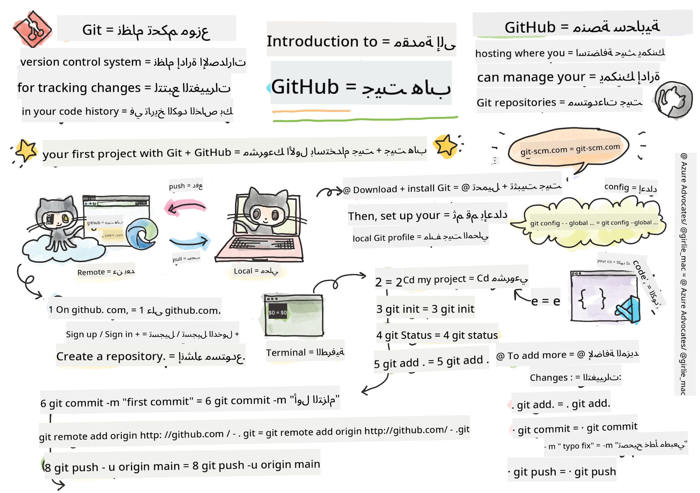

<!--
CO_OP_TRANSLATOR_METADATA:
{
  "original_hash": "9412a6afd024d4fe27c49bf824c73992",
  "translation_date": "2025-10-20T20:34:15+00:00",
  "source_file": "1-getting-started-lessons/2-github-basics/README.md",
  "language_code": "ar"
}
-->
# مقدمة إلى GitHub

GitHub هو واحد من أهم المنصات في تطوير الويب الحديث، حيث يعمل كعمود فقري تعاوني لملايين المطورين حول العالم. فكر فيه كأنه مزيج بين تخزين سحابي للكود وشبكة اجتماعية للمبرمجين – إنه المكان الذي يشارك فيه المطورون أعمالهم، يتعاونون في المشاريع، ويساهمون في مجتمع المصادر المفتوحة الذي يدعم جزءًا كبيرًا من الإنترنت الذي تستخدمه يوميًا.

في هذه الدرس، ستكتشف كيف يغير GitHub طريقة عمل المطورين معًا. ستتعلم كيفية تتبع التغييرات في الكود الخاص بك، التعاون مع الآخرين بسلاسة، وحتى المساهمة في المشاريع التي يستخدمها ملايين الأشخاص. هذا ليس مجرد تخزين الكود عبر الإنترنت – بل هو الانضمام إلى مجتمع عالمي من المطورين وتعلم أساليب العمل الأساسية التي يستخدمها كل مطور محترف.

بنهاية هذا الدرس، سيكون لديك مستودع GitHub خاص بك، وستفهم كيفية إدارة تغييرات الكود باستخدام Git، وستعرف كيفية المساهمة في مشاريع المصادر المفتوحة. هذه المهارات ستكون أساسًا لك للتعاون مع مطورين آخرين طوال رحلتك في تطوير الويب. دعونا نبدأ ونكتشف قوة البرمجة التعاونية!


> رسم توضيحي بواسطة [Tomomi Imura](https://twitter.com/girlie_mac)

## اختبار ما قبل المحاضرة
[اختبار ما قبل المحاضرة](https://ff-quizzes.netlify.app)

## المقدمة

قبل أن نبدأ في أنشطة GitHub العملية، دعونا نؤسس الأساس الذي ستحتاجه للنجاح. فهم المفاهيم الرئيسية وضمان إعداد بيئة التطوير بشكل صحيح سيجعل رحلتك مع GitHub أكثر سلاسة.

في هذا القسم، سنغطي المعرفة والأدوات الأساسية التي يحتاجها كل مطور عند العمل مع GitHub. لا تقلق إذا بدت بعض المفاهيم غير مألوفة في البداية – سنرشدك خلال كل خطوة ونشرح لماذا هذه الأدوات قيمة جدًا لمطوري الويب.

في هذا الدرس، سنغطي:

- تتبع العمل الذي تقوم به على جهازك
- العمل على المشاريع مع الآخرين
- كيفية المساهمة في برامج المصادر المفتوحة

### المتطلبات الأساسية

إعداد بيئة التطوير بشكل صحيح أمر بالغ الأهمية لتجربة سلسة مع GitHub. فكر في هذا كإعداد أدواتك قبل بدء المشروع – وجود الأدوات المناسبة معدة بشكل صحيح سيوفر لك الوقت والإحباط لاحقًا.

دعونا نتأكد من أن لديك كل ما تحتاجه لبدء التعاون مع Git وGitHub بشكل فعال.

قبل أن تبدأ، ستحتاج إلى التحقق مما إذا كان Git مثبتًا. في نافذة الأوامر، اكتب: 
`git --version`

إذا لم يكن Git مثبتًا، [قم بتنزيل Git](https://git-scm.com/downloads). ثم قم بإعداد ملف تعريف Git المحلي الخاص بك في نافذة الأوامر:

> 💡 **الإعداد الأول**: هذه الأوامر تخبر Git من أنت. سيتم إرفاق هذه المعلومات بكل عملية حفظ تقوم بها، لذا اختر اسمًا وبريدًا إلكترونيًا تشعر بالراحة في مشاركته علنًا.

```bash
git config --global user.name "your-name"
git config --global user.email "your-email"
```

للتحقق مما إذا كان Git قد تم تكوينه بالفعل، يمكنك كتابة:
```bash
git config --list
```

ستحتاج أيضًا إلى حساب GitHub، محرر كود (مثل Visual Studio Code)، وستحتاج إلى فتح نافذة الأوامر (أو: موجه الأوامر).

انتقل إلى [github.com](https://github.com/) وقم بإنشاء حساب إذا لم تكن قد أنشأت واحدًا بالفعل، أو قم بتسجيل الدخول واملأ ملفك الشخصي.

💡 **نصيحة حديثة**: فكر في إعداد [مفاتيح SSH](https://docs.github.com/en/authentication/connecting-to-github-with-ssh) أو استخدام [GitHub CLI](https://cli.github.com/) لتسهيل عملية المصادقة بدون كلمات مرور.

✅ GitHub ليس مستودع الكود الوحيد في العالم؛ هناك مستودعات أخرى، لكن GitHub هو الأكثر شهرة.

### التحضير

ستحتاج إلى مجلد يحتوي على مشروع كود على جهازك المحلي (الكمبيوتر المحمول أو الكمبيوتر الشخصي)، ومستودع عام على GitHub، والذي سيكون بمثابة مثال على كيفية المساهمة في مشاريع الآخرين.

### ممارسات الأمان الحديثة

الأمان في تطوير البرمجيات ليس مجرد أمر مهم – بل هو أمر أساسي. عندما تبدأ رحلتك مع GitHub، فإن تأسيس ممارسات آمنة من البداية سيحمي الكود الخاص بك، والمتعاونين معك، والمشاريع التي تساهم فيها.

تُعطى الأولوية في سير العمل الحديث للتطوير للأمان في كل خطوة. دعونا نستكشف الممارسات الأمنية الرئيسية التي يجب أن يعرفها كل مطور عند العمل مع GitHub وGit.

عند العمل مع GitHub، من المهم اتباع أفضل الممارسات الأمنية:

| مجال الأمان | أفضل الممارسات | لماذا هو مهم |
|-------------|----------------|---------------|
| **المصادقة** | استخدم مفاتيح SSH أو رموز الوصول الشخصية | كلمات المرور أقل أمانًا ويتم التخلص منها تدريجيًا |
| **المصادقة الثنائية** | قم بتمكين المصادقة الثنائية على حساب GitHub الخاص بك | تضيف طبقة إضافية من الحماية للحساب |
| **أمان المستودع** | لا تقم أبدًا بحفظ معلومات حساسة | يجب ألا تكون مفاتيح API وكلمات المرور في المستودعات العامة |
| **إدارة التبعيات** | قم بتمكين Dependabot للتحديثات | يحافظ على أمان التبعيات وتحديثها |

> ⚠️ **تذكير أمني مهم**: لا تقم أبدًا بحفظ مفاتيح API أو كلمات المرور أو أي معلومات حساسة في أي مستودع. استخدم متغيرات البيئة وملفات `.gitignore` لحماية البيانات الحساسة.

**إعداد المصادقة الحديثة:**

```bash
# Generate SSH key (modern ed25519 algorithm)
ssh-keygen -t ed25519 -C "your_email@example.com"

# Set up Git to use SSH
git remote set-url origin git@github.com:username/repository.git
```

> 💡 **نصيحة احترافية**: مفاتيح SSH تلغي الحاجة إلى إدخال كلمات المرور بشكل متكرر وهي أكثر أمانًا من طرق المصادقة التقليدية.

---

## إدارة الكود

الآن بعد أن فهمت أهمية GitHub وقمت بإعداد بيئتك، دعونا ننتقل إلى المهارات العملية التي ستستخدمها يوميًا كمطور. إدارة الكود باستخدام Git تشبه الاحتفاظ بمذكرات مفصلة لتطور مشروعك – كل تغيير، كل قرار، وكل معلم يتم تتبعه وحفظه بعناية.

فكر في Git كآلة زمنية للبرمجة. يمكنك رؤية بالضبط ما الذي تغير، متى تغير، ولماذا تغير. يصبح هذا الأمر ذا قيمة كبيرة عند العمل على مشاريع معقدة أو التعاون مع الآخرين.

لنفترض أن لديك مجلدًا محليًا يحتوي على مشروع كود وترغب في البدء في تتبع تقدمك باستخدام Git - نظام التحكم في الإصدارات. يقارن البعض استخدام Git بكتابة رسالة حب لنفسك المستقبلية. عند قراءة رسائل الحفظ الخاصة بك بعد أيام أو أسابيع أو أشهر، ستتمكن من تذكر سبب اتخاذك قرارًا معينًا أو "التراجع" عن تغيير – بالطبع عندما تكتب رسائل حفظ جيدة.

### المهمة: إنشاء مستودع وحفظ الكود  

> 🎯 **هدف التعلم**: بنهاية هذه المهمة، ستكون قد أنشأت أول مستودع GitHub خاص بك وقمت بأول عملية حفظ. هذه هي نقطة دخولك إلى عالم التحكم في الإصدارات!

> شاهد الفيديو
> 
> [](https://www.youtube.com/watch?v=9R31OUPpxU4)

**خطوات العمل:**

1. **إنشاء مستودع على GitHub**. على موقع GitHub.com، في علامة تبويب المستودعات، أو من شريط التنقل العلوي الأيمن، ابحث عن زر **جديد** (زر أخضر) أو القائمة المنسدلة **+** واختر **مستودع جديد**.

   1. قم بتسمية مستودعك (المجلد)
   1. أضف وصفًا (اختياري ولكنه موصى به)
   1. اختر جعله عامًا أو خاصًا
   1. فكر في إضافة ملف README، .gitignore، وترخيص
   1. اختر **إنشاء مستودع**.

1. **انتقل إلى مجلد العمل الخاص بك**. في نافذة الأوامر، انتقل إلى المجلد (المعروف أيضًا بالدليل) الذي تريد البدء في تتبعه. اكتب:

   ```bash
   cd [name of your folder]
   ```

   **ما الذي يفعله هذا الأمر:**
   - **الانتقال** إلى دليل المشروع حيث توجد ملفات الكود
   - **إعداد** البيئة لبدء التتبع باستخدام Git

1. **تهيئة مستودع Git**. في مشروعك، اكتب:

   ```bash
   git init
   ```

   **خطوة بخطوة، ما الذي يحدث:**
   - **إنشاء** مجلد مخفي `.git` يحتوي على جميع معلومات التحكم في الإصدارات
   - **تحويل** المجلد العادي إلى مستودع Git يمكنه تتبع التغييرات
   - **إعداد** الأساس للتحكم في الإصدارات في مشروعك

1. **التحقق من الحالة**. للتحقق من حالة المستودع الخاص بك، اكتب:

   ```bash
   git status
   ```

   **فهم المخرجات:**
   
   قد تبدو المخرجات كالتالي:

   ```output
   Changes not staged for commit:
   (use "git add <file>..." to update what will be committed)
   (use "git restore <file>..." to discard changes in working directory)

        modified:   file.txt
        modified:   file2.txt
   ```

   **ما تحتاج إلى معرفته عن هذه المخرجات:**
   - **النص الأحمر** يشير عادةً إلى ملفات بها تغييرات ولكنها ليست جاهزة للحفظ
   - **النص الأخضر** يظهر الملفات التي تم تجهيزها وجاهزة للحفظ
   - **تلميحات مفيدة** تُقدم حول الأوامر التي يمكنك استخدامها بعد ذلك

   > 💡 **فهم حالة Git**: هذا الأمر هو أفضل صديق لك! يخبرك بالضبط بما يراه Git في مشروعك وما هي الإجراءات التي يمكنك اتخاذها بعد ذلك.

   أمر `git status` يخبرك بأشياء مثل الملفات الجاهزة للحفظ في المستودع أو التي تحتوي على تغييرات قد ترغب في الاحتفاظ بها.

1. **إضافة جميع الملفات للتتبع** (تسمى أيضًا مرحلة الملفات):

   ```bash
   git add .
   ```

   **ما الذي يفعله هذا الأمر:**
   - **تجهيز** جميع الملفات المعدلة والجديدة في دليل المشروع
   - **إعداد** هذه الملفات لتضمينها في الحفظ التالي
   - **وضع علامة** على الملفات كجاهزة للالتقاط الدائم الذي سنقوم بإنشائه لاحقًا

   أمر `git add` مع الوسيطة `.` يشير إلى أن جميع ملفاتك وتغييراتك جاهزة للتتبع.

1. **إضافة ملفات محددة للتتبع** (مرحلة انتقائية):

   ```bash
   git add [file or folder name]
   ```

   **متى تستخدم المرحلة الانتقائية:**
   - **تنظيم** التغييرات ذات الصلة في عمليات حفظ منفصلة لتاريخ أكثر وضوحًا
   - **تضمين** فقط الملفات التي تنتمي معًا منطقيًا
   - **إنشاء** رسائل حفظ أكثر معنى من خلال تجميع العمل ذي الصلة

   > 💡 **نصيحة احترافية**: استخدم الإضافة الانتقائية عندما تريد حفظ تغييرات ذات صلة معًا. هذا يخلق تاريخ حفظ أكثر معنى.

1. **إلغاء مرحلة الملفات** (إذا غيرت رأيك):

   ```bash
   # Unstage all files
   git reset
   
   # Unstage a particular file
   git reset [file or folder name]
   ```

   **فهم إلغاء المرحلة:**
   - **إزالة** الملفات من منطقة المرحلة دون فقدان تغييراتك
   - **الاحتفاظ** بتعديلاتك ولكن استبعادها من الحفظ التالي
   - **إعادة تنظيم** ما تريد تضمينه في الحفظ

1. **تثبيت عملك** (إنشاء حفظ). في هذه المرحلة، قمت بإضافة الملفات إلى ما يسمى _منطقة المرحلة_. مكان حيث يقوم Git بتتبع ملفاتك. لجعل التغيير دائمًا، تحتاج إلى _حفظ_ الملفات. للقيام بذلك، قم بإنشاء _حفظ_ باستخدام أمر `git commit`. يمثل _الحفظ_ نقطة حفظ في تاريخ المستودع الخاص بك. اكتب ما يلي لإنشاء _حفظ_:

   ```bash
   git commit -m "first commit"
   ```

   **ما الذي يحدث عند الحفظ:**
   - **إنشاء** لقطة دائمة لجميع الملفات المجهزة في هذه اللحظة
   - **تسجيل** رسالة الحفظ لشرح التغييرات التي تم إجراؤها
   - **إنشاء** معرف فريد (hash) لهذه المجموعة المحددة من التغييرات
   - **إضافة** هذه اللقطة إلى تاريخ الإصدار الخاص بمشروعك

   > 💡 **نصائح لرسالة الحفظ**: يمكن أن تكون رسالة الحفظ الأولى بسيطة، ولكن بالنسبة للحفظات المستقبلية، كن وصفيًا! أمثلة جيدة: "إضافة وظيفة تسجيل دخول المستخدم" أو "إصلاح خطأ في قائمة التنقل".

   هذا يحفظ جميع ملفاتك، مع إضافة الرسالة "الحفظ الأول". بالنسبة لرسائل الحفظ المستقبلية، سترغب في أن تكون أكثر وصفًا لتوضيح نوع التغيير الذي قمت به.

1. **ربط مستودع Git المحلي الخاص بك بـ GitHub**. مستودع Git جيد على جهازك، ولكن في مرحلة ما، سترغب في الحصول على نسخة احتياطية من ملفاتك في مكان ما وأيضًا دعوة أشخاص آخرين للعمل معك على المستودع الخاص بك. أحد هذه الأماكن الرائعة للقيام بذلك هو GitHub. تذكر أننا قد أنشأنا بالفعل مستودعًا على GitHub، لذا الشيء الوحيد الذي نحتاج إلى القيام به هو ربط مستودع Git المحلي الخاص بنا بـ GitHub. أمر `git remote add` سيفعل ذلك. اكتب الأمر التالي:

   > ملاحظة، قبل كتابة الأمر، انتقل إلى صفحة مستودع GitHub الخاص بك للعثور على عنوان URL للمستودع. ستستخدمه في الأمر أدناه. استبدل `https://github.com/username/repository_name.git` بعنوان URL الخاص بـ GitHub.

   ```bash
   git remote add origin https://github.com/username/repository_name.git
   ```

   **خطوة بخطوة، ما الذي يحدث:**
   - **إنشاء** اتصال يسمى "origin" يشير إلى مستودع GitHub الخاص بك
   - **ربط** مستودع Git المحلي الخاص بك بالمستودع البعيد على GitHub
   - **تمكين** القدرة على دفع الحفظات المحلية إلى GitHub وسحب التغييرات من GitHub

   💡 **بديل حديث**: يمكنك أيضًا استخدام GitHub CLI لإنشاء وربط المستودع الخاص بك في خطوة واحدة:
   ```bash
   gh repo create my-repo --public --push --source=.
   ```

   هذا ينشئ _اتصالًا_، أو رابطًا، يسمى "origin" يشير إلى مستودع GitHub الذي أنشأته سابقًا.

1. **إرسال الملفات المحلية إلى GitHub**. حتى الآن، قمت بإنشاء _اتصال_ بين المستودع المحلي ومستودع GitHub. دعونا نرسل هذه الملفات إلى GitHub باستخدام الأمر التالي `git push`، كما يلي:

   ```bash
   git push -u origin main
   ```

   **تفصيل هذا الأمر:**
   - **تحميل** الحفظات الخاصة بك من الفرع "main" إلى GitHub
   - **تعيين** الفرع الرئيسي باستخدام `-u` لإنشاء رابط دائم
   - **تمكين** عمليات الدفع المستقبلية المبسطة دون تحديد أسماء الفروع

   هذا يرسل الحفظات الخاصة بك في الفرع "main" إلى GitHub. تعيين الفرع الرئيسي باستخدام `-u` في الأمر ينشئ رابطًا بين الفرع المحلي والفرع البعيد، بحيث يمكنك ببساطة استخدام `git push` أو `git pull` دون الحاجة إلى تحديد اسم الفرع في المستقبل.
💡 **ملاحظة**: إذا كان اسم الفرع الافتراضي لديك مختلفًا (مثل "master")، استبدل "main" باسم الفرع الفعلي الخاص بك. يمكنك التحقق من الفرع الحالي باستخدام `git branch --show-current`.

2. **لإضافة المزيد من التغييرات** (العمل اليومي). إذا كنت ترغب في متابعة إجراء التغييرات ودفعها إلى GitHub، ستحتاج فقط إلى استخدام الأوامر الثلاثة التالية:

   ```bash
   git add .
   git commit -m "type your commit message here"
   git push
   ```

   **خطوة بخطوة، إليك سير العمل اليومي الخاص بك:**
   - **تجهيز** الملفات المعدلة باستخدام `git add .` (أو إضافة ملفات محددة)
   - **التزام** بالتغييرات مع رسالة وصفية حول ما أنجزته
   - **دفع** التغييرات إلى GitHub لنسخ عملك احتياطيًا ومشاركته مع الآخرين

   > 💡 **نصيحة**: قد ترغب أيضًا في اعتماد ملف `.gitignore` لمنع ظهور الملفات التي لا تريد تتبعها على GitHub - مثل ملف الملاحظات الذي تخزنه في نفس المجلد ولكنه ليس له مكان في مستودع عام. يمكنك العثور على قوالب لملفات `.gitignore` في [.gitignore templates](https://github.com/github/gitignore) أو إنشاء واحد باستخدام [gitignore.io](https://www.toptal.com/developers/gitignore).

#### سير العمل الحديث مع Git

فكر في تبني هذه الممارسات الحديثة:

- **التزامات تقليدية**: استخدم تنسيقًا موحدًا لرسائل الالتزام مثل `feat:`، `fix:`، `docs:`، إلخ. تعرف على المزيد في [conventionalcommits.org](https://www.conventionalcommits.org/)
- **التزامات ذرية**: اجعل كل التزام يمثل تغييرًا منطقيًا واحدًا
- **التزامات متكررة**: قم بالتزام التغييرات بشكل متكرر مع رسائل وصفية بدلاً من الالتزامات الكبيرة وغير المتكررة

#### رسائل الالتزام

يجب أن تكمل سطر موضوع الالتزام الجيد في Git الجملة التالية:
إذا تم تطبيقه، فإن هذا الالتزام سيقوم بـ <سطر الموضوع الخاص بك هنا>

استخدم صيغة الأمر، الزمن الحاضر في الموضوع: "تغيير" وليس "تم تغييره" أو "تغييرات". كما هو الحال في الموضوع، استخدم صيغة الأمر، الزمن الحاضر في النص (اختياري). يجب أن يتضمن النص الدافع للتغيير ويقارن ذلك بالسلوك السابق. أنت تشرح "لماذا"، وليس "كيف".

✅ خذ بضع دقائق لتصفح GitHub. هل يمكنك العثور على رسالة التزام رائعة حقًا؟ هل يمكنك العثور على رسالة بسيطة جدًا؟ ما هي المعلومات التي تعتقد أنها الأكثر أهمية وفائدة لتوصيلها في رسالة الالتزام؟

## العمل على المشاريع مع الآخرين

التعاون هو المكان الذي يتألق فيه GitHub حقًا. بينما إدارة الكود الخاص بك قيمة، السحر الحقيقي يحدث عندما يعمل المطورون معًا لبناء شيء مذهل. يحول GitHub البرمجة الفردية إلى سيمفونية تعاونية حيث يمكن للعديد من المطورين المساهمة في نفس الوقت دون التداخل مع بعضهم البعض.

في هذا القسم، ستتعلم كيفية جعل مشاريعك مرحبة بالمطورين الآخرين وكيفية المساهمة بشكل هادف في المشاريع الحالية. هذه المهارات التعاونية هي ما يميز المبرمجين الهواة عن المطورين المحترفين.

> شاهد الفيديو
>
> [](https://www.youtube.com/watch?v=bFCM-PC3cu8)

السبب الرئيسي لوضع الأشياء على GitHub هو جعل التعاون مع المطورين الآخرين ممكنًا.

في مستودعك، انتقل إلى `Insights > Community` لترى كيف يقارن مشروعك بمعايير المجتمع الموصى بها.

> 🎯 **جعل مستودعك احترافيًا**: المستودع الموثق جيدًا يجذب المزيد من المساهمين ويظهر أنك تهتم بجودة الكود.

**عناصر المستودع الأساسية:**

| العنصر | الغرض | لماذا هو مهم |
|--------|-------|-------------|
| **الوصف** | ملخص موجز لمشروعك | يساعد الناس على فهم ما يفعله مشروعك بسرعة |
| **README** | توثيق مفصل للمشروع | أول شيء يقرأه الناس - اجعله مميزًا! |
| **إرشادات المساهمة** | تعليمات للمساهمين | يظهر أنك ترحب بالتعاون ويضع توقعات واضحة |
| **مدونة السلوك** | معايير سلوك المجتمع | يخلق بيئة مرحبة لجميع المساهمين |
| **الرخصة** | أذونات الاستخدام | يحدد كيفية استخدام الآخرين للكود الخاص بك قانونيًا |
| **سياسة الأمان** | عملية الإبلاغ عن الثغرات | يظهر أنك تأخذ الأمان بجدية |

> 💡 **نصيحة احترافية**: يوفر GitHub قوالب لجميع هذه الملفات. عند إنشاء مستودع جديد، تحقق من المربعات لإنشاء هذه الملفات تلقائيًا.

**ميزات GitHub الحديثة لاستكشافها:**

🤖 **الأتمتة و CI/CD:**
- **GitHub Actions** للاختبار والنشر التلقائي
- **Dependabot** لتحديث التبعيات تلقائيًا

💬 **إدارة المجتمع والمشاريع:**
- **GitHub Discussions** للمحادثات المجتمعية خارج نطاق القضايا
- **GitHub Projects** لإدارة المشاريع بأسلوب كانبان
- **قواعد حماية الفروع** لفرض معايير جودة الكود

كل هذه الموارد ستفيد في استيعاب أعضاء الفريق الجدد. وهذه هي عادةً الأشياء التي ينظر إليها المساهمون الجدد قبل حتى النظر إلى الكود الخاص بك، لمعرفة ما إذا كان مشروعك هو المكان المناسب لهم لقضاء وقتهم.

✅ ملفات README، على الرغم من أنها تستغرق وقتًا لإعدادها، غالبًا ما يتم تجاهلها من قبل المشرفين المشغولين. هل يمكنك العثور على مثال لملف README وصفي بشكل خاص؟ ملاحظة: هناك بعض [الأدوات التي تساعد في إنشاء ملفات README جيدة](https://www.makeareadme.com/) قد ترغب في تجربتها.

### المهمة: دمج بعض الكود

تساعد وثائق المساهمة الناس على المساهمة في المشروع. تشرح أنواع المساهمات التي تبحث عنها وكيفية عمل العملية. سيحتاج المساهمون إلى المرور بسلسلة من الخطوات ليتمكنوا من المساهمة في المستودع الخاص بك على GitHub:

1. **استنساخ المستودع الخاص بك** ربما سترغب في أن يقوم الناس بـ _استنساخ_ مشروعك. الاستنساخ يعني إنشاء نسخة من المستودع الخاص بك على ملف تعريف GitHub الخاص بهم.
1. **النسخ**. من هناك سيقومون بنسخ المشروع إلى جهازهم المحلي.
1. **إنشاء فرع**. سترغب في أن تطلب منهم إنشاء _فرع_ لعملهم.
1. **تركيز التغيير على منطقة واحدة**. اطلب من المساهمين التركيز على مساهماتهم في شيء واحد في كل مرة - بهذه الطريقة تكون فرص أن تتمكن من _دمج_ عملهم أعلى. تخيل أنهم كتبوا إصلاحًا لخلل، أضافوا ميزة جديدة، وقاموا بتحديث عدة اختبارات - ماذا لو كنت تريد، أو يمكنك فقط تنفيذ 2 من 3، أو 1 من 3 تغييرات؟

✅ تخيل موقفًا تكون فيه الفروع ضرورية بشكل خاص لكتابة وشحن كود جيد. ما هي حالات الاستخدام التي يمكنك التفكير فيها؟

> ملاحظة، كن التغيير الذي تريد رؤيته في العالم، وقم بإنشاء فروع لعملك الخاص أيضًا. أي التزامات تقوم بها سيتم تنفيذها على الفرع الذي "تم التحقق منه" حاليًا. استخدم `git status` لمعرفة أي فرع هو.

لنستعرض سير عمل المساهم. افترض أن المساهم قد قام بالفعل بـ _استنساخ_ و _نسخ_ المستودع بحيث يكون لديه مستودع Git جاهز للعمل عليه، على جهازه المحلي:

1. **إنشاء فرع**. استخدم الأمر `git branch` لإنشاء فرع يحتوي على التغييرات التي يعتزم المساهمة بها:

   ```bash
   git branch [branch-name]
   ```

   > 💡 **نهج حديث**: يمكنك أيضًا إنشاء والتبديل إلى الفرع الجديد في أمر واحد:
   ```bash
   git switch -c [branch-name]
   ```

1. **التبديل إلى الفرع العامل**. قم بالتبديل إلى الفرع المحدد وقم بتحديث الدليل العامل باستخدام `git switch`:

   ```bash
   git switch [branch-name]
   ```

   > 💡 **ملاحظة حديثة**: `git switch` هو البديل الحديث لـ `git checkout` عند تغيير الفروع. إنه أكثر وضوحًا وأمانًا للمبتدئين.

1. **العمل**. في هذه المرحلة، تريد إضافة تغييراتك. لا تنسَ إخبار Git عنها باستخدام الأوامر التالية:

   ```bash
   git add .
   git commit -m "my changes"
   ```

   > ⚠️ **جودة رسالة الالتزام**: تأكد من إعطاء الالتزام اسمًا جيدًا، لك وللمشرف على المستودع الذي تساعد فيه. كن محددًا بشأن ما قمت بتغييره!

1. **دمج عملك مع فرع `main`**. في مرحلة ما تكون قد انتهيت من العمل وترغب في دمج عملك مع عمل فرع `main`. قد يكون فرع `main` قد تغير في هذه الأثناء، لذا تأكد من تحديثه إلى الأحدث باستخدام الأوامر التالية:

   ```bash
   git switch main
   git pull
   ```

   في هذه المرحلة، تريد التأكد من أن أي _تعارضات_، وهي حالات لا يستطيع Git فيها بسهولة _دمج_ التغييرات، تحدث في فرع العمل الخاص بك. لذلك قم بتشغيل الأوامر التالية:

   ```bash
   git switch [branch_name]
   git merge main
   ```

   سيقوم الأمر `git merge main` بجلب جميع التغييرات من `main` إلى فرعك. نأمل أن تتمكن من المتابعة فقط. إذا لم يكن الأمر كذلك، سيخبرك VS Code بالمكان الذي يكون فيه Git _مرتبكًا_ وتقوم بتعديل الملفات المتأثرة لتحديد المحتوى الأكثر دقة.

   💡 **بديل حديث**: فكر في استخدام `git rebase` للحصول على تاريخ أنظف:
   ```bash
   git rebase main
   ```
   يعيد هذا تشغيل التزاماتك على أحدث فرع رئيسي، مما يخلق تاريخًا خطيًا.

1. **إرسال عملك إلى GitHub**. إرسال عملك إلى GitHub يعني شيئين. دفع فرعك إلى المستودع الخاص بك ثم فتح طلب سحب (Pull Request).

   ```bash
   git push --set-upstream origin [branch-name]
   ```

   ينشئ الأمر أعلاه الفرع على المستودع المستنسخ الخاص بك.

1. **فتح طلب سحب**. بعد ذلك، تريد فتح طلب سحب. تقوم بذلك عن طريق الانتقال إلى المستودع المستنسخ على GitHub. سترى مؤشرًا على GitHub يسأل عما إذا كنت تريد إنشاء طلب سحب جديد، تضغط عليه وستنتقل إلى واجهة حيث يمكنك تغيير عنوان رسالة الالتزام، وإعطائها وصفًا أكثر ملاءمة. الآن سيرى المشرف على المستودع الذي استنسخته هذا الطلب و _أصابعك متقاطعة_ سيقدر ويقوم بـ _دمج_ طلب السحب الخاص بك. أنت الآن مساهم، رائع :)

   💡 **نصيحة حديثة**: يمكنك أيضًا إنشاء طلبات السحب باستخدام GitHub CLI:
   ```bash
   gh pr create --title "Your PR title" --body "Description of changes"
   ```

   🔧 **أفضل الممارسات لطلبات السحب**:
   - ربط القضايا ذات الصلة باستخدام كلمات مثل "Fixes #123"
   - إضافة لقطات شاشة للتغييرات في واجهة المستخدم
   - طلب مراجعين محددين
   - استخدام طلبات السحب المؤقتة للعمل الجاري
   - التأكد من اجتياز جميع فحوصات CI قبل طلب المراجعة

1. **تنظيف**. يعتبر تنظيف الفروع بعد دمج طلب السحب بنجاح ممارسة جيدة. تريد تنظيف الفرع المحلي والفرع الذي دفعته إلى GitHub. أولاً، دعنا نحذفه محليًا باستخدام الأمر التالي:

   ```bash
   git branch -d [branch-name]
   ```

   تأكد من الانتقال إلى صفحة GitHub للمستودع المستنسخ بعد ذلك وإزالة الفرع البعيد الذي دفعته إليه.

`طلب السحب` يبدو كأنه مصطلح غريب لأنك في الواقع تريد دفع تغييراتك إلى المشروع. لكن المشرف (مالك المشروع) أو الفريق الأساسي يحتاج إلى النظر في تغييراتك قبل دمجها مع فرع "main" الخاص بالمشروع، لذا فأنت في الواقع تطلب قرار تغيير من المشرف.

طلب السحب هو المكان الذي يتم فيه مقارنة ومناقشة الفروقات التي تم إدخالها على فرع مع المراجعات، التعليقات، الاختبارات المدمجة، والمزيد. يتبع طلب السحب الجيد تقريبًا نفس قواعد رسالة الالتزام. يمكنك إضافة مرجع إلى قضية في متتبع القضايا، عندما يكون عملك على سبيل المثال يحل قضية. يتم ذلك باستخدام `#` متبوعًا برقم القضية. على سبيل المثال `#97`.

🤞أصابعك متقاطعة أن جميع الفحوصات تمر ويتم دمج تغييراتك في المشروع من قبل مالك المشروع (المشاريع)🤞

قم بتحديث الفرع العامل المحلي الحالي الخاص بك بجميع الالتزامات الجديدة من الفرع البعيد المقابل على GitHub:

`git pull`

## كيفية المساهمة في المصادر المفتوحة

المساهمة في مشاريع المصادر المفتوحة هي واحدة من أكثر التجارب مكافأة في تطوير الويب. إنها فرصتك لرد الجميل للمجتمع، التعلم من المطورين ذوي الخبرة، وإحداث تأثير حقيقي على البرمجيات التي يستخدمها الآلاف أو حتى الملايين من الناس.

جمال المساهمة في المصادر المفتوحة هو أن الجميع بدأوا كمبتدئين. المطورون الذين أنشأوا الأدوات التي تتعلم بها اليوم كانوا في يوم من الأيام في نفس المكان الذي أنت فيه الآن. من خلال المساهمة في المصادر المفتوحة، تصبح جزءًا من هذه الدورة المستمرة من التعلم والمشاركة التي تدفع الابتكار في تطوير الويب.

أولاً، دعنا نجد مستودعًا (أو **repo**) على GitHub يهمك وترغب في المساهمة بتغيير فيه. سترغب في نسخ محتوياته إلى جهازك.

✅ طريقة جيدة للعثور على مستودعات "مناسبة للمبتدئين" هي [البحث باستخدام العلامة 'good-first-issue'](https://github.blog/2020-01-22-browse-good-first-issues-to-start-contributing-to-open-source/).


هناك عدة طرق لنسخ الكود. إحدى الطرق هي "استنساخ" محتويات المستودع، باستخدام HTTPS، SSH، أو باستخدام GitHub CLI (واجهة سطر الأوامر).

افتح الطرفية الخاصة بك واستنسخ المستودع كالتالي:
```bash
# Using HTTPS
git clone https://github.com/ProjectURL

# Using SSH (requires SSH key setup)
git clone git@github.com:username/repository.git

# Using GitHub CLI
gh repo clone username/repository
```

للعمل على المشروع، انتقل إلى المجلد الصحيح:
`cd ProjectURL`

يمكنك أيضًا فتح المشروع بأكمله باستخدام:
- **[GitHub Codespaces](https://github.com/features/codespaces)** - بيئة تطوير سحابية من GitHub مع VS Code في المتصفح
- **[GitHub Desktop](https://desktop.github.com/)** - تطبيق واجهة مستخدم لعمليات Git  
- **[GitHub.dev](https://github.dev)** - اضغط على مفتاح `.` على أي مستودع GitHub لفتح VS Code في المتصفح
- **VS Code** مع إضافة GitHub Pull Requests

أخيرًا، يمكنك تنزيل الكود في مجلد مضغوط.

### بعض الأمور المثيرة للاهتمام حول GitHub
يمكنك وضع نجمة، متابعة، و/أو "تشعب" أي مستودع عام على GitHub. يمكنك العثور على المستودعات التي وضعت لها نجمة في القائمة المنسدلة أعلى اليمين. إنها مثل الإشارات المرجعية، ولكن للرمز.

المشاريع تحتوي على متتبع للمشكلات، غالبًا على GitHub في علامة التبويب "Issues" ما لم يُذكر خلاف ذلك، حيث يناقش الأشخاص المشكلات المتعلقة بالمشروع. وعلامة التبويب Pull Requests هي المكان الذي يناقش فيه الأشخاص ويُراجعون التغييرات التي قيد التنفيذ.

قد تحتوي المشاريع أيضًا على مناقشات في المنتديات، قوائم البريد الإلكتروني، أو قنوات الدردشة مثل Slack، Discord أو IRC.

🔧 **ميزات GitHub الحديثة**:
- **GitHub Discussions** - منتدى مدمج للمحادثات المجتمعية
- **GitHub Sponsors** - دعم المساهمين ماليًا  
- **علامة التبويب Security** - تقارير الثغرات ونصائح الأمان
- **علامة التبويب Actions** - عرض سير العمل الآلي وخطوط CI/CD
- **علامة التبويب Insights** - تحليلات حول المساهمين، الالتزامات، وصحة المشروع
- **علامة التبويب Projects** - أدوات إدارة المشاريع المدمجة في GitHub

✅ ألقِ نظرة حول مستودع GitHub الجديد الخاص بك وجرب بعض الأشياء، مثل تعديل الإعدادات، إضافة معلومات إلى المستودع، إنشاء مشروع (مثل لوحة Kanban)، وإعداد GitHub Actions للتشغيل الآلي. هناك الكثير مما يمكنك القيام به!

---

## 🚀 التحدي

تعاون مع صديق للعمل على أكواد بعضكما البعض. قم بإنشاء مشروع بشكل تعاوني، تشعب الأكواد، أنشئ فروعًا، وادمج التغييرات.

## اختبار ما بعد المحاضرة
[اختبار ما بعد المحاضرة](https://ff-quizzes.netlify.app/web/en/)

## المراجعة والدراسة الذاتية

اقرأ المزيد عن [المساهمة في البرمجيات مفتوحة المصدر](https://opensource.guide/how-to-contribute/#how-to-submit-a-contribution).

[ورقة غش Git](https://training.github.com/downloads/github-git-cheat-sheet/).

مارس، مارس، مارس. GitHub يقدم مسارات تعليمية رائعة عبر [GitHub Skills](https://skills.github.com):

- [مقدمة إلى GitHub](https://github.com/skills/introduction-to-github)
- [التواصل باستخدام Markdown](https://github.com/skills/communicate-using-markdown)  
- [صفحات GitHub](https://github.com/skills/github-pages)
- [إدارة تعارضات الدمج](https://github.com/skills/resolve-merge-conflicts)

**موارد حديثة إضافية**:
- [وثائق GitHub CLI](https://cli.github.com/manual/)
- [وثائق GitHub Codespaces](https://docs.github.com/en/codespaces)
- [وثائق GitHub Actions](https://docs.github.com/en/actions)
- [أفضل ممارسات Git](https://www.atlassian.com/git/tutorials/comparing-workflows)

## تحدي GitHub Copilot Agent 🚀

استخدم وضع Agent لإكمال التحدي التالي:

**الوصف:** قم بإنشاء مشروع تطوير ويب تعاوني يوضح سير العمل الكامل لـ GitHub الذي تعلمته في هذا الدرس. سيساعدك هذا التحدي على ممارسة إنشاء المستودعات، ميزات التعاون، وسير العمل الحديث لـ Git في سيناريو واقعي.

**المهمة:** قم بإنشاء مستودع GitHub عام جديد لمشروع بسيط بعنوان "موارد تطوير الويب". يجب أن يتضمن المستودع ملف README.md منظمًا بشكل جيد يسرد أدوات وموارد تطوير الويب المفيدة، مصنفة حسب الفئات (HTML، CSS، JavaScript، إلخ). قم بإعداد المستودع بمعايير مجتمعية مناسبة بما في ذلك ترخيص، إرشادات المساهمة، ومدونة سلوك. أنشئ على الأقل فرعين للميزات: واحد لإضافة موارد CSS وآخر لموارد JavaScript. قم بعمل التزامات لكل فرع مع رسائل التزام وصفية، ثم أنشئ طلبات دمج لدمج التغييرات مرة أخرى إلى الفرع الرئيسي. قم بتمكين ميزات GitHub مثل Issues، Discussions، وقم بإعداد سير عمل GitHub Actions الأساسي لفحوصات آلية.

## الواجب

أكمل دورة [مقدمة إلى GitHub](https://github.com/skills/introduction-to-github) على GitHub Skills.

**واجبات اختيارية متقدمة**:
- إعداد مصادقة SSH لحساب GitHub الخاص بك
- جرب استخدام GitHub CLI للعمليات الشائعة
- قم بإنشاء مستودع مع سير عمل GitHub Actions
- استكشف GitHub Codespaces بفتح هذا المستودع في مساحة عمل Codespace

---

**إخلاء المسؤولية**:  
تم ترجمة هذا المستند باستخدام خدمة الترجمة بالذكاء الاصطناعي [Co-op Translator](https://github.com/Azure/co-op-translator). بينما نسعى لتحقيق الدقة، يرجى العلم أن الترجمات الآلية قد تحتوي على أخطاء أو عدم دقة. يجب اعتبار المستند الأصلي بلغته الأصلية المصدر الموثوق. للحصول على معلومات حاسمة، يُوصى بالترجمة البشرية الاحترافية. نحن غير مسؤولين عن أي سوء فهم أو تفسيرات خاطئة ناتجة عن استخدام هذه الترجمة.