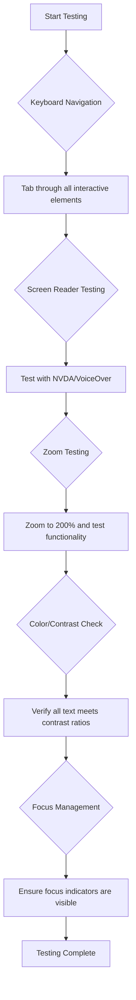
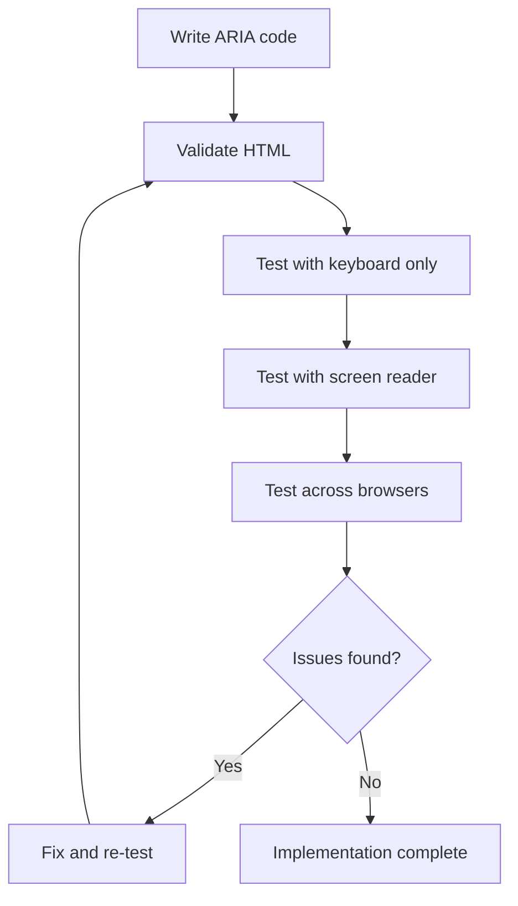

<!--
CO_OP_TRANSLATOR_METADATA:
{
  "original_hash": "300c1562e01f21065ae0b8e9d9181a86",
  "translation_date": "2025-10-20T20:32:49+00:00",
  "source_file": "1-getting-started-lessons/3-accessibility/README.md",
  "language_code": "ar"
}
-->
# إنشاء صفحات ويب ميسرة


> رسم توضيحي بواسطة [Tomomi Imura](https://twitter.com/girlie_mac)

## اختبار ما قبل المحاضرة
[اختبار ما قبل المحاضرة](https://ff-quizzes.netlify.app/web/)

> قوة الويب تكمن في عالميته. الوصول للجميع بغض النظر عن الإعاقة هو جانب أساسي.
>
> \- السير تيموثي بيرنرز لي، مدير W3C ومخترع شبكة الإنترنت العالمية

إمكانية الوصول إلى الويب ليست مجرد ميزة إضافية بل هي مبدأ أساسي يجعل الإنترنت عالميًا بحق. عندما تقوم بإنشاء مواقع ويب ميسرة، فإنك لا تساعد فقط الأشخاص ذوي الإعاقة، بل تخلق تجارب أفضل للجميع. فكر في كيف أن المنحدرات المصممة للكراسي المتحركة تساعد أيضًا الأشخاص الذين يستخدمون عربات الأطفال أو الحقائب أو الدراجات. تصميم الويب الميسر يعمل بنفس الطريقة.

في هذه الدرس، ستتعرف على كيفية إنشاء مواقع ويب تعمل للجميع، بغض النظر عن قدراتهم أو التقنيات التي يستخدمونها لتصفح الإنترنت. ستتعلم تقنيات عملية مدمجة في معايير الويب الحديثة، وتستكشف أدوات اختبار إمكانية الوصول القوية، وتفهم كيف تعزز إمكانية الوصول سهولة الاستخدام لجميع المستخدمين.

بحلول نهاية هذا الدرس، ستكون لديك المعرفة والأدوات لجعل إمكانية الوصول جزءًا طبيعيًا من عملية التطوير الخاصة بك منذ اليوم الأول. دعونا نستكشف كيف يمكن للاختيارات التصميمية المدروسة أن تفتح الإنترنت لمليارات المستخدمين حول العالم.

> يمكنك أخذ هذا الدرس على [Microsoft Learn](https://docs.microsoft.com/learn/modules/web-development-101/accessibility/?WT.mc_id=academic-77807-sagibbon)!

## فهم التقنيات المساعدة

قبل أن نبدأ في بناء مواقع ويب ميسرة، دعونا نفهم كيف يتصفح الأشخاص ذوو القدرات المختلفة الإنترنت. هذه المعرفة ستساعدك على اتخاذ قرارات مستنيرة بشأن اختيارات التصميم والتطوير الخاصة بك.

التقنيات المساعدة هي أدوات متخصصة تساعد الأشخاص ذوي الإعاقة على التفاعل مع المحتوى الرقمي. فهم كيفية عمل هذه الأدوات أمر ضروري لإنشاء تجارب ويب ميسرة حقًا.

### قارئات الشاشة

[قارئات الشاشة](https://en.wikipedia.org/wiki/Screen_reader) هي تقنيات مساعدة رائعة تحول النص الرقمي إلى صوت أو إخراج بطريقة برايل. تُستخدم بشكل أساسي من قبل الأشخاص ذوي الإعاقات البصرية، لكنها تساعد أيضًا المستخدمين الذين يعانون من صعوبات التعلم مثل عسر القراءة.

فكر في قارئ الشاشة كراوي صوتي للويب. يقرأ المحتوى بصوت عالٍ بترتيب منطقي، ويعلن عن العناصر التفاعلية مثل الأزرار والروابط، ويوفر اختصارات لوحة المفاتيح للتنقل بكفاءة. ومع ذلك، يمكن لقارئات الشاشة العمل بفعالية فقط إذا تم بناء المواقع بهيكل صحيح ومحتوى ذو معنى.

**قارئات الشاشة الشهيرة عبر المنصات:**
- **Windows**: [NVDA](https://www.nvaccess.org/about-nvda/) (مجاني والأكثر شعبية)، [JAWS](https://webaim.org/articles/jaws/)، [Narrator](https://support.microsoft.com/windows/complete-guide-to-narrator-e4397a0d-ef4f-b386-d8ae-c172f109bdb1/?WT.mc_id=academic-77807-sagibbon) (مضمن)
- **macOS/iOS**: [VoiceOver](https://support.apple.com/guide/voiceover/welcome/10) (مضمن وقوي جدًا)
- **Android**: [TalkBack](https://support.google.com/accessibility/android/answer/6283677) (مضمن)
- **Linux**: [Orca](https://wiki.gnome.org/Projects/Orca) (مجاني ومفتوح المصدر)

**كيف تتنقل قارئات الشاشة في محتوى الويب:**

توفر قارئات الشاشة طرقًا متعددة للتنقل تجعل التصفح فعالًا للمستخدمين ذوي الخبرة:
- **القراءة التسلسلية**: قراءة المحتوى من الأعلى إلى الأسفل، مثل متابعة كتاب
- **التنقل عبر المعالم**: الانتقال بين أقسام الصفحة (الرأس، التنقل، الرئيسي، التذييل)
- **التنقل عبر العناوين**: تخطي بين العناوين لفهم هيكل الصفحة
- **قوائم الروابط**: إنشاء قائمة بجميع الروابط للوصول السريع
- **عناصر التحكم في النماذج**: التنقل مباشرة بين حقول الإدخال والأزرار

> 💡 **رؤية المطور**: 68% من مستخدمي قارئات الشاشة يتنقلون بشكل أساسي عبر العناوين ([استطلاع WebAIM](https://webaim.org/projects/screenreadersurvey9/#finding)). لهذا السبب، فإن هيكل العناوين الصحيح أمر بالغ الأهمية!

### بناء سير عمل الاختبار الخاص بك

يتطلب اختبار إمكانية الوصول الفعال أدوات آلية والتحقق اليدوي. إليك نهجًا منهجيًا يلتقط معظم المشكلات:

**سير عمل الاختبار اليدوي الأساسي:**



**قائمة التحقق خطوة بخطوة:**
1. **التنقل باستخدام لوحة المفاتيح**: استخدم فقط Tab، Shift+Tab، Enter، Space، ومفاتيح الأسهم
2. **اختبار قارئ الشاشة**: قم بتشغيل NVDA أو VoiceOver أو Narrator وتصفح مع إغلاق عينيك
3. **اختبار التكبير**: اختبر عند مستويات تكبير 200% و400%
4. **التحقق من تباين الألوان**: تحقق من جميع النصوص ومكونات واجهة المستخدم
5. **اختبار مؤشر التركيز**: تأكد من أن جميع العناصر التفاعلية لها حالات تركيز مرئية

✅ **ابدأ بـ Lighthouse**: افتح أدوات المطور في متصفحك، قم بتشغيل تدقيق إمكانية الوصول في Lighthouse، ثم استخدم النتائج لتوجيه مناطق التركيز في الاختبار اليدوي.

### أدوات التكبير والتصغير

يعتمد العديد من المستخدمين على التكبير لجعل المحتوى قابلاً للقراءة. يشمل ذلك الأشخاص ذوي الرؤية الضعيفة، كبار السن، وحتى المستخدمين في ضوء الشمس الساطع أو الذين يعانون من مشاكل رؤية مؤقتة. تطورت تقنيات التكبير الحديثة إلى ما هو أبعد من مجرد تكبير الصور.

فهم كيفية عمل التكبير يساعدك على إنشاء تصميمات متجاوبة تظل وظيفية وجميلة عند أي مستوى تكبير.

**قدرات التكبير الحديثة في المتصفحات:**
- **تكبير الصفحة**: يوسع كل المحتوى بشكل متناسب (النصوص، الصور، التخطيط) - هذه هي الطريقة المفضلة
- **تكبير النص فقط**: يزيد حجم الخط مع الحفاظ على التخطيط الأصلي
- **التكبير بالقرص**: دعم الإيماءات على الأجهزة المحمولة للتكبير المؤقت
- **دعم المتصفحات**: جميع المتصفحات الحديثة تدعم التكبير حتى 500% دون كسر الوظائف

**برامج التكبير المتخصصة:**
- **Windows**: [Magnifier](https://support.microsoft.com/windows/use-magnifier-to-make-things-on-the-screen-easier-to-see-414948ba-8b1c-d3bd-8615-0e5e32204198) (مضمن)، [ZoomText](https://www.freedomscientific.com/training/zoomtext/getting-started/)
- **macOS/iOS**: [Zoom](https://www.apple.com/accessibility/mac/vision/) (مضمن مع ميزات متقدمة)

> ⚠️ **اعتبارات التصميم**: تتطلب WCAG أن يظل المحتوى وظيفيًا عند تكبيره إلى 200%. عند هذا المستوى، يجب أن يكون التمرير الأفقي محدودًا، ويجب أن تظل جميع العناصر التفاعلية قابلة للوصول.

✅ **اختبر تصميمك المتجاوب**: قم بتكبير متصفحك إلى 200% و400%. هل يتكيف تخطيطك بشكل سلس؟ هل يمكنك الوصول إلى جميع الوظائف دون تمرير مفرط؟

## أدوات اختبار إمكانية الوصول الحديثة

الآن بعد أن فهمت كيفية عمل التقنيات المساعدة، دعونا نستكشف الأدوات التي تساعدك على بناء واختبار مواقع ويب ميسرة. الجمع بين الاختبار الآلي والتحقق اليدوي يمنحك الثقة بأن مواقعك تعمل للجميع.

يتبع اختبار إمكانية الوصول الحديث نهجًا شاملاً: الأدوات الآلية تلتقط المشكلات الواضحة، بينما يضمن الاختبار اليدوي سهولة الاستخدام في العالم الحقيقي.

### اختبار تباين الألوان

تباين الألوان هو أحد أكثر مشكلات إمكانية الوصول شيوعًا، ولكنه أيضًا من الأسهل إصلاحًا. التباين الجيد يفيد الجميع - من المستخدمين ذوي الإعاقات البصرية إلى الأشخاص الذين يشاهدون الشاشات في ضوء الشمس الساطع.

**متطلبات تباين WCAG:**

| نوع النص | WCAG AA (الحد الأدنى) | WCAG AAA (المعزز) |
|----------|------------------------|-------------------|
| **النص العادي** (أقل من 18pt) | نسبة تباين 4.5:1 | نسبة تباين 7:1 |
| **النص الكبير** (18pt+ أو 14pt+ بخط عريض) | نسبة ت
### مؤشرات التركيز وتصميم التفاعل

مؤشرات التركيز هي المكافئ الرقمي للمؤشر - فهي تظهر للمستخدمين الذين يعتمدون على لوحة المفاتيح مكان وجودهم على الصفحة. مؤشرات التركيز المصممة بشكل جيد تعزز التجربة للجميع من خلال جعل التفاعلات واضحة وقابلة للتنبؤ.

**أفضل الممارسات الحديثة لمؤشرات التركيز:**

```css
/* Enhanced focus styles that work across browsers */
button:focus-visible {
  outline: 2px solid #0066cc;
  outline-offset: 2px;
  box-shadow: 0 0 0 4px rgba(0, 102, 204, 0.25);
}

/* Remove focus outline for mouse users, preserve for keyboard users */
button:focus:not(:focus-visible) {
  outline: none;
}

/* Focus-within for complex components */
.card:focus-within {
  box-shadow: 0 0 0 3px rgba(74, 144, 164, 0.5);
  border-color: #4A90A4;
}

/* Ensure focus indicators meet contrast requirements */
.custom-focus:focus-visible {
  outline: 3px solid #ffffff;
  outline-offset: 2px;
  box-shadow: 0 0 0 6px #000000;
}
```

**متطلبات مؤشرات التركيز:**
- **الرؤية**: يجب أن يكون لها نسبة تباين لا تقل عن 3:1 مع العناصر المحيطة
- **العرض**: سمك لا يقل عن 2px حول العنصر بالكامل
- **الاستمرارية**: يجب أن تظل مرئية حتى ينتقل التركيز إلى مكان آخر
- **التمييز**: يجب أن تكون مختلفة بصريًا عن حالات واجهة المستخدم الأخرى

> 💡 **نصيحة تصميم**: غالبًا ما تستخدم مؤشرات التركيز الرائعة مزيجًا من الإطار، الظل، وتغييرات اللون لضمان الرؤية عبر خلفيات وسياقات مختلفة.

✅ **تدقيق مؤشرات التركيز**: قم بالتنقل عبر موقعك باستخدام زر Tab ولاحظ العناصر التي تحتوي على مؤشرات تركيز واضحة. هل هناك أي عناصر يصعب رؤيتها أو مفقودة تمامًا؟

### HTML الدلالي: أساس الوصول

HTML الدلالي يشبه توفير خارطة طريق واضحة للتقنيات المساعدة. عندما تستخدم العناصر الصحيحة في HTML لغرضها المقصود، فإنك تقدم لقارئات الشاشة ولوحات المفاتيح والأدوات الأخرى المعلومات التي تحتاجها لمساعدة المستخدمين على التنقل بفعالية.

فكر في HTML الدلالي كالفارق بين مكتبة منظمة جيدًا مع فئات وعلامات واضحة مقابل مستودع حيث الكتب متناثرة بشكل عشوائي. كلاهما يحتوي على نفس المعلومات، ولكن واحد فقط يمكن استخدامه بشكل فعلي.

**أسس هيكل الصفحة القابل للوصول:**

```html
<!-- Landmark elements provide page navigation structure -->
<header>
  <h1>Your Site Name</h1>
  <nav aria-label="Main navigation">
    <ul>
      <li><a href="/home">Home</a></li>
      <li><a href="/about">About</a></li>
      <li><a href="/services">Services</a></li>
    </ul>
  </nav>
</header>

<main>
  <article>
    <header>
      <h1>Article Title</h1>
      <p>Published on <time datetime="2024-10-14">October 14, 2024</time></p>
    </header>
    
    <section>
      <h2>First Section</h2>
      <p>Content that relates to this section...</p>
    </section>
    
    <section>
      <h2>Second Section</h2>
      <p>More related content...</p>
    </section>
  </article>
  
  <aside>
    <h2>Related Links</h2>
    <nav aria-label="Related articles">
      <ul>
        <li><a href="/related-1">First related article</a></li>
        <li><a href="/related-2">Second related article</a></li>
      </ul>
    </nav>
  </aside>
</main>

<footer>
  <p>&copy; 2024 Your Site Name. All rights reserved.</p>
  <nav aria-label="Footer links">
    <ul>
      <li><a href="/privacy">Privacy Policy</a></li>
      <li><a href="/contact">Contact Us</a></li>
    </ul>
  </nav>
</footer>
```

**لماذا يحول HTML الدلالي الوصول:**

| العنصر الدلالي | الغرض | فائدة لقارئ الشاشة |
|------------------|---------|----------------------|
| `<header>` | رأس الصفحة أو القسم | "معلم البانر" - التنقل السريع إلى الأعلى |
| `<nav>` | روابط التنقل | "معلم التنقل" - قائمة أقسام التنقل |
| `<main>` | المحتوى الأساسي للصفحة | "معلم الرئيسي" - الانتقال مباشرة إلى المحتوى |
| `<article>` | محتوى مستقل | يعلن حدود المقالة |
| `<section>` | مجموعات محتوى ذات موضوع | يوفر هيكل المحتوى |
| `<aside>` | محتوى جانبي ذو صلة | "معلم تكميلي" |
| `<footer>` | تذييل الصفحة أو القسم | "معلم معلومات المحتوى" |

**قدرات قارئ الشاشة مع HTML الدلالي:**
- **التنقل بين المعالم**: الانتقال بين أقسام الصفحة الرئيسية فورًا
- **مخططات العناوين**: إنشاء جدول محتويات من هيكل العناوين الخاص بك
- **قوائم العناصر**: إنشاء قوائم بجميع الروابط، الأزرار، أو عناصر التحكم في النماذج
- **وعي السياق**: فهم العلاقات بين أقسام المحتوى

> 🎯 **اختبار سريع**: حاول التنقل في موقعك باستخدام قارئ الشاشة باستخدام اختصارات المعالم (D للمعلم، H للعناوين، K للرابط في NVDA/JAWS). هل التنقل منطقي؟

✅ **تدقيق هيكلك الدلالي**: استخدم لوحة الوصول في أدوات المطور في متصفحك لعرض شجرة الوصول والتأكد من أن الترميز الخاص بك يخلق هيكلًا منطقيًا.

### تسلسل العناوين: إنشاء مخطط محتوى منطقي

العناوين هي العمود الفقري لهيكل المحتوى القابل للوصول. يعتمد مستخدمو قارئات الشاشة بشكل كبير على العناوين لفهم المحتوى والتنقل فيه - إنها مثل توفير جدول محتويات مفصل لصفحتك.

**قاعدة تسلسل العناوين:**
لا تتخطى مستويات العناوين. تقدم دائمًا بشكل منطقي من `<h1>` إلى `<h2>` إلى `<h3>`، وهكذا. فكر في العناوين كهيكل مخطط في مستند.

**مثال على هيكل عناوين مثالي:**

```html
<!-- ✅ Excellent: Logical, hierarchical progression -->
<main>
  <h1>Complete Guide to Web Accessibility</h1>
  
  <section>
    <h2>Understanding Screen Readers</h2>
    <p>Introduction to screen reader technology...</p>
    
    <h3>Popular Screen Reader Software</h3>
    <p>NVDA, JAWS, and VoiceOver comparison...</p>
    
    <h3>Testing with Screen Readers</h3>
    <p>Step-by-step testing instructions...</p>
  </section>
  
  <section>
    <h2>Color and Contrast Guidelines</h2>
    <p>Designing with sufficient contrast...</p>
    
    <h3>WCAG Contrast Requirements</h3>
    <p>Understanding the different contrast levels...</p>
    
    <h3>Testing Tools and Techniques</h3>
    <p>Tools for verifying contrast ratios...</p>
  </section>
</main>
```

```html
<!-- ❌ Problematic: Skipping levels, inconsistent structure -->
<h1>Page Title</h1>
<h3>Subsection</h3> <!-- Skipped h2 -->
<h2>This should come before h3</h2>
<h1>Another main heading?</h1> <!-- Multiple h1s -->
```

**أفضل ممارسات العناوين:**
- **واحد `<h1>` لكل صفحة**: عادةً عنوان الصفحة الرئيسي أو عنوان المحتوى الأساسي
- **تقدم منطقي**: لا تتخطى المستويات (h1 → h2 → h3، وليس h1 → h3)
- **محتوى وصفي**: اجعل العناوين ذات معنى عند قراءتها خارج السياق
- **تزيين بصري باستخدام CSS**: استخدم CSS للمظهر، ومستويات HTML للهيكل

**إحصائيات التنقل باستخدام قارئ الشاشة:**
- 68% من مستخدمي قارئات الشاشة يتنقلون باستخدام العناوين ([استطلاع WebAIM](https://webaim.org/projects/screenreadersurvey9/#finding))
- يتوقع المستخدمون العثور على مخطط عناوين منطقي
- توفر العناوين أسرع طريقة لفهم هيكل الصفحة

> 💡 **نصيحة احترافية**: استخدم إضافات المتصفح مثل "HeadingsMap" لتصور هيكل العناوين الخاص بك. يجب أن يقرأ مثل جدول محتويات منظم جيدًا.

✅ **اختبر هيكل العناوين الخاص بك**: استخدم التنقل بالعناوين في قارئ الشاشة (مفتاح H في NVDA) للتنقل عبر العناوين. هل التقدم يروي قصة المحتوى بشكل منطقي؟

### تقنيات الوصول البصري المتقدمة

تتجاوز الأساسيات مثل التباين واللون، هناك تقنيات متطورة تساعد في إنشاء تجارب بصرية شاملة حقًا. تضمن هذه الأساليب أن يعمل المحتوى الخاص بك عبر ظروف المشاهدة المختلفة والتقنيات المساعدة.

**استراتيجيات التواصل البصري الأساسية:**

- **التغذية الراجعة متعددة الوسائط**: الجمع بين الإشارات البصرية والنصية وأحيانًا الصوتية
- **الإفصاح التدريجي**: تقديم المعلومات في أجزاء قابلة للهضم
- **أنماط التفاعل المتسقة**: استخدام اتفاقيات واجهة المستخدم المألوفة
- **الطباعة المستجيبة**: ضبط حجم النص بشكل مناسب عبر الأجهزة
- **حالات التحميل والخطأ**: توفير تغذية راجعة واضحة لجميع إجراءات المستخدم

**أدوات CSS لتحسين الوصول:**

```css
/* Screen reader only text - visually hidden but accessible */
.sr-only {
  position: absolute;
  width: 1px;
  height: 1px;
  padding: 0;
  margin: -1px;
  overflow: hidden;
  clip: rect(0, 0, 0, 0);
  white-space: nowrap;
  border: 0;
}

/* Skip link for keyboard navigation */
.skip-link {
  position: absolute;
  top: -40px;
  left: 6px;
  background: #000000;
  color: #ffffff;
  padding: 8px 16px;
  text-decoration: none;
  border-radius: 4px;
  font-weight: bold;
  transition: top 0.3s ease;
  z-index: 1000;
}

.skip-link:focus {
  top: 6px;
}

/* Reduced motion respect */
@media (prefers-reduced-motion: reduce) {
  .skip-link {
    transition: none;
  }
  
  * {
    animation-duration: 0.01ms !important;
    animation-iteration-count: 1 !important;
    transition-duration: 0.01ms !important;
  }
}

/* High contrast mode support */
@media (prefers-contrast: high) {
  .button {
    border: 2px solid;
  }
}
```

> 🎯 **نمط الوصول**: "رابط التخطي" ضروري لمستخدمي لوحة المفاتيح. يجب أن يكون العنصر الأول القابل للتركيز في صفحتك وينتقل مباشرة إلى منطقة المحتوى الرئيسي.

✅ **تنفيذ تخطي التنقل**: أضف روابط التخطي إلى صفحاتك واختبرها بالضغط على Tab بمجرد تحميل الصفحة. يجب أن تظهر وتسمح لك بالقفز إلى المحتوى الرئيسي.

## صياغة نصوص روابط ذات معنى

الروابط هي الطرق السريعة للويب، ولكن النصوص المكتوبة بشكل سيئ للروابط تخلق عقبات للمستخدمين ذوي الإعاقة. النصوص الجيدة للروابط تجعل محتواك قابلاً للفحص والتنقل للجميع.

يمكن لقارئات الشاشة استخراج جميع الروابط من الصفحة وعرضها كقائمة - تخيل أن روابطك تظهر كدليل. هل كل رابط منطقي بدون السياق المحيط؟

### فهم أنماط التنقل عبر الروابط

تقدم قارئات الشاشة ميزات قوية للتنقل عبر الروابط تعتمد على النصوص المكتوبة بشكل جيد:

**طرق التنقل عبر الروابط:**
- **القراءة التسلسلية**: يتم قراءة الروابط في السياق كجزء من تدفق المحتوى
- **إنشاء قائمة الروابط**: جميع روابط الصفحة مجمعة في دليل قابل للبحث
- **التنقل السريع**: الانتقال بين الروابط باستخدام اختصارات لوحة المفاتيح (K في NVDA)
- **وظيفة البحث**: العثور على روابط محددة عن طريق كتابة نص جزئي

**لماذا السياق مهم:**
عندما يقوم مستخدمو قارئات الشاشة بإنشاء قائمة روابط، يرون شيئًا مثل هذا:
- "تحميل التقرير"
- "تعرف على المزيد"
- "اضغط هنا"
- "سياسة الخصوصية"
- "اضغط هنا"

فقط اثنان من هذه الروابط يوفران معلومات مفيدة عند قراءتها خارج السياق!

> 📊 **تأثير المستخدم**: يقوم مستخدمو قارئات الشاشة بفحص قوائم الروابط لفهم محتوى الصفحة بسرعة. النصوص العامة للروابط تجبرهم على العودة إلى سياق كل رابط، مما يبطئ تجربة التصفح بشكل كبير.

### أخطاء شائعة في نصوص الروابط يجب تجنبها

فهم ما لا يعمل يساعدك على التعرف على مشكلات الوصول وإصلاحها في المحتوى الحالي.

**❌ نصوص روابط عامة لا توفر سياقًا:**

```html
<!-- Meaningless when read from a link list -->
<p>Our sustainability efforts are detailed in our recent report. 
   <a href="/sustainability-2024.pdf">Click here</a> to view it.</p>

<!-- Repeated generic text throughout the page -->
<div class="article-card">
  <h3>Web Accessibility Guide</h3>
  <p>Learn the fundamentals...</p>
  <a href="/accessibility-guide">Read more</a>
</div>
<div class="article-card">
  <h3>Color Contrast Tips</h3>
  <p>Improve your design...</p>
  <a href="/color-contrast">Read more</a>
</div>

<!-- URLs as link text (difficult for screen readers to announce) -->
<p>Visit https://www.w3.org/WAI/WCAG21/quickref/ for WCAG guidelines.</p>

<!-- Vague action words -->
<a href="/contact">Go</a> | <a href="/about">See</a> | <a href="/help">View</a>
```

**لماذا تفشل هذه الأنماط:**
- **"اضغط هنا"** لا يخبر المستخدمين شيئًا عن الوجهة
- **"اقرأ المزيد"** مكرر عدة مرات يسبب ارتباكًا
- **عناوين URL الخام** يصعب على قارئات الشاشة نطقها بوضوح
- **كلمات فردية** مثل "اذهب" أو "شاهد" تفتقر إلى السياق الوصفي

### كتابة نصوص روابط ممتازة

النصوص الوصفية للروابط تفيد الجميع - يمكن للمستخدمين المبصرين فحص الروابط بسرعة، ومستخدمو قارئات الشاشة يفهمون الوجهات فورًا.

**✅ أمثلة على نصوص روابط واضحة ووصفية:**

```html
<!-- Descriptive text that explains the destination -->
<p>Our comprehensive <a href="/sustainability-2024.pdf">2024 sustainability report (PDF, 2.1MB)</a> details our environmental initiatives.</p>

<!-- Specific, unique link text for each card -->
<div class="article-card">
  <h3>Web Accessibility Guide</h3>
  <p>Learn the fundamentals of inclusive design...</p>
  <a href="/accessibility-guide">Read our complete web accessibility guide</a>
</div>
<div class="article-card">
  <h3>Color Contrast Tips</h3>
  <p>Improve your design with better color choices...</p>
  <a href="/color-contrast">Explore color contrast best practices</a>
</div>

<!-- Meaningful text instead of raw URLs -->
<p>The <a href="https://www.w3.org/WAI/WCAG21/quickref/">WCAG 2.1 Quick Reference guide</a> provides comprehensive accessibility guidelines.</p>

<!-- Descriptive action links -->
<a href="/contact">Contact our support team</a> | 
<a href="/about">About our company</a> | 
<a href="/help">Get help with your account</a>
```

**أفضل ممارسات نصوص الروابط:**
- **كن محددًا**: "تحميل التقرير المالي الفصلي" مقابل "تحميل"
- **تضمين نوع الملف والحجم**: "(PDF، 1.2MB)" للملفات القابلة للتنزيل
- **ذكر إذا كانت الروابط تفتح خارجيًا**: "(تفتح في نافذة جديدة)" عند الاقتضاء
- **استخدام لغة نشطة**: "اتصل بنا" مقابل "صفحة الاتصال"
- **اجعلها موجزة**: استهدف 2-8 كلمات عندما يكون ذلك ممكنًا

### أنماط الوصول المتقدمة للروابط

في بعض الأحيان، تتطلب قيود التصميم البصري أو المتطلبات التقنية حلولًا خاصة. إليك تقنيات متطورة لسيناريوهات شائعة صعبة:

**استخدام ARIA للسياق المحسن:**

```html
<!-- When button text must be short but needs more context -->
<a href="/report.pdf" 
   aria-label="Download 2024 annual financial report, PDF format, 2.3MB">
  Download Report
</a>

<!-- When the full context comes from surrounding content -->
<h3 id="sustainability-heading">Sustainability Initiative</h3>
<p>Our efforts to reduce environmental impact...</p>
<a href="/sustainability-details" 
   aria-labelledby="sustainability-heading"
   aria-describedby="sustainability-summary">
  Learn more
</a>
<p id="sustainability-summary">Detailed breakdown of our 2024 environmental goals and achievements</p>
```

**الإشارة إلى أنواع الملفات والوجهات الخارجية:**

```html
<!-- Method 1: Include information in visible link text -->
<a href="/annual-report.pdf">
  Download our 2024 annual report (PDF, 2.3MB)
</a>

<!-- Method 2: Use screen reader-only text for file details -->
<a href="/annual-report.pdf">
  Download our 2024 annual report
  <span class="sr-only">(PDF format, 2.3MB)</span>
</a>

<!-- Method 3: External link indication -->
<a href="https://example.com" 
   target="_blank" 
   aria-describedby="external-link-warning">
  Visit external resource
</a>
<span id="external-link-warning" class="sr-only">
  (opens in new window)
</span>

<!-- Method 4: Using CSS for visual indicators -->
<a href="https://example.com" class="external-link">
  External resource
</a>
```

```css
/* Visual indicator for external links */
.external-link::after {
  content: " ↗";
  font-size: 0.8em;
  color: #666;
}

/* Screen reader announcement for external links */
.external-link::before {
  content: "External link: ";
  position: absolute;
  left: -10000px;
  width: 1px;
  height: 1px;
  overflow: hidden;
}
```

> ⚠️ **هام**: عند استخدام `target="_blank"`، يجب دائمًا إبلاغ المستخدمين بأن الرابط يفتح في نافذة أو علامة تبويب جديدة. يمكن أن تكون تغييرات التنقل غير المتوقعة مربكة.

✅ **اختبر سياق الروابط الخاصة بك**: استخدم أدوات المطور في متصفحك لإنشاء قائمة بجميع الروابط على صفحتك. هل يمكنك فهم غرض كل رابط بدون أي سياق محيط؟

## ARIA: تعزيز الوصول في HTML

[تطبيقات الإنترنت الغنية القابلة للوصول (ARIA)](https://developer.mozilla.org/docs/Web/Accessibility/ARIA) تشبه المترجم العالمي بين تطبيقات الويب المعقدة والتقنيات المساعدة. عندما لا يستطيع HTML وحده التعبير عن المعنى الكامل لمكوناتك التفاعلية، فإن ARIA تسد الفجوة.

فكر في ARIA كإضافة تعليقات مفيدة إلى HTML الخاص بك - مثل تعليمات المسرح في نص المسرحية التي تساعد الممثلين على فهم أدوارهم وعلاقاتهم.

**القاعدة الأساسية لـ ARIA**: استخدم HTML الدلالي أولاً، ثم ARIA. يجب أن تعزز ARIA وتوضح، ولا تحل محل هيكل HTML الصحيح.

### تنفيذ استراتيجي لـ ARIA

ARIA قوية، ولكن مع القوة تأتي المسؤولية. يمكن أن تجعل ARIA غير الصحيحة الوصول أسوأ من عدم وجودها على الإطلاق. إليك متى وكيف تستخدمها بفعالية:

**✅ استخدم ARIA عندما:**
- إنشاء أدوات واجهة تفاعلية مخصصة (الأكورديون، علامات التبويب، الكاروسيل)
- بناء محتوى ديناميكي يتغير دون إعادة تحميل الصفحة
- توفير سياق إضافي للعلاقات المعقدة في واجهة المستخدم
- الإشارة إلى حالات التحميل أو تحديثات المحتوى الحية
- إنشاء واجهات تشبه التطبيقات مع عناصر تحكم مخصصة

**❌ تجنب ARIA عندما:**
- توفر عناصر HTML القياسية الدلالات المطلوبة بالفعل
- لست متأكدًا من كيفية تنفيذها بشكل صحيح
- تكرر المعلومات التي توفرها بالفعل HTML الدلالي
- لم يتم اختبارها مع التكنولوجيا المساعدة الفعلية

> 🎯 **قاعدة الذهب لـ ARIA**: "لا تغير الدلالات إلا إذا كان عليك ذلك تمامًا، تأكد دائمًا من إمكانية الوصول باستخدام لوحة المفاتيح، واختبر باستخدام التكنولوجيا المساعدة الحقيقية."

**الفئات الخمس لـ ARIA:**

1. **الأدوار**: ما هو هذا العنصر؟ (`button`, `tab`, `dialog`)
2. **الخصائص**: ما هي ميزاته؟ (`aria-required`, `aria-haspopup`)
3. **الحالات**: ما هي حالته الحالية؟ (`aria-expanded`, `aria-checked`)
4. **المعالم**: أين هو في هيكل الصفحة؟ (`banner`, `navigation`, `main`)
5. **المناطق الحية**: كيف يجب الإعلان عن التغييرات؟ (`aria-live`, `aria-atomic`)

### أنماط ARIA الأساسية لتطبيقات الويب الحديثة

هذه الأنماط تحل التحديات الأكثر شيوعًا في تطبيقات الويب التفاعلية:

**تسمية ووصف العناصر:**

```html
<!-- aria-label: Provides accessible name when visible text isn't sufficient -->
<button aria-label="Close newsletter subscription dialog">×</button>

<!-- aria-labelledby: References existing text as the accessible name -->
<section aria-labelledby="news-heading">
  <h2 id="news-heading">Latest News</h2>
  <!-- news content -->
</section>

<!-- aria-describedby: Links to additional descriptive text -->
<input type="password" 
       aria-describedby="pwd-requirements pwd-strength"
       required>
<div id="pwd-requirements">
  Password must contain at least 8 characters, including uppercase, lowercase, and numbers.
</div>
<div id="pwd-strength" aria-live="polite">
  <!-- Dynamic password strength indicator -->
</div>
```

**المناطق الحية للمحتوى الديناميكي:**

```html
<!-- Polite announcements (don't interrupt current speech) -->
<div aria-live="polite" id="status-updates">
  <!-- Status messages appear here -->
</div>

<!-- Assertive announcements (interrupt and announce immediately) -->
<div aria-live="assertive" id="urgent-alerts">
  <!-- Error messages and critical alerts -->
</div>

<!-- Loading states with live regions -->
<button id="submit-btn" aria-describedby="loading-status">
  Submit Application
</button>
<div id="loading-status" aria-live="polite" aria-atomic="true">
  <!-- "Processing your application..." appears here -->
</div>
```

**مثال على أداة تفاعلية (الأكورديون):**

```html
<div class="accordion">
  <h3>
    <button aria-expanded="false" 
            aria-controls="panel-1" 
            id="accordion-trigger-1"
            class="accordion-trigger">
      Accessibility Guidelines
    </button>
  </h3>
  <div id="panel-1" 
       role="region"
       aria-labelledby="accordion-trigger-1" 
       hidden>
    <p>WCAG 2.1 provides comprehensive guidelines...</p>
  </div>
</div>
```

```javascript
// JavaScript to manage accordion state
function toggleAccordion(trigger) {
  const panel = document.getElementById(trigger.getAttribute('aria-controls'));
  const isExpanded = trigger.getAttribute('aria-expanded') === 'true';
  
  // Toggle states
  trigger.setAttribute('aria-expanded', !isExpanded);
  panel.hidden = isExpanded;
  
  // Announce change to screen readers
  const status = document.getElementById('status-updates');
  status.textContent = isExpanded ? 'Section collapsed' : 'Section expanded';
}
```

### أفضل ممارسات تنفيذ ARIA

ARIA قوية ولكنها تتطلب تنفيذًا دقيقًا. اتباع هذه الإرشادات يساعد في ضمان أن ARIA تعزز الوصول بدلاً من أن تعيقه:

**🛡️ المبادئ الأساسية:**

1. **HTML الدلالي أولاً**: دائمًا فضل `<button>` على `<div role="button">`
2. **لا تكسر الدلالات**: لا تتجاوز معنى HTML الموجود (تجنب `<h1 role="button">`)
3. **الحفاظ على إمكانية الوصول باستخدام لوحة المفاتيح**: يجب أن تكون جميع عناصر ARIA التفاعلية قابلة للوصول بالكامل باستخدام لوحة المفاتيح
4. **اختبر مع المستخدمين الحقيقيين**: دعم ARIA يختلف بشكل كبير بين التقنيات المساعدة
5. **ابدأ ببساطة**: تنفيذات ARIA المعقدة أكثر عرضة للأخطاء

**🔍 سير عمل الاختبار:**



**🚫 أخطاء شائعة في ARIA يجب تجنبها:**

- **معلومات متناقضة**: لا تناقض دلالات HTML
- **الإفراط في التسمية**: الكثير من معلومات ARIA يربك المستخدمين
- **ARIA ثابتة**: نسيان تحديث حالات ARIA عندما يتغير المحتوى
- **تنفيذات غير مختبرة**: ARIA التي تعمل نظريًا ولكنها تفشل عمليًا
- **دعم لوحة المفاتيح المفقود**: أدوار ARIA بدون تفاعلات لوحة المفاتيح المقابلة

> 💡 **موارد الاختبار**: استخدم أدوات مثل [accessibility-checker](https://www.npmjs.com/package/accessibility-checker) للتحقق التلقائي من صحة ARIA، ولكن دائمًا اختبر باستخدام قارئات الشاشة الحقيقية للحصول على التجربة الكاملة.

✅ **تعلم من الخبراء**: ادرس [دليل ممارسات تأليف ARIA](https://w3c.github.io/aria-practices/) للحصول على أنماط وتنفيذات مجربة لأدوات تفاعلية معقدة.

## جعل الصور والوسائط قابلة للوصول

المحتوى البصري والصوتي جزء أساسي من تجارب الويب الحديثة، ولكنه يمكن أن يخلق حواجز إذا لم يتم تنفيذه بعناية. الهدف هو ضمان أن تصل المعلومات والتأثير العاطفي لوسائطك إلى كل مستخدم.

تتطلب أنواع المحتوى الإعلامي المختلفة نهجًا مختلفًا للوصول - فهم هذه الفروقات يساعدك على اختيار الحل المناسب لكل حالة.

### استراتيجية الوصول إلى الصور

كل صورة على موقعك تخدم غرضًا. فهم هذا الغرض يساعدك على كتابة نص بديل أفضل وخلق تجارب أكثر شمولية.

**أنواع الصور الأربعة واستراتيجيات النص البديل الخاصة بها:**

**الصور المعلوماتية** - تنقل معلومات مهمة:
```html

```

**الصور الزخرفية** - بصرية بحتة بدون قيمة معلوماتية:
```html

```

**الصور الوظيفية** - تعمل كأزرار أو عناصر تحكم:  
```html
<button>
  
</button>
```
  
**الصور المعقدة** - الرسوم البيانية، المخططات، الإنفوجرافيك:  
```html

<div id="chart-description">
  <p>Detailed description: Sales data shows a steady increase across all quarters...</p>
</div>
```
  

### إمكانية الوصول للفيديو والصوت  

**متطلبات الفيديو:**  
- **التسميات التوضيحية**: نسخة نصية للمحتوى المنطوق والمؤثرات الصوتية  
- **الوصف الصوتي**: سرد العناصر البصرية للمستخدمين المكفوفين  
- **النصوص**: نسخة نصية كاملة لجميع المحتويات الصوتية والبصرية  

```html
<video controls>
  <source src="video.mp4" type="video/mp4">
  <track kind="captions" src="captions.vtt" srclang="en" label="English">
  <track kind="descriptions" src="descriptions.vtt" srclang="en" label="Audio descriptions">
</video>
```
  
**متطلبات الصوت:**  
- **النصوص**: نسخة نصية لجميع المحتويات المنطوقة  
- **مؤشرات بصرية**: بالنسبة للمحتوى الصوتي فقط، توفير إشارات بصرية  

### تقنيات الصور الحديثة  

**استخدام CSS للصور الزخرفية:**  
```css
.hero-section {
  background-image: url('decorative-hero.jpg');
  /* Decorative images in CSS don't need alt text */
}
```
  
**الصور المتجاوبة مع إمكانية الوصول:**  
```html
<picture>
  <source media="(min-width: 800px)" srcset="large-chart.png">
  <source media="(min-width: 400px)" srcset="medium-chart.png">
  
</picture>
```
  
✅ **اختبار إمكانية الوصول للصور**: استخدم قارئ الشاشة للتنقل في صفحة تحتوي على صور. هل تحصل على معلومات كافية لفهم المحتوى؟  

## التنقل باستخدام لوحة المفاتيح وإدارة التركيز  

يعتمد العديد من المستخدمين بشكل حصري على التنقل باستخدام لوحة المفاتيح. ضمان عمل موقعك بشكل مثالي مع إدخال لوحة المفاتيح أمر ضروري لإمكانية الوصول.  

### أنماط التنقل الأساسية باستخدام لوحة المفاتيح  

**التفاعلات القياسية بلوحة المفاتيح:**  
- **Tab**: نقل التركيز للأمام عبر العناصر التفاعلية  
- **Shift + Tab**: نقل التركيز للخلف  
- **Enter**: تفعيل الأزرار والروابط  
- **Space**: تفعيل الأزرار، تحديد مربعات الاختيار  
- **مفاتيح الأسهم**: التنقل داخل مجموعات المكونات (أزرار الراديو، القوائم)  
- **Escape**: إغلاق النوافذ المنبثقة، القوائم المنسدلة، أو إلغاء العمليات  

### أفضل الممارسات لإدارة التركيز  

**مؤشرات التركيز المرئية:**  
```css
/* Ensure focus is always visible */
button:focus-visible {
  outline: 2px solid #4A90A4;
  outline-offset: 2px;
}

/* Custom focus styles for different components */
.card:focus-within {
  box-shadow: 0 0 0 3px rgba(74, 144, 164, 0.5);
}
```
  
**روابط التخطي للتنقل الفعال:**  
```html
<a href="#main-content" class="skip-link">Skip to main content</a>
<a href="#navigation" class="skip-link">Skip to navigation</a>

<nav id="navigation">
  <!-- navigation content -->
</nav>
<main id="main-content">
  <!-- main content -->
</main>
```
  
**ترتيب علامات التبويب الصحيح:**  
```html
<!-- Use semantic HTML for natural tab order -->
<form>
  <label for="name">Name:</label>
  <input type="text" id="name" tabindex="0">
  
  <label for="email">Email:</label>
  <input type="email" id="email" tabindex="0">
  
  <button type="submit" tabindex="0">Submit</button>
</form>
```
  

### حصر التركيز في النوافذ المنبثقة  

عند فتح النوافذ المنبثقة، يجب حصر التركيز داخل النافذة:  

```javascript
// Modern focus trap implementation
function trapFocus(element) {
  const focusableElements = element.querySelectorAll(
    'button, [href], input, select, textarea, [tabindex]:not([tabindex="-1"])'
  );
  
  const firstElement = focusableElements[0];
  const lastElement = focusableElements[focusableElements.length - 1];

  element.addEventListener('keydown', (e) => {
    if (e.key === 'Tab') {
      if (e.shiftKey && document.activeElement === firstElement) {
        e.preventDefault();
        lastElement.focus();
      } else if (!e.shiftKey && document.activeElement === lastElement) {
        e.preventDefault();
        firstElement.focus();
      }
    }
    
    if (e.key === 'Escape') {
      closeModal();
    }
  });
  
  // Focus first element when modal opens
  firstElement.focus();
}
```
  
✅ **اختبار التنقل باستخدام لوحة المفاتيح**: حاول التنقل في موقعك باستخدام مفتاح Tab فقط. هل يمكنك الوصول إلى جميع العناصر التفاعلية؟ هل ترتيب التركيز منطقي؟ هل مؤشرات التركيز واضحة؟  

## إمكانية الوصول للنماذج  

النماذج ضرورية لتفاعل المستخدم وتتطلب اهتمامًا خاصًا بإمكانية الوصول.  

### الربط بين العلامات وعناصر التحكم في النماذج  

**كل عنصر تحكم في النموذج يحتاج إلى علامة:**  
```html
<!-- Explicit labeling (preferred) -->
<label for="username">Username:</label>
<input type="text" id="username" name="username" required>

<!-- Implicit labeling -->
<label>
  Password:
  <input type="password" name="password" required>
</label>

<!-- Using aria-label when visual label isn't desired -->
<input type="search" aria-label="Search products" placeholder="Search...">
```
  

### معالجة الأخطاء والتحقق  

**رسائل الأخطاء القابلة للوصول:**  
```html
<label for="email">Email Address:</label>
<input type="email" id="email" name="email" 
       aria-describedby="email-error" 
       aria-invalid="true" required>
<div id="email-error" role="alert">
  Please enter a valid email address
</div>
```
  
**أفضل الممارسات للتحقق من النماذج:**  
- استخدم `aria-invalid` للإشارة إلى الحقول غير الصحيحة  
- قدم رسائل خطأ واضحة ومحددة  
- استخدم `role="alert"` للإعلانات المهمة عن الأخطاء  
- عرض الأخطاء فورًا وعند إرسال النموذج  

### مجموعات الحقول والتجميع  

**تجميع عناصر التحكم ذات الصلة في النموذج:**  
```html
<fieldset>
  <legend>Shipping Address</legend>
  <label for="street">Street Address:</label>
  <input type="text" id="street" name="street">
  
  <label for="city">City:</label>
  <input type="text" id="city" name="city">
</fieldset>

<fieldset>
  <legend>Preferred Contact Method</legend>
  <input type="radio" id="contact-email" name="contact" value="email">
  <label for="contact-email">Email</label>
  
  <input type="radio" id="contact-phone" name="contact" value="phone">
  <label for="contact-phone">Phone</label>
</fieldset>
```
  

## رحلتك نحو إمكانية الوصول: النقاط الرئيسية  

تهانينا! لقد اكتسبت الآن المعرفة الأساسية لإنشاء تجارب ويب شاملة حقًا. إمكانية الوصول للويب ليست مجرد امتثال - إنها تتعلق بفهم الطرق المتنوعة التي يتفاعل بها الناس مع المحتوى الرقمي وتصميمه لتلك التعقيدات الجميلة.  

**🎯 أدواتك لإمكانية الوصول الآن تشمل:**  

| المبدأ الأساسي | التنفيذ | التأثير |  
|----------------|----------------|---------|  
| **أساسيات HTML الدلالية** | استخدام عناصر HTML المناسبة لغرضها | يمكن لقارئات الشاشة التنقل بكفاءة، وتعمل لوحات المفاتيح تلقائيًا |  
| **تصميم بصري شامل** | تباين كافٍ، استخدام الألوان بشكل هادف، مؤشرات التركيز المرئية | واضح للجميع في أي ظروف إضاءة |  
| **محتوى وصفي** | نصوص روابط ذات معنى، نصوص بديلة، عناوين | يفهم المستخدمون المحتوى دون سياق بصري |  
| **إمكانية الوصول بلوحة المفاتيح** | ترتيب علامات التبويب، اختصارات لوحة المفاتيح، إدارة التركيز | إمكانية الوصول الحركية وكفاءة المستخدمين المتقدمين |  
| **تعزيز ARIA** | استخدام استراتيجي لسد الفجوات الدلالية | تعمل التطبيقات المعقدة مع تقنيات المساعدة |  
| **اختبار شامل** | أدوات آلية + تحقق يدوي + اختبار المستخدم الحقيقي | اكتشاف المشكلات قبل أن تؤثر على المستخدمين |  

**🚀 خطواتك التالية:**  

1. **دمج إمكانية الوصول في سير العمل الخاص بك**: اجعل الاختبار جزءًا طبيعيًا من عملية التطوير  
2. **تعلم من المستخدمين الحقيقيين**: احصل على تعليقات من الأشخاص الذين يستخدمون تقنيات المساعدة  
3. **ابقَ على اطلاع**: تتطور تقنيات إمكانية الوصول مع التقنيات والمعايير الجديدة  
4. **الدعوة إلى الشمولية**: شارك معرفتك واجعل إمكانية الوصول أولوية للفريق  

> 💡 **تذكر**: غالبًا ما تؤدي قيود إمكانية الوصول إلى حلول مبتكرة وأنيقة تفيد الجميع. المنحدرات، التسميات التوضيحية، وعناصر التحكم الصوتية بدأت كميزات إمكانية الوصول وأصبحت تحسينات شائعة.  

**الحجة التجارية واضحة**: مواقع الويب القابلة للوصول تصل إلى المزيد من المستخدمين، تحتل مرتبة أفضل في محركات البحث، تقلل من تكاليف الصيانة، وتتجنب المخاطر القانونية. ولكن الأهم من ذلك، أن مواقع الويب القابلة للوصول تجسد أفضل قيم الويب - الانفتاح، الشمولية، والوصول المتساوي إلى المعلومات.  

أنت الآن مجهز لبناء مستقبل ويب شامل. كل موقع قابل للوصول تقوم بإنشائه يجعل الإنترنت مكانًا أكثر ترحيبًا للجميع.  

## موارد إضافية  

واصل رحلتك التعليمية حول إمكانية الوصول باستخدام هذه الموارد الأساسية:  

**📚 المعايير والإرشادات الرسمية:**  
- [إرشادات WCAG 2.1](https://www.w3.org/WAI/WCAG21/quickref/) - المعيار الرسمي لإمكانية الوصول مع مرجع سريع  
- [دليل ممارسات تأليف ARIA](https://w3c.github.io/aria-practices/) - أنماط شاملة لعناصر واجهة المستخدم التفاعلية  
- [إرشادات WebAIM](https://webaim.org/) - إرشادات عملية وسهلة للمبتدئين حول إمكانية الوصول  

**🛠️ أدوات وموارد الاختبار:**  
- [axe DevTools](https://www.deque.com/axe/devtools/) - أداة اختبار إمكانية الوصول القياسية في الصناعة  
- [قائمة تحقق مشروع A11y](https://www.a11yproject.com/checklist/) - تحقق خطوة بخطوة من إمكانية الوصول  
- [إمكانية الوصول Insights](https://accessibilityinsights.io/) - مجموعة اختبار شاملة من Microsoft  
- [Color Oracle](https://colororacle.org/) - محاكي عمى الألوان لاختبار التصميم  

**🎓 التعلم والمجتمع:**  
- [استطلاع قارئ الشاشة WebAIM](https://webaim.org/projects/screenreadersurvey9/) - تفضيلات وسلوكيات المستخدمين الحقيقيين  
- [مكونات شاملة](https://inclusive-components.design/) - أنماط مكونات حديثة قابلة للوصول  
- [A11y Coffee](https://a11y.coffee/) - نصائح ورؤى سريعة حول إمكانية الوصول  
- [مبادرة إمكانية الوصول للويب (WAI)](https://www.w3.org/WAI/) - موارد شاملة لإمكانية الوصول من W3C  

**🎥 التعلم العملي:**  
- [دليل مطور إمكانية الوصول](https://www.accessibility-developer-guide.com/) - إرشادات عملية للتنفيذ  
- [جامعة Deque](https://dequeuniversity.com/) - دورات تدريبية احترافية حول إمكانية الوصول  

## تحدي GitHub Copilot Agent 🚀  

استخدم وضع الوكيل لإكمال التحدي التالي:  

**الوصف:** قم بإنشاء مكون نافذة منبثقة قابلة للوصول توضح إدارة التركيز المناسبة، سمات ARIA، وأنماط التنقل باستخدام لوحة المفاتيح.  

**المهمة:** قم بإنشاء مكون نافذة منبثقة كامل باستخدام HTML، CSS، وJavaScript يتضمن: حصر التركيز بشكل صحيح، مفتاح ESC للإغلاق، النقر خارج النافذة للإغلاق، سمات ARIA لقارئات الشاشة، ومؤشرات تركيز مرئية. يجب أن تحتوي النافذة على نموذج مع علامات صحيحة ومعالجة الأخطاء. تأكد من أن المكون يتوافق مع معايير WCAG 2.1 AA.  

## 🚀 التحدي  

خذ هذا الكود HTML وأعد كتابته ليكون قابلاً للوصول قدر الإمكان، باستخدام الاستراتيجيات التي تعلمتها.  

```html
<!DOCTYPE html>
<html lang="en">
  <head>
    <meta charset="UTF-8">
    <meta name="viewport" content="width=device-width, initial-scale=1.0">
    <title>Turtle Ipsum - The World's Premier Turtle Fan Club</title>
    <link href='../assets/style.css' rel='stylesheet' type='text/css'>
  </head>
  <body>
    <header class="site-header">
      <h1 class="site-title">Turtle Ipsum</h1>
      <p class="site-subtitle">The World's Premier Turtle Fan Club</p>
    </header>
    
    <nav class="main-nav" aria-label="Main navigation">
      <h2 class="nav-header">Resources</h2>
      <ul class="nav-list">
        <li><a href="https://www.youtube.com/watch?v=CMNry4PE93Y">"I like turtles" video</a></li>
        <li><a href="https://en.wikipedia.org/wiki/Turtle">Basic turtle information</a></li>
        <li><a href="https://en.wikipedia.org/wiki/Turtles_(chocolate)">Chocolate turtles candy</a></li>
      </ul>
    </nav>
    
    <main class="main-content">
      <article>
        <h1>Welcome to Turtle Ipsum</h1>
        <p class="intro">
          <a href="/about">Learn more about our turtle community</a> and discover fascinating facts about these amazing creatures.
        </p>
        <p class="article-text">
          Turtle ipsum dolor sit amet, consectetur adipiscing elit, sed do eiusmod tempor incididunt ut labore et dolore magna aliqua. Ut enim ad minim veniam, quis nostrud exercitation ullamco laboris nisi ut aliquip ex ea commodo consequat. Duis aute irure dolor in reprehenderit in voluptate velit esse cillum dolore eu fugiat nulla pariatur. Excepteur sint occaecat cupidatat non proident, sunt in culpa qui officia deserunt mollit anim id est laborum.
        </p>
      </article>
    </main>
    
    <footer class="footer">
      <section class="newsletter-signup">
        <h2>Stay Updated</h2>
        <button type="button" onclick="showNewsletterForm()">Sign up for turtle news</button>
      </section>
      
      <nav class="footer-nav" aria-label="Footer navigation">
        <h2>Site Pages</h2>
        <ul>
          <li><a href="../">Home</a></li>
          <li><a href="../semantic">Semantic HTML example</a></li>
        </ul>
      </nav>
      
      <p class="footer-copyright">&copy; 2024 Instrument. All rights reserved.</p>
    </footer>
  </body>
</html>
```
  
**التحسينات الرئيسية التي تم إجراؤها:**  
- إضافة هيكل HTML دلالي مناسب  
- إصلاح تسلسل العناوين (عنوان h1 واحد، تقدم منطقي)  
- استبدال نصوص الروابط "اضغط هنا" بنصوص ذات معنى  
- تضمين علامات ARIA المناسبة للتنقل  
- إضافة سمة lang وعلامات meta المناسبة  
- استخدام عنصر الزر للعناصر التفاعلية  
- تنظيم محتوى التذييل بمعالم مناسبة  

## اختبار ما بعد المحاضرة  
[اختبار ما بعد المحاضرة](https://ff-quizzes.netlify.app/web/en/)  

## المراجعة والدراسة الذاتية  

تفرض العديد من الحكومات قوانين بشأن متطلبات إمكانية الوصول. اقرأ عن قوانين إمكانية الوصول في بلدك. ما الذي يتم تغطيته وما الذي لا يتم تغطيته؟ مثال على ذلك هو [هذا الموقع الحكومي](https://accessibility.blog.gov.uk/).  

## الواجب  

[تحليل موقع ويب غير قابل للوصول](assignment.md)  

الحقوق: [Turtle Ipsum](https://github.com/Instrument/semantic-html-sample) بواسطة Instrument

---

**إخلاء المسؤولية**:  
تم ترجمة هذا المستند باستخدام خدمة الترجمة بالذكاء الاصطناعي [Co-op Translator](https://github.com/Azure/co-op-translator). بينما نسعى لتحقيق الدقة، يرجى العلم أن الترجمات الآلية قد تحتوي على أخطاء أو عدم دقة. يجب اعتبار المستند الأصلي بلغته الأصلية المصدر الرسمي. للحصول على معلومات حاسمة، يُوصى بالترجمة البشرية الاحترافية. نحن غير مسؤولين عن أي سوء فهم أو تفسيرات خاطئة ناتجة عن استخدام هذه الترجمة.