# إنشاء صفحات ويب ميسرة

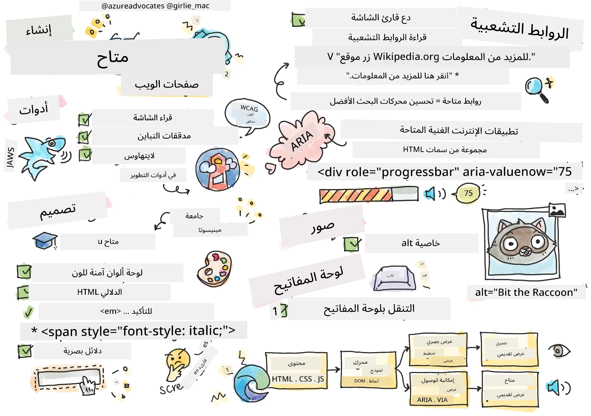
> رسم توضيحي بواسطة [تومومي إيمورا](https://twitter.com/girlie_mac)

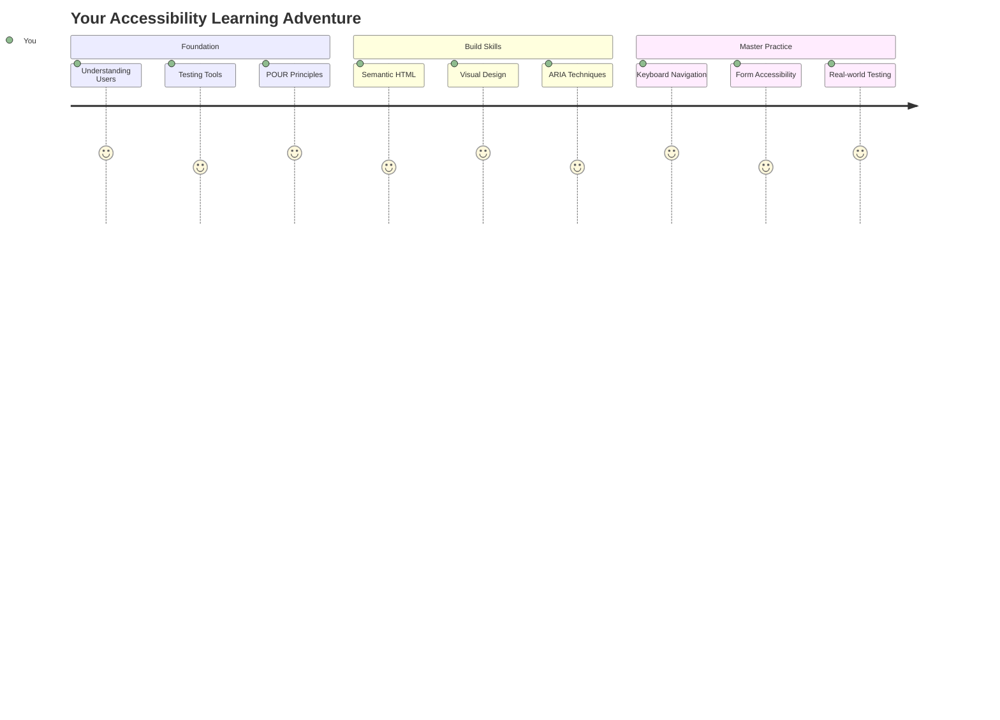

## اختبار ما قبل المحاضرة
[اختبار ما قبل المحاضرة](https://ff-quizzes.netlify.app/web/)

> قوة الويب تكمن في عالميته. الوصول للجميع بغض النظر عن الإعاقة هو جانب أساسي.
>
> \- السير تيموثي بيرنرز لي، مدير W3C ومخترع شبكة الإنترنت العالمية

إليك شيئًا قد يفاجئك: عندما تقوم ببناء مواقع ويب ميسرة، فأنت لا تساعد فقط الأشخاص ذوي الإعاقة - بل تجعل الويب أفضل للجميع!

هل لاحظت تلك المنحدرات عند زوايا الشوارع؟ تم تصميمها في الأصل للكراسي المتحركة، لكنها الآن تساعد الأشخاص الذين يستخدمون عربات الأطفال، وعمال التوصيل الذين يستخدمون العربات، والمسافرين الذين يحملون حقائب بعجلات، وحتى راكبي الدراجات. هذا بالضبط ما تفعله تصميمات الويب الميسرة - الحلول التي تساعد مجموعة واحدة غالبًا ما تفيد الجميع. رائع، أليس كذلك؟

في هذه الدرس، سنستكشف كيفية إنشاء مواقع ويب تعمل حقًا للجميع، بغض النظر عن كيفية تصفحهم للويب. ستكتشف تقنيات عملية مدمجة بالفعل في معايير الويب، وستتعرف على أدوات الاختبار، وسترى كيف تجعل إمكانية الوصول مواقعك أكثر سهولة لجميع المستخدمين.

بنهاية هذا الدرس، ستكون لديك الثقة لجعل إمكانية الوصول جزءًا طبيعيًا من سير عمل التطوير الخاص بك. جاهز لاستكشاف كيف يمكن للاختيارات التصميمية المدروسة أن تفتح الويب لمليارات المستخدمين؟ لنبدأ!

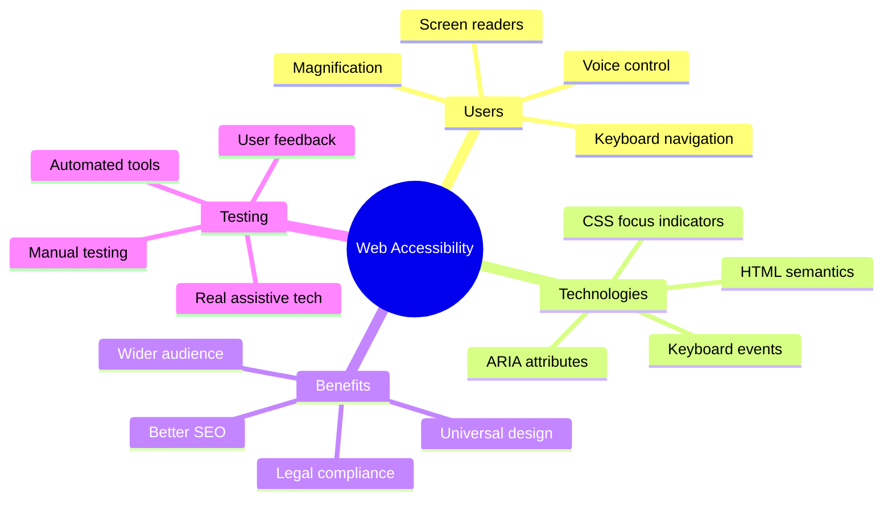

> يمكنك أخذ هذا الدرس على [Microsoft Learn](https://docs.microsoft.com/learn/modules/web-development-101/accessibility/?WT.mc_id=academic-77807-sagibbon)!

## فهم تقنيات المساعدة

قبل أن نبدأ في البرمجة، دعونا نأخذ لحظة لفهم كيف يتفاعل الأشخاص ذوو القدرات المختلفة مع الويب. هذا ليس مجرد نظرية - فهم أنماط التنقل الواقعية هذه سيجعلك مطورًا أفضل بكثير!

تقنيات المساعدة هي أدوات مذهلة تساعد الأشخاص ذوي الإعاقة على التفاعل مع مواقع الويب بطرق قد تفاجئك. بمجرد أن تتقن كيفية عمل هذه التقنيات، يصبح إنشاء تجارب ويب ميسرة أكثر سهولة. إنه مثل تعلم رؤية الكود الخاص بك من خلال عيون شخص آخر.

### قارئات الشاشة

[قارئات الشاشة](https://en.wikipedia.org/wiki/Screen_reader) هي تقنيات متقدمة تحول النص الرقمي إلى صوت أو إخراج بطريقة برايل. بينما تُستخدم بشكل أساسي من قبل الأشخاص ذوي الإعاقات البصرية، فهي مفيدة أيضًا للمستخدمين الذين يعانون من صعوبات التعلم مثل عسر القراءة.

أحب أن أفكر في قارئ الشاشة كأنه راوي ذكي يقرأ كتابًا لك. يقرأ المحتوى بصوت عالٍ بترتيب منطقي، ويعلن عن العناصر التفاعلية مثل "زر" أو "رابط"، ويوفر اختصارات لوحة المفاتيح للتنقل في الصفحة. ولكن هناك شيء مهم - يمكن لقارئات الشاشة أن تعمل بسحرها فقط إذا قمنا ببناء مواقع ويب ذات هيكل مناسب ومحتوى ذو معنى. وهنا يأتي دورك كمطور!

**قارئات الشاشة الشهيرة عبر المنصات:**
- **Windows**: [NVDA](https://www.nvaccess.org/about-nvda/) (مجاني والأكثر شعبية)، [JAWS](https://webaim.org/articles/jaws/)، [Narrator](https://support.microsoft.com/windows/complete-guide-to-narrator-e4397a0d-ef4f-b386-d8ae-c172f109bdb1/?WT.mc_id=academic-77807-sagibbon) (مضمن)
- **macOS/iOS**: [VoiceOver](https://support.apple.com/guide/voiceover/welcome/10) (مضمن وقوي جدًا)
- **Android**: [TalkBack](https://support.google.com/accessibility/android/answer/6283677) (مضمن)
- **Linux**: [Orca](https://wiki.gnome.org/Projects/Orca) (مجاني ومفتوح المصدر)

**كيف تتنقل قارئات الشاشة في محتوى الويب:**

توفر قارئات الشاشة طرقًا متعددة للتنقل تجعل التصفح فعالًا للمستخدمين ذوي الخبرة:
- **القراءة المتسلسلة**: قراءة المحتوى من الأعلى إلى الأسفل، مثل متابعة كتاب
- **التنقل عبر المعالم**: الانتقال بين أقسام الصفحة (الرأس، التنقل، الرئيسي، التذييل)
- **التنقل عبر العناوين**: الانتقال بين العناوين لفهم هيكل الصفحة
- **قوائم الروابط**: إنشاء قائمة بجميع الروابط للوصول السريع
- **عناصر التحكم في النماذج**: التنقل مباشرة بين حقول الإدخال والأزرار

> 💡 **شيء أذهلني**: 68% من مستخدمي قارئات الشاشة يتنقلون بشكل أساسي عبر العناوين ([استطلاع WebAIM](https://webaim.org/projects/screenreadersurvey9/#finding)). هذا يعني أن هيكل العناوين الخاص بك يشبه خارطة طريق للمستخدمين - عندما تقوم بذلك بشكل صحيح، فإنك تساعد الناس حرفيًا في العثور على طريقهم حول المحتوى الخاص بك بشكل أسرع!

### بناء سير عمل الاختبار الخاص بك

إليك بعض الأخبار الجيدة - اختبار إمكانية الوصول الفعال لا يجب أن يكون مرهقًا! سترغب في الجمع بين الأدوات الآلية (فهي رائعة في اكتشاف المشكلات الواضحة) وبعض الاختبارات اليدوية. إليك نهجًا منهجيًا وجدته يكتشف معظم المشكلات دون أن يستهلك يومك بالكامل:

**سير عمل الاختبار اليدوي الأساسي:**

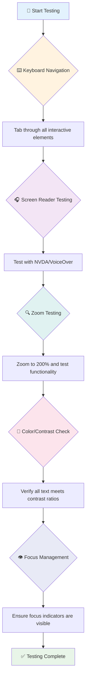

**قائمة التحقق خطوة بخطوة للاختبار:**
1. **التنقل باستخدام لوحة المفاتيح**: استخدم فقط Tab، Shift+Tab، Enter، Space، ومفاتيح الأسهم
2. **اختبار قارئ الشاشة**: قم بتشغيل NVDA أو VoiceOver أو Narrator وتصفح مع إغلاق عينيك
3. **اختبار التكبير**: اختبر عند مستويات تكبير 200% و400%
4. **التحقق من تباين الألوان**: تحقق من جميع النصوص ومكونات واجهة المستخدم
5. **اختبار مؤشر التركيز**: تأكد من أن جميع العناصر التفاعلية لديها حالات تركيز مرئية

✅ **ابدأ بـ Lighthouse**: افتح أدوات المطور في متصفحك، قم بتشغيل تدقيق إمكانية الوصول في Lighthouse، ثم استخدم النتائج لتوجيه مناطق التركيز في الاختبار اليدوي.

### أدوات التكبير والتصغير

تعرف كيف تقوم أحيانًا بتكبير النص على هاتفك عندما يكون صغيرًا جدًا، أو تحاول قراءة شاشة الكمبيوتر المحمول في ضوء الشمس الساطع؟ يعتمد العديد من المستخدمين على أدوات التكبير لجعل المحتوى قابلاً للقراءة كل يوم. يشمل ذلك الأشخاص ذوي الرؤية الضعيفة، وكبار السن، وأي شخص حاول قراءة موقع ويب في الهواء الطلق.

تطورت تقنيات التكبير الحديثة إلى ما هو أبعد من مجرد جعل الأشياء أكبر. فهم كيفية عمل هذه الأدوات سيساعدك على إنشاء تصميمات متجاوبة تظل وظيفية وجذابة عند أي مستوى تكبير.

**قدرات التكبير الحديثة في المتصفحات:**
- **تكبير الصفحة**: يوسع كل المحتوى بشكل متناسب (النصوص، الصور، التخطيط) - هذه هي الطريقة المفضلة
- **تكبير النص فقط**: يزيد حجم الخط مع الحفاظ على التخطيط الأصلي
- **التكبير بالقرص**: دعم الإيماءات على الأجهزة المحمولة للتكبير المؤقت
- **دعم المتصفحات**: جميع المتصفحات الحديثة تدعم التكبير حتى 500% دون كسر الوظائف

**برامج التكبير المتخصصة:**
- **Windows**: [Magnifier](https://support.microsoft.com/windows/use-magnifier-to-make-things-on-the-screen-easier-to-see-414948ba-8b1c-d3bd-8615-0e5e32204198) (مضمن)، [ZoomText](https://www.freedomscientific.com/training/zoomtext/getting-started/)
- **macOS/iOS**: [Zoom](https://www.apple.com/accessibility/mac/vision/) (مضمن مع ميزات متقدمة)

> ⚠️ **اعتبار التصميم**: يتطلب WCAG أن يظل المحتوى وظيفيًا عند تكبيره إلى 200%. عند هذا المستوى، يجب أن يكون التمرير الأفقي محدودًا، ويجب أن تظل جميع العناصر التفاعلية قابلة للوصول.

✅ **اختبر تصميمك المتجاوب**: قم بتكبير متصفحك إلى 200% و400%. هل يتكيف التخطيط الخاص بك بشكل جيد؟ هل يمكنك الوصول إلى جميع الوظائف دون تمرير مفرط؟

## أدوات اختبار إمكانية الوصول الحديثة

الآن بعد أن فهمت كيف يتنقل الناس في الويب باستخدام تقنيات المساعدة، دعونا نستكشف الأدوات التي تساعدك في بناء واختبار مواقع ويب ميسرة.

فكر في الأمر بهذه الطريقة: الأدوات الآلية رائعة في اكتشاف المشكلات الواضحة (مثل النصوص البديلة المفقودة)، بينما يساعدك الاختبار اليدوي في ضمان أن موقعك يشعر بالراحة في الاستخدام في العالم الحقيقي. معًا، يمنحك الثقة بأن مواقعك تعمل للجميع.

### اختبار تباين الألوان

إليك بعض الأخبار الجيدة: تباين الألوان هو أحد أكثر مشكلات إمكانية الوصول شيوعًا، ولكنه أيضًا من أسهل المشكلات التي يمكن إصلاحها. التباين الجيد يفيد الجميع - من المستخدمين ذوي الإعاقات البصرية إلى الأشخاص الذين يحاولون قراءة هواتفهم على الشاطئ.

**متطلبات تباين WCAG:**

| نوع النص | WCAG AA (الحد الأدنى) | WCAG AAA (المعزز) |
|-----------|-------------------|---------------------|
| **النص العادي** (أقل من 18pt) | نسبة تباين 4.5:1 | نسبة تباين 7:1 |
| **النص الكبير** (18pt+ أو 14pt+ بخط عريض) | نسبة تباين 3:1 | نسبة تباين 4.5:1 |
| **مكونات واجهة المستخدم** (الأزرار، حدود النماذج) | نسبة تباين 3:1 | نسبة تباين 3:1 |

**أدوات الاختبار الأساسية:**
- [Colour Contrast Analyser](https://www.tpgi.com/color-contrast-checker/) - تطبيق سطح المكتب مع منتقي الألوان
- [WebAIM Contrast Checker](https://webaim.org/resources/contrastchecker/) - أداة ويب مع ردود فعل فورية
- [Stark](https://www.getstark.co/) - إضافة أدوات التصميم لـ Figma، Sketch، Adobe XD
- [Accessible Colors](https://accessible-colors.com/) - العثور على لوحات ألوان ميسرة

✅ **قم ببناء لوحات ألوان أفضل**: ابدأ بألوان العلامة التجارية الخاصة بك واستخدم أدوات التباين لإنشاء تنويعات ميسرة. قم بتوثيق هذه كرموز ألوان ميسرة لنظام التصميم الخاص بك.

### التدقيق الشامل لإمكانية الوصول

أكثر طرق اختبار إمكانية الوصول فعالية تجمع بين عدة أساليب. لا توجد أداة واحدة تكتشف كل شيء، لذا فإن بناء روتين اختبار باستخدام طرق متنوعة يضمن تغطية شاملة.

**اختبار قائم على المتصفح (مضمن في أدوات المطور):**
- **Chrome/Edge**: تدقيق إمكانية الوصول في Lighthouse + لوحة إمكانية الوصول
- **Firefox**: مفتش إمكانية الوصول مع عرض شجرة مفصل
- **Safari**: علامة التدقيق في Web Inspector مع محاكاة VoiceOver

**إضافات الاختبار الاحترافية:**
- [axe DevTools](https://www.deque.com/axe/devtools/) - اختبار آلي قياسي في الصناعة
- [WAVE](https://wave.webaim.org/extension/) - ردود فعل مرئية مع تسليط الضوء على الأخطاء
- [Accessibility Insights](https://accessibilityinsights.io/) - مجموعة اختبار شاملة من Microsoft

**التكامل مع سطر الأوامر وCI/CD:**
- [axe-core](https://github.com/dequelabs/axe-core) - مكتبة JavaScript للاختبار الآلي
- [Pa11y](https://pa11y.org/) - أداة اختبار إمكانية الوصول عبر سطر الأوامر
- [Lighthouse CI](https://github.com/GoogleChrome/lighthouse-ci) - تسجيل نقاط إمكانية الوصول تلقائيًا

> 🎯 **هدف الاختبار**: استهدف الحصول على درجة إمكانية الوصول في Lighthouse تبلغ 95+ كخط أساس. تذكر، الأدوات الآلية تكتشف حوالي 30-40% فقط من مشكلات إمكانية الوصول - الاختبار اليدوي لا يزال ضروريًا!

### 🧠 **اختبار المهارات: هل أنت جاهز لاكتشاف المشكلات؟**

**لنرى كيف تشعر بشأن اختبار إمكانية الوصول:**
- أي طريقة اختبار تبدو أكثر سهولة بالنسبة لك الآن؟
- هل يمكنك تخيل استخدام التنقل بلوحة المفاتيح فقط ليوم كامل؟
- ما هي إحدى حواجز إمكانية الوصول التي واجهتها شخصيًا عبر الإنترنت؟

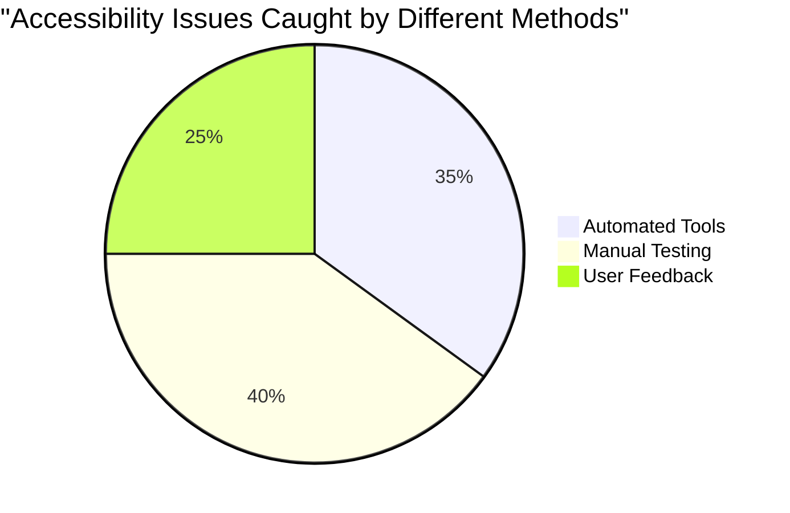

> **تعزيز الثقة**: يستخدم مختبرو إمكانية الوصول المحترفون هذا المزيج بالضبط من الأساليب. أنت تتعلم ممارسات قياسية في الصناعة!

## بناء إمكانية الوصول من البداية

المفتاح لنجاح إمكانية الوصول هو تضمينها في الأساس منذ اليوم الأول. أعلم أنه من المغري التفكير "سأضيف إمكانية الوصول لاحقًا"، لكن هذا يشبه محاولة إضافة منحدر إلى منزل بعد بنائه بالفعل. ممكن؟ نعم. سهل؟ ليس حقًا.

فكر في إمكانية الوصول كالتخطيط لمنزل - من الأسهل بكثير تضمين إمكانية الوصول للكراسي المتحركة في خططك المعمارية الأولية بدلاً من تعديل كل شيء لاحقًا.

### مبادئ POUR: أساس إمكانية الوصول الخاص بك

تستند إرشادات محتوى الويب (WCAG) إلى أربعة مبادئ أساسية تُعرف بـ POUR. لا تقلق - هذه ليست مفاهيم أكاديمية مملة! إنها في الواقع إرشادات عملية لجعل المحتوى يعمل للجميع.

بمجرد أن تتقن POUR، يصبح اتخاذ قرارات إمكانية الوصول أكثر سهولة. إنه مثل وجود قائمة تحقق ذهنية توجه اختياراتك التصميمية. دعونا نوضحها:

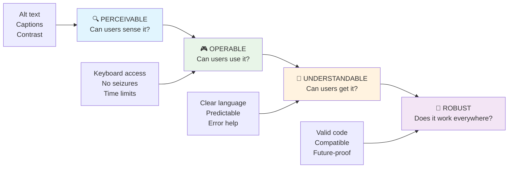

**🔍 قابل للإدراك**: يجب تقديم المعلومات بطرق يمكن للمستخدمين إدراكها من خلال حواسهم المتاحة

- توفير بدائل نصية للمحتوى غير النصي (الصور، الفيديوهات، الصوت)
- ضمان تباين ألوان كافٍ لجميع النصوص ومكونات واجهة المستخدم
- تقديم تسميات توضيحية ونصوص للمحتوى متعدد الوسائط
- تصميم محتوى يظل وظيفيًا عند تكبيره حتى 200%
- استخدام خصائص حسية متعددة (ليس فقط اللون) لنقل المعلومات

**🎮 قابل للتشغيل**: يجب أن تكون جميع مكونات الواجهة قابلة للتشغيل من خلال طرق الإدخال المتاحة

- جعل جميع الوظائف قابلة للوصول عبر التنقل بلوحة المفاتيح
- توفير وقت كافٍ للمستخدمين لقراءة والتفاعل مع المحتوى
- تجنب المحتوى الذي يسبب نوبات أو اضطرابات في الجهاز الدهليزي
- مساعدة المستخدمين على التنقل بكفاءة من خلال هيكل واضح ومعالم
- ضمان أن العناصر التفاعلية لديها أحجام أهداف كافية (44px كحد أدنى)

**📖 مفهوم**: يجب أن تكون المعلومات وتشغيل واجهة المستخدم واضحة ومفهومة

- استخدام لغة واضحة وبسيطة مناسبة لجمهورك
- ضمان ظهور المحتوى وتشغيله بطرق متوقعة ومتسقة
- تقديم تعليمات واضحة ورسائل خطأ لإدخال المستخدم
- مساعدة المستخدمين على فهم وتصحيح الأخطاء في النماذج
- تنظيم المحتوى بترتيب قراءة منطقي وتسلسل هرمي للمعلومات

**💪 قوي**: يجب أن يعمل المحتوى بشكل موثوق عبر التقنيات المختلفة والأجهزة المساعدة

- **استخدام HTML صالح ودلالي كأساس**
- **ضمان التوافق مع التقنيات المساعدة الحالية والمستقبلية**
- **اتباع معايير الويب وأفضل الممارسات للترميز**
- **اختبر عبر متصفحات وأجهزة وأدوات مساعدة مختلفة**
- **هيكل المحتوى بحيث يتدهور بشكل سلس عندما لا تكون الميزات المتقدمة مدعومة**

### 🎯 **مراجعة مبادئ POUR: اجعلها ثابتة**

**تفكير سريع في الأساسيات:**
- هل يمكنك التفكير في ميزة موقع ويب تفشل في كل مبدأ من مبادئ POUR؟
- أي مبدأ يبدو أكثر طبيعية بالنسبة لك كمطور؟
- كيف يمكن لهذه المبادئ تحسين التصميم للجميع، وليس فقط للمستخدمين ذوي الإعاقة؟

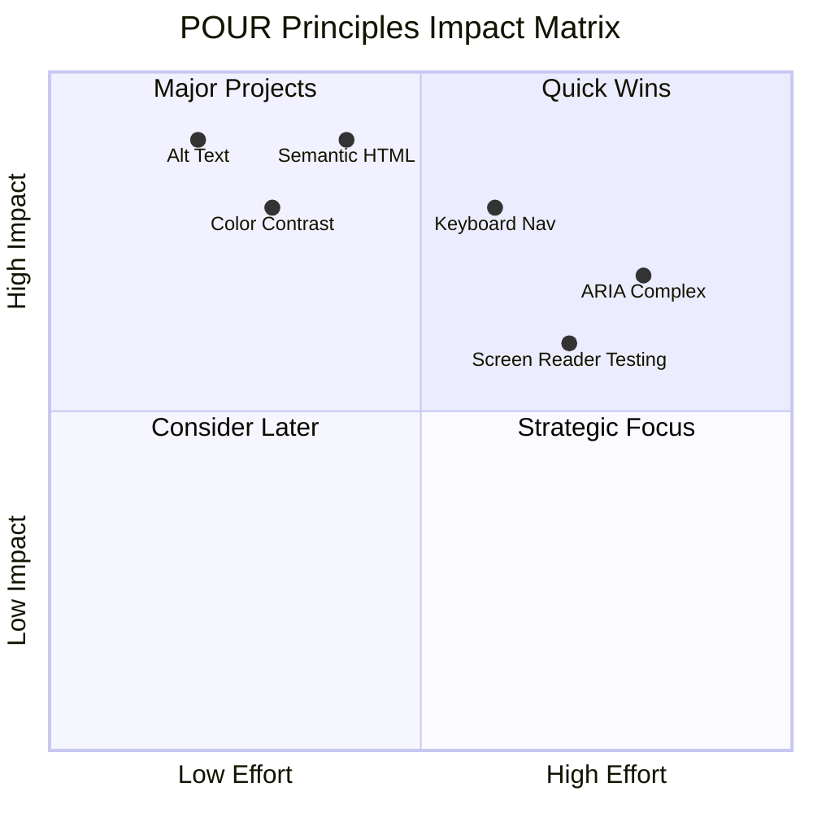

> **تذكر**: ابدأ بتحسينات ذات تأثير كبير وجهد منخفض. يمنحك HTML الدلالي والنص البديل أكبر دفعة في إمكانية الوصول بأقل جهد!

## إنشاء تصميم بصري يمكن الوصول إليه

التصميم البصري الجيد وإمكانية الوصول يسيران جنبًا إلى جنب. عندما تصمم مع مراعاة إمكانية الوصول، غالبًا ما تكتشف أن هذه القيود تؤدي إلى حلول أنظف وأكثر أناقة تفيد جميع المستخدمين.

دعونا نستكشف كيفية إنشاء تصميمات جذابة بصريًا تعمل للجميع، بغض النظر عن قدراتهم البصرية أو الظروف التي يشاهدون فيها المحتوى الخاص بك.

### استراتيجيات اللون وإمكانية الوصول البصري

اللون قوي للتواصل، لكنه لا يجب أن يكون الطريقة الوحيدة التي تنقل بها المعلومات المهمة. التصميم بما يتجاوز اللون يخلق تجارب أكثر قوة وشمولية تعمل في المزيد من المواقف.

**التصميم للاختلافات في رؤية الألوان:**

حوالي 8% من الرجال و0.5% من النساء لديهم نوع من اختلاف رؤية الألوان (غالبًا ما يُطلق عليه "عمى الألوان"). الأنواع الأكثر شيوعًا هي:
- **Deuteranopia**: صعوبة في التمييز بين الأحمر والأخضر
- **Protanopia**: يظهر اللون الأحمر أكثر خفوتًا
- **Tritanopia**: صعوبة مع الأزرق والأصفر (نادر)

**استراتيجيات اللون الشاملة:**

```css
/* ❌ Bad: Using only color to indicate status */
.error { color: red; }
.success { color: green; }

/* ✅ Good: Color plus icons and context */
.error {
  color: #d32f2f;
  border-left: 4px solid #d32f2f;
}
.error::before {
  content: "⚠️";
  margin-right: 8px;
}

.success {
  color: #2e7d32;
  border-left: 4px solid #2e7d32;
}
.success::before {
  content: "✅";
  margin-right: 8px;
}
```

**ما وراء متطلبات التباين الأساسية:**
- اختبر اختياراتك للألوان باستخدام محاكيات عمى الألوان
- استخدم الأنماط أو القوام أو الأشكال بجانب ترميز الألوان
- تأكد من أن الحالات التفاعلية تظل قابلة للتمييز بدون اللون
- فكر في كيفية ظهور تصميمك في وضع التباين العالي

✅ **اختبر إمكانية الوصول للألوان**: استخدم أدوات مثل [Coblis](https://www.color-blindness.com/coblis-color-blindness-simulator/) لترى كيف يظهر موقعك للمستخدمين الذين لديهم أنواع مختلفة من رؤية الألوان.

### مؤشرات التركيز وتصميم التفاعل

مؤشرات التركيز هي المكافئ الرقمي للمؤشر - فهي تظهر للمستخدمين الذين يستخدمون لوحة المفاتيح مكان وجودهم على الصفحة. تعزز مؤشرات التركيز المصممة جيدًا التجربة للجميع من خلال جعل التفاعلات واضحة ويمكن التنبؤ بها.

**أفضل ممارسات مؤشرات التركيز الحديثة:**

```css
/* Enhanced focus styles that work across browsers */
button:focus-visible {
  outline: 2px solid #0066cc;
  outline-offset: 2px;
  box-shadow: 0 0 0 4px rgba(0, 102, 204, 0.25);
}

/* Remove focus outline for mouse users, preserve for keyboard users */
button:focus:not(:focus-visible) {
  outline: none;
}

/* Focus-within for complex components */
.card:focus-within {
  box-shadow: 0 0 0 3px rgba(74, 144, 164, 0.5);
  border-color: #4A90A4;
}

/* Ensure focus indicators meet contrast requirements */
.custom-focus:focus-visible {
  outline: 3px solid #ffffff;
  outline-offset: 2px;
  box-shadow: 0 0 0 6px #000000;
}
```

**متطلبات مؤشرات التركيز:**
- **الرؤية**: يجب أن يكون لها نسبة تباين لا تقل عن 3:1 مع العناصر المحيطة
- **العرض**: سمك لا يقل عن 2 بكسل حول العنصر بالكامل
- **الاستمرارية**: يجب أن تظل مرئية حتى ينتقل التركيز إلى مكان آخر
- **التمييز**: يجب أن تكون مختلفة بصريًا عن حالات واجهة المستخدم الأخرى

> 💡 **نصيحة تصميم**: غالبًا ما تستخدم مؤشرات التركيز الرائعة مزيجًا من الخطوط الخارجية، الظل، وتغييرات اللون لضمان الرؤية عبر خلفيات وسياقات مختلفة.

✅ **قم بمراجعة مؤشرات التركيز**: تنقل عبر موقعك باستخدام لوحة المفاتيح ولاحظ العناصر التي تحتوي على مؤشرات تركيز واضحة. هل هناك أي عناصر يصعب رؤيتها أو مفقودة تمامًا؟

### HTML الدلالي: أساس إمكانية الوصول

HTML الدلالي يشبه إعطاء تقنيات المساعدة نظام GPS لموقعك على الويب. عندما تستخدم العناصر الصحيحة لـ HTML لغرضها المقصود، فإنك تقدم للقراء الشاشة ولوحات المفاتيح والأدوات الأخرى خارطة طريق مفصلة لمساعدة المستخدمين على التنقل بفعالية.

إليك تشبيهًا حقًا أثر فيني: HTML الدلالي هو الفرق بين مكتبة منظمة جيدًا مع فئات واضحة ولافتات مفيدة مقابل مستودع حيث الكتب متناثرة بشكل عشوائي. كلا المكانين يحتويان على نفس الكتب، ولكن أيهما تفضل أن تحاول العثور على شيء فيه؟ بالضبط!

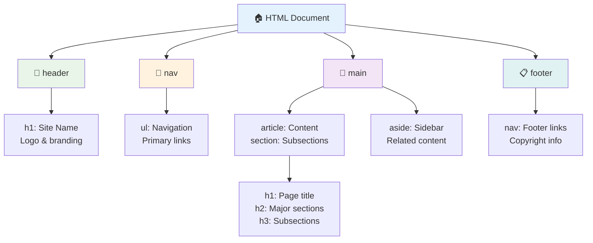

**أسس هيكل الصفحة القابل للوصول:**

```html
<!-- Landmark elements provide page navigation structure -->
<header>
  <h1>Your Site Name</h1>
  <nav aria-label="Main navigation">
    <ul>
      <li><a href="/home">Home</a></li>
      <li><a href="/about">About</a></li>
      <li><a href="/services">Services</a></li>
    </ul>
  </nav>
</header>

<main>
  <article>
    <header>
      <h1>Article Title</h1>
      <p>Published on <time datetime="2024-10-14">October 14, 2024</time></p>
    </header>
    
    <section>
      <h2>First Section</h2>
      <p>Content that relates to this section...</p>
    </section>
    
    <section>
      <h2>Second Section</h2>
      <p>More related content...</p>
    </section>
  </article>
  
  <aside>
    <h2>Related Links</h2>
    <nav aria-label="Related articles">
      <ul>
        <li><a href="/related-1">First related article</a></li>
        <li><a href="/related-2">Second related article</a></li>
      </ul>
    </nav>
  </aside>
</main>

<footer>
  <p>&copy; 2024 Your Site Name. All rights reserved.</p>
  <nav aria-label="Footer links">
    <ul>
      <li><a href="/privacy">Privacy Policy</a></li>
      <li><a href="/contact">Contact Us</a></li>
    </ul>
  </nav>
</footer>
```

**لماذا يحول HTML الدلالي إمكانية الوصول:**

| العنصر الدلالي | الغرض | فائدة قارئ الشاشة |
|------------------|---------|----------------------|
| `<header>` | رأس الصفحة أو القسم | "معلم البانر" - التنقل السريع إلى الأعلى |
| `<nav>` | روابط التنقل | "معلم التنقل" - قائمة أقسام التنقل |
| `<main>` | المحتوى الأساسي للصفحة | "معلم الرئيسي" - الانتقال مباشرة إلى المحتوى |
| `<article>` | محتوى مستقل | يعلن حدود المقالة |
| `<section>` | مجموعات محتوى ذات موضوع | يوفر هيكل المحتوى |
| `<aside>` | محتوى الشريط الجانبي ذي الصلة | "معلم تكميلي" |
| `<footer>` | تذييل الصفحة أو القسم | "معلم معلومات المحتوى" |

**قدرات قارئ الشاشة مع HTML الدلالي:**
- **التنقل بين المعالم**: الانتقال بين أقسام الصفحة الرئيسية فورًا
- **مخططات العناوين**: إنشاء جدول محتويات من هيكل العناوين الخاص بك
- **قوائم العناصر**: إنشاء قوائم بجميع الروابط، الأزرار، أو عناصر التحكم في النماذج
- **وعي السياق**: فهم العلاقات بين أقسام المحتوى

> 🎯 **اختبار سريع**: حاول التنقل في موقعك باستخدام قارئ الشاشة باستخدام اختصارات المعالم (D للمعلم، H للعنوان، K للرابط في NVDA/JAWS). هل التنقل منطقي؟

### 🏗️ **مراجعة إتقان HTML الدلالي: بناء أساس قوي**

**دعونا نقيم فهمك الدلالي:**
- هل يمكنك تحديد المعالم على صفحة ويب بمجرد النظر إلى HTML؟
- كيف تشرح الفرق بين `<section>` و `<div>` لصديق؟
- ما هو أول شيء ستتحقق منه إذا أبلغ مستخدم قارئ الشاشة عن مشاكل في التنقل؟

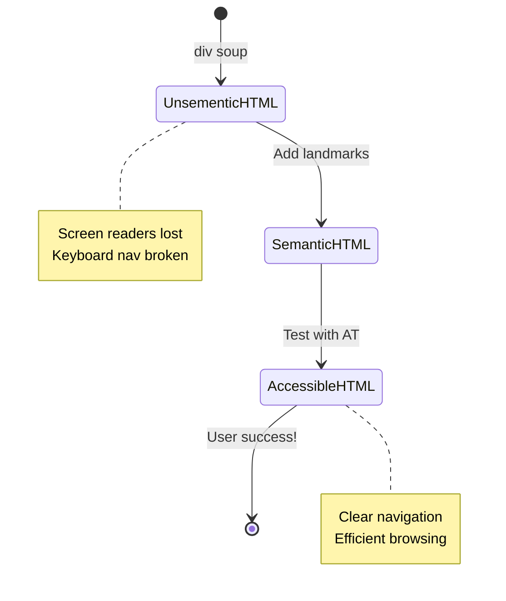

> **نصيحة احترافية**: HTML الدلالي الجيد يحل حوالي 70% من مشاكل إمكانية الوصول تلقائيًا. أتقن هذا الأساس وستكون في طريقك الصحيح!

✅ **قم بمراجعة هيكلك الدلالي**: استخدم لوحة إمكانية الوصول في أدوات المطور في متصفحك لعرض شجرة إمكانية الوصول والتأكد من أن الترميز الخاص بك يخلق هيكلًا منطقيًا.

### تسلسل العناوين: إنشاء مخطط محتوى منطقي

العناوين ضرورية للغاية للمحتوى القابل للوصول - إنها مثل العمود الفقري الذي يربط كل شيء معًا. يعتمد مستخدمو قارئ الشاشة بشكل كبير على العناوين لفهم المحتوى والتنقل فيه. فكر في الأمر كأنك تقدم جدول محتويات لصفحتك.

**إليك القاعدة الذهبية للعناوين:**
لا تتخطى المستويات. تقدم دائمًا بشكل منطقي من `<h1>` إلى `<h2>` إلى `<h3>`، وهكذا. تذكر إنشاء مخططات في المدرسة؟ إنها نفس المبدأ تمامًا - لن تقفز من "I. النقطة الرئيسية" مباشرة إلى "C. النقطة الفرعية الفرعية" دون وجود "A. النقطة الفرعية" بينهما، أليس كذلك؟

**مثال على هيكل العناوين المثالي:**

```html
<!-- ✅ Excellent: Logical, hierarchical progression -->
<main>
  <h1>Complete Guide to Web Accessibility</h1>
  
  <section>
    <h2>Understanding Screen Readers</h2>
    <p>Introduction to screen reader technology...</p>
    
    <h3>Popular Screen Reader Software</h3>
    <p>NVDA, JAWS, and VoiceOver comparison...</p>
    
    <h3>Testing with Screen Readers</h3>
    <p>Step-by-step testing instructions...</p>
  </section>
  
  <section>
    <h2>Color and Contrast Guidelines</h2>
    <p>Designing with sufficient contrast...</p>
    
    <h3>WCAG Contrast Requirements</h3>
    <p>Understanding the different contrast levels...</p>
    
    <h3>Testing Tools and Techniques</h3>
    <p>Tools for verifying contrast ratios...</p>
  </section>
</main>
```

```html
<!-- ❌ Problematic: Skipping levels, inconsistent structure -->
<h1>Page Title</h1>
<h3>Subsection</h3> <!-- Skipped h2 -->
<h2>This should come before h3</h2>
<h1>Another main heading?</h1> <!-- Multiple h1s -->
```

**أفضل ممارسات العناوين:**
- **واحد `<h1>` لكل صفحة**: عادةً عنوان الصفحة الرئيسي أو عنوان المحتوى الأساسي
- **تقدم منطقي**: لا تتخطى المستويات (h1 → h2 → h3، وليس h1 → h3)
- **محتوى وصفي**: اجعل العناوين ذات معنى عند قراءتها خارج السياق
- **تنسيق بصري باستخدام CSS**: استخدم CSS للمظهر، ومستويات HTML للهيكل

**إحصائيات التنقل باستخدام قارئ الشاشة:**
- 68% من مستخدمي قارئ الشاشة يتنقلون باستخدام العناوين ([WebAIM Survey](https://webaim.org/projects/screenreadersurvey9/#finding))
- يتوقع المستخدمون العثور على مخطط عناوين منطقي
- توفر العناوين أسرع طريقة لفهم هيكل الصفحة

> 💡 **نصيحة احترافية**: استخدم إضافات المتصفح مثل "HeadingsMap" لتصور هيكل العناوين الخاص بك. يجب أن يقرأ مثل جدول محتويات منظم جيدًا.

✅ **اختبر هيكل العناوين الخاص بك**: استخدم التنقل بالعناوين في قارئ الشاشة (مفتاح H في NVDA) للتنقل عبر العناوين. هل التقدم يروي قصة المحتوى الخاص بك بشكل منطقي؟

### تقنيات إمكانية الوصول البصرية المتقدمة

ما وراء أساسيات التباين واللون، هناك تقنيات متطورة تساعد في إنشاء تجارب بصرية شاملة حقًا. تضمن هذه الأساليب أن يعمل المحتوى الخاص بك عبر ظروف المشاهدة المختلفة وتقنيات المساعدة.

**استراتيجيات التواصل البصري الأساسية:**

- **ردود الفعل متعددة الوسائط**: الجمع بين الإشارات البصرية والنصية وأحيانًا الصوتية
- **الإفصاح التدريجي**: تقديم المعلومات في أجزاء قابلة للهضم
- **أنماط التفاعل المتسقة**: استخدام تقاليد واجهة المستخدم المألوفة
- **الطباعة المستجيبة**: ضبط حجم النص بشكل مناسب عبر الأجهزة
- **حالات التحميل والخطأ**: تقديم ردود فعل واضحة لجميع الإجراءات

**أدوات CSS لتحسين إمكانية الوصول:**

```css
/* Screen reader only text - visually hidden but accessible */
.sr-only {
  position: absolute;
  width: 1px;
  height: 1px;
  padding: 0;
  margin: -1px;
  overflow: hidden;
  clip: rect(0, 0, 0, 0);
  white-space: nowrap;
  border: 0;
}

/* Skip link for keyboard navigation */
.skip-link {
  position: absolute;
  top: -40px;
  left: 6px;
  background: #000000;
  color: #ffffff;
  padding: 8px 16px;
  text-decoration: none;
  border-radius: 4px;
  font-weight: bold;
  transition: top 0.3s ease;
  z-index: 1000;
}

.skip-link:focus {
  top: 6px;
}

/* Reduced motion respect */
@media (prefers-reduced-motion: reduce) {
  .skip-link {
    transition: none;
  }
  
  * {
    animation-duration: 0.01ms !important;
    animation-iteration-count: 1 !important;
    transition-duration: 0.01ms !important;
  }
}

/* High contrast mode support */
@media (prefers-contrast: high) {
  .button {
    border: 2px solid;
  }
}
```

> 🎯 **نمط إمكانية الوصول**: "رابط التخطي" ضروري لمستخدمي لوحة المفاتيح. يجب أن يكون العنصر الأول القابل للتركيز على صفحتك وينتقل مباشرة إلى منطقة المحتوى الرئيسي.

✅ **قم بتنفيذ تخطي التنقل**: أضف روابط التخطي إلى صفحاتك واختبرها بالضغط على Tab بمجرد تحميل الصفحة. يجب أن تظهر وتسمح لك بالقفز إلى المحتوى الرئيسي.

## صياغة نصوص روابط ذات معنى

الروابط هي الطرق السريعة للويب، لكن النصوص الروابط المكتوبة بشكل سيء تشبه وجود علامات طرق تقول فقط "مكان" بدلاً من "وسط مدينة شيكاغو". ليست مفيدة جدًا، أليس كذلك؟

إليك شيء أدهشني عندما علمت به لأول مرة: يمكن لقارئات الشاشة استخراج جميع الروابط من صفحة وعرضها كقائمة كبيرة واحدة. تخيل لو أعطاك شخص دليلًا لكل رابط على صفحتك. هل كل واحد منهم منطقي بمفرده؟ هذا هو الاختبار الذي يجب أن يجتازه نص الرابط الخاص بك!

### فهم أنماط التنقل عبر الروابط

توفر قارئات الشاشة ميزات تنقل قوية تعتمد على نصوص الروابط المكتوبة جيدًا:

**طرق التنقل عبر الروابط:**
- **القراءة المتسلسلة**: يتم قراءة الروابط في السياق كجزء من تدفق المحتوى
- **إنشاء قائمة الروابط**: جميع روابط الصفحة مجمعة في دليل قابل للبحث
- **التنقل السريع**: الانتقال بين الروابط باستخدام اختصارات لوحة المفاتيح (K في NVDA)
- **وظيفة البحث**: العثور على روابط محددة عن طريق كتابة نص جزئي

**لماذا السياق مهم:**
عندما يقوم مستخدمو قارئ الشاشة بإنشاء قائمة روابط، فإنهم يرون شيئًا مثل هذا:
- "تحميل التقرير"
- "تعرف على المزيد"
- "اضغط هنا"
- "سياسة الخصوصية"
- "اضغط هنا"

فقط اثنان من هذه الروابط يوفران معلومات مفيدة عند قراءتها خارج السياق!

> 📊 **تأثير المستخدم**: يقوم مستخدمو قارئ الشاشة بمسح قوائم الروابط لفهم محتوى الصفحة بسرعة. النصوص الروابط العامة تجبرهم على العودة إلى سياق كل رابط، مما يبطئ تجربتهم بشكل كبير.

### أخطاء شائعة في نصوص الروابط يجب تجنبها

فهم ما لا يعمل يساعدك على التعرف على مشاكل إمكانية الوصول وإصلاحها في المحتوى الحالي.

**❌ نصوص الروابط العامة التي لا توفر سياقًا:**

```html
<!-- Meaningless when read from a link list -->
<p>Our sustainability efforts are detailed in our recent report. 
   <a href="/sustainability-2024.pdf">Click here</a> to view it.</p>

<!-- Repeated generic text throughout the page -->
<div class="article-card">
  <h3>Web Accessibility Guide</h3>
  <p>Learn the fundamentals...</p>
  <a href="/accessibility-guide">Read more</a>
</div>
<div class="article-card">
  <h3>Color Contrast Tips</h3>
  <p>Improve your design...</p>
  <a href="/color-contrast">Read more</a>
</div>

<!-- URLs as link text (difficult for screen readers to announce) -->
<p>Visit https://www.w3.org/WAI/WCAG21/quickref/ for WCAG guidelines.</p>

<!-- Vague action words -->
<a href="/contact">Go</a> | <a href="/about">See</a> | <a href="/help">View</a>
```

**لماذا تفشل هذه الأنماط:**
- **"اضغط هنا"** لا تخبر المستخدمين شيئًا عن الوجهة
- **"اقرأ المزيد"** مكرر عدة مرات يسبب الارتباك
- **عناوين URL الخام** يصعب على قارئات الشاشة نطقها بوضوح
- **كلمات فردية** مثل "اذهب" أو "شاهد" تفتقر إلى السياق الوصفي

### كتابة نصوص روابط ممتازة

نصوص الروابط الوصفية تفيد الجميع - يمكن للمستخدمين المبصرين مسح الروابط بسرعة، ومستخدمو قارئات الشاشة يفهمون الوجهات فورًا.

**✅ أمثلة على نصوص الروابط الواضحة والوصفية:**

```html
<!-- Descriptive text that explains the destination -->
<p>Our comprehensive <a href="/sustainability-2024.pdf">2024 sustainability report (PDF, 2.1MB)</a> details our environmental initiatives.</p>

<!-- Specific, unique link text for each card -->
<div class="article-card">
  <h3>Web Accessibility Guide</h3>
  <p>Learn the fundamentals of inclusive design...</p>
  <a href="/accessibility-guide">Read our complete web accessibility guide</a>
</div>
<div class="article-card">
  <h3>Color Contrast Tips</h3>
  <p>Improve your design with better color choices...</p>
  <a href="/color-contrast">Explore color contrast best practices</a>
</div>

<!-- Meaningful text instead of raw URLs -->
<p>The <a href="https://www.w3.org/WAI/WCAG21/quickref/">WCAG 2.1 Quick Reference guide</a> provides comprehensive accessibility guidelines.</p>

<!-- Descriptive action links -->
<a href="/contact">Contact our support team</a> | 
<a href="/about">About our company</a> | 
<a href="/help">Get help with your account</a>
```

**أفضل ممارسات نصوص الروابط:**
- **كن محددًا**: "تحميل التقرير المالي الفصلي" مقابل "تحميل"
- **تضمين نوع الملف والحجم**: "(PDF، 1.2MB)" للملفات القابلة للتنزيل
- **ذكر إذا كانت الروابط تفتح خارجيًا**: "(تفتح في نافذة جديدة)" عند الاقتضاء
- **استخدام لغة نشطة**: "اتصل بنا" مقابل "صفحة الاتصال"
- **اجعلها موجزة**: حاول أن تكون بين 2-8 كلمات إن أمكن

### أنماط إمكانية الوصول المتقدمة للروابط

في بعض الأحيان، تتطلب قيود التصميم البصري أو المتطلبات التقنية حلولًا خاصة. إليك تقنيات متطورة لسيناريوهات شائعة صعبة:

**استخدام ARIA للسياق المحسن:**

```html
<!-- When button text must be short but needs more context -->
<a href="/report.pdf" 
   aria-label="Download 2024 annual financial report, PDF format, 2.3MB">
  Download Report
</a>

<!-- When the full context comes from surrounding content -->
<h3 id="sustainability-heading">Sustainability Initiative</h3>
<p>Our efforts to reduce environmental impact...</p>
<a href="/sustainability-details" 
   aria-labelledby="sustainability-heading"
   aria-describedby="sustainability-summary">
  Learn more
</a>
<p id="sustainability-summary">Detailed breakdown of our 2024 environmental goals and achievements</p>
```

**الإشارة إلى أنواع الملفات والوجهات الخارجية:**

```html
<!-- Method 1: Include information in visible link text -->
<a href="/annual-report.pdf">
  Download our 2024 annual report (PDF, 2.3MB)
</a>

<!-- Method 2: Use screen reader-only text for file details -->
<a href="/annual-report.pdf">
  Download our 2024 annual report
  <span class="sr-only">(PDF format, 2.3MB)</span>
</a>

<!-- Method 3: External link indication -->
<a href="https://example.com" 
   target="_blank" 
   aria-describedby="external-link-warning">
  Visit external resource
</a>
<span id="external-link-warning" class="sr-only">
  (opens in new window)
</span>

<!-- Method 4: Using CSS for visual indicators -->
<a href="https://example.com" class="external-link">
  External resource
</a>
```

```css
/* Visual indicator for external links */
.external-link::after {
  content: " ↗";
  font-size: 0.8em;
  color: #666;
}

/* Screen reader announcement for external links */
.external-link::before {
  content: "External link: ";
  position: absolute;
  left: -10000px;
  width: 1px;
  height: 1px;
  overflow: hidden;
}
```

> ⚠️ **هام**: عند استخدام `target="_blank"`، أبلغ المستخدمين دائمًا أن الرابط يفتح في نافذة أو علامة تبويب جديدة. يمكن أن تكون تغييرات التنقل غير المتوقعة مربكة.

✅ **اختبر سياق الرابط الخاص بك**: استخدم أدوات المطور في متصفحك لإنشاء قائمة بجميع الروابط على صفحتك. هل يمكنك فهم الغرض من كل رابط دون أي سياق محيط؟

## ARIA: تعزيز إمكانية الوصول لـ HTML

[تطبيقات الإنترنت الغنية القابلة للوصول (ARIA)](https://developer.mozilla.org/docs/Web/Accessibility/ARIA) تشبه وجود مترجم عالمي بين تطبيقات الويب المعقدة وتقنيات المساعدة. عندما لا يستطيع HTML وحده التعبير عن كل ما تفعله مكوناتك التفاعلية، يتدخل ARIA لسد هذه الفجوات.

أحب أن أفكر في ARIA كإضافة تعليقات مفيدة إلى HTML الخاص بك - مثل تعليمات المسرح في نص مسرحي تساعد الممثلين على فهم أدوارهم وعلاقاتهم.

**إليك القاعدة الأهم حول ARIA**: استخدم دائمًا HTML الدلالي أولاً، ثم أضف ARIA لتعزيزه. فكر في ARIA كالتوابل، وليس الطبق الرئيسي. يجب أن يوضح ويعزز هيكل HTML الخاص بك، ولا يحل محله أبدًا. احصل على هذا الأساس بشكل صحيح أولاً!

### تنفيذ ARIA بشكل استراتيجي

ARIA قوي، ولكن مع القوة تأتي المسؤولية. يمكن أن يجعل ARIA غير الصحيح إمكانية الوصول أسوأ من عدم وجوده على الإطلاق. إليك متى وكيفية استخدامه بفعالية:

**✅ استخدم ARIA عندما:**
- إنشاء أدوات واجهة تفاعلية مخصصة (الأكورديونات، علامات التبويب، الكاروسيل)
- بناء محتوى ديناميكي يتغير دون إعادة تحميل الصفحة
- توفير سياق إضافي للعلاقات المعقدة في واجهة المستخدم
- الإشارة إلى حالات التحميل أو تحديثات المحتوى الحية
- إنشاء واجهات تشبه التطبيقات مع عناصر تحكم مخصصة

**❌ تجنب ARIA عندما:**
- توفر عناصر HTML القياسية الدلالات المطلوبة بالفعل
- لست متأكدًا من كيفية تنفيذه بشكل صحيح
- يكرر المعلومات التي توفرها بالفعل HTML الدلالي
- لم تقم باختباره باستخدام تقنية مساعدة فعلية

> 🎯 **قاعدة ARIA الذهبية**: "لا تغير الدلالات إلا إذا كنت مضطرًا تمامًا، تأكد دائمًا من إمكانية الوصول باستخدام لوحة المفاتيح، واختبر باستخدام تقنية مساعدة حقيقية."
**الفئات الخمس لـ ARIA:**

1. **الأدوار**: ما هو هذا العنصر؟ (`button`, `tab`, `dialog`)
2. **الخصائص**: ما هي ميزاته؟ (`aria-required`, `aria-haspopup`)
3. **الحالات**: ما هي حالته الحالية؟ (`aria-expanded`, `aria-checked`)
4. **المعالم**: أين يقع في هيكل الصفحة؟ (`banner`, `navigation`, `main`)
5. **المناطق الحية**: كيف يجب الإعلان عن التغييرات؟ (`aria-live`, `aria-atomic`)

### أنماط ARIA الأساسية لتطبيقات الويب الحديثة

هذه الأنماط تحل أكثر تحديات الوصول شيوعًا في تطبيقات الويب التفاعلية:

**تسمية العناصر ووصفها:**

```html
<!-- aria-label: Provides accessible name when visible text isn't sufficient -->
<button aria-label="Close newsletter subscription dialog">×</button>

<!-- aria-labelledby: References existing text as the accessible name -->
<section aria-labelledby="news-heading">
  <h2 id="news-heading">Latest News</h2>
  <!-- news content -->
</section>

<!-- aria-describedby: Links to additional descriptive text -->
<input type="password" 
       aria-describedby="pwd-requirements pwd-strength"
       required>
<div id="pwd-requirements">
  Password must contain at least 8 characters, including uppercase, lowercase, and numbers.
</div>
<div id="pwd-strength" aria-live="polite">
  <!-- Dynamic password strength indicator -->
</div>
```

**المناطق الحية للمحتوى الديناميكي:**

```html
<!-- Polite announcements (don't interrupt current speech) -->
<div aria-live="polite" id="status-updates">
  <!-- Status messages appear here -->
</div>

<!-- Assertive announcements (interrupt and announce immediately) -->
<div aria-live="assertive" id="urgent-alerts">
  <!-- Error messages and critical alerts -->
</div>

<!-- Loading states with live regions -->
<button id="submit-btn" aria-describedby="loading-status">
  Submit Application
</button>
<div id="loading-status" aria-live="polite" aria-atomic="true">
  <!-- "Processing your application..." appears here -->
</div>
```

**مثال على عنصر واجهة تفاعلي (الأكورديون):**

```html
<div class="accordion">
  <h3>
    <button aria-expanded="false" 
            aria-controls="panel-1" 
            id="accordion-trigger-1"
            class="accordion-trigger">
      Accessibility Guidelines
    </button>
  </h3>
  <div id="panel-1" 
       role="region"
       aria-labelledby="accordion-trigger-1" 
       hidden>
    <p>WCAG 2.1 provides comprehensive guidelines...</p>
  </div>
</div>
```

```javascript
// JavaScript to manage accordion state
function toggleAccordion(trigger) {
  const panel = document.getElementById(trigger.getAttribute('aria-controls'));
  const isExpanded = trigger.getAttribute('aria-expanded') === 'true';
  
  // Toggle states
  trigger.setAttribute('aria-expanded', !isExpanded);
  panel.hidden = isExpanded;
  
  // Announce change to screen readers
  const status = document.getElementById('status-updates');
  status.textContent = isExpanded ? 'Section collapsed' : 'Section expanded';
}
```

### أفضل ممارسات تنفيذ ARIA

ARIA قوية ولكن تتطلب تنفيذًا دقيقًا. اتباع هذه الإرشادات يساعد في ضمان أن ARIA تعزز الوصول بدلاً من أن تعيقه:

**🛡️ المبادئ الأساسية:**

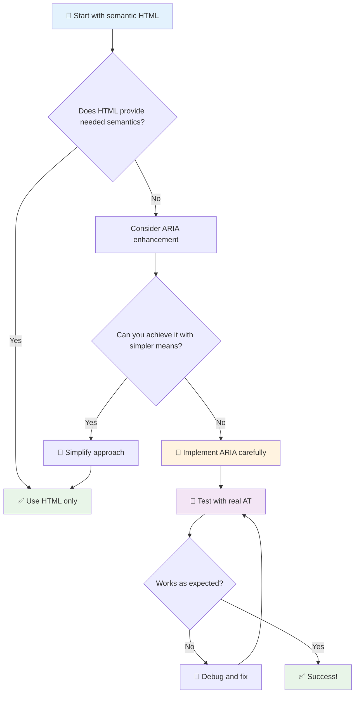

1. **استخدام HTML الدلالي أولاً**: يفضل دائمًا استخدام `<button>` بدلاً من `<div role="button">`
2. **لا تكسر الدلالات**: لا تتجاوز معنى HTML الموجود (تجنب `<h1 role="button">`)
3. **الحفاظ على إمكانية الوصول عبر لوحة المفاتيح**: يجب أن تكون جميع عناصر ARIA التفاعلية قابلة للوصول بالكامل عبر لوحة المفاتيح
4. **اختبار مع المستخدمين الحقيقيين**: دعم ARIA يختلف بشكل كبير بين تقنيات المساعدة
5. **ابدأ ببساطة**: تنفيذ ARIA المعقد أكثر عرضة للأخطاء

**🔍 سير عمل الاختبار:**

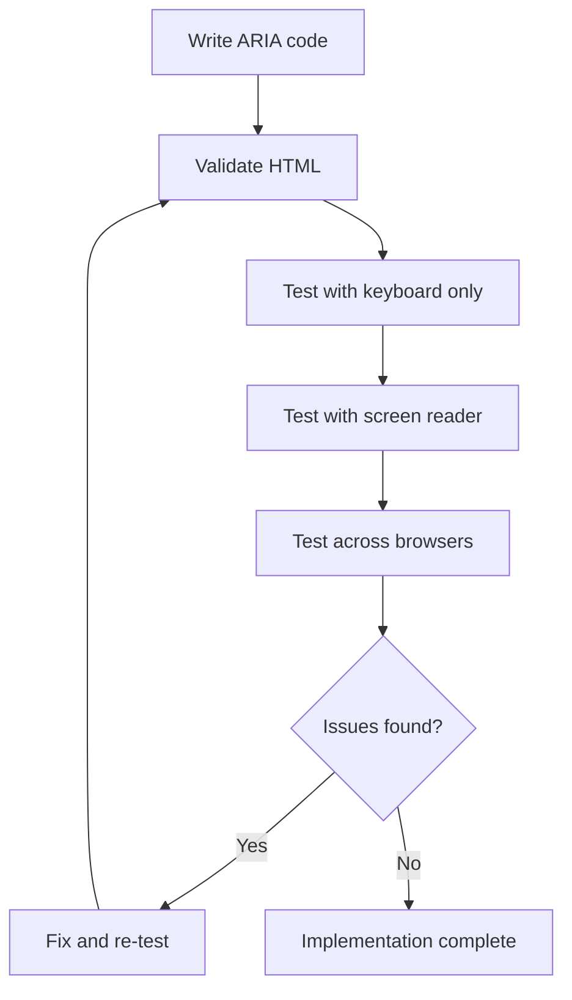

**🚫 أخطاء ARIA الشائعة التي يجب تجنبها:**

- **معلومات متضاربة**: لا تتناقض مع دلالات HTML
- **الإفراط في التسمية**: الكثير من معلومات ARIA يربك المستخدمين
- **ARIA ثابتة**: نسيان تحديث حالات ARIA عند تغيير المحتوى
- **تنفيذ غير مختبر**: ARIA التي تعمل نظريًا ولكن تفشل عمليًا
- **غياب دعم لوحة المفاتيح**: أدوار ARIA بدون تفاعلات لوحة المفاتيح المقابلة

> 💡 **موارد الاختبار**: استخدم أدوات مثل [accessibility-checker](https://www.npmjs.com/package/accessibility-checker) للتحقق التلقائي من صحة ARIA، ولكن اختبر دائمًا باستخدام قارئات الشاشة الحقيقية للحصول على تجربة كاملة.

### 🎭 **اختبار مهارات ARIA: هل أنت جاهز للتفاعلات المعقدة؟**

**قيّم ثقتك بـ ARIA:**
- متى تختار ARIA بدلاً من HTML الدلالي؟ (تلميح: نادرًا جدًا!)
- هل يمكنك شرح لماذا `<div role="button">` عادة أسوأ من `<button>`؟
- ما هو أهم شيء يجب تذكره حول اختبار ARIA؟

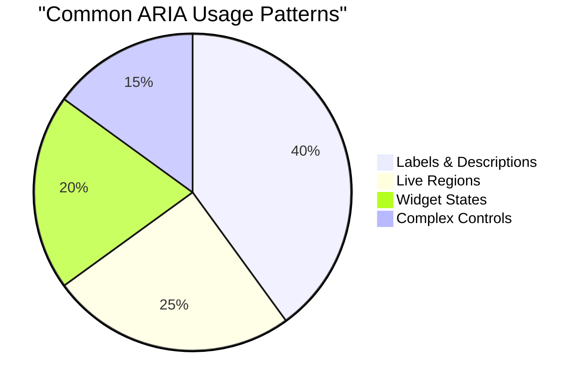

> **رؤية أساسية**: معظم استخدامات ARIA هي لتسمية العناصر ووصفها. أنماط عناصر واجهة المستخدم المعقدة أقل شيوعًا مما قد تعتقد!

✅ **تعلم من الخبراء**: ادرس [دليل ممارسات تأليف ARIA](https://w3c.github.io/aria-practices/) للحصول على أنماط واختبارات مجربة لعناصر واجهة المستخدم التفاعلية المعقدة.

## جعل الصور والوسائط قابلة للوصول

المحتوى المرئي والصوتي جزء أساسي من تجارب الويب الحديثة، ولكنه يمكن أن يخلق حواجز إذا لم يتم تنفيذه بعناية. الهدف هو ضمان وصول المعلومات والتأثير العاطفي لوسائطك إلى كل مستخدم. بمجرد أن تتقن ذلك، يصبح الأمر طبيعيًا.

تحتاج أنواع مختلفة من الوسائط إلى نهج وصول مختلف. الأمر يشبه الطهي - لن تعامل سمكة حساسة بنفس الطريقة التي تعامل بها شريحة لحم قوية. فهم هذه الفروقات يساعدك على اختيار الحل المناسب لكل حالة.

### استراتيجية الوصول إلى الصور

كل صورة على موقعك تخدم غرضًا. فهم هذا الغرض يساعدك على كتابة نص بديل أفضل وخلق تجارب أكثر شمولية.

**أنواع الصور الأربعة واستراتيجيات النص البديل الخاصة بها:**

**الصور المعلوماتية** - تنقل معلومات مهمة:
```html

```

**الصور الزخرفية** - بصرية بحتة بدون قيمة معلوماتية:
```html

```

**الصور الوظيفية** - تعمل كأزرار أو عناصر تحكم:
```html
<button>
  
</button>
```

**الصور المعقدة** - الرسوم البيانية، المخططات، الإنفوجرافيك:
```html

<div id="chart-description">
  <p>Detailed description: Sales data shows a steady increase across all quarters...</p>
</div>
```

### الوصول إلى الفيديو والصوت

**متطلبات الفيديو:**
- **التسميات التوضيحية**: نسخة نصية للمحتوى المنطوق والمؤثرات الصوتية
- **الوصف الصوتي**: سرد العناصر المرئية للمستخدمين المكفوفين
- **النصوص**: نسخة نصية كاملة لجميع المحتويات الصوتية والمرئية

```html
<video controls>
  <source src="video.mp4" type="video/mp4">
  <track kind="captions" src="captions.vtt" srclang="en" label="English">
  <track kind="descriptions" src="descriptions.vtt" srclang="en" label="Audio descriptions">
</video>
```

**متطلبات الصوت:**
- **النصوص**: نسخة نصية لجميع المحتويات المنطوقة
- **مؤشرات بصرية**: للمحتوى الصوتي فقط، قدم إشارات بصرية

### تقنيات الصور الحديثة

**استخدام CSS للصور الزخرفية:**
```css
.hero-section {
  background-image: url('decorative-hero.jpg');
  /* Decorative images in CSS don't need alt text */
}
```

**الصور المستجيبة مع الوصول:**
```html
<picture>
  <source media="(min-width: 800px)" srcset="large-chart.png">
  <source media="(min-width: 400px)" srcset="medium-chart.png">
  
</picture>
```

✅ **اختبر وصول الصور**: استخدم قارئ الشاشة للتنقل في صفحة تحتوي على صور. هل تحصل على معلومات كافية لفهم المحتوى؟

## التنقل عبر لوحة المفاتيح وإدارة التركيز

يستخدم العديد من المستخدمين لوحة المفاتيح فقط للتنقل في الويب. يشمل ذلك الأشخاص ذوي الإعاقات الحركية، والمستخدمين المحترفين الذين يجدون لوحة المفاتيح أسرع من الفأرة، وأي شخص توقفت فأرته عن العمل. ضمان عمل موقعك بشكل جيد مع إدخال لوحة المفاتيح أمر ضروري وغالبًا ما يجعل موقعك أكثر كفاءة للجميع.

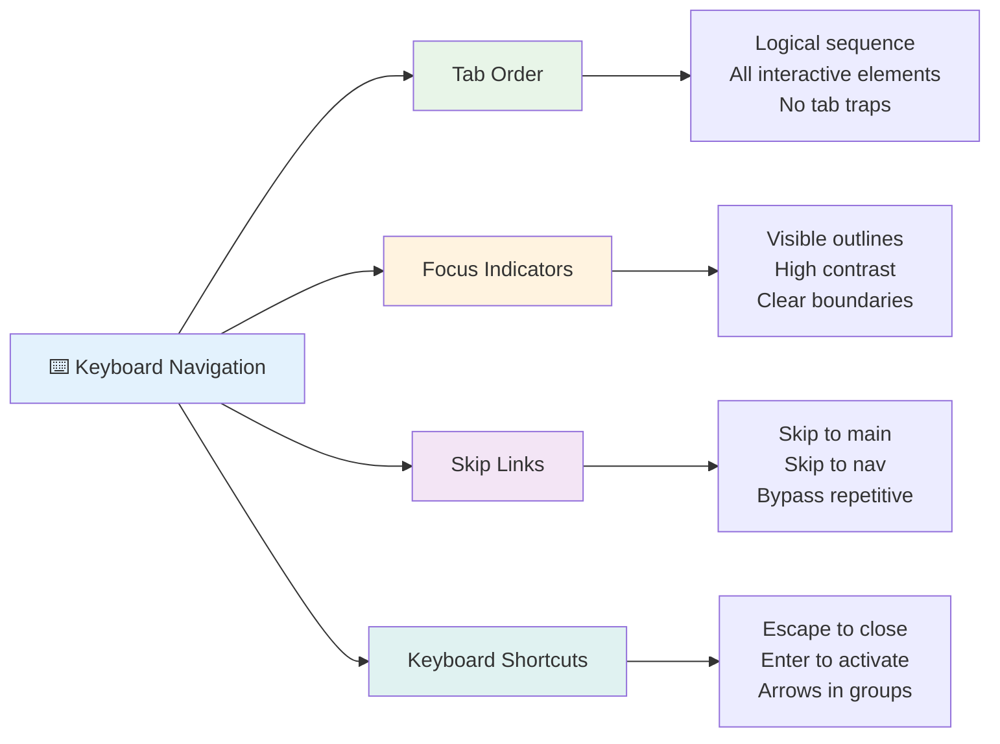

### أنماط التنقل الأساسية عبر لوحة المفاتيح

**التفاعلات القياسية عبر لوحة المفاتيح:**
- **Tab**: نقل التركيز للأمام عبر العناصر التفاعلية
- **Shift + Tab**: نقل التركيز للخلف
- **Enter**: تفعيل الأزرار والروابط
- **Space**: تفعيل الأزرار، تحديد مربعات الاختيار
- **Arrow keys**: التنقل داخل مجموعات المكونات (أزرار الراديو، القوائم)
- **Escape**: إغلاق النوافذ المنبثقة، القوائم المنسدلة، أو إلغاء العمليات

### أفضل ممارسات إدارة التركيز

**مؤشرات التركيز المرئية:**
```css
/* Ensure focus is always visible */
button:focus-visible {
  outline: 2px solid #4A90A4;
  outline-offset: 2px;
}

/* Custom focus styles for different components */
.card:focus-within {
  box-shadow: 0 0 0 3px rgba(74, 144, 164, 0.5);
}
```

**روابط التخطي للتنقل الفعال:**
```html
<a href="#main-content" class="skip-link">Skip to main content</a>
<a href="#navigation" class="skip-link">Skip to navigation</a>

<nav id="navigation">
  <!-- navigation content -->
</nav>
<main id="main-content">
  <!-- main content -->
</main>
```

**ترتيب علامات التبويب الصحيح:**
```html
<!-- Use semantic HTML for natural tab order -->
<form>
  <label for="name">Name:</label>
  <input type="text" id="name" tabindex="0">
  
  <label for="email">Email:</label>
  <input type="email" id="email" tabindex="0">
  
  <button type="submit" tabindex="0">Submit</button>
</form>
```

### حصر التركيز في النوافذ المنبثقة

عند فتح نوافذ منبثقة، يجب حصر التركيز داخل النافذة:

```javascript
// Modern focus trap implementation
function trapFocus(element) {
  const focusableElements = element.querySelectorAll(
    'button, [href], input, select, textarea, [tabindex]:not([tabindex="-1"])'
  );
  
  const firstElement = focusableElements[0];
  const lastElement = focusableElements[focusableElements.length - 1];

  element.addEventListener('keydown', (e) => {
    if (e.key === 'Tab') {
      if (e.shiftKey && document.activeElement === firstElement) {
        e.preventDefault();
        lastElement.focus();
      } else if (!e.shiftKey && document.activeElement === lastElement) {
        e.preventDefault();
        firstElement.focus();
      }
    }
    
    if (e.key === 'Escape') {
      closeModal();
    }
  });
  
  // Focus first element when modal opens
  firstElement.focus();
}
```

✅ **اختبر التنقل عبر لوحة المفاتيح**: حاول التنقل في موقعك باستخدام مفتاح Tab فقط. هل يمكنك الوصول إلى جميع العناصر التفاعلية؟ هل ترتيب التركيز منطقي؟ هل مؤشرات التركيز واضحة؟

## الوصول إلى النماذج

النماذج ضرورية لتفاعل المستخدم وتتطلب اهتمامًا خاصًا للوصول.

### ارتباط التسمية وعناصر التحكم في النموذج

**كل عنصر تحكم في النموذج يحتاج إلى تسمية:**
```html
<!-- Explicit labeling (preferred) -->
<label for="username">Username:</label>
<input type="text" id="username" name="username" required>

<!-- Implicit labeling -->
<label>
  Password:
  <input type="password" name="password" required>
</label>

<!-- Using aria-label when visual label isn't desired -->
<input type="search" aria-label="Search products" placeholder="Search...">
```

### معالجة الأخطاء والتحقق

**رسائل الخطأ القابلة للوصول:**
```html
<label for="email">Email Address:</label>
<input type="email" id="email" name="email" 
       aria-describedby="email-error" 
       aria-invalid="true" required>
<div id="email-error" role="alert">
  Please enter a valid email address
</div>
```

**أفضل ممارسات التحقق من النموذج:**
- استخدم `aria-invalid` للإشارة إلى الحقول غير الصالحة
- قدم رسائل خطأ واضحة ومحددة
- استخدم `role="alert"` للإعلانات المهمة عن الأخطاء
- أظهر الأخطاء فورًا وعند إرسال النموذج

### المجموعات والحقول

**جمع عناصر التحكم ذات الصلة في النموذج:**
```html
<fieldset>
  <legend>Shipping Address</legend>
  <label for="street">Street Address:</label>
  <input type="text" id="street" name="street">
  
  <label for="city">City:</label>
  <input type="text" id="city" name="city">
</fieldset>

<fieldset>
  <legend>Preferred Contact Method</legend>
  <input type="radio" id="contact-email" name="contact" value="email">
  <label for="contact-email">Email</label>
  
  <input type="radio" id="contact-phone" name="contact" value="phone">
  <label for="contact-phone">Phone</label>
</fieldset>
```

## رحلتك في الوصول: النقاط الرئيسية

تهانينا! لقد اكتسبت الآن المعرفة الأساسية لإنشاء تجارب ويب شاملة حقًا. هذا أمر مثير للغاية! الوصول إلى الويب ليس مجرد التحقق من الامتثال - إنه يتعلق بفهم الطرق المتنوعة التي يتفاعل بها الناس مع المحتوى الرقمي وتصميم تلك التعقيدات الرائعة.

أنت الآن جزء من مجتمع متنامٍ من المطورين الذين يفهمون أن التصميم الجيد يعمل للجميع. مرحبًا بك في النادي!

**🎯 أدوات الوصول الخاصة بك الآن تشمل:**

| المبدأ الأساسي | التنفيذ | التأثير |
|----------------|----------------|---------|
| **أساس HTML الدلالي** | استخدم عناصر HTML المناسبة لغرضها المقصود | يمكن لقارئات الشاشة التنقل بكفاءة، تعمل لوحات المفاتيح تلقائيًا |
| **تصميم بصري شامل** | تباين كافٍ، استخدام الألوان بشكل هادف، مؤشرات التركيز المرئية | واضح للجميع في أي ظروف إضاءة |
| **محتوى وصفي** | نصوص روابط ذات معنى، نصوص بديلة، عناوين | يفهم المستخدمون المحتوى بدون سياق بصري |
| **إمكانية الوصول عبر لوحة المفاتيح** | ترتيب علامات التبويب، اختصارات لوحة المفاتيح، إدارة التركيز | الوصول الحركي وكفاءة المستخدمين المحترفين |
| **تعزيز ARIA** | استخدام استراتيجي لسد الفجوات الدلالية | تعمل التطبيقات المعقدة مع تقنيات المساعدة |
| **اختبار شامل** | أدوات تلقائية + تحقق يدوي + اختبار المستخدم الحقيقي | اكتشاف المشكلات قبل أن تؤثر على المستخدمين |

**🚀 خطواتك التالية:**

1. **دمج الوصول في سير عملك**: اجعل الاختبار جزءًا طبيعيًا من عملية التطوير الخاصة بك
2. **تعلم من المستخدمين الحقيقيين**: ابحث عن تعليقات من الأشخاص الذين يستخدمون تقنيات المساعدة
3. **ابقَ على اطلاع**: تتطور تقنيات الوصول مع التقنيات والمعايير الجديدة
4. **الدعوة إلى الشمولية**: شارك معرفتك واجعل الوصول أولوية الفريق

> 💡 **تذكر**: قيود الوصول غالبًا ما تؤدي إلى حلول مبتكرة وأنيقة تفيد الجميع. المنحدرات، التسميات التوضيحية، وعناصر التحكم الصوتية بدأت جميعها كميزات وصول وأصبحت تحسينات رئيسية.

**الحجة التجارية واضحة تمامًا**: مواقع الويب القابلة للوصول تصل إلى المزيد من المستخدمين، تحتل مرتبة أفضل في محركات البحث، تكلفتها أقل في الصيانة، وتتجنب المخاطر القانونية. ولكن بصراحة؟ السبب الحقيقي للاهتمام بالوصول أعمق بكثير. مواقع الويب القابلة للوصول تجسد أفضل قيم الويب - الانفتاح، الشمولية، وفكرة أن الجميع يستحقون الوصول المتساوي إلى المعلومات.

أنت الآن مجهز لبناء مستقبل ويب شامل. كل موقع قابل للوصول تقوم بإنشائه يجعل الإنترنت مكانًا أكثر ترحيبًا للجميع. هذا أمر مذهل عندما تفكر فيه!

## موارد إضافية

واصل رحلتك التعليمية في الوصول باستخدام هذه الموارد الأساسية:

**📚 المعايير والإرشادات الرسمية:**
- [إرشادات WCAG 2.1](https://www.w3.org/WAI/WCAG21/quickref/) - المعيار الرسمي للوصول مع مرجع سريع
- [دليل ممارسات تأليف ARIA](https://w3c.github.io/aria-practices/) - أنماط شاملة لعناصر واجهة المستخدم التفاعلية
- [إرشادات WebAIM](https://webaim.org/) - إرشادات وصول عملية وسهلة للمبتدئين

**🛠️ أدوات وموارد الاختبار:**
- [axe DevTools](https://www.deque.com/axe/devtools/) - اختبار الوصول القياسي في الصناعة
- [قائمة التحقق من مشروع A11y](https://www.a11yproject.com/checklist/) - تحقق خطوة بخطوة من الوصول
- [رؤى الوصول](https://accessibilityinsights.io/) - مجموعة اختبار شاملة من مايكروسوفت
- [Color Oracle](https://colororacle.org/) - محاكي عمى الألوان لاختبار التصميم

**🎓 التعلم والمجتمع:**
- [استطلاع قارئ الشاشة WebAIM](https://webaim.org/projects/screenreadersurvey9/) - تفضيلات وسلوكيات المستخدمين الحقيقية
- [مكونات شاملة](https://inclusive-components.design/) - أنماط مكونات حديثة قابلة للوصول
- [قهوة A11y](https://a11y.coffee/) - نصائح ورؤى سريعة حول الوصول
- [مبادرة الوصول إلى الويب (WAI)](https://www.w3.org/WAI/) - موارد شاملة للوصول من W3C

**🎥 التعلم العملي:**
- [دليل مطور الوصول](https://www.accessibility-developer-guide.com/) - إرشادات تنفيذ عملية
- [جامعة Deque](https://dequeuniversity.com/) - دورات تدريبية احترافية حول الوصول

## تحدي GitHub Copilot Agent 🚀

استخدم وضع الوكيل لإكمال التحدي التالي:

**الوصف:** قم بإنشاء مكون نافذة منبثقة قابلة للوصول توضح إدارة التركيز المناسبة، سمات ARIA، وأنماط التنقل عبر لوحة المفاتيح.

**المهمة:** قم ببناء مكون نافذة منبثقة كاملة باستخدام HTML، CSS، وJavaScript يتضمن: حصر التركيز بشكل صحيح، مفتاح ESC للإغلاق، النقر خارج النافذة للإغلاق، سمات ARIA لقارئات الشاشة، ومؤشرات تركيز مرئية. يجب أن تحتوي النافذة على نموذج مع تسميات مناسبة ومعالجة الأخطاء. تأكد من أن المكون يلبي معايير WCAG 2.1 AA.


## 🚀 التحدي

خذ هذا HTML وأعد كتابته ليكون قابلاً للوصول قدر الإمكان، باستخدام الاستراتيجيات التي تعلمتها.

```html
<!DOCTYPE html>
<html lang="en">
  <head>
    <meta charset="UTF-8">
    <meta name="viewport" content="width=device-width, initial-scale=1.0">
    <title>Turtle Ipsum - The World's Premier Turtle Fan Club</title>
    <link href='../assets/style.css' rel='stylesheet' type='text/css'>
  </head>
  <body>
    <header class="site-header">
      <h1 class="site-title">Turtle Ipsum</h1>
      <p class="site-subtitle">The World's Premier Turtle Fan Club</p>
    </header>
    
    <nav class="main-nav" aria-label="Main navigation">
      <h2 class="nav-header">Resources</h2>
      <ul class="nav-list">
        <li><a href="https://www.youtube.com/watch?v=CMNry4PE93Y">"I like turtles" video</a></li>
        <li><a href="https://en.wikipedia.org/wiki/Turtle">Basic turtle information</a></li>
        <li><a href="https://en.wikipedia.org/wiki/Turtles_(chocolate)">Chocolate turtles candy</a></li>
      </ul>
    </nav>
    
    <main class="main-content">
      <article>
        <h1>Welcome to Turtle Ipsum</h1>
        <p class="intro">
          <a href="/about">Learn more about our turtle community</a> and discover fascinating facts about these amazing creatures.
        </p>
        <p class="article-text">
          Turtle ipsum dolor sit amet, consectetur adipiscing elit, sed do eiusmod tempor incididunt ut labore et dolore magna aliqua. Ut enim ad minim veniam, quis nostrud exercitation ullamco laboris nisi ut aliquip ex ea commodo consequat. Duis aute irure dolor in reprehenderit in voluptate velit esse cillum dolore eu fugiat nulla pariatur. Excepteur sint occaecat cupidatat non proident, sunt in culpa qui officia deserunt mollit anim id est laborum.
        </p>
      </article>
    </main>
    
    <footer class="footer">
      <section class="newsletter-signup">
        <h2>Stay Updated</h2>
        <button type="button" onclick="showNewsletterForm()">Sign up for turtle news</button>
      </section>
      
      <nav class="footer-nav" aria-label="Footer navigation">
        <h2>Site Pages</h2>
        <ul>
          <li><a href="../">Home</a></li>
          <li><a href="../semantic">Semantic HTML example</a></li>
        </ul>
      </nav>
      
      <p class="footer-copyright">&copy; 2024 Instrument. All rights reserved.</p>
    </footer>
  </body>
</html>
```

**التحسينات الرئيسية التي تم إجراؤها:**
- إضافة هيكل HTML دلالي مناسب
- إصلاح تسلسل العناوين (عنوان h1 واحد، تقدم منطقي)
- إضافة نصوص روابط ذات معنى بدلاً من "اضغط هنا"
- تضمين تسميات ARIA المناسبة للتنقل
- إضافة سمة lang وعلامات meta المناسبة
- استخدام عنصر button للعناصر التفاعلية
- هيكلة محتوى التذييل بمعالم مناسبة

## اختبار ما بعد المحاضرة
[اختبار ما بعد المحاضرة](https://ff-quizzes.netlify.app/web/en/)

## المراجعة والدراسة الذاتية

تفرض العديد من الحكومات قوانين بشأن متطلبات الوصول. اقرأ عن قوانين الوصول في بلدك. ما الذي يتم تغطيته، وما الذي لا يتم تغطيته؟ مثال على ذلك [هذا الموقع الحكومي](https://accessibility.blog.gov.uk/).

## المهمة

[تحليل موقع ويب غير قابل للوصول](assignment.md)

الاعتمادات: [Turtle Ipsum](https://github.com/Instrument/semantic-html-sample) بواسطة Instrument

---

## 🚀 جدول زمني لإتقان الوصول

### ⚡ **ما يمكنك القيام به في الدقائق الخمس القادمة**
- [ ] تثبيت امتداد axe DevTools في متصفحك
- [ ] تشغيل تدقيق الوصول في Lighthouse على موقعك المفضل
- [ ] حاول التنقل في أي موقع باستخدام مفتاح Tab فقط
- [ ] اختبار قارئ الشاشة المدمج في متصفحك (Narrator/VoiceOver)

### 🎯 **ما يمكنك تحقيقه خلال هذه الساعة**
- [ ] إكمال اختبار ما بعد الدرس والتفكير في رؤى الوصول
- [ ] ممارسة كتابة نصوص بديلة ذات معنى لـ 10 صور مختلفة
- [ ] تدقيق هيكل العناوين لموقع باستخدام امتداد HeadingsMap
- [ ] إصلاح مشكلات الوصول التي تم العثور عليها في HTML التحدي
- [ ] اختبار تباين الألوان في مشروعك الحالي باستخدام أداة WebAIM

### 📅 **رحلة الوصول الخاصة بك لمدة أسبوع**
- [ ] إكمال المهمة بتحليل موقع ويب غير قابل للوصول
- [ ] إعداد بيئة التطوير الخاصة بك بأدوات اختبار الوصول
- [ ] ممارسة التنقل باستخدام لوحة المفاتيح على 5 مواقع معقدة مختلفة  
- [ ] إنشاء نموذج بسيط مع تسميات صحيحة، معالجة الأخطاء، و ARIA  
- [ ] الانضمام إلى مجتمع يهتم بإمكانية الوصول (مثل A11y Slack، منتدى WebAIM)  
- [ ] مشاهدة مستخدمين حقيقيين من ذوي الإعاقة يتنقلون عبر المواقع (يوتيوب يحتوي على أمثلة رائعة)  

### 🌟 **تحولك خلال الشهر**  
- [ ] دمج اختبار إمكانية الوصول في سير عمل التطوير الخاص بك  
- [ ] المساهمة في مشروع مفتوح المصدر عن طريق إصلاح مشكلات إمكانية الوصول  
- [ ] إجراء اختبار قابلية الاستخدام مع شخص يستخدم التكنولوجيا المساعدة  
- [ ] بناء مكتبة مكونات قابلة للوصول لفريقك  
- [ ] الدعوة لإمكانية الوصول في مكان عملك أو مجتمعك  
- [ ] توجيه شخص جديد إلى مفاهيم إمكانية الوصول  

### 🏆 **التحقق النهائي لبطل إمكانية الوصول**  

**احتفل برحلتك في إمكانية الوصول:**  
- ما أكثر شيء فاجأك حول كيفية استخدام الناس للويب؟  
- أي مبدأ من مبادئ إمكانية الوصول يتماشى أكثر مع أسلوبك في التطوير؟  
- كيف غيّر تعلمك عن إمكانية الوصول وجهة نظرك حول التصميم؟  
- ما أول تحسين لإمكانية الوصول تريد تنفيذه في مشروع حقيقي؟  

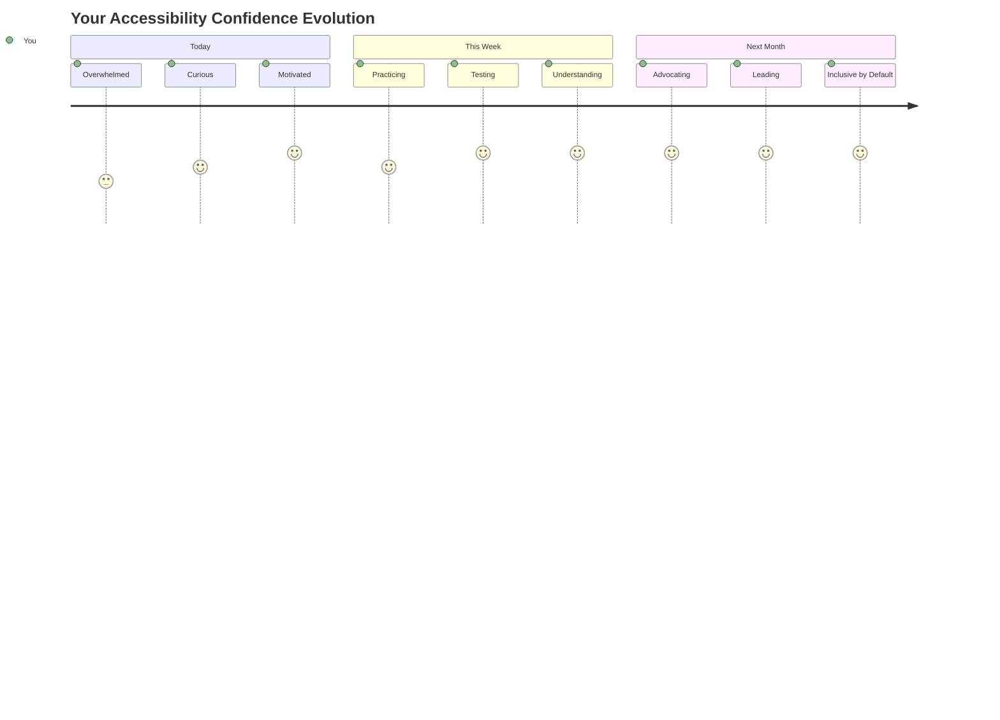
  
> 🌍 **أنت الآن بطل إمكانية الوصول!** أنت تفهم أن تجارب الويب الرائعة تعمل للجميع، بغض النظر عن كيفية وصولهم إلى الويب. كل ميزة قابلة للوصول تقوم ببنائها تجعل الإنترنت أكثر شمولاً. الويب يحتاج إلى مطورين مثلك يرون إمكانية الوصول ليس كقيد، بل كفرصة لخلق تجارب أفضل لجميع المستخدمين. مرحبًا بك في الحركة! 🎉  

---

**إخلاء المسؤولية**:  
تم ترجمة هذا المستند باستخدام خدمة الترجمة بالذكاء الاصطناعي [Co-op Translator](https://github.com/Azure/co-op-translator). بينما نسعى لتحقيق الدقة، يرجى العلم أن الترجمات الآلية قد تحتوي على أخطاء أو عدم دقة. يجب اعتبار المستند الأصلي بلغته الأصلية المصدر الرسمي. للحصول على معلومات حاسمة، يُوصى بالترجمة البشرية الاحترافية. نحن غير مسؤولين عن أي سوء فهم أو تفسيرات خاطئة تنشأ عن استخدام هذه الترجمة.