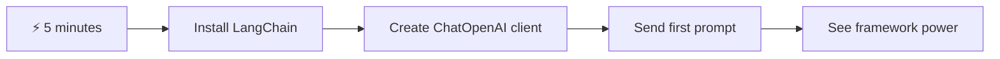
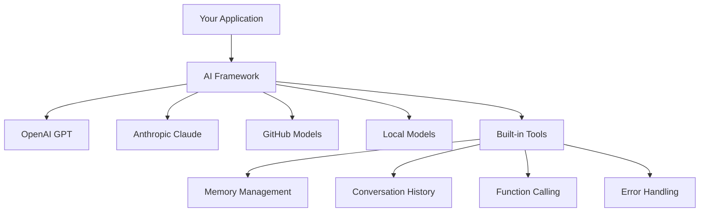
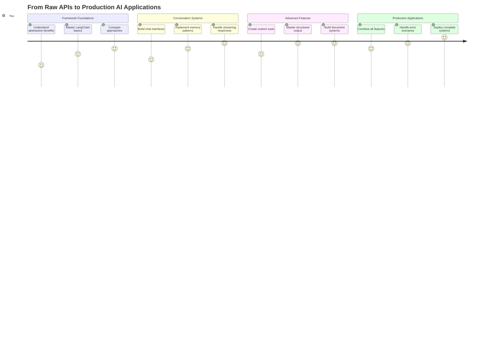
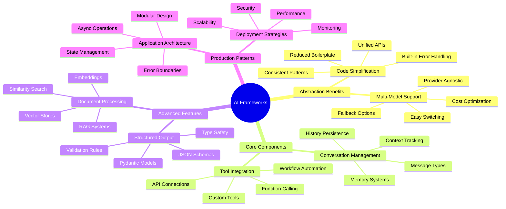
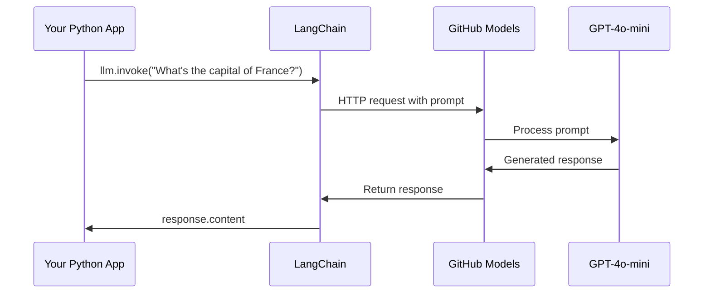
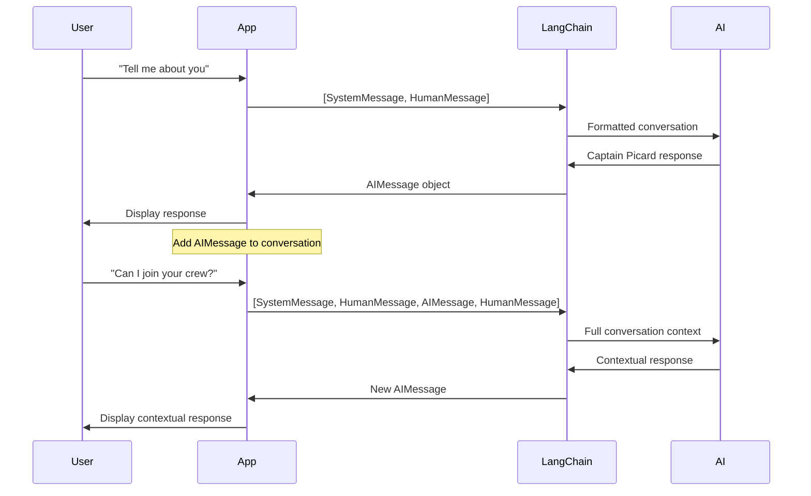
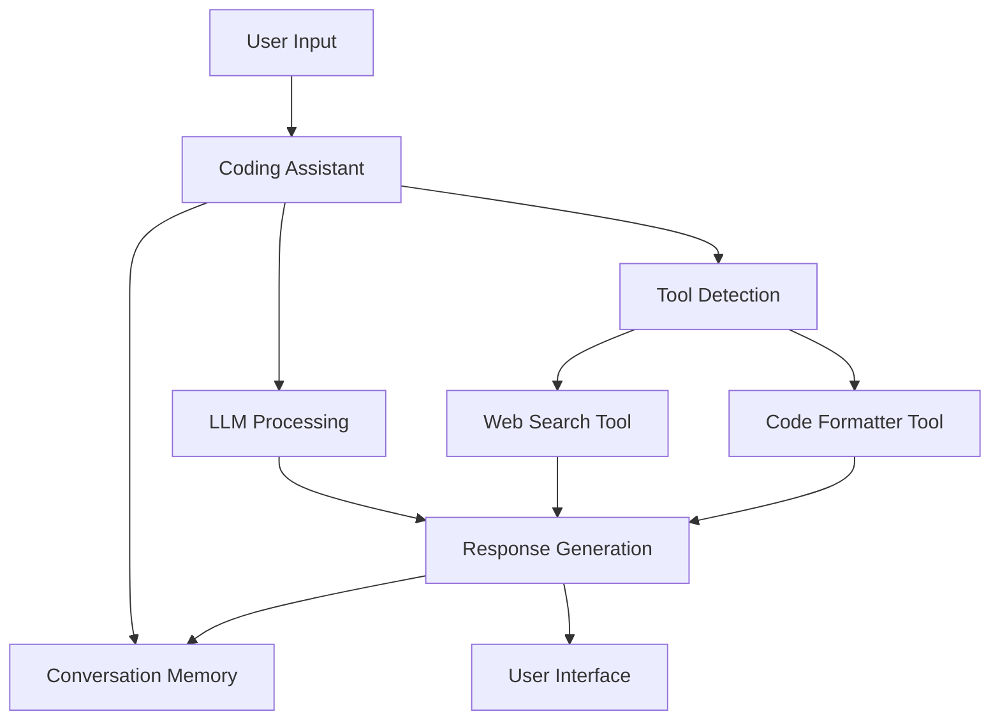
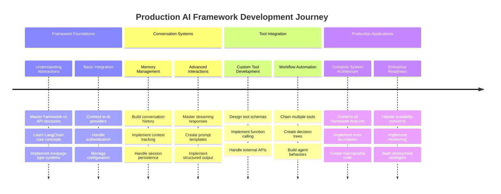
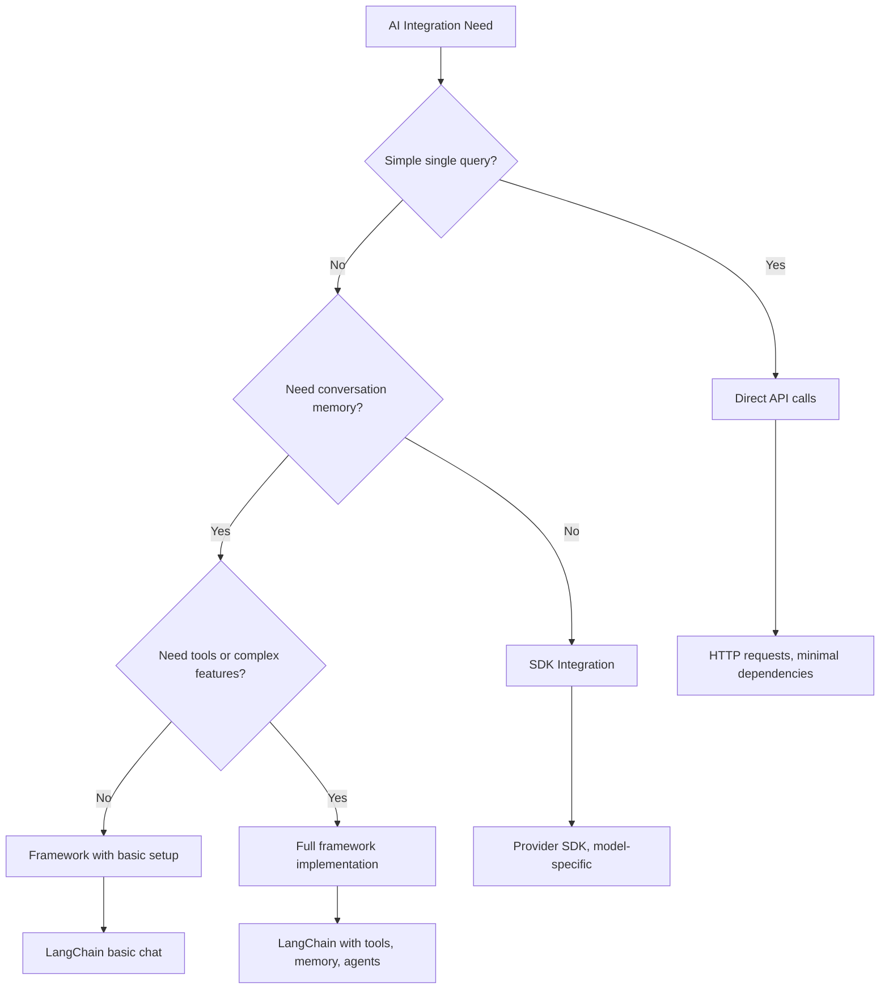

<!--
CO_OP_TRANSLATOR_METADATA:
{
  "original_hash": "3925b6a1c31c60755eaae4d578232c25",
  "translation_date": "2025-11-03T12:33:00+00:00",
  "source_file": "10-ai-framework-project/README.md",
  "language_code": "ar"
}
-->
# إطار الذكاء الاصطناعي

هل شعرت يومًا بالإرهاق عند محاولة بناء تطبيقات ذكاء اصطناعي من الصفر؟ لست وحدك! تُعتبر أطر الذكاء الاصطناعي مثل السكين السويسري لتطوير الذكاء الاصطناعي - أدوات قوية يمكن أن توفر لك الوقت وتجنبك المتاعب عند بناء التطبيقات الذكية. فكر في إطار الذكاء الاصطناعي كأنه مكتبة منظمة جيدًا: يوفر مكونات جاهزة، وواجهات برمجة تطبيقات موحدة، وتجريدات ذكية حتى تتمكن من التركيز على حل المشكلات بدلاً من الانشغال بتفاصيل التنفيذ.

في هذا الدرس، سنستكشف كيف يمكن للأطر مثل LangChain تحويل المهام المعقدة لدمج الذكاء الاصطناعي إلى أكواد نظيفة وسهلة القراءة. ستكتشف كيفية التعامل مع التحديات الواقعية مثل تتبع المحادثات، وتنفيذ استدعاء الأدوات، والتعامل مع نماذج الذكاء الاصطناعي المختلفة من خلال واجهة موحدة واحدة.

بحلول نهاية هذا الدرس، ستعرف متى تلجأ إلى الأطر بدلاً من استدعاءات واجهات برمجة التطبيقات الخام، وكيفية استخدام تجريداتها بفعالية، وكيفية بناء تطبيقات ذكاء اصطناعي جاهزة للاستخدام في العالم الحقيقي. دعنا نستكشف ما يمكن أن تقدمه أطر الذكاء الاصطناعي لمشاريعك.

## ⚡ ما يمكنك فعله في الدقائق الخمس القادمة

**مسار سريع للمطورين المشغولين**



- **الدقيقة الأولى**: قم بتثبيت LangChain: `pip install langchain langchain-openai`
- **الدقيقة الثانية**: قم بإعداد رمز GitHub الخاص بك واستورد عميل ChatOpenAI
- **الدقيقة الثالثة**: أنشئ محادثة بسيطة مع رسائل النظام والإنسان
- **الدقيقة الرابعة**: أضف أداة أساسية (مثل وظيفة الجمع) وشاهد استدعاء الأدوات بواسطة الذكاء الاصطناعي
- **الدقيقة الخامسة**: اختبر الفرق بين استدعاءات واجهات برمجة التطبيقات الخام وتجريدات الإطار

**كود اختبار سريع**:
```python
from langchain_openai import ChatOpenAI
from langchain_core.messages import SystemMessage, HumanMessage

llm = ChatOpenAI(
    api_key=os.environ["GITHUB_TOKEN"],
    base_url="https://models.github.ai/inference",
    model="openai/gpt-4o-mini"
)

response = llm.invoke([
    SystemMessage(content="You are a helpful coding assistant"),
    HumanMessage(content="Explain Python functions briefly")
])
print(response.content)
```

**لماذا هذا مهم**: في غضون 5 دقائق، ستختبر كيف تحول أطر الذكاء الاصطناعي التكامل المعقد للذكاء الاصطناعي إلى استدعاءات طرق بسيطة. هذا هو الأساس الذي يدعم تطبيقات الذكاء الاصطناعي الإنتاجية.

## لماذا تختار إطارًا؟

إذن أنت مستعد لبناء تطبيق ذكاء اصطناعي - رائع! ولكن إليك الأمر: لديك عدة مسارات مختلفة يمكنك اتخاذها، ولكل منها مزايا وعيوب. إنه يشبه اختيار المشي أو ركوب الدراجة أو القيادة للوصول إلى مكان ما - كلها ستوصلك، لكن التجربة (والجهد) ستكون مختلفة تمامًا.

دعنا نوضح الطرق الثلاثة الرئيسية التي يمكنك من خلالها دمج الذكاء الاصطناعي في مشاريعك:

| النهج | المزايا | الأفضل لـ | الاعتبارات |
|-------|---------|-----------|-------------|
| **طلبات HTTP المباشرة** | تحكم كامل، بدون تبعيات | استفسارات بسيطة، تعلم الأساسيات | كود أكثر تفصيلاً، معالجة أخطاء يدوية |
| **تكامل SDK** | تقليل الكود المتكرر، تحسين خاص بالنموذج | تطبيقات النموذج الواحد | يقتصر على مزودي خدمات محددين |
| **أطر الذكاء الاصطناعي** | واجهة موحدة، تجريدات مدمجة | تطبيقات متعددة النماذج، سير عمل معقد | منحنى تعلم، احتمال التجريد الزائد |

### فوائد الأطر في الممارسة



**لماذا الأطر مهمة:**
- **توحد** مزودي الذكاء الاصطناعي المتعددين تحت واجهة واحدة
- **تتعامل** مع ذاكرة المحادثة تلقائيًا
- **توفر** أدوات جاهزة للمهام الشائعة مثل التضمينات واستدعاء الوظائف
- **تدير** معالجة الأخطاء ومنطق إعادة المحاولة
- **تحول** سير العمل المعقد إلى استدعاءات طرق قابلة للقراءة

> 💡 **نصيحة احترافية**: استخدم الأطر عند التبديل بين نماذج الذكاء الاصطناعي المختلفة أو بناء ميزات معقدة مثل الوكلاء، الذاكرة، أو استدعاء الأدوات. التزم بواجهات برمجة التطبيقات المباشرة عند تعلم الأساسيات أو بناء تطبيقات بسيطة ومركزة.

**الخلاصة**: مثل الاختيار بين أدوات متخصصة للحرفي وورشة عمل كاملة، الأمر يتعلق بمطابقة الأداة مع المهمة. الأطر تتفوق في التطبيقات المعقدة والغنية بالميزات، بينما تعمل واجهات برمجة التطبيقات المباشرة بشكل جيد للحالات البسيطة.

## 🗺️ رحلتك التعليمية لإتقان أطر الذكاء الاصطناعي



**وجهة رحلتك**: بحلول نهاية هذا الدرس، ستكون قد أتقنت تطوير أطر الذكاء الاصطناعي وستكون قادرًا على بناء تطبيقات ذكاء اصطناعي متطورة وجاهزة للإنتاج تنافس المساعدين الذكاء الاصطناعي التجاريين.

## المقدمة

في هذا الدرس، سنتعلم:

- استخدام إطار ذكاء اصطناعي شائع.
- معالجة المشكلات الشائعة مثل محادثات الدردشة، استخدام الأدوات، الذاكرة والسياق.
- الاستفادة من ذلك لبناء تطبيقات ذكاء اصطناعي.

## 🧠 نظام تطوير أطر الذكاء الاصطناعي



**المبدأ الأساسي**: أطر الذكاء الاصطناعي تبسط التعقيد مع توفير تجريدات قوية لإدارة المحادثات، تكامل الأدوات، ومعالجة المستندات، مما يمكن المطورين من بناء تطبيقات ذكاء اصطناعي متطورة بكود نظيف وقابل للصيانة.

## أول طلب ذكاء اصطناعي لك

لنبدأ بالأساسيات من خلال إنشاء أول تطبيق ذكاء اصطناعي يرسل سؤالاً ويحصل على إجابة. مثلما اكتشف أرخميدس مبدأ الإزاحة في حمامه، أحيانًا تكون الملاحظات البسيطة هي التي تؤدي إلى أقوى الأفكار - والأطر تجعل هذه الأفكار في متناول اليد.

### إعداد LangChain مع نماذج GitHub

سنستخدم LangChain للاتصال بنماذج GitHub، وهو أمر رائع لأنه يمنحك وصولاً مجانيًا إلى نماذج ذكاء اصطناعي متنوعة. أفضل جزء؟ تحتاج فقط إلى بعض معلمات التكوين البسيطة للبدء:

```python
from langchain_openai import ChatOpenAI
import os

llm = ChatOpenAI(
    api_key=os.environ["GITHUB_TOKEN"],
    base_url="https://models.github.ai/inference",
    model="openai/gpt-4o-mini",
)

# Send a simple prompt
response = llm.invoke("What's the capital of France?")
print(response.content)
```

**دعنا نوضح ما يحدث هنا:**
- **إنشاء** عميل LangChain باستخدام فئة `ChatOpenAI` - هذا هو بوابتك إلى الذكاء الاصطناعي!
- **تكوين** الاتصال بنماذج GitHub باستخدام رمز المصادقة الخاص بك
- **تحديد** النموذج الذكاء الاصطناعي الذي تريد استخدامه (`gpt-4o-mini`) - فكر في هذا كاختيار مساعد الذكاء الاصطناعي الخاص بك
- **إرسال** سؤالك باستخدام طريقة `invoke()` - هنا يحدث السحر
- **استخراج** وعرض الإجابة - وها أنت تتحدث مع الذكاء الاصطناعي!

> 🔧 **ملاحظة الإعداد**: إذا كنت تستخدم GitHub Codespaces، فأنت محظوظ - تم إعداد `GITHUB_TOKEN` بالفعل لك! تعمل محليًا؟ لا تقلق، ستحتاج فقط إلى إنشاء رمز وصول شخصي مع الأذونات المناسبة.

**الإخراج المتوقع:**
```text
The capital of France is Paris.
```



## بناء ذكاء اصطناعي محادثي

المثال الأول يوضح الأساسيات، لكنه مجرد تبادل واحد - تسأل سؤالاً، تحصل على إجابة، وهذا كل شيء. في التطبيقات الحقيقية، تريد أن يتذكر الذكاء الاصطناعي ما كنت تناقشه، مثلما بنى واتسون وهولمز محادثاتهم التحقيقية بمرور الوقت.

هنا يصبح LangChain مفيدًا بشكل خاص. فهو يوفر أنواعًا مختلفة من الرسائل التي تساعد في هيكلة المحادثات وتتيح لك إعطاء الذكاء الاصطناعي شخصية. ستقوم ببناء تجارب دردشة تحافظ على السياق والشخصية.

### فهم أنواع الرسائل

فكر في هذه الأنواع من الرسائل كأنها "قبعات" مختلفة يرتديها المشاركون في المحادثة. يستخدم LangChain فئات رسائل مختلفة لتتبع من يقول ماذا:

| نوع الرسالة | الغرض | مثال على الاستخدام |
|-------------|-------|---------------------|
| `SystemMessage` | يحدد شخصية وسلوك الذكاء الاصطناعي | "أنت مساعد برمجة مفيد" |
| `HumanMessage` | يمثل إدخال المستخدم | "اشرح كيف تعمل الوظائف" |
| `AIMessage` | يخزن ردود الذكاء الاصطناعي | ردود الذكاء الاصطناعي السابقة في المحادثة |

### إنشاء أول محادثة لك

دعنا ننشئ محادثة حيث يتبنى الذكاء الاصطناعي دورًا معينًا. سنجعله يجسد شخصية الكابتن بيكارد - شخصية معروفة بحكمته الدبلوماسية وقيادته:

```python
messages = [
    SystemMessage(content="You are Captain Picard of the Starship Enterprise"),
    HumanMessage(content="Tell me about you"),
]
```

**تفصيل إعداد هذه المحادثة:**
- **تحديد** دور وشخصية الذكاء الاصطناعي من خلال `SystemMessage`
- **تقديم** استفسار المستخدم الأولي عبر `HumanMessage`
- **إنشاء** أساس لمحادثة متعددة الأدوار

الكود الكامل لهذا المثال يبدو كالتالي:

```python
from langchain_core.messages import HumanMessage, SystemMessage
from langchain_openai import ChatOpenAI
import os

llm = ChatOpenAI(
    api_key=os.environ["GITHUB_TOKEN"],
    base_url="https://models.github.ai/inference",
    model="openai/gpt-4o-mini",
)

messages = [
    SystemMessage(content="You are Captain Picard of the Starship Enterprise"),
    HumanMessage(content="Tell me about you"),
]


# works
response  = llm.invoke(messages)
print(response.content)
```

يجب أن ترى نتيجة مشابهة لـ:

```text
I am Captain Jean-Luc Picard, the commanding officer of the USS Enterprise (NCC-1701-D), a starship in the United Federation of Planets. My primary mission is to explore new worlds, seek out new life and new civilizations, and boldly go where no one has gone before. 

I believe in the importance of diplomacy, reason, and the pursuit of knowledge. My crew is diverse and skilled, and we often face challenges that test our resolve, ethics, and ingenuity. Throughout my career, I have encountered numerous species, grappled with complex moral dilemmas, and have consistently sought peaceful solutions to conflicts.

I hold the ideals of the Federation close to my heart, believing in the importance of cooperation, understanding, and respect for all sentient beings. My experiences have shaped my leadership style, and I strive to be a thoughtful and just captain. How may I assist you further?
```

للحفاظ على استمرارية المحادثة (بدلاً من إعادة تعيين السياق في كل مرة)، تحتاج إلى الاستمرار في إضافة الردود إلى قائمة الرسائل. مثل التقاليد الشفوية التي حافظت على القصص عبر الأجيال، هذا النهج يبني ذاكرة دائمة:

```python
from langchain_core.messages import HumanMessage, SystemMessage
from langchain_openai import ChatOpenAI
import os

llm = ChatOpenAI(
    api_key=os.environ["GITHUB_TOKEN"],
    base_url="https://models.github.ai/inference",
    model="openai/gpt-4o-mini",
)

messages = [
    SystemMessage(content="You are Captain Picard of the Starship Enterprise"),
    HumanMessage(content="Tell me about you"),
]


# works
response  = llm.invoke(messages)

print(response.content)

print("---- Next ----")

messages.append(response)
messages.append(HumanMessage(content="Now that I know about you, I'm Chris, can I be in your crew?"))

response  = llm.invoke(messages)

print(response.content)

```

رائع، أليس كذلك؟ ما يحدث هنا هو أننا نستدعي LLM مرتين - أولاً مع رسائلنا الأولية فقط، ثم مرة أخرى مع تاريخ المحادثة الكامل. إنه يشبه أن الذكاء الاصطناعي يتابع محادثتنا بالفعل!

عند تشغيل هذا الكود، ستحصل على استجابة ثانية تبدو كالتالي:

```text
Welcome aboard, Chris! It's always a pleasure to meet those who share a passion for exploration and discovery. While I cannot formally offer you a position on the Enterprise right now, I encourage you to pursue your aspirations. We are always in need of talented individuals with diverse skills and backgrounds. 

If you are interested in space exploration, consider education and training in the sciences, engineering, or diplomacy. The values of curiosity, resilience, and teamwork are crucial in Starfleet. Should you ever find yourself on a starship, remember to uphold the principles of the Federation: peace, understanding, and respect for all beings. Your journey can lead you to remarkable adventures, whether in the stars or on the ground. Engage!
```



سأعتبر ذلك كـ "ربما" ;)

## استجابات البث

هل لاحظت كيف يبدو أن ChatGPT "يكتب" استجاباته في الوقت الفعلي؟ هذا هو البث أثناء العمل. مثل مشاهدة خطاط ماهر يعمل - رؤية الحروف تظهر ضربة بضربة بدلاً من أن تظهر فجأة - يجعل البث التفاعل يبدو أكثر طبيعية ويوفر ردود فعل فورية.

### تنفيذ البث مع LangChain

```python
from langchain_openai import ChatOpenAI
import os

llm = ChatOpenAI(
    api_key=os.environ["GITHUB_TOKEN"],
    base_url="https://models.github.ai/inference",
    model="openai/gpt-4o-mini",
    streaming=True
)

# Stream the response
for chunk in llm.stream("Write a short story about a robot learning to code"):
    print(chunk.content, end="", flush=True)
```

**لماذا البث رائع:**
- **يعرض** المحتوى أثناء إنشائه - لا مزيد من الانتظار المحرج!
- **يجعل** المستخدمين يشعرون بأن شيئًا ما يحدث بالفعل
- **يبدو** أسرع، حتى عندما لا يكون كذلك تقنيًا
- **يسمح** للمستخدمين ببدء القراءة بينما لا يزال الذكاء الاصطناعي "يفكر"

> 💡 **نصيحة لتجربة المستخدم**: البث يبرز حقًا عند التعامل مع الردود الطويلة مثل شروحات الأكواد، الكتابة الإبداعية، أو الدروس التفصيلية. سيحب المستخدمون رؤية التقدم بدلاً من التحديق في شاشة فارغة!

### 🎯 مراجعة تربوية: فوائد تجريد الإطار

**توقف وتأمل**: لقد اختبرت للتو قوة تجريدات أطر الذكاء الاصطناعي. قارن ما تعلمته باستدعاءات واجهات برمجة التطبيقات الخام من الدروس السابقة.

**تقييم ذاتي سريع**:
- هل يمكنك شرح كيف يبسط LangChain إدارة المحادثات مقارنة بتتبع الرسائل يدويًا؟
- ما الفرق بين طريقتي `invoke()` و `stream()`، ومتى تستخدم كل منهما؟
- كيف يحسن نظام أنواع الرسائل في الإطار تنظيم الكود؟

**صلة بالعالم الواقعي**: أنماط التجريد التي تعلمتها (أنواع الرسائل، واجهات البث، ذاكرة المحادثة) تُستخدم في كل تطبيق ذكاء اصطناعي رئيسي - من واجهة ChatGPT إلى مساعدة الأكواد في GitHub Copilot. أنت تتقن نفس الأنماط المعمارية التي تستخدمها فرق تطوير الذكاء الاصطناعي المحترفة.

**سؤال التحدي**: كيف ستصمم تجريد إطار للتعامل مع مزودي نماذج الذكاء الاصطناعي المختلفين (OpenAI، Anthropic، Google) بواجهة واحدة؟ فكر في الفوائد والمقايضات.

## قوالب الطلبات

تعمل قوالب الطلبات مثل الهياكل البلاغية المستخدمة في الخطابة الكلاسيكية - فكر في كيفية تعديل شيشرون لأنماط خطابه لجماهير مختلفة مع الحفاظ على نفس الإطار الإقناعي. إنها تتيح لك إنشاء طلبات قابلة لإعادة الاستخدام حيث يمكنك استبدال أجزاء مختلفة من المعلومات دون إعادة كتابة كل شيء من البداية. بمجرد إعداد القالب، ما عليك سوى ملء المتغيرات بالقيم التي تحتاجها.

### إنشاء قوالب قابلة لإعادة الاستخدام

```python
from langchain_core.prompts import ChatPromptTemplate

# Define a template for code explanations
template = ChatPromptTemplate.from_messages([
    ("system", "You are an expert programming instructor. Explain concepts clearly with examples."),
    ("human", "Explain {concept} in {language} with a practical example for {skill_level} developers")
])

# Use the template with different values
questions = [
    {"concept": "functions", "language": "JavaScript", "skill_level": "beginner"},
    {"concept": "classes", "language": "Python", "skill_level": "intermediate"},
    {"concept": "async/await", "language": "JavaScript", "skill_level": "advanced"}
]

for question in questions:
    prompt = template.format_messages(**question)
    response = llm.invoke(prompt)
    print(f"Topic: {question['concept']}\n{response.content}\n---\n")
```

**لماذا ستحب استخدام القوالب:**
- **تحافظ** على اتساق طلباتك عبر تطبيقك بالكامل
- **لا مزيد** من تجميع النصوص الفوضوي - فقط متغيرات نظيفة وبسيطة
- **يتصرف الذكاء الاصطناعي** بشكل متوقع لأن الهيكل يظل كما هو
- **التحديثات** سهلة - قم بتغيير القالب مرة واحدة، ويتم إصلاحه في كل مكان

## الإخراج المنظم

هل شعرت بالإحباط من محاولة تحليل استجابات الذكاء الاصطناعي التي تعود كنص غير منظم؟ الإخراج المنظم يشبه تعليم الذكاء الاصطناعي اتباع النهج المنهجي الذي استخدمه لينيوس لتصنيف الكائنات الحية - منظم، يمكن التنبؤ به، وسهل التعامل معه. يمكنك طلب JSON، هياكل بيانات محددة، أو أي تنسيق تحتاجه.

### تحديد مخططات الإخراج

```python
from langchain_core.prompts import ChatPromptTemplate
from langchain_core.output_parsers import JsonOutputParser
from pydantic import BaseModel, Field

class CodeReview(BaseModel):
    score: int = Field(description="Code quality score from 1-10")
    strengths: list[str] = Field(description="List of code strengths")
    improvements: list[str] = Field(description="List of suggested improvements")
    overall_feedback: str = Field(description="Summary feedback")

# Set up the parser
parser = JsonOutputParser(pydantic_object=CodeReview)

# Create prompt with format instructions
prompt = ChatPromptTemplate.from_messages([
    ("system", "You are a code reviewer. {format_instructions}"),
    ("human", "Review this code: {code}")
])

# Format the prompt with instructions
chain = prompt | llm | parser

# Get structured response
code_sample = """
def calculate_average(numbers):
    return sum(numbers) / len(numbers)
"""

result = chain.invoke({
    "code": code_sample,
    "format_instructions": parser.get_format_instructions()
})

print(f"Score: {result['score']}")
print(f"Strengths: {', '.join(result['strengths'])}")
```

**لماذا الإخراج المنظم يغير اللعبة:**
- **لا مزيد** من التخمين حول التنسيق الذي ستحصل عليه - إنه متسق في كل مرة
- **يتصل** مباشرة بقواعد البيانات وواجهات برمجة التطبيقات الخاصة بك دون عمل إضافي
- **يكتشف** استجابات الذكاء الاصطناعي الغريبة قبل أن تعطل تطبيقك
- **يجعل** كودك أنظف لأنك تعرف بالضبط ما تعمل معه

## استدعاء الأدوات

الآن نصل إلى واحدة من أقوى الميزات: الأدوات. هذه هي الطريقة التي تمنح بها الذكاء الاصطناعي قدرات عملية تتجاوز المحادثة. مثلما طورت النقابات في العصور الوسطى أدوات متخصصة للحرف المختلفة، يمكنك تجهيز الذكاء الاصطناعي بأدوات مركزة. تصف الأدوات المتاحة، وعندما يطلب شخص ما شيئًا يتطابق، يمكن للذكاء الاصطناعي اتخاذ إجراء.

### استخدام Python

دعنا نضيف بعض الأدوات كالتالي:

```python
from typing_extensions import Annotated, TypedDict

class add(TypedDict):
    """Add two integers."""

    # Annotations must have the type and can optionally include a default value and description (in that order).
    a: Annotated[int, ..., "First integer"]
    b: Annotated[int, ..., "Second integer"]

tools = [add]

functions = {
    "add": lambda a, b: a + b
}
```

ما الذي يحدث هنا؟ نحن ننشئ مخططًا لأداة تسمى `add`. من خلال الوراثة من `TypedDict` واستخدام أنواع `Annotated` الأنيقة لـ `a` و `b`، نحن نقدم للـ LLM صورة واضحة عما تفعله هذه الأداة وما تحتاجه. قاموس `functions` يشبه صندوق الأدوات الخاص بنا - يخبر كودنا بالضبط ما يجب فعله عندما يقرر الذكاء الاصطناعي استخدام أداة معينة.

دعنا نرى كيف نستدعي LLM بهذه الأداة بعد ذلك:

```python
llm = ChatOpenAI(
    api_key=os.environ["GITHUB_TOKEN"],
    base_url="https://models.github.ai/inference",
    model="openai/gpt-4o-mini",
)

llm_with_tools = llm.bind_tools(tools)
```

هنا نستدعي `bind_tools` مع مصفوفة `tools` الخاصة بنا وبالتالي فإن LLM `llm_with_tools` لديه الآن معرفة بهذه الأداة.

لاستخدام هذا LLM الجديد، يمكننا كتابة الكود التالي:

```python
query = "What is 3 + 12?"

res = llm_with_tools.invoke(query)
if(res.tool_calls):
    for tool in res.tool_calls:
        print("TOOL CALL: ", functions[tool["name"]](../../../10-ai-framework-project/**tool["args"]))
print("CONTENT: ",res.content)
```

الآن عند استدعاء `invoke` على هذا LLM الجديد، الذي يحتوي على أدوات، قد يتم تعبئة الخاصية `tool_calls`. إذا كان الأمر كذلك، فإن أي أدوات محددة تحتوي على خاصية `name` و `args` التي تحدد الأداة التي يجب استدعاؤها ومع الوسائط. الكود الكامل يبدو كالتالي:

```python
from langchain_core.messages import HumanMessage, SystemMessage
from langchain_openai import ChatOpenAI
import os
from typing_extensions import Annotated, TypedDict

class add(TypedDict):
    """Add two integers."""

    # Annotations must have the type and can optionally include a default value and description (in that order).
    a: Annotated[int, ..., "First integer"]
    b: Annotated[int, ..., "Second integer"]

tools = [add]

functions = {
    "add": lambda a, b: a + b
}

llm = ChatOpenAI(
    api_key=os.environ["GITHUB_TOKEN"],
    base_url="https://models.github.ai/inference",
    model="openai/gpt-4o-mini",
)

llm_with_tools = llm.bind_tools(tools)

query = "What is 3 + 12?"

res = llm_with_tools.invoke(query)
if(res.tool_calls):
    for tool in res.tool_calls:
        print("TOOL CALL: ", functions[tool["name"]](../../../10-ai-framework-project/**tool["args"]))
print("CONTENT: ",res.content)
```

عند تشغيل هذا الكود، يجب أن ترى إخراجًا مشابهًا لـ:

```text
TOOL CALL:  15
CONTENT: 
```

قام الذكاء الاصطناعي بفحص "ما هو 3 + 12" وتعرف على ذلك كمهام لأداة `add`. مثلما يعرف أمين مكتبة ماهر المرجع الذي يجب استشارته بناءً على نوع السؤال المطروح، قام بتحديد ذلك من اسم الأداة، وصفها، ومواصفات الحقول. النتيجة 15 تأتي من قاموس `functions` الخاص بنا الذي ينفذ الأداة:

```python
print("TOOL CALL: ", functions[tool["name"]](../../../10-ai-framework-project/**tool["args"]))
```

### أداة أكثر إثارة للاهتمام تستدعي واجهة برمجة تطبيقات ويب
إضافة الأرقام يوضح المفهوم، ولكن الأدوات الحقيقية عادةً ما تقوم بعمليات أكثر تعقيدًا، مثل استدعاء واجهات برمجة التطبيقات على الويب. دعونا نوسع مثالنا ليقوم الذكاء الاصطناعي بجلب المحتوى من الإنترنت - تمامًا كما كان مشغلو التلغراف يربطون المواقع البعيدة:

```python
class joke(TypedDict):
    """Tell a joke."""

    # Annotations must have the type and can optionally include a default value and description (in that order).
    category: Annotated[str, ..., "The joke category"]

def get_joke(category: str) -> str:
    response = requests.get(f"https://api.chucknorris.io/jokes/random?category={category}", headers={"Accept": "application/json"})
    if response.status_code == 200:
        return response.json().get("value", f"Here's a {category} joke!")
    return f"Here's a {category} joke!"

functions = {
    "add": lambda a, b: a + b,
    "joke": lambda category: get_joke(category)
}

query = "Tell me a joke about animals"

# the rest of the code is the same
```

الآن إذا قمت بتشغيل هذا الكود، ستحصل على استجابة تقول شيئًا مثل:

```text
TOOL CALL:  Chuck Norris once rode a nine foot grizzly bear through an automatic car wash, instead of taking a shower.
CONTENT:  
```

```mermaid
flowchart TD
    A[User Query: "Tell me a joke about animals"] --> B[LangChain Analysis]
    B --> C{Tool Available?}
    C -->|Yes| D[Select joke tool]
    C -->|No| E[Generate direct response]
    
    D --> F[Extract Parameters]
    F --> G[Call joke(category="animals")]
    G --> H[API Request to chucknorris.io]
    H --> I[Return joke content]
    I --> J[Display to user]
    
    E --> K[AI-generated response]
    K --> J
    
    subgraph "Tool Definition Layer"
        L[TypedDict Schema]
        M[Function Implementation]
        N[Parameter Validation]
    end
    
    D --> L
    F --> N
    G --> M
```

إليك الكود بالكامل:

```python
from langchain_openai import ChatOpenAI
import requests
import os
from typing_extensions import Annotated, TypedDict

class add(TypedDict):
    """Add two integers."""

    # Annotations must have the type and can optionally include a default value and description (in that order).
    a: Annotated[int, ..., "First integer"]
    b: Annotated[int, ..., "Second integer"]

class joke(TypedDict):
    """Tell a joke."""

    # Annotations must have the type and can optionally include a default value and description (in that order).
    category: Annotated[str, ..., "The joke category"]

tools = [add, joke]

def get_joke(category: str) -> str:
    response = requests.get(f"https://api.chucknorris.io/jokes/random?category={category}", headers={"Accept": "application/json"})
    if response.status_code == 200:
        return response.json().get("value", f"Here's a {category} joke!")
    return f"Here's a {category} joke!"

functions = {
    "add": lambda a, b: a + b,
    "joke": lambda category: get_joke(category)
}

llm = ChatOpenAI(
    api_key=os.environ["GITHUB_TOKEN"],
    base_url="https://models.github.ai/inference",
    model="openai/gpt-4o-mini",
)

llm_with_tools = llm.bind_tools(tools)

query = "Tell me a joke about animals"

res = llm_with_tools.invoke(query)
if(res.tool_calls):
    for tool in res.tool_calls:
        # print("TOOL CALL: ", tool)
        print("TOOL CALL: ", functions[tool["name"]](../../../10-ai-framework-project/**tool["args"]))
print("CONTENT: ",res.content)
```

## التضمينات ومعالجة المستندات

التضمينات تمثل واحدة من أكثر الحلول أناقة في الذكاء الاصطناعي الحديث. تخيل لو كان بإمكانك أخذ أي قطعة نص وتحويلها إلى إحداثيات رقمية تعبر عن معناها. هذا بالضبط ما تفعله التضمينات - فهي تحول النصوص إلى نقاط في فضاء متعدد الأبعاد حيث تتجمع المفاهيم المتشابهة معًا. إنه مثل وجود نظام إحداثيات للأفكار، يشبه الطريقة التي نظم بها مندلييف الجدول الدوري بناءً على الخصائص الذرية.

### إنشاء واستخدام التضمينات

```python
from langchain_openai import OpenAIEmbeddings
from langchain_community.vectorstores import FAISS
from langchain_community.document_loaders import TextLoader
from langchain.text_splitter import CharacterTextSplitter

# Initialize embeddings
embeddings = OpenAIEmbeddings(
    api_key=os.environ["GITHUB_TOKEN"],
    base_url="https://models.github.ai/inference",
    model="text-embedding-3-small"
)

# Load and split documents
loader = TextLoader("documentation.txt")
documents = loader.load()

text_splitter = CharacterTextSplitter(chunk_size=1000, chunk_overlap=0)
texts = text_splitter.split_documents(documents)

# Create vector store
vectorstore = FAISS.from_documents(texts, embeddings)

# Perform similarity search
query = "How do I handle user authentication?"
similar_docs = vectorstore.similarity_search(query, k=3)

for doc in similar_docs:
    print(f"Relevant content: {doc.page_content[:200]}...")
```

### محملات المستندات لمختلف الصيغ

```python
from langchain_community.document_loaders import (
    PyPDFLoader,
    CSVLoader,
    JSONLoader,
    WebBaseLoader
)

# Load different document types
pdf_loader = PyPDFLoader("manual.pdf")
csv_loader = CSVLoader("data.csv")
json_loader = JSONLoader("config.json")
web_loader = WebBaseLoader("https://example.com/docs")

# Process all documents
all_documents = []
for loader in [pdf_loader, csv_loader, json_loader, web_loader]:
    docs = loader.load()
    all_documents.extend(docs)
```

**ما يمكنك فعله بالتضمينات:**
- **إنشاء** بحث يفهم ما تعنيه، وليس فقط مطابقة الكلمات المفتاحية
- **تطوير** ذكاء اصطناعي يمكنه الإجابة على الأسئلة المتعلقة بمستنداتك
- **تصميم** أنظمة توصية تقترح محتوى ذو صلة حقيقية
- **تنظيم وتصنيف** المحتوى الخاص بك تلقائيًا

```mermaid
flowchart LR
    A[Documents] --> B[Text Splitter]
    B --> C[Create Embeddings]
    C --> D[Vector Store]
    
    E[User Query] --> F[Query Embedding]
    F --> G[Similarity Search]
    G --> D
    D --> H[Relevant Documents]
    H --> I[AI Response]
    
    subgraph "Vector Space"
        J[Document A: [0.1, 0.8, 0.3...]]
        K[Document B: [0.2, 0.7, 0.4...]]
        L[Query: [0.15, 0.75, 0.35...]]
    end
    
    C --> J
    C --> K
    F --> L
    G --> J
    G --> K
```

## بناء تطبيق ذكاء اصطناعي كامل

الآن سنقوم بدمج كل ما تعلمته في تطبيق شامل - مساعد برمجي يمكنه الإجابة على الأسئلة، استخدام الأدوات، والحفاظ على ذاكرة المحادثة. كما أن الطباعة جمعت بين تقنيات موجودة (الحروف المتحركة، الحبر، الورق، والضغط) في شيء تحولي، سنقوم بدمج مكونات الذكاء الاصطناعي لدينا في شيء عملي ومفيد.

### مثال على تطبيق كامل

```python
from langchain_openai import ChatOpenAI, OpenAIEmbeddings
from langchain_core.prompts import ChatPromptTemplate
from langchain_core.messages import HumanMessage, SystemMessage, AIMessage
from langchain_community.vectorstores import FAISS
from typing_extensions import Annotated, TypedDict
import os
import requests

class CodingAssistant:
    def __init__(self):
        self.llm = ChatOpenAI(
            api_key=os.environ["GITHUB_TOKEN"],
            base_url="https://models.github.ai/inference",
            model="openai/gpt-4o-mini"
        )
        
        self.conversation_history = [
            SystemMessage(content="""You are an expert coding assistant. 
            Help users learn programming concepts, debug code, and write better software.
            Use tools when needed and maintain a helpful, encouraging tone.""")
        ]
        
        # Define tools
        self.setup_tools()
    
    def setup_tools(self):
        class web_search(TypedDict):
            """Search for programming documentation or examples."""
            query: Annotated[str, "Search query for programming help"]
        
        class code_formatter(TypedDict):
            """Format and validate code snippets."""
            code: Annotated[str, "Code to format"]
            language: Annotated[str, "Programming language"]
        
        self.tools = [web_search, code_formatter]
        self.llm_with_tools = self.llm.bind_tools(self.tools)
    
    def chat(self, user_input: str):
        # Add user message to conversation
        self.conversation_history.append(HumanMessage(content=user_input))
        
        # Get AI response
        response = self.llm_with_tools.invoke(self.conversation_history)
        
        # Handle tool calls if any
        if response.tool_calls:
            for tool_call in response.tool_calls:
                tool_result = self.execute_tool(tool_call)
                print(f"🔧 Tool used: {tool_call['name']}")
                print(f"📊 Result: {tool_result}")
        
        # Add AI response to conversation
        self.conversation_history.append(response)
        
        return response.content
    
    def execute_tool(self, tool_call):
        tool_name = tool_call['name']
        args = tool_call['args']
        
        if tool_name == 'web_search':
            return f"Found documentation for: {args['query']}"
        elif tool_name == 'code_formatter':
            return f"Formatted {args['language']} code: {args['code'][:50]}..."
        
        return "Tool execution completed"

# Usage example
assistant = CodingAssistant()

print("🤖 Coding Assistant Ready! Type 'quit' to exit.\n")

while True:
    user_input = input("You: ")
    if user_input.lower() == 'quit':
        break
    
    response = assistant.chat(user_input)
    print(f"🤖 Assistant: {response}\n")
```

**هيكل التطبيق:**



**الميزات الرئيسية التي قمنا بتنفيذها:**
- **يتذكر** المحادثة بأكملها لاستمرارية السياق
- **يقوم بالإجراءات** من خلال استدعاء الأدوات، وليس فقط المحادثة
- **يتبع** أنماط تفاعل متوقعة
- **يدير** معالجة الأخطاء وسير العمل المعقد تلقائيًا

### 🎯 مراجعة تعليمية: هيكلية الذكاء الاصطناعي للإنتاج

**فهم الهيكلية**: لقد قمت ببناء تطبيق ذكاء اصطناعي كامل يجمع بين إدارة المحادثة، استدعاء الأدوات، وسير العمل المنظم. هذا يمثل تطوير تطبيق ذكاء اصطناعي على مستوى الإنتاج.

**المفاهيم الرئيسية التي تم إتقانها**:
- **هيكلية قائمة على الفئات**: هيكلية منظمة وقابلة للصيانة لتطبيقات الذكاء الاصطناعي
- **دمج الأدوات**: وظائف مخصصة تتجاوز المحادثة
- **إدارة الذاكرة**: سياق المحادثة المستمر
- **معالجة الأخطاء**: سلوك التطبيق القوي

**اتصال بالصناعة**: أنماط الهيكلية التي قمت بتنفيذها (فئات المحادثة، أنظمة الأدوات، إدارة الذاكرة) هي نفس الأنماط المستخدمة في تطبيقات الذكاء الاصطناعي المؤسسية مثل مساعد Slack الذكي، GitHub Copilot، وMicrosoft Copilot. أنت تبني بتفكير هيكلي على مستوى احترافي.

**سؤال للتفكير**: كيف يمكنك توسيع هذا التطبيق للتعامل مع مستخدمين متعددين، تخزين دائم، أو التكامل مع قواعد بيانات خارجية؟ فكر في تحديات التوسع وإدارة الحالة.

## المهمة: بناء مساعد دراسي مدعوم بالذكاء الاصطناعي

**الهدف**: إنشاء تطبيق ذكاء اصطناعي يساعد الطلاب على تعلم مفاهيم البرمجة من خلال تقديم الشروحات، أمثلة الكود، والاختبارات التفاعلية.

### المتطلبات

**الميزات الأساسية (مطلوبة):**
1. **واجهة محادثة**: تنفيذ نظام دردشة يحافظ على السياق عبر أسئلة متعددة
2. **أدوات تعليمية**: إنشاء أداتين على الأقل تساعدان في التعلم:
   - أداة شرح الكود
   - مولد اختبارات المفاهيم
3. **تعلم شخصي**: استخدام رسائل النظام لتكييف الردود مع مستويات المهارة المختلفة
4. **تنسيق الردود**: تنفيذ إخراج منظم لأسئلة الاختبار

### خطوات التنفيذ

**الخطوة 1: إعداد البيئة**
```bash
pip install langchain langchain-openai
```

**الخطوة 2: وظيفة الدردشة الأساسية**
- إنشاء فئة `StudyAssistant`
- تنفيذ ذاكرة المحادثة
- إضافة تكوين الشخصية لدعم التعليم

**الخطوة 3: إضافة الأدوات التعليمية**
- **شارح الكود**: يشرح الكود إلى أجزاء مفهومة
- **مولد الاختبارات**: ينشئ أسئلة حول مفاهيم البرمجة
- **متعقب التقدم**: يتابع المواضيع التي تم تغطيتها

**الخطوة 4: ميزات محسنة (اختياري)**
- تنفيذ ردود متدفقة لتحسين تجربة المستخدم
- إضافة تحميل المستندات لدمج مواد الدورة
- إنشاء تضمينات لاسترجاع المحتوى بناءً على التشابه

### معايير التقييم

| الميزة | ممتاز (4) | جيد (3) | مرضي (2) | يحتاج إلى تحسين (1) |
|--------|-----------|---------|----------|----------------------|
| **تدفق المحادثة** | ردود طبيعية وواعية للسياق | احتفاظ جيد بالسياق | محادثة أساسية | لا توجد ذاكرة بين التبادلات |
| **دمج الأدوات** | أدوات متعددة مفيدة تعمل بسلاسة | تنفيذ صحيح لأكثر من أداتين | 1-2 أدوات أساسية | الأدوات غير وظيفية |
| **جودة الكود** | نظيف، موثق جيدًا، معالجة الأخطاء | هيكل جيد، بعض التوثيق | الوظائف الأساسية تعمل | هيكل ضعيف، لا توجد معالجة أخطاء |
| **القيمة التعليمية** | مفيد جدًا للتعلم، متكيف | دعم جيد للتعلم | شروحات أساسية | فائدة تعليمية محدودة |

### هيكل عينة للكود

```python
class StudyAssistant:
    def __init__(self, skill_level="beginner"):
        # Initialize LLM, tools, and conversation memory
        pass
    
    def explain_code(self, code, language):
        # Tool: Explain how code works
        pass
    
    def generate_quiz(self, topic, difficulty):
        # Tool: Create practice questions
        pass
    
    def chat(self, user_input):
        # Main conversation interface
        pass

# Example usage
assistant = StudyAssistant(skill_level="intermediate")
response = assistant.chat("Explain how Python functions work")
```

**تحديات إضافية:**
- إضافة قدرات الإدخال/الإخراج الصوتي
- تنفيذ واجهة ويب باستخدام Streamlit أو Flask
- إنشاء قاعدة معرفة من مواد الدورة باستخدام التضمينات
- إضافة تتبع التقدم ومسارات تعلم شخصية

## 📈 جدول زمني لإتقان تطوير إطار عمل الذكاء الاصطناعي الخاص بك



**🎓 معلم التخرج**: لقد أتقنت بنجاح تطوير إطار عمل الذكاء الاصطناعي باستخدام نفس الأدوات والأنماط التي تدعم تطبيقات الذكاء الاصطناعي الحديثة. هذه المهارات تمثل أحدث ما توصل إليه تطوير تطبيقات الذكاء الاصطناعي وتعدك لبناء أنظمة ذكية على مستوى المؤسسات.

**🔄 قدرات المستوى التالي**:
- جاهز لاستكشاف هيكليات الذكاء الاصطناعي المتقدمة (الوكلاء، أنظمة الوكلاء المتعددة)
- مستعد لبناء أنظمة RAG باستخدام قواعد بيانات المتجهات
- مجهز لإنشاء تطبيقات ذكاء اصطناعي متعددة الوسائط
- الأساس جاهز لتوسيع وتحسين تطبيقات الذكاء الاصطناعي

## الملخص

🎉 لقد أتقنت الآن أساسيات تطوير إطار عمل الذكاء الاصطناعي وتعلمت كيفية بناء تطبيقات ذكاء اصطناعي متطورة باستخدام LangChain. مثل إكمال تدريب شامل، لقد اكتسبت مجموعة أدوات مهارات كبيرة. دعونا نراجع ما أنجزته.

### ما تعلمته

**مفاهيم إطار العمل الأساسية:**
- **فوائد الإطار**: فهم متى تختار الإطارات بدلاً من استدعاءات واجهات برمجة التطبيقات المباشرة
- **أساسيات LangChain**: إعداد وتكوين اتصالات نموذج الذكاء الاصطناعي
- **أنواع الرسائل**: استخدام `SystemMessage`، `HumanMessage`، و`AIMessage` للمحادثات المنظمة

**الميزات المتقدمة:**
- **استدعاء الأدوات**: إنشاء ودمج أدوات مخصصة لتعزيز قدرات الذكاء الاصطناعي
- **ذاكرة المحادثة**: الحفاظ على السياق عبر عدة تبادلات للمحادثة
- **ردود متدفقة**: تنفيذ تسليم الردود في الوقت الفعلي
- **قوالب المطالبات**: بناء مطالبات قابلة لإعادة الاستخدام وديناميكية
- **إخراج منظم**: ضمان ردود منظمة وقابلة للتحليل من الذكاء الاصطناعي
- **التضمينات**: إنشاء بحث دلالي وقدرات معالجة المستندات

**التطبيقات العملية:**
- **بناء تطبيقات كاملة**: دمج ميزات متعددة في تطبيقات جاهزة للإنتاج
- **معالجة الأخطاء**: تنفيذ إدارة أخطاء قوية والتحقق
- **دمج الأدوات**: إنشاء أدوات مخصصة توسع قدرات الذكاء الاصطناعي

### النقاط الرئيسية

> 🎯 **تذكر**: الإطارات مثل LangChain هي أساسًا أصدقاؤك المليئين بالميزات التي تخفي التعقيد. إنها مثالية عندما تحتاج إلى ذاكرة المحادثة، استدعاء الأدوات، أو ترغب في العمل مع نماذج ذكاء اصطناعي متعددة دون فقدان عقلك.

**إطار اتخاذ القرار لتكامل الذكاء الاصطناعي:**



### إلى أين تذهب من هنا؟

**ابدأ البناء الآن:**
- خذ هذه المفاهيم وابدأ في بناء شيء يثير حماسك!
- جرب نماذج ذكاء اصطناعي مختلفة من خلال LangChain - إنه مثل وجود ملعب لنماذج الذكاء الاصطناعي
- أنشئ أدوات تحل مشاكل فعلية تواجهها في عملك أو مشاريعك

**جاهز للمستوى التالي؟**
- **وكلاء الذكاء الاصطناعي**: بناء أنظمة ذكاء اصطناعي يمكنها التخطيط وتنفيذ المهام المعقدة بمفردها
- **RAG (توليد معزز بالاسترجاع)**: دمج الذكاء الاصطناعي مع قواعد المعرفة الخاصة بك لتطبيقات فائقة القوة
- **الذكاء الاصطناعي متعدد الوسائط**: العمل مع النصوص، الصور، والصوت معًا - الإمكانيات لا حدود لها!
- **نشر الإنتاج**: تعلم كيفية توسيع تطبيقات الذكاء الاصطناعي ومراقبتها في العالم الحقيقي

**انضم إلى المجتمع:**
- مجتمع LangChain رائع للبقاء على اطلاع وتعلم أفضل الممارسات
- GitHub Models يمنحك الوصول إلى قدرات الذكاء الاصطناعي المتقدمة - مثالي للتجربة
- استمر في الممارسة مع حالات استخدام مختلفة - كل مشروع سيعلمك شيئًا جديدًا

لديك الآن المعرفة لبناء تطبيقات محادثة ذكية يمكنها مساعدة الناس في حل مشاكل حقيقية. مثل الحرفيين في عصر النهضة الذين جمعوا بين الرؤية الفنية والمهارة التقنية، يمكنك الآن دمج قدرات الذكاء الاصطناعي مع التطبيق العملي. السؤال هو: ماذا ستصنع؟ 🚀

## تحدي وكيل GitHub Copilot 🚀

استخدم وضع الوكيل لإكمال التحدي التالي:

**الوصف:** قم ببناء مساعد مراجعة كود متقدم مدعوم بالذكاء الاصطناعي يجمع بين ميزات LangChain المتعددة بما في ذلك استدعاء الأدوات، الإخراج المنظم، وذاكرة المحادثة لتقديم ملاحظات شاملة حول تقديمات الكود.

**المهمة:** قم بإنشاء فئة CodeReviewAssistant التي تنفذ:
1. أداة لتحليل تعقيد الكود واقتراح تحسينات
2. أداة لفحص الكود وفقًا لأفضل الممارسات
3. إخراج منظم باستخدام نماذج Pydantic لتنسيق مراجعة متسق
4. ذاكرة محادثة لتتبع جلسات المراجعة
5. واجهة دردشة رئيسية يمكنها التعامل مع تقديمات الكود وتقديم ملاحظات تفصيلية وقابلة للتنفيذ

يجب أن يكون المساعد قادرًا على مراجعة الكود بلغات برمجة متعددة، الحفاظ على السياق عبر تقديمات الكود المتعددة في جلسة واحدة، وتقديم درجات ملخصة واقتراحات تحسين تفصيلية.

تعرف على المزيد حول [وضع الوكيل](https://code.visualstudio.com/blogs/2025/02/24/introducing-copilot-agent-mode) هنا.

---

**إخلاء المسؤولية**:  
تم ترجمة هذا المستند باستخدام خدمة الترجمة بالذكاء الاصطناعي [Co-op Translator](https://github.com/Azure/co-op-translator). بينما نسعى لتحقيق الدقة، يرجى العلم أن الترجمات الآلية قد تحتوي على أخطاء أو عدم دقة. يجب اعتبار المستند الأصلي بلغته الأصلية المصدر الموثوق. للحصول على معلومات حاسمة، يُوصى بالترجمة البشرية الاحترافية. نحن غير مسؤولين عن أي سوء فهم أو تفسيرات خاطئة ناتجة عن استخدام هذه الترجمة.