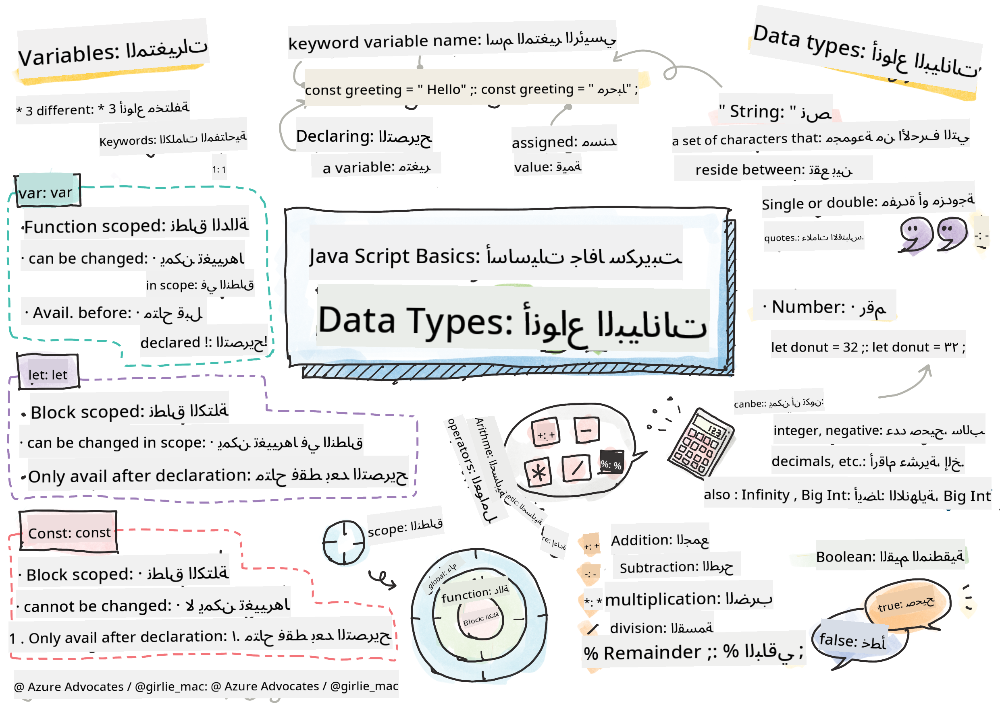

<!--
CO_OP_TRANSLATOR_METADATA:
{
  "original_hash": "fc6aef8ecfdd5b0ad2afa6e6ba52bfde",
  "translation_date": "2025-08-25T21:51:43+00:00",
  "source_file": "2-js-basics/1-data-types/README.md",
  "language_code": "ar"
}
-->
# أساسيات JavaScript: أنواع البيانات


> رسم توضيحي بواسطة [Tomomi Imura](https://twitter.com/girlie_mac)

## اختبار ما قبل المحاضرة
[اختبار ما قبل المحاضرة](https://ashy-river-0debb7803.1.azurestaticapps.net/quiz/7)

تغطي هذه الدرس أساسيات JavaScript، اللغة التي تضيف التفاعل إلى الويب.

> يمكنك أخذ هذا الدرس على [Microsoft Learn](https://docs.microsoft.com/learn/modules/web-development-101-variables/?WT.mc_id=academic-77807-sagibbon)!

[](https://youtube.com/watch?v=JNIXfGiDWM8 "المتغيرات في JavaScript")

[](https://youtube.com/watch?v=AWfA95eLdq8 "أنواع البيانات في JavaScript")

> 🎥 انقر على الصور أعلاه لمشاهدة فيديوهات حول المتغيرات وأنواع البيانات

لنبدأ بالمتغيرات وأنواع البيانات التي تحتويها!

## المتغيرات

المتغيرات تخزن القيم التي يمكن استخدامها وتغييرها في جميع أنحاء الكود الخاص بك.

إنشاء و**تصريح** عن متغير يتم باستخدام الصيغة التالية **[الكلمة المفتاحية] [الاسم]**. وهي تتكون من جزئين:

- **الكلمة المفتاحية**. يمكن أن تكون الكلمة المفتاحية `let` أو `var`.

✅ تم تقديم الكلمة المفتاحية `let` في ES6 وتمنح المتغير ما يسمى _نطاق الكتلة_. يُوصى باستخدام `let` بدلاً من `var`. سنغطي نطاق الكتلة بشكل أعمق في الأجزاء المستقبلية.

- **اسم المتغير**، وهو اسم تختاره بنفسك.

### المهمة - العمل مع المتغيرات

1. **تصريح عن متغير**. لنصرح عن متغير باستخدام الكلمة المفتاحية `let`:

    ```javascript
    let myVariable;
    ```

   الآن تم التصريح عن `myVariable` باستخدام الكلمة المفتاحية `let`. حاليًا ليس لديه قيمة.

1. **تعيين قيمة**. قم بتخزين قيمة في متغير باستخدام عامل التشغيل `=`، متبوعًا بالقيمة المتوقعة.

    ```javascript
    myVariable = 123;
    ```

   > ملاحظة: استخدام `=` في هذا الدرس يعني أننا نستخدم "عامل التعيين"، الذي يُستخدم لتعيين قيمة لمتغير. لا يدل على المساواة.

   الآن تم *تهيئة* `myVariable` بالقيمة 123.

1. **إعادة صياغة**. استبدل الكود الخاص بك بالبيان التالي.

    ```javascript
    let myVariable = 123;
    ```

    يُطلق على ما سبق اسم _تهيئة صريحة_ عندما يتم التصريح عن متغير ويتم تعيين قيمة له في نفس الوقت.

1. **تغيير قيمة المتغير**. قم بتغيير قيمة المتغير بالطريقة التالية:

   ```javascript
   myVariable = 321;
   ```

   بمجرد التصريح عن متغير، يمكنك تغيير قيمته في أي وقت في الكود الخاص بك باستخدام عامل التشغيل `=` والقيمة الجديدة.

   ✅ جربها! يمكنك كتابة JavaScript مباشرة في متصفحك. افتح نافذة المتصفح وانتقل إلى أدوات المطور. في وحدة التحكم، ستجد موجهًا؛ اكتب `let myVariable = 123`، اضغط على زر الإدخال، ثم اكتب `myVariable`. ماذا يحدث؟ لاحظ أنك ستتعلم المزيد عن هذه المفاهيم في الدروس اللاحقة.

## الثوابت

تصريح وتهيئة الثابت يتبع نفس مفاهيم المتغير، باستثناء الكلمة المفتاحية `const`. عادةً ما يتم التصريح عن الثوابت باستخدام أحرف كبيرة.

```javascript
const MY_VARIABLE = 123;
```

الثوابت تشبه المتغيرات، مع استثناءين:

- **يجب أن تحتوي على قيمة**. يجب تهيئة الثوابت، أو ستحدث خطأ عند تشغيل الكود.
- **لا يمكن تغيير المرجع**. لا يمكن تغيير مرجع الثابت بمجرد تهيئته، أو ستحدث خطأ عند تشغيل الكود. لنلقِ نظرة على مثالين:
   - **قيمة بسيطة**. ما يلي غير مسموح به:
   
      ```javascript
      const PI = 3;
      PI = 4; // not allowed
      ```
 
   - **مرجع الكائن محمي**. ما يلي غير مسموح به.
   
      ```javascript
      const obj = { a: 3 };
      obj = { b: 5 } // not allowed
      ```

    - **قيمة الكائن غير محمية**. ما يلي مسموح به:
    
      ```javascript
      const obj = { a: 3 };
      obj.a = 5;  // allowed
      ```

      أعلاه تقوم بتغيير قيمة الكائن ولكن ليس المرجع نفسه، مما يجعله مسموحًا.

   > ملاحظة، `const` تعني أن المرجع محمي من إعادة التعيين. القيمة ليست _غير قابلة للتغيير_ ويمكن أن تتغير، خاصة إذا كانت بنية معقدة مثل الكائن.

## أنواع البيانات

يمكن للمتغيرات تخزين أنواع مختلفة من القيم، مثل الأرقام والنصوص. تُعرف هذه الأنواع المختلفة من القيم باسم **نوع البيانات**. أنواع البيانات جزء مهم من تطوير البرمجيات لأنها تساعد المطورين على اتخاذ قرارات حول كيفية كتابة الكود وكيفية تشغيل البرنامج. علاوة على ذلك، بعض أنواع البيانات لديها ميزات فريدة تساعد في تحويل أو استخراج معلومات إضافية من القيمة.

✅ تُعرف أنواع البيانات أيضًا باسم البدائيات في JavaScript، لأنها أدنى أنواع البيانات التي توفرها اللغة. هناك 7 أنواع بيانات بدائية: string، number، bigint، boolean، undefined، null و symbol. خذ دقيقة لتصور ما يمثله كل من هذه البدائيات. ما هو `zebra`؟ ماذا عن `0`؟ `true`؟

### الأرقام

في القسم السابق، كانت قيمة `myVariable` من نوع بيانات الرقم.

`let myVariable = 123;`

يمكن للمتغيرات تخزين جميع أنواع الأرقام، بما في ذلك الأرقام العشرية أو السالبة. يمكن أيضًا استخدام الأرقام مع عوامل التشغيل الحسابية، التي تم تغطيتها في [القسم التالي](../../../../2-js-basics/1-data-types).

### عوامل التشغيل الحسابية

هناك عدة أنواع من العوامل لاستخدامها عند إجراء العمليات الحسابية، وبعضها مدرج هنا:

| الرمز | الوصف                                                                   | المثال                          |
| ------ | ------------------------------------------------------------------------ | -------------------------------- |
| `+`    | **الإضافة**: يحسب مجموع رقمين                                           | `1 + 2 //الإجابة المتوقعة هي 3`   |
| `-`    | **الطرح**: يحسب الفرق بين رقمين                                         | `1 - 2 //الإجابة المتوقعة هي -1`  |
| `*`    | **الضرب**: يحسب حاصل ضرب رقمين                                          | `1 * 2 //الإجابة المتوقعة هي 2`   |
| `/`    | **القسمة**: يحسب خارج قسمة رقمين                                       | `1 / 2 //الإجابة المتوقعة هي 0.5` |
| `%`    | **الباقي**: يحسب الباقي من قسمة رقمين                                  | `1 % 2 //الإجابة المتوقعة هي 1`   |

✅ جربها! جرب عملية حسابية في وحدة التحكم في متصفحك. هل تفاجأت بالنتائج؟

### النصوص

النصوص هي مجموعات من الأحرف التي تقع بين علامات الاقتباس الفردية أو المزدوجة.

- `'هذا نص'`
- `"هذا أيضًا نص"`
- `let myString = 'هذه قيمة نصية مخزنة في متغير';`

تذكر استخدام علامات الاقتباس عند كتابة نص، وإلا ستفترض JavaScript أنه اسم متغير.

### تنسيق النصوص

النصوص هي نصوصية، وستحتاج إلى التنسيق من وقت لآخر.

لـ **دمج** نصين أو أكثر، أو جمعهما معًا، استخدم عامل التشغيل `+`.

```javascript
let myString1 = "Hello";
let myString2 = "World";

myString1 + myString2 + "!"; //HelloWorld!
myString1 + " " + myString2 + "!"; //Hello World!
myString1 + ", " + myString2 + "!"; //Hello, World!

```

✅ لماذا `1 + 1 = 2` في JavaScript، ولكن `'1' + '1' = 11؟` فكر في الأمر. ماذا عن `'1' + 1`؟

**القوالب النصية** هي طريقة أخرى لتنسيق النصوص، باستثناء أنه بدلاً من علامات الاقتباس، يتم استخدام العلامة الخلفية. أي شيء ليس نصًا عاديًا يجب وضعه داخل القوالب `${ }`. يشمل ذلك أي متغيرات قد تكون نصوصًا.

```javascript
let myString1 = "Hello";
let myString2 = "World";

`${myString1} ${myString2}!` //Hello World!
`${myString1}, ${myString2}!` //Hello, World!
```

يمكنك تحقيق أهداف التنسيق الخاصة بك بأي طريقة، ولكن القوالب النصية ستراعي أي مسافات وفواصل أسطر.

✅ متى ستستخدم قالب نصي مقابل نص عادي؟

### القيم المنطقية

القيم المنطقية يمكن أن تكون فقط قيمتين: `true` أو `false`. القيم المنطقية يمكن أن تساعد في اتخاذ قرارات حول أي سطور من الكود يجب تشغيلها عند استيفاء شروط معينة. في كثير من الحالات، تساعد [العوامل](../../../../2-js-basics/1-data-types) في تعيين قيمة للقيمة المنطقية وستلاحظ غالبًا أن المتغيرات يتم تهيئتها أو تحديث قيمها باستخدام عامل.

- `let myTrueBool = true`
- `let myFalseBool = false`

✅ يمكن اعتبار المتغير "صحيحًا" إذا كان يقيم إلى القيمة المنطقية `true`. من المثير للاهتمام، في JavaScript، [جميع القيم صحيحة ما لم يتم تعريفها كقيم خاطئة](https://developer.mozilla.org/docs/Glossary/Truthy).

---

## 🚀 التحدي

JavaScript مشهورة بطرقها المفاجئة في التعامل مع أنواع البيانات في بعض الأحيان. قم ببعض البحث حول هذه "المفاجآت". على سبيل المثال: حساسية حالة الأحرف قد تكون مشكلة! جرب هذا في وحدة التحكم الخاصة بك: `let age = 1; let Age = 2; age == Age` (يُظهر `false` -- لماذا؟). ما المفاجآت الأخرى التي يمكنك العثور عليها؟

## اختبار ما بعد المحاضرة
[اختبار ما بعد المحاضرة](https://ashy-river-0debb7803.1.azurestaticapps.net/quiz/8)

## المراجعة والدراسة الذاتية

ألقِ نظرة على [هذه القائمة من تمارين JavaScript](https://css-tricks.com/snippets/javascript/) وجرب واحدة. ماذا تعلمت؟

## الواجب

[ممارسة أنواع البيانات](assignment.md)

**إخلاء المسؤولية**:  
تم ترجمة هذا المستند باستخدام خدمة الترجمة بالذكاء الاصطناعي [Co-op Translator](https://github.com/Azure/co-op-translator). بينما نسعى لتحقيق الدقة، يرجى العلم أن الترجمات الآلية قد تحتوي على أخطاء أو معلومات غير دقيقة. يجب اعتبار المستند الأصلي بلغته الأصلية المصدر الرسمي. للحصول على معلومات حاسمة، يُوصى بالاستعانة بترجمة بشرية احترافية. نحن غير مسؤولين عن أي سوء فهم أو تفسيرات خاطئة تنشأ عن استخدام هذه الترجمة.