# أساسيات JavaScript: أنواع البيانات


> رسم توضيحي بواسطة [Tomomi Imura](https://twitter.com/girlie_mac)

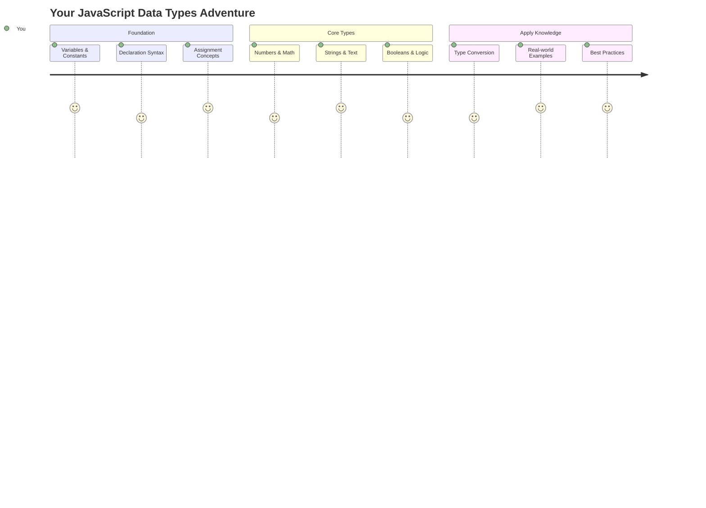

أنواع البيانات هي واحدة من المفاهيم الأساسية في JavaScript التي ستواجهها في كل برنامج تكتبه. فكر في أنواع البيانات كنظام تصنيف استخدمه أمناء المكتبات القدامى في الإسكندرية – حيث كان لديهم أماكن محددة لللفائف التي تحتوي على الشعر، الرياضيات، والسجلات التاريخية. JavaScript تنظم المعلومات بطريقة مشابهة مع فئات مختلفة لأنواع البيانات المختلفة.

في هذا الدرس، سنستكشف أنواع البيانات الأساسية التي تجعل JavaScript تعمل. ستتعلم كيفية التعامل مع الأرقام، النصوص، القيم الصحيحة/الخاطئة، وفهم لماذا اختيار النوع الصحيح ضروري لبرامجك. قد تبدو هذه المفاهيم مجردة في البداية، ولكن مع الممارسة، ستصبح طبيعية بالنسبة لك.

فهم أنواع البيانات سيجعل كل شيء آخر في JavaScript أكثر وضوحًا. تمامًا كما يحتاج المهندسون المعماريون إلى فهم مواد البناء المختلفة قبل بناء الكاتدرائية، فإن هذه الأساسيات ستدعم كل ما تبنيه في المستقبل.

## اختبار ما قبل المحاضرة
[اختبار ما قبل المحاضرة](https://ff-quizzes.netlify.app/web/)

يغطي هذا الدرس أساسيات JavaScript، اللغة التي توفر التفاعل على الويب.

> يمكنك أخذ هذا الدرس على [Microsoft Learn](https://docs.microsoft.com/learn/modules/web-development-101-variables/?WT.mc_id=academic-77807-sagibbon)!

[](https://youtube.com/watch?v=JNIXfGiDWM8 "المتغيرات في JavaScript")

[](https://youtube.com/watch?v=AWfA95eLdq8 "أنواع البيانات في JavaScript")

> 🎥 انقر على الصور أعلاه لمشاهدة فيديوهات حول المتغيرات وأنواع البيانات

لنبدأ مع المتغيرات وأنواع البيانات التي تملؤها!

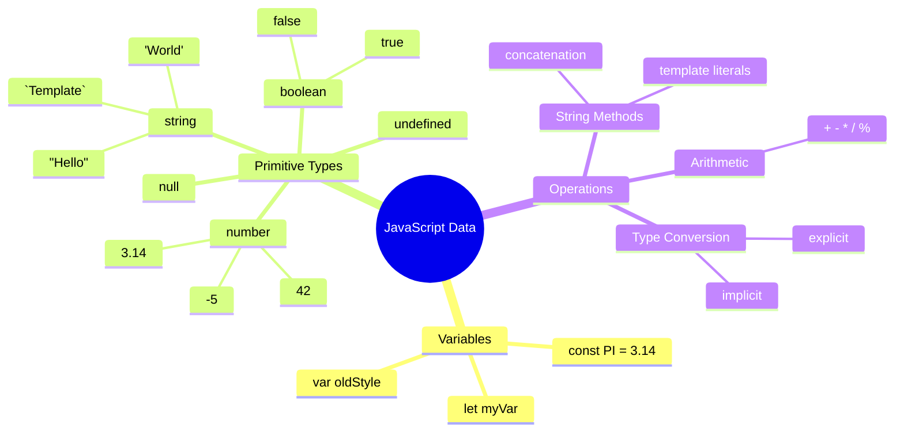

## المتغيرات

المتغيرات هي اللبنات الأساسية في البرمجة. مثل الجرار المسمّاة التي استخدمها الكيميائيون في العصور الوسطى لتخزين المواد المختلفة، تتيح لك المتغيرات تخزين المعلومات وإعطائها اسمًا وصفيًا حتى تتمكن من الرجوع إليها لاحقًا. هل تحتاج إلى تذكر عمر شخص ما؟ خزّنه في متغير يسمى `age`. هل تريد تتبع اسم المستخدم؟ احتفظ به في متغير يسمى `userName`.

سنركز على النهج الحديث لإنشاء المتغيرات في JavaScript. تمثل التقنيات التي ستتعلمها هنا سنوات من تطور اللغة وأفضل الممارسات التي طورها مجتمع البرمجة.

إنشاء و**تصريح** المتغير له الصيغة التالية **[الكلمة المفتاحية] [الاسم]**. يتكون من جزئين:

- **الكلمة المفتاحية**. استخدم `let` للمتغيرات التي يمكن أن تتغير، أو `const` للقيم التي تبقى ثابتة.
- **اسم المتغير**، وهو اسم وصفي تختاره بنفسك.

✅ تم تقديم الكلمة المفتاحية `let` في ES6 وتمنح متغيرك ما يسمى _نطاق الكتلة_. يُوصى باستخدام `let` أو `const` بدلاً من الكلمة المفتاحية القديمة `var`. سنغطي نطاق الكتلة بشكل أعمق في الأجزاء المستقبلية.

### المهمة - العمل مع المتغيرات

1. **صرّح عن متغير**. لنبدأ بإنشاء أول متغير لدينا:

    ```javascript
    let myVariable;
    ```

   **ما الذي يحققه هذا:**
   - هذا يخبر JavaScript بإنشاء موقع تخزين يسمى `myVariable`
   - تخصص JavaScript مساحة في الذاكرة لهذا المتغير
   - المتغير حاليًا ليس له قيمة (غير معرّف)

2. **امنحه قيمة**. الآن لنضع شيئًا في متغيرنا:

    ```javascript
    myVariable = 123;
    ```

   **كيف تعمل عملية الإسناد:**
   - يقوم المشغل `=` بإسناد القيمة 123 إلى متغيرنا
   - يحتوي المتغير الآن على هذه القيمة بدلاً من أن يكون غير معرّف
   - يمكنك الرجوع إلى هذه القيمة في جميع أنحاء الكود باستخدام `myVariable`

   > ملاحظة: استخدام `=` في هذا الدرس يعني أننا نستخدم "مشغل الإسناد"، الذي يُستخدم لتعيين قيمة لمتغير. لا يشير إلى المساواة.

3. **افعلها بطريقة ذكية**. في الواقع، دعنا نجمع بين الخطوتين:

    ```javascript
    let myVariable = 123;
    ```

    **هذا النهج أكثر كفاءة:**
    - تقوم بتصريح المتغير وتعيين قيمة في بيان واحد
    - هذه هي الممارسة القياسية بين المطورين
    - يقلل من طول الكود مع الحفاظ على الوضوح

4. **غيّر رأيك**. ماذا لو أردنا تخزين رقم مختلف؟

   ```javascript
   myVariable = 321;
   ```

   **فهم إعادة الإسناد:**
   - يحتوي المتغير الآن على 321 بدلاً من 123
   - يتم استبدال القيمة السابقة – المتغيرات تخزن قيمة واحدة فقط في كل مرة
   - هذه القابلية للتغيير هي السمة الرئيسية للمتغيرات التي يتم التصريح عنها باستخدام `let`

   ✅ جرّبها! يمكنك كتابة JavaScript مباشرة في متصفحك. افتح نافذة المتصفح وانتقل إلى أدوات المطور. في وحدة التحكم، ستجد موجهًا؛ اكتب `let myVariable = 123`، اضغط على زر الإدخال، ثم اكتب `myVariable`. ماذا يحدث؟ لاحظ، ستتعلم المزيد عن هذه المفاهيم في الدروس اللاحقة.

### 🧠 **اختبار إتقان المتغيرات: الشعور بالراحة**

**لنرى كيف تشعر بشأن المتغيرات:**
- هل يمكنك شرح الفرق بين التصريح والإسناد لمتغير؟
- ماذا يحدث إذا حاولت استخدام متغير قبل التصريح عنه؟
- متى تختار `let` بدلاً من `const` لمتغير؟

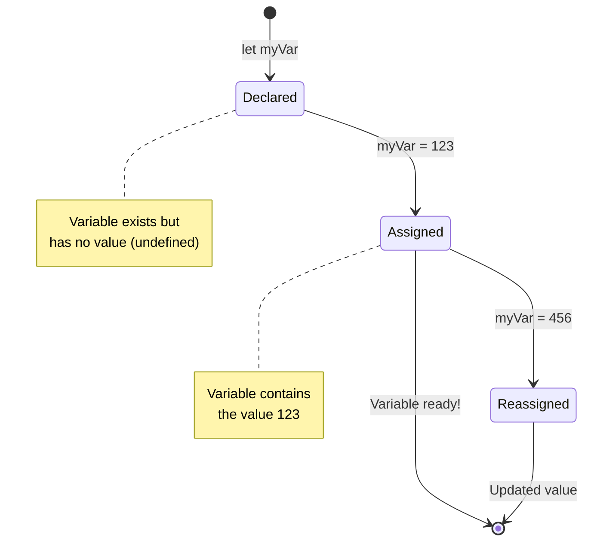

> **نصيحة سريعة**: فكر في المتغيرات كصناديق تخزين مسماة. تقوم بإنشاء الصندوق (`let`)، وضع شيء فيه (`=`)، ويمكنك لاحقًا استبدال المحتويات إذا لزم الأمر!

## الثوابت

في بعض الأحيان تحتاج إلى تخزين معلومات يجب ألا تتغير أبدًا أثناء تنفيذ البرنامج. فكر في الثوابت مثل المبادئ الرياضية التي وضعها إقليدس في اليونان القديمة – بمجرد إثباتها وتوثيقها، ظلت ثابتة لجميع المراجع المستقبلية.

الثوابت تعمل بشكل مشابه للمتغيرات، ولكن مع قيد مهم: بمجرد إسناد قيمتها، لا يمكن تغييرها. تساعد هذه الخاصية في منع التعديلات العرضية على القيم الحرجة في برنامجك.

تصريح وتخصيص الثابت يتبع نفس مفاهيم المتغير، مع استثناء الكلمة المفتاحية `const`. عادةً ما يتم التصريح عن الثوابت بأحرف كبيرة.

```javascript
const MY_VARIABLE = 123;
```

**ما الذي يفعله هذا الكود:**
- **ينشئ** ثابتًا يسمى `MY_VARIABLE` بالقيمة 123
- **يستخدم** اتفاقية تسمية بالأحرف الكبيرة للثوابت
- **يمنع** أي تغييرات مستقبلية لهذه القيمة

الثوابت لها قاعدتان رئيسيتان:

- **يجب أن تعطيها قيمة فورًا** – لا يُسمح بالثوابت الفارغة!
- **لا يمكنك أبدًا تغيير تلك القيمة** – ستقوم JavaScript بإلقاء خطأ إذا حاولت. لنرى ما أعنيه:

   **قيمة بسيطة** - ما يلي غير مسموح به:
   
      ```javascript
      const PI = 3;
      PI = 4; // غير مسموح
      ```

   **ما تحتاج إلى تذكره:**
   - **محاولات** إعادة إسناد ثابت ستسبب خطأ
   - **تحمي** القيم المهمة من التغييرات العرضية
   - **تضمن** أن القيمة تبقى ثابتة طوال برنامجك
 
   **مرجع الكائن محمي** - ما يلي غير مسموح به:
   
      ```javascript
      const obj = { a: 3 };
      obj = { b: 5 } // غير مسموح
      ```

   **فهم هذه المفاهيم:**
   - **يمنع** استبدال الكائن بالكامل بآخر جديد
   - **يحمي** المرجع للكائن الأصلي
   - **يحافظ** على هوية الكائن في الذاكرة

    **قيمة الكائن غير محمية** - ما يلي مسموح به:
    
      ```javascript
      const obj = { a: 3 };
      obj.a = 5;  // مسموح
      ```

      **تفصيل ما يحدث هنا:**
      - **يعدل** قيمة الخاصية داخل الكائن
      - **يحافظ** على نفس مرجع الكائن
      - **يوضح** أن محتويات الكائن يمكن أن تتغير بينما يبقى المرجع ثابتًا

   > ملاحظة، تعني `const` أن المرجع محمي من إعادة الإسناد. القيمة ليست _غير قابلة للتغيير_ ومع ذلك يمكن أن تتغير، خاصة إذا كانت بنية معقدة مثل الكائن.

## أنواع البيانات

JavaScript تنظم المعلومات في فئات مختلفة تسمى أنواع البيانات. هذا المفهوم يشبه كيف صنف العلماء القدامى المعرفة – ميز أرسطو بين أنواع مختلفة من التفكير، مع العلم أن المبادئ المنطقية لا يمكن تطبيقها بشكل موحد على الشعر، الرياضيات، والفلسفة الطبيعية.

أنواع البيانات مهمة لأن العمليات المختلفة تعمل مع أنواع مختلفة من المعلومات. تمامًا كما لا يمكنك إجراء العمليات الحسابية على اسم شخص أو ترتيب معادلة رياضية أبجديًا، تتطلب JavaScript النوع المناسب من البيانات لكل عملية. فهم هذا يمنع الأخطاء ويجعل الكود الخاص بك أكثر موثوقية.

يمكن للمتغيرات تخزين أنواع مختلفة من القيم، مثل الأرقام والنصوص. تُعرف هذه الأنواع المختلفة من القيم باسم **نوع البيانات**. أنواع البيانات هي جزء مهم من تطوير البرمجيات لأنها تساعد المطورين على اتخاذ قرارات حول كيفية كتابة الكود وكيفية تشغيل البرنامج. علاوة على ذلك، بعض أنواع البيانات لها ميزات فريدة تساعد في تحويل أو استخراج معلومات إضافية من قيمة.

✅ تُعرف أنواع البيانات أيضًا باسم البدائيات في JavaScript، لأنها أنواع البيانات ذات المستوى الأدنى التي توفرها اللغة. هناك 7 أنواع بيانات بدائية: string، number، bigint، boolean، undefined، null، وsymbol. خذ دقيقة لتصور ما قد يمثله كل من هذه البدائيات. ما هو `zebra`؟ ماذا عن `0`؟ `true`؟

### الأرقام

الأرقام هي النوع الأكثر بساطة في JavaScript. سواء كنت تعمل مع أرقام صحيحة مثل 42، أرقام عشرية مثل 3.14، أو أرقام سلبية مثل -5، JavaScript تتعامل معها بشكل موحد.

تذكر متغيرنا من قبل؟ تلك القيمة 123 التي قمنا بتخزينها كانت في الواقع نوع بيانات رقمي:

```javascript
let myVariable = 123;
```

**الخصائص الرئيسية:**
- JavaScript تتعرف تلقائيًا على القيم الرقمية
- يمكنك إجراء العمليات الحسابية باستخدام هذه المتغيرات
- لا حاجة لتصريح نوع صريح

يمكن للمتغيرات تخزين جميع أنواع الأرقام، بما في ذلك الأرقام العشرية أو السلبية. يمكن أيضًا استخدام الأرقام مع المشغلين الحسابيين، الذين يتم تناولهم في [القسم التالي](../../../../2-js-basics/1-data-types).

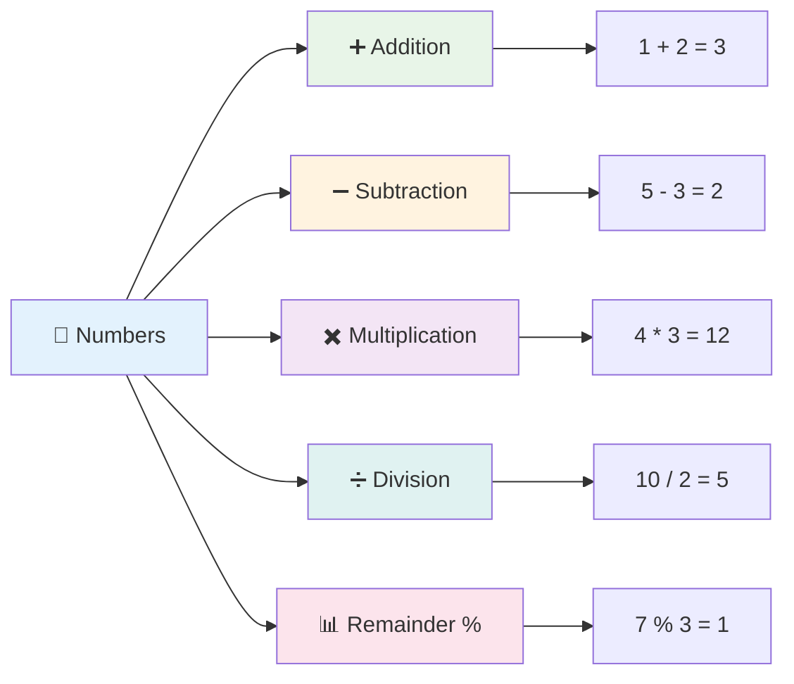

### المشغلون الحسابيون

المشغلون الحسابيون يسمحون لك بإجراء العمليات الحسابية في JavaScript. هذه المشغلون تتبع نفس المبادئ التي استخدمها علماء الرياضيات لقرون – نفس الرموز التي ظهرت في أعمال علماء مثل الخوارزمي، الذي طور التدوين الجبري.

تعمل المشغلون كما تتوقع من الرياضيات التقليدية: علامة الجمع للإضافة، علامة الطرح للطرح، وهكذا.

هناك عدة أنواع من المشغلين لاستخدامها عند إجراء الوظائف الحسابية، وبعضها مدرج هنا:

| الرمز | الوصف                                                                  | المثال                          |
| ------ | ------------------------------------------------------------------------ | -------------------------------- |
| `+`    | **الإضافة**: يحسب مجموع رقمين                                          | `1 + 2 //الإجابة المتوقعة هي 3`   |
| `-`    | **الطرح**: يحسب الفرق بين رقمين                                        | `1 - 2 //الإجابة المتوقعة هي -1`  |
| `*`    | **الضرب**: يحسب حاصل ضرب رقمين                                         | `1 * 2 //الإجابة المتوقعة هي 2`   |
| `/`    | **القسمة**: يحسب خارج قسمة رقمين                                      | `1 / 2 //الإجابة المتوقعة هي 0.5` |
| `%`    | **الباقي**: يحسب الباقي من قسمة رقمين                                 | `1 % 2 //الإجابة المتوقعة هي 1`   |

✅ جرّبها! جرب عملية حسابية في وحدة التحكم في متصفحك. هل تفاجأت بالنتائج؟

### 🧮 **اختبار مهارات الرياضيات: الحساب بثقة**

**اختبر فهمك للحساب:**
- ما الفرق بين `/` (القسمة) و `%` (الباقي)؟
- هل يمكنك التنبؤ بما يساوي `10 % 3`؟ (تلميح: ليس 3.33...)
- لماذا قد يكون مشغل الباقي مفيدًا في البرمجة؟

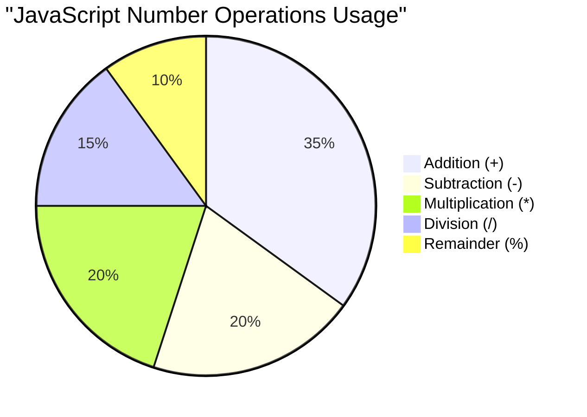

> **رؤية من العالم الحقيقي**: مشغل الباقي (%) مفيد جدًا للتحقق مما إذا كانت الأرقام زوجية/فردية، إنشاء أنماط، أو التنقل بين المصفوفات!

### النصوص

في JavaScript، يتم تمثيل البيانات النصية كنصوص. مصطلح "نصوص" يأتي من مفهوم الأحرف المرتبطة معًا في تسلسل، تمامًا مثل الطريقة التي كان الكتّاب في الأديرة في العصور الوسطى يربطون بها الحروف لتشكيل الكلمات والجمل في مخطوطاتهم.

النصوص أساسية لتطوير الويب. كل قطعة نص تظهر على موقع الويب – أسماء المستخدمين، تسميات الأزرار، رسائل الخطأ، المحتوى – يتم التعامل معها كبيانات نصية. فهم النصوص ضروري لإنشاء واجهات مستخدم وظيفية.

النصوص هي مجموعات من الأحرف التي تقع بين علامات الاقتباس الفردية أو المزدوجة.

```javascript
'This is a string'
"This is also a string"
let myString = 'This is a string value stored in a variable';
```

**فهم هذه المفاهيم:**
- **تستخدم** إما علامات الاقتباس الفردية `'` أو المزدوجة `"` لتعريف النصوص
- **تخزن** بيانات نصية يمكن أن تشمل الحروف، الأرقام، والرموز
- **تسند** قيم النصوص إلى المتغيرات لاستخدامها لاحقًا
- **تتطلب** علامات اقتباس لتمييز النص عن أسماء المتغيرات

تذكر استخدام علامات الاقتباس عند كتابة النص، وإلا ستفترض JavaScript أنه اسم متغير.

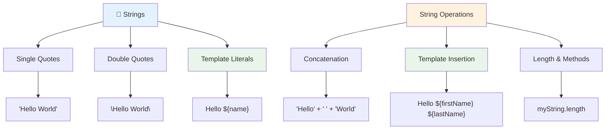

### تنسيق النصوص

تتيح لك معالجة النصوص دمج عناصر النص، تضمين المتغيرات، وإنشاء محتوى ديناميكي يستجيب لحالة البرنامج. هذه التقنية تمكنك من بناء النصوص برمجيًا.

غالبًا ما تحتاج إلى دمج نصوص متعددة معًا – تُعرف هذه العملية باسم الربط.
لدمج سلسلتين أو أكثر أو جمعهما معًا، استخدم عامل التشغيل `+`.

```javascript
let myString1 = "Hello";
let myString2 = "World";

myString1 + myString2 + "!"; //HelloWorld!
myString1 + " " + myString2 + "!"; //Hello World!
myString1 + ", " + myString2 + "!"; //Hello, World!
```

**خطوة بخطوة، إليك ما يحدث:**
- **يجمع** عدة سلاسل باستخدام عامل التشغيل `+`
- **يربط** السلاسل مباشرةً دون مسافات في المثال الأول
- **يضيف** مسافات `" "` بين السلاسل لتحسين القراءة
- **يدرج** علامات الترقيم مثل الفواصل لإنشاء تنسيق صحيح

✅ لماذا `1 + 1 = 2` في JavaScript، ولكن `'1' + '1' = 11؟` فكر في ذلك. ماذا عن `'1' + 1`؟

**القوالب النصية** هي طريقة أخرى لتنسيق النصوص، ولكن بدلاً من استخدام علامات الاقتباس، يتم استخدام العلامة العكسية. يجب وضع أي شيء ليس نصًا عاديًا داخل قوالب `${ }`. يشمل ذلك أي متغيرات قد تكون نصوصًا.

```javascript
let myString1 = "Hello";
let myString2 = "World";

`${myString1} ${myString2}!` //Hello World!
`${myString1}, ${myString2}!` //Hello, World!
```

**لنستوعب كل جزء:**
- **يستخدم** العلامة العكسية `` ` `` بدلاً من علامات الاقتباس العادية لإنشاء القوالب النصية
- **يدمج** المتغيرات مباشرة باستخدام صيغة القالب `${}`
- **يحافظ** على المسافات والتنسيق كما هو مكتوب
- **يوفر** طريقة أنظف لإنشاء نصوص معقدة باستخدام المتغيرات

يمكنك تحقيق أهداف التنسيق باستخدام أي طريقة، ولكن القوالب النصية تحترم أي مسافات وفواصل أسطر.

✅ متى تستخدم القالب النصي مقابل النص العادي؟

### 🔤 **اختبار إتقان النصوص: الثقة في معالجة النصوص**

**قيّم مهاراتك في النصوص:**
- هل يمكنك شرح لماذا `'1' + '1'` تساوي `'11'` بدلاً من `2`؟
- أي طريقة للنصوص تجدها أكثر وضوحًا: الدمج أم القوالب النصية؟
- ماذا يحدث إذا نسيت علامات الاقتباس حول النص؟

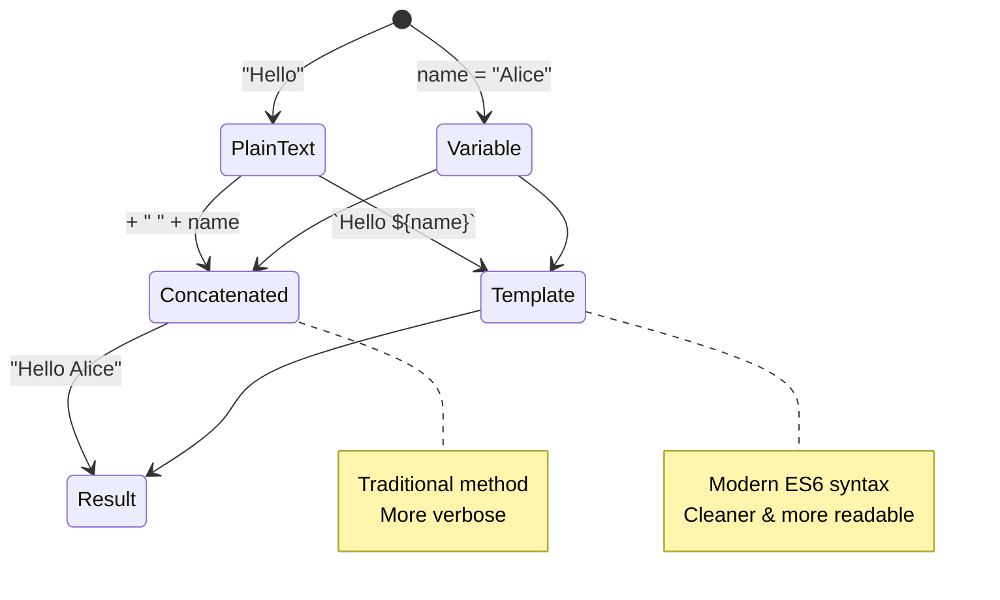

> **نصيحة احترافية**: القوالب النصية تُفضل عمومًا لبناء النصوص المعقدة لأنها أكثر وضوحًا وتتعامل بشكل رائع مع النصوص متعددة الأسطر!

### القيم المنطقية

القيم المنطقية تمثل أبسط أشكال البيانات: يمكن أن تحمل فقط واحدة من قيمتين – `true` أو `false`. هذا النظام المنطقي الثنائي يعود إلى عمل جورج بول، عالم الرياضيات في القرن التاسع عشر الذي طور الجبر البولياني.

على الرغم من بساطتها، القيم المنطقية ضرورية للمنطق البرمجي. فهي تمكن الكود الخاص بك من اتخاذ قرارات بناءً على الشروط – مثل ما إذا كان المستخدم مسجل الدخول، أو إذا تم النقر على زر، أو إذا تم استيفاء معايير معينة.

القيم المنطقية يمكن أن تكون فقط `true` أو `false`. تساعد القيم المنطقية في اتخاذ قرارات حول أي خطوط من الكود يجب أن تعمل عندما يتم استيفاء شروط معينة. في كثير من الحالات، [العوامل](../../../../2-js-basics/1-data-types) تساعد في تحديد قيمة القيم المنطقية وغالبًا ما تلاحظ وتكتب متغيرات يتم تهيئتها أو تحديث قيمها باستخدام عامل.

```javascript
let myTrueBool = true;
let myFalseBool = false;
```

**في المثال أعلاه، قمنا بـ:**
- **إنشاء** متغير يخزن القيمة المنطقية `true`
- **عرض** كيفية تخزين القيمة المنطقية `false`
- **استخدام** الكلمات المفتاحية الدقيقة `true` و `false` (بدون علامات اقتباس)
- **تحضير** هذه المتغيرات للاستخدام في العبارات الشرطية

✅ يمكن اعتبار المتغير "صحيحًا" إذا كان يقيم إلى القيمة المنطقية `true`. ومن المثير للاهتمام، في JavaScript، [كل القيم صحيحة إلا إذا تم تعريفها كقيم خاطئة](https://developer.mozilla.org/docs/Glossary/Truthy).

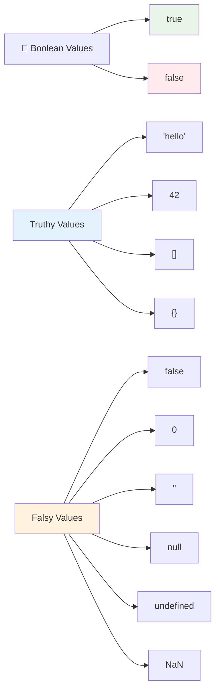

### 🎯 **اختبار المنطق البولياني: مهارات اتخاذ القرار**

**اختبر فهمك للقيم المنطقية:**
- لماذا تعتقد أن JavaScript لديها قيم "صحيحة" و"خاطئة" إلى جانب `true` و `false`؟
- هل يمكنك التنبؤ بأي من هذه القيم خاطئة: `0`, `"0"`, `[]`, `"false"`؟
- كيف يمكن أن تكون القيم المنطقية مفيدة في التحكم بتدفق البرنامج؟

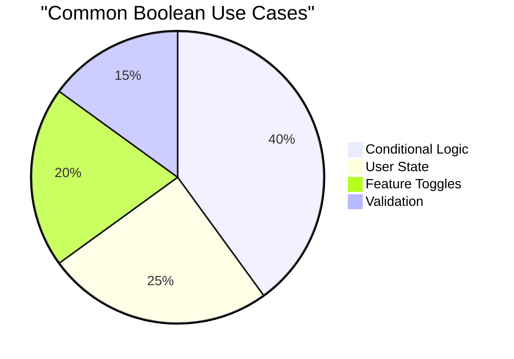

> **تذكر**: في JavaScript، هناك 6 قيم فقط تعتبر خاطئة: `false`, `0`, `""`, `null`, `undefined`, و `NaN`. كل شيء آخر يعتبر صحيحًا!

---

## 📊 **ملخص أدوات أنواع البيانات الخاصة بك**

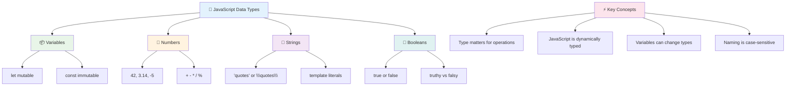

## تحدي وكيل GitHub Copilot 🚀

استخدم وضع الوكيل لإكمال التحدي التالي:

**الوصف:** قم بإنشاء مدير معلومات شخصية يوضح جميع أنواع البيانات في JavaScript التي تعلمتها في هذا الدرس أثناء التعامل مع سيناريوهات بيانات واقعية.

**المهمة:** قم ببناء برنامج JavaScript ينشئ كائن ملف تعريف مستخدم يحتوي على: اسم الشخص (نص)، العمر (رقم)، حالة كونه طالبًا (منطقي)، الألوان المفضلة كمصفوفة، وكائن عنوان يحتوي على خصائص الشارع، المدينة، والرمز البريدي. قم بتضمين وظائف لعرض معلومات الملف الشخصي وتحديث الحقول الفردية. تأكد من عرض دمج النصوص، القوالب النصية، العمليات الحسابية مع العمر، والمنطق البولياني لحالة الطالب.

تعرف على المزيد حول [وضع الوكيل](https://code.visualstudio.com/blogs/2025/02/24/introducing-copilot-agent-mode) هنا.

## 🚀 التحدي

JavaScript لديها بعض السلوكيات التي قد تفاجئ المطورين. إليك مثال كلاسيكي للاستكشاف: حاول كتابة هذا في وحدة التحكم في المتصفح: `let age = 1; let Age = 2; age == Age` ولاحظ النتيجة. ستعيد `false` – هل يمكنك تحديد السبب؟

هذا يمثل واحدًا من العديد من سلوكيات JavaScript التي تستحق الفهم. الإلمام بهذه الأمور سيساعدك على كتابة كود أكثر موثوقية وحل المشكلات بشكل أكثر فعالية.

## اختبار ما بعد المحاضرة
[اختبار ما بعد المحاضرة](https://ff-quizzes.netlify.app)

## المراجعة والدراسة الذاتية

ألقِ نظرة على [هذه القائمة من تمارين JavaScript](https://css-tricks.com/snippets/javascript/) وجرب واحدة. ماذا تعلمت؟

## الواجب

[ممارسة أنواع البيانات](assignment.md)

## 🚀 جدول إتقان أنواع البيانات في JavaScript

### ⚡ **ما يمكنك القيام به في الدقائق الخمس القادمة**
- [ ] افتح وحدة التحكم في المتصفح وأنشئ 3 متغيرات بأنواع بيانات مختلفة
- [ ] جرب التحدي: `let age = 1; let Age = 2; age == Age` واكتشف لماذا تكون النتيجة خاطئة
- [ ] مارس دمج النصوص باستخدام اسمك ورقمك المفضل
- [ ] اختبر ما يحدث عند إضافة رقم إلى نص

### 🎯 **ما يمكنك إنجازه خلال الساعة**
- [ ] أكمل اختبار ما بعد الدرس وراجع أي مفاهيم مربكة
- [ ] أنشئ آلة حاسبة صغيرة تضيف، تطرح، تضرب، وتقسم رقمين
- [ ] قم ببناء منسق أسماء بسيط باستخدام القوالب النصية
- [ ] استكشف الفروقات بين عوامل المقارنة `==` و `===`
- [ ] مارس التحويل بين أنواع البيانات المختلفة

### 📅 **أساسيات JavaScript الخاصة بك خلال أسبوع**
- [ ] أكمل الواجب بثقة وإبداع
- [ ] أنشئ كائن ملف تعريف شخصي باستخدام جميع أنواع البيانات التي تعلمتها
- [ ] مارس مع [تمارين JavaScript من CSS-Tricks](https://css-tricks.com/snippets/javascript/)
- [ ] قم ببناء مدقق نموذج بسيط باستخدام المنطق البولياني
- [ ] جرب أنواع البيانات المصفوفة والكائنات (مقدمة للدرس القادم)
- [ ] انضم إلى مجتمع JavaScript واطرح أسئلة حول أنواع البيانات

### 🌟 **تحولك خلال شهر**
- [ ] دمج معرفة أنواع البيانات في مشاريع برمجية أكبر
- [ ] فهم متى ولماذا تستخدم كل نوع بيانات في التطبيقات الحقيقية
- [ ] مساعدة المبتدئين الآخرين على فهم أساسيات JavaScript
- [ ] بناء تطبيق صغير يدير أنواع مختلفة من بيانات المستخدم
- [ ] استكشاف مفاهيم أنواع البيانات المتقدمة مثل الإكراه النوعي والمساواة الصارمة
- [ ] المساهمة في مشاريع JavaScript مفتوحة المصدر بتحسين الوثائق

### 🧠 **فحص إتقان أنواع البيانات النهائي**

**احتفل بأساسيات JavaScript الخاصة بك:**
- أي نوع بيانات فاجأك أكثر من حيث سلوكه؟
- ما مدى راحتك في شرح الفرق بين المتغيرات والثوابت لصديق؟
- ما هو الشيء الأكثر إثارة للاهتمام الذي اكتشفته عن نظام أنواع JavaScript؟
- ما هو التطبيق الواقعي الذي يمكنك تخيله بناءً على هذه الأساسيات؟

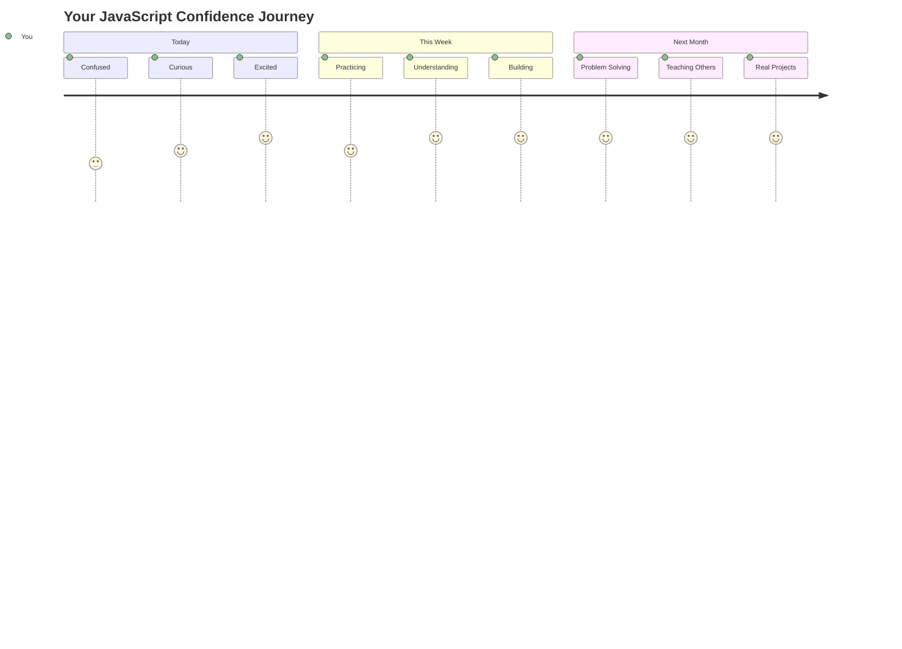

> 💡 **لقد بنيت الأساس!** فهم أنواع البيانات يشبه تعلم الأبجدية قبل كتابة القصص. كل برنامج JavaScript ستكتبه يومًا ما سيستخدم هذه المفاهيم الأساسية. لديك الآن اللبنات الأساسية لإنشاء مواقع ويب تفاعلية، تطبيقات ديناميكية، وحل مشكلات العالم الحقيقي باستخدام الكود. مرحبًا بك في عالم JavaScript الرائع! 🎉

---

**إخلاء المسؤولية**:  
تم ترجمة هذا المستند باستخدام خدمة الترجمة بالذكاء الاصطناعي [Co-op Translator](https://github.com/Azure/co-op-translator). بينما نسعى لتحقيق الدقة، يرجى العلم أن الترجمات الآلية قد تحتوي على أخطاء أو عدم دقة. يجب اعتبار المستند الأصلي بلغته الأصلية المصدر الرسمي. للحصول على معلومات حاسمة، يُوصى بالترجمة البشرية الاحترافية. نحن غير مسؤولين عن أي سوء فهم أو تفسير خاطئ ينشأ عن استخدام هذه الترجمة.