<!--
CO_OP_TRANSLATOR_METADATA:
{
  "original_hash": "71f7d7dafa1c7194d79ddac87f669ff9",
  "translation_date": "2025-11-03T12:26:17+00:00",
  "source_file": "2-js-basics/2-functions-methods/README.md",
  "language_code": "ar"
}
-->
# أساسيات JavaScript: الطرق والدوال


> رسم توضيحي بواسطة [Tomomi Imura](https://twitter.com/girlie_mac)

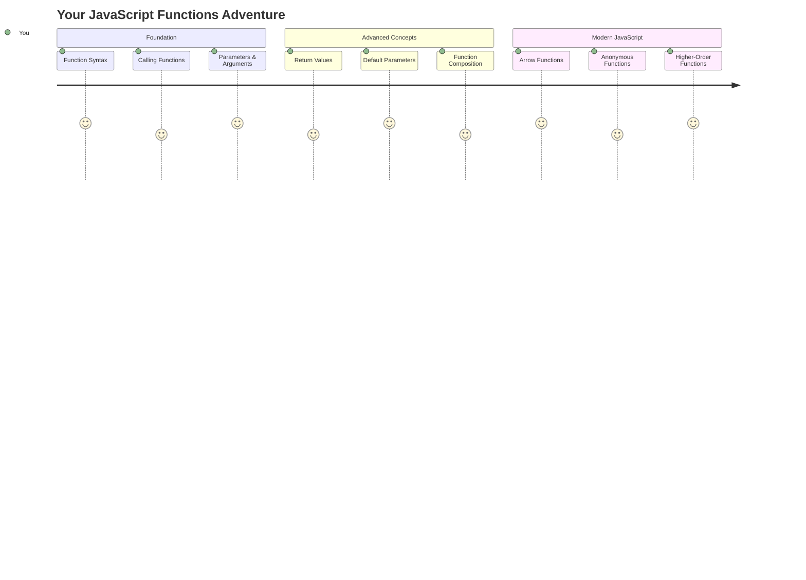

## اختبار ما قبل المحاضرة
[اختبار ما قبل المحاضرة](https://ff-quizzes.netlify.app)

كتابة نفس الكود مرارًا وتكرارًا هي واحدة من أكثر الإحباطات شيوعًا في البرمجة. تحل الدوال هذه المشكلة من خلال السماح لك بتجميع الكود في كتل قابلة لإعادة الاستخدام. فكر في الدوال مثل الأجزاء القياسية التي جعلت خط التجميع الخاص بـ Henry Ford ثوريًا – بمجرد إنشاء مكون موثوق، يمكنك استخدامه أينما احتجت دون الحاجة إلى إعادة بنائه من البداية.

تتيح لك الدوال تجميع أجزاء من الكود بحيث يمكنك إعادة استخدامها في جميع أنحاء البرنامج. بدلاً من نسخ ولصق نفس المنطق في كل مكان، يمكنك إنشاء دالة مرة واحدة واستدعائها عند الحاجة. هذه الطريقة تحافظ على تنظيم الكود وتجعل التحديثات أسهل بكثير.

في هذه الدرس، ستتعلم كيفية إنشاء دوال خاصة بك، تمرير المعلومات إليها، والحصول على نتائج مفيدة منها. ستكتشف الفرق بين الدوال والطرق، تتعرف على الأساليب الحديثة للكتابة، وترى كيف يمكن للدوال أن تعمل مع دوال أخرى. سنبني هذه المفاهيم خطوة بخطوة.

[](https://youtube.com/watch?v=XgKsD6Zwvlc "الطرق والدوال")

> 🎥 انقر على الصورة أعلاه لمشاهدة فيديو عن الطرق والدوال.

> يمكنك أخذ هذا الدرس على [Microsoft Learn](https://docs.microsoft.com/learn/modules/web-development-101-functions/?WT.mc_id=academic-77807-sagibbon)!

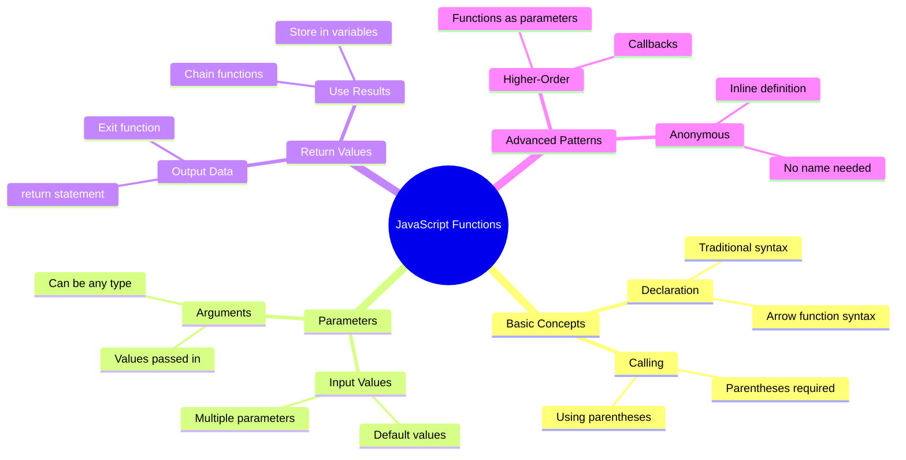

## الدوال

الدالة هي كتلة مستقلة من الكود تؤدي مهمة محددة. إنها تحتوي على منطق يمكنك تنفيذه عند الحاجة.

بدلاً من كتابة نفس الكود عدة مرات في البرنامج، يمكنك تجميعه في دالة واستدعاء تلك الدالة عند الحاجة. هذه الطريقة تحافظ على نظافة الكود وتجعل التحديثات أسهل بكثير. تخيل التحدي في الصيانة إذا كنت بحاجة إلى تغيير منطق منتشر في 20 موقعًا مختلفًا في قاعدة الكود.

تسمية الدوال بشكل وصفي أمر ضروري. الدالة ذات الاسم الجيد توضح غرضها بوضوح – عندما ترى `cancelTimer()`، تفهم فورًا ما تقوم به، تمامًا مثل الزر الذي يحمل تسمية واضحة يخبرك بما سيحدث عند النقر عليه.

## إنشاء واستدعاء دالة

لنلقِ نظرة على كيفية إنشاء دالة. الصيغة تتبع نمطًا ثابتًا:

```javascript
function nameOfFunction() { // function definition
 // function definition/body
}
```

لنقم بتفصيل هذا:
- الكلمة المفتاحية `function` تخبر JavaScript "مرحبًا، أنا أقوم بإنشاء دالة!"
- `nameOfFunction` هو المكان الذي تعطي فيه الدالة اسمًا وصفيًا
- الأقواس `()` هي المكان الذي يمكنك إضافة المعاملات فيه (سنتحدث عنها قريبًا)
- الأقواس المعقوفة `{}` تحتوي على الكود الفعلي الذي يتم تشغيله عند استدعاء الدالة

لنقم بإنشاء دالة ترحيب بسيطة لنرى هذا عمليًا:

```javascript
function displayGreeting() {
  console.log('Hello, world!');
}
```

هذه الدالة تطبع "Hello, world!" في وحدة التحكم. بمجرد تعريفها، يمكنك استخدامها عدة مرات حسب الحاجة.

لتنفيذ (أو "استدعاء") الدالة، اكتب اسمها متبوعًا بالأقواس. يسمح لك JavaScript بتعريف الدالة قبل أو بعد استدعائها – محرك JavaScript سيتولى ترتيب التنفيذ.

```javascript
// calling our function
displayGreeting();
```

عند تشغيل هذا السطر، يتم تنفيذ كل الكود داخل دالة `displayGreeting`، مما يعرض "Hello, world!" في وحدة التحكم في المتصفح. يمكنك استدعاء هذه الدالة مرارًا وتكرارًا.

### 🧠 **فحص أساسيات الدوال: بناء أول دوال لك**

**لنرى كيف تشعر بشأن الدوال الأساسية:**
- هل يمكنك شرح سبب استخدام الأقواس المعقوفة `{}` في تعريف الدوال؟
- ماذا يحدث إذا كتبت `displayGreeting` بدون الأقواس؟
- لماذا قد ترغب في استدعاء نفس الدالة عدة مرات؟

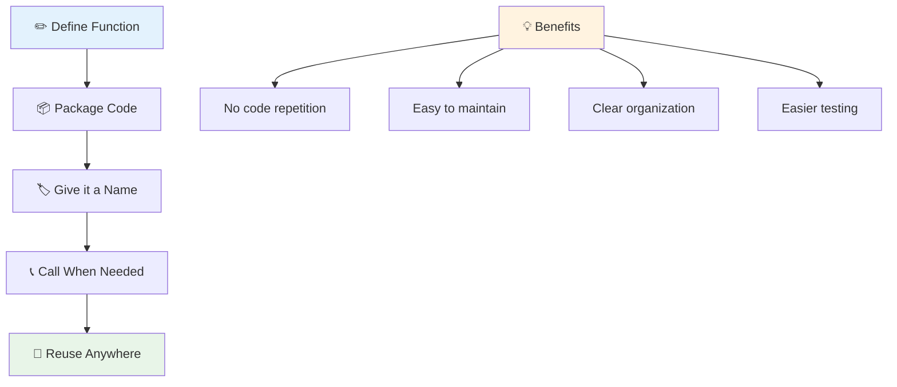

> **ملاحظة:** لقد كنت تستخدم **الطرق** طوال هذه الدروس. `console.log()` هي طريقة – في الأساس دالة تنتمي إلى الكائن `console`. الفرق الرئيسي هو أن الطرق مرتبطة بالكائنات، بينما الدوال مستقلة. يستخدم العديد من المطورين هذه المصطلحات بالتبادل في المحادثات غير الرسمية.

### أفضل الممارسات للدوال

إليك بعض النصائح لمساعدتك في كتابة دوال رائعة:

- أعطِ دوالك أسماء واضحة ووصفيّة – ستشكر نفسك في المستقبل!
- استخدم **camelCasing** لأسماء متعددة الكلمات (مثل `calculateTotal` بدلاً من `calculate_total`)
- اجعل كل دالة تركز على القيام بشيء واحد بشكل جيد

## تمرير المعلومات إلى دالة

دالتنا `displayGreeting` محدودة – يمكنها فقط عرض "Hello, world!" للجميع. تسمح لنا المعاملات بجعل الدوال أكثر مرونة وفائدة.

**المعاملات** تعمل كأماكن مؤقتة حيث يمكنك إدخال قيم مختلفة في كل مرة تستخدم فيها الدالة. بهذه الطريقة، يمكن لنفس الدالة العمل مع معلومات مختلفة في كل استدعاء.

تقوم بإدراج المعاملات داخل الأقواس عند تعريف الدالة، مع فصل المعاملات المتعددة بفواصل:

```javascript
function name(param, param2, param3) {

}
```

كل معاملة تعمل كمكان مؤقت – عندما يستدعي شخص ما الدالة، سيقدم قيمًا فعلية يتم إدخالها في هذه الأماكن.

لنقم بتحديث دالة الترحيب لتقبل اسم شخص ما:

```javascript
function displayGreeting(name) {
  const message = `Hello, ${name}!`;
  console.log(message);
}
```

لاحظ كيف نستخدم العلامات الخلفية (`` ` ``) و`${}` لإدخال الاسم مباشرة في رسالتنا – هذا يسمى القالب النصي، وهو طريقة مفيدة جدًا لبناء النصوص مع المتغيرات المدمجة.

الآن عندما نستدعي دالتنا، يمكننا تمرير أي اسم:

```javascript
displayGreeting('Christopher');
// displays "Hello, Christopher!" when run
```

JavaScript يأخذ النص `'Christopher'`، ويعينه إلى معاملة `name`، ويُنشئ الرسالة الشخصية "Hello, Christopher!"

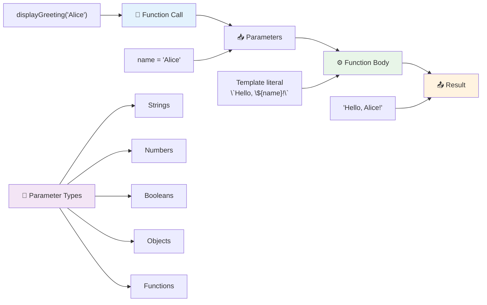

## القيم الافتراضية

ماذا لو أردنا جعل بعض المعاملات اختيارية؟ هنا تأتي القيم الافتراضية في متناول اليد!

لنفترض أننا نريد أن يتمكن الناس من تخصيص كلمة الترحيب، ولكن إذا لم يحددوا واحدة، سنستخدم "Hello" كخيار افتراضي. يمكنك إعداد القيم الافتراضية باستخدام علامة المساواة، تمامًا مثل تعيين متغير:

```javascript
function displayGreeting(name, salutation='Hello') {
  console.log(`${salutation}, ${name}`);
}
```

هنا، `name` لا يزال مطلوبًا، ولكن `salutation` لديه قيمة احتياطية `'Hello'` إذا لم يقدم أحد تحية مختلفة.

الآن يمكننا استدعاء هذه الدالة بطريقتين مختلفتين:

```javascript
displayGreeting('Christopher');
// displays "Hello, Christopher"

displayGreeting('Christopher', 'Hi');
// displays "Hi, Christopher"
```

في الاستدعاء الأول، يستخدم JavaScript القيمة الافتراضية "Hello" لأننا لم نحدد تحية. في الاستدعاء الثاني، يستخدم تحيتنا المخصصة "Hi" بدلاً من ذلك. هذه المرونة تجعل الدوال قابلة للتكيف مع سيناريوهات مختلفة.

### 🎛️ **فحص إتقان المعاملات: جعل الدوال مرنة**

**اختبر فهمك للمعاملات:**
- ما الفرق بين المعاملة والحجة؟
- لماذا تكون القيم الافتراضية مفيدة في البرمجة الواقعية؟
- هل يمكنك التنبؤ بما يحدث إذا مررت حججًا أكثر من المعاملات؟

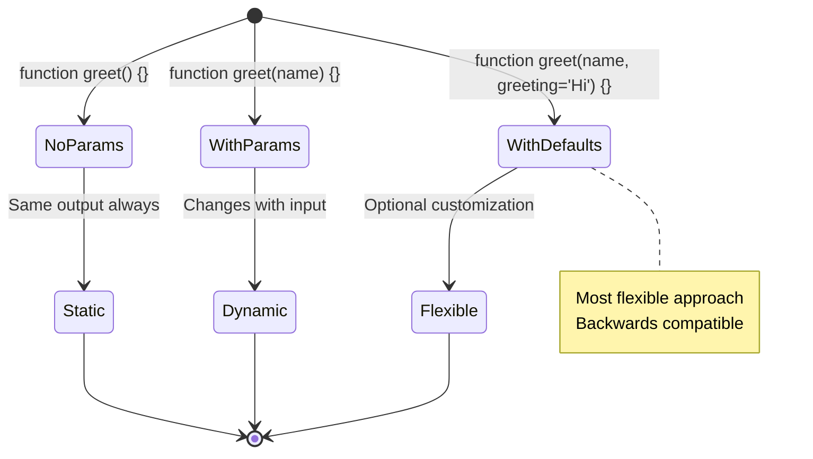

> **نصيحة احترافية**: تجعل المعاملات الافتراضية دوالك أكثر سهولة للمستخدم. يمكن للمستخدمين البدء بسرعة باستخدام القيم الافتراضية المعقولة، ولكن لا يزال بإمكانهم التخصيص عند الحاجة!

## القيم المرجعة

دوالنا حتى الآن كانت فقط تعرض رسائل في وحدة التحكم، ولكن ماذا لو أردت أن تحسب دالة شيئًا وتعيد لك النتيجة؟

هنا تأتي **القيم المرجعة**. بدلاً من مجرد عرض شيء ما، يمكن للدالة أن تعيد لك قيمة يمكنك تخزينها في متغير أو استخدامها في أجزاء أخرى من الكود.

لإرسال قيمة مرة أخرى، تستخدم الكلمة المفتاحية `return` متبوعة بما تريد إعادته:

```javascript
return myVariable;
```

هناك شيء مهم: عندما تصل الدالة إلى عبارة `return`، تتوقف فورًا عن التشغيل وترسل تلك القيمة إلى من استدعى الدالة.

لنقم بتعديل دالة الترحيب لدينا لإرجاع الرسالة بدلاً من طباعتها:

```javascript
function createGreetingMessage(name) {
  const message = `Hello, ${name}`;
  return message;
}
```

الآن بدلاً من طباعة الترحيب، تقوم هذه الدالة بإنشاء الرسالة وتسلمها لنا.

لاستخدام القيمة المرجعة، يمكننا تخزينها في متغير تمامًا مثل أي قيمة أخرى:

```javascript
const greetingMessage = createGreetingMessage('Christopher');
```

الآن يحتوي `greetingMessage` على "Hello, Christopher" ويمكننا استخدامه في أي مكان في الكود – لعرضه على صفحة ويب، تضمينه في بريد إلكتروني، أو تمريره إلى دالة أخرى.

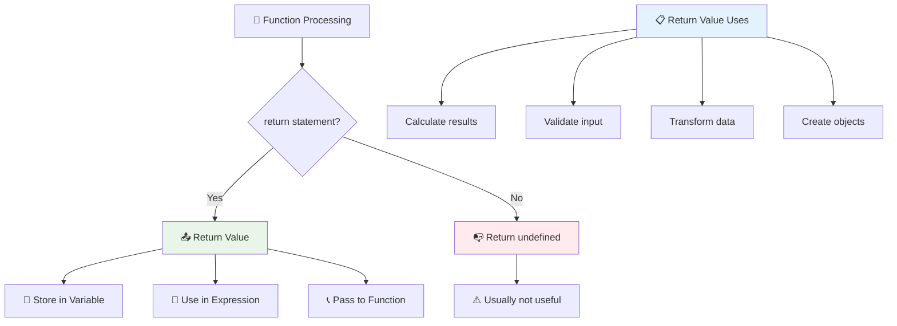

### 🔄 **فحص القيم المرجعة: الحصول على النتائج**

**قيّم فهمك للقيم المرجعة:**
- ماذا يحدث للكود بعد عبارة `return` في الدالة؟
- لماذا يكون إرجاع القيم غالبًا أفضل من مجرد الطباعة في وحدة التحكم؟
- هل يمكن للدالة أن تعيد أنواعًا مختلفة من القيم (نصوص، أرقام، قيم منطقية)؟

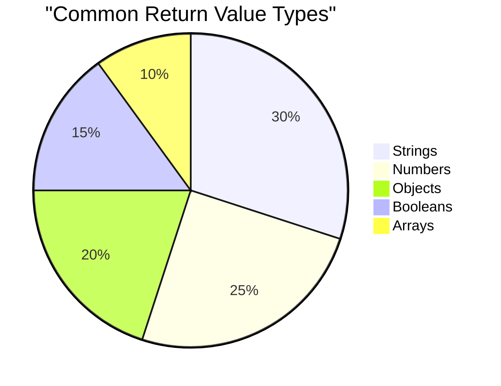

> **معلومة مهمة**: الدوال التي تعيد القيم أكثر تنوعًا لأن من يستدعيها يقرر ماذا يفعل بالنتيجة. هذا يجعل الكود أكثر قابلية للتجزئة وإعادة الاستخدام!

## الدوال كمعاملات لدوال أخرى

يمكن تمرير الدوال كمعاملات لدوال أخرى. على الرغم من أن هذا المفهوم قد يبدو معقدًا في البداية، إلا أنه ميزة قوية تتيح أنماط برمجة مرنة.

هذا النمط شائع جدًا عندما تريد أن تقول "عندما يحدث شيء ما، قم بتنفيذ هذا الكود الآخر." على سبيل المثال، "عندما ينتهي المؤقت، قم بتشغيل هذا الكود" أو "عندما ينقر المستخدم على الزر، استدعِ هذه الدالة."

لنلقِ نظرة على `setTimeout`، وهي دالة مدمجة تنتظر فترة زمنية معينة ثم تشغل بعض الكود. نحتاج إلى إخبارها بالكود الذي يجب تشغيله – حالة مثالية لتمرير دالة!

جرب هذا الكود – بعد 3 ثوانٍ، سترى رسالة:

```javascript
function displayDone() {
  console.log('3 seconds has elapsed');
}
// timer value is in milliseconds
setTimeout(displayDone, 3000);
```

لاحظ كيف نمرر `displayDone` (بدون أقواس) إلى `setTimeout`. نحن لا نستدعي الدالة بأنفسنا – نحن نسلمها إلى `setTimeout` ونقول "استدعِ هذه الدالة بعد 3 ثوانٍ."

### الدوال المجهولة

أحيانًا تحتاج إلى دالة لشيء واحد فقط ولا تريد إعطائها اسمًا. فكر في الأمر – إذا كنت تستخدم دالة مرة واحدة فقط، فلماذا تملأ الكود باسم إضافي؟

يسمح لك JavaScript بإنشاء **دوال مجهولة** – دوال بدون أسماء يمكنك تعريفها في المكان الذي تحتاجها فيه.

إليك كيف يمكننا إعادة كتابة مثال المؤقت باستخدام دالة مجهولة:

```javascript
setTimeout(function() {
  console.log('3 seconds has elapsed');
}, 3000);
```

هذا يحقق نفس النتيجة، ولكن يتم تعريف الدالة مباشرة داخل استدعاء `setTimeout`، مما يلغي الحاجة إلى تعريف دالة منفصلة.

### دوال السهم

يوفر JavaScript الحديث طريقة أقصر لكتابة الدوال تسمى **دوال السهم**. تستخدم `=>` (التي تبدو كالسهم – أليس كذلك؟) وهي شائعة جدًا بين المطورين.

تتيح دوال السهم لك تخطي الكلمة المفتاحية `function` وكتابة كود أكثر اختصارًا.

إليك مثال المؤقت الخاص بنا باستخدام دالة السهم:

```javascript
setTimeout(() => {
  console.log('3 seconds has elapsed');
}, 3000);
```

الأقواس `()` هي المكان الذي توضع فيه المعاملات (فارغة في هذه الحالة)، ثم يأتي السهم `=>`، وأخيرًا جسم الدالة داخل الأقواس المعقوفة. هذا يوفر نفس الوظيفة مع صيغة أكثر اختصارًا.

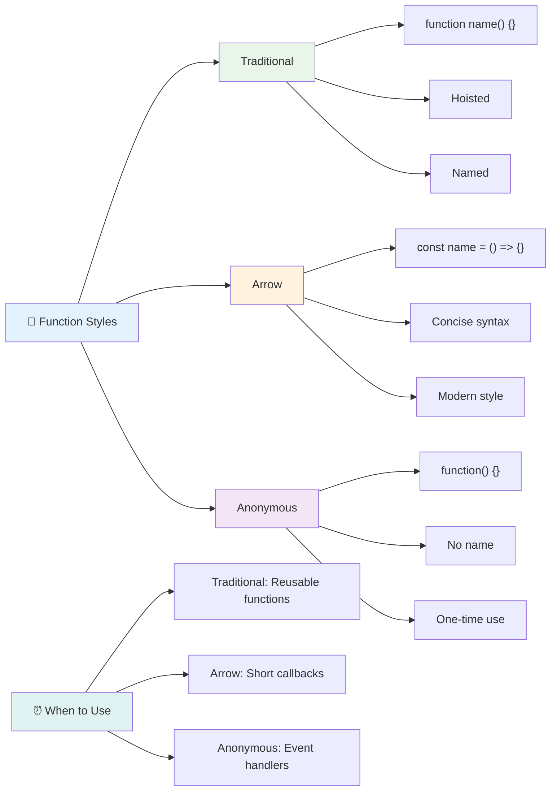

### متى تستخدم كل استراتيجية

متى يجب أن تستخدم كل نهج؟ إرشاد عملي: إذا كنت ستستخدم الدالة عدة مرات، أعطها اسمًا وقم بتعريفها بشكل منفصل. إذا كانت للاستخدام مرة واحدة فقط، فكر في استخدام دالة مجهولة. كلا دوال السهم والصيغة التقليدية خيارات صالحة، على الرغم من أن دوال السهم شائعة في قواعد الكود الحديثة.

### 🎨 **فحص أنماط الدوال: اختيار الصيغة المناسبة**

**اختبر فهمك للصيغة:**
- متى قد تفضل دوال السهم على الصيغة التقليدية للدوال؟
- ما الميزة الرئيسية للدوال المجهولة؟
- هل يمكنك التفكير في موقف تكون فيه الدالة المسماة أفضل من الدالة المجهولة؟

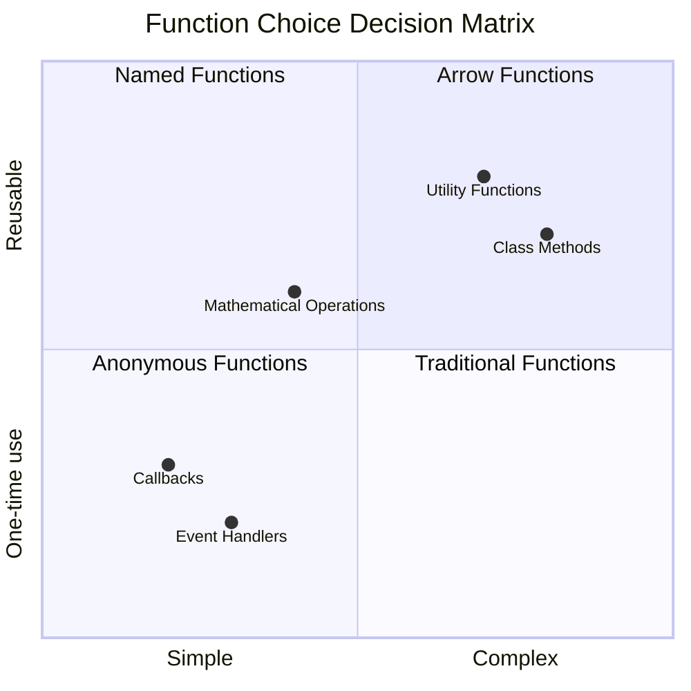

> **اتجاه حديث**: دوال السهم أصبحت الخيار الافتراضي للعديد من المطورين بسبب صياغتها المختصرة، ولكن الدوال التقليدية لا تزال لها مكانها!

---

## 🚀 التحدي

هل يمكنك التعبير في جملة واحدة عن الفرق بين الدوال والطرق؟ جرب ذلك!

## تحدي GitHub Copilot Agent 🚀

استخدم وضع الوكيل لإكمال التحدي التالي:

**الوصف:** قم بإنشاء مكتبة أدوات رياضية تحتوي على دوال رياضية توضح مفاهيم الدوال المختلفة التي تم تناولها في هذا الدرس، بما في ذلك المعاملات، القيم الافتراضية، القيم المرجعة، ودوال السهم.

**المهمة:** قم بإنشاء ملف JavaScript يسمى `mathUtils.js` يحتوي على الدوال التالية:
1. دالة `add` تأخذ معاملين وتعيد مجموعهما
2. دالة `multiply` مع قيم افتراضية للمعاملات (المعامل الثاني افتراضيًا 1)
3. دالة سهم `square` تأخذ رقمًا وتعيد مربعه
4. دالة `calculate` تقبل دالة أخرى كمعاملة ورقمين، ثم تطبق الدالة على هذه الأرقام
5. قم بتوضيح استدعاء كل دالة مع حالات اختبار مناسبة

تعرف على المزيد حول [وضع الوكيل](https://code.visualstudio.com/blogs/2025/02/24/introducing-copilot-agent-mode) هنا.

## اختبار ما بعد المحاضرة
[اختبار ما بعد المحاضرة](https://ff-quizzes.netlify.app)

## المراجعة والدراسة الذاتية

من المفيد [قراءة المزيد عن دوال السهم](https://developer.mozilla.org/docs/Web/JavaScript/Reference/Functions/Arrow_functions)، حيث يتم استخدامها بشكل متزايد في قواعد الكود. قم بممارسة كتابة دالة، ثم إعادة كتابتها باستخدام هذه الصيغة.

## الواجب

[المرح مع الدوال](assignment.md)

---

## 🧰 **ملخص أدوات دوال JavaScript الخاصة بك**

```mermaid
graph TD
    A["🎯 JavaScript Functions"] --> B["📋 Function Declaration"]
    A --> C["📥 Parameters"]
    A --> D["📤 Return Values"]
    A --> E["🎨 Modern Syntax"]
    
    B --> B1["function name() {}"]
    B --> B2["Descriptive naming"]
    B --> B3["Reusable code blocks"]
    
    C --> C1["Input data"]
    C --> C2["Default values"]
    C --> C3["Multiple parameters"]
    
    D --> D1["return statement"]
    D --> D2["Exit function"]
    D --> D3["Pass data back"]
    
    E --> E1["Arrow functions: () =>"]
    E --> E2["Anonymous functions"]
    E --> E3["Higher-order functions"]
    
    F["⚡ Key Benefits"] --> F1["Code reusability"]
    F --> F2["Better organization"]
    F --> F3["Easier testing"]
    F --> F4["Modular design"]
    
    style A fill:#e3f2fd
    style B fill:#e8f5e8
    style C fill:#fff3e0
    style D fill:#f3e5f5
    style E fill:#e0f2f1
    style F fill:#fce4ec
```

---

## 🚀 جدول زمني لإتقان دوال JavaScript

### ⚡ **ما يمكنك القيام به في الدقائق الخمس القادمة**
- [ ] اكتب دالة بسيطة تعيد رقمك المفضل
- [ ] قم بإنشاء دالة تحتوي على معاملين تضيفهما معًا
- [ ] حاول تحويل دالة تقليدية إلى صيغة دالة السهم  
- [ ] تدرب على التحدي: اشرح الفرق بين الدوال والطرق  

### 🎯 **ما يمكنك إنجازه خلال هذه الساعة**  
- [ ] أكمل اختبار ما بعد الدرس وراجع أي مفاهيم مربكة  
- [ ] قم ببناء مكتبة أدوات الرياضيات من تحدي GitHub Copilot  
- [ ] أنشئ دالة تستخدم دالة أخرى كمعامل  
- [ ] تدرب على كتابة دوال بمعاملات افتراضية  
- [ ] جرب استخدام القوالب النصية في قيم إرجاع الدوال  

### 📅 **إتقان الدوال خلال أسبوعك**  
- [ ] أكمل مهمة "المرح مع الدوال" بإبداع  
- [ ] أعد صياغة بعض الأكواد المتكررة التي كتبتها إلى دوال قابلة لإعادة الاستخدام  
- [ ] قم ببناء آلة حاسبة صغيرة باستخدام الدوال فقط (بدون متغيرات عامة)  
- [ ] تدرب على دوال السهم مع طرق المصفوفة مثل `map()` و `filter()`  
- [ ] أنشئ مجموعة من دوال الأدوات للمهام الشائعة  
- [ ] ادرس الدوال ذات الترتيب الأعلى ومفاهيم البرمجة الوظيفية  

### 🌟 **تحولك خلال الشهر**  
- [ ] أتقن مفاهيم الدوال المتقدمة مثل الإغلاق والنطاق  
- [ ] قم ببناء مشروع يعتمد بشكل كبير على تركيب الدوال  
- [ ] ساهم في المصادر المفتوحة من خلال تحسين توثيق الدوال  
- [ ] علم شخصًا آخر عن الدوال وأنماط الكتابة المختلفة  
- [ ] استكشف نماذج البرمجة الوظيفية في JavaScript  
- [ ] أنشئ مكتبة شخصية من الدوال القابلة لإعادة الاستخدام للمشاريع المستقبلية  

### 🏆 **تسجيل الوصول النهائي لبطل الدوال**  

**احتفل بإتقانك للدوال:**  
- ما هي أكثر دالة مفيدة قمت بإنشائها حتى الآن؟  
- كيف غير تعلمك عن الدوال طريقة تفكيرك في تنظيم الأكواد؟  
- أي صيغة دوال تفضل ولماذا؟  
- ما هي المشكلة الواقعية التي ستقوم بحلها بكتابة دالة؟  

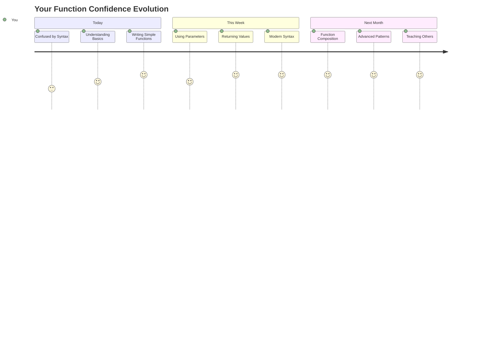
  
> 🎉 **لقد أتقنت أحد أقوى مفاهيم البرمجة!** الدوال هي اللبنات الأساسية للبرامج الكبيرة. كل تطبيق ستقوم ببنائه في المستقبل سيستخدم الدوال لتنظيم الأكواد وإعادة استخدامها وهيكلتها. الآن تفهم كيفية تغليف المنطق في مكونات قابلة لإعادة الاستخدام، مما يجعلك مبرمجًا أكثر كفاءة وفعالية. مرحبًا بك في عالم البرمجة المعيارية! 🚀  

---

**إخلاء المسؤولية**:  
تم ترجمة هذا المستند باستخدام خدمة الترجمة بالذكاء الاصطناعي [Co-op Translator](https://github.com/Azure/co-op-translator). بينما نسعى لتحقيق الدقة، يرجى العلم أن الترجمات الآلية قد تحتوي على أخطاء أو عدم دقة. يجب اعتبار المستند الأصلي بلغته الأصلية المصدر الرسمي. للحصول على معلومات حاسمة، يُوصى بالترجمة البشرية الاحترافية. نحن غير مسؤولين عن أي سوء فهم أو تفسيرات خاطئة تنشأ عن استخدام هذه الترجمة.