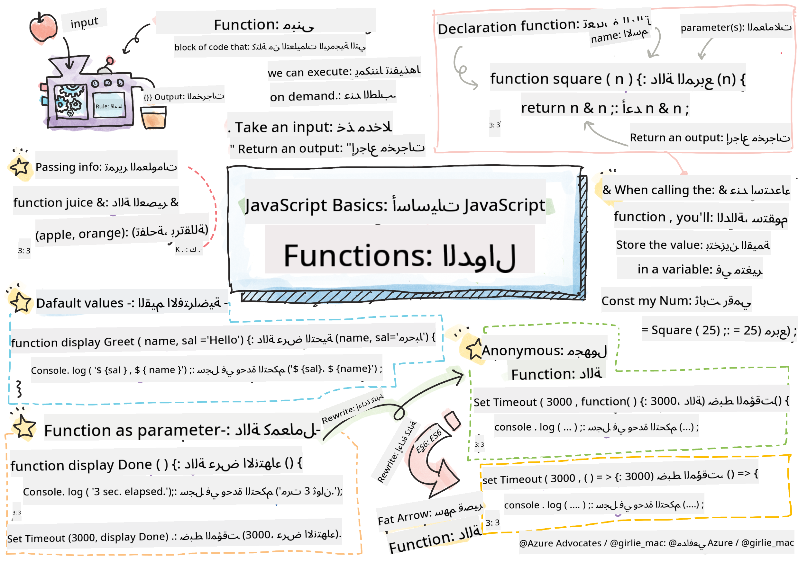

<!--
CO_OP_TRANSLATOR_METADATA:
{
  "original_hash": "b4612bbb9ace984f374fcc80e3e035ad",
  "translation_date": "2025-08-25T21:39:24+00:00",
  "source_file": "2-js-basics/2-functions-methods/README.md",
  "language_code": "ar"
}
-->
# أساسيات JavaScript: الطرق والدوال


> رسم توضيحي بواسطة [Tomomi Imura](https://twitter.com/girlie_mac)

## اختبار ما قبل المحاضرة
[اختبار ما قبل المحاضرة](https://ashy-river-0debb7803.1.azurestaticapps.net/quiz/9)

عندما نفكر في كتابة الكود، نريد دائمًا أن يكون الكود قابلًا للقراءة. على الرغم من أن هذا يبدو غير منطقي، إلا أن الكود يُقرأ مرات أكثر بكثير مما يُكتب. إحدى الأدوات الأساسية في صندوق أدوات المطور لضمان كود قابل للصيانة هي **الدالة**.

[](https://youtube.com/watch?v=XgKsD6Zwvlc "الطرق والدوال")

> 🎥 انقر على الصورة أعلاه لمشاهدة فيديو حول الطرق والدوال.

> يمكنك أخذ هذه الدرس على [Microsoft Learn](https://docs.microsoft.com/learn/modules/web-development-101-functions/?WT.mc_id=academic-77807-sagibbon)!

## الدوال

في جوهرها، الدالة هي كتلة من الكود يمكننا تنفيذها عند الطلب. هذا مثالي في السيناريوهات التي نحتاج فيها إلى أداء نفس المهمة عدة مرات؛ بدلاً من تكرار المنطق في مواقع متعددة (مما يجعل التحديث صعبًا عندما يحين الوقت)، يمكننا مركزة الكود في مكان واحد واستدعائه كلما احتجنا إلى تنفيذ العملية - يمكنك حتى استدعاء الدوال من دوال أخرى!

الأهمية لا تقتصر فقط على القدرة على تسمية الدالة. على الرغم من أن هذا قد يبدو بسيطًا، إلا أن الاسم يوفر طريقة سريعة لتوثيق جزء من الكود. يمكنك التفكير في ذلك كعلامة على زر. إذا ضغطت على زر مكتوب عليه "إلغاء المؤقت"، فأنا أعلم أنه سيوقف تشغيل الساعة.

## إنشاء واستدعاء دالة

صيغة كتابة الدالة تبدو كالتالي:

```javascript
function nameOfFunction() { // function definition
 // function definition/body
}
```

إذا أردت إنشاء دالة لعرض تحية، فقد تبدو كالتالي:

```javascript
function displayGreeting() {
  console.log('Hello, world!');
}
```

كلما أردنا استدعاء (أو تنفيذ) دالتنا، نستخدم اسم الدالة متبوعًا بـ `()`. من الجدير بالذكر أن دالتنا يمكن تعريفها قبل أو بعد قرارنا باستدعائها؛ سيقوم مترجم JavaScript بالعثور عليها نيابةً عنك.

```javascript
// calling our function
displayGreeting();
```

> **NOTE:** هناك نوع خاص من الدوال يُعرف بـ **الطريقة**، والذي كنت تستخدمه بالفعل! في الواقع، رأينا هذا في العرض التوضيحي أعلاه عندما استخدمنا `console.log`. ما يميز الطريقة عن الدالة هو أن الطريقة مرتبطة بكائن (مثل `console` في مثالنا)، بينما الدالة تكون مستقلة. ستسمع العديد من المطورين يستخدمون هذه المصطلحات بالتبادل.

### أفضل الممارسات للدوال

هناك مجموعة من أفضل الممارسات التي يجب مراعاتها عند إنشاء الدوال:

- كما هو الحال دائمًا، استخدم أسماء وصفية لتعرف ما الذي ستفعله الدالة.
- استخدم **camelCasing** لدمج الكلمات.
- اجعل دوالك مركزة على مهمة محددة.

## تمرير المعلومات إلى دالة

لجعل الدالة أكثر قابلية لإعادة الاستخدام، ستحتاج غالبًا إلى تمرير معلومات إليها. إذا أخذنا مثال `displayGreeting` أعلاه، فإنه سيعرض فقط **Hello, world!**. ليس أكثر الدوال فائدة يمكن إنشاؤها. إذا أردنا جعلها أكثر مرونة، مثل السماح لشخص بتحديد اسم الشخص الذي نريد تحيته، يمكننا إضافة **معامل**. المعامل (ويُطلق عليه أحيانًا **الحجة**) هو معلومات إضافية تُرسل إلى الدالة.

يتم سرد المعاملات في جزء التعريف داخل الأقواس وتُفصل بفواصل كما يلي:

```javascript
function name(param, param2, param3) {

}
```

يمكننا تحديث `displayGreeting` لقبول اسم وعرضه.

```javascript
function displayGreeting(name) {
  const message = `Hello, ${name}!`;
  console.log(message);
}
```

عندما نريد استدعاء دالتنا وتمرير المعامل، نحدده داخل الأقواس.

```javascript
displayGreeting('Christopher');
// displays "Hello, Christopher!" when run
```

## القيم الافتراضية

يمكننا جعل دالتنا أكثر مرونة بإضافة المزيد من المعاملات. ولكن ماذا لو لم نرغب في أن تكون كل القيم مطلوبة؟ بالعودة إلى مثال التحية، يمكننا ترك الاسم كمعامل مطلوب (نحتاج إلى معرفة من نحيي)، ولكن نريد السماح بتخصيص التحية نفسها حسب الرغبة. إذا لم يرغب أحد في تخصيصها، نوفر قيمة افتراضية بدلاً من ذلك. لتوفير قيمة افتراضية للمعامل، نحددها بنفس الطريقة التي نحدد بها قيمة للمتغير - `parameterName = 'defaultValue'`. لرؤية مثال كامل:

```javascript
function displayGreeting(name, salutation='Hello') {
  console.log(`${salutation}, ${name}`);
}
```

عندما نستدعي الدالة، يمكننا حينها أن نقرر إذا ما كنا نريد تحديد قيمة لـ `salutation`.

```javascript
displayGreeting('Christopher');
// displays "Hello, Christopher"

displayGreeting('Christopher', 'Hi');
// displays "Hi, Christopher"
```

## القيم المرجعة

حتى الآن، الدالة التي قمنا بإنشائها ستعرض دائمًا النتائج في [console](https://developer.mozilla.org/docs/Web/API/console). أحيانًا يكون هذا بالضبط ما نبحث عنه، خاصةً عندما ننشئ دوالًا ستستدعي خدمات أخرى. ولكن ماذا لو أردت إنشاء دالة مساعدة لإجراء عملية حسابية وتوفير القيمة المرجعة حتى أتمكن من استخدامها في مكان آخر؟

يمكننا القيام بذلك باستخدام **القيمة المرجعة**. القيمة المرجعة تُرجع بواسطة الدالة، ويمكن تخزينها في متغير بنفس الطريقة التي يمكننا بها تخزين قيمة ثابتة مثل النصوص أو الأرقام.

إذا كانت الدالة تُرجع شيئًا، يتم استخدام الكلمة المفتاحية `return`. الكلمة المفتاحية `return` تتوقع قيمة أو مرجع لما يتم إرجاعه كما يلي:

```javascript
return myVariable;
```  

يمكننا إنشاء دالة لإنشاء رسالة تحية وإرجاع القيمة إلى المستدعي.

```javascript
function createGreetingMessage(name) {
  const message = `Hello, ${name}`;
  return message;
}
```

عند استدعاء هذه الدالة، سنخزن القيمة في متغير. هذا مشابه جدًا للطريقة التي نحدد بها متغيرًا لقيمة ثابتة (مثل `const name = 'Christopher'`).

```javascript
const greetingMessage = createGreetingMessage('Christopher');
```

## الدوال كمعاملات لدوال أخرى

مع تقدمك في مسيرتك البرمجية، ستواجه دوالًا تقبل دوالًا كمعاملات. هذه الحيلة الذكية تُستخدم عادةً عندما لا نعرف متى سيحدث شيء ما أو يكتمل، ولكننا نعلم أننا بحاجة إلى تنفيذ عملية كرد فعل.

كمثال، فكر في [setTimeout](https://developer.mozilla.org/docs/Web/API/WindowOrWorkerGlobalScope/setTimeout)، الذي يبدأ مؤقتًا وينفذ الكود عند اكتماله. نحتاج إلى إخباره بالكود الذي نريد تنفيذه. يبدو هذا كوظيفة مثالية لدالة!

إذا قمت بتشغيل الكود أدناه، بعد 3 ثوانٍ سترى الرسالة **3 seconds has elapsed**.

```javascript
function displayDone() {
  console.log('3 seconds has elapsed');
}
// timer value is in milliseconds
setTimeout(displayDone, 3000);
```

### الدوال المجهولة

لنلقِ نظرة أخرى على ما قمنا بإنشائه. نحن ننشئ دالة باسم سيتم استخدامها مرة واحدة فقط. مع تعقيد تطبيقنا، يمكننا أن نرى أنفسنا ننشئ الكثير من الدوال التي سيتم استدعاؤها مرة واحدة فقط. هذا ليس مثاليًا. كما اتضح، لا نحتاج دائمًا إلى توفير اسم!

عندما نمرر دالة كمعامل، يمكننا تجاوز إنشائها مسبقًا وبدلاً من ذلك إنشاؤها كجزء من المعامل. نستخدم نفس الكلمة المفتاحية `function`، ولكن بدلاً من ذلك نبنيها كمعامل.

لنعد كتابة الكود أعلاه لاستخدام دالة مجهولة:

```javascript
setTimeout(function() {
  console.log('3 seconds has elapsed');
}, 3000);
```

إذا قمت بتشغيل الكود الجديد، ستلاحظ أننا نحصل على نفس النتائج. لقد أنشأنا دالة، ولكن لم يكن علينا إعطاؤها اسمًا!

### دوال السهم (Fat Arrow Functions)

أحد الاختصارات الشائعة في العديد من لغات البرمجة (بما في ذلك JavaScript) هو القدرة على استخدام ما يُعرف بـ **دوال السهم** أو **دوال السهم السمين**. تستخدم مؤشرًا خاصًا `=>`، الذي يبدو كالسهم - ومن هنا جاء الاسم! باستخدام `=>`، يمكننا تخطي الكلمة المفتاحية `function`.

لنعد كتابة الكود مرة أخرى لاستخدام دالة السهم:

```javascript
setTimeout(() => {
  console.log('3 seconds has elapsed');
}, 3000);
```

### متى نستخدم كل استراتيجية

لقد رأيت الآن لدينا ثلاث طرق لتمرير دالة كمعامل وقد تتساءل متى تستخدم كل واحدة. إذا كنت تعلم أنك ستستخدم الدالة أكثر من مرة، قم بإنشائها بالطريقة العادية. إذا كنت ستستخدمها لموقع واحد فقط، فمن الأفضل عمومًا استخدام دالة مجهولة. سواء كنت تستخدم دالة السهم أو صيغة `function` التقليدية يعود الأمر إليك، ولكنك ستلاحظ أن معظم المطورين الحديثين يفضلون `=>`.

---

## 🚀 التحدي

هل يمكنك التعبير في جملة واحدة عن الفرق بين الدوال والطرق؟ جرب ذلك!

## اختبار ما بعد المحاضرة
[اختبار ما بعد المحاضرة](https://ashy-river-0debb7803.1.azurestaticapps.net/quiz/10)

## المراجعة والدراسة الذاتية

من المفيد [قراءة المزيد عن دوال السهم](https://developer.mozilla.org/docs/Web/JavaScript/Reference/Functions/Arrow_functions)، حيث يتم استخدامها بشكل متزايد في قواعد الكود. قم بممارسة كتابة دالة، ثم إعادة كتابتها باستخدام هذه الصيغة.

## الواجب

[مرح مع الدوال](assignment.md)

**إخلاء المسؤولية**:  
تم ترجمة هذا المستند باستخدام خدمة الترجمة بالذكاء الاصطناعي [Co-op Translator](https://github.com/Azure/co-op-translator). بينما نسعى لتحقيق الدقة، يرجى العلم أن الترجمات الآلية قد تحتوي على أخطاء أو معلومات غير دقيقة. يجب اعتبار المستند الأصلي بلغته الأصلية المصدر الموثوق. للحصول على معلومات حاسمة، يُوصى بالاستعانة بترجمة بشرية احترافية. نحن غير مسؤولين عن أي سوء فهم أو تفسيرات خاطئة تنشأ عن استخدام هذه الترجمة.