# أساسيات JavaScript: اتخاذ القرارات

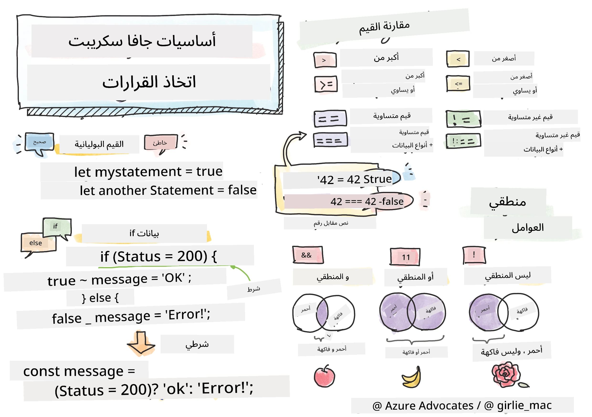

> رسم توضيحي بواسطة [Tomomi Imura](https://twitter.com/girlie_mac)

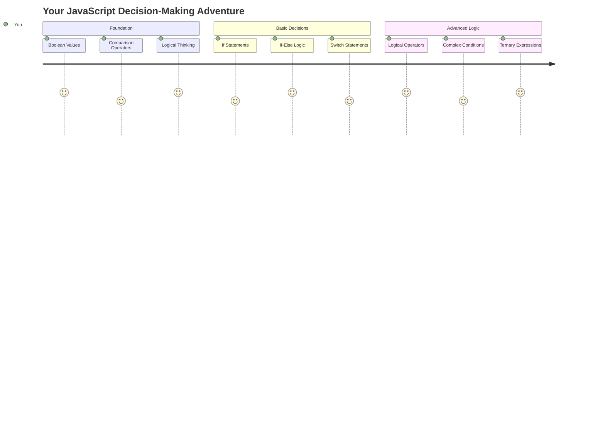

هل تساءلت يومًا كيف تتخذ التطبيقات قرارات ذكية؟ مثل كيفية اختيار نظام الملاحة للطريق الأسرع، أو كيف يقرر منظم الحرارة تشغيل التدفئة؟ هذا هو المفهوم الأساسي لاتخاذ القرارات في البرمجة.

كما تم تصميم محرك التحليل الخاص بـ Charles Babbage لاتباع تسلسلات مختلفة من العمليات بناءً على الظروف، تحتاج برامج JavaScript الحديثة إلى اتخاذ خيارات بناءً على ظروف متغيرة. هذه القدرة على التفرع واتخاذ القرارات هي ما يحول الكود الثابت إلى تطبيقات ذكية ومتجاوبة.

في هذا الدرس، ستتعلم كيفية تنفيذ المنطق الشرطي في برامجك. سنستكشف العبارات الشرطية، عوامل المقارنة، والتعبيرات المنطقية التي تسمح لكودك بتقييم المواقف والاستجابة بشكل مناسب.

## اختبار ما قبل المحاضرة

[اختبار ما قبل المحاضرة](https://ff-quizzes.netlify.app/web/quiz/11)

القدرة على اتخاذ القرارات والتحكم في تدفق البرنامج هي جانب أساسي من البرمجة. يغطي هذا القسم كيفية التحكم في مسار تنفيذ برامج JavaScript الخاصة بك باستخدام القيم المنطقية والمنطق الشرطي.

[](https://youtube.com/watch?v=SxTp8j-fMMY "اتخاذ القرارات")

> 🎥 انقر على الصورة أعلاه لمشاهدة فيديو حول اتخاذ القرارات.

> يمكنك أخذ هذا الدرس على [Microsoft Learn](https://docs.microsoft.com/learn/modules/web-development-101-if-else/?WT.mc_id=academic-77807-sagibbon)!

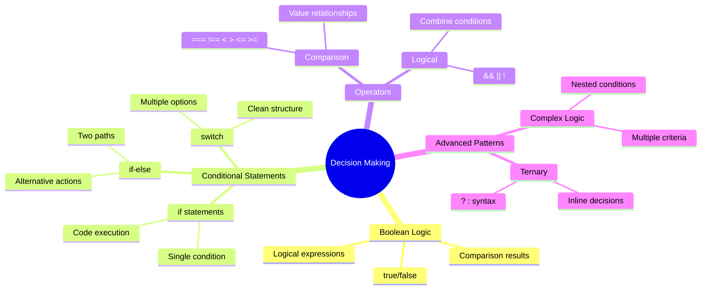

## ملخص سريع عن القيم المنطقية

قبل استكشاف اتخاذ القرارات، دعونا نعيد النظر في القيم المنطقية من درسنا السابق. سميت هذه القيم على اسم عالم الرياضيات جورج بول، وتمثل حالات ثنائية – إما `true` أو `false`. لا يوجد غموض، ولا منطقة وسطى.

تشكل هذه القيم الثنائية أساس كل المنطق الحاسوبي. كل قرار يتخذه برنامجك يتلخص في النهاية إلى تقييم منطقي.

إنشاء متغيرات منطقية أمر بسيط:

```javascript
let myTrueBool = true;
let myFalseBool = false;
```

هذا ينشئ متغيرين بقيم منطقية صريحة.

✅ سميت القيم المنطقية على اسم عالم الرياضيات والفيلسوف والمنطقي الإنجليزي جورج بول (1815–1864).

## عوامل المقارنة والقيم المنطقية

في الواقع، نادرًا ما تقوم بتعيين القيم المنطقية يدويًا. بدلاً من ذلك، تقوم بإنشائها عن طريق تقييم الشروط: "هل هذا الرقم أكبر من ذاك؟" أو "هل هذه القيم متساوية؟"

تُمكّن عوامل المقارنة هذه التقييمات. فهي تقارن القيم وتعيد نتائج منطقية بناءً على العلاقة بين العوامل.

| الرمز | الوصف                                                                                                                                                   | المثال            |
| ------ | ------------------------------------------------------------------------------------------------------------------------------------------------------------- | ------------------ |
| `<`    | **أقل من**: يقارن بين قيمتين ويعيد نوع البيانات المنطقية `true` إذا كانت القيمة على الجانب الأيسر أقل من الجانب الأيمن                              | `5 < 6 // true`    |
| `<=`   | **أقل من أو يساوي**: يقارن بين قيمتين ويعيد نوع البيانات المنطقية `true` إذا كانت القيمة على الجانب الأيسر أقل من أو تساوي الجانب الأيمن      | `5 <= 6 // true`   |
| `>`    | **أكبر من**: يقارن بين قيمتين ويعيد نوع البيانات المنطقية `true` إذا كانت القيمة على الجانب الأيسر أكبر من الجانب الأيمن                         | `5 > 6 // false`   |
| `>=`   | **أكبر من أو يساوي**: يقارن بين قيمتين ويعيد نوع البيانات المنطقية `true` إذا كانت القيمة على الجانب الأيسر أكبر من أو تساوي الجانب الأيمن | `5 >= 6 // false`  |
| `===`  | **المساواة الصارمة**: يقارن بين قيمتين ويعيد نوع البيانات المنطقية `true` إذا كانت القيم على اليمين واليسار متساوية وتكون من نفس نوع البيانات.       | `5 === 6 // false` |
| `!==`  | **عدم المساواة**: يقارن بين قيمتين ويعيد القيمة المنطقية المعاكسة لما سيعيده عامل المساواة الصارمة                                    | `5 !== 6 // true`  |

✅ تحقق من معرفتك بكتابة بعض المقارنات في وحدة التحكم في المتصفح. هل تفاجأت بأي بيانات تم إرجاعها؟

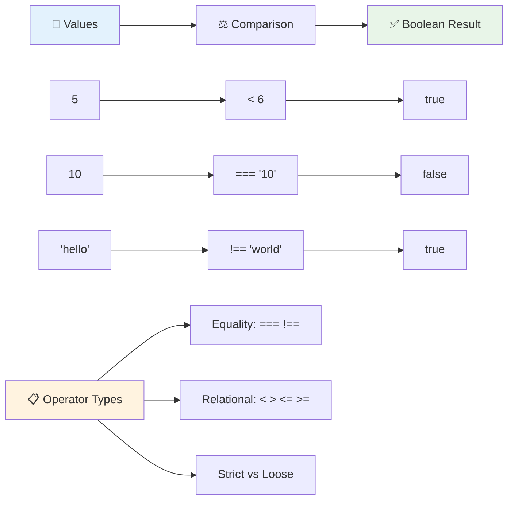

### 🧠 **اختبار إتقان المقارنة: فهم المنطق**

**اختبر فهمك للمقارنة:**
- لماذا تعتقد أن `===` (المساواة الصارمة) تُفضل عمومًا على `==` (المساواة غير الصارمة)؟
- هل يمكنك التنبؤ بما يعيده `5 === '5'`؟ وماذا عن `5 == '5'`؟
- ما الفرق بين `!==` و `!=`؟

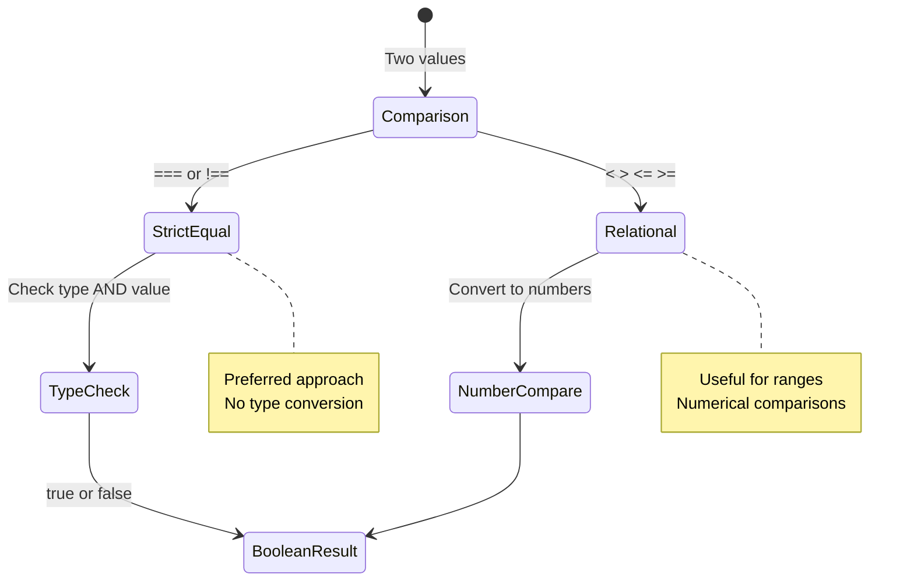

> **نصيحة احترافية**: استخدم دائمًا `===` و `!==` لفحص المساواة إلا إذا كنت بحاجة إلى تحويل النوع بشكل محدد. هذا يمنع السلوك غير المتوقع!

## عبارة If

عبارة `if` تشبه طرح سؤال في الكود الخاص بك. "إذا كان هذا الشرط صحيحًا، فقم بهذا الشيء." إنها على الأرجح الأداة الأكثر أهمية التي ستستخدمها لاتخاذ القرارات في JavaScript.

إليك كيفية عملها:

```javascript
if (condition) {
  // Condition is true. Code in this block will run.
}
```

يتم وضع الشرط داخل الأقواس، وإذا كان `true`، يقوم JavaScript بتشغيل الكود داخل الأقواس المتعرجة. إذا كان `false`، يتخطى JavaScript هذا الجزء بالكامل.

غالبًا ما تستخدم عوامل المقارنة لإنشاء هذه الشروط. دعونا نرى مثالًا عمليًا:

```javascript
let currentMoney = 1000;
let laptopPrice = 800;

if (currentMoney >= laptopPrice) {
  // Condition is true. Code in this block will run.
  console.log("Getting a new laptop!");
}
```

نظرًا لأن `1000 >= 800` يتم تقييمه إلى `true`، يتم تنفيذ الكود داخل الكتلة، ويعرض "شراء لابتوب جديد!" في وحدة التحكم.

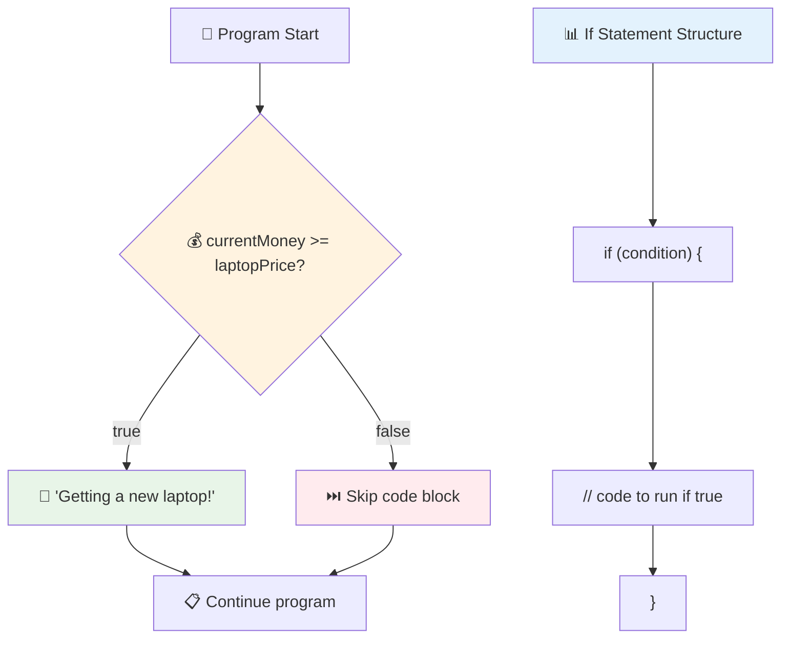

## عبارة If..Else

ولكن ماذا لو كنت تريد أن يقوم برنامجك بشيء مختلف عندما يكون الشرط خاطئًا؟ هنا يأتي دور `else` – إنها مثل وجود خطة احتياطية.

عبارة `else` تمنحك طريقة لتقول "إذا لم يكن هذا الشرط صحيحًا، فقم بهذا الشيء الآخر بدلاً من ذلك."

```javascript
let currentMoney = 500;
let laptopPrice = 800;

if (currentMoney >= laptopPrice) {
  // Condition is true. Code in this block will run.
  console.log("Getting a new laptop!");
} else {
  // Condition is false. Code in this block will run.
  console.log("Can't afford a new laptop, yet!");
}
```

الآن، نظرًا لأن `500 >= 800` هو `false`، يتخطى JavaScript الكتلة الأولى ويقوم بتشغيل كتلة `else` بدلاً من ذلك. سترى "لا يمكنني شراء لابتوب جديد بعد!" في وحدة التحكم.

✅ اختبر فهمك لهذا الكود والكود التالي عن طريق تشغيله في وحدة التحكم في المتصفح. قم بتغيير قيم المتغيرات currentMoney و laptopPrice لتغيير ما يتم عرضه في `console.log()`.

### 🎯 **اختبار منطق If-Else: مسارات متفرعة**

**قيّم فهمك للمنطق الشرطي:**
- ماذا يحدث إذا كانت قيمة `currentMoney` تساوي تمامًا قيمة `laptopPrice`؟
- هل يمكنك التفكير في سيناريو واقعي حيث يكون منطق if-else مفيدًا؟
- كيف يمكنك توسيع هذا للتعامل مع نطاقات أسعار متعددة؟

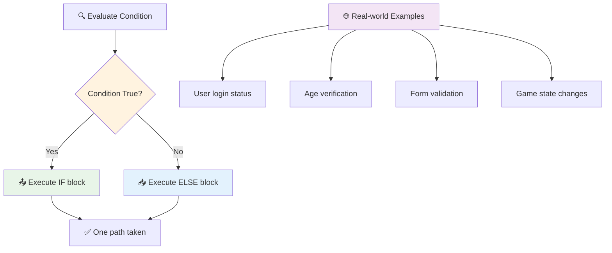

> **معلومة أساسية**: يضمن if-else اتخاذ مسار واحد فقط. هذا يضمن أن برنامجك دائمًا لديه استجابة لأي شرط!

## عبارة Switch

في بعض الأحيان تحتاج إلى مقارنة قيمة واحدة مع خيارات متعددة. بينما يمكنك ربط عدة عبارات `if..else`، يصبح هذا النهج غير عملي. توفر عبارة `switch` هيكلًا أنظف للتعامل مع قيم متعددة محددة.

يشبه المفهوم أنظمة التبديل الميكانيكية المستخدمة في مقاسم الهاتف المبكرة – قيمة إدخال واحدة تحدد المسار المحدد الذي يتبعه التنفيذ.

```javascript
switch (expression) {
  case x:
    // code block
    break;
  case y:
    // code block
    break;
  default:
    // code block
}
```

إليك كيفية هيكلتها:
- يقوم JavaScript بتقييم التعبير مرة واحدة
- يبحث في كل `case` للعثور على تطابق
- عندما يجد تطابقًا، يقوم بتشغيل كتلة الكود
- تخبر `break` JavaScript بالتوقف والخروج من switch
- إذا لم تتطابق أي حالات، يقوم بتشغيل كتلة `default` (إذا كانت موجودة)

```javascript
// Program using switch statement for day of week
let dayNumber = 2;
let dayName;

switch (dayNumber) {
  case 1:
    dayName = "Monday";
    break;
  case 2:
    dayName = "Tuesday";
    break;
  case 3:
    dayName = "Wednesday";
    break;
  default:
    dayName = "Unknown day";
    break;
}
console.log(`Today is ${dayName}`);
```

في هذا المثال، يرى JavaScript أن `dayNumber` هو `2`، يجد تطابقًا مع `case 2`، يعين `dayName` إلى "الثلاثاء"، ثم يخرج من switch. النتيجة؟ يتم تسجيل "اليوم هو الثلاثاء" في وحدة التحكم.

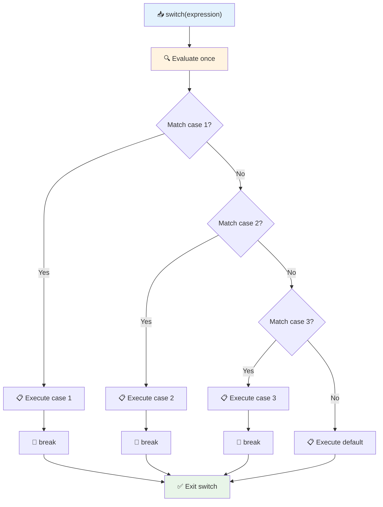

✅ اختبر فهمك لهذا الكود والكود التالي عن طريق تشغيله في وحدة التحكم في المتصفح. قم بتغيير قيم المتغير a لتغيير ما يتم عرضه في `console.log()`.

### 🔄 **إتقان عبارة Switch: خيارات متعددة**

**اختبر فهمك لـ switch:**
- ماذا يحدث إذا نسيت عبارة `break`؟
- متى تستخدم switch بدلاً من عبارات if-else المتعددة؟
- لماذا تكون حالة `default` مفيدة حتى إذا كنت تعتقد أنك غطيت جميع الاحتمالات؟

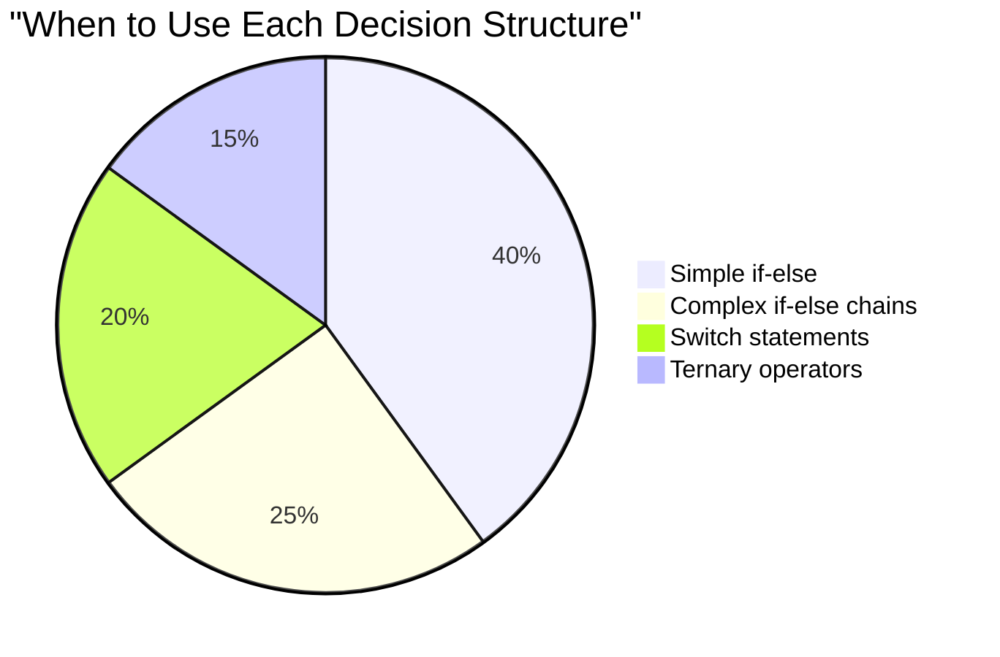

> **أفضل ممارسة**: استخدم switch عند مقارنة متغير واحد مع قيم محددة متعددة. استخدم if-else لفحص النطاقات أو الشروط المعقدة!

## العوامل المنطقية والقيم المنطقية

غالبًا ما تتطلب القرارات المعقدة تقييم شروط متعددة في نفس الوقت. تمامًا كما يسمح الجبر المنطقي للرياضيين بدمج التعبيرات المنطقية، توفر البرمجة عوامل منطقية لربط شروط منطقية متعددة.

تُمكّن هذه العوامل منطقًا شرطيًا متقدمًا عن طريق دمج تقييمات true/false البسيطة.

| الرمز | الوصف                                                                                     | المثال                                                                 |
| ------ | ----------------------------------------------------------------------------------------------- | ----------------------------------------------------------------------- |
| `&&`   | **AND المنطقي**: يقارن بين تعبيرين منطقيين. يعيد true **فقط** إذا كان كلا الجانبين صحيحًا | `(5 > 3) && (5 < 10) // كلا الجانبين صحيح. يعيد true` |
| `\|\|` | **OR المنطقي**: يقارن بين تعبيرين منطقيين. يعيد true إذا كان على الأقل أحد الجانبين صحيحًا     | `(5 > 10) \|\| (5 < 10) // أحد الجانبين خاطئ، الآخر صحيح. يعيد true` |
| `!`    | **NOT المنطقي**: يعيد القيمة المعاكسة لتعبير منطقي                             | `!(5 > 10) // 5 ليس أكبر من 10، لذا "!" يجعله صحيحًا`         |

تتيح لك هذه العوامل دمج الشروط بطرق مفيدة:
- AND (`&&`) يعني أن كلا الشرطين يجب أن يكونا صحيحين
- OR (`||`) يعني أن على الأقل أحد الشرطين يجب أن يكون صحيحًا  
- NOT (`!`) يقلب true إلى false (والعكس صحيح)

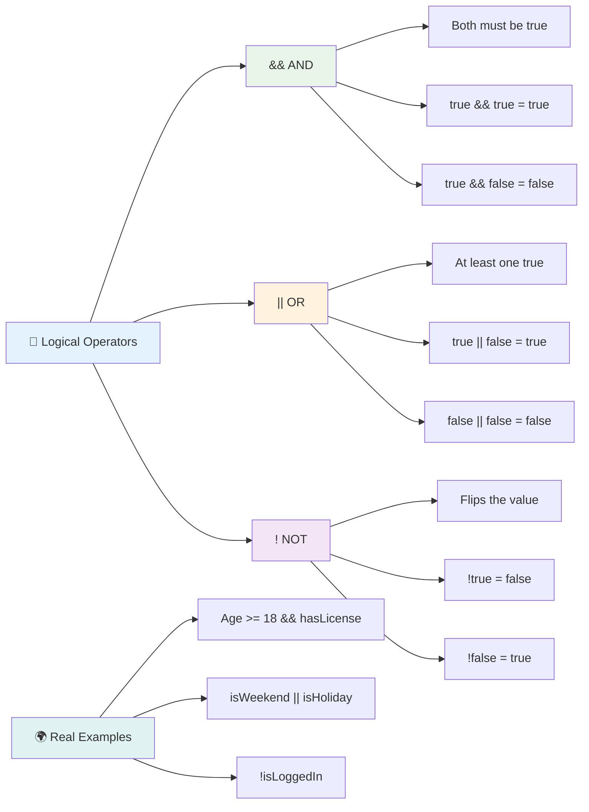

## الشروط والقرارات باستخدام العوامل المنطقية

دعونا نرى هذه العوامل المنطقية قيد التنفيذ مع مثال أكثر واقعية:

```javascript
let currentMoney = 600;
let laptopPrice = 800;
let laptopDiscountPrice = laptopPrice - (laptopPrice * 0.2); // Laptop price at 20 percent off

if (currentMoney >= laptopPrice || currentMoney >= laptopDiscountPrice) {
  // Condition is true. Code in this block will run.
  console.log("Getting a new laptop!");
} else {
  // Condition is false. Code in this block will run.
  console.log("Can't afford a new laptop, yet!");
}
```

في هذا المثال: نحسب سعر الخصم بنسبة 20% (640)، ثم نقيم ما إذا كانت أموالنا المتاحة تغطي السعر الكامل أو السعر المخفض. نظرًا لأن 600 تفي بحد السعر المخفض البالغ 640، يتم تقييم الشرط إلى true.

### 🧮 **اختبار العوامل المنطقية: دمج الشروط**

**اختبر فهمك للعوامل المنطقية:**
- في التعبير `A && B`، ماذا يحدث إذا كان A خاطئًا؟ هل يتم تقييم B؟
- هل يمكنك التفكير في موقف تحتاج فيه إلى استخدام جميع العوامل الثلاثة (&&، ||، !) معًا؟
- ما الفرق بين `!user.isActive` و `user.isActive !== true`؟

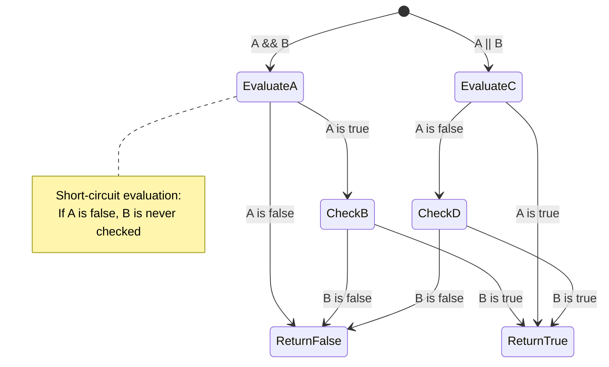

> **نصيحة الأداء**: يستخدم JavaScript "تقييم الدائرة القصيرة" - في `A && B`، إذا كان A خاطئًا، لا يتم تقييم B. استخدم هذا لصالحك!

### عامل النفي

في بعض الأحيان يكون من الأسهل التفكير في متى يكون شيء ما غير صحيح. مثل بدلاً من السؤال "هل المستخدم مسجل الدخول؟"، قد ترغب في السؤال "هل المستخدم غير مسجل الدخول؟" يقوم عامل التعجب (`!`) بقلب المنطق لك.

```javascript
if (!condition) {
  // runs if condition is false
} else {
  // runs if condition is true
}
```

عامل `!` يشبه قول "العكس من..." – إذا كان شيء ما `true`، يجعلها `false`، والعكس صحيح.

### التعبيرات الثلاثية

للتعيينات الشرطية البسيطة، يوفر JavaScript **العامل الثلاثي**. يتيح لك هذا التركيب المختصر كتابة تعبير شرطي في سطر واحد، وهو مفيد عندما تحتاج إلى تعيين أحد القيمتين بناءً على شرط.

```javascript
let variable = condition ? returnThisIfTrue : returnThisIfFalse;
```

يُقرأ كأنه سؤال: "هل هذا الشرط صحيح؟ إذا نعم، استخدم هذه القيمة. إذا لا، استخدم تلك القيمة."

فيما يلي مثال أكثر وضوحًا:

```javascript
let firstNumber = 20;
let secondNumber = 10;
let biggestNumber = firstNumber > secondNumber ? firstNumber : secondNumber;
```

✅ خذ دقيقة لقراءة هذا الكود عدة مرات. هل تفهم كيف تعمل هذه العوامل؟

إليك ما يقوله هذا السطر: "هل `firstNumber` أكبر من `secondNumber`؟ إذا نعم، ضع `firstNumber` في `biggestNumber`. إذا لا، ضع `secondNumber` في `biggestNumber`."

العامل الثلاثي هو مجرد طريقة أقصر لكتابة عبارة if..else التقليدية:

```javascript
let biggestNumber;
if (firstNumber > secondNumber) {
  biggestNumber = firstNumber;
} else {
  biggestNumber = secondNumber;
}
```

كلا النهجين ينتج نفس النتائج. يوفر العامل الثلاثي اختصارًا، بينما قد يكون هيكل if-else التقليدي أكثر قابلية للقراءة للشروط المعقدة.

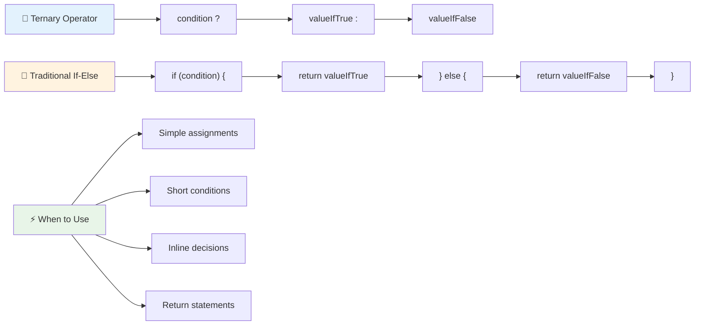

---

## 🚀 التحدي

قم بإنشاء برنامج مكتوب أولاً باستخدام العوامل المنطقية، ثم أعد كتابته باستخدام تعبير ثلاثي. ما هي الصياغة التي تفضلها؟

---

## تحدي GitHub Copilot Agent 🚀

استخدم وضع الوكيل لإكمال التحدي التالي:

**الوصف:** قم بإنشاء حاسبة شاملة للدرجات تعرض مفاهيم اتخاذ القرارات المتعددة من هذا الدرس، بما في ذلك عبارات if-else، عبارات switch، العوامل المنطقية، والتعبيرات الثلاثية.

**المهمة:** اكتب برنامج JavaScript يأخذ درجة الطالب الرقمية (0-100) ويحدد درجته الحرفية باستخدام المعايير التالية:
- A: 90-100
- B: 80-89  
- C: 70-79
- D: 60-69
- F: أقل من 60

المتطلبات:
1. استخدم عبارة if-else لتحديد الدرجة الحرفية
2. استخدم العمليات المنطقية للتحقق مما إذا كان الطالب ناجحًا (الدرجة >= 60) وأيضًا لديه تفوق (الدرجة >= 90)
3. استخدم عبارة switch لتقديم ملاحظات محددة لكل درجة حرفية
4. استخدم المشغل الثلاثي لتحديد ما إذا كان الطالب مؤهلاً للدورة التالية (الدرجة >= 70)
5. قم بتضمين التحقق من صحة الإدخال للتأكد من أن الدرجة بين 0 و100

اختبر برنامجك باستخدام درجات مختلفة بما في ذلك الحالات الحدية مثل 59، 60، 89، 90، ومدخلات غير صالحة.

تعرف على المزيد حول [وضع الوكيل](https://code.visualstudio.com/blogs/2025/02/24/introducing-copilot-agent-mode) هنا.

## اختبار ما بعد المحاضرة

[اختبار ما بعد المحاضرة](https://ff-quizzes.netlify.app/web/quiz/12)

## المراجعة والدراسة الذاتية

اقرأ المزيد عن العديد من العمليات المتاحة للمستخدم [على MDN](https://developer.mozilla.org/docs/Web/JavaScript/Reference/Operators).

اطلع على دليل جوش كومو الرائع [للبحث عن العمليات](https://joshwcomeau.com/operator-lookup/)!

## الواجب

[العمليات](assignment.md)

---

## 🧠 **ملخص أدوات اتخاذ القرار الخاصة بك**

```mermaid
graph TD
    A["🎯 JavaScript Decisions"] --> B["🔍 Boolean Logic"]
    A --> C["📊 Conditional Statements"]
    A --> D["🔗 Logical Operators"]
    A --> E["⚡ Advanced Patterns"]
    
    B --> B1["true/false values"]
    B --> B2["Comparison operators"]
    B --> B3["Truthiness concepts"]
    
    C --> C1["if statements"]
    C --> C2["if-else chains"]
    C --> C3["switch statements"]
    
    D --> D1["&& (AND)"]
    D --> D2["|| (OR)"]
    D --> D3["! (NOT)"]
    
    E --> E1["Ternary operator"]
    E --> E2["Short-circuit evaluation"]
    E --> E3["Complex conditions"]
    
    F["💡 Key Principles"] --> F1["Clear readable conditions"]
    F --> F2["Consistent comparison style"]
    F --> F3["Proper operator precedence"]
    F --> F4["Efficient evaluation order"]
    
    style A fill:#e3f2fd
    style B fill:#e8f5e8
    style C fill:#fff3e0
    style D fill:#f3e5f5
    style E fill:#e0f2f1
    style F fill:#fce4ec
```

---

## 🚀 جدول زمني لإتقان اتخاذ القرار باستخدام JavaScript

### ⚡ **ما يمكنك القيام به في الدقائق الخمس القادمة**
- [ ] ممارسة عمليات المقارنة في وحدة التحكم بالمتصفح
- [ ] كتابة عبارة if-else بسيطة للتحقق من عمرك
- [ ] تجربة التحدي: إعادة كتابة عبارة if-else باستخدام المشغل الثلاثي
- [ ] اختبار ما يحدث مع القيم "الحقيقية" و"الزائفة" المختلفة

### 🎯 **ما يمكنك تحقيقه خلال هذه الساعة**
- [ ] إكمال اختبار ما بعد الدرس ومراجعة أي مفاهيم مربكة
- [ ] بناء آلة حاسبة شاملة للدرجات من تحدي GitHub Copilot
- [ ] إنشاء شجرة قرار بسيطة لسيناريو واقعي (مثل اختيار ما ترتديه)
- [ ] ممارسة الجمع بين شروط متعددة باستخدام العمليات المنطقية
- [ ] تجربة عبارات switch لحالات استخدام مختلفة

### 📅 **إتقان المنطق خلال أسبوع**
- [ ] إكمال واجب العمليات بأمثلة إبداعية
- [ ] بناء تطبيق اختبار صغير باستخدام هياكل شرطية متنوعة
- [ ] إنشاء مدقق نموذج يتحقق من شروط إدخال متعددة
- [ ] ممارسة تمارين دليل جوش كومو [للبحث عن العمليات](https://joshwcomeau.com/operator-lookup/)
- [ ] تحسين الكود الحالي باستخدام هياكل شرطية أكثر ملاءمة
- [ ] دراسة التقييم القصير الدائرة وتأثيراته على الأداء

### 🌟 **تحولك خلال شهر**
- [ ] إتقان الشروط المتداخلة المعقدة والحفاظ على قابلية قراءة الكود
- [ ] بناء تطبيق يحتوي على منطق اتخاذ قرار متقدم
- [ ] المساهمة في المصادر المفتوحة من خلال تحسين المنطق الشرطي في المشاريع الحالية
- [ ] تعليم شخص آخر حول الهياكل الشرطية المختلفة ومتى يتم استخدام كل منها
- [ ] استكشاف نهج البرمجة الوظيفية للمنطق الشرطي
- [ ] إنشاء دليل مرجعي شخصي لأفضل الممارسات الشرطية

### 🏆 **تسجيل الوصول النهائي لبطل اتخاذ القرار**

**احتفل بإتقانك للتفكير المنطقي:**
- ما هو أكثر منطق قرار معقد قمت بتنفيذه بنجاح؟
- أي هيكل شرطي يبدو طبيعيًا بالنسبة لك ولماذا؟
- كيف غيّر تعلم العمليات المنطقية نهجك لحل المشكلات؟
- ما هو التطبيق الواقعي الذي سيستفيد من منطق اتخاذ قرار متقدم؟

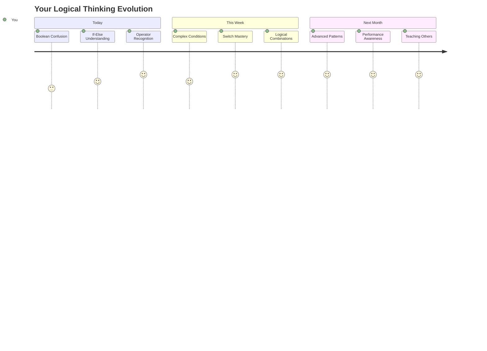

> 🧠 **لقد أتقنت فن اتخاذ القرار الرقمي!** تعتمد كل تطبيقات التفاعل على المنطق الشرطي للاستجابة بذكاء لإجراءات المستخدم والظروف المتغيرة. أنت الآن تفهم كيفية جعل برامجك تفكر، تقيم، وتختار الاستجابات المناسبة. هذا الأساس المنطقي سيقود كل تطبيق ديناميكي تقوم ببنائه! 🎉

---

**إخلاء المسؤولية**:  
تم ترجمة هذا المستند باستخدام خدمة الترجمة بالذكاء الاصطناعي [Co-op Translator](https://github.com/Azure/co-op-translator). بينما نسعى لتحقيق الدقة، يرجى العلم أن الترجمات الآلية قد تحتوي على أخطاء أو عدم دقة. يجب اعتبار المستند الأصلي بلغته الأصلية المصدر الموثوق. للحصول على معلومات حاسمة، يُوصى بالترجمة البشرية الاحترافية. نحن غير مسؤولين عن أي سوء فهم أو تفسيرات خاطئة تنشأ عن استخدام هذه الترجمة.