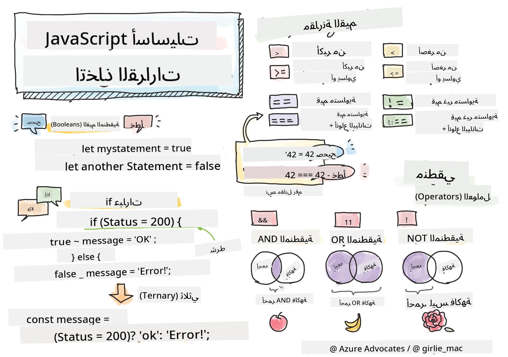

<!--
CO_OP_TRANSLATOR_METADATA:
{
  "original_hash": "888609c48329c280ca2477d2df40f2e5",
  "translation_date": "2025-08-25T21:33:24+00:00",
  "source_file": "2-js-basics/3-making-decisions/README.md",
  "language_code": "ar"
}
-->
# أساسيات JavaScript: اتخاذ القرارات



> رسم توضيحي بواسطة [Tomomi Imura](https://twitter.com/girlie_mac)

## اختبار ما قبل المحاضرة

[اختبار ما قبل المحاضرة](https://ff-quizzes.netlify.app/web/quiz/11)

اتخاذ القرارات والتحكم في ترتيب تشغيل الكود يجعل الكود قابلاً لإعادة الاستخدام وقويًا. يغطي هذا القسم بناء الجملة الخاص بالتحكم في تدفق البيانات في JavaScript وأهميته عند استخدامه مع أنواع البيانات المنطقية (Boolean).

[](https://youtube.com/watch?v=SxTp8j-fMMY "اتخاذ القرارات")

> 🎥 انقر على الصورة أعلاه لمشاهدة فيديو حول اتخاذ القرارات.

> يمكنك أخذ هذه الدرس على [Microsoft Learn](https://docs.microsoft.com/learn/modules/web-development-101-if-else/?WT.mc_id=academic-77807-sagibbon)!

## لمحة سريعة عن القيم المنطقية (Booleans)

القيم المنطقية يمكن أن تكون فقط `true` أو `false`. تساعد القيم المنطقية في اتخاذ القرارات حول أي سطور من الكود يجب أن تُنفذ عند تحقق شروط معينة.

قم بتعيين القيمة المنطقية لتكون true أو false كالتالي:

`let myTrueBool = true`  
`let myFalseBool = false`

✅ القيم المنطقية سُميت على اسم عالم الرياضيات والفيلسوف والمنطقي الإنجليزي جورج بول (1815–1864).

## عوامل المقارنة والقيم المنطقية

تُستخدم العوامل لتقييم الشروط من خلال إجراء مقارنات تُنتج قيمة منطقية. فيما يلي قائمة بالعوامل التي تُستخدم بشكل متكرر.

| الرمز  | الوصف                                                                                                                                                   | المثال             |
| ------ | ------------------------------------------------------------------------------------------------------------------------------------------------------- | ------------------ |
| `<`    | **أصغر من**: يقارن بين قيمتين ويُرجع القيمة المنطقية `true` إذا كانت القيمة على الجانب الأيسر أصغر من الجانب الأيمن                                    | `5 < 6 // true`    |
| `<=`   | **أصغر من أو يساوي**: يقارن بين قيمتين ويُرجع القيمة المنطقية `true` إذا كانت القيمة على الجانب الأيسر أصغر من أو تساوي الجانب الأيمن                  | `5 <= 6 // true`   |
| `>`    | **أكبر من**: يقارن بين قيمتين ويُرجع القيمة المنطقية `true` إذا كانت القيمة على الجانب الأيسر أكبر من الجانب الأيمن                                     | `5 > 6 // false`   |
| `>=`   | **أكبر من أو يساوي**: يقارن بين قيمتين ويُرجع القيمة المنطقية `true` إذا كانت القيمة على الجانب الأيسر أكبر من أو تساوي الجانب الأيمن                  | `5 >= 6 // false`  |
| `===`  | **المساواة الصارمة**: يقارن بين قيمتين ويُرجع القيمة المنطقية `true` إذا كانت القيم على الجانبين الأيمن والأيسر متساوية وتملك نفس نوع البيانات         | `5 === 6 // false` |
| `!==`  | **عدم المساواة**: يقارن بين قيمتين ويُرجع القيمة المنطقية المعاكسة لما يُرجعه عامل المساواة الصارمة                                                     | `5 !== 6 // true`  |

✅ تحقق من فهمك بكتابة بعض المقارنات في وحدة التحكم في المتصفح. هل تفاجأت بأي بيانات تم إرجاعها؟

## جملة If

جملة `if` ستنفذ الكود الموجود بين الأقواس إذا كان الشرط صحيحًا.

```javascript
if (condition) {
  //Condition is true. Code in this block will run.
}
```

غالبًا ما تُستخدم العوامل المنطقية لتكوين الشرط.

```javascript
let currentMoney;
let laptopPrice;

if (currentMoney >= laptopPrice) {
  //Condition is true. Code in this block will run.
  console.log("Getting a new laptop!");
}
```

## جملة If..Else

جملة `else` ستنفذ الكود الموجود بين الأقواس عندما يكون الشرط خاطئًا. وهي اختيارية مع جملة `if`.

```javascript
let currentMoney;
let laptopPrice;

if (currentMoney >= laptopPrice) {
  //Condition is true. Code in this block will run.
  console.log("Getting a new laptop!");
} else {
  //Condition is false. Code in this block will run.
  console.log("Can't afford a new laptop, yet!");
}
```

✅ اختبر فهمك لهذا الكود والكود التالي عن طريق تشغيله في وحدة التحكم في المتصفح. قم بتغيير قيم المتغيرين `currentMoney` و`laptopPrice` لتغيير النتيجة التي تُرجعها `console.log()`.

## جملة Switch

تُستخدم جملة `switch` لتنفيذ إجراءات مختلفة بناءً على شروط مختلفة. استخدم جملة `switch` لاختيار أحد كتل الكود المتعددة ليتم تنفيذها.

```javascript
switch (expression) {
  case x:
    // code block
    break;
  case y:
    // code block
    break;
  default:
  // code block
}
```

```javascript
// program using switch statement
let a = 2;

switch (a) {
  case 1:
    a = "one";
    break;
  case 2:
    a = "two";
    break;
  default:
    a = "not found";
    break;
}
console.log(`The value is ${a}`);
```

✅ اختبر فهمك لهذا الكود والكود التالي عن طريق تشغيله في وحدة التحكم في المتصفح. قم بتغيير قيم المتغير `a` لتغيير النتيجة التي تُرجعها `console.log()`.

## العوامل المنطقية والقيم المنطقية

قد تتطلب القرارات أكثر من مقارنة واحدة، ويمكن ربطها معًا باستخدام العوامل المنطقية لإنتاج قيمة منطقية.

| الرمز  | الوصف                                                                                     | المثال                                                                  |
| ------ | ----------------------------------------------------------------------------------------- | ---------------------------------------------------------------------- |
| `&&`   | **AND المنطقي**: يقارن بين تعبيرين منطقيين. يُرجع true **فقط** إذا كان كلا الجانبين صحيحًا | `(5 > 6) && (5 < 6 ) // أحد الجانبين خاطئ والآخر صحيح. يُرجع false`   |
| `\|\|` | **OR المنطقي**: يقارن بين تعبيرين منطقيين. يُرجع true إذا كان على الأقل أحد الجانبين صحيحًا | `(5 > 6) \|\| (5 < 6) // أحد الجانبين خاطئ والآخر صحيح. يُرجع true`   |
| `!`    | **NOT المنطقي**: يُرجع القيمة المعاكسة لتعبير منطقي                                         | `!(5 > 6) // 5 ليس أكبر من 6، ولكن "!" ستُرجع true`                   |

## الشروط والقرارات باستخدام العوامل المنطقية

يمكن استخدام العوامل المنطقية لتكوين شروط في جمل if..else.

```javascript
let currentMoney;
let laptopPrice;
let laptopDiscountPrice = laptopPrice - laptopPrice * 0.2; //Laptop price at 20 percent off

if (currentMoney >= laptopPrice || currentMoney >= laptopDiscountPrice) {
  //Condition is true. Code in this block will run.
  console.log("Getting a new laptop!");
} else {
  //Condition is true. Code in this block will run.
  console.log("Can't afford a new laptop, yet!");
}
```

### عامل النفي

لقد رأيت حتى الآن كيف يمكنك استخدام جملة `if...else` لإنشاء منطق شرطي. أي شيء يدخل في جملة `if` يجب أن يُقيم إلى true/false. باستخدام العامل `!` يمكنك _نفي_ التعبير. سيبدو الأمر كالتالي:

```javascript
if (!condition) {
  // runs if condition is false
} else {
  // runs if condition is true
}
```

### التعبيرات الثلاثية

جملة `if...else` ليست الطريقة الوحيدة للتعبير عن منطق اتخاذ القرار. يمكنك أيضًا استخدام ما يُسمى بالعامل الثلاثي. يبدو بناء الجملة الخاص به كالتالي:

```javascript
let variable = condition ? <return this if true> : <return this if false>
```

فيما يلي مثال أكثر وضوحًا:

```javascript
let firstNumber = 20;
let secondNumber = 10;
let biggestNumber = firstNumber > secondNumber ? firstNumber : secondNumber;
```

✅ خذ دقيقة لقراءة هذا الكود عدة مرات. هل تفهم كيف تعمل هذه العوامل؟

ما سبق يعني:

- إذا كان `firstNumber` أكبر من `secondNumber`
- قم بتعيين `firstNumber` إلى `biggestNumber`
- وإلا قم بتعيين `secondNumber`.

التعبير الثلاثي هو مجرد طريقة مختصرة لكتابة الكود أدناه:

```javascript
let biggestNumber;
if (firstNumber > secondNumber) {
  biggestNumber = firstNumber;
} else {
  biggestNumber = secondNumber;
}
```

---

## 🚀 التحدي

قم بإنشاء برنامج مكتوب أولاً باستخدام العوامل المنطقية، ثم أعد كتابته باستخدام تعبير ثلاثي. ما هي البنية التي تفضلها؟

---

## اختبار ما بعد المحاضرة

[اختبار ما بعد المحاضرة](https://ff-quizzes.netlify.app/web/quiz/12)

## المراجعة والدراسة الذاتية

اقرأ المزيد عن العديد من العوامل المتاحة للمستخدم [على MDN](https://developer.mozilla.org/docs/Web/JavaScript/Reference/Operators).

تصفح أداة البحث الرائعة عن العوامل الخاصة بـ [Josh Comeau](https://joshwcomeau.com/operator-lookup/)!

## الواجب

[العوامل](assignment.md)

**إخلاء المسؤولية**:  
تم ترجمة هذا المستند باستخدام خدمة الترجمة بالذكاء الاصطناعي [Co-op Translator](https://github.com/Azure/co-op-translator). بينما نسعى لتحقيق الدقة، يرجى العلم أن الترجمات الآلية قد تحتوي على أخطاء أو معلومات غير دقيقة. يجب اعتبار المستند الأصلي بلغته الأصلية المصدر الرسمي. للحصول على معلومات حاسمة، يُوصى بالاستعانة بترجمة بشرية احترافية. نحن غير مسؤولين عن أي سوء فهم أو تفسيرات خاطئة تنشأ عن استخدام هذه الترجمة.