# أساسيات JavaScript: المصفوفات والحلقات

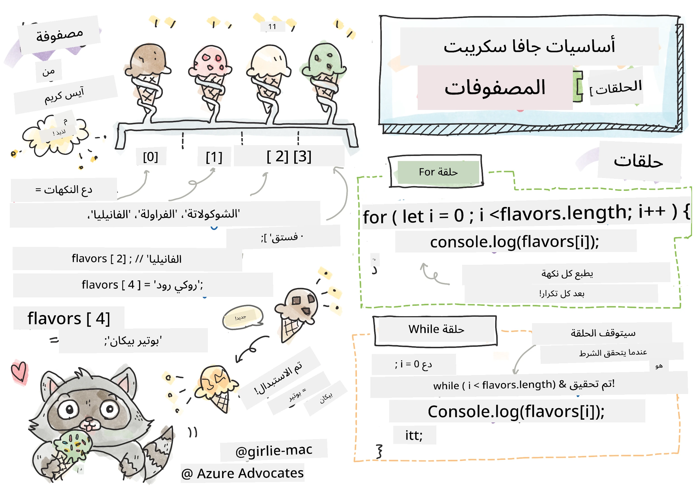
> رسم توضيحي بواسطة [Tomomi Imura](https://twitter.com/girlie_mac)

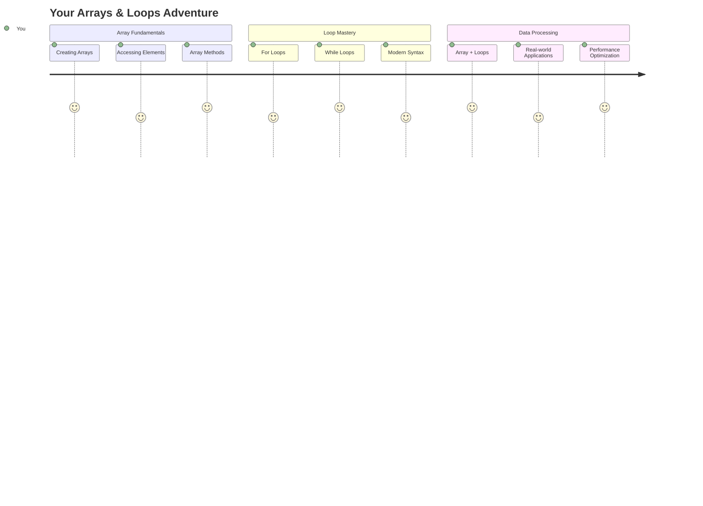

## اختبار ما قبل المحاضرة
[اختبار ما قبل المحاضرة](https://ff-quizzes.netlify.app/web/quiz/13)

هل تساءلت يومًا كيف تحتفظ المواقع الإلكترونية بعناصر سلة التسوق أو تعرض قائمة أصدقائك؟ هنا تأتي المصفوفات والحلقات. المصفوفات تشبه الحاويات الرقمية التي تحتوي على معلومات متعددة، بينما تتيح لك الحلقات العمل مع كل تلك البيانات بكفاءة دون الحاجة إلى كتابة كود متكرر.

معًا، يشكل هذان المفهومان الأساس لمعالجة المعلومات في برامجك. ستتعلم كيف تنتقل من كتابة كل خطوة يدويًا إلى إنشاء كود ذكي وفعال يمكنه معالجة مئات أو حتى آلاف العناصر بسرعة.

بنهاية هذه الدرس، ستفهم كيفية إنجاز مهام البيانات المعقدة باستخدام بضعة أسطر فقط من الكود. دعونا نستكشف هذه المفاهيم البرمجية الأساسية.

[](https://youtube.com/watch?v=1U4qTyq02Xw "المصفوفات")

[](https://www.youtube.com/watch?v=Eeh7pxtTZ3k "الحلقات")

> 🎥 انقر على الصور أعلاه لمشاهدة فيديوهات حول المصفوفات والحلقات.

> يمكنك أخذ هذا الدرس على [Microsoft Learn](https://docs.microsoft.com/learn/modules/web-development-101-arrays/?WT.mc_id=academic-77807-sagibbon)!

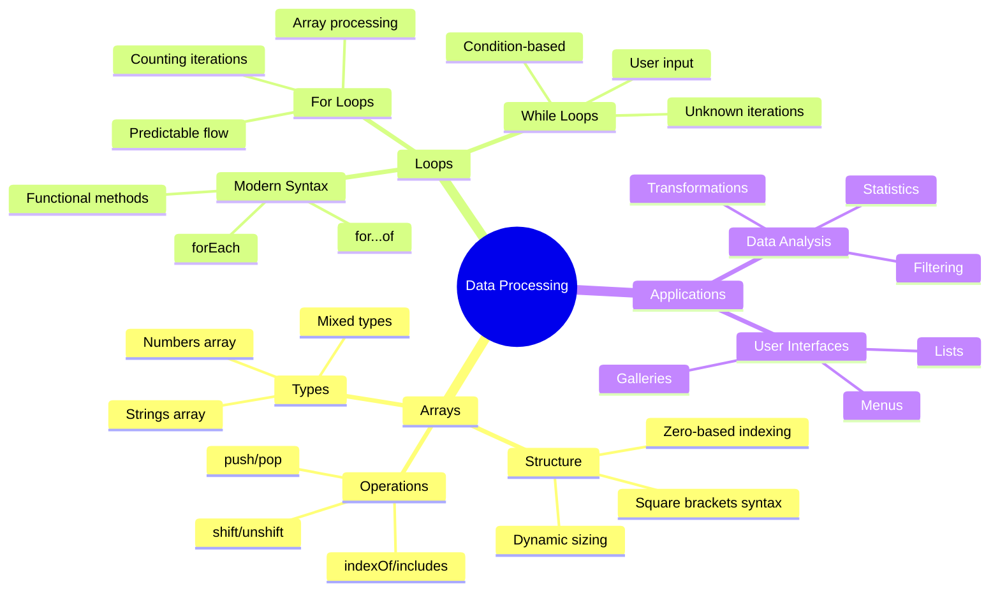

## المصفوفات

فكر في المصفوفات كخزانة ملفات رقمية - بدلاً من تخزين مستند واحد في كل درج، يمكنك تنظيم عناصر متعددة ذات صلة في حاوية واحدة منظمة. في مصطلحات البرمجة، تتيح لك المصفوفات تخزين معلومات متعددة في حزمة واحدة منظمة.

سواء كنت تبني معرض صور، تدير قائمة مهام، أو تتابع أعلى النقاط في لعبة، توفر المصفوفات الأساس لتنظيم البيانات. دعونا نرى كيف تعمل.

✅ المصفوفات موجودة في كل مكان! هل يمكنك التفكير في مثال واقعي لمصفوفة، مثل مصفوفة ألواح شمسية؟

### إنشاء المصفوفات

إنشاء مصفوفة أمر بسيط للغاية - فقط استخدم الأقواس المربعة!

```javascript
// Empty array - like an empty shopping cart waiting for items
const myArray = [];
```

**ما الذي يحدث هنا؟**
لقد أنشأت للتو حاوية فارغة باستخدام تلك الأقواس المربعة `[]`. فكر فيها كرف مكتبة فارغ - إنه جاهز لحمل أي كتب تريد تنظيمها هناك.

يمكنك أيضًا ملء المصفوفة بقيم أولية من البداية:

```javascript
// Your ice cream shop's flavor menu
const iceCreamFlavors = ["Chocolate", "Strawberry", "Vanilla", "Pistachio", "Rocky Road"];

// A user's profile info (mixing different types of data)
const userData = ["John", 25, true, "developer"];

// Test scores for your favorite class
const scores = [95, 87, 92, 78, 85];
```

**أشياء رائعة يجب ملاحظتها:**
- يمكنك تخزين نصوص، أرقام، أو حتى قيم صحيحة/خاطئة في نفس المصفوفة
- فقط افصل بين كل عنصر بفاصلة - بسيط!
- المصفوفات مثالية للحفاظ على المعلومات ذات الصلة معًا

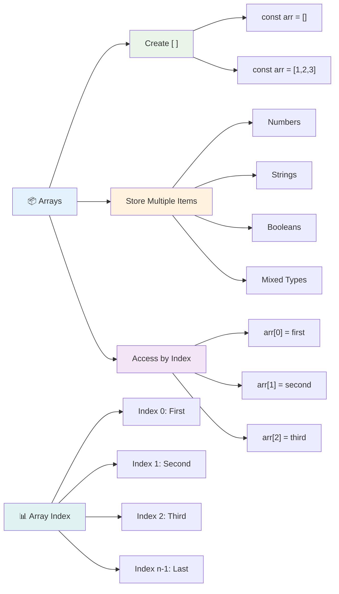

### فهرسة المصفوفات

هناك شيء قد يبدو غير مألوف في البداية: المصفوفات ترقم عناصرها بدءًا من 0، وليس 1. هذا الفهرسة القائمة على الصفر لها جذورها في كيفية عمل ذاكرة الكمبيوتر - لقد كانت تقليدًا برمجيًا منذ الأيام الأولى للغات البرمجة مثل C. كل موقع في المصفوفة يحصل على رقم عنوان خاص به يسمى **الفهرس**.

| الفهرس | القيمة | الوصف |
|-------|-------|-------------|
| 0 | "Chocolate" | العنصر الأول |
| 1 | "Strawberry" | العنصر الثاني |
| 2 | "Vanilla" | العنصر الثالث |
| 3 | "Pistachio" | العنصر الرابع |
| 4 | "Rocky Road" | العنصر الخامس |

✅ هل يفاجئك أن المصفوفات تبدأ بالفهرس صفر؟ في بعض لغات البرمجة، تبدأ الفهارس من 1. هناك تاريخ مثير للاهتمام حول هذا الموضوع يمكنك [قراءته على ويكيبيديا](https://en.wikipedia.org/wiki/Zero-based_numbering).

**الوصول إلى عناصر المصفوفة:**

```javascript
const iceCreamFlavors = ["Chocolate", "Strawberry", "Vanilla", "Pistachio", "Rocky Road"];

// Access individual elements using bracket notation
console.log(iceCreamFlavors[0]); // "Chocolate" - first element
console.log(iceCreamFlavors[2]); // "Vanilla" - third element
console.log(iceCreamFlavors[4]); // "Rocky Road" - last element
```

**تفصيل ما يحدث هنا:**
- **يستخدم** تدوين الأقواس المربعة مع رقم الفهرس للوصول إلى العناصر
- **يعيد** القيمة المخزنة في ذلك الموقع المحدد في المصفوفة
- **يبدأ** العد من 0، مما يجعل العنصر الأول فهرسه 0

**تعديل عناصر المصفوفة:**

```javascript
// Change an existing value
iceCreamFlavors[4] = "Butter Pecan";
console.log(iceCreamFlavors[4]); // "Butter Pecan"

// Add a new element at the end
iceCreamFlavors[5] = "Cookie Dough";
console.log(iceCreamFlavors[5]); // "Cookie Dough"
```

**في المثال أعلاه، قمنا بـ:**
- **تعديل** العنصر عند الفهرس 4 من "Rocky Road" إلى "Butter Pecan"
- **إضافة** عنصر جديد "Cookie Dough" عند الفهرس 5
- **توسيع** طول المصفوفة تلقائيًا عند الإضافة خارج الحدود الحالية

### طول المصفوفة والطرق الشائعة

تأتي المصفوفات بخصائص وطرق مدمجة تجعل العمل مع البيانات أسهل بكثير.

**إيجاد طول المصفوفة:**

```javascript
const iceCreamFlavors = ["Chocolate", "Strawberry", "Vanilla", "Pistachio", "Rocky Road"];
console.log(iceCreamFlavors.length); // 5

// Length updates automatically as array changes
iceCreamFlavors.push("Mint Chip");
console.log(iceCreamFlavors.length); // 6
```

**نقاط رئيسية يجب تذكرها:**
- **يعيد** العدد الإجمالي للعناصر في المصفوفة
- **يتحدث** تلقائيًا عند إضافة أو إزالة العناصر
- **يوفر** عدًا ديناميكيًا مفيدًا للحلقات والتحقق

**طرق المصفوفة الأساسية:**

```javascript
const fruits = ["apple", "banana", "orange"];

// Add elements
fruits.push("grape");           // Adds to end: ["apple", "banana", "orange", "grape"]
fruits.unshift("strawberry");   // Adds to beginning: ["strawberry", "apple", "banana", "orange", "grape"]

// Remove elements
const lastFruit = fruits.pop();        // Removes and returns "grape"
const firstFruit = fruits.shift();     // Removes and returns "strawberry"

// Find elements
const index = fruits.indexOf("banana"); // Returns 1 (position of "banana")
const hasApple = fruits.includes("apple"); // Returns true
```

**فهم هذه الطرق:**
- **يضيف** عناصر باستخدام `push()` (النهاية) و`unshift()` (البداية)
- **يزيل** عناصر باستخدام `pop()` (النهاية) و`shift()` (البداية)
- **يحدد** العناصر باستخدام `indexOf()` ويتحقق من وجودها باستخدام `includes()`
- **يعيد** قيمًا مفيدة مثل العناصر المزالة أو مواقع الفهارس

✅ جرب بنفسك! استخدم وحدة التحكم في متصفحك لإنشاء وتعديل مصفوفة من إنشائك.

### 🧠 **فحص أساسيات المصفوفة: تنظيم بياناتك**

**اختبر فهمك للمصفوفات:**
- لماذا تعتقد أن المصفوفات تبدأ العد من 0 بدلاً من 1؟
- ماذا يحدث إذا حاولت الوصول إلى فهرس غير موجود (مثل `arr[100]` في مصفوفة تحتوي على 5 عناصر)؟
- هل يمكنك التفكير في ثلاثة سيناريوهات واقعية حيث تكون المصفوفات مفيدة؟

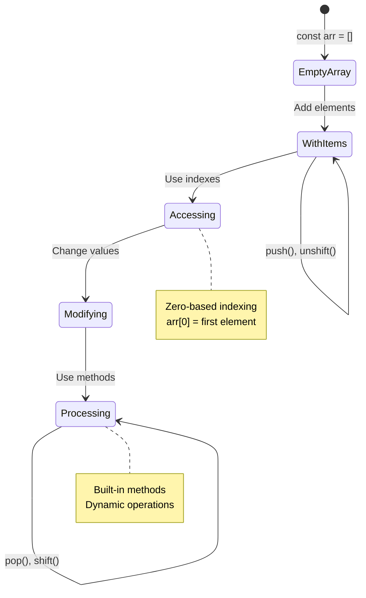

> **رؤية واقعية**: المصفوفات موجودة في كل مكان في البرمجة! خلاصات وسائل التواصل الاجتماعي، سلال التسوق، معارض الصور، قوائم تشغيل الأغاني - كلها مصفوفات خلف الكواليس!

## الحلقات

فكر في العقوبة الشهيرة في روايات تشارلز ديكنز حيث كان الطلاب يكتبون الجمل مرارًا وتكرارًا على اللوح. تخيل لو كان بإمكانك ببساطة أن تطلب من شخص ما "اكتب هذه الجملة 100 مرة" ويتم ذلك تلقائيًا. هذا بالضبط ما تفعله الحلقات في الكود الخاص بك.

الحلقات تشبه وجود مساعد لا يكل يمكنه تكرار المهام دون خطأ. سواء كنت بحاجة إلى التحقق من كل عنصر في سلة التسوق أو عرض جميع الصور في ألبوم، فإن الحلقات تتعامل مع التكرار بكفاءة.

يوفر JavaScript عدة أنواع من الحلقات للاختيار من بينها. دعونا نلقي نظرة على كل نوع ونفهم متى نستخدمه.

```mermaid
flowchart TD
    A["🔄 Loop Types"] --> B["For Loop"]
    A --> C["While Loop"]
    A --> D["For...of Loop"]
    A --> E["forEach Method"]
    
    B --> B1["Known iterations"]
    B --> B2["Counter-based"]
    B --> B3["for(init; condition; increment)"]
    
    C --> C1["Unknown iterations"]
    C --> C2["Condition-based"]
    C --> C3["while(condition)"]
    
    D --> D1["Modern ES6+"]
    D --> D2["Array iteration"]
    D --> D3["for(item of array)"]
    
    E --> E1["Functional style"]
    E --> E2["Array method"]
    E --> E3["array.forEach(callback)"]
    
    F["⏰ When to Use"] --> F1["For: Counting, indexes"]
    F --> F2["While: User input, searching"]
    F --> F3["For...of: Simple iteration"]
    F --> F4["forEach: Functional programming"]
    
    style A fill:#e3f2fd
    style B fill:#e8f5e8
    style C fill:#fff3e0
    style D fill:#f3e5f5
    style E fill:#e0f2f1
    style F fill:#fce4ec
```

### حلقة For

حلقة `for` تشبه ضبط مؤقت - تعرف بالضبط عدد المرات التي تريد أن يحدث فيها شيء ما. إنها منظمة للغاية ويمكن التنبؤ بها، مما يجعلها مثالية عند العمل مع المصفوفات أو الحاجة إلى عد الأشياء.

**هيكل حلقة For:**

| المكون | الغرض | المثال |
|-----------|---------|----------|
| **التهيئة** | تحديد نقطة البداية | `let i = 0` |
| **الشرط** | متى تستمر | `i < 10` |
| **الزيادة** | كيفية التحديث | `i++` |

```javascript
// Counting from 0 to 9
for (let i = 0; i < 10; i++) {
  console.log(`Count: ${i}`);
}

// More practical example: processing scores
const testScores = [85, 92, 78, 96, 88];
for (let i = 0; i < testScores.length; i++) {
  console.log(`Student ${i + 1}: ${testScores[i]}%`);
}
```

**خطوة بخطوة، إليك ما يحدث:**
- **تهيئة** متغير العداد `i` إلى 0 في البداية
- **التحقق** من الشرط `i < 10` قبل كل تكرار
- **تنفيذ** كتلة الكود عندما يكون الشرط صحيحًا
- **زيادة** قيمة `i` بمقدار 1 بعد كل تكرار باستخدام `i++`
- **التوقف** عندما يصبح الشرط خاطئًا (عندما يصل `i` إلى 10)

✅ قم بتشغيل هذا الكود في وحدة التحكم في المتصفح. ماذا يحدث عندما تقوم بإجراء تغييرات صغيرة على العداد، الشرط، أو تعبير التكرار؟ هل يمكنك جعله يعمل بالعكس، مما ينشئ عد تنازلي؟

### 🗓️ **فحص إتقان حلقة For: التكرار المنضبط**

**قيّم فهمك لحلقة for:**
- ما هي الأجزاء الثلاثة لحلقة for، وما وظيفة كل منها؟
- كيف يمكنك تكرار المصفوفة بالعكس؟
- ماذا يحدث إذا نسيت جزء الزيادة (`i++`)؟

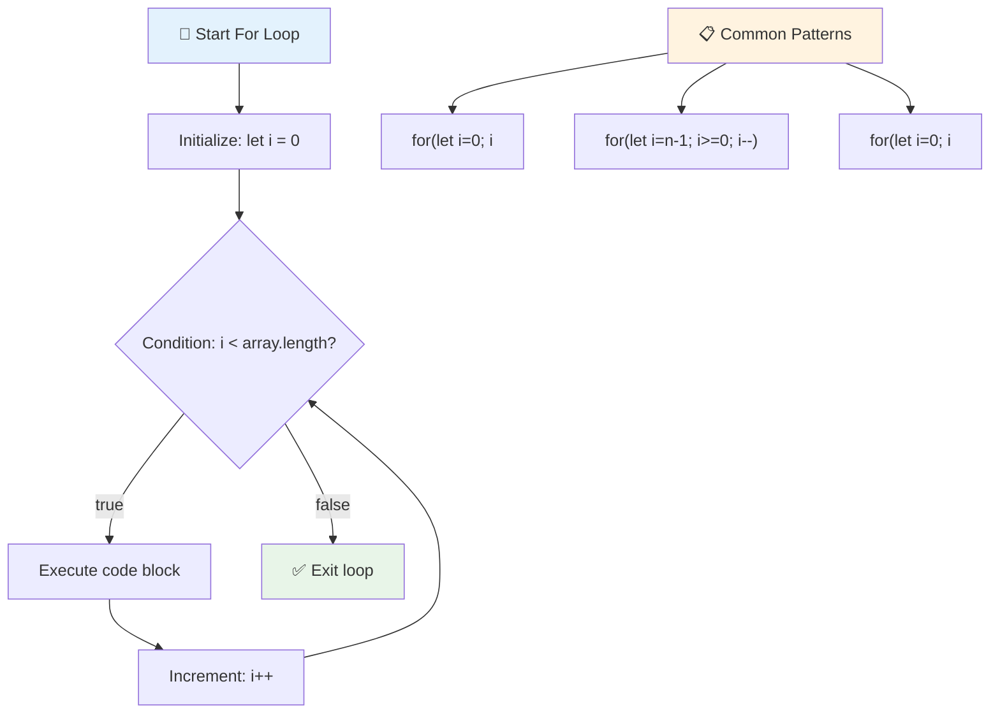

> **حكمة الحلقات**: الحلقات من نوع for مثالية عندما تعرف بالضبط عدد المرات التي تحتاج فيها إلى تكرار شيء ما. إنها الخيار الأكثر شيوعًا لمعالجة المصفوفات!

### حلقة While

حلقة `while` تشبه قول "استمر في فعل هذا حتى..." - قد لا تعرف بالضبط عدد المرات التي ستعمل فيها، لكنك تعرف متى تتوقف. إنها مثالية لأشياء مثل طلب إدخال المستخدم حتى يعطيك ما تحتاجه، أو البحث في البيانات حتى تجد ما تبحث عنه.

**خصائص حلقة While:**
- **تستمر** في التنفيذ طالما أن الشرط صحيح
- **تتطلب** إدارة يدوية لأي متغيرات عداد
- **تتحقق** من الشرط قبل كل تكرار
- **تخاطر** بالحلقات اللانهائية إذا لم يصبح الشرط خاطئًا أبدًا

```javascript
// Basic counting example
let i = 0;
while (i < 10) {
  console.log(`While count: ${i}`);
  i++; // Don't forget to increment!
}

// More practical example: processing user input
let userInput = "";
let attempts = 0;
const maxAttempts = 3;

while (userInput !== "quit" && attempts < maxAttempts) {
  userInput = prompt(`Enter 'quit' to exit (attempt ${attempts + 1}):`);
  attempts++;
}

if (attempts >= maxAttempts) {
  console.log("Maximum attempts reached!");
}
```

**فهم هذه الأمثلة:**
- **تدير** متغير العداد `i` يدويًا داخل جسم الحلقة
- **تزيد** العداد لمنع الحلقات اللانهائية
- **توضح** حالة استخدام عملية مع إدخال المستخدم وتحديد المحاولات
- **تتضمن** آليات أمان لمنع التنفيذ اللامتناهي

### ♾️ **فحص حكمة حلقة While: التكرار القائم على الشرط**

**اختبر فهمك لحلقات while:**
- ما هو الخطر الرئيسي عند استخدام حلقات while؟
- متى تختار حلقة while بدلاً من حلقة for؟
- كيف يمكنك منع الحلقات اللانهائية؟

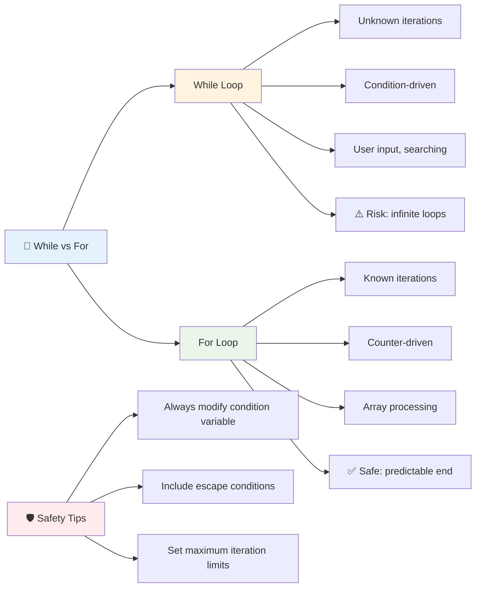

> **السلامة أولاً**: حلقات while قوية ولكنها تتطلب إدارة دقيقة للشرط. تأكد دائمًا من أن شرط الحلقة سيصبح خاطئًا في النهاية!

### بدائل الحلقات الحديثة

يوفر JavaScript صياغة حلقات حديثة يمكن أن تجعل الكود الخاص بك أكثر وضوحًا وأقل عرضة للأخطاء.

**حلقة For...of (ES6+):**

```javascript
const colors = ["red", "green", "blue", "yellow"];

// Modern approach - cleaner and safer
for (const color of colors) {
  console.log(`Color: ${color}`);
}

// Compare with traditional for loop
for (let i = 0; i < colors.length; i++) {
  console.log(`Color: ${colors[i]}`);
}
```

**المزايا الرئيسية لحلقة for...of:**
- **تلغي** إدارة الفهرس وأخطاء الفهرسة
- **توفر** الوصول المباشر لعناصر المصفوفة
- **تحسن** وضوح الكود وتقلل من تعقيد الصياغة

**طريقة forEach:**

```javascript
const prices = [9.99, 15.50, 22.75, 8.25];

// Using forEach for functional programming style
prices.forEach((price, index) => {
  console.log(`Item ${index + 1}: $${price.toFixed(2)}`);
});

// forEach with arrow functions for simple operations
prices.forEach(price => console.log(`Price: $${price}`));
```

**ما تحتاج إلى معرفته عن forEach:**
- **تنفذ** وظيفة لكل عنصر في المصفوفة
- **توفر** قيمة العنصر والفهرس كمعلمات
- **لا يمكن** إيقافها مبكرًا (على عكس الحلقات التقليدية)
- **تعيد** undefined (لا تنشئ مصفوفة جديدة)

✅ لماذا تختار حلقة for مقابل حلقة while؟ 17 ألف مشاهد كان لديهم نفس السؤال على StackOverflow، وبعض الآراء [قد تكون مثيرة للاهتمام بالنسبة لك](https://stackoverflow.com/questions/39969145/while-loops-vs-for-loops-in-javascript).

### 🎨 **فحص صياغة الحلقات الحديثة: تبني ES6+**

**قيّم فهمك للبرمجة الحديثة في JavaScript:**
- ما هي مزايا `for...of` مقارنة بالحلقات التقليدية؟
- متى قد تفضل الحلقات التقليدية؟
- ما الفرق بين `forEach` و`map`؟

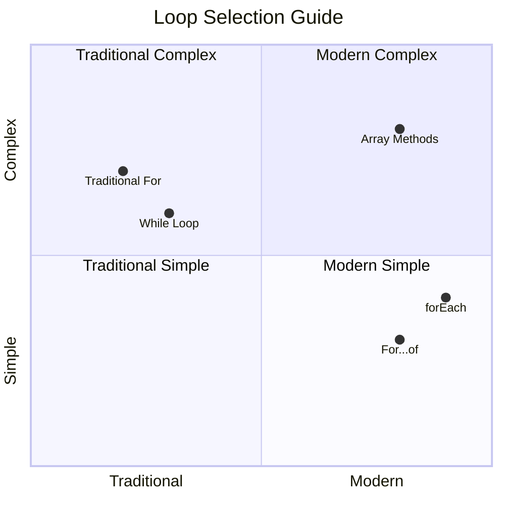

> **الاتجاه الحديث**: صياغة ES6+ مثل `for...of` و`forEach` أصبحت النهج المفضل لتكرار المصفوفات لأنها أكثر وضوحًا وأقل عرضة للأخطاء!

## الحلقات والمصفوفات

دمج المصفوفات مع الحلقات يخلق قدرات قوية لمعالجة البيانات. هذا الاقتران أساسي للعديد من مهام البرمجة، من عرض القوائم إلى حساب الإحصائيات.

**معالجة المصفوفات التقليدية:**

```javascript
const iceCreamFlavors = ["Chocolate", "Strawberry", "Vanilla", "Pistachio", "Rocky Road"];

// Classic for loop approach
for (let i = 0; i < iceCreamFlavors.length; i++) {
  console.log(`Flavor ${i + 1}: ${iceCreamFlavors[i]}`);
}

// Modern for...of approach
for (const flavor of iceCreamFlavors) {
  console.log(`Available flavor: ${flavor}`);
}
```

**دعونا نفهم كل نهج:**
- **يستخدم** خاصية طول المصفوفة لتحديد حدود الحلقة
- **يصل** إلى العناصر بواسطة الفهرس في الحلقات التقليدية
- **يوفر** الوصول المباشر للعناصر في الحلقات من نوع for...of
- **يعالج** كل عنصر في المصفوفة مرة واحدة بالضبط

**مثال عملي لمعالجة البيانات:**

```javascript
const studentGrades = [85, 92, 78, 96, 88, 73, 89];
let total = 0;
let highestGrade = studentGrades[0];
let lowestGrade = studentGrades[0];

// Process all grades with a single loop
for (let i = 0; i < studentGrades.length; i++) {
  const grade = studentGrades[i];
  total += grade;
  
  if (grade > highestGrade) {
    highestGrade = grade;
  }
  
  if (grade < lowestGrade) {
    lowestGrade = grade;
  }
}

const average = total / studentGrades.length;
console.log(`Average: ${average.toFixed(1)}`);
console.log(`Highest: ${highestGrade}`);
console.log(`Lowest: ${lowestGrade}`);
```

**إليك كيف يعمل هذا الكود:**
- **يهيئ** متغيرات التتبع للمجموع والقيم القصوى والدنيا
- **يعالج** كل درجة باستخدام حلقة واحدة فعالة
- **يجمع** الإجمالي لحساب المتوسط
- **يتتبع** أعلى وأدنى القيم أثناء التكرار
- **يحسب** الإحصائيات النهائية بعد انتهاء الحلقة

✅ جرب التكرار على مصفوفة من إنشائك في وحدة التحكم في المتصفح.

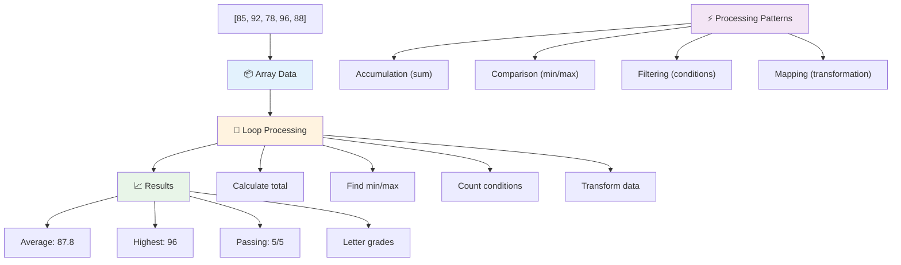

---

## تحدي GitHub Copilot Agent 🚀

استخدم وضع Agent لإكمال التحدي التالي:

**الوصف:** قم ببناء وظيفة شاملة لمعالجة البيانات تجمع بين المصفوفات والحلقات لتحليل مجموعة بيانات وتوليد رؤى مفيدة.

**المهمة:** قم بإنشاء وظيفة تسمى `analyzeGrades` تأخذ مصفوفة من كائنات درجات الطلاب (كل منها يحتوي على خصائص الاسم والدرجة) وتعيد كائنًا يحتوي على إحصائيات تشمل أعلى درجة، أدنى درجة، متوسط الدرجة، عدد الطلاب الذين اجتازوا (درجة >= 70)، ومصفوفة بأسماء الطلاب الذين حصلوا على درجات أعلى من المتوسط. استخدم على الأقل نوعين مختلفين من الحلقات في الحل.

تعرف على المزيد حول [وضع Agent](https://code.visualstudio.com/blogs/2025/02/24/introducing-copilot-agent-mode) هنا.

## 🚀 التحدي
تقدم JavaScript العديد من الطرق الحديثة للتعامل مع المصفوفات التي يمكن أن تحل محل الحلقات التقليدية لأداء مهام محددة. استكشف [forEach](https://developer.mozilla.org/docs/Web/JavaScript/Reference/Global_Objects/Array/forEach)، [for-of](https://developer.mozilla.org/docs/Web/JavaScript/Reference/Statements/for...of)، [map](https://developer.mozilla.org/docs/Web/JavaScript/Reference/Global_Objects/Array/map)، [filter](https://developer.mozilla.org/docs/Web/JavaScript/Reference/Global_Objects/Array/filter)، و [reduce](https://developer.mozilla.org/docs/Web/JavaScript/Reference/Global_Objects/Array/reduce).

**تحديك:** قم بإعادة كتابة مثال درجات الطلاب باستخدام ثلاثة طرق مختلفة على الأقل من طرق المصفوفات. لاحظ كيف يصبح الكود أكثر وضوحًا وسهولة في القراءة باستخدام صياغة JavaScript الحديثة.

## اختبار ما بعد المحاضرة
[اختبار ما بعد المحاضرة](https://ff-quizzes.netlify.app/web/quiz/14)

## المراجعة والدراسة الذاتية

تحتوي المصفوفات في JavaScript على العديد من الطرق المفيدة جدًا لمعالجة البيانات. [اقرأ عن هذه الطرق](https://developer.mozilla.org/docs/Web/JavaScript/Reference/Global_Objects/Array) وجرب بعضها (مثل push، pop، slice و splice) على مصفوفة من إنشائك.

## الواجب

[حلقة على مصفوفة](assignment.md)

---

## 📊 **ملخص أدواتك للمصفوفات والحلقات**

```mermaid
graph TD
    A["🎯 Arrays & Loops Mastery"] --> B["📦 Array Fundamentals"]
    A --> C["🔄 Loop Types"]
    A --> D["🔗 Data Processing"]
    A --> E["🎨 Modern Techniques"]
    
    B --> B1["Creation: [ ]"]
    B --> B2["Indexing: arr[0]"]
    B --> B3["Methods: push, pop"]
    B --> B4["Properties: length"]
    
    C --> C1["For: Known iterations"]
    C --> C2["While: Condition-based"]
    C --> C3["For...of: Direct access"]
    C --> C4["forEach: Functional"]
    
    D --> D1["Statistics calculation"]
    D --> D2["Data transformation"]
    D --> D3["Filtering & searching"]
    D --> D4["Real-time processing"]
    
    E --> E1["Arrow functions"]
    E --> E2["Method chaining"]
    E --> E3["Destructuring"]
    E --> E4["Template literals"]
    
    F["💡 Key Benefits"] --> F1["Efficient data handling"]
    F --> F2["Reduced code repetition"]
    F --> F3["Scalable solutions"]
    F --> F4["Cleaner syntax"]
    
    style A fill:#e3f2fd
    style B fill:#e8f5e8
    style C fill:#fff3e0
    style D fill:#f3e5f5
    style E fill:#e0f2f1
    style F fill:#fce4ec
```

---

## 🚀 جدولك الزمني لإتقان المصفوفات والحلقات

### ⚡ **ما يمكنك القيام به في الدقائق الخمس القادمة**
- [ ] أنشئ مصفوفة لأفلامك المفضلة وقم بالوصول إلى عناصر محددة
- [ ] اكتب حلقة for تعد من 1 إلى 10
- [ ] جرب تحدي الطرق الحديثة للمصفوفات من الدرس
- [ ] تدرب على فهرسة المصفوفات في وحدة التحكم بالمتصفح

### 🎯 **ما يمكنك إنجازه خلال هذه الساعة**
- [ ] أكمل اختبار ما بعد الدرس وراجع أي مفاهيم صعبة
- [ ] قم ببناء محلل شامل للدرجات من تحدي GitHub Copilot
- [ ] أنشئ عربة تسوق بسيطة تضيف وتزيل العناصر
- [ ] تدرب على التحويل بين أنواع الحلقات المختلفة
- [ ] جرب طرق المصفوفات مثل `push`، `pop`، `slice`، و `splice`

### 📅 **رحلة معالجة البيانات لمدة أسبوع**
- [ ] أكمل واجب "حلقة على مصفوفة" مع تحسينات إبداعية
- [ ] قم ببناء تطبيق قائمة مهام باستخدام المصفوفات والحلقات
- [ ] أنشئ آلة حاسبة بسيطة للإحصائيات للبيانات الرقمية
- [ ] تدرب باستخدام [طرق المصفوفات في MDN](https://developer.mozilla.org/docs/Web/JavaScript/Reference/Global_Objects/Array)
- [ ] قم ببناء واجهة معرض صور أو قائمة تشغيل موسيقية
- [ ] استكشف البرمجة الوظيفية باستخدام `map`، `filter`، و `reduce`

### 🌟 **تحولك خلال شهر**
- [ ] إتقان العمليات المتقدمة على المصفوفات وتحسين الأداء
- [ ] قم ببناء لوحة تحكم كاملة لتصور البيانات
- [ ] ساهم في مشاريع مفتوحة المصدر تتعلق بمعالجة البيانات
- [ ] علم شخصًا آخر عن المصفوفات والحلقات باستخدام أمثلة عملية
- [ ] أنشئ مكتبة شخصية لوظائف معالجة البيانات القابلة لإعادة الاستخدام
- [ ] استكشف الخوارزميات وهياكل البيانات المبنية على المصفوفات

### 🏆 **تسجيل الوصول النهائي لبطل معالجة البيانات**

**احتفل بإتقانك للمصفوفات والحلقات:**
- ما هي العملية الأكثر فائدة على المصفوفات التي تعلمتها للتطبيقات الواقعية؟
- أي نوع من الحلقات يبدو أكثر طبيعية بالنسبة لك ولماذا؟
- كيف غير فهمك للمصفوفات والحلقات نهجك في تنظيم البيانات؟
- ما هي مهمة معالجة البيانات المعقدة التي ترغب في التعامل معها بعد ذلك؟

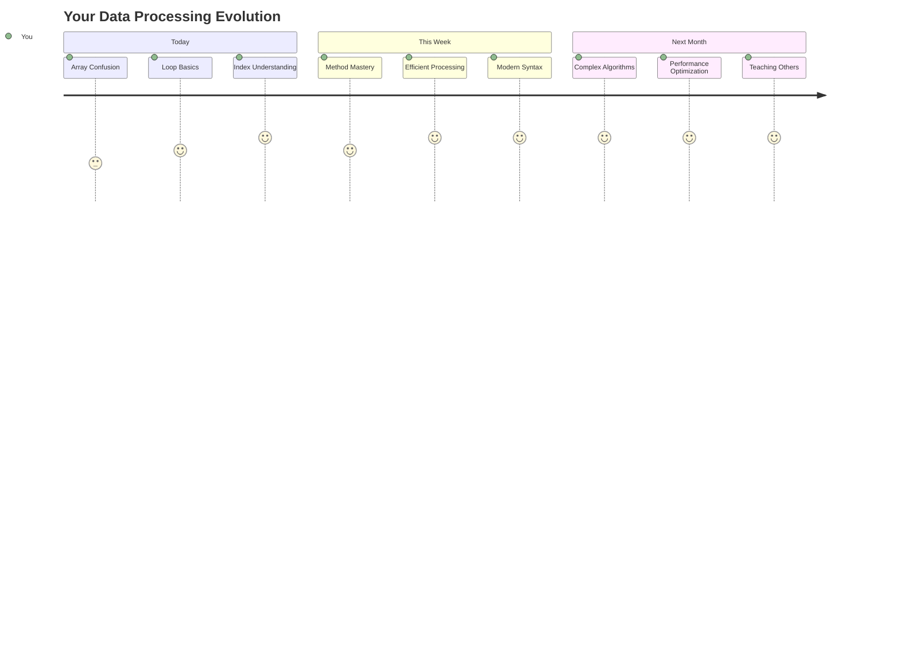

> 📦 **لقد أطلقت العنان لقوة تنظيم ومعالجة البيانات!** المصفوفات والحلقات هي أساس كل تطبيق تقريبًا ستقوم ببنائه. من القوائم البسيطة إلى تحليل البيانات المعقد، لديك الآن الأدوات اللازمة للتعامل مع المعلومات بكفاءة وأناقة. تعتمد كل مواقع الويب الديناميكية، التطبيقات المحمولة، والتطبيقات القائمة على البيانات على هذه المفاهيم الأساسية. مرحبًا بك في عالم معالجة البيانات القابلة للتوسع! 🎉

---

**إخلاء المسؤولية**:  
تم ترجمة هذا المستند باستخدام خدمة الترجمة بالذكاء الاصطناعي [Co-op Translator](https://github.com/Azure/co-op-translator). بينما نسعى لتحقيق الدقة، يرجى العلم أن الترجمات الآلية قد تحتوي على أخطاء أو عدم دقة. يجب اعتبار المستند الأصلي بلغته الأصلية المصدر الموثوق. للحصول على معلومات حاسمة، يُوصى بالترجمة البشرية الاحترافية. نحن غير مسؤولين عن أي سوء فهم أو تفسيرات خاطئة تنشأ عن استخدام هذه الترجمة.