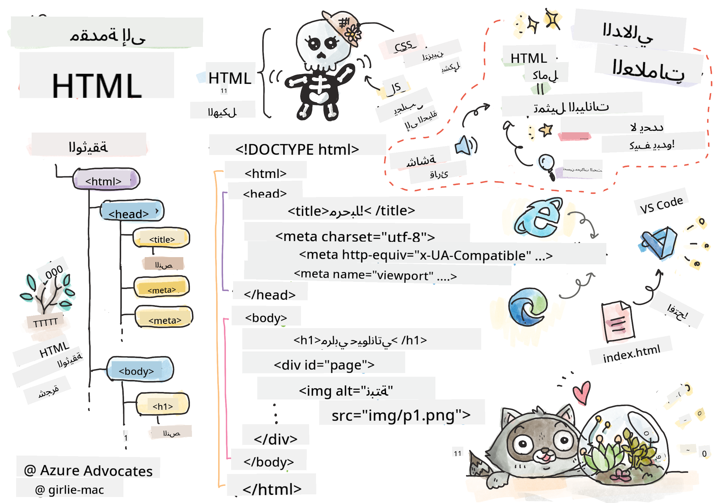
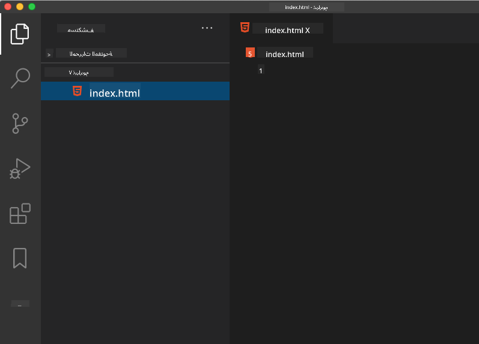

<!--
CO_OP_TRANSLATOR_METADATA:
{
  "original_hash": "20c72cf2e5b0050d38ca3cb14a75a9df",
  "translation_date": "2025-10-22T14:17:56+00:00",
  "source_file": "3-terrarium/1-intro-to-html/README.md",
  "language_code": "ar"
}
-->
# مشروع التيراريوم الجزء الأول: مقدمة إلى HTML


> رسم توضيحي بواسطة [Tomomi Imura](https://twitter.com/girlie_mac)

HTML، أو لغة ترميز النص التشعبي، هي الأساس لكل موقع ويب قمت بزيارته. فكر في HTML كهيكل عظمي يمنح الصفحات الإلكترونية بنيتها – فهو يحدد مكان المحتوى، وكيفية تنظيمه، وما الذي يمثله كل جزء. بينما ستقوم CSS لاحقًا "بتزيين" HTML بالألوان والتصميمات، وستجعل JavaScript الصفحات تفاعلية، فإن HTML يوفر الهيكل الأساسي الذي يجعل كل شيء ممكنًا.

في هذا الدرس، ستقوم بإنشاء هيكل HTML لواجهة تيراريوم افتراضية. هذا المشروع العملي سيعلمك مفاهيم HTML الأساسية أثناء بناء شيء جذاب بصريًا. ستتعلم كيفية تنظيم المحتوى باستخدام العناصر الدلالية، العمل مع الصور، وإنشاء الأساس لتطبيق ويب تفاعلي.

بنهاية هذا الدرس، سيكون لديك صفحة HTML تعمل تعرض صور النباتات في أعمدة منظمة، جاهزة للتصميم في الدرس التالي. لا تقلق إذا بدا الأمر بسيطًا في البداية – هذا بالضبط ما يجب أن تفعله HTML قبل أن تضيف CSS اللمسات البصرية.

## اختبار ما قبل المحاضرة

[اختبار ما قبل المحاضرة](https://ff-quizzes.netlify.app/web/quiz/15)

> 📺 **شاهد وتعلم**: تحقق من هذا الفيديو المفيد
> 
> [](https://www.youtube.com/watch?v=1TvxJKBzhyQ)

## إعداد مشروعك

قبل أن نبدأ في كتابة كود HTML، دعنا نُعد مساحة عمل مناسبة لمشروع التيراريوم الخاص بك. إنشاء هيكل ملفات منظم منذ البداية هو عادة مهمة ستفيدك طوال رحلتك في تطوير الويب.

### المهمة: إنشاء هيكل مشروعك

ستقوم بإنشاء مجلد مخصص لمشروع التيراريوم الخاص بك وإضافة أول ملف HTML. إليك طريقتان يمكنك استخدامهما:

**الخيار الأول: باستخدام Visual Studio Code**
1. افتح Visual Studio Code
2. انقر على "File" → "Open Folder" أو استخدم `Ctrl+K, Ctrl+O` (Windows/Linux) أو `Cmd+K, Cmd+O` (Mac)
3. أنشئ مجلدًا جديدًا باسم `terrarium` واختره
4. في لوحة Explorer، انقر على أيقونة "New File"
5. قم بتسمية الملف `index.html`



**الخيار الثاني: باستخدام أوامر الطرفية**
```bash
mkdir terrarium
cd terrarium
touch index.html
code index.html
```

**ما الذي تقوم به هذه الأوامر:**
- **إنشاء** مجلد جديد باسم `terrarium` لمشروعك
- **التنقل** داخل مجلد التيراريوم 
- **إنشاء** ملف فارغ باسم `index.html`
- **فتح** الملف في Visual Studio Code للتعديل

> 💡 **نصيحة احترافية**: اسم الملف `index.html` له أهمية خاصة في تطوير الويب. عندما يزور شخص ما موقعًا إلكترونيًا، تبحث المتصفحات تلقائيًا عن `index.html` كصفحة افتراضية للعرض. هذا يعني أن عنوان URL مثل `https://mysite.com/projects/` سيعرض تلقائيًا ملف `index.html` من مجلد `projects` دون الحاجة إلى تحديد اسم الملف في عنوان URL.

## فهم هيكل مستند HTML

كل مستند HTML يتبع هيكلًا محددًا تحتاجه المتصفحات لفهمه وعرضه بشكل صحيح. فكر في هذا الهيكل كرسالة رسمية – تحتوي على عناصر مطلوبة بترتيب معين تساعد المتصفح (المستلم) على معالجة المحتوى بشكل صحيح.

لنبدأ بإضافة الأساسيات التي يحتاجها كل مستند HTML.

### إعلان DOCTYPE والعنصر الجذر

أول سطرين في أي ملف HTML يعملان كـ "مقدمة" للمستند للمتصفح:

```html
<!DOCTYPE html>
<html></html>
```

**فهم ما يفعله هذا الكود:**
- **يعلن** نوع المستند كـ HTML5 باستخدام `<!DOCTYPE html>`
- **ينشئ** العنصر الجذر `<html>` الذي سيحتوي على كل محتوى الصفحة
- **يحدد** معايير الويب الحديثة لعرض المتصفح بشكل صحيح
- **يضمن** عرضًا متسقًا عبر المتصفحات والأجهزة المختلفة

> 💡 **نصيحة VS Code**: قم بالمرور فوق أي علامة HTML في VS Code لرؤية معلومات مفيدة من MDN Web Docs، بما في ذلك أمثلة الاستخدام وتفاصيل توافق المتصفح.

> 📚 **تعلم المزيد**: إعلان DOCTYPE يمنع المتصفحات من الدخول في "وضع الغرائب"، الذي كان يُستخدم لدعم مواقع الويب القديمة جدًا. يستخدم تطوير الويب الحديث الإعلان البسيط `<!DOCTYPE html>` لضمان [عرض متوافق مع المعايير](https://developer.mozilla.org/docs/Web/HTML/Quirks_Mode_and_Standards_Mode).

## إضافة بيانات وصفية أساسية للمستند

قسم `<head>` في مستند HTML يحتوي على معلومات مهمة تحتاجها المتصفحات ومحركات البحث، ولكن لا يراها الزوار مباشرة على الصفحة. فكر فيه كـ "معلومات خلف الكواليس" التي تساعد صفحتك على العمل بشكل صحيح والظهور بشكل صحيح عبر الأجهزة والمنصات المختلفة.

هذه البيانات الوصفية تخبر المتصفحات كيفية عرض صفحتك، أي ترميز الأحرف الذي يجب استخدامه، وكيفية التعامل مع أحجام الشاشات المختلفة – كل ذلك ضروري لإنشاء صفحات ويب احترافية وسهلة الوصول.

### المهمة: إضافة رأس المستند

أضف هذا القسم `<head>` بين علامات `<html>` الافتتاحية والختامية:

```html
<head>
	<title>Welcome to my Virtual Terrarium</title>
	<meta charset="utf-8" />
	<meta http-equiv="X-UA-Compatible" content="IE=edge" />
	<meta name="viewport" content="width=device-width, initial-scale=1" />
</head>
```

**تفصيل ما يفعله كل عنصر:**
- **يحدد** عنوان الصفحة الذي يظهر في علامات تبويب المتصفح ونتائج البحث
- **يحدد** ترميز الأحرف UTF-8 لعرض النص بشكل صحيح عالميًا
- **يضمن** التوافق مع الإصدارات الحديثة من Internet Explorer
- **يُعد** التصميم المتجاوب عن طريق ضبط العرض ليتناسب مع عرض الجهاز
- **يتحكم** في مستوى التكبير الأولي لعرض المحتوى بالحجم الطبيعي

> 🤔 **فكر في هذا**: ماذا سيحدث إذا قمت بتعيين علامة meta للعرض مثل هذه: `<meta name="viewport" content="width=600">`؟ هذا سيجبر الصفحة على أن تكون دائمًا بعرض 600 بكسل، مما يكسر التصميم المتجاوب! تعرف على المزيد حول [تكوين العرض بشكل صحيح](https://developer.mozilla.org/docs/Web/HTML/Viewport_meta_tag).

## بناء جسم المستند

عنصر `<body>` يحتوي على كل المحتوى المرئي لصفحتك – كل ما سيراه المستخدمون ويتفاعلون معه. بينما قدم قسم `<head>` تعليمات للمتصفح، يحتوي قسم `<body>` على المحتوى الفعلي: النصوص، الصور، الأزرار، والعناصر الأخرى التي تشكل واجهة المستخدم الخاصة بك.

دعنا نضيف هيكل الجسم ونفهم كيف تعمل علامات HTML معًا لإنشاء محتوى ذو معنى.

### فهم هيكل علامات HTML

تستخدم HTML علامات مزدوجة لتعريف العناصر. معظم العلامات تحتوي على علامة افتتاحية مثل `<p>` وعلامة إغلاق مثل `</p>`، مع محتوى بينهما: `<p>Hello, world!</p>`. هذا ينشئ عنصر فقرة يحتوي على النص "Hello, world!".

### المهمة: إضافة عنصر الجسم

قم بتحديث ملف HTML الخاص بك ليشمل عنصر `<body>`:

```html
<!DOCTYPE html>
<html>
	<head>
		<title>Welcome to my Virtual Terrarium</title>
		<meta charset="utf-8" />
		<meta http-equiv="X-UA-Compatible" content="IE=edge" />
		<meta name="viewport" content="width=device-width, initial-scale=1" />
	</head>
	<body></body>
</html>
```

**ما الذي يوفره هذا الهيكل الكامل:**
- **يُنشئ** إطار عمل مستند HTML5 الأساسي
- **يتضمن** بيانات وصفية أساسية لعرض المتصفح بشكل صحيح
- **يُنشئ** جسمًا فارغًا جاهزًا لمحتواك المرئي
- **يتبع** أفضل الممارسات الحديثة لتطوير الويب

الآن أنت جاهز لإضافة العناصر المرئية للتيراريوم الخاص بك. سنستخدم عناصر `<div>` كحاويات لتنظيم أقسام المحتوى المختلفة، وعناصر `` لعرض صور النباتات.

### العمل مع الصور وحاويات التخطيط

الصور لها خصوصية في HTML لأنها تستخدم علامات "مغلقة ذاتيًا". على عكس العناصر مثل `<p></p>` التي تحيط بالمحتوى، تحتوي علامة `` على كل المعلومات التي تحتاجها داخل العلامة نفسها باستخدام سمات مثل `src` لمسار ملف الصورة و`alt` للوصول.

قبل إضافة الصور إلى HTML الخاص بك، ستحتاج إلى تنظيم ملفات مشروعك بشكل صحيح عن طريق إنشاء مجلد للصور وإضافة الرسومات النباتية.

**أولاً، قم بإعداد الصور:**
1. أنشئ مجلدًا باسم `images` داخل مجلد مشروع التيراريوم الخاص بك
2. قم بتنزيل صور النباتات من [مجلد الحل](../../../../3-terrarium/solution/images) (14 صورة نباتية إجمالاً)
3. انسخ جميع صور النباتات إلى مجلد `images` الجديد الخاص بك

### المهمة: إنشاء تخطيط عرض النباتات

الآن أضف صور النباتات منظمة في عمودين بين علامات `<body></body>`:

```html
<div id="page">
	<div id="left-container" class="container">
		<div class="plant-holder">
			
		</div>
		<div class="plant-holder">
			
		</div>
		<div class="plant-holder">
			
		</div>
		<div class="plant-holder">
			
		</div>
		<div class="plant-holder">
			
		</div>
		<div class="plant-holder">
			
		</div>
		<div class="plant-holder">
			
		</div>
	</div>
	<div id="right-container" class="container">
		<div class="plant-holder">
			
		</div>
		<div class="plant-holder">
			
		</div>
		<div class="plant-holder">
			
		</div>
		<div class="plant-holder">
			
		</div>
		<div class="plant-holder">
			
		</div>
		<div class="plant-holder">
			
		</div>
		<div class="plant-holder">
			
		</div>
	</div>
</div>
```

**خطوة بخطوة، ما الذي يحدث في هذا الكود:**
- **يُنشئ** حاوية الصفحة الرئيسية بـ `id="page"` لاحتواء كل المحتوى
- **يُحدد** حاويتين للعمودين: `left-container` و`right-container`
- **يُنظم** 7 نباتات في العمود الأيسر و7 نباتات في العمود الأيمن
- **يُغلف** كل صورة نباتية في div باسم `plant-holder` لتحديد موضعها الفردي
- **يُطبق** أسماء فئات متسقة لتصميم CSS في الدرس التالي
- **يُعين** معرفات فريدة لكل صورة نباتية لتفاعل JavaScript لاحقًا
- **يتضمن** مسارات ملفات صحيحة تشير إلى مجلد الصور

> 🤔 **فكر في هذا**: لاحظ أن جميع الصور حاليًا تحتوي على نفس النص البديل "plant". هذا ليس مثاليًا للوصول. سيستمع مستخدمو قارئات الشاشة إلى "plant" مكررًا 14 مرة دون معرفة أي نبات يظهر كل صورة. هل يمكنك التفكير في نص بديل أفضل وأكثر وصفًا لكل صورة؟

> 📝 **أنواع عناصر HTML**: عناصر `<div>` هي "على مستوى الكتلة" وتشغل العرض الكامل، بينما عناصر `<span>` هي "على مستوى السطر" وتشغل العرض اللازم فقط. ماذا تعتقد سيحدث إذا قمت بتغيير جميع علامات `<div>` إلى علامات `<span>`؟

مع إضافة هذا الترميز، ستظهر النباتات على الشاشة، على الرغم من أنها لن تبدو مصقولة بعد – هذا ما ستفعله CSS في الدرس التالي! في الوقت الحالي، لديك أساس HTML قوي ينظم المحتوى بشكل صحيح ويتبع أفضل ممارسات الوصول.

## استخدام HTML الدلالي للوصول

HTML الدلالي يعني اختيار عناصر HTML بناءً على معناها وغرضها، وليس فقط مظهرها. عندما تستخدم الترميز الدلالي، فإنك توصل هيكل ومعنى المحتوى الخاص بك إلى المتصفحات، ومحركات البحث، والتقنيات المساعدة مثل قارئات الشاشة.

هذا النهج يجعل مواقعك الإلكترونية أكثر سهولة للمستخدمين ذوي الإعاقة ويساعد محركات البحث على فهم المحتوى الخاص بك بشكل أفضل. إنه مبدأ أساسي لتطوير الويب الحديث الذي يخلق تجارب أفضل للجميع.

### إضافة عنوان صفحة دلالي

دعنا نضيف عنوانًا مناسبًا لصفحة التيراريوم الخاصة بك. أدخل هذا السطر مباشرة بعد علامة `<body>` الافتتاحية:

```html
<h1>My Terrarium</h1>
```

**لماذا الترميز الدلالي مهم:**
- **يساعد** قارئات الشاشة على التنقل وفهم هيكل الصفحة
- **يحسن** تحسين محركات البحث (SEO) من خلال توضيح تسلسل المحتوى
- **يعزز** الوصول للمستخدمين ذوي الإعاقات البصرية أو الاختلافات الإدراكية
- **يُنشئ** تجارب مستخدم أفضل عبر جميع الأجهزة والمنصات
- **يتبع** معايير الويب وأفضل الممارسات للتطوير الاحترافي

**أمثلة على الخيارات الدلالية مقابل غير الدلالية:**

| الغرض | ✅ الخيار الدلالي | ❌ الخيار غير الدلالي |
|---------|-------------------|------------------------|
| العنوان الرئيسي | `<h1>العنوان</h1>` | `<div class="big-text">العنوان</div>` |
| التنقل | `<nav><ul><li></li></ul></nav>` | `<div class="menu"><div></div></div>` |
| الزر | `<button>اضغط هنا</button>` | `<span onclick="...">اضغط هنا</span>` |
| محتوى المقالة | `<article><p></p></article>` | `<div class="content"><div></div></div>` |

> 🎥 **شاهدها عمليًا**: شاهد [كيف تتفاعل قارئات الشاشة مع صفحات الويب](https://www.youtube.com/watch?v=OUDV1gqs9GA) لفهم لماذا الترميز الدلالي ضروري للوصول. لاحظ كيف يساعد هيكل HTML الصحيح المستخدمين على التنقل بكفاءة.

## إنشاء حاوية التيراريوم

الآن دعنا نضيف هيكل HTML للتيراريوم نفسه – الحاوية الزجاجية حيث سيتم وضع النباتات في النهاية. هذا القسم يوضح مفهومًا مهمًا: HTML يوفر الهيكل، ولكن بدون تصميم CSS، لن تكون هذه العناصر مرئية بعد.

يستخدم ترميز التيراريوم أسماء فئات وصفية ستجعل تصميم CSS بديهيًا وقابلًا للصيانة في الدرس التالي.

### المهمة: إضافة هيكل التيراريوم

أدخل هذا الترميز فوق علامة `</div>` الأخيرة (قبل علامة الإغلاق لحاوية الصفحة):

```html
<div id="terrarium">
	<div class="jar-top"></div>
	<div class="jar-walls">
		<div class="jar-glossy-long"></div>
		<div class="jar-glossy-short"></div>
	</div>
	<div class="dirt"></div>
	<div class="jar-bottom"></div>
</div>
```

**فهم هيكل التيراريوم هذا:**
- **يُنشئ** حاوية تيراريوم رئيسية بمعرف فريد للتصميم
- **يُحدد** عناصر منفصلة لكل مكون بصري (الأعلى، الجدران، التربة، القاع)
- **يتضمن** عناصر متداخلة لتأثيرات انعكاس الزجاج (عناصر لامعة)
- **يستخدم** أسماء فئات وصفية تشير بوضوح إلى غرض كل عنصر
- **يُعد** الهيكل لتصميم CSS الذي سيُنشئ مظهر التيراريوم الزجاجي

> 🤔 **لاحظ شيئًا؟**: على الرغم من أنك أضفت هذا الترميز، إلا أنك لا ترى أي شيء جديد على الصفحة! هذا يوضح تمامًا كيف يوفر HTML الهيكل بينما يوفر CSS المظهر. هذه عناصر `<div>` موجودة ولكن ليس لديها تصميم مرئي بعد – هذا قادم في الدرس التالي!

---

## تحدي وكيل GitHub Copilot

استخدم وضع الوكيل لإكمال التحدي التالي:

**الوصف:** قم بإنشاء هيكل HTML دلالي لقسم دليل العناية بالنباتات الذي يمكن إضافته إلى مشروع التيراريوم.
**الموجه:** قم بإنشاء قسم HTML دلالي يتضمن عنوانًا رئيسيًا "دليل العناية بالنباتات"، وثلاثة أقسام فرعية بعناوين "الري"، "متطلبات الضوء"، و"العناية بالتربة"، يحتوي كل منها على فقرة من معلومات العناية بالنباتات. استخدم علامات HTML الدلالية المناسبة مثل `<section>`، `<h2>`، `<h3>`، و `<p>` لتنظيم المحتوى بشكل صحيح.

تعرف على المزيد حول [وضع الوكيل](https://code.visualstudio.com/blogs/2025/02/24/introducing-copilot-agent-mode) هنا.

## تحدي استكشاف تاريخ HTML

**التعرف على تطور الويب**

لقد تطور HTML بشكل كبير منذ أن أنشأ تيم بيرنرز لي أول متصفح ويب في CERN عام 1990. بعض العلامات القديمة مثل `<marquee>` أصبحت الآن مهملة لأنها لا تتوافق جيدًا مع معايير الوصول الحديثة ومبادئ التصميم المتجاوب.

**جرب هذه التجربة:**
1. قم مؤقتًا بتغليف عنوان `<h1>` الخاص بك داخل علامة `<marquee>`: `<marquee><h1>My Terrarium</h1></marquee>`
2. افتح صفحتك في متصفح ولاحظ تأثير التمرير
3. فكر في سبب إهمال هذه العلامة (تلميح: فكر في تجربة المستخدم وإمكانية الوصول)
4. قم بإزالة علامة `<marquee>` وعد إلى الترميز الدلالي

**أسئلة للتفكير:**
- كيف يمكن أن يؤثر عنوان متحرك على المستخدمين الذين يعانون من ضعف البصر أو حساسية الحركة؟
- ما هي تقنيات CSS الحديثة التي يمكن أن تحقق تأثيرات بصرية مشابهة بشكل أكثر سهولة؟
- لماذا من المهم استخدام معايير الويب الحالية بدلاً من العناصر المهملة؟

استكشف المزيد حول [عناصر HTML المهملة والمستبعدة](https://developer.mozilla.org/docs/Web/HTML/Element#Obsolete_and_deprecated_elements) لفهم كيف تتطور معايير الويب لتحسين تجربة المستخدم.


## اختبار ما بعد المحاضرة

[اختبار ما بعد المحاضرة](https://ff-quizzes.netlify.app/web/quiz/16)

## المراجعة والدراسة الذاتية

**تعميق معرفتك بـ HTML**

HTML كان أساس الويب لأكثر من 30 عامًا، حيث تطور من لغة ترميز وثائق بسيطة إلى منصة متطورة لبناء تطبيقات تفاعلية. فهم هذا التطور يساعدك على تقدير معايير الويب الحديثة واتخاذ قرارات تطوير أفضل.

**مسارات التعلم الموصى بها:**

1. **تاريخ وتطور HTML**
   - ابحث في الجدول الزمني من HTML 1.0 إلى HTML5
   - استكشف سبب إهمال بعض العلامات (الوصول، ملاءمة الأجهزة المحمولة، سهولة الصيانة)
   - تحقق من ميزات HTML الناشئة والمقترحات

2. **التعمق في HTML الدلالي**
   - ادرس القائمة الكاملة لعناصر [HTML5 الدلالية](https://developer.mozilla.org/docs/Web/HTML/Element)
   - مارس تحديد متى تستخدم `<article>`، `<section>`، `<aside>`، و `<main>`
   - تعرف على سمات ARIA لتحسين إمكانية الوصول

3. **تطوير الويب الحديث**
   - استكشف [بناء مواقع ويب متجاوبة](https://docs.microsoft.com/learn/modules/build-simple-website/?WT.mc_id=academic-77807-sagibbon) على Microsoft Learn
   - فهم كيفية دمج HTML مع CSS و JavaScript
   - تعلم أفضل الممارسات لأداء الويب وتحسين محركات البحث

**أسئلة للتفكير:**
- ما هي علامات HTML المهملة التي اكتشفتها، ولماذا تم إزالتها؟
- ما هي ميزات HTML الجديدة التي يتم اقتراحها للإصدارات المستقبلية؟
- كيف يساهم HTML الدلالي في إمكانية الوصول إلى الويب وتحسين محركات البحث؟


## الواجب

[مارس HTML الخاص بك: قم ببناء نموذج مدونة](assignment.md)

---

**إخلاء المسؤولية**:  
تم ترجمة هذا المستند باستخدام خدمة الترجمة بالذكاء الاصطناعي [Co-op Translator](https://github.com/Azure/co-op-translator). بينما نسعى لتحقيق الدقة، يرجى العلم أن الترجمات الآلية قد تحتوي على أخطاء أو عدم دقة. يجب اعتبار المستند الأصلي بلغته الأصلية المصدر الموثوق. للحصول على معلومات حاسمة، يُوصى بالترجمة البشرية الاحترافية. نحن غير مسؤولين عن أي سوء فهم أو تفسيرات خاطئة ناتجة عن استخدام هذه الترجمة.