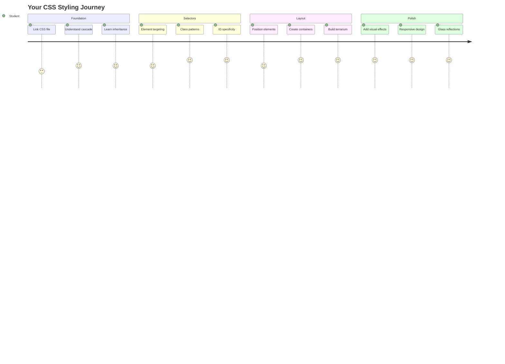
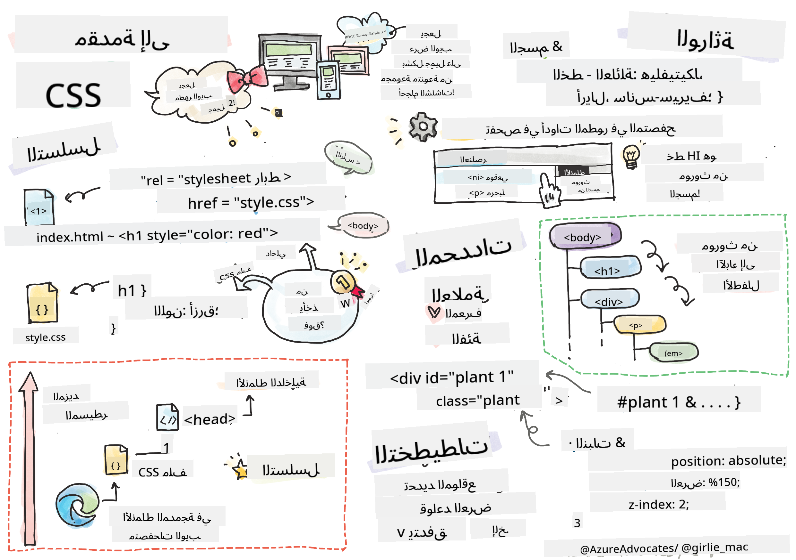
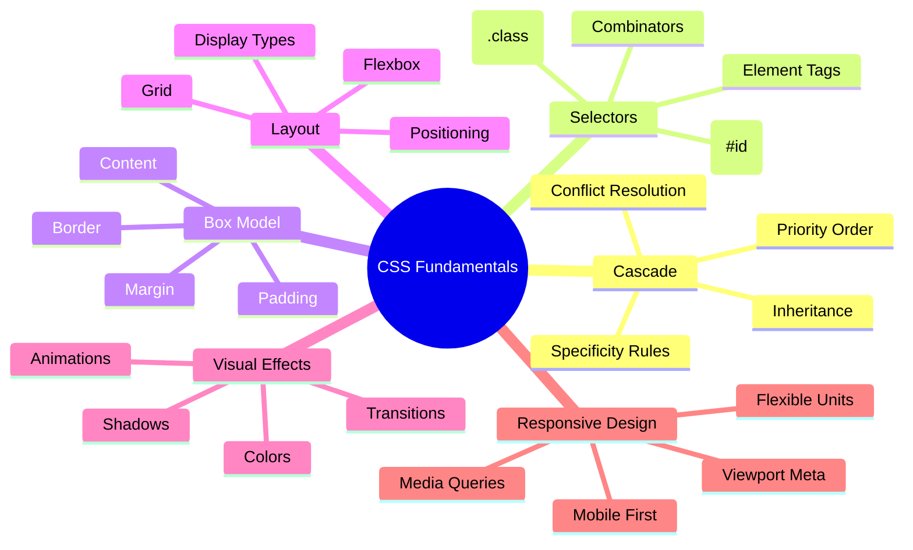
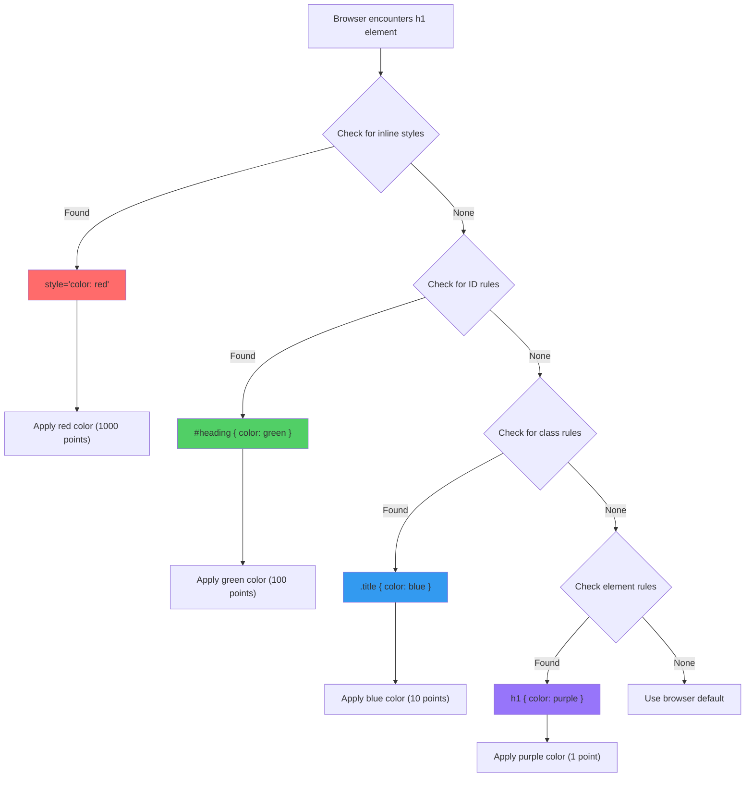
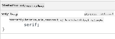
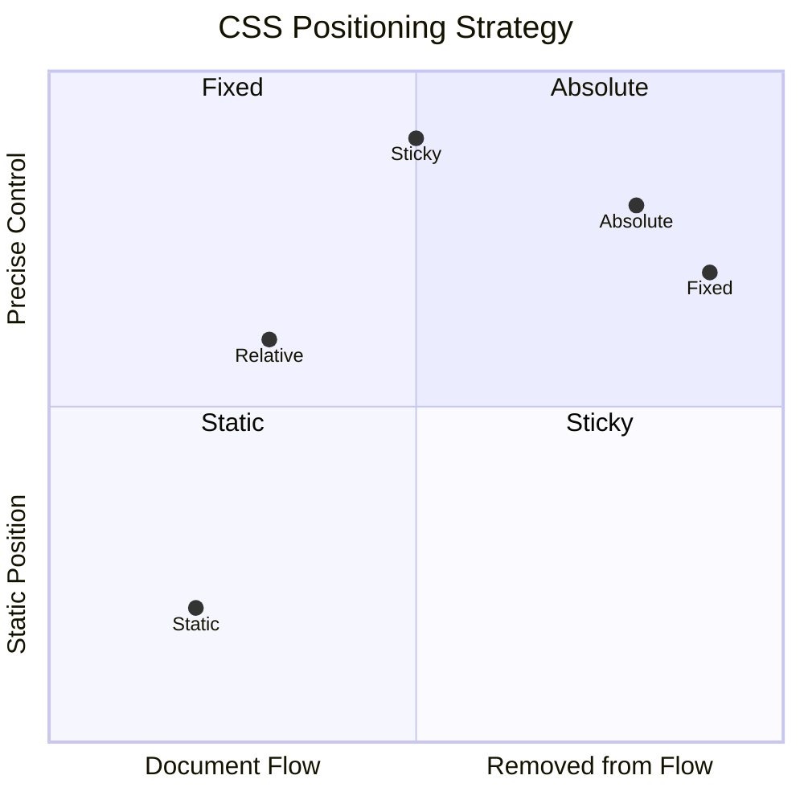
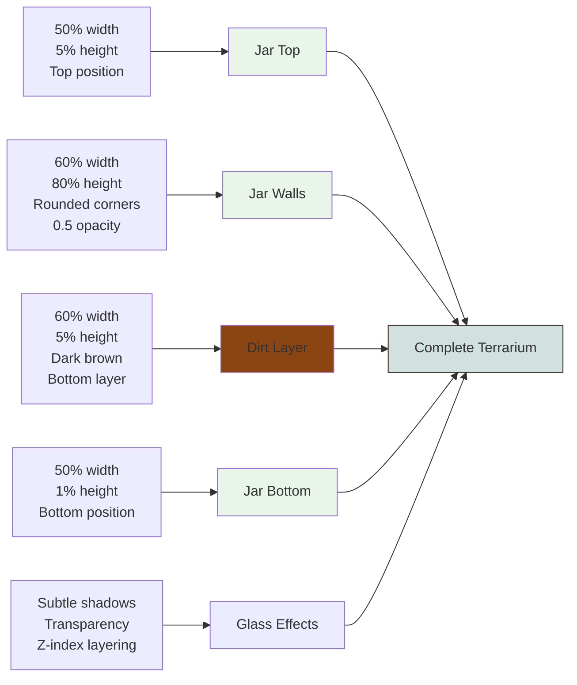
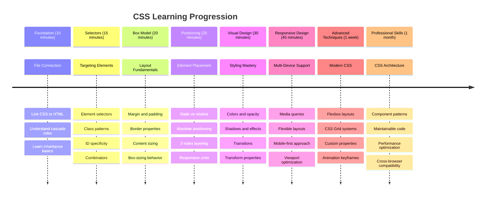

<!--
CO_OP_TRANSLATOR_METADATA:
{
  "original_hash": "e39f3a4e3bcccf94639e3af1248f8a4d",
  "translation_date": "2025-11-03T12:36:47+00:00",
  "source_file": "3-terrarium/2-intro-to-css/README.md",
  "language_code": "ar"
}
-->
# مشروع التيراريوم الجزء الثاني: مقدمة في CSS




> رسم توضيحي بواسطة [Tomomi Imura](https://twitter.com/girlie_mac)

هل تتذكر كيف كان شكل التيراريوم الخاص بك بسيطًا جدًا؟ CSS هو المكان الذي نحول فيه هذا الهيكل البسيط إلى شيء جذاب بصريًا.

إذا كان HTML يشبه بناء إطار المنزل، فإن CSS هو كل ما يجعل المنزل يبدو وكأنه منزل - ألوان الطلاء، ترتيب الأثاث، الإضاءة، وكيفية تدفق الغرف معًا. فكر في كيف بدأ قصر فرساي ككوخ صيد بسيط، ولكن الاهتمام الدقيق بالديكور والتصميم حوله إلى واحد من أعظم المباني في العالم.

اليوم، سنحول التيراريوم الخاص بك من عملي إلى مصقول. ستتعلم كيفية وضع العناصر بدقة، وإنشاء تخطيطات تستجيب لأحجام الشاشات المختلفة، وخلق الجاذبية البصرية التي تجعل المواقع الإلكترونية ممتعة.

بحلول نهاية هذا الدرس، سترى كيف يمكن للتنسيق الاستراتيجي باستخدام CSS أن يحسن مشروعك بشكل كبير. دعونا نضيف بعض الأناقة إلى التيراريوم الخاص بك.



## اختبار ما قبل المحاضرة

[اختبار ما قبل المحاضرة](https://ff-quizzes.netlify.app/web/quiz/17)

## البدء مع CSS

غالبًا ما يُعتقد أن CSS مجرد "جعل الأشياء جميلة"، لكنها تخدم غرضًا أوسع بكثير. CSS تشبه المخرج في فيلم - تتحكم ليس فقط في كيفية ظهور كل شيء، ولكن أيضًا في كيفية تحركه، استجابته للتفاعل، وتكيفه مع المواقف المختلفة.

CSS الحديثة قادرة بشكل ملحوظ. يمكنك كتابة كود يقوم بضبط التخطيطات تلقائيًا للهواتف، الأجهزة اللوحية، وأجهزة الكمبيوتر المكتبية. يمكنك إنشاء رسوم متحركة سلسة توجه انتباه المستخدمين حيثما كان ذلك ضروريًا. يمكن أن تكون النتائج مثيرة للإعجاب عندما تعمل كل هذه العناصر معًا.

> 💡 **نصيحة احترافية**: CSS تتطور باستمرار مع ميزات وقدرات جديدة. تحقق دائمًا من [CanIUse.com](https://caniuse.com) للتحقق من دعم المتصفح للميزات الجديدة في CSS قبل استخدامها في المشاريع الإنتاجية.

**ما سنحققه في هذا الدرس:**
- **إنشاء** تصميم بصري كامل للتيراريوم الخاص بك باستخدام تقنيات CSS الحديثة
- **استكشاف** مفاهيم أساسية مثل التسلسل، الوراثة، ومحددات CSS
- **تنفيذ** استراتيجيات وضع وتخطيط استجابة
- **بناء** حاوية التيراريوم باستخدام أشكال CSS والتنسيق

### المتطلبات الأساسية

يجب أن تكون قد أكملت هيكل HTML للتيراريوم الخاص بك من الدرس السابق وأن يكون جاهزًا للتنسيق.

> 📺 **مصدر فيديو**: تحقق من هذا الفيديو التوضيحي المفيد
>
> [](https://www.youtube.com/watch?v=6yIdOIV9p1I)

### إعداد ملف CSS الخاص بك

قبل أن نبدأ في التنسيق، نحتاج إلى ربط CSS بـ HTML. هذا الاتصال يخبر المتصفح بمكان العثور على تعليمات التنسيق للتيراريوم الخاص بنا.

في مجلد التيراريوم الخاص بك، قم بإنشاء ملف جديد يسمى `style.css`، ثم قم بربطه في قسم `<head>` من مستند HTML الخاص بك:

```html
<link rel="stylesheet" href="./style.css" />
```

**ما يفعله هذا الكود:**
- **إنشاء** اتصال بين ملفات HTML وCSS الخاصة بك
- **إخبار** المتصفح بتحميل وتطبيق التنسيقات من `style.css`
- **استخدام** السمة `rel="stylesheet"` لتحديد أن هذا ملف CSS
- **الإشارة** إلى مسار الملف باستخدام `href="./style.css"`

## فهم تسلسل CSS

هل تساءلت يومًا لماذا يُطلق على CSS اسم "أوراق الأنماط المتسلسلة"؟ الأنماط تتسلسل مثل الشلال، وأحيانًا تتعارض مع بعضها البعض.

فكر في كيفية عمل هياكل القيادة العسكرية - قد يقول أمر عام "يرتدي جميع الجنود اللون الأخضر"، ولكن قد يقول أمر محدد لوحدتك "ارتدِ الأزرق الرسمي للحفل". التعليمات الأكثر تحديدًا لها الأولوية. CSS تتبع منطقًا مشابهًا، وفهم هذا التسلسل يجعل تصحيح الأخطاء أكثر سهولة.

### تجربة أولوية التسلسل

دعونا نرى التسلسل في العمل من خلال إنشاء تعارض في الأنماط. أولاً، أضف نمطًا داخليًا إلى علامة `<h1>` الخاصة بك:

```html
<h1 style="color: red">My Terrarium</h1>
```

**ما يفعله هذا الكود:**
- **تطبيق** لون أحمر مباشرة على عنصر `<h1>` باستخدام التنسيق الداخلي
- **استخدام** السمة `style` لتضمين CSS مباشرة في HTML
- **إنشاء** قاعدة نمط ذات أولوية عالية لهذا العنصر المحدد

بعد ذلك، أضف هذه القاعدة إلى ملف `style.css` الخاص بك:

```css
h1 {
  color: blue;
}
```

**في ما سبق، قمنا بـ:**
- **تعريف** قاعدة CSS تستهدف جميع عناصر `<h1>`
- **تعيين** لون النص إلى الأزرق باستخدام ورقة أنماط خارجية
- **إنشاء** قاعدة ذات أولوية أقل مقارنة بالأنماط الداخلية

✅ **اختبار المعرفة**: ما اللون الذي يظهر في تطبيق الويب الخاص بك؟ لماذا يفوز هذا اللون؟ هل يمكنك التفكير في سيناريوهات قد ترغب فيها في تجاوز الأنماط؟



> 💡 **ترتيب أولوية CSS (من الأعلى إلى الأدنى):**
> 1. **الأنماط الداخلية** (سمة style)
> 2. **المعرفات** (#myId)
> 3. **الفئات** (.myClass) والسمات
> 4. **محددات العناصر** (h1, div, p)
> 5. **الإعدادات الافتراضية للمتصفح**

## وراثة CSS في العمل

وراثة CSS تعمل مثل الوراثة الجينية - العناصر ترث خصائص معينة من عناصرها الأم. إذا قمت بتعيين نوع الخط على عنصر body، فإن كل النصوص داخله تستخدم نفس الخط تلقائيًا. يشبه ذلك كيف ظهر فك عائلة هابسبورغ المميز عبر الأجيال دون تحديده لكل فرد.

ومع ذلك، ليس كل شيء يتم وراثته. أنماط النصوص مثل الخطوط والألوان يتم وراثتها، ولكن خصائص التخطيط مثل الهوامش والحدود لا يتم وراثتها. تمامًا مثلما قد يرث الأطفال السمات الجسدية ولكن ليس اختيارات الموضة لوالديهم.

### ملاحظة وراثة الخطوط

دعونا نرى الوراثة في العمل من خلال تعيين نوع الخط على عنصر `<body>`:

```css
body {
  font-family: 'Segoe UI', Tahoma, Geneva, Verdana, sans-serif;
}
```

**تفصيل ما يحدث هنا:**
- **تعيين** نوع الخط للصفحة بأكملها عن طريق استهداف عنصر `<body>`
- **استخدام** مجموعة خطوط مع خيارات احتياطية لتحسين توافق المتصفح
- **تطبيق** خطوط نظام حديثة تبدو رائعة عبر أنظمة تشغيل مختلفة
- **ضمان** أن جميع العناصر الفرعية ترث هذا الخط ما لم يتم تجاوزه بشكل محدد

افتح أدوات المطور في المتصفح (F12)، انتقل إلى علامة التبويب العناصر، وقم بفحص عنصر `<h1>` الخاص بك. سترى أنه يرث نوع الخط من body:



✅ **وقت التجربة**: حاول تعيين خصائص أخرى قابلة للوراثة على `<body>` مثل `color`، `line-height`، أو `text-align`. ماذا يحدث لعناوينك والعناصر الأخرى؟

> 📝 **الخصائص القابلة للوراثة تشمل**: `color`, `font-family`, `font-size`, `line-height`, `text-align`, `visibility`
>
> **الخصائص غير القابلة للوراثة تشمل**: `margin`, `padding`, `border`, `width`, `height`, `position`

### 🔄 **تقييم تربوي**
**فهم أساسيات CSS**: قبل الانتقال إلى المحددات، تأكد من أنك تستطيع:
- ✅ شرح الفرق بين التسلسل والوراثة
- ✅ التنبؤ بالنمط الذي سيفوز في تعارض التحديد
- ✅ تحديد الخصائص التي ترث من العناصر الأم
- ✅ ربط ملفات CSS بـ HTML بشكل صحيح

**اختبار سريع**: إذا كان لديك هذه الأنماط، ما اللون الذي سيكون عليه `<h1>` داخل `<div class="special">`؟
```css
div { color: blue; }
.special { color: green; }
h1 { color: red; }
```
*الإجابة: أحمر (محدد العنصر يستهدف h1 مباشرة)*

## إتقان محددات CSS

محددات CSS هي طريقتك لاستهداف عناصر محددة للتنسيق. تعمل مثل إعطاء توجيهات دقيقة - بدلاً من قول "المنزل"، قد تقول "المنزل الأزرق ذو الباب الأحمر في شارع مابل".

CSS توفر طرقًا مختلفة لتكون محددًا، واختيار المحدد الصحيح يشبه اختيار الأداة المناسبة للمهمة. أحيانًا تحتاج إلى تنسيق كل الأبواب في الحي، وأحيانًا تحتاج إلى باب واحد فقط.

### محددات العناصر (العلامات)

محددات العناصر تستهدف عناصر HTML حسب اسم العلامة. إنها مثالية لتعيين أنماط أساسية تنطبق بشكل واسع عبر صفحتك:

```css
body {
  font-family: 'Segoe UI', Tahoma, Geneva, Verdana, sans-serif;
  margin: 0;
  padding: 0;
}

h1 {
  color: #3a241d;
  text-align: center;
  font-size: 2.5rem;
  margin-bottom: 1rem;
}
```

**فهم هذه الأنماط:**
- **تعيين** طباعة متسقة عبر الصفحة بأكملها باستخدام محدد `body`
- **إزالة** الهوامش والتعبئة الافتراضية للمتصفح لتحكم أفضل
- **تنسيق** جميع عناصر العناوين بالألوان، المحاذاة، والتباعد
- **استخدام** وحدات `rem` لتحديد حجم الخط القابل للتوسع والوصول

بينما تعمل محددات العناصر بشكل جيد للتنسيق العام، ستحتاج إلى محددات أكثر تحديدًا لتنسيق المكونات الفردية مثل النباتات في التيراريوم الخاص بك.

### محددات المعرفات للعناصر الفريدة

محددات المعرفات تستخدم رمز `#` وتستهدف العناصر ذات سمات `id` المحددة. نظرًا لأن المعرفات يجب أن تكون فريدة في الصفحة، فهي مثالية لتنسيق العناصر الفردية والخاصة مثل حاويات النباتات الجانبية في التيراريوم الخاص بنا.

دعونا ننشئ التنسيق لحاويات الجوانب في التيراريوم حيث ستعيش النباتات:

```css
#left-container {
  background-color: #f5f5f5;
  width: 15%;
  left: 0;
  top: 0;
  position: absolute;
  height: 100vh;
  padding: 1rem;
  box-sizing: border-box;
}

#right-container {
  background-color: #f5f5f5;
  width: 15%;
  right: 0;
  top: 0;
  position: absolute;
  height: 100vh;
  padding: 1rem;
  box-sizing: border-box;
}
```

**ما يحققه هذا الكود:**
- **وضع** الحاويات على الحواف اليسرى واليمنى باستخدام وضع `absolute`
- **استخدام** وحدات `vh` (ارتفاع نافذة العرض) لتحديد ارتفاع استجابة يتكيف مع حجم الشاشة
- **تطبيق** `box-sizing: border-box` بحيث يتم تضمين التعبئة في العرض الإجمالي
- **إزالة** وحدات `px` غير الضرورية من القيم الصفرية للحصول على كود أنظف
- **تعيين** لون خلفية خفيف أسهل على العين من الرمادي القاسي

✅ **تحدي جودة الكود**: لاحظ كيف ينتهك هذا CSS مبدأ DRY (لا تكرر نفسك). هل يمكنك إعادة صياغته باستخدام كل من المعرف والفئة؟

**النهج المحسن:**
```html
<div id="left-container" class="container"></div>
<div id="right-container" class="container"></div>
```

```css
.container {
  background-color: #f5f5f5;
  width: 15%;
  top: 0;
  position: absolute;
  height: 100vh;
  padding: 1rem;
  box-sizing: border-box;
}

#left-container {
  left: 0;
}

#right-container {
  right: 0;
}
```

### محددات الفئات لأنماط قابلة لإعادة الاستخدام

محددات الفئات تستخدم الرمز `.` وهي مثالية عندما تريد تطبيق نفس الأنماط على عناصر متعددة. على عكس المعرفات، يمكن إعادة استخدام الفئات في جميع أنحاء HTML الخاص بك، مما يجعلها مثالية لأنماط التنسيق المتسقة.

في التيراريوم الخاص بنا، تحتاج كل نبتة إلى تنسيق مشابه ولكن أيضًا تحتاج إلى وضع فردي. سنستخدم مزيجًا من الفئات لأنماط مشتركة والمعرفات لوضع فردي.

**إليك هيكل HTML لكل نبتة:**
```html
<div class="plant-holder">
  
</div>
```

**العناصر الرئيسية المفسرة:**
- **استخدام** `class="plant-holder"` لتنسيق الحاوية بشكل متسق عبر جميع النباتات
- **تطبيق** `class="plant"` لتنسيق الصورة المشتركة والسلوك
- **تضمين** `id="plant1"` الفريد لوضع فردي وتفاعل JavaScript
- **توفير** نص بديل وصفي لإمكانية الوصول لقراء الشاشة

الآن أضف هذه الأنماط إلى ملف `style.css` الخاص بك:

```css
.plant-holder {
  position: relative;
  height: 13%;
  left: -0.6rem;
}

.plant {
  position: absolute;
  max-width: 150%;
  max-height: 150%;
  z-index: 2;
  transition: transform 0.3s ease;
}

.plant:hover {
  transform: scale(1.05);
}
```

**تفصيل هذه الأنماط:**
- **إنشاء** وضع نسبي لحامل النبات لتأسيس سياق الوضع
- **تعيين** كل حامل نبات إلى ارتفاع 13%، مما يضمن أن جميع النباتات تتناسب عموديًا دون التمرير
- **تحريك** الحوامل قليلاً إلى اليسار لتوسيط النباتات بشكل أفضل داخل حاوياتها
- **السماح** للنباتات بالتوسع بشكل استجابة باستخدام خصائص `max-width` و`max-height`
- **استخدام** `z-index` لتكديس النباتات فوق العناصر الأخرى في التيراريوم
- **إضافة** تأثير تحويم خفيف مع انتقالات CSS لتحسين التفاعل مع المستخدم

✅ **التفكير النقدي**: لماذا نحتاج إلى كل من `.plant-holder` و`.plant`؟ ماذا سيحدث إذا حاولنا استخدام واحد فقط؟

> 💡 **نمط التصميم**: الحاوية (`.plant-holder`) تتحكم في التخطيط والوضع، بينما المحتوى (`.plant`) يتحكم في المظهر والتوسع. هذا الفصل يجعل الكود أكثر قابلية للصيانة والمرونة.

## فهم وضع CSS

وضع CSS يشبه أن تكون مخرج المسرح - توجه مكان وقوف كل ممثل وكيف يتحركون على المسرح. بعض الممثلين يتبعون التشكيل القياسي، بينما يحتاج الآخرون إلى وضع محدد لتأثير درامي.

بمجرد فهم الوضع، تصبح العديد من تحديات التخطيط قابلة للإدارة. هل تحتاج إلى شريط تنقل يبقى في الأعلى أثناء التمرير؟ الوضع يتعامل مع ذلك. هل تريد نافذة منبثقة تظهر في موقع معين؟ هذا أيضًا من خلال الوضع.

### القيم الخمس للوضع



| قيمة الوضع | السلوك | حالة الاستخدام |
|------------|--------|----------------|
| `static` | التدفق الافتراضي، يتجاهل القيم العلوية/اليسرى/اليمنى/السفلية | تخطيط المستند العادي |
| `relative` | يتم وضعه بالنسبة إلى موضعه الطبيعي | تعديلات صغيرة، إنشاء سياق الوضع |
| `absolute` | يتم وضعه بالنسبة إلى أقرب عنصر ذو وضع محدد | وضع دقيق، تراكبات |
| `fixed` | يتم وضعه بالنسبة إلى نافذة العرض | أشرطة التنقل، العناصر العائمة |
| `sticky` | يتحول بين الوضع النسبي والثابت بناءً على التمرير | رؤوس تلتصق أثناء التمرير |

### الوضع في التيراريوم الخاص بنا

يستخدم التيراريوم الخاص بنا مزيجًا استراتيجيًا من أنواع الوضع لإنشاء التخطيط المطلوب:

```css
/* Container positioning */
.container {
  position: absolute; /* Removes from normal flow */
  /* ... other styles ... */
}

/* Plant holder positioning */
.plant-holder {
  position: relative; /* Creates positioning context */
  /* ... other styles ... */
}

/* Plant positioning */
.plant {
  position: absolute; /* Allows precise placement within holder */
  /* ... other styles ... */
}
```

**فهم استراتيجية الوضع:**
- **الحاويات المطلقة** يتم إزالتها من تدفق المستند العادي وتثبيتها على حواف الشاشة
- **حاملات النباتات النسبية** تنشئ سياق وضع بينما تبقى في تدفق المستند
- **النباتات المطلقة** يمكن وضعها بدقة داخل حاوياتها النسبية
- **هذا المزيج** يسمح للنباتات بالتكدس عموديًا بينما تكون قابلة للوضع الفردي

> 🎯 **لماذا هذا مهم**: عناصر `plant` تحتاج إلى وضع مطلق لتصبح قابلة للسحب في الدرس التالي. الوضع المطلق يزيلها من تدفق التخطيط العادي، مما يجعل تفاعلات السحب والإفلات ممكنة.

✅ **وقت التجربة**: حاول تغيير قيم الوضع ولاحظ النتائج:
- ماذا يحدث إذا قمت بتغيير `.container` من `absolute` إلى `relative`؟
- كيف يتغير التخطيط إذا استخدمت `.plant-holder` خاصية `absolute` بدلاً من `relative`؟
- ماذا يحدث عند تغيير وضعية `.plant` إلى `relative`؟

### 🔄 **مراجعة تعليمية**
**إتقان تحديد المواقع باستخدام CSS**: توقف للتحقق من فهمك:
- ✅ هل يمكنك شرح سبب حاجة النباتات إلى وضعية مطلقة للسحب والإفلات؟
- ✅ هل تفهم كيف تخلق الحاويات النسبية سياقًا لتحديد المواقع؟
- ✅ لماذا تستخدم الحاويات الجانبية وضعية مطلقة؟
- ✅ ماذا سيحدث إذا أزلت التصريحات الخاصة بالوضعية تمامًا؟

**صلة بالعالم الحقيقي**: فكر في كيفية تشابه تحديد المواقع باستخدام CSS مع التخطيط في العالم الحقيقي:
- **Static**: الكتب على رف (ترتيب طبيعي)
- **Relative**: تحريك كتاب قليلاً مع بقائه في مكانه
- **Absolute**: وضع إشارة مرجعية على صفحة معينة
- **Fixed**: ملاحظة لاصقة تبقى مرئية أثناء تقليب الصفحات

## بناء التيراريوم باستخدام CSS

الآن سنقوم ببناء جرة زجاجية باستخدام CSS فقط - دون الحاجة إلى صور أو برامج تصميم.

إن إنشاء زجاج واقعي المظهر، الظلال، وتأثيرات العمق باستخدام تحديد المواقع والشفافية يظهر قدرات CSS البصرية. هذه التقنية تشبه كيف استخدم المعماريون في حركة باوهاوس أشكالًا هندسية بسيطة لإنشاء هياكل معقدة وجميلة. بمجرد فهم هذه المبادئ، ستتعرف على تقنيات CSS وراء العديد من تصميمات الويب.



### إنشاء مكونات الجرة الزجاجية

لنقم ببناء جرة التيراريوم قطعةً قطعة. كل جزء يستخدم تحديد المواقع المطلق وأبعادًا تعتمد على النسب المئوية لتصميم متجاوب:

```css
.jar-walls {
  height: 80%;
  width: 60%;
  background: #d1e1df;
  border-radius: 1rem;
  position: absolute;
  bottom: 0.5%;
  left: 20%;
  opacity: 0.5;
  z-index: 1;
  box-shadow: inset 0 0 2rem rgba(0, 0, 0, 0.1);
}

.jar-top {
  width: 50%;
  height: 5%;
  background: #d1e1df;
  position: absolute;
  bottom: 80.5%;
  left: 25%;
  opacity: 0.7;
  z-index: 1;
  border-radius: 0.5rem 0.5rem 0 0;
}

.jar-bottom {
  width: 50%;
  height: 1%;
  background: #d1e1df;
  position: absolute;
  bottom: 0;
  left: 25%;
  opacity: 0.7;
  border-radius: 0 0 0.5rem 0.5rem;
}

.dirt {
  width: 60%;
  height: 5%;
  background: #3a241d;
  position: absolute;
  border-radius: 0 0 1rem 1rem;
  bottom: 1%;
  left: 20%;
  opacity: 0.7;
  z-index: -1;
}
```

**فهم بناء التيراريوم:**
- **يستخدم** أبعادًا تعتمد على النسب المئوية لتناسب جميع أحجام الشاشات
- **يحدد** العناصر بشكل مطلق لتكديسها ومحاذاتها بدقة
- **يطبق** قيم شفافية مختلفة لإنشاء تأثير شفافية الزجاج
- **ينفذ** طبقات `z-index` بحيث تظهر النباتات داخل الجرة
- **يضيف** ظلالًا خفيفة وزوايا دائرية محسنة لمظهر أكثر واقعية

### التصميم المتجاوب باستخدام النسب المئوية

لاحظ كيف تستخدم جميع الأبعاد النسب المئوية بدلاً من القيم الثابتة بالبكسل:

**لماذا هذا مهم:**
- **يضمن** أن التيراريوم يتناسب بشكل متناسب مع أي حجم شاشة
- **يحافظ** على العلاقات البصرية بين مكونات الجرة
- **يوفر** تجربة متسقة من الهواتف المحمولة إلى شاشات الكمبيوتر الكبيرة
- **يسمح** للتصميم بالتكيف دون كسر التخطيط البصري

### وحدات CSS قيد التنفيذ

نستخدم وحدات `rem` للزوايا الدائرية، والتي تتناسب مع حجم الخط الأساسي. هذا يخلق تصميمات أكثر سهولة تحترم تفضيلات المستخدم للخطوط. تعرف على المزيد حول [وحدات CSS النسبية](https://www.w3.org/TR/css-values-3/#font-relative-lengths) في المواصفات الرسمية.

✅ **تجربة بصرية**: حاول تعديل هذه القيم وراقب التأثيرات:
- قم بتغيير شفافية الجرة من 0.5 إلى 0.8 – كيف يؤثر ذلك على مظهر الزجاج؟
- عدّل لون التراب من `#3a241d` إلى `#8B4513` – ما التأثير البصري لهذا؟
- غيّر `z-index` للتراب إلى 2 – ماذا يحدث للطبقات؟

### 🔄 **مراجعة تعليمية**
**فهم التصميم البصري باستخدام CSS**: تأكد من استيعابك لتصميم CSS البصري:
- ✅ كيف تخلق الأبعاد القائمة على النسب المئوية تصميمًا متجاوبًا؟
- ✅ لماذا تخلق الشفافية تأثير شفافية الزجاج؟
- ✅ ما دور `z-index` في ترتيب الطبقات؟
- ✅ كيف تساهم قيم الزوايا الدائرية في تشكيل الجرة؟

**مبدأ التصميم**: لاحظ كيف نبني تصاميم معقدة من أشكال بسيطة:
1. **مستطيلات** → **مستطيلات دائرية** → **مكونات الجرة**
2. **ألوان مسطحة** → **شفافية** → **تأثير الزجاج**
3. **عناصر فردية** → **تركيب طبقي** → **مظهر ثلاثي الأبعاد**

---

## تحدي وكيل GitHub Copilot 🚀

استخدم وضع الوكيل لإكمال التحدي التالي:

**الوصف:** قم بإنشاء حركة CSS تجعل نباتات التيراريوم تتأرجح بلطف ذهابًا وإيابًا، مما يحاكي تأثير النسيم الطبيعي. سيساعدك هذا على ممارسة الحركات باستخدام CSS، التحويلات، والإطارات الرئيسية مع تحسين الجاذبية البصرية للتيراريوم.

**المهمة:** أضف حركات CSS باستخدام الإطارات الرئيسية لجعل النباتات في التيراريوم تتأرجح بلطف من جانب إلى آخر. قم بإنشاء حركة تأرجح تدور كل نبات قليلاً (2-3 درجات) يمينًا ويسارًا لمدة 3-4 ثوانٍ، وطبقها على فئة `.plant`. تأكد من أن الحركة تتكرر بلا نهاية وتحتوي على وظيفة تخفيف للحركة الطبيعية.

تعرف على المزيد حول [وضع الوكيل](https://code.visualstudio.com/blogs/2025/02/24/introducing-copilot-agent-mode) هنا.

## 🚀 تحدي: إضافة انعكاسات الزجاج

هل أنت مستعد لتعزيز التيراريوم بإضافة انعكاسات زجاجية واقعية؟ ستضيف هذه التقنية عمقًا وواقعية للتصميم.

ستقوم بإنشاء لمسات خفيفة تحاكي كيفية انعكاس الضوء على الأسطح الزجاجية. هذه الطريقة مشابهة لكيفية استخدام رسامي عصر النهضة مثل جان فان إيك الضوء والانعكاس لجعل الزجاج المرسوم يبدو ثلاثي الأبعاد. إليك ما تهدف إليه:


**تحديك:**
- **قم بإنشاء** أشكال بيضاوية بيضاء أو فاتحة اللون للانعكاسات الزجاجية
- **ضعها** بشكل استراتيجي على الجانب الأيسر من الجرة
- **طبق** تأثيرات شفافية وضبابية مناسبة لانعكاس الضوء الواقعي
- **استخدم** `border-radius` لإنشاء أشكال عضوية تشبه الفقاعات
- **جرب** التدرجات أو الظلال لتحسين الواقعية

## اختبار ما بعد المحاضرة

[اختبار ما بعد المحاضرة](https://ff-quizzes.netlify.app/web/quiz/18)

## توسع في معرفتك بـ CSS

قد يبدو CSS معقدًا في البداية، لكن فهم هذه المفاهيم الأساسية يوفر أساسًا قويًا لتقنيات أكثر تقدمًا.

**مجالات التعلم التالية في CSS:**
- **Flexbox** - يبسط محاذاة وتوزيع العناصر
- **CSS Grid** - يوفر أدوات قوية لإنشاء تخطيطات معقدة
- **CSS Variables** - يقلل التكرار ويحسن قابلية الصيانة
- **التصميم المتجاوب** - يضمن عمل المواقع بشكل جيد عبر أحجام الشاشات المختلفة

### موارد تعليمية تفاعلية

مارس هذه المفاهيم مع هذه الألعاب الممتعة والتفاعلية:
- 🐸 [Flexbox Froggy](https://flexboxfroggy.com/) - أتقن Flexbox من خلال تحديات ممتعة
- 🌱 [Grid Garden](https://codepip.com/games/grid-garden/) - تعلم CSS Grid عن طريق زراعة الجزر الافتراضي
- 🎯 [CSS Battle](https://cssbattle.dev/) - اختبر مهاراتك في CSS مع تحديات البرمجة

### تعلم إضافي

للحصول على أساسيات CSS شاملة، أكمل هذا الوحدة التعليمية من Microsoft Learn: [قم بتنسيق تطبيق HTML الخاص بك باستخدام CSS](https://docs.microsoft.com/learn/modules/build-simple-website/4-css-basics/?WT.mc_id=academic-77807-sagibbon)

### ⚡ **ما يمكنك فعله في الدقائق الخمس القادمة**
- [ ] افتح أدوات المطور وافحص أنماط CSS على أي موقع باستخدام لوحة العناصر
- [ ] أنشئ ملف CSS بسيط واربطه بصفحة HTML
- [ ] حاول تغيير الألوان باستخدام طرق مختلفة: hex، RGB، وأسماء الألوان
- [ ] مارس نموذج الصندوق بإضافة الحشو والهامش إلى div

### 🎯 **ما يمكنك إنجازه خلال الساعة**
- [ ] أكمل اختبار ما بعد الدرس وراجع أساسيات CSS
- [ ] قم بتنسيق صفحة HTML الخاصة بك باستخدام الخطوط، الألوان، والمسافات
- [ ] أنشئ تخطيطًا بسيطًا باستخدام flexbox أو grid
- [ ] جرب انتقالات CSS للحصول على تأثيرات سلسة
- [ ] مارس التصميم المتجاوب باستخدام استعلامات الوسائط

### 📅 **مغامرتك الأسبوعية مع CSS**
- [ ] أكمل مهمة تصميم التيراريوم بإبداع
- [ ] أتقن CSS Grid من خلال إنشاء تخطيط معرض صور
- [ ] تعلم حركات CSS لإضفاء الحياة على تصميماتك
- [ ] استكشف معالجات CSS مثل Sass أو Less
- [ ] ادرس مبادئ التصميم وطبقها على CSS الخاص بك
- [ ] قم بتحليل وإعادة إنشاء تصميمات مثيرة للاهتمام تجدها عبر الإنترنت

### 🌟 **إتقان التصميم خلال شهر**
- [ ] قم ببناء نظام تصميم موقع ويب كامل متجاوب
- [ ] تعلم CSS-in-JS أو أطر العمل مثل Tailwind
- [ ] ساهم في مشاريع مفتوحة المصدر بتحسينات CSS
- [ ] أتقن مفاهيم CSS المتقدمة مثل الخصائص المخصصة والاحتواء
- [ ] أنشئ مكتبات مكونات قابلة لإعادة الاستخدام باستخدام CSS المعياري
- [ ] قم بتوجيه الآخرين الذين يتعلمون CSS وشارك معرفتك في التصميم

## 🎯 جدول زمني لإتقان CSS



### 🛠️ ملخص أدوات CSS الخاصة بك

بعد إكمال هذا الدرس، لديك الآن:
- **فهم التدرج**: كيف ترث الأنماط وتتجاوز بعضها البعض
- **إتقان التحديد**: استهداف دقيق باستخدام العناصر، الفئات، والمعرفات
- **مهارات تحديد المواقع**: وضع العناصر بشكل استراتيجي وترتيبها
- **تصميم بصري**: إنشاء تأثيرات الزجاج، الظلال، والشفافية
- **تقنيات متجاوبة**: تخطيطات تعتمد على النسب المئوية تتكيف مع أي شاشة
- **تنظيم الكود**: هيكل CSS نظيف وقابل للصيانة
- **ممارسات حديثة**: استخدام الوحدات النسبية وأنماط التصميم السهلة الوصول

**الخطوات التالية**: أصبح التيراريوم الخاص بك الآن يحتوي على الهيكل (HTML) والأسلوب (CSS). الدرس الأخير سيضيف التفاعل باستخدام JavaScript!

## المهمة

[إعادة هيكلة CSS](assignment.md)

---

**إخلاء المسؤولية**:  
تم ترجمة هذا المستند باستخدام خدمة الترجمة بالذكاء الاصطناعي [Co-op Translator](https://github.com/Azure/co-op-translator). بينما نسعى لتحقيق الدقة، يرجى العلم أن الترجمات الآلية قد تحتوي على أخطاء أو عدم دقة. يجب اعتبار المستند الأصلي بلغته الأصلية المصدر الموثوق. للحصول على معلومات حاسمة، يُوصى بالترجمة البشرية الاحترافية. نحن غير مسؤولين عن أي سوء فهم أو تفسيرات خاطئة ناتجة عن استخدام هذه الترجمة.