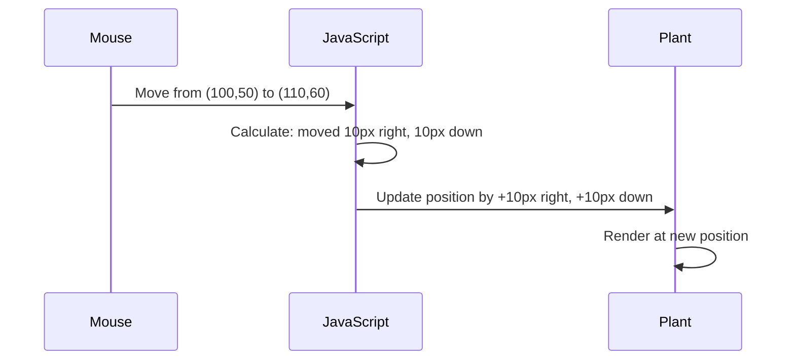

<!--
CO_OP_TRANSLATOR_METADATA:
{
  "original_hash": "bc93f6285423033ebf5b8abeb5282888",
  "translation_date": "2025-10-22T14:15:39+00:00",
  "source_file": "3-terrarium/3-intro-to-DOM-and-closures/README.md",
  "language_code": "ar"
}
-->
# مشروع التيراريوم الجزء الثالث: التلاعب بـ DOM والإغلاق في JavaScript


> رسم توضيحي بواسطة [Tomomi Imura](https://twitter.com/girlie_mac)

مرحبًا بك في أحد أكثر جوانب تطوير الويب إثارة - جعل الأشياء تفاعلية! نموذج كائن المستند (DOM) هو بمثابة جسر بين HTML وJavaScript، واليوم سنستخدمه لإحياء التيراريوم الخاص بك. عندما أنشأ Tim Berners-Lee أول متصفح ويب، كان يتصور شبكة يمكن أن تكون ديناميكية وتفاعلية - وDOM يجعل هذا التصور ممكنًا.

سنستكشف أيضًا الإغلاق في JavaScript، والذي قد يبدو مخيفًا في البداية. فكر في الإغلاق كإنشاء "جيوب ذاكرة" حيث يمكن لوظائفك تذكر معلومات مهمة. إنه مثل كل نبات في التيراريوم الخاص بك لديه سجل بيانات خاص به لتتبع موقعه. بنهاية هذا الدرس، ستفهم مدى طبيعتها وفائدتها.

إليك ما سنبنيه: تيراريوم يمكن للمستخدمين فيه سحب وإفلات النباتات في أي مكان يريدونه. ستتعلم تقنيات التلاعب بـ DOM التي تدعم كل شيء بدءًا من تحميل الملفات بالسحب والإفلات إلى الألعاب التفاعلية. دعنا نجعل التيراريوم الخاص بك ينبض بالحياة.

## اختبار ما قبل المحاضرة

[اختبار ما قبل المحاضرة](https://ff-quizzes.netlify.app/web/quiz/19)

## فهم DOM: بوابتك إلى صفحات ويب تفاعلية

نموذج كائن المستند (DOM) هو الطريقة التي يتواصل بها JavaScript مع عناصر HTML الخاصة بك. عندما يقوم متصفحك بتحميل صفحة HTML، فإنه ينشئ تمثيلًا منظمًا لتلك الصفحة في الذاكرة - هذا هو DOM. فكر فيه كشجرة عائلية حيث كل عنصر HTML هو عضو في العائلة يمكن لـ JavaScript الوصول إليه أو تعديله أو إعادة ترتيبه.

التلاعب بـ DOM يحول الصفحات الثابتة إلى مواقع ويب تفاعلية. في كل مرة ترى فيها زرًا يغير لونه عند التمرير، أو تحديث المحتوى دون إعادة تحميل الصفحة، أو عناصر يمكنك سحبها، فهذا هو عمل DOM.


> تمثيل لـ DOM وعلامات HTML التي تشير إليه. من [Olfa Nasraoui](https://www.researchgate.net/publication/221417012_Profile-Based_Focused_Crawler_for_Social_Media-Sharing_Websites)

**ما الذي يجعل DOM قويًا:**
- **يوفر** طريقة منظمة للوصول إلى أي عنصر في صفحتك
- **يمكن** من تحديث المحتوى الديناميكي دون إعادة تحميل الصفحة
- **يسمح** بالاستجابة الفورية لتفاعلات المستخدم مثل النقرات والسحب
- **يخلق** الأساس لتطبيقات الويب التفاعلية الحديثة

## الإغلاق في JavaScript: إنشاء كود منظم وقوي

الإغلاق في [JavaScript](https://developer.mozilla.org/docs/Web/JavaScript/Closures) يشبه إعطاء وظيفة مساحة عمل خاصة بها مع ذاكرة مستمرة. فكر في كيفية تطوير طيور داروين في جزر غالاباغوس مناقير متخصصة بناءً على بيئتها المحددة - يعمل الإغلاق بطريقة مشابهة، حيث ينشئ وظائف متخصصة "تتذكر" سياقها المحدد حتى بعد انتهاء وظيفة الوالد.

في التيراريوم الخاص بنا، يساعد الإغلاق كل نبات على تذكر موقعه الخاص بشكل مستقل. يظهر هذا النمط في جميع أنحاء تطوير JavaScript الاحترافي، مما يجعله مفهومًا قيمًا لفهمه.

> 💡 **فهم الإغلاق**: الإغلاق موضوع مهم في JavaScript، ويستخدمه العديد من المطورين لسنوات قبل أن يفهموا جميع الجوانب النظرية بالكامل. اليوم، نركز على التطبيق العملي - سترى الإغلاق يظهر بشكل طبيعي أثناء بناء ميزاتنا التفاعلية. الفهم سيتطور عندما ترى كيف يحل المشاكل الحقيقية.


> تمثيل لـ DOM وعلامات HTML التي تشير إليه. من [Olfa Nasraoui](https://www.researchgate.net/publication/221417012_Profile-Based_Focused_Crawler_for_Social_Media-Sharing_Websites)

في هذا الدرس، سنكمل مشروع التيراريوم التفاعلي الخاص بنا عن طريق إنشاء JavaScript الذي سيسمح للمستخدم بالتلاعب بالنباتات على الصفحة.

## قبل أن نبدأ: الإعداد للنجاح

ستحتاج إلى ملفات HTML وCSS الخاصة بك من دروس التيراريوم السابقة - نحن على وشك جعل هذا التصميم الثابت تفاعليًا. إذا كنت تنضم لأول مرة، فإن إكمال تلك الدروس أولاً سيوفر سياقًا مهمًا.

إليك ما سنبنيه:
- **سحب وإفلات سلس** لجميع نباتات التيراريوم
- **تتبع الإحداثيات** حتى تتذكر النباتات مواقعها
- **واجهة تفاعلية كاملة** باستخدام JavaScript العادي
- **كود نظيف ومنظم** باستخدام أنماط الإغلاق

## إعداد ملف JavaScript الخاص بك

لنقم بإنشاء ملف JavaScript الذي سيجعل التيراريوم الخاص بك تفاعليًا.

**الخطوة 1: إنشاء ملف السكربت الخاص بك**

في مجلد التيراريوم الخاص بك، قم بإنشاء ملف جديد يسمى `script.js`.

**الخطوة 2: ربط JavaScript بـ HTML الخاص بك**

أضف علامة السكربت هذه إلى قسم `<head>` في ملف `index.html` الخاص بك:

```html
<script src="./script.js" defer></script>
```

**لماذا تعتبر خاصية `defer` مهمة:**
- **تضمن** أن JavaScript ينتظر حتى يتم تحميل كل HTML
- **تمنع** الأخطاء حيث يحاول JavaScript البحث عن عناصر غير جاهزة بعد
- **تضمن** أن جميع عناصر النبات الخاصة بك متاحة للتفاعل
- **توفر** أداءً أفضل من وضع السكربتات في أسفل الصفحة

> ⚠️ **ملاحظة مهمة**: خاصية `defer` تمنع مشاكل التوقيت الشائعة. بدونها، قد يحاول JavaScript الوصول إلى عناصر HTML قبل تحميلها، مما يسبب أخطاء.

---

## ربط JavaScript بعناصر HTML الخاصة بك

قبل أن نتمكن من جعل العناصر قابلة للسحب، يحتاج JavaScript إلى تحديد موقعها في DOM. فكر في هذا كنظام فهرسة مكتبة - بمجرد أن تحصل على رقم الفهرس، يمكنك العثور على الكتاب الذي تحتاجه والوصول إلى جميع محتوياته.

سنستخدم طريقة `document.getElementById()` لإجراء هذه الاتصالات. إنها مثل وجود نظام تصنيف دقيق - تقدم معرفًا، ويحدد بالضبط العنصر الذي تحتاجه في HTML الخاص بك.

### تمكين وظيفة السحب لجميع النباتات

أضف هذا الكود إلى ملف `script.js` الخاص بك:

```javascript
// Enable drag functionality for all 14 plants
dragElement(document.getElementById('plant1'));
dragElement(document.getElementById('plant2'));
dragElement(document.getElementById('plant3'));
dragElement(document.getElementById('plant4'));
dragElement(document.getElementById('plant5'));
dragElement(document.getElementById('plant6'));
dragElement(document.getElementById('plant7'));
dragElement(document.getElementById('plant8'));
dragElement(document.getElementById('plant9'));
dragElement(document.getElementById('plant10'));
dragElement(document.getElementById('plant11'));
dragElement(document.getElementById('plant12'));
dragElement(document.getElementById('plant13'));
dragElement(document.getElementById('plant14'));
```

**ما الذي يحققه هذا الكود:**
- **يحدد** كل عنصر نبات في DOM باستخدام معرفه الفريد
- **يسترجع** مرجع JavaScript لكل عنصر HTML
- **يمرر** كل عنصر إلى وظيفة `dragElement` (التي سننشئها لاحقًا)
- **يجهز** كل نبات للتفاعل بالسحب والإفلات
- **يربط** هيكل HTML الخاص بك بوظائف JavaScript

> 🎯 **لماذا نستخدم المعرفات بدلاً من الفئات؟** توفر المعرفات معرفات فريدة لعناصر محددة، بينما تم تصميم الفئات CSS لتنسيق مجموعات من العناصر. عندما يحتاج JavaScript إلى التلاعب بعناصر فردية، توفر المعرفات الدقة والأداء الذي نحتاجه.

> 💡 **نصيحة احترافية**: لاحظ كيف نقوم باستدعاء `dragElement()` لكل نبات بشكل فردي. يضمن هذا النهج أن يحصل كل نبات على سلوك سحب مستقل، وهو أمر ضروري لتفاعل المستخدم السلس.

---

## بناء إغلاق وظيفة السحب

الآن سننشئ قلب وظيفة السحب: إغلاق يدير سلوك السحب لكل نبات. يحتوي هذا الإغلاق على وظائف داخلية متعددة تعمل معًا لتتبع حركات الماوس وتحديث مواقع العناصر.

الإغلاق مثالي لهذه المهمة لأنه يسمح لنا بإنشاء متغيرات "خاصة" تستمر بين استدعاءات الوظائف، مما يمنح كل نبات نظام تتبع إحداثيات مستقل.

### فهم الإغلاق من خلال مثال بسيط

دعني أوضح الإغلاق بمثال بسيط يوضح المفهوم:

```javascript
function createCounter() {
    let count = 0; // This is like a private variable
    
    function increment() {
        count++; // The inner function remembers the outer variable
        return count;
    }
    
    return increment; // We're giving back the inner function
}

const myCounter = createCounter();
console.log(myCounter()); // 1
console.log(myCounter()); // 2
```

**ما الذي يحدث في هذا النمط من الإغلاق:**
- **ينشئ** متغير `count` خاصًا موجودًا فقط داخل هذا الإغلاق
- **يمكن للوظيفة الداخلية** الوصول إلى هذا المتغير الخارجي وتعديله (آلية الإغلاق)
- **عندما نعيد** الوظيفة الداخلية، فإنها تحافظ على اتصالها بالبيانات الخاصة
- **حتى بعد** انتهاء `createCounter()`، يستمر `count` ويتذكر قيمته

### لماذا الإغلاق مثالي لوظيفة السحب

بالنسبة للتيراريوم الخاص بنا، يحتاج كل نبات إلى تذكر إحداثيات موقعه الحالي. يوفر الإغلاق الحل المثالي:

**الفوائد الرئيسية لمشروعنا:**
- **يحافظ** على متغيرات الموقع الخاصة لكل نبات بشكل مستقل
- **يحفظ** بيانات الإحداثيات بين أحداث السحب
- **يمنع** تعارض المتغيرات بين العناصر القابلة للسحب المختلفة
- **يخلق** هيكل كود نظيف ومنظم

> 🎯 **هدف التعلم**: لا تحتاج إلى إتقان كل جانب من جوانب الإغلاق الآن. ركز على رؤية كيف تساعدنا في تنظيم الكود والحفاظ على الحالة لوظيفة السحب.

### إنشاء وظيفة dragElement

الآن دعونا نبني الوظيفة الرئيسية التي ستتعامل مع كل منطق السحب. أضف هذه الوظيفة أسفل تعريفات عناصر النبات:

```javascript
function dragElement(terrariumElement) {
    // Initialize position tracking variables
    let pos1 = 0,  // Previous mouse X position
        pos2 = 0,  // Previous mouse Y position  
        pos3 = 0,  // Current mouse X position
        pos4 = 0;  // Current mouse Y position
    
    // Set up the initial drag event listener
    terrariumElement.onpointerdown = pointerDrag;
}
```

**فهم نظام تتبع المواقع:**
- **`pos1` و `pos2`**: تخزن الفرق بين مواقع الماوس القديمة والجديدة
- **`pos3` و `pos4`**: تتبع إحداثيات الما
- **`pos3` و `pos4`**: تخزين موقع الماوس الحالي للحساب التالي  
- **`offsetTop` و `offsetLeft`**: الحصول على الموقع الحالي للعنصر على الصفحة  
- **منطق الطرح**: يحرك العنصر بنفس مقدار حركة الماوس  

**تفصيل حساب الحركة:**  
1. **قياس** الفرق بين مواقع الماوس القديمة والجديدة  
2. **حساب** مقدار حركة العنصر بناءً على حركة الماوس  
3. **تحديث** خصائص موقع CSS للعنصر في الوقت الفعلي  
4. **تخزين** الموقع الجديد كقاعدة للحساب التالي  

### تمثيل مرئي للرياضيات  


  
### وظيفة stopElementDrag: التنظيف  

أضف وظيفة التنظيف بعد القوس المغلق لـ `elementDrag`:  

```javascript
function stopElementDrag() {
    // Remove the document-level event listeners
    document.onpointerup = null;
    document.onpointermove = null;
}
```
  
**لماذا التنظيف ضروري:**  
- **يمنع** تسرب الذاكرة الناتج عن مستمعي الأحداث المتبقين  
- **يوقف** سلوك السحب عند إفلات المستخدم للنبات  
- **يسمح** بسحب عناصر أخرى بشكل مستقل  
- **يعيد** النظام للعملية التالية للسحب  

**ما الذي يحدث بدون التنظيف:**  
- مستمعو الأحداث يستمرون في العمل حتى بعد توقف السحب  
- أداء النظام يتدهور مع تراكم المستمعين غير المستخدمين  
- سلوك غير متوقع عند التفاعل مع عناصر أخرى  
- موارد المتصفح تُهدر على معالجة أحداث غير ضرورية  

### فهم خصائص موقع CSS  

نظام السحب الخاص بنا يتعامل مع خاصيتين رئيسيتين في CSS:  

| الخاصية | ما تتحكم به | كيف نستخدمها |  
|---------|-------------|--------------|  
| `top` | المسافة من الحافة العلوية | تحديد الموقع العمودي أثناء السحب |  
| `left` | المسافة من الحافة اليسرى | تحديد الموقع الأفقي أثناء السحب |  

**أهم النقاط حول خصائص الإزاحة:**  
- **`offsetTop`**: المسافة الحالية من الحافة العلوية للعنصر الأب المتموضع  
- **`offsetLeft`**: المسافة الحالية من الحافة اليسرى للعنصر الأب المتموضع  
- **سياق التمركز**: هذه القيم تكون نسبية بالنسبة لأقرب عنصر أب متموضع  
- **تحديثات في الوقت الفعلي**: تتغير فورًا عند تعديل خصائص CSS  

> 🎯 **فلسفة التصميم**: نظام السحب هذا مرن للغاية – لا توجد "مناطق إسقاط" أو قيود. يمكن للمستخدمين وضع النباتات في أي مكان، مما يمنحهم تحكمًا إبداعيًا كاملًا في تصميم التيراريوم الخاص بهم.  

## جمع كل شيء معًا: نظام السحب الكامل الخاص بك  

تهانينا! لقد قمت ببناء نظام سحب وإفلات متطور باستخدام JavaScript الأساسي. وظيفة `dragElement` الكاملة لديك الآن تحتوي على إغلاق قوي يدير:  

**ما يحققه الإغلاق الخاص بك:**  
- **يحافظ** على متغيرات الموقع الخاصة لكل نبات بشكل مستقل  
- **يتعامل** مع دورة السحب الكاملة من البداية إلى النهاية  
- **يوفر** حركة سلسة واستجابة عبر الشاشة بأكملها  
- **ينظف** الموارد بشكل صحيح لمنع تسرب الذاكرة  
- **يخلق** واجهة إبداعية وبديهية لتصميم التيراريوم  

### اختبار التيراريوم التفاعلي الخاص بك  

الآن قم باختبار التيراريوم التفاعلي الخاص بك! افتح ملف `index.html` في متصفح الويب وجرب الوظائف:  

1. **انقر واستمر بالضغط** على أي نبات لبدء السحب  
2. **حرك الماوس أو الإصبع** وشاهد النبات يتبع الحركة بسلاسة  
3. **أفلت** لوضع النبات في موقعه الجديد  
4. **جرب** ترتيبات مختلفة لاستكشاف الواجهة  

🥇 **إنجاز**: لقد أنشأت تطبيق ويب تفاعلي بالكامل باستخدام مفاهيم أساسية يستخدمها المطورون المحترفون يوميًا. وظيفة السحب والإفلات هذه تعتمد على نفس المبادئ المستخدمة في تحميل الملفات، لوحات كانبان، والعديد من الواجهات التفاعلية الأخرى.  

  

---

## تحدي GitHub Copilot Agent 🚀  

استخدم وضع Agent لإكمال التحدي التالي:  

**الوصف:** تحسين مشروع التيراريوم بإضافة وظيفة إعادة تعيين تعيد جميع النباتات إلى مواقعها الأصلية مع تأثيرات حركة سلسة.  

**المهمة:** قم بإنشاء زر إعادة تعيين، عند النقر عليه، يعيد جميع النباتات إلى مواقعها الأصلية في الشريط الجانبي باستخدام انتقالات CSS. يجب أن تخزن الوظيفة المواقع الأصلية عند تحميل الصفحة وتعيد النباتات إلى تلك المواقع بسلاسة خلال ثانية واحدة عند الضغط على زر إعادة التعيين.  

تعرف على المزيد حول [وضع Agent](https://code.visualstudio.com/blogs/2025/02/24/introducing-copilot-agent-mode) هنا.  

## 🚀 تحدي إضافي: توسيع مهاراتك  

هل أنت مستعد لأخذ التيراريوم الخاص بك إلى المستوى التالي؟ جرب تنفيذ هذه التحسينات:  

**امتدادات إبداعية:**  
- **النقر المزدوج** على النبات لجعله في المقدمة (تلاعب بـ z-index)  
- **إضافة ردود فعل بصرية** مثل توهج خفيف عند تمرير المؤشر فوق النباتات  
- **تنفيذ حدود** لمنع النباتات من السحب خارج التيراريوم  
- **إنشاء وظيفة حفظ** تتذكر مواقع النباتات باستخدام localStorage  
- **إضافة مؤثرات صوتية** عند التقاط ووضع النباتات  

> 💡 **فرصة تعلم**: كل تحدٍ من هذه التحديات سيعلمك جوانب جديدة من التلاعب بـ DOM، التعامل مع الأحداث، وتصميم تجربة المستخدم.  

## اختبار ما بعد المحاضرة  

[اختبار ما بعد المحاضرة](https://ff-quizzes.netlify.app/web/quiz/20)  

## المراجعة والدراسة الذاتية: تعميق فهمك  

لقد أتقنت أساسيات التلاعب بـ DOM والإغلاق، ولكن هناك دائمًا المزيد لاستكشافه! إليك بعض المسارات لتوسيع معرفتك ومهاراتك.  

### طرق بديلة للسحب والإفلات  

استخدمنا أحداث المؤشر لتحقيق أقصى قدر من المرونة، ولكن تطوير الويب يقدم طرقًا متعددة:  

| الطريقة | الأفضل لـ | قيمة التعلم |  
|---------|------------|-------------|  
| [HTML Drag and Drop API](https://developer.mozilla.org/docs/Web/API/HTML_Drag_and_Drop_API) | تحميل الملفات، مناطق السحب الرسمية | فهم قدرات المتصفح الأصلية |  
| [Touch Events](https://developer.mozilla.org/docs/Web/API/Touch_events) | التفاعلات الخاصة بالجوال | أنماط تطوير الجوال أولاً |  
| خصائص CSS `transform` | الحركات السلسة | تقنيات تحسين الأداء |  

### مواضيع متقدمة في التلاعب بـ DOM  

**الخطوات التالية في رحلة تعلمك:**  
- **تفويض الأحداث**: التعامل مع الأحداث بكفاءة لعناصر متعددة  
- **مراقب التقاطع**: اكتشاف دخول/خروج العناصر من نافذة العرض  
- **مراقب التغييرات**: مراقبة التغييرات في هيكل DOM  
- **مكونات الويب**: إنشاء عناصر واجهة مستخدم قابلة لإعادة الاستخدام ومغلقة  
- **مفاهيم DOM الافتراضي**: فهم كيفية تحسين الإطارات لتحديثات DOM  

### موارد أساسية لمواصلة التعلم  

**الوثائق التقنية:**  
- [دليل MDN لأحداث المؤشر](https://developer.mozilla.org/docs/Web/API/Pointer_events) - مرجع شامل لأحداث المؤشر  
- [مواصفات W3C لأحداث المؤشر](https://www.w3.org/TR/pointerevents1/) - وثائق المعايير الرسمية  
- [الغوص العميق في إغلاقات JavaScript](https://developer.mozilla.org/docs/Web/JavaScript/Closures) - أنماط الإغلاق المتقدمة  

**توافق المتصفح:**  
- [CanIUse.com](https://caniuse.com/) - تحقق من دعم الميزات عبر المتصفحات  
- [بيانات توافق المتصفح من MDN](https://github.com/mdn/browser-compat-data) - معلومات توافق مفصلة  

**فرص الممارسة:**  
- **إنشاء** لعبة ألغاز باستخدام ميكانيكيات السحب المشابهة  
- **تصميم** لوحة كانبان مع إدارة المهام بالسحب والإفلات  
- **إنشاء** معرض صور مع ترتيبات الصور القابلة للسحب  
- **التجربة** مع إيماءات اللمس لواجهات الجوال  

> 🎯 **استراتيجية التعلم**: أفضل طريقة لتثبيت هذه المفاهيم هي من خلال الممارسة. حاول بناء تنويعات من واجهات السحب – كل مشروع سيعلمك شيئًا جديدًا عن التفاعل مع المستخدم والتلاعب بـ DOM.  

## الواجب  

[اعمل قليلاً مع DOM](assignment.md)  

---

**إخلاء المسؤولية**:  
تم ترجمة هذا المستند باستخدام خدمة الترجمة بالذكاء الاصطناعي [Co-op Translator](https://github.com/Azure/co-op-translator). بينما نسعى لتحقيق الدقة، يرجى العلم أن الترجمات الآلية قد تحتوي على أخطاء أو عدم دقة. يجب اعتبار المستند الأصلي بلغته الأصلية المصدر الموثوق. للحصول على معلومات حاسمة، يُوصى بالترجمة البشرية الاحترافية. نحن غير مسؤولين عن أي سوء فهم أو تفسيرات خاطئة ناتجة عن استخدام هذه الترجمة.