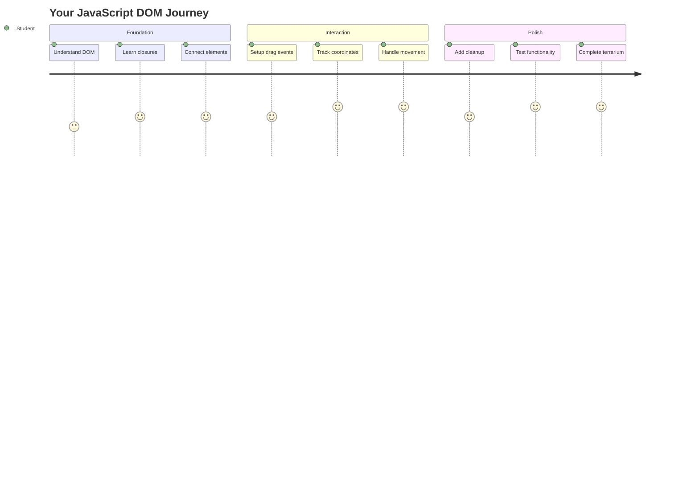
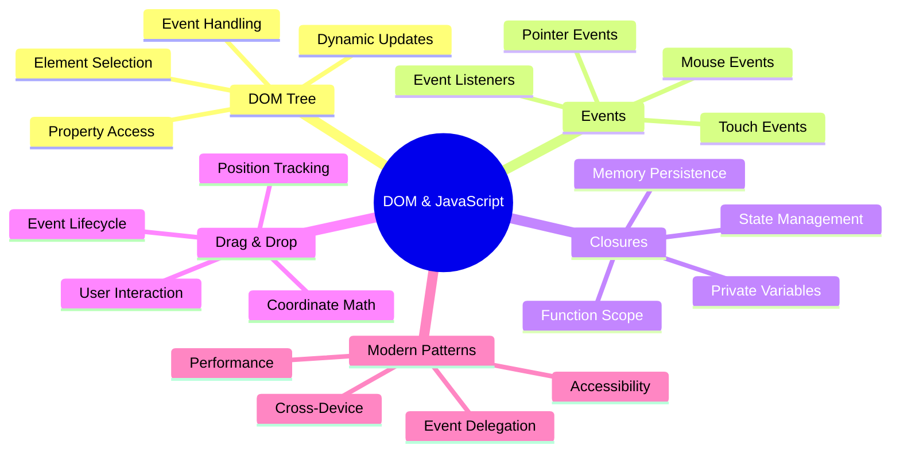
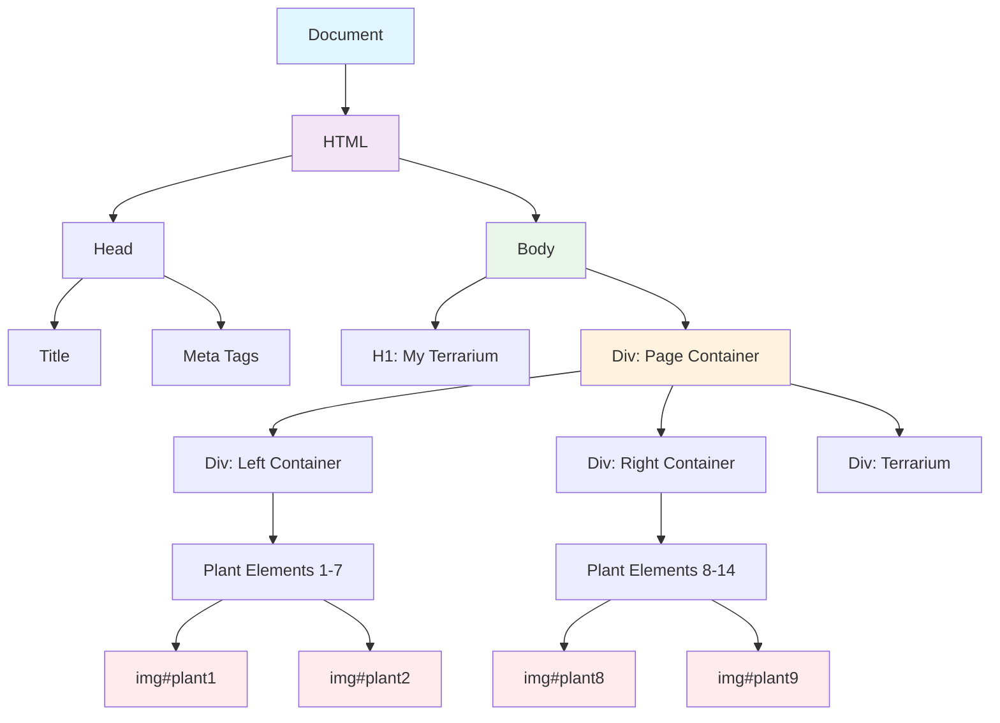
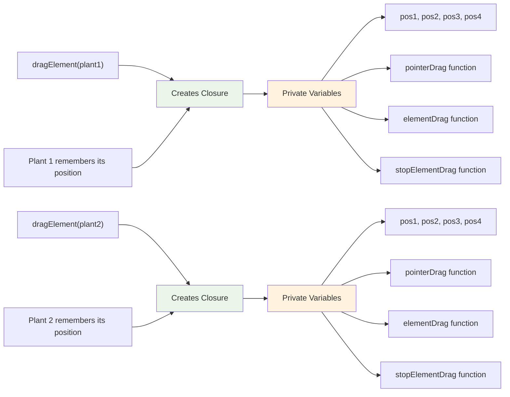
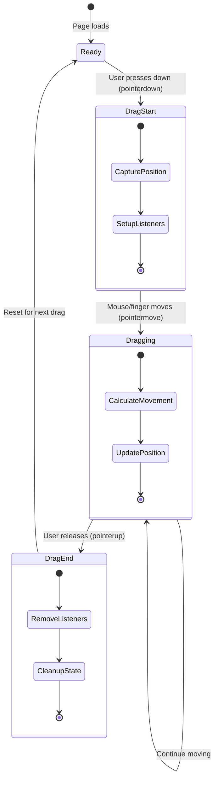
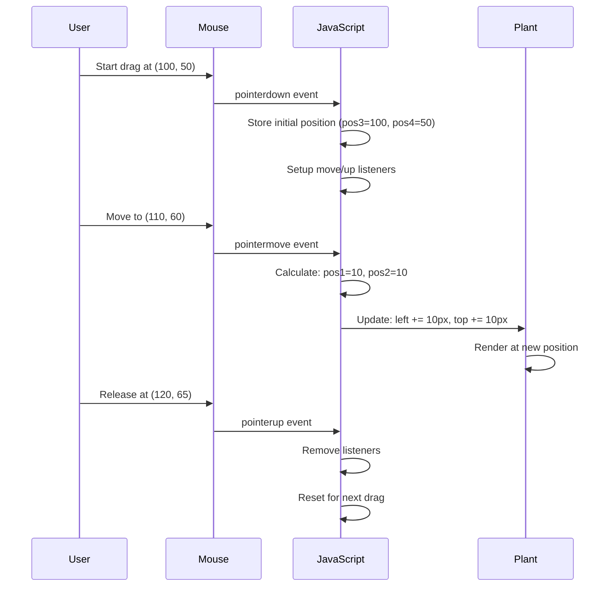
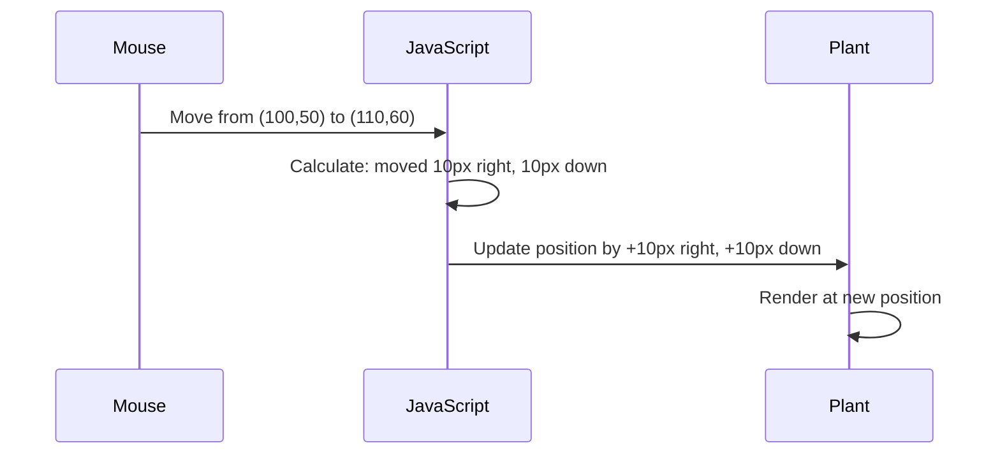
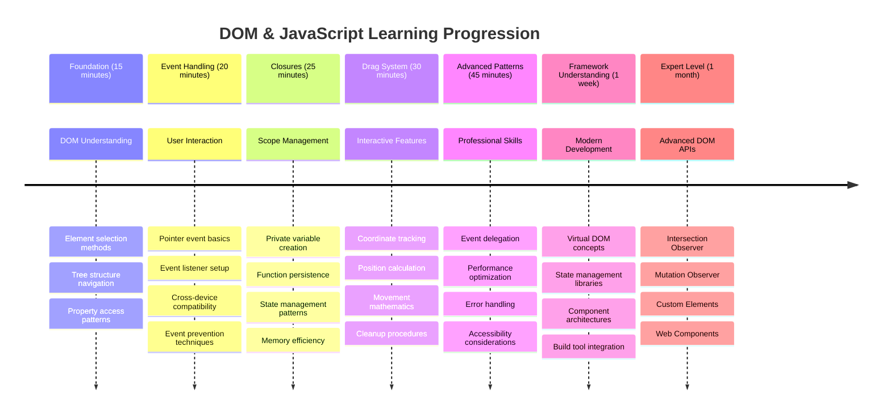

<!--
CO_OP_TRANSLATOR_METADATA:
{
  "original_hash": "973e48ad87d67bf5bb819746c9f8e302",
  "translation_date": "2025-11-03T12:35:54+00:00",
  "source_file": "3-terrarium/3-intro-to-DOM-and-closures/README.md",
  "language_code": "ar"
}
-->
# مشروع التيراريوم الجزء الثالث: التلاعب بـ DOM والإغلاق في JavaScript




> رسم توضيحي بواسطة [Tomomi Imura](https://twitter.com/girlie_mac)

مرحبًا بكم في أحد أكثر جوانب تطوير الويب إثارة - جعل الأشياء تفاعلية! نموذج كائن المستند (DOM) هو بمثابة جسر بين HTML و JavaScript، واليوم سنستخدمه لإضفاء الحياة على التيراريوم الخاص بك. عندما أنشأ Tim Berners-Lee أول متصفح ويب، كان يتصور شبكة يمكن أن تكون ديناميكية وتفاعلية - و DOM يجعل هذا التصور ممكنًا.

سنستكشف أيضًا الإغلاق في JavaScript، والذي قد يبدو مخيفًا في البداية. فكر في الإغلاق كإنشاء "جيوب ذاكرة" حيث يمكن لوظائفك تذكر معلومات مهمة. إنه مثل كل نبات في التيراريوم الخاص بك لديه سجل بيانات خاص به لتتبع موقعه. بنهاية هذا الدرس، ستفهم مدى طبيعتها وفائدتها.

إليك ما سنبنيه: تيراريوم يمكن للمستخدمين فيه سحب وإفلات النباتات في أي مكان يريدونه. ستتعلم تقنيات التلاعب بـ DOM التي تشغل كل شيء بدءًا من تحميل الملفات بالسحب والإفلات إلى الألعاب التفاعلية. دعونا نجعل التيراريوم الخاص بك ينبض بالحياة.



## اختبار ما قبل المحاضرة

[اختبار ما قبل المحاضرة](https://ff-quizzes.netlify.app/web/quiz/19)

## فهم DOM: بوابتك إلى صفحات ويب تفاعلية

نموذج كائن المستند (DOM) هو الطريقة التي يتواصل بها JavaScript مع عناصر HTML الخاصة بك. عندما يقوم متصفحك بتحميل صفحة HTML، فإنه ينشئ تمثيلًا منظمًا لتلك الصفحة في الذاكرة - هذا هو DOM. فكر فيه كشجرة عائلية حيث كل عنصر HTML هو عضو في العائلة يمكن لـ JavaScript الوصول إليه أو تعديله أو إعادة ترتيبه.

التلاعب بـ DOM يحول الصفحات الثابتة إلى مواقع ويب تفاعلية. في كل مرة ترى فيها زرًا يغير لونه عند التمرير، أو تحديث المحتوى دون إعادة تحميل الصفحة، أو عناصر يمكنك سحبها، فهذا هو عمل التلاعب بـ DOM.




> تمثيل لـ DOM وعلامات HTML التي تشير إليه. من [Olfa Nasraoui](https://www.researchgate.net/publication/221417012_Profile-Based_Focused_Crawler_for_Social_Media-Sharing_Websites)

**ما يجعل DOM قويًا:**
- **يوفر** طريقة منظمة للوصول إلى أي عنصر في صفحتك
- **يمكن** من تحديث المحتوى الديناميكي دون إعادة تحميل الصفحة
- **يسمح** بالاستجابة الفورية لتفاعلات المستخدم مثل النقرات والسحب
- **يخلق** الأساس لتطبيقات الويب التفاعلية الحديثة

## الإغلاق في JavaScript: إنشاء كود منظم وقوي

[الإغلاق في JavaScript](https://developer.mozilla.org/docs/Web/JavaScript/Closures) يشبه إعطاء وظيفة مساحة عمل خاصة بها مع ذاكرة مستمرة. فكر في كيفية تطوير طيور داروين في جزر غالاباغوس مناقير متخصصة بناءً على بيئتها المحددة - يعمل الإغلاق بطريقة مشابهة، حيث ينشئ وظائف متخصصة "تتذكر" سياقها المحدد حتى بعد انتهاء وظيفة الوالد.

في التيراريوم الخاص بنا، يساعد الإغلاق كل نبات على تذكر موقعه الخاص بشكل مستقل. يظهر هذا النمط في جميع أنحاء تطوير JavaScript الاحترافي، مما يجعله مفهومًا قيمًا لفهمه.



> 💡 **فهم الإغلاق**: الإغلاق موضوع مهم في JavaScript، ويستخدمه العديد من المطورين لسنوات قبل أن يفهموا جميع الجوانب النظرية بالكامل. اليوم، نركز على التطبيق العملي - سترى الإغلاق يظهر بشكل طبيعي أثناء بناء ميزاتنا التفاعلية. الفهم سيتطور عندما ترى كيف يحل مشاكل حقيقية.


> تمثيل لـ DOM وعلامات HTML التي تشير إليه. من [Olfa Nasraoui](https://www.researchgate.net/publication/221417012_Profile-Based_Focused_Crawler_for_Social_Media-Sharing_Websites)

في هذا الدرس، سنكمل مشروع التيراريوم التفاعلي الخاص بنا عن طريق إنشاء JavaScript الذي سيسمح للمستخدم بالتلاعب بالنباتات على الصفحة.

## قبل أن نبدأ: الإعداد للنجاح

ستحتاج إلى ملفات HTML و CSS الخاصة بك من دروس التيراريوم السابقة - نحن على وشك جعل هذا التصميم الثابت تفاعليًا. إذا كنت تنضم لأول مرة، فإن إكمال تلك الدروس أولاً سيوفر سياقًا مهمًا.

إليك ما سنبنيه:
- **سحب وإفلات سلس** لجميع نباتات التيراريوم
- **تتبع الإحداثيات** حتى تتذكر النباتات مواقعها
- **واجهة تفاعلية كاملة** باستخدام JavaScript العادي
- **كود نظيف ومنظم** باستخدام أنماط الإغلاق

## إعداد ملف JavaScript الخاص بك

لنقم بإنشاء ملف JavaScript الذي سيجعل التيراريوم الخاص بك تفاعليًا.

**الخطوة 1: إنشاء ملف السكربت الخاص بك**

في مجلد التيراريوم الخاص بك، قم بإنشاء ملف جديد يسمى `script.js`.

**الخطوة 2: ربط JavaScript بـ HTML الخاص بك**

أضف علامة السكربت هذه إلى قسم `<head>` في ملف `index.html` الخاص بك:

```html
<script src="./script.js" defer></script>
```

**لماذا تعتبر خاصية `defer` مهمة:**
- **تضمن** أن JavaScript ينتظر حتى يتم تحميل كل HTML
- **تمنع** الأخطاء حيث يحاول JavaScript البحث عن عناصر غير جاهزة بعد
- **تضمن** أن جميع عناصر النبات الخاصة بك متاحة للتفاعل
- **توفر** أداءً أفضل من وضع السكربتات في أسفل الصفحة

> ⚠️ **ملاحظة مهمة**: خاصية `defer` تمنع مشاكل التوقيت الشائعة. بدونها، قد يحاول JavaScript الوصول إلى عناصر HTML قبل تحميلها، مما يسبب أخطاء.

---

## ربط JavaScript بعناصر HTML الخاصة بك

قبل أن نتمكن من جعل العناصر قابلة للسحب، يحتاج JavaScript إلى تحديد موقعها في DOM. فكر في هذا كنظام فهرسة مكتبة - بمجرد أن تحصل على رقم الفهرس، يمكنك العثور على الكتاب الذي تحتاجه والوصول إلى جميع محتوياته.

سنستخدم طريقة `document.getElementById()` لإجراء هذه الاتصالات. إنها مثل وجود نظام تصنيف دقيق - تقدم معرفًا، ويحدد بالضبط العنصر الذي تحتاجه في HTML.

### تمكين وظيفة السحب لجميع النباتات

أضف هذا الكود إلى ملف `script.js` الخاص بك:

```javascript
// Enable drag functionality for all 14 plants
dragElement(document.getElementById('plant1'));
dragElement(document.getElementById('plant2'));
dragElement(document.getElementById('plant3'));
dragElement(document.getElementById('plant4'));
dragElement(document.getElementById('plant5'));
dragElement(document.getElementById('plant6'));
dragElement(document.getElementById('plant7'));
dragElement(document.getElementById('plant8'));
dragElement(document.getElementById('plant9'));
dragElement(document.getElementById('plant10'));
dragElement(document.getElementById('plant11'));
dragElement(document.getElementById('plant12'));
dragElement(document.getElementById('plant13'));
dragElement(document.getElementById('plant14'));
```

**ما يحققه هذا الكود:**
- **يحدد** كل عنصر نبات في DOM باستخدام معرفه الفريد
- **يسترجع** مرجع JavaScript لكل عنصر HTML
- **يمرر** كل عنصر إلى وظيفة `dragElement` (التي سننشئها لاحقًا)
- **يجهز** كل نبات للتفاعل بالسحب والإفلات
- **يربط** هيكل HTML الخاص بك بوظائف JavaScript

> 🎯 **لماذا نستخدم المعرفات بدلاً من الفئات؟** توفر المعرفات معرفات فريدة لعناصر محددة، بينما تم تصميم الفئات CSS لتنسيق مجموعات من العناصر. عندما يحتاج JavaScript إلى التلاعب بالعناصر الفردية، توفر المعرفات الدقة والأداء الذي نحتاجه.

> 💡 **نصيحة احترافية**: لاحظ كيف نقوم باستدعاء `dragElement()` لكل نبات بشكل فردي. يضمن هذا النهج أن يحصل كل نبات على سلوك سحب مستقل خاص به، وهو أمر ضروري لتفاعل المستخدم السلس.

### 🔄 **توقف تربوي**
**فهم اتصال DOM**: قبل الانتقال إلى وظيفة السحب، تحقق من أنك تستطيع:
- ✅ شرح كيف يحدد `document.getElementById()` عناصر HTML
- ✅ فهم لماذا نستخدم معرفات فريدة لكل نبات
- ✅ وصف الغرض من خاصية `defer` في علامات السكربت
- ✅ التعرف على كيفية اتصال JavaScript و HTML عبر DOM

**اختبار ذاتي سريع**: ماذا سيحدث إذا كان هناك عنصران لهما نفس المعرف؟ لماذا يعيد `getElementById()` عنصرًا واحدًا فقط؟
*الإجابة: يجب أن تكون المعرفات فريدة؛ إذا تكررت، يتم إرجاع العنصر الأول فقط*

---

## بناء إغلاق وظيفة السحب

الآن سننشئ قلب وظيفة السحب الخاصة بنا: إغلاق يدير سلوك السحب لكل نبات. يحتوي هذا الإغلاق على وظائف داخلية متعددة تعمل معًا لتتبع حركات الماوس وتحديث مواقع العناصر.

الإغلاق مثالي لهذه المهمة لأنه يسمح لنا بإنشاء متغيرات "خاصة" تستمر بين استدعاءات الوظائف، مما يمنح كل نبات نظام تتبع إحداثيات مستقل.

### فهم الإغلاق من خلال مثال بسيط

دعني أوضح الإغلاق بمثال بسيط يوضح المفهوم:

```javascript
function createCounter() {
    let count = 0; // This is like a private variable
    
    function increment() {
        count++; // The inner function remembers the outer variable
        return count;
    }
    
    return increment; // We're giving back the inner function
}

const myCounter = createCounter();
console.log(myCounter()); // 1
console.log(myCounter()); // 2
```

**ما يحدث في هذا النمط من الإغلاق:**
- **ينشئ** متغير `count` خاصًا موجودًا فقط داخل هذا الإغلاق
- **يمكن للوظيفة الداخلية** الوصول إلى هذا المتغير الخارجي وتعديله (آلية الإغلاق)
- **عندما نعيد** الوظيفة الداخلية، فإنها تحافظ على اتصالها بالبيانات الخاصة
- **حتى بعد** انتهاء تنفيذ `createCounter()`، يستمر `count` ويتذكر قيمته

### لماذا الإغلاق مثالي لوظيفة السحب

بالنسبة للتيراريوم الخاص بنا، يحتاج كل نبات إلى تذكر إحداثيات موقعه الحالي. يوفر الإغلاق الحل المثالي:

**الفوائد الرئيسية لمشروعنا:**
- **يحافظ** على متغيرات الموقع الخاصة لكل نبات بشكل مستقل
- **يحفظ** بيانات الإحداثيات بين أحداث السحب
- **يمنع** تعارض المتغيرات بين العناصر القابلة للسحب المختلفة
- **ينشئ** هيكل كود نظيف ومنظم

> 🎯 **هدف التعلم**: لا تحتاج إلى إتقان كل جانب من جوانب الإغلاق الآن. ركز على رؤية كيف تساعدنا في تنظيم الكود والحفاظ على الحالة لوظيفة السحب.



### إنشاء وظيفة dragElement

الآن دعونا نبني الوظيفة الرئيسية التي ستتعامل مع كل منطق السحب. أضف هذه الوظيفة أسفل تعريفات عناصر النبات الخاصة بك:

```javascript
function dragElement(terrariumElement) {
    // Initialize position tracking variables
    let pos1 = 0,  // Previous mouse X position
        pos2 = 0,  // Previous mouse Y position  
        pos3 = 0,  // Current mouse X position
        pos4 = 0;  // Current mouse Y position
    
    // Set up the initial drag event listener
    terrariumElement.onpointerdown = pointerDrag;
}
```

**فهم نظام تتبع الموقع:**
- **`pos1` و `pos2`**: تخزن الفرق بين مواقع الماوس القديمة والجديدة
- **`pos3` و `pos4`**: تتبع إحداثيات الماوس الحالية
- **`terrariumElement`**: العنصر النباتي المحدد الذي نجعله قابلًا للسحب
- **`onpointerdown`**: الحدث الذي يتم تشغيله عندما يبدأ المستخدم السحب

**كيف يعمل نمط الإغلاق:**
- **ينشئ** متغيرات موقع خاصة لكل عنصر نباتي
- **يحافظ** على هذه المتغيرات طوال دورة حياة السحب
- **يضمن** أن كل نبات يتتبع إحداثياته بشكل مستقل
- **يوفر** واجهة نظيفة من خلال وظيفة `dragElement`

### لماذا نستخدم أحداث المؤشر؟

قد تتساءل لماذا نستخدم `onpointerdown` بدلاً من `onclick` الأكثر شيوعًا. إليك السبب:

| نوع الحدث | الأفضل لـ | العائق |
|-----------|-----------|--------|
| `onclick` | نقرات الأزرار البسيطة | لا يمكنه التعامل مع السحب (فقط النقر والإفلات) |
| `onpointerdown` | الماوس واللمس معًا | أحدث، لكنه مدعوم بشكل جيد هذه الأيام |
| `onmousedown` | الماوس المكتبي فقط | يترك مستخدمي الهواتف المحمولة خارج الحساب |

**لماذا أحداث المؤشر مثالية لما نبنيه:**
- **تعمل بشكل رائع** سواء كان شخص يستخدم الماوس أو الإصبع أو حتى القلم
- **تشعر بنفس الطريقة** على الكمبيوتر المحمول أو الجهاز اللوحي أو الهاتف
- **تتعامل** مع حركة السحب الفعلية (ليس فقط النقر والانتهاء)
- **تخلق** تجربة سلسة يتوقعها المستخدمون من تطبيقات الويب الحديثة

> 💡 **التحديث للمستقبل**: أحداث المؤشر هي الطريقة الحديثة للتعامل مع تفاعلات المستخدم. بدلاً من كتابة كود منفصل للماوس واللمس، تحصل على كلاهما مجانًا. رائع، أليس كذلك؟

### 🔄 **توقف تربوي**
**فهم التعامل مع الأحداث**: توقف لتأكيد فهمك للأحداث:
- ✅ لماذا نستخدم أحداث المؤشر بدلاً من أحداث الماوس؟
- ✅ كيف تستمر متغيرات الإغلاق بين استدعاءات الوظائف؟
- ✅ ما دور `preventDefault()` في السحب السلس؟
- ✅ لماذا نربط المستمعين بالمستند بدلاً من العناصر الفردية؟

**اتصال بالعالم الحقيقي**: فكر في واجهات السحب والإفلات التي تستخدمها يوميًا:
- **تحميل الملفات**: سحب الملفات إلى نافذة المتصفح
- **لوحات كانبان**: نقل المهام بين الأعمدة
- **معارض الصور**: إعادة ترتيب ترتيب الصور
- **واجهات الهواتف المحمولة**: السحب والإفلات على الشاشات التي تعمل باللمس

---

## وظيفة pointerDrag: التقاط بداية السحب

عندما يضغط المستخدم على نبات (سواء بنقرة الماوس أو لمسة الإصبع)، تبدأ وظيفة `pointerDrag` في العمل. تلتقط هذه الوظيفة الإحداثيات الأولية وتعد نظام السحب.

أضف هذه الوظيفة داخل إغلاق `dragElement`، مباشرة بعد السطر `terrariumElement.onpointerdown = pointerDrag;`:

```javascript
function pointerDrag(e) {
    // Prevent default browser behavior (like text selection)
    e.preventDefault();
    
    // Capture the initial mouse/touch position
    pos3 = e.clientX;  // X coordinate where drag started
    pos4 = e.clientY;  // Y coordinate where drag started
    
    // Set up event listeners for the dragging process
    document.onpointermove = elementDrag;
    document.onpointerup = stopElementDrag;
}
```

**خطوة بخطوة، إليك ما يحدث:**
- **يمنع** سلوكيات المتصفح الافتراضية التي قد تتداخل مع السحب
- **يسجل** الإحداثيات الدقيقة حيث بدأ المستخدم إيماءة السحب
- **يؤسس** مستمعي الأحداث لحركة السحب المستمرة
- **يجهز** النظام لتتبع حركة الماوس/الإصبع عبر المستند بأكمله

### فهم منع الأحداث

السطر `e.preventDefault()` ضروري للسحب السلس:

**بدون المنع، قد تقوم المتصفحات بـ:**
- **تحديد** النص عند السحب عبر الصفحة
- **تشغيل** قوائم السياق عند السحب بالنقر الأيمن
- **التداخل** مع سلوك السحب المخصص الخاص بنا
- **إنشاء** آثار بصرية أثناء عملية السحب

> 🔍 **تجربة**: بعد إكمال هذا الدرس، حاول إزالة `e.preventDefault()` وشاهد كيف يؤثر ذلك على تجربة السحب. ستفهم بسرعة لماذا هذا السطر ضروري!

### نظام تتبع الإحداثيات

تعطينا خصائص `e.clientX` و `e.clientY` إحداثيات الماوس/اللمس الدقيقة:

| الخاصية | ما تقيسه | حالة الاستخدام |
|---------|----------|----------------|
| `clientX` | الموقع الأفقي بالنسبة إلى نافذة العرض | تتبع الحركة يمينًا ويسارًا |
| `clientY` | الموقع العمودي بالنسبة إلى نافذة العرض | تتبع الحركة لأعلى وأسفل |
**فهم هذه الإحداثيات:**
- **توفر** معلومات دقيقة عن موضع البكسل
- **تتحدث** في الوقت الفعلي مع تحرك المؤشر
- **تظل** متسقة عبر أحجام الشاشات ومستويات التكبير المختلفة
- **تمكن** من تفاعلات السحب السلسة والاستجابة

### إعداد مستمعي الأحداث على مستوى المستند

لاحظ كيف نقوم بإرفاق أحداث الحركة والتوقف بكامل `document`، وليس فقط بعنصر النبات:

```javascript
document.onpointermove = elementDrag;
document.onpointerup = stopElementDrag;
```

**لماذا نرفقها بالمستند:**
- **تستمر** في التتبع حتى عندما يغادر الماوس عنصر النبات
- **تمنع** انقطاع السحب إذا تحرك المستخدم بسرعة
- **توفر** سحبًا سلسًا عبر الشاشة بأكملها
- **تتعامل** مع الحالات الخاصة عندما يتحرك المؤشر خارج نافذة المتصفح

> ⚡ **ملاحظة أداء**: سنقوم بتنظيف مستمعي الأحداث على مستوى المستند عند توقف السحب لتجنب تسرب الذاكرة ومشاكل الأداء.

## إكمال نظام السحب: الحركة والتنظيف

الآن سنضيف الوظيفتين المتبقيتين اللتين تتعاملان مع حركة السحب الفعلية وتنظيف الأحداث عند توقف السحب. تعمل هذه الوظائف معًا لإنشاء حركة نبات سلسة واستجابة عبر التيراريوم الخاص بك.

### وظيفة elementDrag: تتبع الحركة

أضف وظيفة `elementDrag` بعد القوس المغلق لـ `pointerDrag`:

```javascript
function elementDrag(e) {
    // Calculate the distance moved since the last event
    pos1 = pos3 - e.clientX;  // Horizontal distance moved
    pos2 = pos4 - e.clientY;  // Vertical distance moved
    
    // Update the current position tracking
    pos3 = e.clientX;  // New current X position
    pos4 = e.clientY;  // New current Y position
    
    // Apply the movement to the element's position
    terrariumElement.style.top = (terrariumElement.offsetTop - pos2) + 'px';
    terrariumElement.style.left = (terrariumElement.offsetLeft - pos1) + 'px';
}
```

**فهم رياضيات الإحداثيات:**
- **`pos1` و `pos2`**: تحسب المسافة التي تحركها الماوس منذ التحديث الأخير
- **`pos3` و `pos4`**: تخزن موضع الماوس الحالي للحساب التالي
- **`offsetTop` و `offsetLeft`**: تحصل على موضع العنصر الحالي على الصفحة
- **منطق الطرح**: يحرك العنصر بنفس مقدار حركة الماوس



**تفصيل حساب الحركة:**
1. **يقيس** الفرق بين مواضع الماوس القديمة والجديدة
2. **يحسب** مقدار حركة العنصر بناءً على حركة الماوس
3. **يحدث** خصائص موضع CSS للعنصر في الوقت الفعلي
4. **يخزن** الموضع الجديد كمرجع للحساب التالي

### التمثيل البصري للرياضيات



### وظيفة stopElementDrag: التنظيف

أضف وظيفة التنظيف بعد القوس المغلق لـ `elementDrag`:

```javascript
function stopElementDrag() {
    // Remove the document-level event listeners
    document.onpointerup = null;
    document.onpointermove = null;
}
```

**لماذا التنظيف ضروري:**
- **يمنع** تسرب الذاكرة الناتج عن مستمعي الأحداث المتبقين
- **يوقف** سلوك السحب عند إفلات المستخدم للنبات
- **يسمح** بسحب عناصر أخرى بشكل مستقل
- **يعيد ضبط** النظام لعملية السحب التالية

**ما الذي يحدث بدون التنظيف:**
- تستمر مستمعات الأحداث في العمل حتى بعد توقف السحب
- يتدهور الأداء مع تراكم المستمعين غير المستخدمين
- سلوك غير متوقع عند التفاعل مع عناصر أخرى
- يتم استهلاك موارد المتصفح في معالجة أحداث غير ضرورية

### فهم خصائص موضع CSS

نظام السحب الخاص بنا يتلاعب بخصائص CSS الرئيسية التالية:

| الخاصية | ما تتحكم به | كيف نستخدمها |
|---------|-------------|--------------|
| `top` | المسافة من الحافة العلوية | تحديد الموضع العمودي أثناء السحب |
| `left` | المسافة من الحافة اليسرى | تحديد الموضع الأفقي أثناء السحب |

**أفكار رئيسية حول خصائص الإزاحة:**
- **`offsetTop`**: المسافة الحالية من الحافة العلوية للعنصر الأب المحدد
- **`offsetLeft`**: المسافة الحالية من الحافة اليسرى للعنصر الأب المحدد
- **سياق التمركز**: هذه القيم نسبية إلى أقرب عنصر أب محدد
- **تحديثات في الوقت الفعلي**: تتغير فورًا عند تعديل خصائص CSS

> 🎯 **فلسفة التصميم**: تم تصميم نظام السحب هذا ليكون مرنًا عن قصد – لا توجد "مناطق إسقاط" أو قيود. يمكن للمستخدمين وضع النباتات في أي مكان، مما يمنحهم تحكمًا إبداعيًا كاملاً في تصميم التيراريوم الخاص بهم.

## جمع كل شيء معًا: نظام السحب الكامل الخاص بك

تهانينا! لقد قمت ببناء نظام سحب وإفلات متطور باستخدام JavaScript الأساسي. يحتوي الآن دالة `dragElement` الكاملة الخاصة بك على إغلاق قوي يدير:

**ما يحققه الإغلاق الخاص بك:**
- **يحافظ** على متغيرات الموضع الخاصة لكل نبات بشكل مستقل
- **يتعامل** مع دورة السحب الكاملة من البداية إلى النهاية
- **يوفر** حركة سلسة واستجابة عبر الشاشة بأكملها
- **ينظف** الموارد بشكل صحيح لمنع تسرب الذاكرة
- **يخلق** واجهة إبداعية وبديهية لتصميم التيراريوم

### اختبار التيراريوم التفاعلي الخاص بك

الآن اختبر التيراريوم التفاعلي الخاص بك! افتح ملف `index.html` الخاص بك في متصفح الويب وجرب الوظائف:

1. **انقر واستمر بالضغط** على أي نبات لبدء السحب
2. **حرك الماوس أو الإصبع** وشاهد النبات يتبع الحركة بسلاسة
3. **أفلت** لإسقاط النبات في موضعه الجديد
4. **جرب** ترتيبات مختلفة لاستكشاف الواجهة

🥇 **إنجاز**: لقد أنشأت تطبيق ويب تفاعلي بالكامل باستخدام مفاهيم أساسية يستخدمها المطورون المحترفون يوميًا. تعتمد وظيفة السحب والإفلات هذه على نفس المبادئ المستخدمة في تحميل الملفات، ولوحات كانبان، والعديد من الواجهات التفاعلية الأخرى.

### 🔄 **تقييم تعليمي**
**فهم النظام الكامل**: تحقق من إتقانك للنظام الكامل للسحب:
- ✅ كيف تحافظ الإغلاقات على حالة مستقلة لكل نبات؟
- ✅ لماذا تكون رياضيات حساب الإحداثيات ضرورية للحركة السلسة؟
- ✅ ماذا سيحدث إذا نسينا تنظيف مستمعي الأحداث؟
- ✅ كيف يمكن أن يتوسع هذا النمط ليشمل تفاعلات أكثر تعقيدًا؟

**مراجعة جودة الكود**: راجع الحل الكامل الخاص بك:
- **تصميم معياري**: يحصل كل نبات على مثيل إغلاق خاص به
- **كفاءة الأحداث**: إعداد وتنظيف صحيح لمستمعي الأحداث
- **دعم عبر الأجهزة**: يعمل على أجهزة الكمبيوتر المكتبية والجوال
- **وعي بالأداء**: لا يوجد تسرب للذاكرة أو حسابات زائدة


---

## تحدي GitHub Copilot Agent 🚀

استخدم وضع الوكيل لإكمال التحدي التالي:

**الوصف:** قم بتحسين مشروع التيراريوم عن طريق إضافة وظيفة إعادة تعيين تعيد جميع النباتات إلى مواقعها الأصلية مع رسوم متحركة سلسة.

**المهمة:** قم بإنشاء زر إعادة تعيين، عند النقر عليه، يعيد جميع النباتات إلى مواقعها الأصلية في الشريط الجانبي باستخدام انتقالات CSS سلسة. يجب أن تقوم الوظيفة بتخزين المواقع الأصلية عند تحميل الصفحة وتعيد النباتات بسلاسة إلى تلك المواقع خلال ثانية واحدة عند الضغط على زر إعادة التعيين.

تعرف على المزيد حول [وضع الوكيل](https://code.visualstudio.com/blogs/2025/02/24/introducing-copilot-agent-mode) هنا.

## 🚀 تحدي إضافي: توسيع مهاراتك

هل أنت مستعد لنقل التيراريوم الخاص بك إلى المستوى التالي؟ جرب تنفيذ هذه التحسينات:

**إضافات إبداعية:**
- **انقر مرتين** على نبات لجعله يظهر في المقدمة (تلاعب بـ z-index)
- **أضف تأثيرات بصرية** مثل توهج خفيف عند تمرير الماوس فوق النباتات
- **تنفيذ حدود** لمنع النباتات من السحب خارج التيراريوم
- **إنشاء وظيفة حفظ** تتذكر مواقع النباتات باستخدام localStorage
- **إضافة تأثيرات صوتية** عند التقاط ووضع النباتات

> 💡 **فرصة للتعلم**: كل واحد من هذه التحديات سيعلمك جوانب جديدة من التلاعب بـ DOM، ومعالجة الأحداث، وتصميم تجربة المستخدم.

## اختبار ما بعد المحاضرة

[اختبار ما بعد المحاضرة](https://ff-quizzes.netlify.app/web/quiz/20)

## المراجعة والدراسة الذاتية: تعميق فهمك

لقد أتقنت أساسيات التلاعب بـ DOM والإغلاقات، ولكن هناك دائمًا المزيد لاستكشافه! إليك بعض المسارات لتوسيع معرفتك ومهاراتك.

### طرق بديلة للسحب والإفلات

لقد استخدمنا أحداث المؤشر لتحقيق أقصى قدر من المرونة، ولكن تطوير الويب يقدم العديد من الأساليب:

| الطريقة | الأفضل لـ | قيمة التعلم |
|---------|------------|-------------|
| [واجهة برمجة تطبيقات السحب والإفلات HTML](https://developer.mozilla.org/docs/Web/API/HTML_Drag_and_Drop_API) | تحميل الملفات، مناطق السحب الرسمية | فهم قدرات المتصفح الأصلية |
| [أحداث اللمس](https://developer.mozilla.org/docs/Web/API/Touch_events) | التفاعلات الخاصة بالجوال | أنماط تطوير تركز على الجوال |
| خصائص CSS `transform` | الرسوم المتحركة السلسة | تقنيات تحسين الأداء |

### مواضيع متقدمة في التلاعب بـ DOM

**الخطوات التالية في رحلتك التعليمية:**
- **تفويض الأحداث**: التعامل مع الأحداث بكفاءة لعناصر متعددة
- **مراقب التقاطع**: اكتشاف متى تدخل العناصر/تخرج من نافذة العرض
- **مراقب التغيير**: مراقبة التغييرات في بنية DOM
- **مكونات الويب**: إنشاء عناصر واجهة مستخدم قابلة لإعادة الاستخدام ومغلقة
- **مفاهيم DOM الافتراضية**: فهم كيفية تحسين الأطر لتحديثات DOM

### موارد أساسية لمواصلة التعلم

**الوثائق التقنية:**
- [دليل أحداث المؤشر من MDN](https://developer.mozilla.org/docs/Web/API/Pointer_events) - مرجع شامل لأحداث المؤشر
- [مواصفات أحداث المؤشر من W3C](https://www.w3.org/TR/pointerevents1/) - وثائق المعايير الرسمية
- [دليل متعمق حول إغلاقات JavaScript](https://developer.mozilla.org/docs/Web/JavaScript/Closures) - أنماط الإغلاق المتقدمة

**توافق المتصفح:**
- [CanIUse.com](https://caniuse.com/) - تحقق من دعم الميزات عبر المتصفحات
- [بيانات توافق المتصفح من MDN](https://github.com/mdn/browser-compat-data) - معلومات تفصيلية عن التوافق

**فرص الممارسة:**
- **إنشاء** لعبة ألغاز باستخدام ميكانيكيات السحب المماثلة
- **إنشاء** لوحة كانبان مع إدارة المهام بالسحب والإفلات
- **تصميم** معرض صور مع ترتيبات صور قابلة للسحب
- **التجربة** مع إيماءات اللمس لواجهات الجوال

> 🎯 **استراتيجية التعلم**: أفضل طريقة لترسيخ هذه المفاهيم هي من خلال الممارسة. حاول بناء أشكال مختلفة من الواجهات القابلة للسحب – كل مشروع سيعلمك شيئًا جديدًا عن التفاعل مع المستخدم والتلاعب بـ DOM.

### ⚡ **ما يمكنك القيام به في الدقائق الخمس القادمة**
- [ ] افتح أدوات المطور في المتصفح واكتب `document.querySelector('body')` في وحدة التحكم
- [ ] جرب تغيير نص صفحة ويب باستخدام `innerHTML` أو `textContent`
- [ ] أضف مستمع حدث النقر إلى أي زر أو رابط في صفحة ويب
- [ ] استعرض بنية شجرة DOM باستخدام لوحة العناصر

### 🎯 **ما يمكنك تحقيقه خلال هذه الساعة**
- [ ] أكمل اختبار ما بعد الدرس وراجع مفاهيم التلاعب بـ DOM
- [ ] أنشئ صفحة ويب تفاعلية تستجيب لنقرات المستخدم
- [ ] تدرب على التعامل مع الأحداث بأنواع مختلفة من الأحداث (النقر، التمرير، الضغط على المفاتيح)
- [ ] قم ببناء قائمة مهام بسيطة أو عداد باستخدام التلاعب بـ DOM
- [ ] استكشف العلاقة بين عناصر HTML وكائنات JavaScript

### 📅 **رحلة إتقان JavaScript الخاصة بك لمدة أسبوع**
- [ ] أكمل مشروع التيراريوم التفاعلي مع وظيفة السحب والإفلات
- [ ] أتقن تفويض الأحداث للتعامل مع الأحداث بكفاءة
- [ ] تعرف على حلقة الأحداث وجافا سكريبت غير المتزامنة
- [ ] تدرب على الإغلاقات من خلال بناء وحدات ذات حالة خاصة
- [ ] استكشف واجهات برمجة التطبيقات الحديثة لـ DOM مثل مراقب التقاطع
- [ ] قم ببناء مكونات تفاعلية بدون استخدام الأطر

### 🌟 **إتقان JavaScript خلال شهر**
- [ ] أنشئ تطبيقًا معقدًا بصفحة واحدة باستخدام JavaScript الأساسي
- [ ] تعلم إطار عمل حديث (React، Vue، أو Angular) وقارنه بـ DOM الأساسي
- [ ] ساهم في مشاريع JavaScript مفتوحة المصدر
- [ ] أتقن المفاهيم المتقدمة مثل مكونات الويب والعناصر المخصصة
- [ ] قم ببناء تطبيقات ويب عالية الأداء باستخدام أنماط DOM المثلى
- [ ] علم الآخرين عن التلاعب بـ DOM وأساسيات JavaScript

## 🎯 جدول زمني لإتقان JavaScript DOM



### 🛠️ ملخص أدوات JavaScript الخاصة بك

بعد إكمال هذا الدرس، لديك الآن:
- **إتقان DOM**: اختيار العناصر، التلاعب بالخصائص، والتنقل في الشجرة
- **خبرة في الأحداث**: التعامل مع التفاعلات عبر الأجهزة باستخدام أحداث المؤشر
- **فهم الإغلاقات**: إدارة الحالة الخاصة واستمرارية الوظائف
- **أنظمة تفاعلية**: تنفيذ كامل للسحب والإفلات من الصفر
- **وعي بالأداء**: تنظيف الأحداث بشكل صحيح وإدارة الذاكرة
- **أنماط حديثة**: تقنيات تنظيم الكود المستخدمة في التطوير المهني
- **تجربة المستخدم**: إنشاء واجهات بديهية واستجابة

**المهارات المهنية المكتسبة**: لقد قمت ببناء ميزات باستخدام نفس التقنيات مثل:
- **لوحات Trello/كانبان**: سحب البطاقات بين الأعمدة
- **أنظمة تحميل الملفات**: التعامل مع الملفات بالسحب والإفلات
- **معارض الصور**: واجهات ترتيب الصور
- **تطبيقات الجوال**: أنماط التفاعل القائمة على اللمس

**المستوى التالي**: أنت جاهز لاستكشاف الأطر الحديثة مثل React، Vue، أو Angular التي تعتمد على هذه المفاهيم الأساسية للتلاعب بـ DOM!

## الواجب

[اعمل قليلاً مع DOM](assignment.md)

---

**إخلاء المسؤولية**:  
تم ترجمة هذا المستند باستخدام خدمة الترجمة بالذكاء الاصطناعي [Co-op Translator](https://github.com/Azure/co-op-translator). بينما نسعى لتحقيق الدقة، يرجى العلم أن الترجمات الآلية قد تحتوي على أخطاء أو عدم دقة. يجب اعتبار المستند الأصلي بلغته الأصلية المصدر الرسمي. للحصول على معلومات حاسمة، يُوصى بالترجمة البشرية الاحترافية. نحن غير مسؤولين عن أي سوء فهم أو تفسيرات خاطئة ناتجة عن استخدام هذه الترجمة.