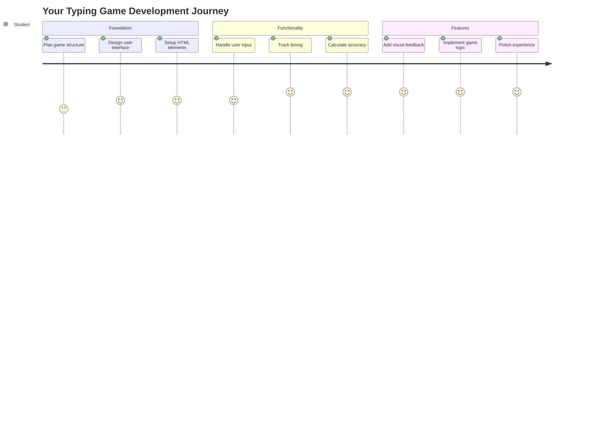
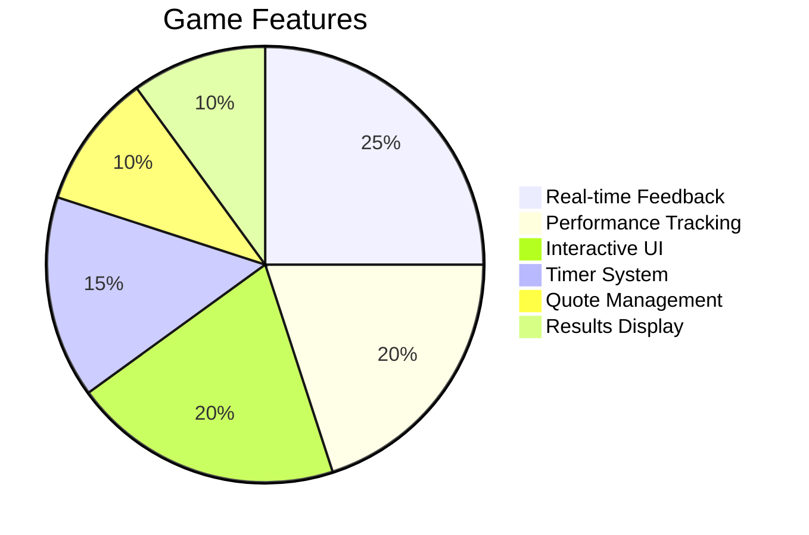
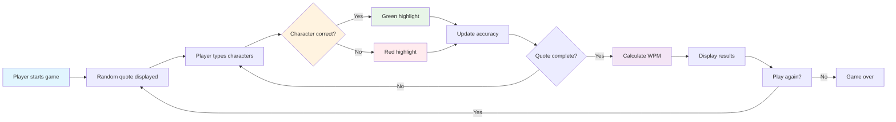
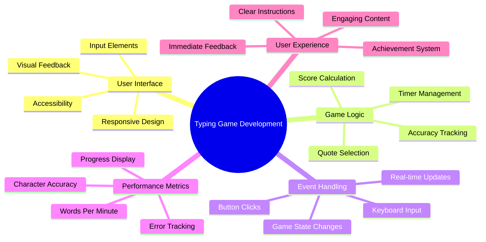
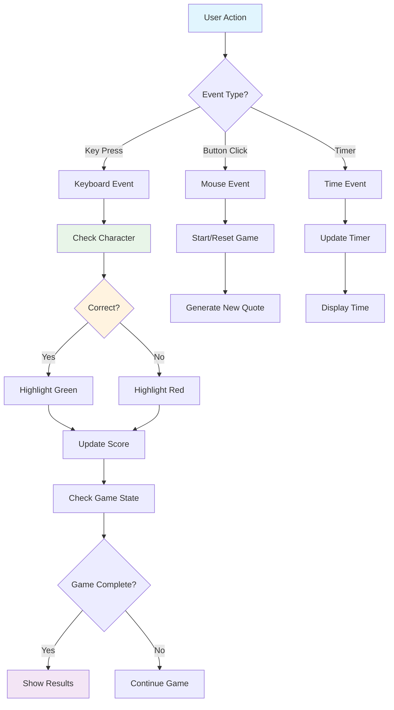
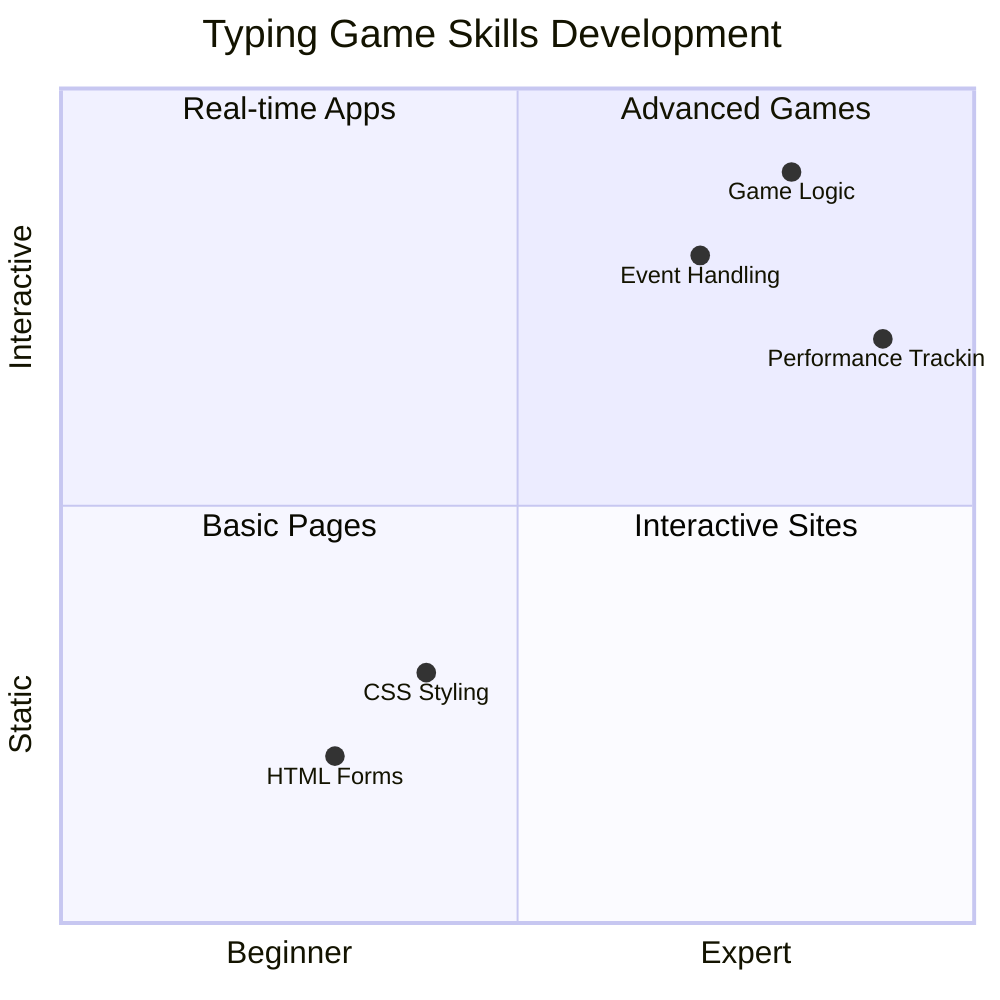
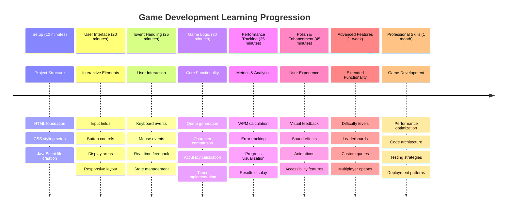

# البرمجة القائمة على الأحداث - بناء لعبة الكتابة

## المقدمة

هناك شيء يعرفه كل مطور ولكنه نادرًا ما يتحدث عنه: الكتابة بسرعة هي قوة خارقة! 🚀 فكر في الأمر - كلما كنت أسرع في نقل أفكارك من عقلك إلى محرر الكود، زادت قدرتك على الإبداع. إنه مثل وجود خط مباشر بين أفكارك والشاشة.

هل تريد معرفة واحدة من أفضل الطرق لتحسين هذه المهارة؟ لقد خمنت ذلك - سنقوم ببناء لعبة!

> لنقم معًا بإنشاء لعبة كتابة رائعة!

هل أنت مستعد لتوظيف كل مهارات JavaScript وHTML وCSS التي تعلمتها؟ سنقوم ببناء لعبة كتابة ستتحداك بعبارات عشوائية من المحقق الأسطوري [شيرلوك هولمز](https://en.wikipedia.org/wiki/Sherlock_Holmes). ستقوم اللعبة بتتبع مدى سرعتك ودقتك في الكتابة - وصدقني، إنها أكثر إدمانًا مما قد تتصور!

## ما الذي تحتاج إلى معرفته

قبل أن نبدأ، تأكد من أنك مرتاح مع هذه المفاهيم (لا تقلق إذا كنت بحاجة إلى مراجعة سريعة - كلنا مررنا بذلك!):

- إنشاء إدخال نصي وأزرار التحكم
- CSS وتعيين الأنماط باستخدام الفئات  
- أساسيات JavaScript
  - إنشاء مصفوفة
  - إنشاء رقم عشوائي
  - الحصول على الوقت الحالي

إذا شعرت أن أيًا من هذه المفاهيم غير واضحة، فلا بأس بذلك! أحيانًا تكون أفضل طريقة لتثبيت معرفتك هي القفز إلى مشروع واكتشاف الأمور أثناء العمل.

### 🔄 **تقييم تربوي**
**تقييم الأساسيات**: قبل بدء التطوير، تأكد من فهمك:
- ✅ كيفية عمل نماذج HTML وعناصر الإدخال
- ✅ الفئات في CSS والتنسيق الديناميكي
- ✅ مستمعي الأحداث ومعالجيها في JavaScript
- ✅ التلاعب بالمصفوفات والاختيار العشوائي
- ✅ قياس الوقت وإجراء الحسابات

**اختبار سريع ذاتي**: هل يمكنك شرح كيفية عمل هذه المفاهيم معًا في لعبة تفاعلية؟
- **الأحداث** تُطلق عند تفاعل المستخدمين مع العناصر
- **المعالجات** تعالج هذه الأحداث وتحدث حالة اللعبة
- **CSS** يوفر ردود فعل بصرية لتفاعلات المستخدم
- **الوقت** يتيح قياس الأداء وتقدم اللعبة

## لنبدأ ببناء اللعبة!

[إنشاء لعبة كتابة باستخدام البرمجة القائمة على الأحداث](./typing-game/README.md)

### ⚡ **ما يمكنك القيام به في الدقائق الخمس القادمة**
- [ ] افتح وحدة التحكم في المتصفح وجرب الاستماع لأحداث لوحة المفاتيح باستخدام `addEventListener`
- [ ] أنشئ صفحة HTML بسيطة تحتوي على حقل إدخال واختبر الكشف عن الكتابة
- [ ] تدرب على معالجة النصوص بمقارنة النص المكتوب بالنص المستهدف
- [ ] جرب استخدام `setTimeout` لفهم وظائف التوقيت

### 🎯 **ما يمكنك تحقيقه خلال الساعة القادمة**
- [ ] أكمل اختبار ما بعد الدرس وافهم البرمجة القائمة على الأحداث
- [ ] قم ببناء نسخة أساسية من لعبة الكتابة مع التحقق من الكلمات
- [ ] أضف ردود فعل بصرية للكتابة الصحيحة والخاطئة
- [ ] قم بتنفيذ نظام تسجيل بسيط يعتمد على السرعة والدقة
- [ ] قم بتصميم لعبتك باستخدام CSS لجعلها جذابة بصريًا

### 📅 **تطوير اللعبة خلال أسبوع**
- [ ] أكمل لعبة الكتابة بالكامل مع جميع الميزات والتحسينات
- [ ] أضف مستويات صعوبة مع تعقيد الكلمات المتفاوت
- [ ] قم بتنفيذ تتبع إحصائيات المستخدم (الكلمات في الدقيقة، الدقة مع مرور الوقت)
- [ ] أضف تأثيرات صوتية ورسوم متحركة لتحسين تجربة المستخدم
- [ ] اجعل لعبتك متجاوبة مع الأجهزة المحمولة التي تعمل باللمس
- [ ] شارك لعبتك عبر الإنترنت واجمع آراء المستخدمين

### 🌟 **تطوير تفاعلي خلال شهر**
- [ ] قم ببناء ألعاب متعددة تستكشف أنماط تفاعل مختلفة
- [ ] تعلم عن حلقات الألعاب وإدارة الحالة وتحسين الأداء
- [ ] ساهم في مشاريع تطوير الألعاب مفتوحة المصدر
- [ ] أتقن مفاهيم التوقيت المتقدمة والرسوم المتحركة السلسة
- [ ] أنشئ ملفًا شخصيًا يعرض تطبيقات تفاعلية متنوعة
- [ ] قم بتوجيه الآخرين المهتمين بتطوير الألعاب والتفاعل مع المستخدم

## 🎯 جدول زمني لإتقان لعبة الكتابة

### 🛠️ ملخص أدوات تطوير اللعبة

بعد إكمال هذا المشروع، ستتقن:
- **البرمجة القائمة على الأحداث**: واجهات مستخدم تفاعلية تستجيب للإدخال
- **ردود الفعل الفورية**: تحديثات بصرية وأداء فورية
- **قياس الأداء**: أنظمة توقيت وتسجيل دقيقة
- **إدارة حالة اللعبة**: التحكم في تدفق التطبيق وتجربة المستخدم
- **التصميم التفاعلي**: إنشاء تجارب مستخدم جذابة وممتعة
- **واجهات برمجة التطبيقات الحديثة**: استخدام قدرات المتصفح للتفاعلات الغنية
- **أنماط الوصول**: تصميم شامل لجميع المستخدمين

**التطبيقات الواقعية**: هذه المهارات تنطبق مباشرة على:
- **تطبيقات الويب**: أي واجهة تفاعلية أو لوحة تحكم
- **البرامج التعليمية**: منصات التعلم وأدوات تقييم المهارات
- **أدوات الإنتاجية**: محررات النصوص، بيئات التطوير، وبرامج التعاون
- **صناعة الألعاب**: ألعاب المتصفح والترفيه التفاعلي
- **تطوير الأجهزة المحمولة**: واجهات تعمل باللمس ومعالجة الإيماءات

**المستوى التالي**: أنت جاهز لاستكشاف أطر الألعاب المتقدمة، أنظمة اللعب متعددة اللاعبين في الوقت الفعلي، أو التطبيقات التفاعلية المعقدة!

## الشكر

كتبه بكل ♥️ بواسطة [كريستوفر هاريسون](http://www.twitter.com/geektrainer)

---

**إخلاء المسؤولية**:  
تم ترجمة هذا المستند باستخدام خدمة الترجمة بالذكاء الاصطناعي [Co-op Translator](https://github.com/Azure/co-op-translator). بينما نسعى لتحقيق الدقة، يرجى العلم أن الترجمات الآلية قد تحتوي على أخطاء أو عدم دقة. يجب اعتبار المستند الأصلي بلغته الأصلية المصدر الرسمي. للحصول على معلومات حاسمة، يُوصى بالترجمة البشرية الاحترافية. نحن غير مسؤولين عن أي سوء فهم أو تفسيرات خاطئة تنشأ عن استخدام هذه الترجمة.