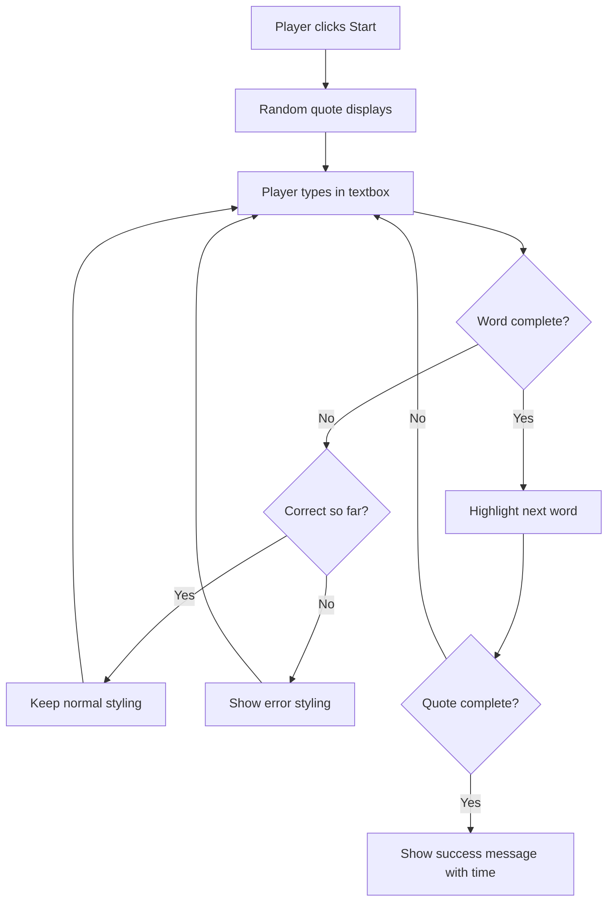
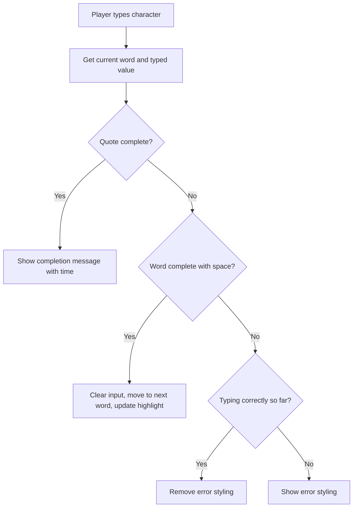

# إنشاء لعبة باستخدام الأحداث

هل تساءلت يومًا كيف تعرف المواقع الإلكترونية أنك ضغطت على زر أو كتبت في مربع نص؟ هذه هي روعة البرمجة القائمة على الأحداث! ما الطريقة الأفضل لتعلم هذه المهارة الأساسية من خلال بناء شيء مفيد - لعبة سرعة الكتابة التي تتفاعل مع كل ضغطة مفتاح تقوم بها.

ستتعرف بنفسك على كيفية "تحدث" متصفحات الويب مع كود JavaScript الخاص بك. في كل مرة تنقر أو تكتب أو تحرك الماوس، يرسل المتصفح رسائل صغيرة (نسميها أحداث) إلى الكود الخاص بك، وأنت تقرر كيفية الرد!

بحلول الوقت الذي ننتهي فيه هنا، ستكون قد أنشأت لعبة كتابة حقيقية تتبع سرعتك ودقتك. والأهم من ذلك، ستفهم المفاهيم الأساسية التي تشغل كل موقع تفاعلي استخدمته من قبل. لنبدأ!

## اختبار ما قبل المحاضرة

[اختبار ما قبل المحاضرة](https://ff-quizzes.netlify.app/web/quiz/21)

## البرمجة القائمة على الأحداث

فكر في تطبيقك أو موقعك المفضل - ما الذي يجعله يبدو حيًا وتفاعليًا؟ الأمر كله يتعلق بكيفية تفاعله مع ما تفعله! كل نقرة، ضغط، سحب، أو ضغطة مفتاح تخلق ما نسميه "حدث"، وهنا تحدث روعة تطوير الويب.

ما يجعل البرمجة للويب مثيرة للاهتمام هو أننا لا نعرف أبدًا متى سيضغط شخص ما على ذلك الزر أو يبدأ الكتابة في مربع النص. قد ينقر فورًا، ينتظر خمس دقائق، أو ربما لا ينقر أبدًا! هذه الطبيعة غير المتوقعة تعني أننا بحاجة إلى التفكير بشكل مختلف حول كيفية كتابة الكود الخاص بنا.

بدلاً من كتابة كود يعمل من الأعلى إلى الأسفل مثل وصفة، نكتب كودًا ينتظر بصبر حدوث شيء ما. يشبه ذلك كيف كان مشغلو التلغراف في القرن التاسع عشر يجلسون بجانب أجهزتهم، مستعدين للرد بمجرد وصول رسالة عبر السلك.

إذن ما هو "الحدث" بالضبط؟ ببساطة، إنه شيء يحدث! عندما تضغط على زر - هذا حدث. عندما تكتب حرفًا - هذا حدث. عندما تحرك الماوس - هذا حدث آخر.

البرمجة القائمة على الأحداث تتيح لنا إعداد الكود الخاص بنا للاستماع والرد. نقوم بإنشاء وظائف خاصة تسمى **مستمعي الأحداث** التي تنتظر بصبر حدوث أشياء معينة، ثم تنطلق إلى العمل عندما تحدث.

فكر في مستمعي الأحداث مثل وجود جرس باب للكود الخاص بك. تقوم بإعداد جرس الباب (`addEventListener()`)، تخبره بالصوت الذي يجب الاستماع إليه (مثل 'click' أو 'keypress')، ثم تحدد ما يجب أن يحدث عندما يرن شخص ما الجرس (وظيفتك المخصصة).

**كيف تعمل مستمعات الأحداث:**
- **تستمع** إلى إجراءات المستخدم المحددة مثل النقرات أو ضغطات المفاتيح أو حركات الماوس
- **تنفذ** الكود المخصص الخاص بك عندما يحدث الحدث المحدد
- **تستجيب** فورًا لتفاعلات المستخدم، مما يخلق تجربة سلسة
- **تتعامل** مع أحداث متعددة على نفس العنصر باستخدام مستمعين مختلفين

> **NOTE:** من الجدير بالذكر أن هناك طرقًا عديدة لإنشاء مستمعي الأحداث. يمكنك استخدام وظائف مجهولة، أو إنشاء وظائف مسماة. يمكنك استخدام اختصارات مختلفة، مثل تعيين خاصية `click`، أو استخدام `addEventListener()`. في تمريننا، سنركز على `addEventListener()` والوظائف المجهولة، لأنها التقنية الأكثر شيوعًا التي يستخدمها مطورو الويب. كما أنها الأكثر مرونة، حيث تعمل `addEventListener()` لجميع الأحداث، ويمكن تقديم اسم الحدث كمعامل.

### الأحداث الشائعة

بينما تقدم متصفحات الويب عشرات الأحداث المختلفة التي يمكنك الاستماع إليها، تعتمد معظم التطبيقات التفاعلية على مجموعة صغيرة من الأحداث الأساسية. فهم هذه الأحداث الأساسية سيمنحك الأساس لبناء تفاعلات مستخدم متقدمة.

هناك [عشرات الأحداث](https://developer.mozilla.org/docs/Web/Events) المتاحة للاستماع إليها عند إنشاء تطبيق. في الأساس، أي شيء يفعله المستخدم على الصفحة يثير حدثًا، مما يمنحك الكثير من القوة لضمان حصولهم على التجربة التي ترغب بها. لحسن الحظ، ستحتاج عادةً إلى عدد قليل من الأحداث فقط. إليك بعض الأحداث الشائعة (بما في ذلك اثنان سنستخدمهما عند إنشاء لعبتنا):

| الحدث | الوصف | الاستخدامات الشائعة |
|-------|-------|------------------|
| `click` | ضغط المستخدم على شيء ما | الأزرار، الروابط، العناصر التفاعلية |
| `contextmenu` | ضغط المستخدم على زر الماوس الأيمن | قوائم النقر بزر الماوس الأيمن المخصصة |
| `select` | قام المستخدم بتحديد نص | تحرير النصوص، عمليات النسخ |
| `input` | أدخل المستخدم نصًا | التحقق من صحة النماذج، البحث في الوقت الفعلي |

**فهم أنواع الأحداث هذه:**
- **تُفعل** عند تفاعل المستخدمين مع عناصر محددة على صفحتك
- **توفر** معلومات تفصيلية حول إجراء المستخدم من خلال كائنات الأحداث
- **تمكنك** من إنشاء تطبيقات ويب تفاعلية وسريعة الاستجابة
- **تعمل** بشكل متسق عبر المتصفحات والأجهزة المختلفة

## إنشاء اللعبة

الآن بعد أن فهمت كيفية عمل الأحداث، دعنا نضع هذه المعرفة موضع التنفيذ من خلال بناء شيء مفيد. سنقوم بإنشاء لعبة سرعة الكتابة التي توضح التعامل مع الأحداث بينما تساعدك على تطوير مهارة مهمة للمطورين.

سنقوم بإنشاء لعبة لاستكشاف كيفية عمل الأحداث في JavaScript. ستختبر لعبتنا مهارة الكتابة لدى اللاعب، وهي واحدة من المهارات الأكثر تقليلًا من قيمتها التي يجب أن يمتلكها جميع المطورين. معلومة ممتعة: تم تصميم تخطيط لوحة المفاتيح QWERTY الذي نستخدمه اليوم في سبعينيات القرن التاسع عشر للآلات الكاتبة - وما زالت مهارات الكتابة الجيدة ذات قيمة كبيرة للمبرمجين حتى اليوم! ستبدو تدفق اللعبة بشكل عام كما يلي:



**كيف ستعمل لعبتنا:**
- **تبدأ** عندما يضغط اللاعب على زر البدء وتعرض اقتباسًا عشوائيًا
- **تتبع** تقدم اللاعب في الكتابة كلمة بكلمة في الوقت الفعلي
- **تُبرز** الكلمة الحالية لتوجيه تركيز اللاعب
- **توفر** ملاحظات بصرية فورية لأخطاء الكتابة
- **تحسب** وتعرض الوقت الإجمالي عند اكتمال الاقتباس

لنقم ببناء لعبتنا، ونتعلم عن الأحداث!

### هيكل الملفات

قبل أن نبدأ في البرمجة، دعونا ننظم الأمور! وجود هيكل ملفات نظيف منذ البداية سيوفر عليك الكثير من المتاعب لاحقًا ويجعل مشروعك أكثر احترافية. 😊

سنحافظ على الأمور بسيطة مع ثلاثة ملفات فقط: `index.html` لهيكل الصفحة، `script.js` لجميع منطق اللعبة، و `style.css` لجعل كل شيء يبدو رائعًا. هذه هي الثلاثية الكلاسيكية التي تشغل معظم الويب!

**قم بإنشاء مجلد جديد لعملك عن طريق فتح نافذة وحدة التحكم أو الطرفية وإصدار الأمر التالي:**

```bash
# Linux or macOS
mkdir typing-game && cd typing-game

# Windows
md typing-game && cd typing-game
```

**ما الذي تفعله هذه الأوامر:**
- **تنشئ** دليلًا جديدًا يسمى `typing-game` لملفات مشروعك
- **تنتقل** إلى الدليل الذي تم إنشاؤه حديثًا تلقائيًا
- **تُعد** مساحة عمل نظيفة لتطوير لعبتك

**افتح Visual Studio Code:**

```bash
code .
```

**هذا الأمر:**
- **يشغل** Visual Studio Code في الدليل الحالي
- **يفتح** مجلد مشروعك في المحرر
- **يوفر** الوصول إلى جميع أدوات التطوير التي ستحتاجها

**أضف ثلاثة ملفات إلى المجلد في Visual Studio Code بالأسماء التالية:**
- `index.html` - يحتوي على هيكل ومحتوى لعبتك
- `script.js` - يتعامل مع كل منطق اللعبة ومستمعي الأحداث
- `style.css` - يحدد المظهر البصري والتصميم

## إنشاء واجهة المستخدم

الآن دعونا نبني المسرح حيث ستحدث كل أحداث لعبتنا! فكر في هذا كتصميم لوحة التحكم لمركبة فضائية - نحتاج إلى التأكد من أن كل ما يحتاجه اللاعبون موجود حيث يتوقعونه.

دعونا نحدد ما تحتاجه لعبتنا بالفعل. إذا كنت تلعب لعبة كتابة، ماذا تريد أن ترى على الشاشة؟ إليك ما سنحتاجه:

| عنصر واجهة المستخدم | الغرض | عنصر HTML |
|---------------------|-------|-----------|
| عرض الاقتباس | يعرض النص للكتابة | `<p>` مع `id="quote"` |
| منطقة الرسائل | تعرض الرسائل والحالة | `<p>` مع `id="message"` |
| إدخال النص | حيث يكتب اللاعبون الاقتباس | `<input>` مع `id="typed-value"` |
| زر البدء | يبدأ اللعبة | `<button>` مع `id="start"` |

**فهم هيكل واجهة المستخدم:**
- **ينظم** المحتوى بشكل منطقي من الأعلى إلى الأسفل
- **يخصص** معرفات فريدة للعناصر لاستهدافها باستخدام JavaScript
- **يوفر** تسلسلًا بصريًا واضحًا لتحسين تجربة المستخدم
- **يتضمن** عناصر HTML دلالية لتحسين الوصول

كل هذه العناصر ستحتاج إلى معرفات حتى نتمكن من العمل معها في JavaScript الخاص بنا. سنضيف أيضًا روابط إلى ملفات CSS و JavaScript التي سنقوم بإنشائها.

قم بإنشاء ملف جديد باسم `index.html`. أضف HTML التالي:

```html
<!-- inside index.html -->
<html>
<head>
  <title>Typing game</title>
  <link rel="stylesheet" href="style.css">
</head>
<body>
  <h1>Typing game!</h1>
  <p>Practice your typing skills with a quote from Sherlock Holmes. Click **start** to begin!</p>
  <p id="quote"></p> <!-- This will display our quote -->
  <p id="message"></p> <!-- This will display any status messages -->
  <div>
    <input type="text" aria-label="current word" id="typed-value" /> <!-- The textbox for typing -->
    <button type="button" id="start">Start</button> <!-- To start the game -->
  </div>
  <script src="script.js"></script>
</body>
</html>
```

**تفصيل ما يحققه هذا الهيكل HTML:**
- **يربط** ملف CSS في `<head>` للتصميم
- **ينشئ** عنوانًا واضحًا وتعليمات للمستخدمين
- **يؤسس** فقرات مؤقتة بمعرفات محددة للمحتوى الديناميكي
- **يتضمن** حقل إدخال مع سمات الوصول
- **يوفر** زر بدء لتشغيل اللعبة
- **يحمل** ملف JavaScript في النهاية لتحسين الأداء

### تشغيل التطبيق

اختبار تطبيقك بشكل متكرر أثناء التطوير يساعدك على اكتشاف المشكلات مبكرًا ورؤية تقدمك في الوقت الفعلي. Live Server هو أداة لا تقدر بثمن تقوم بتحديث متصفحك تلقائيًا كلما قمت بحفظ التغييرات، مما يجعل التطوير أكثر كفاءة.

من الأفضل دائمًا التطوير بشكل تدريجي لرؤية كيف تبدو الأمور. دعونا نطلق تطبيقنا. هناك إضافة رائعة لـ Visual Studio Code تسمى [Live Server](https://marketplace.visualstudio.com/items?itemName=ritwickdey.LiveServer&WT.mc_id=academic-77807-sagibbon) التي ستقوم باستضافة تطبيقك محليًا وتحديث المتصفح في كل مرة تحفظ فيها.

**قم بتثبيت [Live Server](https://marketplace.visualstudio.com/items?itemName=ritwickdey.LiveServer&WT.mc_id=academic-77807-sagibbon) باتباع الرابط والنقر على تثبيت:**

**ما يحدث أثناء التثبيت:**
- **يفتح** متصفحك Visual Studio Code
- **يرشدك** خلال عملية تثبيت الإضافة
- **قد يتطلب** إعادة تشغيل Visual Studio Code لإكمال الإعداد

**بمجرد التثبيت، في Visual Studio Code، اضغط على Ctrl-Shift-P (أو Cmd-Shift-P) لفتح لوحة الأوامر:**

**فهم لوحة الأوامر:**
- **يوفر** وصولًا سريعًا إلى جميع أوامر VS Code
- **يبحث** عن الأوامر أثناء الكتابة
- **يقدم** اختصارات لوحة المفاتيح لتطوير أسرع

**اكتب "Live Server: Open with Live Server":**

**ما يفعله Live Server:**
- **يبدأ** خادم تطوير محلي لمشروعك
- **يحدث** المتصفح تلقائيًا عند حفظ الملفات
- **يخدم** ملفاتك من عنوان URL محلي (عادةً `localhost:5500`)

**افتح متصفحًا وانتقل إلى `https://localhost:5500`:**

يجب أن ترى الآن الصفحة التي أنشأتها! دعونا نضيف بعض الوظائف.

## إضافة CSS

الآن دعونا نجعل الأمور تبدو جيدة! كان ردود الفعل البصرية أمرًا حيويًا لواجهات المستخدم منذ الأيام الأولى للحوسبة. في الثمانينيات، اكتشف الباحثون أن ردود الفعل البصرية الفورية تحسن أداء المستخدم بشكل كبير وتقلل الأخطاء. هذا بالضبط ما سنقوم بإنشائه.

تحتاج لعبتنا إلى أن تكون واضحة تمامًا بشأن ما يحدث. يجب أن يعرف اللاعبون فورًا الكلمة التي يجب عليهم كتابتها، وإذا ارتكبوا خطأ، يجب أن يروا ذلك على الفور. دعونا ننشئ بعض التصميمات البسيطة ولكن الفعالة:

قم بإنشاء ملف جديد باسم `style.css` وأضف الصياغة التالية.

```css
/* inside style.css */
.highlight {
  background-color: yellow;
}

.error {
  background-color: lightcoral;
  border: red;
}
```

**فهم هذه الفئات CSS:**
- **تُبرز** الكلمة الحالية بخلفية صفراء لتوجيه بصري واضح
- **تشير** إلى أخطاء الكتابة بلون خلفية وردي فاتح
- **توفر** ردود فعل فورية دون تعطيل تدفق الكتابة للمستخدم
- **تستخدم** ألوانًا متباينة لتحسين الوصول والتواصل البصري الواضح

✅ عندما يتعلق الأمر بـ CSS، يمكنك تصميم صفحتك بالطريقة التي تريدها. خذ بعض الوقت واجعل الصفحة تبدو أكثر جاذبية:

- اختر خطًا مختلفًا
- أضف ألوانًا إلى العناوين
- قم بتغيير حجم العناصر

## JavaScript

هنا تصبح الأمور مثيرة! 🎉 لدينا هيكل HTML الخاص بنا وتصميم CSS، ولكن الآن لعبتنا مثل سيارة جميلة بدون محرك. JavaScript سيكون هذا المحرك - هو ما يجعل كل شيء يعمل فعليًا ويستجيب لما يفعله اللاعبون.

هنا سترى إبداعك ينبض بالحياة. سنقوم بمعالجة هذا خطوة بخطوة حتى لا تشعر بالإرهاق:

| الخطوة | الغرض | ما ستتعلمه |
|--------|-------|------------|
| [إنشاء الثوابت](../../../../4-typing-game/typing-game) | إعداد الاقتباسات ومراجع DOM | إدارة المتغيرات واختيار DOM |
| [مستمع الحدث لبدء اللعبة](../../../../4-typing-game/typing-game) | التعامل مع تهيئة اللعبة | التعامل مع الأحداث وتحديث واجهة المستخدم |
| [مستمع الحدث للكتابة](../../../../4-typing-game/typing-game) | معالجة إدخال المستخدم في الوقت الفعلي | التحقق من صحة الإدخال وردود الفعل الديناميكية |

**يساعدك هذا النهج المنظم على:**
- **تنظيم** الكود الخاص بك في أقسام منطقية وقابلة للإدارة
- **بناء** الوظائف تدريجيًا لتسهيل التصحيح
- **فهم** كيفية عمل أجزاء مختلفة من تطبيقك معًا
- **إنشاء** أنماط قابلة لإعادة الاستخدام للمشاريع المستقبلية

لكن أولاً، قم بإنشاء ملف جديد باسم `script.js`.

### إضافة الثوابت

قبل أن نغوص في العمل، دعونا نجمع كل مواردنا! تمامًا مثل كيفية إعداد مركز التحكم في ناسا جميع أنظمة المراقبة قبل الإطلاق، يكون الأمر أسهل بكثير عندما يكون لديك كل شيء جاهزًا. هذا يوفر علينا البحث عن الأشياء لاحقًا ويساعد في منع الأخطاء.

إليك ما نحتاج إلى إعداده أولاً:

| نوع البيانات | الغرض | المثال |
|--------------|-------|--------|
| مجموعة الاقتباسات | تخزين جميع الاقتباسات الممكنة للعبة | `['Quote 1', 'Quote 2', ...]` |
| مصفوفة الكلمات | تقسيم الاقتباس الحالي إلى كلمات فردية | `['When', 'you', 'have', ...]` |
| مؤشر الكلمة | تتبع الكلمة التي يكتبها اللاعب | `0, 1, 2, 3...` |
| وقت البدء | حساب الوقت المنقضي لتسجيل النقاط | `Date.now()` |

**سنحتاج أيضًا إلى مراجع لعناصر واجهة المستخدم الخاصة بنا:**
| العنصر | المعرف | الغرض |
|--------|--------|-------|
| حقل الإدخال النصي | `typed-value` | المكان الذي يكتب فيه اللاعبون |
| عرض الاقتباس | `quote` | يعرض الاقتباس المطلوب كتابته |
| منطقة الرسائل | `message` | تعرض تحديثات الحالة |

```javascript
// inside script.js
// all of our quotes
const quotes = [
    'When you have eliminated the impossible, whatever remains, however improbable, must be the truth.',
    'There is nothing more deceptive than an obvious fact.',
    'I ought to know by this time that when a fact appears to be opposed to a long train of deductions it invariably proves to be capable of bearing some other interpretation.',
    'I never make exceptions. An exception disproves the rule.',
    'What one man can invent another can discover.',
    'Nothing clears up a case so much as stating it to another person.',
    'Education never ends, Watson. It is a series of lessons, with the greatest for the last.',
];
// store the list of words and the index of the word the player is currently typing
let words = [];
let wordIndex = 0;
// the starting time
let startTime = Date.now();
// page elements
const quoteElement = document.getElementById('quote');
const messageElement = document.getElementById('message');
const typedValueElement = document.getElementById('typed-value');
```

**تفصيل ما يحققه هذا الكود الإعدادي:**
- **تخزين** مجموعة من اقتباسات شيرلوك هولمز باستخدام `const` لأن الاقتباسات لن تتغير
- **تهيئة** متغيرات التتبع باستخدام `let` لأن هذه القيم ستتغير أثناء اللعب
- **التقاط** مراجع لعناصر DOM باستخدام `document.getElementById()` للوصول الفعال
- **إعداد** الأساس لجميع وظائف اللعبة بأسماء متغيرات واضحة وموصوفة
- **تنظيم** البيانات والعناصر ذات الصلة بشكل منطقي لتسهيل صيانة الكود

✅ يمكنك الآن إضافة المزيد من الاقتباسات إلى لعبتك

> 💡 **نصيحة احترافية**: يمكننا استرجاع العناصر في أي وقت في الكود باستخدام `document.getElementById()`. نظرًا لأننا سنشير إلى هذه العناصر بانتظام، سنتجنب الأخطاء الإملائية مع النصوص باستخدام الثوابت. يمكن أن تساعدك أطر العمل مثل [Vue.js](https://vuejs.org/) أو [React](https://reactjs.org/) في إدارة مركزية الكود بشكل أفضل.
>
**لماذا تعمل هذه الطريقة بشكل جيد:**
- **تمنع** الأخطاء الإملائية عند الإشارة إلى العناصر عدة مرات
- **تحسن** قابلية قراءة الكود بأسماء ثوابت وصفية
- **تمكن** دعم أفضل من بيئة التطوير المتكاملة مع الإكمال التلقائي وفحص الأخطاء
- **تسهل** إعادة الهيكلة إذا تغيرت معرفات العناصر لاحقًا

خذ دقيقة لمشاهدة فيديو حول استخدام `const`، `let` و `var`

[](https://youtube.com/watch?v=JNIXfGiDWM8 "أنواع المتغيرات")

> 🎥 انقر على الصورة أعلاه لمشاهدة فيديو عن المتغيرات.

### إضافة منطق البدء

هنا حيث يبدأ كل شيء بالعمل! 🚀 أنت على وشك كتابة أول مستمع حدث حقيقي، وهناك شيء مرضٍ للغاية في رؤية الكود الخاص بك يستجيب لنقرة زر.

فكر في الأمر: في مكان ما، سيقوم لاعب بالنقر على زر "ابدأ"، ويجب أن يكون الكود الخاص بك جاهزًا لهم. ليس لدينا فكرة متى سيضغطون عليه - قد يكون فورًا، أو بعد أن يأخذوا فنجان قهوة - ولكن عندما يفعلون ذلك، ستبدأ لعبتك في العمل.

عندما ينقر المستخدم على `start`، نحتاج إلى اختيار اقتباس، إعداد واجهة المستخدم، وإعداد التتبع للكلمة الحالية والتوقيت. أدناه هو الكود الذي تحتاج إلى إضافته؛ سنناقشه بعد كتلة الكود.

```javascript
// at the end of script.js
document.getElementById('start').addEventListener('click', () => {
  // get a quote
  const quoteIndex = Math.floor(Math.random() * quotes.length);
  const quote = quotes[quoteIndex];
  // Put the quote into an array of words
  words = quote.split(' ');
  // reset the word index for tracking
  wordIndex = 0;

  // UI updates
  // Create an array of span elements so we can set a class
  const spanWords = words.map(function(word) { return `<span>${word} </span>`});
  // Convert into string and set as innerHTML on quote display
  quoteElement.innerHTML = spanWords.join('');
  // Highlight the first word
  quoteElement.childNodes[0].className = 'highlight';
  // Clear any prior messages
  messageElement.innerText = '';

  // Setup the textbox
  // Clear the textbox
  typedValueElement.value = '';
  // set focus
  typedValueElement.focus();
  // set the event handler

  // Start the timer
  startTime = new Date().getTime();
});
```

**لنقسم الكود إلى أقسام منطقية:**

**📊 إعداد تتبع الكلمات:**
- **يختار** اقتباسًا عشوائيًا باستخدام `Math.floor()` و `Math.random()` للتنوع
- **يحول** الاقتباس إلى مصفوفة من الكلمات الفردية باستخدام `split(' ')`
- **يعيد ضبط** `wordIndex` إلى 0 لأن اللاعبين يبدأون بالكلمة الأولى
- **يجهز** حالة اللعبة لجولة جديدة

**🎨 إعداد واجهة المستخدم والعرض:**
- **ينشئ** مصفوفة من عناصر `<span>`، يلف كل كلمة لتنسيق فردي
- **يجمع** عناصر الـ span في سلسلة واحدة لتحديث DOM بكفاءة
- **يسلط الضوء** على الكلمة الأولى بإضافة فئة CSS `highlight`
- **يمسح** أي رسائل لعبة سابقة لتوفير صفحة نظيفة

**⌨️ إعداد حقل الإدخال النصي:**
- **يمسح** أي نص موجود في حقل الإدخال
- **يضع التركيز** على حقل الإدخال حتى يتمكن اللاعبون من البدء في الكتابة فورًا
- **يجهز** منطقة الإدخال لجلسة اللعبة الجديدة

**⏱️ تهيئة المؤقت:**
- **يلتقط** الطابع الزمني الحالي باستخدام `new Date().getTime()`
- **يمكن** حساب دقيق لسرعة الكتابة ووقت الإكمال
- **يبدأ** تتبع الأداء لجلسة اللعبة

### إضافة منطق الكتابة

هنا حيث نتعامل مع قلب لعبتنا! لا تقلق إذا بدا هذا كثيرًا في البداية - سنمر بكل جزء، وبنهاية الأمر سترى كيف أن كل شيء منطقي.

ما نبنيه هنا متقدم جدًا: في كل مرة يكتب فيها شخص حرفًا، سيقوم الكود الخاص بنا بالتحقق مما كتبه، ويعطيه ملاحظات، ويقرر ما يجب أن يحدث بعد ذلك. إنه مشابه لكيفية تقديم برامج معالجة النصوص المبكرة مثل WordStar في السبعينيات ملاحظات فورية للكتّاب.

```javascript
// at the end of script.js
typedValueElement.addEventListener('input', () => {
  // Get the current word
  const currentWord = words[wordIndex];
  // get the current value
  const typedValue = typedValueElement.value;

  if (typedValue === currentWord && wordIndex === words.length - 1) {
    // end of sentence
    // Display success
    const elapsedTime = new Date().getTime() - startTime;
    const message = `CONGRATULATIONS! You finished in ${elapsedTime / 1000} seconds.`;
    messageElement.innerText = message;
  } else if (typedValue.endsWith(' ') && typedValue.trim() === currentWord) {
    // end of word
    // clear the typedValueElement for the new word
    typedValueElement.value = '';
    // move to the next word
    wordIndex++;
    // reset the class name for all elements in quote
    for (const wordElement of quoteElement.childNodes) {
      wordElement.className = '';
    }
    // highlight the new word
    quoteElement.childNodes[wordIndex].className = 'highlight';
  } else if (currentWord.startsWith(typedValue)) {
    // currently correct
    // highlight the next word
    typedValueElement.className = '';
  } else {
    // error state
    typedValueElement.className = 'error';
  }
});
```

**فهم تدفق منطق الكتابة:**

تستخدم هذه الوظيفة نهج الشلال، حيث يتم التحقق من الشروط من الأكثر تحديدًا إلى الأكثر عمومية. لنقسم كل سيناريو:



**🏁 اكتمال الاقتباس (السيناريو 1):**
- **يتحقق** إذا كانت القيمة المكتوبة تطابق الكلمة الحالية ونحن في الكلمة الأخيرة
- **يحسب** الوقت المنقضي بطرح وقت البدء من الوقت الحالي
- **يحول** الملي ثانية إلى ثوانٍ عن طريق القسمة على 1,000
- **يعرض** رسالة تهنئة مع وقت الإكمال

**✅ اكتمال الكلمة (السيناريو 2):**
- **يكتشف** اكتمال الكلمة عندما ينتهي الإدخال بمسافة
- **يتحقق** من أن الإدخال المقتطع يطابق الكلمة الحالية تمامًا
- **يمسح** حقل الإدخال للكلمة التالية
- **يتقدم** إلى الكلمة التالية بزيادة `wordIndex`
- **يحدث** تسليط الضوء البصري عن طريق إزالة جميع الفئات وتسليط الضوء على الكلمة الجديدة

**📝 تقدم الكتابة (السيناريو 3):**
- **يتحقق** من أن الكلمة الحالية تبدأ بما تم كتابته حتى الآن
- **يزيل** أي تنسيق خطأ لإظهار أن الإدخال صحيح
- **يسمح** بالاستمرار في الكتابة دون انقطاع

**❌ حالة الخطأ (السيناريو 4):**
- **يتم تشغيله** عندما لا يتطابق النص المكتوب مع بداية الكلمة المتوقعة
- **يطبق** فئة CSS للخطأ لتوفير ملاحظات بصرية فورية
- **يساعد** اللاعبين على تحديد وتصحيح الأخطاء بسرعة

## اختبار التطبيق الخاص بك

انظر إلى ما أنجزته! 🎉 لقد قمت ببناء لعبة كتابة حقيقية تعمل من الصفر باستخدام البرمجة القائمة على الأحداث. خذ لحظة لتقدير ذلك - هذا ليس بالأمر السهل!

الآن يأتي مرحلة الاختبار! هل ستعمل كما هو متوقع؟ هل فاتنا شيء؟ إليك الأمر: إذا لم يعمل شيء بشكل مثالي على الفور، فهذا أمر طبيعي تمامًا. حتى المطورين ذوي الخبرة يجدون أخطاء في الكود الخاص بهم بانتظام. هذا جزء من عملية التطوير!

انقر على `start`، وابدأ الكتابة! يجب أن يبدو الأمر مشابهًا للرسوم المتحركة التي رأيناها من قبل.


**ما يجب اختباره في تطبيقك:**
- **يتحقق** من أن النقر على Start يعرض اقتباسًا عشوائيًا
- **يؤكد** أن الكتابة تسلط الضوء على الكلمة الحالية بشكل صحيح
- **يتحقق** من ظهور تنسيق الخطأ عند الكتابة غير الصحيحة
- **يضمن** أن اكتمال الكلمات ينقل التسليط بشكل صحيح
- **يختبر** أن إنهاء الاقتباس يعرض رسالة الإكمال مع التوقيت

**نصائح شائعة لتصحيح الأخطاء:**
- **تحقق** من وحدة التحكم في المتصفح (F12) للحصول على أخطاء JavaScript
- **تأكد** من أن جميع أسماء الملفات تتطابق تمامًا (حساسة لحالة الأحرف)
- **تأكد** من تشغيل Live Server وتحديثه بشكل صحيح
- **اختبر** اقتباسات مختلفة للتحقق من أن الاختيار العشوائي يعمل

---

## تحدي GitHub Copilot Agent 🎮

استخدم وضع الوكيل لإكمال التحدي التالي:

**الوصف:** قم بتوسيع لعبة الكتابة عن طريق تنفيذ نظام صعوبة يتكيف مع أداء اللاعب. سيساعدك هذا التحدي على ممارسة التعامل مع الأحداث المتقدمة، تحليل البيانات، وتحديث واجهة المستخدم الديناميكية.

**المهمة:** قم بإنشاء نظام تعديل الصعوبة للعبة الكتابة الذي:
1. يتتبع سرعة كتابة اللاعب (كلمات في الدقيقة) ونسبة الدقة
2. يتكيف تلقائيًا مع ثلاثة مستويات صعوبة: سهل (اقتباسات بسيطة)، متوسط (الاقتباسات الحالية)، صعب (اقتباسات معقدة مع علامات الترقيم)
3. يعرض مستوى الصعوبة الحالي وإحصائيات اللاعب على واجهة المستخدم
4. ينفذ عداد سلسلة يزيد الصعوبة بعد 3 أداءات جيدة متتالية
5. يضيف ملاحظات بصرية (ألوان، رسوم متحركة) للإشارة إلى تغييرات الصعوبة

أضف العناصر اللازمة في HTML، أنماط CSS، ووظائف JavaScript لتنفيذ هذه الميزة. قم بتضمين معالجة الأخطاء المناسبة وتأكد من أن اللعبة تظل قابلة للوصول مع تسميات ARIA المناسبة.

تعرف على المزيد حول [وضع الوكيل](https://code.visualstudio.com/blogs/2025/02/24/introducing-copilot-agent-mode) هنا.

## 🚀 التحدي

هل أنت مستعد لنقل لعبة الكتابة الخاصة بك إلى المستوى التالي؟ حاول تنفيذ هذه الميزات المتقدمة لتعميق فهمك للتعامل مع الأحداث والتعامل مع DOM:

**إضافة المزيد من الوظائف:**

| الميزة | الوصف | المهارات التي ستتمرن عليها |
|--------|-------|-----------------------------|
| **التحكم في الإدخال** | تعطيل مستمع حدث `input` عند الإكمال، وإعادة تمكينه عند النقر على الزر | إدارة الأحداث والتحكم في الحالة |
| **إدارة حالة واجهة المستخدم** | تعطيل حقل الإدخال عندما يكمل اللاعب الاقتباس | التلاعب بخصائص DOM |
| **مربع حوار مودال** | عرض مربع حوار مودال مع رسالة النجاح | أنماط واجهة المستخدم المتقدمة وإمكانية الوصول |
| **نظام أعلى الدرجات** | تخزين أعلى الدرجات باستخدام `localStorage` | واجهات برمجة التطبيقات لتخزين المتصفح واستمرارية البيانات |

**نصائح التنفيذ:**
- **ابحث** عن `localStorage.setItem()` و `localStorage.getItem()` للتخزين المستمر
- **تمرن** على إضافة وإزالة مستمعي الأحداث ديناميكيًا
- **استكشف** عناصر الحوار في HTML أو أنماط المودال في CSS
- **فكر** في إمكانية الوصول عند تعطيل وتمكين عناصر النموذج

## اختبار ما بعد المحاضرة

[اختبار ما بعد المحاضرة](https://ff-quizzes.netlify.app/web/quiz/22)

---

## 🚀 جدول إتقان لعبة الكتابة الخاصة بك

### ⚡ **ما يمكنك القيام به في الدقائق الخمس القادمة**
- [ ] اختبر لعبة الكتابة الخاصة بك مع اقتباسات مختلفة للتأكد من أنها تعمل بسلاسة
- [ ] جرب تنسيق CSS - حاول تغيير ألوان التسليط والخطأ
- [ ] افتح أدوات المطور في المتصفح (F12) وشاهد وحدة التحكم أثناء اللعب
- [ ] تحدى نفسك لإكمال اقتباس بأسرع وقت ممكن

### ⏰ **ما يمكنك تحقيقه خلال هذه الساعة**
- [ ] أضف المزيد من الاقتب

---

**إخلاء المسؤولية**:  
تم ترجمة هذا المستند باستخدام خدمة الترجمة بالذكاء الاصطناعي [Co-op Translator](https://github.com/Azure/co-op-translator). بينما نسعى لتحقيق الدقة، يرجى العلم أن الترجمات الآلية قد تحتوي على أخطاء أو عدم دقة. يجب اعتبار المستند الأصلي بلغته الأصلية المصدر الموثوق. للحصول على معلومات حاسمة، يُوصى بالترجمة البشرية الاحترافية. نحن غير مسؤولين عن أي سوء فهم أو تفسيرات خاطئة ناتجة عن استخدام هذه الترجمة.