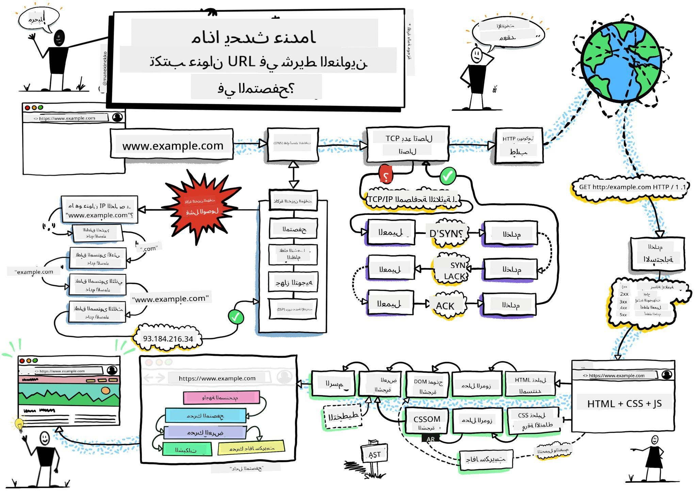
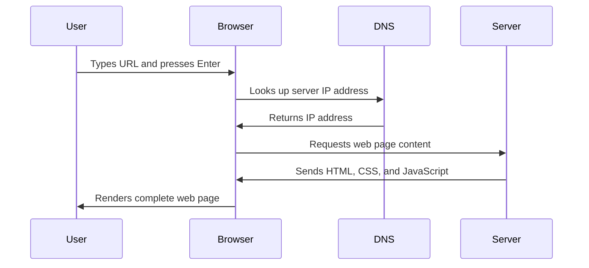
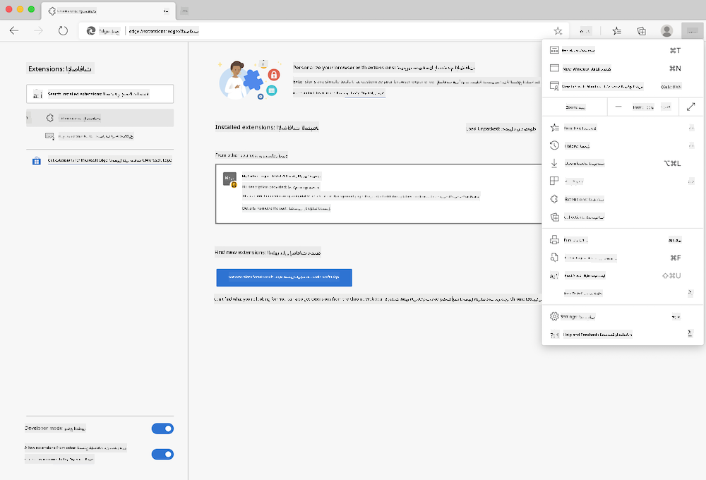
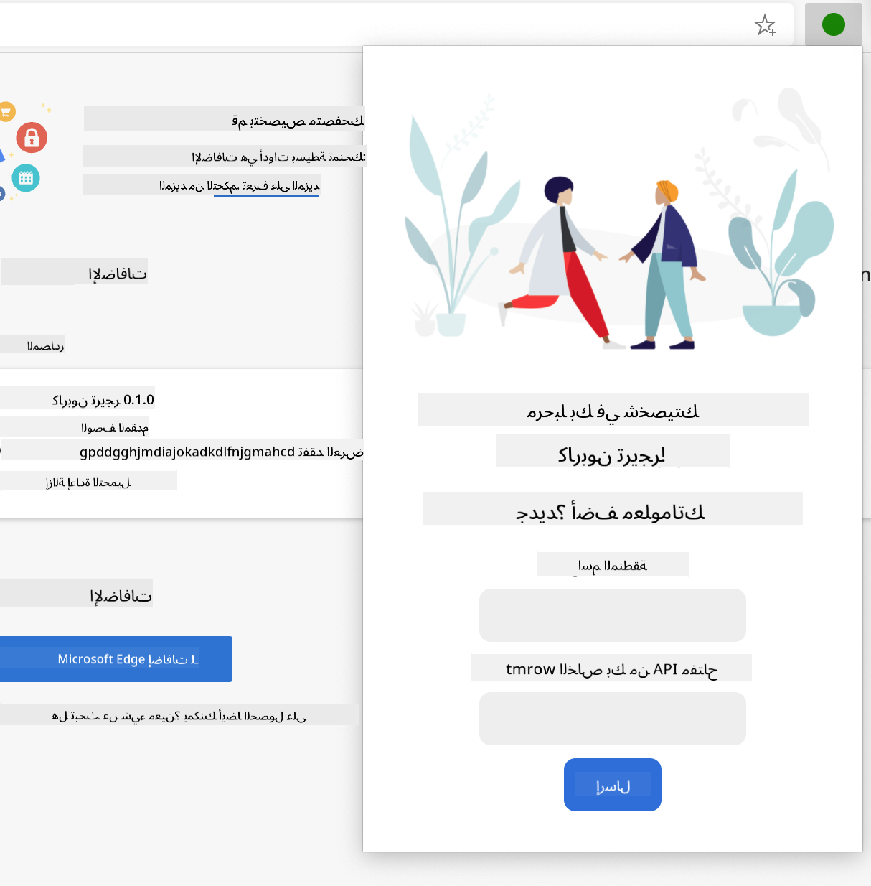
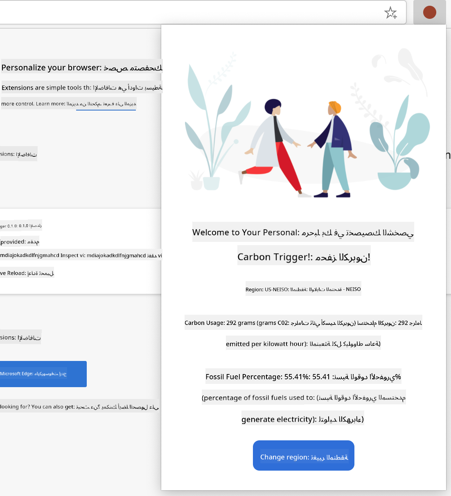

<!--
CO_OP_TRANSLATOR_METADATA:
{
  "original_hash": "33a875c522f237a2026e4653240dfc07",
  "translation_date": "2025-10-22T14:30:43+00:00",
  "source_file": "5-browser-extension/1-about-browsers/README.md",
  "language_code": "ar"
}
-->
# مشروع إضافة المتصفح الجزء الأول: كل شيء عن المتصفحات


> رسم توضيحي بواسطة [وسيم شغام](https://dev.to/wassimchegham/ever-wondered-what-happens-when-you-type-in-a-url-in-an-address-bar-in-a-browser-3dob)

## اختبار ما قبل المحاضرة

[اختبار ما قبل المحاضرة](https://ff-quizzes.netlify.app/web/quiz/23)

### المقدمة

إضافات المتصفح هي تطبيقات صغيرة تعزز تجربة التصفح على الإنترنت. مثل رؤية تيم بيرنرز لي الأصلية للويب التفاعلي، تعمل الإضافات على توسيع قدرات المتصفح إلى ما هو أبعد من مجرد عرض المستندات. من مديري كلمات المرور الذين يحافظون على أمان حساباتك إلى أدوات اختيار الألوان التي تساعد المصممين في اختيار الظلال المثالية، تحل الإضافات تحديات التصفح اليومية.

قبل أن نبني أول إضافة لك، دعنا نفهم كيف تعمل المتصفحات. تمامًا كما احتاج ألكسندر غراهام بيل إلى فهم نقل الصوت قبل اختراع الهاتف، فإن معرفة أساسيات المتصفح ستساعدك في إنشاء إضافات تتكامل بسلاسة مع أنظمة المتصفح الحالية.

بنهاية هذه الدرس، ستفهم بنية المتصفح وستبدأ في بناء أول إضافة لك.

## فهم متصفحات الويب

المتصفح هو في الأساس مترجم مستندات متقدم. عندما تكتب "google.com" في شريط العنوان، يقوم المتصفح بسلسلة معقدة من العمليات - طلب المحتوى من الخوادم حول العالم، ثم تحليل وعرض هذا الكود إلى صفحات ويب تفاعلية تراها.

هذه العملية تشبه كيف تم تصميم أول متصفح ويب، WorldWideWeb، بواسطة تيم بيرنرز لي في عام 1990 لجعل المستندات المرتبطة متاحة للجميع.

✅ **قليل من التاريخ**: أول متصفح كان يسمى "WorldWideWeb" وتم إنشاؤه بواسطة السير تيموثي بيرنرز لي في عام 1990.


> بعض المتصفحات القديمة، عبر [كارين ماكجرين](https://www.slideshare.net/KMcGrane/week-4-ixd-history-personal-computing)

### كيف تعالج المتصفحات محتوى الويب

العملية بين إدخال عنوان URL ورؤية صفحة ويب تتضمن عدة خطوات منسقة تحدث في غضون ثوانٍ:



**ما تحققه هذه العملية:**
- **ترجمة** عنوان URL القابل للقراءة البشرية إلى عنوان IP للخادم من خلال البحث في DNS
- **إنشاء** اتصال آمن مع خادم الويب باستخدام بروتوكولات HTTP أو HTTPS
- **طلب** محتوى صفحة الويب المحددة من الخادم
- **استلام** ترميز HTML، أنماط CSS، وكود JavaScript من الخادم
- **عرض** كل المحتوى في صفحة ويب تفاعلية تراها

### الميزات الأساسية للمتصفح

توفر المتصفحات الحديثة العديد من الميزات التي يمكن لمطوري الإضافات الاستفادة منها:

| الميزة | الغرض | فرص الإضافة |
|---------|---------|------------------------|
| **محرك العرض** | يعرض HTML، CSS، و JavaScript | تعديل المحتوى، حقن الأنماط |
| **محرك JavaScript** | ينفذ كود JavaScript | سكربتات مخصصة، تفاعلات API |
| **التخزين المحلي** | يحفظ البيانات محليًا | تفضيلات المستخدم، البيانات المؤقتة |
| **الشبكة** | يتعامل مع طلبات الويب | مراقبة الطلبات، تحليل البيانات |
| **نموذج الأمان** | يحمي المستخدمين من المحتوى الضار | تصفية المحتوى، تحسينات الأمان |

**فهم هذه الميزات يساعدك على:**
- **تحديد** أين يمكن لإضافتك أن تضيف أكبر قيمة
- **اختيار** واجهات برمجة التطبيقات المناسبة لإضافتك
- **تصميم** إضافات تعمل بكفاءة مع أنظمة المتصفح
- **ضمان** أن إضافتك تتبع أفضل ممارسات أمان المتصفح

### اعتبارات تطوير الإضافات عبر المتصفحات

تقوم المتصفحات المختلفة بتنفيذ المعايير مع اختلافات طفيفة، مثل كيفية تعامل لغات البرمجة المختلفة مع نفس الخوارزمية بشكل مختلف. يتمتع Chrome وFirefox وSafari بخصائص فريدة يجب على المطورين أخذها في الاعتبار أثناء تطوير الإضافات.

> 💡 **نصيحة احترافية**: استخدم [caniuse.com](https://www.caniuse.com) للتحقق من دعم تقنيات الويب عبر المتصفحات المختلفة. هذا لا يقدر بثمن عند التخطيط لميزات إضافتك!

**الاعتبارات الرئيسية لتطوير الإضافات:**
- **اختبار** إضافتك عبر متصفحات Chrome وFirefox وEdge
- **التكيف** مع واجهات برمجة التطبيقات المختلفة للإضافات وتنسيقات الملفات
- **التعامل** مع خصائص الأداء المختلفة والقيود
- **توفير** حلول بديلة للميزات الخاصة بالمتصفح التي قد لا تكون متاحة

✅ **رؤية تحليلية**: يمكنك تحديد المتصفحات التي يفضلها المستخدمون لديك من خلال تثبيت حزم التحليل في مشاريع تطوير الويب الخاصة بك. تساعدك هذه البيانات على تحديد أولويات المتصفحات التي يجب دعمها أولاً.

## فهم إضافات المتصفح

تحل إضافات المتصفح تحديات التصفح الشائعة من خلال إضافة وظائف مباشرة إلى واجهة المتصفح. بدلاً من الحاجة إلى تطبيقات منفصلة أو سير عمل معقد، توفر الإضافات وصولاً فوريًا إلى الأدوات والميزات.

هذا المفهوم يشبه كيف تصور رواد الحوسبة الأوائل مثل دوغلاس إنجلبارت تعزيز القدرات البشرية بالتكنولوجيا - الإضافات تعزز الوظائف الأساسية للمتصفح.

**فئات الإضافات الشائعة وفوائدها:**
- **أدوات الإنتاجية**: مديري المهام، تطبيقات تدوين الملاحظات، ومتعقبي الوقت التي تساعدك على التنظيم
- **تحسينات الأمان**: مديري كلمات المرور، حاصرات الإعلانات، وأدوات الخصوصية التي تحمي بياناتك
- **أدوات المطورين**: أدوات تنسيق الكود، أدوات اختيار الألوان، وأدوات التصحيح التي تبسط التطوير
- **تحسين المحتوى**: أوضاع القراءة، أدوات تنزيل الفيديو، وأدوات التقاط الشاشة التي تحسن تجربتك على الويب

✅ **سؤال للتفكير**: ما هي إضافات المتصفح المفضلة لديك؟ ما هي المهام المحددة التي تؤديها، وكيف تحسن تجربتك في التصفح؟

## تثبيت وإدارة الإضافات

فهم عملية تثبيت الإضافات يساعدك على توقع تجربة المستخدم عندما يقوم الأشخاص بتثبيت إضافتك. عملية التثبيت موحدة عبر المتصفحات الحديثة، مع اختلافات طفيفة في تصميم الواجهة.



> **مهم**: تأكد من تفعيل وضع المطور والسماح بالإضافات من المتاجر الأخرى عند اختبار إضافاتك الخاصة.

### عملية تثبيت إضافات التطوير

عندما تقوم بتطوير واختبار إضافاتك الخاصة، اتبع هذا سير العمل:

```bash
# Step 1: Build your extension
npm run build
```

**ما يحققه هذا الأمر:**
- **يجمع** كود المصدر الخاص بك إلى ملفات جاهزة للمتصفح
- **يجمع** وحدات JavaScript في حزم محسنة
- **ينشئ** ملفات الإضافة النهائية في مجلد `/dist`
- **يجهز** إضافتك للتثبيت والاختبار

**الخطوة 2: الانتقال إلى إضافات المتصفح**
1. **افتح** صفحة إدارة الإضافات في متصفحك
2. **انقر** على زر "الإعدادات والمزيد" (رمز `...`) في الزاوية العلوية اليمنى
3. **اختر** "الإضافات" من القائمة المنسدلة

**الخطوة 3: تحميل إضافتك**
- **للتثبيت الجديد**: اختر `load unpacked` وحدد مجلد `/dist` الخاص بك
- **للتحديثات**: انقر على `reload` بجانب الإضافة المثبتة بالفعل
- **للاختبار**: قم بتفعيل "وضع المطور" للوصول إلى ميزات التصحيح الإضافية

### تثبيت الإضافات للإنتاج

> ✅ **ملاحظة**: هذه التعليمات الخاصة بالتطوير مخصصة للإضافات التي تقوم ببنائها بنفسك. لتثبيت الإضافات المنشورة، قم بزيارة المتاجر الرسمية لإضافات المتصفح مثل [متجر إضافات Microsoft Edge](https://microsoftedge.microsoft.com/addons/Microsoft-Edge-Extensions-Home).

**فهم الفرق:**
- **تثبيت التطوير** يسمح لك باختبار الإضافات غير المنشورة أثناء التطوير
- **تثبيت المتجر** يوفر إضافات منشورة ومراجعة مع تحديثات تلقائية
- **التثبيت الجانبي** يسمح بتثبيت الإضافات من خارج المتاجر الرسمية (يتطلب وضع المطور)

## بناء إضافة بصمة الكربون الخاصة بك

سنقوم بإنشاء إضافة متصفح تعرض بصمة الكربون لاستخدام الطاقة في منطقتك. يوضح هذا المشروع مفاهيم تطوير الإضافات الأساسية أثناء إنشاء أداة عملية لزيادة الوعي البيئي.

يتبع هذا النهج مبدأ "التعلم من خلال العمل" الذي أثبت فعاليته منذ نظريات التعليم لجون ديوي - الجمع بين المهارات التقنية والتطبيقات الواقعية ذات المعنى.

### متطلبات المشروع

قبل بدء التطوير، دعنا نجمع الموارد والاعتماديات المطلوبة:

**الوصول إلى واجهات برمجة التطبيقات المطلوبة:**
- **[مفتاح API لإشارة CO2](https://www.co2signal.com/)**: أدخل عنوان بريدك الإلكتروني للحصول على مفتاح API مجاني
- **[رمز المنطقة](http://api.electricitymap.org/v3/zones)**: ابحث عن رمز منطقتك باستخدام [خريطة الكهرباء](https://www.electricitymap.org/map) (على سبيل المثال، تستخدم بوسطن 'US-NEISO')

**أدوات التطوير:**
- **[Node.js وNPM](https://www.npmjs.com)**: أداة إدارة الحزم لتثبيت اعتماديات المشروع
- **[كود البداية](../../../../5-browser-extension/start)**: قم بتنزيل مجلد `start` لبدء التطوير

✅ **تعلم المزيد**: عزز مهاراتك في إدارة الحزم مع هذا [الوحدة التعليمية الشاملة](https://docs.microsoft.com/learn/modules/create-nodejs-project-dependencies/?WT.mc_id=academic-77807-sagibbon)

### فهم هيكل المشروع

فهم هيكل المشروع يساعد على تنظيم العمل التطويري بكفاءة. مثل كيفية تنظيم مكتبة الإسكندرية لاسترجاع المعرفة بسهولة، فإن قاعدة كود منظمة جيدًا تجعل التطوير أكثر كفاءة:

```
project-root/
├── dist/                    # Built extension files
│   ├── manifest.json        # Extension configuration
│   ├── index.html           # User interface markup
│   ├── background.js        # Background script functionality
│   └── main.js              # Compiled JavaScript bundle
└── src/                     # Source development files
    └── index.js             # Your main JavaScript code
```

**تفصيل ما يحققه كل ملف:**
- **`manifest.json`**: **يحدد** بيانات التعريف للإضافة، الأذونات، ونقاط الدخول
- **`index.html`**: **ينشئ** واجهة المستخدم التي تظهر عند نقر المستخدمين على الإضافة
- **`background.js`**: **يتعامل** مع المهام الخلفية ومستمعي أحداث المتصفح
- **`main.js`**: **يحتوي** على كود JavaScript النهائي بعد عملية البناء
- **`src/index.js`**: **يضم** الكود الرئيسي للتطوير الذي يتم تجميعه إلى `main.js`

> 💡 **نصيحة تنظيمية**: قم بتخزين مفتاح API ورمز المنطقة في ملاحظة آمنة للرجوع إليها بسهولة أثناء التطوير. ستحتاج إلى هذه القيم لاختبار وظائف الإضافة.

✅ **ملاحظة أمان**: لا تقم أبدًا بإضافة مفاتيح API أو بيانات اعتماد حساسة إلى مستودع الكود الخاص بك. سنوضح لك كيفية التعامل مع هذه الأمور بأمان في الخطوات التالية.

## إنشاء واجهة الإضافة

الآن سنقوم ببناء مكونات واجهة المستخدم. تستخدم الإضافة نهج الشاشتين: شاشة الإعداد للتكوين الأولي وشاشة النتائج لعرض البيانات.

يتبع هذا مبدأ الكشف التدريجي المستخدم في تصميم الواجهات منذ الأيام الأولى للحوسبة - الكشف عن المعلومات والخيارات بتسلسل منطقي لتجنب إرباك المستخدمين.

### نظرة عامة على شاشات الإضافة

**شاشة الإعداد** - تكوين المستخدم لأول مرة:


**شاشة النتائج** - عرض بيانات بصمة الكربون:


### بناء نموذج التكوين

يجمع نموذج الإعداد بيانات تكوين المستخدم أثناء الاستخدام الأولي. بمجرد التكوين، يتم الاحتفاظ بهذه المعلومات في تخزين المتصفح للجلسات المستقبلية.

في ملف `/dist/index.html`، أضف هيكل النموذج التالي:

```html
<form class="form-data" autocomplete="on">
    <div>
        <h2>New? Add your Information</h2>
    </div>
    <div>
        <label for="region">Region Name</label>
        <input type="text" id="region" required class="region-name" />
    </div>
    <div>
        <label for="api">Your API Key from tmrow</label>
        <input type="text" id="api" required class="api-key" />
    </div>
    <button class="search-btn">Submit</button>
</form>
```

**ما يحققه هذا النموذج:**
- **ينشئ** هيكل نموذج دلالي مع تسميات ومدخلات مناسبة
- **يمكن** وظيفة الإكمال التلقائي للمتصفح لتحسين تجربة المستخدم
- **يتطلب** ملء كلا الحقلين قبل الإرسال باستخدام خاصية `required`
- **ينظم** المدخلات بأسماء صفوص وصفية لتسهيل التصميم واستهداف JavaScript
- **يوفر** تعليمات واضحة للمستخدمين الذين يقومون بإعداد الإضافة لأول مرة

### بناء عرض النتائج

بعد ذلك، قم بإنشاء منطقة النتائج التي ستعرض بيانات بصمة الكربون. أضف هذا الكود HTML أسفل النموذج:

```html
<div class="result">
    <div class="loading">loading...</div>
    <div class="errors"></div>
    <div class="data"></div>
    <div class="result-container">
        <p><strong>Region: </strong><span class="my-region"></span></p>
        <p><strong>Carbon Usage: </strong><span class="carbon-usage"></span></p>
        <p><strong>Fossil Fuel Percentage: </strong><span class="fossil-fuel"></span></p>
    </div>
    <button class="clear-btn">Change region</button>
</div>
```

**تفصيل ما يوفره هذا الهيكل:**
- **`loading`**: **يعرض** رسالة تحميل أثناء جلب بيانات API
- **`errors`**: **يعرض** رسائل خطأ إذا فشلت طلبات API أو كانت البيانات غير صالحة
- **`data`**: **يحتوي** على بيانات خام لأغراض التصحيح أثناء التطوير
- **`result-container`**: **يقدم** معلومات بصمة الكربون بشكل منسق للمستخدمين
- **`clear-btn`**: **يسمح** للمستخدمين بتغيير منطقتهم وإعادة تكوين الإضافة

### إعداد عملية البناء

الآن دعونا نقوم بتثبيت اعتماديات المشروع واختبار عملية البناء:

```bash
npm install
```

**ما تحققه عملية التثبيت هذه:**
- **تنزيل** Webpack واعتماديات التطوير الأخرى المحددة في `package.json`
- **تكوين** سلسلة أدوات البناء لتجميع JavaScript الحديث
- **إعداد** بيئة التطوير لبناء واختبار الإضافات
- **تمكين** تجميع الكود، التحسين، وميزات التوافق عبر المتصفحات

> 💡 **رؤية عملية البناء**: يقوم Webpack بتجميع كود المصدر الخاص بك من `/src/index.js` إلى `/dist/main.js`. تعمل هذه العملية على تحسين الكود للإنتاج وتضمن توافق المتصفح.

### اختبار تقدمك

في هذه المرحلة، يمكنك اختبار إضافتك:

1. **قم بتشغيل** أمر البناء لتجميع الكود الخاص بك
2. **قم بتحميل** الإضافة إلى متصفحك باستخدام وضع المطور
3. **تحقق** من أن النموذج يظهر بشكل صحيح ويبدو احترافيًا
4. **افحص** أن جميع عناصر النموذج مصفوفة بشكل صحيح وتعمل

**ما أنجزته:**
- **بنيت** الهيكل الأساسي لـ HTML لإضافتك
- **أنشأت** واجهات التكوين والنتائج مع ترميز دلالي مناسب
- **أعددت** سير عمل تطوير حديث باستخدام أدوات قياسية في الصناعة
- **جهزت** الأساس لإضافة وظائف JavaScript التفاعلية

لقد أكملت المرحلة الأولى من تطوير إضافات المتصفح. مثلما احتاج الأخوان رايت إلى فهم الديناميكا الهوائية قبل تحقيق الطيران، فإن فهم هذه المفاهيم الأساسية يجهزك لبناء ميزات تفاعلية أكثر تعقيدًا في الدرس التالي.

## تحدي وكيل GitHub Copilot 🚀

استخدم وضع الوكيل لإكمال التحدي التالي:
**الوصف:** تحسين امتداد المتصفح عن طريق إضافة ميزات التحقق من صحة النماذج وتقديم ملاحظات للمستخدم لتحسين تجربة المستخدم عند إدخال مفاتيح API وأكواد المناطق.

**المهمة:** قم بإنشاء وظائف تحقق في JavaScript للتحقق مما إذا كان حقل مفتاح API يحتوي على 20 حرفًا على الأقل وإذا كان رمز المنطقة يتبع التنسيق الصحيح (مثل 'US-NEISO'). أضف ملاحظات مرئية عن طريق تغيير ألوان حدود الإدخال إلى الأخضر للإدخالات الصحيحة والأحمر للإدخالات غير الصحيحة. كما أضف ميزة تبديل لعرض/إخفاء مفتاح API لأغراض الأمان.

تعرف على المزيد حول [وضع الوكيل](https://code.visualstudio.com/blogs/2025/02/24/introducing-copilot-agent-mode) هنا.

## 🚀 التحدي

قم بإلقاء نظرة على متجر امتدادات المتصفح وقم بتثبيت أحد الامتدادات على متصفحك. يمكنك فحص ملفاته بطرق مثيرة للاهتمام. ماذا تكتشف؟

## اختبار ما بعد المحاضرة

[اختبار ما بعد المحاضرة](https://ff-quizzes.netlify.app/web/quiz/24)

## المراجعة والدراسة الذاتية

في هذا الدرس تعلمت قليلاً عن تاريخ متصفح الويب؛ اغتنم هذه الفرصة لتتعرف على كيفية تصور مخترعي الشبكة العالمية لاستخدامها من خلال قراءة المزيد عن تاريخها. بعض المواقع المفيدة تشمل:

[تاريخ متصفحات الويب](https://www.mozilla.org/firefox/browsers/browser-history/)

[تاريخ الشبكة العالمية](https://webfoundation.org/about/vision/history-of-the-web/)

[مقابلة مع تيم بيرنرز-لي](https://www.theguardian.com/technology/2019/mar/12/tim-berners-lee-on-30-years-of-the-web-if-we-dream-a-little-we-can-get-the-web-we-want)

## الواجب 

[أعد تصميم امتدادك](assignment.md)

---

**إخلاء المسؤولية**:  
تم ترجمة هذا المستند باستخدام خدمة الترجمة بالذكاء الاصطناعي [Co-op Translator](https://github.com/Azure/co-op-translator). بينما نسعى لتحقيق الدقة، يرجى العلم أن الترجمات الآلية قد تحتوي على أخطاء أو عدم دقة. يجب اعتبار المستند الأصلي بلغته الأصلية المصدر الرسمي. للحصول على معلومات حاسمة، يُوصى بالترجمة البشرية الاحترافية. نحن غير مسؤولين عن أي سوء فهم أو تفسيرات خاطئة تنشأ عن استخدام هذه الترجمة.