<!--
CO_OP_TRANSLATOR_METADATA:
{
  "original_hash": "00aa85715e1efd4930c17a23e3012e69",
  "translation_date": "2025-11-03T12:49:34+00:00",
  "source_file": "5-browser-extension/1-about-browsers/README.md",
  "language_code": "ar"
}
-->
# مشروع إضافة المتصفح الجزء الأول: كل شيء عن المتصفحات

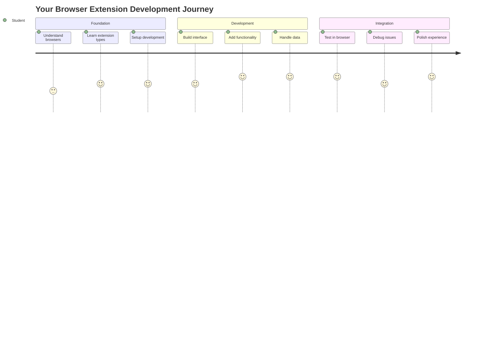

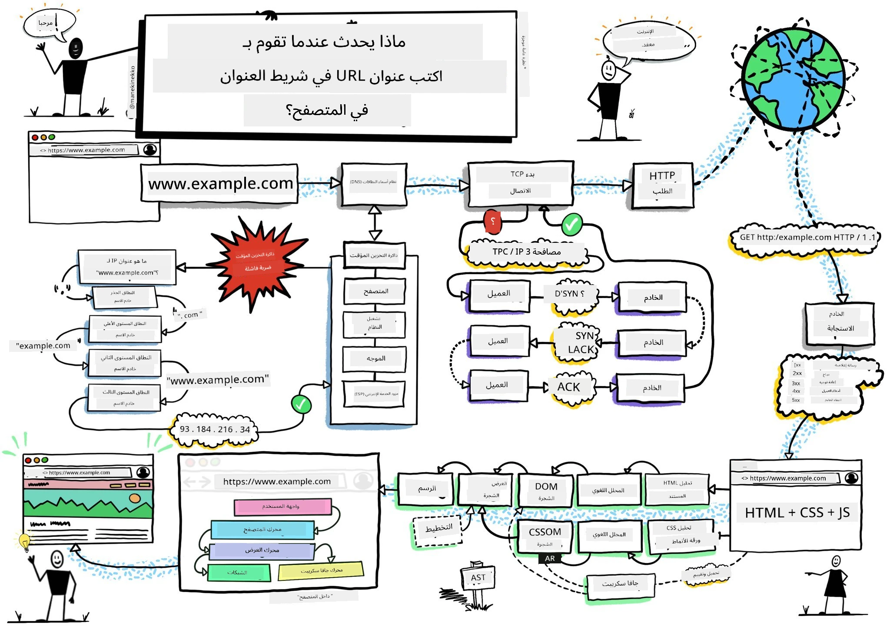
> رسم توضيحي بواسطة [وسيم شغام](https://dev.to/wassimchegham/ever-wondered-what-happens-when-you-type-in-a-url-in-an-address-bar-in-a-browser-3dob)

## اختبار ما قبل المحاضرة

[اختبار ما قبل المحاضرة](https://ff-quizzes.netlify.app/web/quiz/23)

### المقدمة

إضافات المتصفح هي تطبيقات صغيرة تعزز تجربة التصفح على الإنترنت. مثل رؤية تيم بيرنرز لي الأصلية للويب التفاعلي، تعمل الإضافات على توسيع قدرات المتصفح إلى ما هو أبعد من مجرد عرض المستندات. من مديري كلمات المرور الذين يحافظون على أمان حساباتك إلى أدوات اختيار الألوان التي تساعد المصممين في اختيار الألوان المثالية، تحل الإضافات تحديات التصفح اليومية.

قبل أن نبني أول إضافة لك، دعنا نفهم كيف تعمل المتصفحات. تمامًا كما احتاج ألكسندر غراهام بيل إلى فهم نقل الصوت قبل اختراع الهاتف، فإن معرفة أساسيات المتصفح ستساعدك على إنشاء إضافات تتكامل بسلاسة مع أنظمة المتصفح الحالية.

بنهاية هذه الدرس، ستفهم بنية المتصفح وستبدأ في بناء أول إضافة لك.

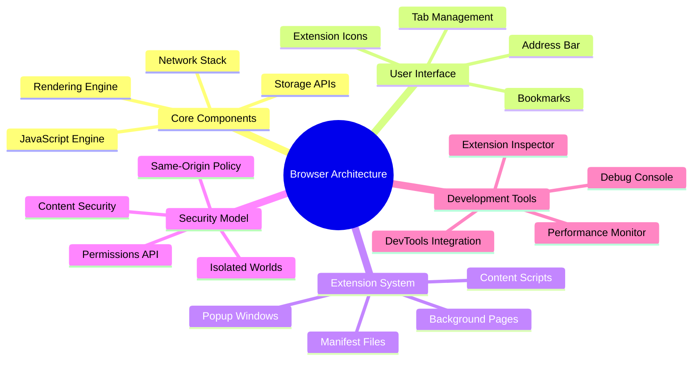

## فهم متصفحات الويب

المتصفح هو في الأساس مترجم مستندات متطور. عندما تكتب "google.com" في شريط العنوان، يقوم المتصفح بسلسلة معقدة من العمليات - طلب المحتوى من الخوادم حول العالم، ثم تحليل وعرض هذا الكود إلى صفحات ويب تفاعلية تراها.

هذه العملية تشبه كيفية تصميم أول متصفح ويب، WorldWideWeb، بواسطة تيم بيرنرز لي في عام 1990 لجعل المستندات المرتبطة متاحة للجميع.

✅ **قليل من التاريخ**: أول متصفح كان يسمى 'WorldWideWeb' وتم إنشاؤه بواسطة السير تيموثي بيرنرز لي في عام 1990.

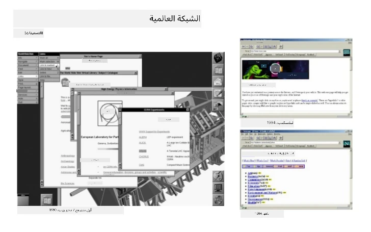
> بعض المتصفحات القديمة، عبر [كارين ماكجرين](https://www.slideshare.net/KMcGrane/week-4-ixd-history-personal-computing)

### كيف تعالج المتصفحات محتوى الويب

العملية بين إدخال عنوان URL ورؤية صفحة ويب تتضمن عدة خطوات منسقة تحدث في غضون ثوانٍ:

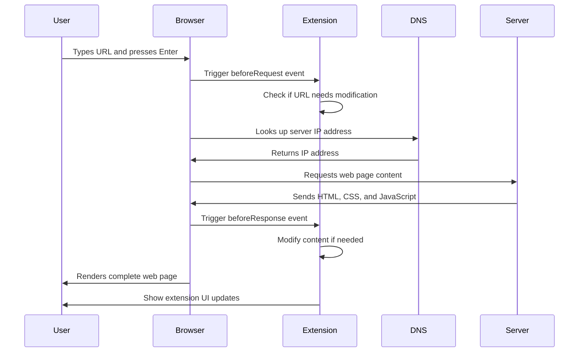

**ما تحققه هذه العملية:**
- **ترجمة** عنوان URL القابل للقراءة البشرية إلى عنوان IP للخادم من خلال البحث في DNS
- **إنشاء** اتصال آمن مع خادم الويب باستخدام بروتوكولات HTTP أو HTTPS
- **طلب** محتوى صفحة الويب المحددة من الخادم
- **استلام** ترميز HTML، أنماط CSS، وكود JavaScript من الخادم
- **عرض** كل المحتوى في صفحة ويب تفاعلية تراها

### الميزات الأساسية للمتصفح

توفر المتصفحات الحديثة العديد من الميزات التي يمكن لمطوري الإضافات الاستفادة منها:

| الميزة | الغرض | فرص الإضافة |
|---------|---------|------------------------|
| **محرك العرض** | يعرض HTML، CSS، وJavaScript | تعديل المحتوى، حقن الأنماط |
| **محرك JavaScript** | ينفذ كود JavaScript | سكربتات مخصصة، تفاعلات API |
| **التخزين المحلي** | يحفظ البيانات محليًا | تفضيلات المستخدم، البيانات المؤقتة |
| **الشبكة** | يتعامل مع طلبات الويب | مراقبة الطلبات، تحليل البيانات |
| **نموذج الأمان** | يحمي المستخدمين من المحتوى الضار | تصفية المحتوى، تحسينات الأمان |

**فهم هذه الميزات يساعدك على:**
- **تحديد** أين يمكن لإضافتك أن تضيف أكبر قيمة
- **اختيار** واجهات برمجة التطبيقات المناسبة لإضافة المتصفح الخاصة بك
- **تصميم** إضافات تعمل بكفاءة مع أنظمة المتصفح
- **ضمان** أن تتبع إضافتك أفضل ممارسات أمان المتصفح

### اعتبارات تطوير الإضافات عبر المتصفحات

تقوم المتصفحات المختلفة بتنفيذ المعايير مع اختلافات طفيفة، مثل كيفية تعامل لغات البرمجة المختلفة مع نفس الخوارزمية بشكل مختلف. Chrome، Firefox، وSafari لديهم خصائص فريدة يجب على المطورين أخذها في الاعتبار أثناء تطوير الإضافات.

> 💡 **نصيحة احترافية**: استخدم [caniuse.com](https://www.caniuse.com) للتحقق من دعم تقنيات الويب عبر المتصفحات المختلفة. هذا مفيد جدًا عند التخطيط لميزات إضافتك!

**الاعتبارات الرئيسية لتطوير الإضافات:**
- **اختبار** إضافتك عبر متصفحات Chrome، Firefox، وEdge
- **التكيف** مع واجهات برمجة التطبيقات المختلفة للإضافات وصيغ الملفات
- **التعامل** مع خصائص الأداء المختلفة والقيود
- **توفير** حلول بديلة للميزات الخاصة بالمتصفح التي قد لا تكون متاحة

✅ **رؤية تحليلية**: يمكنك تحديد المتصفحات التي يفضلها المستخدمون لديك عن طريق تثبيت حزم التحليل في مشاريع تطوير الويب الخاصة بك. تساعدك هذه البيانات في تحديد أولويات المتصفحات التي يجب دعمها أولاً.

## فهم إضافات المتصفح

تحل إضافات المتصفح تحديات التصفح الشائعة من خلال إضافة وظائف مباشرة إلى واجهة المتصفح. بدلاً من الحاجة إلى تطبيقات منفصلة أو سير عمل معقد، توفر الإضافات وصولاً فوريًا إلى الأدوات والميزات.

هذا المفهوم يعكس كيف تصور رواد الحوسبة الأوائل مثل دوغلاس إنجلبارت تعزيز القدرات البشرية بالتكنولوجيا - الإضافات تعزز الوظائف الأساسية للمتصفح.

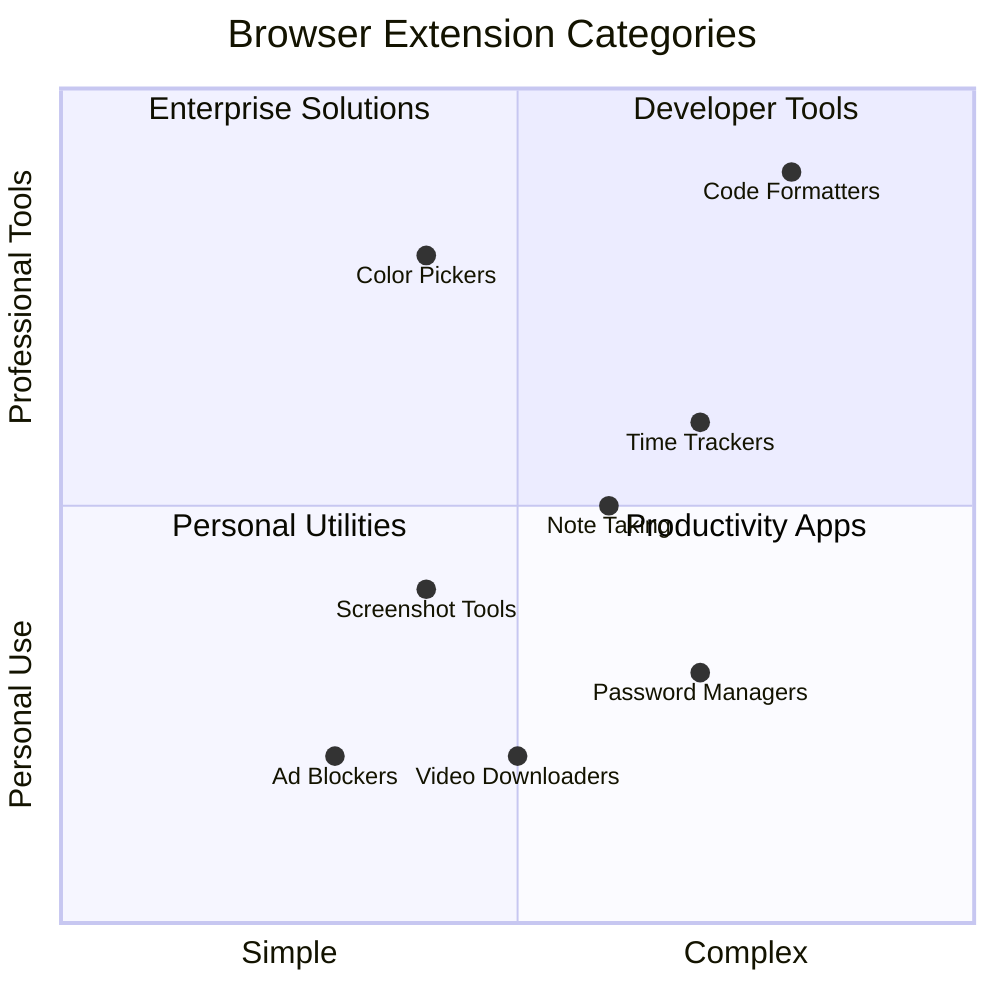

**فئات الإضافات الشائعة وفوائدها:**
- **أدوات الإنتاجية**: مديري المهام، تطبيقات تدوين الملاحظات، ومتعقبي الوقت التي تساعدك على التنظيم
- **تعزيزات الأمان**: مديري كلمات المرور، حاصرات الإعلانات، وأدوات الخصوصية التي تحمي بياناتك
- **أدوات المطورين**: منسقي الأكواد، أدوات اختيار الألوان، وأدوات تصحيح الأخطاء التي تسهل التطوير
- **تحسين المحتوى**: أوضاع القراءة، أدوات تنزيل الفيديو، وأدوات التقاط الشاشة التي تحسن تجربة الويب الخاصة بك

✅ **سؤال للتفكير**: ما هي إضافات المتصفح المفضلة لديك؟ ما هي المهام المحددة التي تؤديها، وكيف تحسن تجربة التصفح الخاصة بك؟

### 🔄 **تقييم تربوي**
**فهم بنية المتصفح**: قبل الانتقال إلى تطوير الإضافات، تأكد من أنك تستطيع:
- ✅ شرح كيفية معالجة المتصفحات لطلبات الويب وعرض المحتوى
- ✅ تحديد المكونات الرئيسية لبنية المتصفح
- ✅ فهم كيفية تكامل الإضافات مع وظائف المتصفح
- ✅ التعرف على نموذج الأمان الذي يحمي المستخدمين

**اختبار ذاتي سريع**: هل يمكنك تتبع المسار من كتابة عنوان URL إلى رؤية صفحة ويب؟
1. **البحث في DNS** يحول عنوان URL إلى عنوان IP
2. **طلب HTTP** يجلب المحتوى من الخادم
3. **التحليل** يعالج HTML، CSS، وJavaScript
4. **العرض** يظهر صفحة الويب النهائية
5. **الإضافات** يمكنها تعديل المحتوى في عدة خطوات

## تثبيت وإدارة الإضافات

فهم عملية تثبيت الإضافات يساعدك على توقع تجربة المستخدم عندما يقوم الأشخاص بتثبيت إضافتك. عملية التثبيت موحدة عبر المتصفحات الحديثة، مع اختلافات طفيفة في تصميم الواجهة.

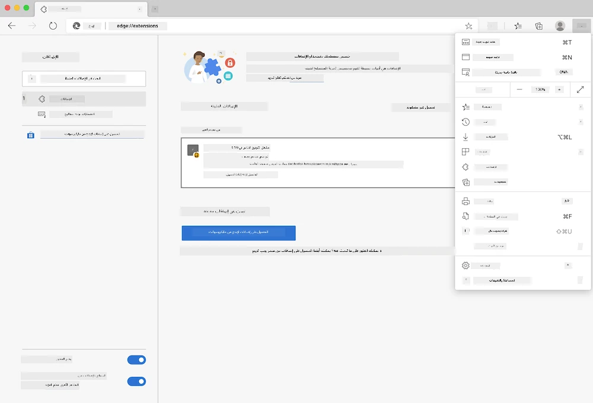

> **هام**: تأكد من تفعيل وضع المطور والسماح بالإضافات من المتاجر الأخرى عند اختبار إضافاتك الخاصة.

### عملية تثبيت الإضافات أثناء التطوير

عند تطوير واختبار إضافاتك الخاصة، اتبع هذا سير العمل:

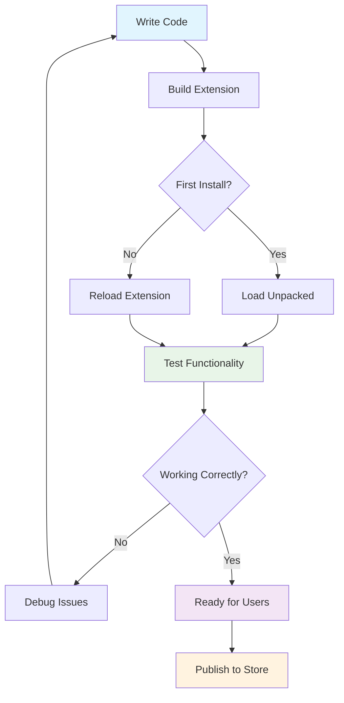

```bash
# Step 1: Build your extension
npm run build
```

**ما تحققه هذه الأوامر:**
- **تجميع** الكود المصدري إلى ملفات جاهزة للمتصفح
- **تجميع** وحدات JavaScript في حزم محسنة
- **إنشاء** ملفات الإضافة النهائية في مجلد `/dist`
- **تحضير** إضافتك للتثبيت والاختبار

**الخطوة 2: الانتقال إلى إدارة إضافات المتصفح**
1. **افتح** صفحة إدارة الإضافات في متصفحك
2. **انقر** على زر "الإعدادات والمزيد" (رمز `...`) في الزاوية العلوية اليمنى
3. **اختر** "الإضافات" من القائمة المنسدلة

**الخطوة 3: تحميل إضافتك**
- **للتثبيت الجديد**: اختر `load unpacked` وحدد مجلد `/dist`
- **للتحديثات**: انقر على `reload` بجانب الإضافة المثبتة بالفعل
- **للاختبار**: قم بتفعيل "وضع المطور" للوصول إلى ميزات تصحيح إضافية

### تثبيت الإضافات في الإنتاج

> ✅ **ملاحظة**: هذه التعليمات الخاصة بالتطوير مخصصة للإضافات التي تقوم ببنائها بنفسك. لتثبيت الإضافات المنشورة، قم بزيارة متاجر إضافات المتصفح الرسمية مثل [متجر إضافات Microsoft Edge](https://microsoftedge.microsoft.com/addons/Microsoft-Edge-Extensions-Home).

**فهم الفرق:**
- **تثبيت التطوير** يسمح لك باختبار الإضافات غير المنشورة أثناء التطوير
- **تثبيت المتجر** يوفر إضافات منشورة ومراجعة مع تحديثات تلقائية
- **التثبيت اليدوي** يسمح بتثبيت الإضافات من خارج المتاجر الرسمية (يتطلب وضع المطور)

## بناء إضافة بصمة الكربون

سنقوم بإنشاء إضافة متصفح تعرض بصمة الكربون لاستخدام الطاقة في منطقتك. يوضح هذا المشروع مفاهيم تطوير الإضافات الأساسية أثناء إنشاء أداة عملية لزيادة الوعي البيئي.

يتبع هذا النهج مبدأ "التعلم من خلال العمل" الذي أثبت فعاليته منذ نظريات التعليم لجون ديوي - الجمع بين المهارات التقنية والتطبيقات الواقعية ذات المغزى.

### متطلبات المشروع

قبل بدء التطوير، دعنا نجمع الموارد والاعتماديات المطلوبة:

**الوصول إلى واجهات برمجة التطبيقات المطلوبة:**
- **[مفتاح API لـ CO2 Signal](https://www.co2signal.com/)**: أدخل عنوان بريدك الإلكتروني للحصول على مفتاح API مجاني
- **[رمز المنطقة](http://api.electricitymap.org/v3/zones)**: ابحث عن رمز منطقتك باستخدام [خريطة الكهرباء](https://www.electricitymap.org/map) (على سبيل المثال، تستخدم بوسطن 'US-NEISO')

**أدوات التطوير:**
- **[Node.js وNPM](https://www.npmjs.com)**: أداة إدارة الحزم لتثبيت اعتماديات المشروع
- **[كود البداية](../../../../5-browser-extension/start)**: قم بتنزيل مجلد `start` لبدء التطوير

✅ **تعلم المزيد**: عزز مهاراتك في إدارة الحزم مع هذا [الوحدة التعليمية الشاملة](https://docs.microsoft.com/learn/modules/create-nodejs-project-dependencies/?WT.mc_id=academic-77807-sagibbon)

### فهم هيكل المشروع

فهم هيكل المشروع يساعد في تنظيم العمل التطويري بكفاءة. مثل كيفية تنظيم مكتبة الإسكندرية لاسترجاع المعرفة بسهولة، فإن قاعدة الكود المنظمة جيدًا تجعل التطوير أكثر كفاءة:

```
project-root/
├── dist/                    # Built extension files
│   ├── manifest.json        # Extension configuration
│   ├── index.html           # User interface markup
│   ├── background.js        # Background script functionality
│   └── main.js              # Compiled JavaScript bundle
├── src/                     # Source development files
│   └── index.js             # Your main JavaScript code
├── package.json             # Project dependencies and scripts
└── webpack.config.js        # Build configuration
```

**تفصيل ما يحققه كل ملف:**
- **`manifest.json`**: **يحدد** بيانات الإضافة، الأذونات، ونقاط الدخول
- **`index.html`**: **ينشئ** واجهة المستخدم التي تظهر عند نقر المستخدمين على الإضافة
- **`background.js`**: **يتعامل** مع المهام الخلفية ومستمعي أحداث المتصفح
- **`main.js`**: **يحتوي** على كود JavaScript النهائي بعد عملية البناء
- **`src/index.js`**: **يضم** الكود الرئيسي للتطوير الذي يتم تجميعه إلى `main.js`

> 💡 **نصيحة تنظيمية**: قم بتخزين مفتاح API ورمز المنطقة في ملاحظة آمنة للرجوع إليها بسهولة أثناء التطوير. ستحتاج إلى هذه القيم لاختبار وظائف الإضافة.

✅ **ملاحظة أمنية**: لا تقم أبدًا بإضافة مفاتيح API أو بيانات اعتماد حساسة إلى مستودع الكود الخاص بك. سنوضح لك كيفية التعامل مع هذه الأمور بأمان في الخطوات التالية.

## إنشاء واجهة الإضافة

الآن سنقوم ببناء مكونات واجهة المستخدم. تستخدم الإضافة نهج الشاشة الثنائية: شاشة الإعداد للتكوين الأولي وشاشة النتائج لعرض البيانات.

يتبع هذا مبدأ الكشف التدريجي المستخدم في تصميم الواجهات منذ الأيام الأولى للحوسبة - الكشف عن المعلومات والخيارات بترتيب منطقي لتجنب إرباك المستخدمين.

### نظرة عامة على شاشات الإضافة

**شاشة الإعداد** - تكوين المستخدم لأول مرة:
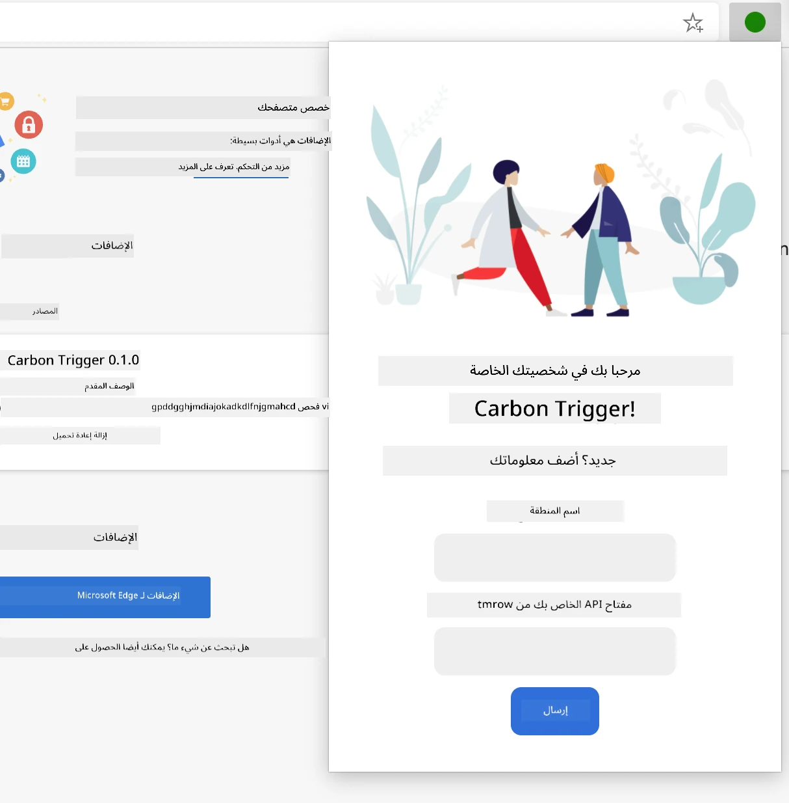

**شاشة النتائج** - عرض بيانات بصمة الكربون:
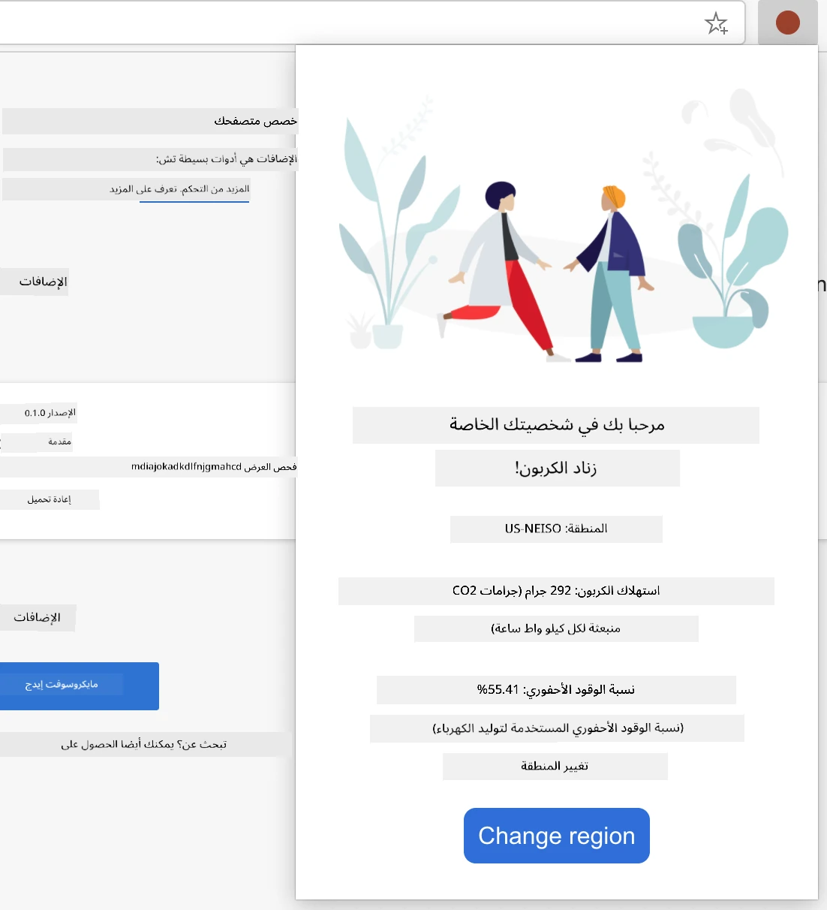

### بناء نموذج التكوين

يجمع نموذج الإعداد بيانات تكوين المستخدم أثناء الاستخدام الأول. بمجرد التكوين، تبقى هذه المعلومات في تخزين المتصفح للجلسات المستقبلية.

في ملف `/dist/index.html`، أضف هيكل النموذج التالي:

```html
<form class="form-data" autocomplete="on">
    <div>
        <h2>New? Add your Information</h2>
    </div>
    <div>
        <label for="region">Region Name</label>
        <input type="text" id="region" required class="region-name" />
    </div>
    <div>
        <label for="api">Your API Key from tmrow</label>
        <input type="text" id="api" required class="api-key" />
    </div>
    <button class="search-btn">Submit</button>
</form>
```

**ما يحققه هذا النموذج:**
- **إنشاء** هيكل نموذج دلالي مع تسميات ومدخلات مناسبة
- **تمكين** وظيفة الإكمال التلقائي للمتصفح لتحسين تجربة المستخدم
- **طلب** ملء كلا الحقلين قبل الإرسال باستخدام خاصية `required`
- **تنظيم** المدخلات بأسماء فئات وصفية لتسهيل التخصيص والاستهداف باستخدام JavaScript
- **توفير** تعليمات واضحة للمستخدمين الذين يقومون بإعداد الإضافة لأول مرة

### بناء عرض النتائج

بعد ذلك، قم بإنشاء منطقة النتائج التي ستعرض بيانات بصمة الكربون. أضف هذا HTML أسفل النموذج:

```html
<div class="result">
    <div class="loading">loading...</div>
    <div class="errors"></div>
    <div class="data"></div>
    <div class="result-container">
        <p><strong>Region: </strong><span class="my-region"></span></p>
        <p><strong>Carbon Usage: </strong><span class="carbon-usage"></span></p>
        <p><strong>Fossil Fuel Percentage: </strong><span class="fossil-fuel"></span></p>
    </div>
    <button class="clear-btn">Change region</button>
</div>
```

**تفصيل ما يوفره هذا الهيكل:**
- **`loading`**: **يعرض** رسالة تحميل أثناء جلب بيانات API
- **`errors`**: **يعرض** رسائل خطأ إذا فشلت مكالمات API أو كانت البيانات غير صالحة
- **`data`**: **يحتوي** على بيانات خام لأغراض التصحيح أثناء التطوير
- **`result-container`**: **يقدم** معلومات بصمة الكربون بشكل منسق للمستخدمين
- **`clear-btn`**: **يسمح** للمستخدمين بتغيير منطقتهم وإعادة تكوين الإضافة

### إعداد عملية البناء

الآن دعنا نقوم بتثبيت اعتماديات المشروع واختبار عملية البناء:

```bash
npm install
```

**ما تحققه عملية التثبيت هذه:**
- **تنزيل** Webpack واعتماديات التطوير الأخرى المحددة في `package.json`
- **تكوين** سلسلة أدوات البناء لتجميع JavaScript الحديث
- **تحضير** بيئة التطوير لبناء الإضافات واختبارها
- **تمكين** تجميع الكود، التحسين، وميزات التوافق عبر المتصفحات

> 💡 **رؤية حول عملية البناء**: يقوم Webpack بتجميع الكود المصدري الخاص بك من `/src/index.js` إلى `/dist/main.js`. هذه العملية تحسن الكود الخاص بك للإنتاج وتضمن توافق المتصفح.

### اختبار تقدمك

في هذه المرحلة، يمكنك اختبار الإضافة الخاصة بك:
1. **قم بتشغيل** أمر البناء لتجميع الكود الخاص بك  
2. **قم بتحميل** الامتداد في متصفحك باستخدام وضع المطور  
3. **تحقق** من أن النموذج يظهر بشكل صحيح ويبدو احترافيًا  
4. **افحص** أن جميع عناصر النموذج متناسقة وتعمل بشكل جيد  

**ما الذي أنجزته:**  
- **بنيت** الهيكل الأساسي لـ HTML الخاص بامتدادك  
- **أنشأت** واجهات التكوين والنتائج باستخدام علامات دلالية صحيحة  
- **أعددت** سير عمل تطوير حديث باستخدام أدوات قياسية في الصناعة  
- **جهزت** الأساس لإضافة وظائف JavaScript التفاعلية  

### 🔄 **مراجعة تعليمية**  
**تقدم تطوير الامتداد**: تحقق من فهمك قبل المتابعة:  
- ✅ هل يمكنك شرح الغرض من كل ملف في هيكل المشروع؟  
- ✅ هل تفهم كيف يحول عملية البناء الكود المصدر الخاص بك؟  
- ✅ لماذا نفصل بين التكوين والنتائج في أقسام واجهة مستخدم مختلفة؟  
- ✅ كيف يدعم هيكل النموذج سهولة الاستخدام وإمكانية الوصول؟  

**فهم سير العمل التطويري**: يجب أن تكون الآن قادرًا على:  
1. **تعديل** HTML وCSS لواجهة امتدادك  
2. **تشغيل** أمر البناء لتجميع التعديلات  
3. **إعادة تحميل** الامتداد في متصفحك لاختبار التحديثات  
4. **تصحيح الأخطاء** باستخدام أدوات المطور في المتصفح  

لقد أكملت المرحلة الأولى من تطوير امتداد المتصفح. كما احتاج الأخوان رايت لفهم الديناميكا الهوائية قبل تحقيق الطيران، فإن فهم هذه المفاهيم الأساسية يجهزك لبناء ميزات تفاعلية أكثر تعقيدًا في الدرس التالي.  

## تحدي وكيل GitHub Copilot 🚀  

استخدم وضع الوكيل لإكمال التحدي التالي:  

**الوصف:** قم بتحسين امتداد المتصفح عن طريق إضافة ميزات التحقق من صحة النموذج وردود فعل المستخدم لتحسين تجربة المستخدم عند إدخال مفاتيح API ورموز المناطق.  

**المهمة:** قم بإنشاء وظائف تحقق في JavaScript للتحقق من أن حقل مفتاح API يحتوي على 20 حرفًا على الأقل وأن رمز المنطقة يتبع التنسيق الصحيح (مثل 'US-NEISO'). أضف ردود فعل مرئية عن طريق تغيير ألوان حدود الإدخال إلى الأخضر للإدخالات الصحيحة والأحمر للإدخالات غير الصحيحة. أضف أيضًا ميزة تبديل لإظهار/إخفاء مفتاح API لأغراض الأمان.  

تعرف على المزيد حول [وضع الوكيل](https://code.visualstudio.com/blogs/2025/02/24/introducing-copilot-agent-mode) هنا.  

## 🚀 التحدي  

قم بإلقاء نظرة على متجر امتدادات المتصفح وقم بتثبيت واحد في متصفحك. يمكنك فحص ملفاته بطرق مثيرة للاهتمام. ماذا تكتشف؟  

## اختبار ما بعد المحاضرة  

[اختبار ما بعد المحاضرة](https://ff-quizzes.netlify.app/web/quiz/24)  

## المراجعة والدراسة الذاتية  

في هذا الدرس تعلمت قليلاً عن تاريخ متصفح الويب؛ اغتنم هذه الفرصة لتتعرف على كيفية تصور مخترعي الشبكة العالمية لاستخدامها من خلال قراءة المزيد عن تاريخها. بعض المواقع المفيدة تشمل:  

[تاريخ متصفحات الويب](https://www.mozilla.org/firefox/browsers/browser-history/)  

[تاريخ الشبكة](https://webfoundation.org/about/vision/history-of-the-web/)  

[مقابلة مع تيم بيرنرز لي](https://www.theguardian.com/technology/2019/mar/12/tim-berners-lee-on-30-years-of-the-web-if-we-dream-a-little-we-can-get-the-web-we-want)  

### ⚡ **ما يمكنك القيام به في الدقائق الخمس القادمة**  
- [ ] افتح صفحة امتدادات Chrome/Edge (chrome://extensions) واستكشف ما لديك مثبت  
- [ ] انظر إلى علامة الشبكة في أدوات المطور في المتصفح أثناء تحميل صفحة ويب  
- [ ] حاول عرض مصدر الصفحة (Ctrl+U) لرؤية هيكل HTML  
- [ ] افحص أي عنصر في صفحة ويب وعدل CSS الخاص به في أدوات المطور  

### 🎯 **ما يمكنك إنجازه خلال الساعة**  
- [ ] أكمل اختبار ما بعد الدرس وافهم أساسيات المتصفح  
- [ ] أنشئ ملف manifest.json أساسي لامتداد المتصفح  
- [ ] قم ببناء امتداد بسيط "Hello World" يظهر نافذة منبثقة  
- [ ] اختبر تحميل امتدادك في وضع المطور  
- [ ] استكشف وثائق امتدادات المتصفح للمتصفح المستهدف  

### 📅 **رحلة تطوير الامتداد الخاصة بك لمدة أسبوع**  
- [ ] أكمل امتداد متصفح وظيفي ذو فائدة حقيقية  
- [ ] تعلم عن نصوص المحتوى، والنصوص الخلفية، وتفاعلات النوافذ المنبثقة  
- [ ] أتقن واجهات برمجة التطبيقات الخاصة بالمتصفح مثل التخزين، وعلامات التبويب، والرسائل  
- [ ] صمم واجهات مستخدم سهلة الاستخدام لامتدادك  
- [ ] اختبر امتدادك عبر مواقع وسيناريوهات مختلفة  
- [ ] انشر امتدادك في متجر امتدادات المتصفح  

### 🌟 **رحلة تطوير المتصفح الخاصة بك لمدة شهر**  
- [ ] قم ببناء امتدادات متعددة تحل مشاكل المستخدمين المختلفة  
- [ ] تعلم واجهات برمجة التطبيقات المتقدمة وأفضل ممارسات الأمان  
- [ ] ساهم في مشاريع امتدادات المتصفح مفتوحة المصدر  
- [ ] أتقن التوافق عبر المتصفحات والتحسين التدريجي  
- [ ] أنشئ أدوات تطوير الامتدادات وقوالب للآخرين  
- [ ] كن خبيرًا في امتدادات المتصفح يساعد المطورين الآخرين  

## 🎯 جدول زمني لإتقان امتدادات المتصفح  

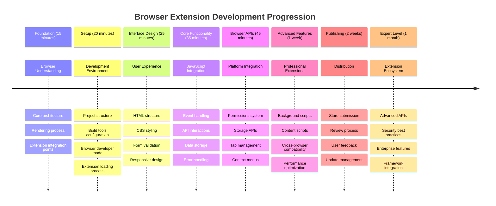
  
### 🛠️ ملخص أدوات تطوير الامتداد الخاصة بك  

بعد إكمال هذا الدرس، لديك الآن:  
- **معرفة بنية المتصفح**: فهم محركات العرض، نماذج الأمان، وتكامل الامتدادات  
- **بيئة تطوير**: سلسلة أدوات حديثة مع Webpack، NPM، وإمكانيات التصحيح  
- **أساسيات واجهة المستخدم/تجربة المستخدم**: هيكل HTML دلالي مع أنماط الكشف التدريجي  
- **وعي أمني**: فهم أذونات المتصفح وممارسات التطوير الآمن  
- **مفاهيم عبر المتصفحات**: معرفة اعتبارات التوافق ونهج الاختبار  
- **تكامل API**: أساس للعمل مع مصادر البيانات الخارجية  
- **سير عمل احترافي**: إجراءات تطوير واختبار قياسية في الصناعة  

**تطبيقات العالم الحقيقي**: هذه المهارات تنطبق مباشرة على:  
- **تطوير الويب**: تطبيقات الصفحة الواحدة وتطبيقات الويب التقدمية  
- **تطبيقات سطح المكتب**: برامج سطح المكتب المستندة إلى الويب وElectron  
- **تطوير الجوال**: التطبيقات الهجينة وحلول الجوال المستندة إلى الويب  
- **أدوات المؤسسات**: تطبيقات الإنتاجية الداخلية وأتمتة سير العمل  
- **المصادر المفتوحة**: المساهمة في مشاريع امتدادات المتصفح ومعايير الويب  

**المستوى التالي**: أنت جاهز لإضافة وظائف تفاعلية، العمل مع واجهات برمجة التطبيقات الخاصة بالمتصفح، وإنشاء امتدادات تحل مشاكل المستخدمين الحقيقية!  

## المهمة  

[أعد تصميم امتدادك](assignment.md)  

---

**إخلاء المسؤولية**:  
تم ترجمة هذا المستند باستخدام خدمة الترجمة بالذكاء الاصطناعي [Co-op Translator](https://github.com/Azure/co-op-translator). بينما نسعى لتحقيق الدقة، يرجى العلم أن الترجمات الآلية قد تحتوي على أخطاء أو عدم دقة. يجب اعتبار المستند الأصلي بلغته الأصلية المصدر الموثوق. للحصول على معلومات حاسمة، يُوصى بالترجمة البشرية الاحترافية. نحن غير مسؤولين عن أي سوء فهم أو تفسيرات خاطئة ناتجة عن استخدام هذه الترجمة.