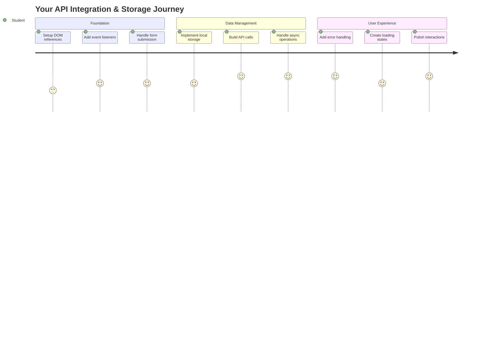
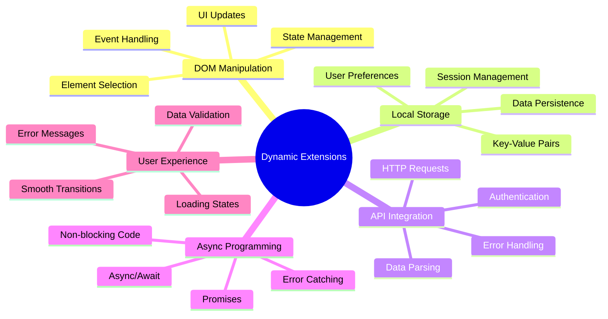
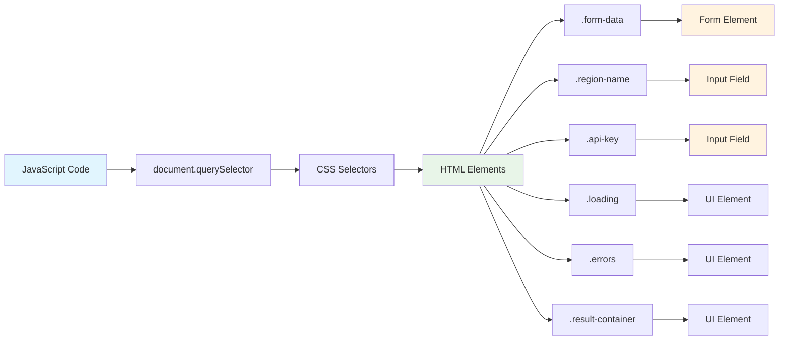
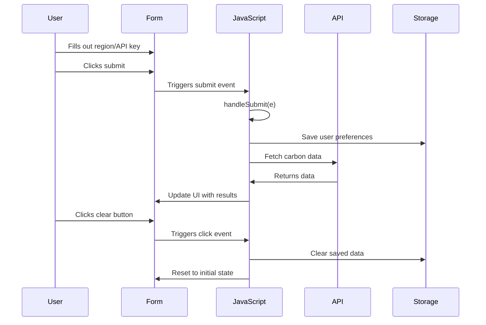
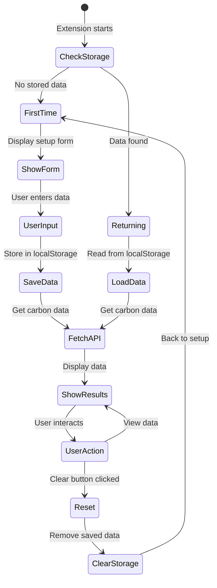
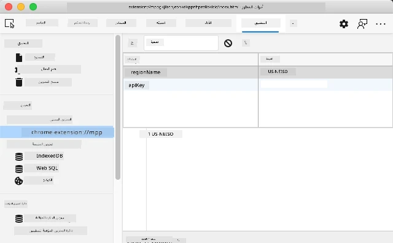
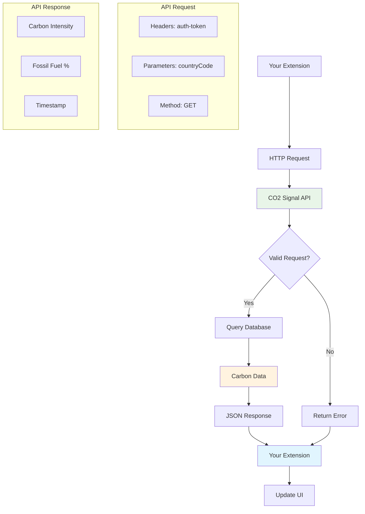
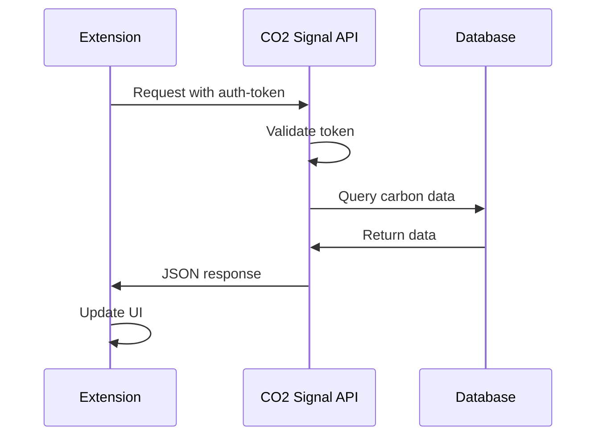
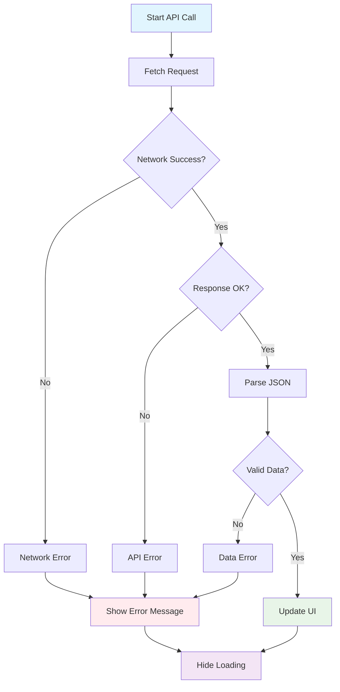
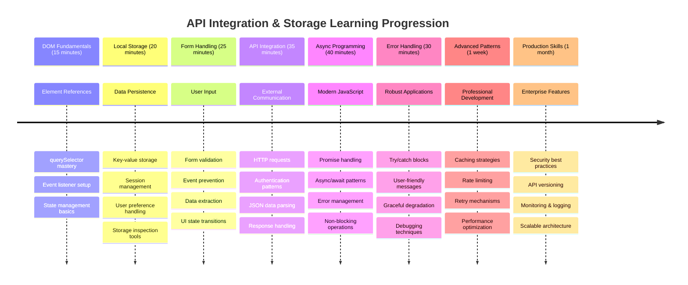

# مشروع إضافة المتصفح الجزء الثاني: الاتصال بـ API واستخدام التخزين المحلي



## اختبار ما قبل المحاضرة

[اختبار ما قبل المحاضرة](https://ff-quizzes.netlify.app/web/quiz/25)

## المقدمة

هل تتذكر إضافة المتصفح التي بدأت في بنائها؟ في الوقت الحالي لديك نموذج جميل المظهر، لكنه في الأساس ثابت. اليوم سنجعلها تنبض بالحياة من خلال الاتصال ببيانات حقيقية ومنحها ذاكرة.

فكر في أجهزة الكمبيوتر الخاصة بمهمة أبولو - لم تكن تعرض معلومات ثابتة فقط. بل كانت تتواصل باستمرار مع المركبة الفضائية، وتُحدث البيانات التليمترية، وتحتفظ بمعايير المهمة الحرجة. هذا هو نوع السلوك الديناميكي الذي نبنيه اليوم. ستقوم الإضافة الخاصة بك بالاتصال بالإنترنت، وجلب بيانات بيئية حقيقية، وتذكر إعداداتك للمرة القادمة.

قد يبدو تكامل API معقدًا، لكنه في الحقيقة مجرد تعليم الكود الخاص بك كيفية التواصل مع الخدمات الأخرى. سواء كنت تجلب بيانات الطقس، أو خلاصات وسائل التواصل الاجتماعي، أو معلومات البصمة الكربونية كما سنفعل اليوم، فإن الأمر كله يتعلق بإنشاء هذه الروابط الرقمية. سنستكشف أيضًا كيف يمكن للمتصفحات الاحتفاظ بالمعلومات - مثلما استخدمت المكتبات بطاقات الفهرسة لتذكر مكان الكتب.

بنهاية هذا الدرس، سيكون لديك إضافة متصفح تجلب بيانات حقيقية، تخزن تفضيلات المستخدم، وتوفر تجربة سلسة. لنبدأ!



✅ اتبع الأجزاء المرقمة في الملفات المناسبة لمعرفة مكان وضع الكود الخاص بك

## إعداد العناصر للتعامل معها في الإضافة

قبل أن يتمكن JavaScript الخاص بك من التعامل مع الواجهة، يحتاج إلى مراجع لعناصر HTML محددة. فكر في الأمر مثل التلسكوب الذي يحتاج إلى أن يتم توجيهه نحو نجوم معينة - قبل أن يتمكن غاليليو من دراسة أقمار المشتري، كان عليه أن يحدد موقع المشتري نفسه ويركز عليه.

في ملف `index.js` الخاص بك، سنقوم بإنشاء متغيرات `const` تلتقط مراجع لكل عنصر مهم في النموذج. هذا مشابه لكيفية تسمية العلماء لمعداتهم - بدلاً من البحث في المختبر بأكمله في كل مرة، يمكنهم الوصول مباشرة إلى ما يحتاجونه.



```javascript
// form fields
const form = document.querySelector('.form-data');
const region = document.querySelector('.region-name');
const apiKey = document.querySelector('.api-key');

// results
const errors = document.querySelector('.errors');
const loading = document.querySelector('.loading');
const results = document.querySelector('.result-container');
const usage = document.querySelector('.carbon-usage');
const fossilfuel = document.querySelector('.fossil-fuel');
const myregion = document.querySelector('.my-region');
const clearBtn = document.querySelector('.clear-btn');
```

**ما الذي يفعله هذا الكود:**
- **يلتقط** عناصر النموذج باستخدام `document.querySelector()` مع محددات CSS
- **ينشئ** مراجع لحقول الإدخال لاسم المنطقة ومفتاح API
- **يؤسس** اتصالات لعناصر عرض النتائج لبيانات استخدام الكربون
- **يُعد** الوصول إلى عناصر واجهة المستخدم مثل مؤشرات التحميل ورسائل الخطأ
- **يخزن** كل مرجع عنصر في متغير `const` لإعادة الاستخدام بسهولة في الكود الخاص بك

## إضافة مستمعي الأحداث

الآن سنجعل الإضافة الخاصة بك تستجيب لإجراءات المستخدم. مستمعو الأحداث هم طريقة الكود الخاص بك لمراقبة تفاعلات المستخدم. فكر فيهم مثل مشغلي الهواتف في التبادلات الهاتفية المبكرة - كانوا يستمعون للمكالمات الواردة ويصلون الدوائر الصحيحة عندما يريد شخص ما إجراء اتصال.



```javascript
form.addEventListener('submit', (e) => handleSubmit(e));
clearBtn.addEventListener('click', (e) => reset(e));
init();
```

**فهم هذه المفاهيم:**
- **يربط** مستمع إرسال بالنموذج الذي يتم تشغيله عندما يضغط المستخدمون على Enter أو ينقرون على إرسال
- **يتصل** بمستمع النقر على زر المسح لإعادة تعيين النموذج
- **يمرر** كائن الحدث `(e)` إلى وظائف المعالجة للتحكم الإضافي
- **يستدعي** وظيفة `init()` فورًا لإعداد الحالة الأولية للإضافة الخاصة بك

✅ لاحظ اختصار صيغة وظيفة السهم المستخدمة هنا. هذا النهج الحديث في JavaScript أنظف من تعبيرات الوظائف التقليدية، لكن كلاهما يعمل بشكل جيد!

### 🔄 **توقف تربوي**
**فهم التعامل مع الأحداث**: قبل الانتقال إلى التهيئة، تأكد من أنك تستطيع:
- ✅ شرح كيف يربط `addEventListener` إجراءات المستخدم بوظائف JavaScript
- ✅ فهم لماذا نمرر كائن الحدث `(e)` إلى وظائف المعالجة
- ✅ التعرف على الفرق بين أحداث `submit` و `click`
- ✅ وصف متى تعمل وظيفة `init()` ولماذا

**اختبار ذاتي سريع**: ماذا سيحدث إذا نسيت `e.preventDefault()` في إرسال النموذج؟
*الإجابة: ستتم إعادة تحميل الصفحة، مما يؤدي إلى فقدان حالة JavaScript بالكامل وتعطيل تجربة المستخدم*

## بناء وظائف التهيئة وإعادة التعيين

لنقم بإنشاء منطق التهيئة للإضافة الخاصة بك. وظيفة `init()` تشبه نظام الملاحة للسفينة الذي يتحقق من أدواته - تحدد الحالة الحالية وتضبط الواجهة وفقًا لذلك. تتحقق مما إذا كان شخص ما قد استخدم الإضافة الخاصة بك من قبل وتحمل إعداداته السابقة.

وظيفة `reset()` توفر للمستخدمين بداية جديدة - مشابهة لكيفية إعادة العلماء ضبط أدواتهم بين التجارب لضمان بيانات نظيفة.

```javascript
function init() {
	// Check if user has previously saved API credentials
	const storedApiKey = localStorage.getItem('apiKey');
	const storedRegion = localStorage.getItem('regionName');

	// Set extension icon to generic green (placeholder for future lesson)
	// TODO: Implement icon update in next lesson

	if (storedApiKey === null || storedRegion === null) {
		// First-time user: show the setup form
		form.style.display = 'block';
		results.style.display = 'none';
		loading.style.display = 'none';
		clearBtn.style.display = 'none';
		errors.textContent = '';
	} else {
		// Returning user: load their saved data automatically
		displayCarbonUsage(storedApiKey, storedRegion);
		results.style.display = 'none';
		form.style.display = 'none';
		clearBtn.style.display = 'block';
	}
}

function reset(e) {
	e.preventDefault();
	// Clear stored region to allow user to choose a new location
	localStorage.removeItem('regionName');
	// Restart the initialization process
	init();
}
```

**تفصيل ما يحدث هنا:**
- **يسترجع** مفتاح API والمنطقة المخزنة من التخزين المحلي للمتصفح
- **يتحقق** مما إذا كان هذا مستخدمًا لأول مرة (لا توجد بيانات مخزنة) أو مستخدمًا عائدًا
- **يعرض** نموذج الإعداد للمستخدمين الجدد ويخفي عناصر الواجهة الأخرى
- **يحمل** البيانات المحفوظة تلقائيًا للمستخدمين العائدين ويعرض خيار إعادة التعيين
- **يدير** حالة واجهة المستخدم بناءً على البيانات المتاحة

**مفاهيم رئيسية حول التخزين المحلي:**
- **يحافظ** على البيانات بين جلسات المتصفح (على عكس تخزين الجلسة)
- **يخزن** البيانات كأزواج مفتاح-قيمة باستخدام `getItem()` و `setItem()`
- **يعيد** `null` عندما لا توجد بيانات لمفتاح معين
- **يوفر** طريقة بسيطة لتذكر تفضيلات وإعدادات المستخدم

> 💡 **فهم تخزين المتصفح**: [LocalStorage](https://developer.mozilla.org/docs/Web/API/Window/localStorage) يشبه إعطاء الإضافة الخاصة بك ذاكرة دائمة. فكر في كيفية تخزين مكتبة الإسكندرية القديمة لللفائف - المعلومات ظلت متاحة حتى عندما غادر العلماء وعادوا.
>
> **خصائص رئيسية:**
> - **يحافظ** على البيانات حتى بعد إغلاق المتصفح
> - **ينجو** من إعادة تشغيل الكمبيوتر وتعطل المتصفح
> - **يوفر** مساحة تخزين كبيرة لتفضيلات المستخدم
> - **يقدم** وصولًا فوريًا بدون تأخير الشبكة

> **ملاحظة مهمة**: الإضافة الخاصة بك لديها تخزين محلي معزول خاص بها منفصل عن صفحات الويب العادية. هذا يوفر الأمان ويمنع التعارض مع مواقع الويب الأخرى.

يمكنك عرض البيانات المخزنة الخاصة بك عن طريق فتح أدوات المطور في المتصفح (F12)، الانتقال إلى علامة التبويب **Application**، وتوسيع قسم **Local Storage**.





> ⚠️ **اعتبار أمني**: في التطبيقات الإنتاجية، تخزين مفاتيح API في LocalStorage يشكل مخاطر أمنية لأن JavaScript يمكنه الوصول إلى هذه البيانات. لأغراض التعلم، هذا النهج يعمل بشكل جيد، لكن التطبيقات الحقيقية يجب أن تستخدم تخزين آمن على الخادم للمعلومات الحساسة.

## التعامل مع إرسال النموذج

الآن سنتعامل مع ما يحدث عندما يرسل شخص ما النموذج الخاص بك. بشكل افتراضي، تقوم المتصفحات بإعادة تحميل الصفحة عند إرسال النماذج، لكننا سنعترض هذا السلوك لإنشاء تجربة أكثر سلاسة.

يشبه هذا النهج كيفية تعامل مركز التحكم مع اتصالات المركبة الفضائية - بدلاً من إعادة ضبط النظام بالكامل لكل إرسال، يحافظون على التشغيل المستمر أثناء معالجة المعلومات الجديدة.

قم بإنشاء وظيفة تلتقط حدث إرسال النموذج وتستخرج إدخال المستخدم:

```javascript
function handleSubmit(e) {
	e.preventDefault();
	setUpUser(apiKey.value, region.value);
}
```

**في ما سبق، قمنا بـ:**
- **منع** السلوك الافتراضي لإرسال النموذج الذي كان سيؤدي إلى تحديث الصفحة
- **استخراج** قيم إدخال المستخدم من حقول مفتاح API والمنطقة
- **تمرير** بيانات النموذج إلى وظيفة `setUpUser()` للمعالجة
- **الحفاظ** على سلوك تطبيق الصفحة الواحدة عن طريق تجنب تحديث الصفحة

✅ تذكر أن حقول النموذج HTML الخاصة بك تتضمن السمة `required`، لذا يقوم المتصفح تلقائيًا بالتحقق من أن المستخدمين يقدمون مفتاح API والمنطقة قبل تشغيل هذه الوظيفة.

## إعداد تفضيلات المستخدم

وظيفة `setUpUser` مسؤولة عن حفظ بيانات اعتماد المستخدم وبدء أول اتصال API. هذا يخلق انتقالًا سلسًا من الإعداد إلى عرض النتائج.

```javascript
function setUpUser(apiKey, regionName) {
	// Save user credentials for future sessions
	localStorage.setItem('apiKey', apiKey);
	localStorage.setItem('regionName', regionName);
	
	// Update UI to show loading state
	loading.style.display = 'block';
	errors.textContent = '';
	clearBtn.style.display = 'block';
	
	// Fetch carbon usage data with user's credentials
	displayCarbonUsage(apiKey, regionName);
}
```

**خطوة بخطوة، إليك ما يحدث:**
- **يحفظ** مفتاح API واسم المنطقة في التخزين المحلي للاستخدام المستقبلي
- **يعرض** مؤشر التحميل لإعلام المستخدمين بأن البيانات يتم جلبها
- **يمسح** أي رسائل خطأ سابقة من العرض
- **يكشف** زر المسح للمستخدمين لإعادة تعيين إعداداتهم لاحقًا
- **يبدأ** اتصال API لجلب بيانات استخدام الكربون الحقيقية

هذه الوظيفة تخلق تجربة مستخدم سلسة من خلال إدارة كل من استمرارية البيانات وتحديثات واجهة المستخدم في إجراء واحد منسق.

## عرض بيانات استخدام الكربون

الآن سنقوم بربط الإضافة الخاصة بك بمصادر البيانات الخارجية عبر APIs. هذا يحول الإضافة الخاصة بك من أداة مستقلة إلى شيء يمكنه الوصول إلى معلومات الوقت الفعلي من جميع أنحاء الإنترنت.

**فهم APIs**

[APIs](https://www.webopedia.com/TERM/A/API.html) هي الطريقة التي تتواصل بها التطبيقات المختلفة مع بعضها البعض. فكر فيها مثل نظام التلغراف الذي ربط المدن البعيدة في القرن التاسع عشر - كان المشغلون يرسلون طلبات إلى المحطات البعيدة ويتلقون الردود بالمعلومات المطلوبة. كل مرة تتحقق فيها من وسائل التواصل الاجتماعي، تسأل مساعد صوتي سؤالًا، أو تستخدم تطبيق توصيل، فإن APIs تسهل هذه التبادلات البيانات.



**مفاهيم رئيسية حول REST APIs:**
- **REST** تعني 'نقل الحالة التمثيلية'
- **تستخدم** طرق HTTP القياسية (GET, POST, PUT, DELETE) للتفاعل مع البيانات
- **تعيد** البيانات بتنسيقات متوقعة، عادة JSON
- **توفر** نقاط نهاية متسقة تعتمد على URL لأنواع مختلفة من الطلبات

✅ [CO2 Signal API](https://www.co2signal.com/) الذي سنستخدمه يوفر بيانات كثافة الكربون في الوقت الفعلي من شبكات الكهرباء حول العالم. هذا يساعد المستخدمين على فهم تأثير استخدامهم للكهرباء على البيئة!

> 💡 **فهم JavaScript غير المتزامن**: الكلمة المفتاحية [`async`](https://developer.mozilla.org/docs/Web/JavaScript/Reference/Statements/async_function) تمكن الكود الخاص بك من التعامل مع عمليات متعددة في وقت واحد. عندما تطلب بيانات من خادم، لا تريد أن تتجمد الإضافة الخاصة بك بالكامل - سيكون ذلك مثل توقف مراقبة الحركة الجوية عن جميع العمليات أثناء انتظار استجابة طائرة واحدة.
>
> **فوائد رئيسية:**
> - **يحافظ** على استجابة الإضافة أثناء تحميل البيانات
> - **يسمح** للكود الآخر بالاستمرار في التنفيذ أثناء طلبات الشبكة
> - **يحسن** قابلية قراءة الكود مقارنة بأنماط الاستدعاء التقليدية
> - **يمكن** من التعامل مع الأخطاء بشكل سلس لمشاكل الشبكة

إليك فيديو سريع عن `async`:

[](https://youtube.com/watch?v=YwmlRkrxvkk "Async و Await لإدارة الوعود")

> 🎥 انقر على الصورة أعلاه لمشاهدة فيديو عن async/await.

### 🔄 **توقف تربوي**
**فهم البرمجة غير المتزامنة**: قبل الغوص في وظيفة API، تحقق من أنك تفهم:
- ✅ لماذا نستخدم `async/await` بدلاً من تجميد الإضافة بالكامل
- ✅ كيف تتعامل كتل `try/catch` مع أخطاء الشبكة بشكل سلس
- ✅ الفرق بين العمليات المتزامنة وغير المتزامنة
- ✅ لماذا يمكن أن تفشل طلبات API وكيفية التعامل مع تلك الفشل

**اتصال بالعالم الحقيقي**: فكر في هذه الأمثلة غير المتزامنة اليومية:
- **طلب الطعام**: لا تنتظر بجانب المطبخ - تحصل على إيصال وتواصل أنشطتك الأخرى
- **إرسال البريد الإلكتروني**: تطبيق البريد الإلكتروني الخاص بك لا يتجمد أثناء الإرسال - يمكنك كتابة المزيد من الرسائل
- **تحميل صفحات الويب**: الصور يتم تحميلها تدريجيًا بينما يمكنك بالفعل قراءة النص

**تدفق المصادقة API**:


قم بإنشاء الوظيفة لجلب وعرض بيانات استخدام الكربون:

```javascript
// Modern fetch API approach (no external dependencies needed)
async function displayCarbonUsage(apiKey, region) {
	try {
		// Fetch carbon intensity data from CO2 Signal API
		const response = await fetch('https://api.co2signal.com/v1/latest', {
			method: 'GET',
			headers: {
				'auth-token': apiKey,
				'Content-Type': 'application/json'
			},
			// Add query parameters for the specific region
			...new URLSearchParams({ countryCode: region }) && {
				url: `https://api.co2signal.com/v1/latest?countryCode=${region}`
			}
		});

		// Check if the API request was successful
		if (!response.ok) {
			throw new Error(`API request failed: ${response.status}`);
		}

		const data = await response.json();
		const carbonData = data.data;

		// Calculate rounded carbon intensity value
		const carbonIntensity = Math.round(carbonData.carbonIntensity);

		// Update the user interface with fetched data
		loading.style.display = 'none';
		form.style.display = 'none';
		myregion.textContent = region.toUpperCase();
		usage.textContent = `${carbonIntensity} grams (grams CO₂ emitted per kilowatt hour)`;
		fossilfuel.textContent = `${carbonData.fossilFuelPercentage.toFixed(2)}% (percentage of fossil fuels used to generate electricity)`;
		results.style.display = 'block';

		// TODO: calculateColor(carbonIntensity) - implement in next lesson

	} catch (error) {
		console.error('Error fetching carbon data:', error);
		
		// Show user-friendly error message
		loading.style.display = 'none';
		results.style.display = 'none';
		errors.textContent = 'Sorry, we couldn\'t fetch data for that region. Please check your API key and region code.';
	}
}
```

**تفصيل ما يحدث هنا:**
- **يستخدم** API `fetch()` الحديث بدلاً من المكتبات الخارجية مثل Axios للحصول على كود أنظف وخالي من التبعيات
- **ينفذ** فحص الأخطاء المناسب باستخدام `response.ok` لالتقاط فشل API مبكرًا
- **يتعامل** مع العمليات غير المتزامنة باستخدام `async/await` لتدفق كود أكثر قابلية للقراءة
- **يصادق** مع CO2 Signal API باستخدام رأس `auth-token`
- **يحلل** بيانات استجابة JSON ويستخرج معلومات كثافة الكربون
- **يحدث** عناصر واجهة المستخدم المتعددة ببيانات بيئية مهيأة
- **يوفر** رسائل خطأ سهلة الاستخدام عندما تفشل طلبات API

**مفاهيم JavaScript الحديثة الرئيسية التي تم توضيحها:**
- **القوالب النصية** باستخدام صياغة `${}` لتنسيق النصوص النظيفة
- **التعامل مع الأخطاء** باستخدام كتل try/catch للتطبيقات القوية
- **نمط async/await** للتعامل مع طلبات الشبكة بشكل سلس
- **تفكيك الكائنات** لاستخراج بيانات محددة من استجابات API
- **تسلسل الطرق** للعديد من التلاعبات DOM

✅ هذه الوظيفة توضح العديد من مفاهيم تطوير الويب المهمة - التواصل مع الخوادم الخارجية، التعامل مع المصادقة، معالجة البيانات، تحديث الواجهات، وإدارة الأخطاء بشكل سلس. هذه مهارات أساسية يستخدمها المطورون المحترفون بانتظام.



### 🔄 **توقف تربوي**
**فهم النظام بالكامل**: تحقق من إتقانك للتدفق الكامل:
- ✅ كيف تمكن مراجع DOM JavaScript من التحكم في الواجهة
- ✅ لماذا يخلق التخزين المحلي استمرارية بين جلسات المتصفح
- ✅ كيف يجعل async/await طلبات API دون تجميد الإضافة
- ✅ ماذا يحدث عندما تفشل طلبات API وكيفية التعامل مع الأخطاء
- ✅ لماذا تتضمن تجربة المستخدم حالات التحميل ورسائل الخطأ

🎉 **ما الذي أنجزته:** لقد أنشأت إضافة متصفح:
- **تتصل** بالإنترنت وتجلب بيانات بيئية حقيقية
- **تحافظ** على إعدادات المستخدم بين الجلسات
- **تتعامل** مع الأخطاء بشكل سلس بدلاً من التعطل
- **توفر** تجربة مستخدم سلسة واحترافية

اختبر عملك عن طريق تشغيل `npm run build` وتحديث الإضافة الخاصة بك في المتصفح. لديك الآن متتبع بصمة كربونية وظيفي. الدرس التالي سيضيف وظيفة أيقونة ديناميكية لإكمال الإضافة.

---

## تحدي GitHub Copilot Agent 🚀

استخدم وضع الوكيل لإكمال التحدي التالي:
**الوصف:** تحسين امتداد المتصفح من خلال إضافة تحسينات في معالجة الأخطاء وميزات تجربة المستخدم. سيساعدك هذا التحدي على ممارسة العمل مع واجهات برمجة التطبيقات (APIs)، التخزين المحلي، والتعامل مع DOM باستخدام أنماط JavaScript الحديثة.

**المهمة:** قم بإنشاء نسخة محسّنة من وظيفة displayCarbonUsage تتضمن: 1) آلية إعادة المحاولة لاستدعاءات API الفاشلة باستخدام التراجع الأسي، 2) التحقق من صحة إدخال رمز المنطقة قبل إجراء استدعاء API، 3) رسوم متحركة للتحميل مع مؤشرات تقدم، 4) تخزين استجابات API في localStorage مع طوابع زمنية لانتهاء الصلاحية (التخزين لمدة 30 دقيقة)، و5) ميزة لعرض البيانات التاريخية من استدعاءات API السابقة. أضف أيضًا تعليقات JSDoc بأسلوب TypeScript لتوثيق جميع معلمات الوظائف وأنواع الإرجاع.

تعرف على المزيد حول [وضع الوكيل](https://code.visualstudio.com/blogs/2025/02/24/introducing-copilot-agent-mode) هنا.

## 🚀 التحدي

وسع فهمك لواجهات برمجة التطبيقات (APIs) من خلال استكشاف الثروة المتاحة من واجهات برمجة التطبيقات المستندة إلى المتصفح لتطوير الويب. اختر واحدة من هذه الواجهات وقم ببناء عرض صغير:

- [واجهة Geolocation API](https://developer.mozilla.org/docs/Web/API/Geolocation_API) - الحصول على الموقع الحالي للمستخدم
- [واجهة Notification API](https://developer.mozilla.org/docs/Web/API/Notifications_API) - إرسال إشعارات سطح المكتب
- [واجهة HTML Drag and Drop API](https://developer.mozilla.org/docs/Web/API/HTML_Drag_and_Drop_API) - إنشاء واجهات سحب تفاعلية
- [واجهة Web Storage API](https://developer.mozilla.org/docs/Web/API/Web_Storage_API) - تقنيات تخزين محلية متقدمة
- [واجهة Fetch API](https://developer.mozilla.org/docs/Web/API/Fetch_API) - بديل حديث لـ XMLHttpRequest

**أسئلة البحث التي يجب مراعاتها:**
- ما هي المشاكل الواقعية التي تحلها هذه الواجهة؟
- كيف تتعامل الواجهة مع الأخطاء والحالات الحافة؟
- ما هي الاعتبارات الأمنية عند استخدام هذه الواجهة؟
- ما مدى دعم هذه الواجهة عبر المتصفحات المختلفة؟

بعد البحث، حدد الخصائص التي تجعل واجهة برمجة التطبيقات سهلة الاستخدام وموثوقة للمطورين.

## اختبار ما بعد المحاضرة

[اختبار ما بعد المحاضرة](https://ff-quizzes.netlify.app/web/quiz/26)

## المراجعة والدراسة الذاتية

تعلمت عن LocalStorage وواجهات برمجة التطبيقات (APIs) في هذا الدرس، وكلاهما مفيد جدًا للمطورين المحترفين. هل يمكنك التفكير في كيفية عمل هذين العنصرين معًا؟ فكر في كيفية تصميم موقع ويب يقوم بتخزين العناصر لاستخدامها بواسطة واجهة برمجة التطبيقات.

### ⚡ **ما يمكنك القيام به في الدقائق الخمس القادمة**
- [ ] افتح علامة تبويب DevTools Application واستكشف localStorage على أي موقع ويب
- [ ] أنشئ نموذج HTML بسيطًا واختبر التحقق من صحة النموذج في المتصفح
- [ ] جرب تخزين واسترجاع البيانات باستخدام localStorage في وحدة التحكم بالمتصفح
- [ ] قم بفحص بيانات النموذج التي يتم إرسالها باستخدام علامة تبويب الشبكة

### 🎯 **ما يمكنك إنجازه خلال الساعة**
- [ ] أكمل اختبار ما بعد الدرس وافهم مفاهيم التعامل مع النماذج
- [ ] قم ببناء نموذج امتداد متصفح يحفظ تفضيلات المستخدم
- [ ] نفذ التحقق من صحة النموذج على الجانب العميل مع رسائل خطأ مفيدة
- [ ] مارس استخدام واجهة chrome.storage لتخزين بيانات الامتداد
- [ ] أنشئ واجهة مستخدم تستجيب لإعدادات المستخدم المحفوظة

### 📅 **ما يمكنك إنجازه خلال أسبوع**
- [ ] أكمل امتداد متصفح كامل الميزات مع وظائف النموذج
- [ ] أتقن خيارات التخزين المختلفة: التخزين المحلي، التخزين المتزامن، والتخزين المؤقت
- [ ] نفذ ميزات نموذج متقدمة مثل الإكمال التلقائي والتحقق من الصحة
- [ ] أضف وظيفة استيراد/تصدير لبيانات المستخدم
- [ ] اختبر امتدادك بدقة عبر المتصفحات المختلفة
- [ ] قم بتحسين تجربة المستخدم ومعالجة الأخطاء في امتدادك

### 🌟 **ما يمكنك إنجازه خلال شهر**
- [ ] قم ببناء تطبيقات معقدة باستخدام واجهات تخزين المتصفح المختلفة
- [ ] تعلم أنماط التطوير التي تعتمد على العمل دون اتصال
- [ ] ساهم في مشاريع مفتوحة المصدر تتعلق باستمرارية البيانات
- [ ] أتقن تطوير الخصوصية والامتثال لـ GDPR
- [ ] أنشئ مكتبات قابلة لإعادة الاستخدام للتعامل مع النماذج وإدارة البيانات
- [ ] شارك المعرفة حول واجهات برمجة التطبيقات وتطوير الامتدادات

## 🎯 جدول زمني لإتقان تطوير الامتدادات



### 🛠️ ملخص أدوات تطوير الويب الكاملة

بعد إكمال هذا الدرس، لديك الآن:
- **إتقان DOM**: استهداف العناصر بدقة والتعامل معها
- **خبرة التخزين**: إدارة البيانات المستمرة باستخدام localStorage
- **تكامل API**: جلب البيانات في الوقت الحقيقي والمصادقة
- **برمجة غير متزامنة**: عمليات غير معيقة باستخدام JavaScript الحديث
- **معالجة الأخطاء**: تطبيقات قوية تتعامل مع الفشل بسلاسة
- **تجربة المستخدم**: حالات التحميل، التحقق من الصحة، وتفاعلات سلسة
- **أنماط حديثة**: واجهة fetch، async/await، وميزات ES6+

**المهارات المهنية المكتسبة:** لقد نفذت أنماطًا مستخدمة في:
- **تطبيقات الويب**: تطبيقات صفحة واحدة مع مصادر بيانات خارجية
- **تطوير الهواتف المحمولة**: تطبيقات تعتمد على واجهات برمجة التطبيقات مع إمكانيات العمل دون اتصال
- **برامج سطح المكتب**: تطبيقات Electron مع تخزين مستمر
- **أنظمة المؤسسات**: المصادقة، التخزين المؤقت، ومعالجة الأخطاء
- **الأطر الحديثة**: أنماط إدارة البيانات في React/Vue/Angular

**المستوى التالي:** أنت جاهز لاستكشاف مواضيع متقدمة مثل استراتيجيات التخزين المؤقت، اتصالات WebSocket في الوقت الحقيقي، أو إدارة الحالة المعقدة!

## المهمة

[تبني واجهة برمجة التطبيقات](assignment.md)

---

**إخلاء المسؤولية**:  
تم ترجمة هذا المستند باستخدام خدمة الترجمة بالذكاء الاصطناعي [Co-op Translator](https://github.com/Azure/co-op-translator). بينما نسعى لتحقيق الدقة، يرجى العلم أن الترجمات الآلية قد تحتوي على أخطاء أو عدم دقة. يجب اعتبار المستند الأصلي بلغته الأصلية المصدر الرسمي. للحصول على معلومات حاسمة، يُوصى بالترجمة البشرية الاحترافية. نحن غير مسؤولين عن أي سوء فهم أو تفسيرات خاطئة تنشأ عن استخدام هذه الترجمة.