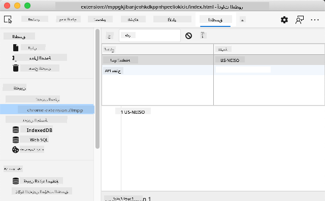

<!--
CO_OP_TRANSLATOR_METADATA:
{
  "original_hash": "8c8cd4af6086cc1d47e1d43aa4983d20",
  "translation_date": "2025-10-22T14:29:58+00:00",
  "source_file": "5-browser-extension/2-forms-browsers-local-storage/README.md",
  "language_code": "ar"
}
-->
# مشروع إضافة المتصفح الجزء الثاني: استدعاء API واستخدام التخزين المحلي

## اختبار ما قبل المحاضرة

[اختبار ما قبل المحاضرة](https://ff-quizzes.netlify.app/web/quiz/25)

## المقدمة

هل تتذكر إضافة المتصفح التي بدأت في بنائها؟ في الوقت الحالي لديك نموذج جميل المظهر، لكنه ثابت إلى حد كبير. اليوم سنجعلها تنبض بالحياة من خلال ربطها ببيانات حقيقية ومنحها ذاكرة.

فكر في أجهزة التحكم في مهمة أبولو - لم تكن تعرض معلومات ثابتة فقط. بل كانت تتواصل باستمرار مع المركبة الفضائية، وتُحدث البيانات التليمترية، وتحتفظ بمعايير المهمة الحرجة. هذا هو النوع الديناميكي من السلوك الذي سنبنيه اليوم. ستتمكن إضافتك من الوصول إلى الإنترنت، وجلب بيانات بيئية حقيقية، وتذكر إعداداتك للمرة القادمة.

قد يبدو دمج API معقدًا، لكنه في الحقيقة مجرد تعليم الكود كيفية التواصل مع خدمات أخرى. سواء كنت تستخرج بيانات الطقس، أو خلاصات وسائل التواصل الاجتماعي، أو معلومات البصمة الكربونية كما سنفعل اليوم، الأمر كله يتعلق بإنشاء هذه الروابط الرقمية. سنستكشف أيضًا كيف يمكن للمتصفحات الاحتفاظ بالمعلومات - مثلما استخدمت المكتبات فهارس البطاقات لتذكر أماكن الكتب.

بنهاية هذا الدرس، ستكون لديك إضافة متصفح تجلب بيانات حقيقية، تخزن تفضيلات المستخدم، وتوفر تجربة سلسة. لنبدأ!

✅ اتبع الأجزاء المرقمة في الملفات المناسبة لمعرفة أين تضع الكود الخاص بك.

## إعداد العناصر للتعامل معها في الإضافة

قبل أن يتمكن JavaScript من التعامل مع الواجهة، يحتاج إلى مراجع لعناصر HTML محددة. فكر في الأمر مثل التلسكوب الذي يحتاج إلى أن يتم توجيهه نحو نجوم معينة - قبل أن يتمكن غاليليو من دراسة أقمار المشتري، كان عليه تحديد موقع المشتري والتركيز عليه.

في ملف `index.js` الخاص بك، سنقوم بإنشاء متغيرات `const` تلتقط مراجع لكل عنصر مهم في النموذج. هذا مشابه لكيفية قيام العلماء بتسمية معداتهم - بدلاً من البحث في المختبر بأكمله في كل مرة، يمكنهم الوصول مباشرة إلى ما يحتاجونه.

```javascript
// form fields
const form = document.querySelector('.form-data');
const region = document.querySelector('.region-name');
const apiKey = document.querySelector('.api-key');

// results
const errors = document.querySelector('.errors');
const loading = document.querySelector('.loading');
const results = document.querySelector('.result-container');
const usage = document.querySelector('.carbon-usage');
const fossilfuel = document.querySelector('.fossil-fuel');
const myregion = document.querySelector('.my-region');
const clearBtn = document.querySelector('.clear-btn');
```

**ما يفعله هذا الكود:**
- **يلتقط** عناصر النموذج باستخدام `document.querySelector()` مع محددات CSS
- **ينشئ** مراجع لحقول الإدخال الخاصة باسم المنطقة ومفتاح API
- **يؤسس** روابط لعناصر عرض النتائج لبيانات استخدام الكربون
- **يُعد** الوصول إلى عناصر واجهة المستخدم مثل مؤشرات التحميل ورسائل الخطأ
- **يخزن** كل مرجع عنصر في متغير `const` لإعادة استخدامه بسهولة في الكود الخاص بك

## إضافة مستمعي الأحداث

الآن سنجعل الإضافة تستجيب لإجراءات المستخدم. مستمعو الأحداث هم طريقة الكود الخاص بك لمراقبة تفاعلات المستخدم. فكر فيهم مثل مشغلي الهواتف في التبادلات الهاتفية المبكرة - كانوا يستمعون للمكالمات الواردة ويصلون الدوائر الصحيحة عندما يريد شخص ما إجراء اتصال.

```javascript
form.addEventListener('submit', (e) => handleSubmit(e));
clearBtn.addEventListener('click', (e) => reset(e));
init();
```

**فهم هذه المفاهيم:**
- **يربط** مستمع إرسال بالنموذج الذي يتم تشغيله عندما يضغط المستخدمون على Enter أو ينقرون على إرسال
- **يربط** مستمع نقر بزر المسح لإعادة تعيين النموذج
- **يمرر** كائن الحدث `(e)` إلى وظائف المعالجة للتحكم الإضافي
- **يستدعي** وظيفة `init()` فورًا لإعداد الحالة الأولية للإضافة

✅ لاحظ اختصار صيغة وظيفة السهم المستخدمة هنا. هذا النهج الحديث في JavaScript أنظف من تعبيرات الوظائف التقليدية، لكن كلاهما يعمل بشكل جيد!

## بناء وظائف التهيئة وإعادة التعيين

لنقم بإنشاء منطق التهيئة للإضافة الخاصة بك. وظيفة `init()` تشبه نظام الملاحة للسفينة الذي يتحقق من أدواته - تحدد الحالة الحالية وتضبط الواجهة وفقًا لذلك. تتحقق مما إذا كان شخص ما قد استخدم الإضافة من قبل وتحمل إعداداته السابقة.

وظيفة `reset()` توفر للمستخدمين بداية جديدة - مشابهة لكيفية قيام العلماء بإعادة تعيين أدواتهم بين التجارب لضمان بيانات نظيفة.

```javascript
function init() {
	// Check if user has previously saved API credentials
	const storedApiKey = localStorage.getItem('apiKey');
	const storedRegion = localStorage.getItem('regionName');

	// Set extension icon to generic green (placeholder for future lesson)
	// TODO: Implement icon update in next lesson

	if (storedApiKey === null || storedRegion === null) {
		// First-time user: show the setup form
		form.style.display = 'block';
		results.style.display = 'none';
		loading.style.display = 'none';
		clearBtn.style.display = 'none';
		errors.textContent = '';
	} else {
		// Returning user: load their saved data automatically
		displayCarbonUsage(storedApiKey, storedRegion);
		results.style.display = 'none';
		form.style.display = 'none';
		clearBtn.style.display = 'block';
	}
}

function reset(e) {
	e.preventDefault();
	// Clear stored region to allow user to choose a new location
	localStorage.removeItem('regionName');
	// Restart the initialization process
	init();
}
```

**تفصيل ما يحدث هنا:**
- **يسترجع** مفتاح API والمنطقة المخزنة من التخزين المحلي للمتصفح
- **يتحقق** مما إذا كان هذا مستخدمًا لأول مرة (لا توجد بيانات مخزنة) أو مستخدمًا عائدًا
- **يعرض** نموذج الإعداد للمستخدمين الجدد ويخفي عناصر الواجهة الأخرى
- **يحمل** البيانات المحفوظة تلقائيًا للمستخدمين العائدين ويعرض خيار إعادة التعيين
- **يدير** حالة واجهة المستخدم بناءً على البيانات المتاحة

**مفاهيم رئيسية حول التخزين المحلي:**
- **يحافظ** على البيانات بين جلسات المتصفح (على عكس تخزين الجلسة)
- **يخزن** البيانات كأزواج مفتاح-قيمة باستخدام `getItem()` و `setItem()`
- **يعيد** `null` عندما لا توجد بيانات لمفتاح معين
- **يوفر** طريقة بسيطة لتذكر تفضيلات وإعدادات المستخدم

> 💡 **فهم تخزين المتصفح**: [LocalStorage](https://developer.mozilla.org/docs/Web/API/Window/localStorage) يشبه إعطاء الإضافة ذاكرة دائمة. فكر في كيفية تخزين مكتبة الإسكندرية القديمة لللفائف - ظلت المعلومات متاحة حتى عندما غادر العلماء وعادوا.
>
> **خصائص رئيسية:**
> - **يحافظ** على البيانات حتى بعد إغلاق المتصفح
> - **يبقى** بعد إعادة تشغيل الكمبيوتر وتعطل المتصفح
> - **يوفر** مساحة تخزين كبيرة لتفضيلات المستخدم
> - **يتيح** الوصول الفوري دون تأخير الشبكة

> **ملاحظة مهمة**: تحتوي إضافة المتصفح الخاصة بك على تخزين محلي معزول خاص بها منفصل عن صفحات الويب العادية. هذا يوفر الأمان ويمنع التعارض مع مواقع الويب الأخرى.

يمكنك عرض البيانات المخزنة لديك عن طريق فتح أدوات المطور في المتصفح (F12)، والانتقال إلى علامة التبويب **Application**، وتوسيع قسم **Local Storage**.



> ⚠️ **اعتبار أمني**: في التطبيقات الإنتاجية، تخزين مفاتيح API في LocalStorage يشكل مخاطر أمنية لأن JavaScript يمكنه الوصول إلى هذه البيانات. لأغراض التعلم، هذا النهج يعمل بشكل جيد، لكن التطبيقات الحقيقية يجب أن تستخدم تخزين آمن على الخادم للمعلومات الحساسة.

## التعامل مع إرسال النموذج

الآن سنتعامل مع ما يحدث عندما يرسل شخص ما النموذج الخاص بك. بشكل افتراضي، تقوم المتصفحات بإعادة تحميل الصفحة عند إرسال النماذج، لكننا سنعترض هذا السلوك لإنشاء تجربة أكثر سلاسة.

يشبه هذا النهج كيفية تعامل مركز التحكم مع اتصالات المركبة الفضائية - بدلاً من إعادة ضبط النظام بالكامل لكل عملية إرسال، يحافظون على التشغيل المستمر أثناء معالجة المعلومات الجديدة.

قم بإنشاء وظيفة تلتقط حدث إرسال النموذج وتستخرج إدخال المستخدم:

```javascript
function handleSubmit(e) {
	e.preventDefault();
	setUpUser(apiKey.value, region.value);
}
```

**في ما سبق، قمنا بـ:**
- **منع** السلوك الافتراضي لإرسال النموذج الذي كان سيؤدي إلى تحديث الصفحة
- **استخراج** قيم إدخال المستخدم من حقول مفتاح API والمنطقة
- **تمرير** بيانات النموذج إلى وظيفة `setUpUser()` للمعالجة
- **الحفاظ** على سلوك تطبيق الصفحة الواحدة عن طريق تجنب إعادة تحميل الصفحة

✅ تذكر أن حقول النموذج في HTML الخاص بك تتضمن السمة `required`، لذا يقوم المتصفح تلقائيًا بالتحقق من أن المستخدمين يقدمون مفتاح API والمنطقة قبل تشغيل هذه الوظيفة.

## إعداد تفضيلات المستخدم

وظيفة `setUpUser` مسؤولة عن حفظ بيانات اعتماد المستخدم وبدء أول استدعاء API. هذا يخلق انتقالًا سلسًا من الإعداد إلى عرض النتائج.

```javascript
function setUpUser(apiKey, regionName) {
	// Save user credentials for future sessions
	localStorage.setItem('apiKey', apiKey);
	localStorage.setItem('regionName', regionName);
	
	// Update UI to show loading state
	loading.style.display = 'block';
	errors.textContent = '';
	clearBtn.style.display = 'block';
	
	// Fetch carbon usage data with user's credentials
	displayCarbonUsage(apiKey, regionName);
}
```

**خطوة بخطوة، ما يحدث هنا:**
- **يحفظ** مفتاح API واسم المنطقة في التخزين المحلي للاستخدام المستقبلي
- **يعرض** مؤشر تحميل لإعلام المستخدمين بأن البيانات يتم جلبها
- **يمسح** أي رسائل خطأ سابقة من العرض
- **يكشف** زر المسح للمستخدمين لإعادة تعيين إعداداتهم لاحقًا
- **يبدأ** استدعاء API لجلب بيانات استخدام الكربون الحقيقية

هذه الوظيفة تخلق تجربة مستخدم سلسة من خلال إدارة كل من استمرارية البيانات وتحديثات واجهة المستخدم في إجراء واحد منسق.

## عرض بيانات استخدام الكربون

الآن سنربط الإضافة الخاصة بك بمصادر البيانات الخارجية عبر APIs. هذا يحول الإضافة الخاصة بك من أداة مستقلة إلى شيء يمكنه الوصول إلى معلومات الوقت الفعلي من جميع أنحاء الإنترنت.

**فهم APIs**

[APIs](https://www.webopedia.com/TERM/A/API.html) هي الطريقة التي تتواصل بها التطبيقات المختلفة مع بعضها البعض. فكر فيها مثل نظام التلغراف الذي ربط المدن البعيدة في القرن التاسع عشر - كان المشغلون يرسلون طلبات إلى محطات بعيدة ويتلقون الردود بالمعلومات المطلوبة. كل مرة تتحقق فيها من وسائل التواصل الاجتماعي، تسأل مساعد صوتي سؤالًا، أو تستخدم تطبيق توصيل، APIs تسهل هذه التبادلات البيانات.

**مفاهيم رئيسية حول REST APIs:**
- **REST** تعني "نقل الحالة التمثيلية"
- **تستخدم** طرق HTTP القياسية (GET, POST, PUT, DELETE) للتفاعل مع البيانات
- **تعيد** البيانات بتنسيقات متوقعة، عادة JSON
- **توفر** نقاط نهاية متسقة تعتمد على URL لأنواع مختلفة من الطلبات

✅ [API إشارة CO2](https://www.co2signal.com/) الذي سنستخدمه يوفر بيانات كثافة الكربون في الوقت الفعلي من شبكات الكهرباء حول العالم. هذا يساعد المستخدمين على فهم التأثير البيئي لاستخدامهم للكهرباء!

> 💡 **فهم JavaScript غير المتزامن**: الكلمة المفتاحية [`async`](https://developer.mozilla.org/docs/Web/JavaScript/Reference/Statements/async_function) تمكن الكود الخاص بك من التعامل مع عمليات متعددة في وقت واحد. عندما تطلب بيانات من خادم، لا تريد أن تتجمد الإضافة الخاصة بك بالكامل - سيكون ذلك مثل توقف التحكم في حركة الطائرات عن جميع العمليات أثناء انتظار استجابة طائرة واحدة.
>
> **فوائد رئيسية:**
> - **يحافظ** على استجابة الإضافة أثناء تحميل البيانات
> - **يسمح** للكود الآخر بالاستمرار في التنفيذ أثناء طلبات الشبكة
> - **يحسن** قابلية قراءة الكود مقارنة بأنماط الاستدعاء التقليدية
> - **يمكن** من التعامل مع الأخطاء بشكل سلس لمشاكل الشبكة

إليك فيديو سريع عن `async`:

[](https://youtube.com/watch?v=YwmlRkrxvkk "Async و Await لإدارة الوعود")

> 🎥 انقر على الصورة أعلاه لمشاهدة فيديو عن async/await.

قم بإنشاء الوظيفة لجلب وعرض بيانات استخدام الكربون:

```javascript
// Modern fetch API approach (no external dependencies needed)
async function displayCarbonUsage(apiKey, region) {
	try {
		// Fetch carbon intensity data from CO2 Signal API
		const response = await fetch('https://api.co2signal.com/v1/latest', {
			method: 'GET',
			headers: {
				'auth-token': apiKey,
				'Content-Type': 'application/json'
			},
			// Add query parameters for the specific region
			...new URLSearchParams({ countryCode: region }) && {
				url: `https://api.co2signal.com/v1/latest?countryCode=${region}`
			}
		});

		// Check if the API request was successful
		if (!response.ok) {
			throw new Error(`API request failed: ${response.status}`);
		}

		const data = await response.json();
		const carbonData = data.data;

		// Calculate rounded carbon intensity value
		const carbonIntensity = Math.round(carbonData.carbonIntensity);

		// Update the user interface with fetched data
		loading.style.display = 'none';
		form.style.display = 'none';
		myregion.textContent = region.toUpperCase();
		usage.textContent = `${carbonIntensity} grams (grams CO₂ emitted per kilowatt hour)`;
		fossilfuel.textContent = `${carbonData.fossilFuelPercentage.toFixed(2)}% (percentage of fossil fuels used to generate electricity)`;
		results.style.display = 'block';

		// TODO: calculateColor(carbonIntensity) - implement in next lesson

	} catch (error) {
		console.error('Error fetching carbon data:', error);
		
		// Show user-friendly error message
		loading.style.display = 'none';
		results.style.display = 'none';
		errors.textContent = 'Sorry, we couldn\'t fetch data for that region. Please check your API key and region code.';
	}
}
```

**تفصيل ما يحدث هنا:**
- **يستخدم** API `fetch()` الحديث بدلاً من المكتبات الخارجية مثل Axios للحصول على كود أنظف وخالي من التبعيات
- **ينفذ** فحص الأخطاء المناسب باستخدام `response.ok` لالتقاط فشل API مبكرًا
- **يتعامل** مع العمليات غير المتزامنة باستخدام `async/await` لتدفق كود أكثر قابلية للقراءة
- **يُصادق** مع API إشارة CO2 باستخدام رأس `auth-token`
- **يُحلل** بيانات JSON المستجيبة ويستخرج معلومات كثافة الكربون
- **يُحدث** عناصر واجهة المستخدم المتعددة ببيانات بيئية مهيأة
- **يوفر** رسائل خطأ سهلة الاستخدام عند فشل استدعاءات API

**مفاهيم JavaScript الحديثة الرئيسية التي تم توضيحها:**
- **القوالب النصية** مع صياغة `${}` لتنسيق النصوص بشكل أنظف
- **التعامل مع الأخطاء** باستخدام كتل try/catch لتطبيقات قوية
- **نمط async/await** للتعامل مع طلبات الشبكة بشكل سلس
- **تفكيك الكائنات** لاستخراج بيانات محددة من استجابات API
- **سلسلة الطرق** للتعامل مع DOM المتعددة

✅ هذه الوظيفة توضح العديد من المفاهيم المهمة لتطوير الويب - التواصل مع الخوادم الخارجية، التعامل مع المصادقة، معالجة البيانات، تحديث الواجهات، وإدارة الأخطاء بشكل سلس. هذه مهارات أساسية يستخدمها المطورون المحترفون بانتظام.

🎉 **ما أنجزته:** لقد أنشأت إضافة متصفح:
- **تتصل** بالإنترنت وتجلب بيانات بيئية حقيقية
- **تحافظ** على إعدادات المستخدم بين الجلسات
- **تتعامل** مع الأخطاء بشكل سلس بدلاً من التعطل
- **توفر** تجربة مستخدم سلسة واحترافية

اختبر عملك عن طريق تشغيل `npm run build` وتحديث الإضافة الخاصة بك في المتصفح. لديك الآن متتبع بصمة كربونية وظيفي. الدرس التالي سيضيف وظيفة أيقونة ديناميكية لإكمال الإضافة.

---

## تحدي وكيل GitHub Copilot 🚀

استخدم وضع الوكيل لإكمال التحدي التالي:

**الوصف:** قم بتحسين إضافة المتصفح عن طريق إضافة تحسينات في التعامل مع الأخطاء وميزات تجربة المستخدم. سيساعدك هذا التحدي على ممارسة العمل مع APIs، التخزين المحلي، ومعالجة DOM باستخدام أنماط JavaScript الحديثة.

**المهمة:** قم بإنشاء نسخة محسنة من وظيفة displayCarbonUsage تتضمن: 1) آلية إعادة المحاولة لاستدعاءات API الفاشلة مع تراجع أسي، 2) التحقق من صحة الإدخال لرمز المنطقة قبل إجراء استدعاء API، 3) رسوم تحميل مع مؤشرات تقدم، 4) تخزين مؤقت لاستجابات API في التخزين المحلي مع طوابع انتهاء الصلاحية (تخزين لمدة 30 دقيقة)، و5) ميزة لعرض البيانات التاريخية من استدعاءات API السابقة. أضف أيضًا تعليقات JSDoc بأسلوب TypeScript لتوثيق جميع معلمات الوظائف وأنواع الإرجاع.

تعرف على المزيد حول [وضع الوكيل](https://code.visualstudio.com/blogs/2025/02/24/introducing-copilot-agent-mode) هنا.

## 🚀 التحدي

وسع فهمك لـ APIs من خلال استكشاف ثروة APIs المستندة إلى المتصفح المتاحة لتطوير الويب. اختر واحدة من هذه APIs وقم ببناء عرض صغير:

- [API تحديد الموقع الجغرافي](https://developer.mozilla.org/docs/Web/API/Geolocation_API) - الحصول على موقع المستخدم الحالي
- [API الإشعارات](https://developer.mozilla.org/docs/Web/API/Notifications_API) - إرسال إشعارات سطح المكتب
- [API السحب والإفلات في HTML](https://developer.mozilla.org/docs/Web/API/HTML_Drag_and_Drop_API) - إنشاء واجهات سحب تفاعلية
- [API تخزين الويب](https://developer.mozilla.org/docs/Web/API/Web_Storage_API) - تقنيات التخزين المحلي المتقدمة
- [API الجلب](https://developer.mozilla.org/docs/Web/API/Fetch_API) - بديل حديث لـ XMLHttpRequest

**أسئلة البحث التي يجب مراعاتها:**
- ما المشاكل الحقيقية التي يحلها هذا API؟
- كيف يتعامل API مع الأخطاء والحالات الحافة؟
- ما الاعتبارات الأمنية الموجودة عند استخدام هذا API؟
- ما مدى دعم هذا API عبر المتصفحات المختلفة؟

بعد البحث الخاص بك، حدد ما هي الخصائص التي تجعل API سهل الاستخدام وموثوقًا للمطورين.

## اختبار ما بعد المحاضرة

[اختبار ما بعد المحاضرة](https://ff-quizzes.netlify.app/web/quiz/26)

## المراجعة والدراسة الذاتية
لقد تعلمت عن LocalStorage وواجهات برمجة التطبيقات (APIs) في هذا الدرس، وكلاهما مفيد جدًا لمطوري الويب المحترفين. هل يمكنك التفكير في كيفية عمل هذين العنصرين معًا؟ فكر في كيفية تصميم موقع ويب يقوم بتخزين العناصر ليتم استخدامها بواسطة واجهة برمجة التطبيقات.

## المهمة

[تبنَّ واجهة برمجة تطبيقات](assignment.md)

---

**إخلاء المسؤولية**:  
تم ترجمة هذا المستند باستخدام خدمة الترجمة بالذكاء الاصطناعي [Co-op Translator](https://github.com/Azure/co-op-translator). بينما نسعى لتحقيق الدقة، يرجى العلم أن الترجمات الآلية قد تحتوي على أخطاء أو عدم دقة. يجب اعتبار المستند الأصلي بلغته الأصلية المصدر الرسمي. للحصول على معلومات حاسمة، يُوصى بالترجمة البشرية الاحترافية. نحن غير مسؤولين عن أي سوء فهم أو تفسيرات خاطئة تنشأ عن استخدام هذه الترجمة.