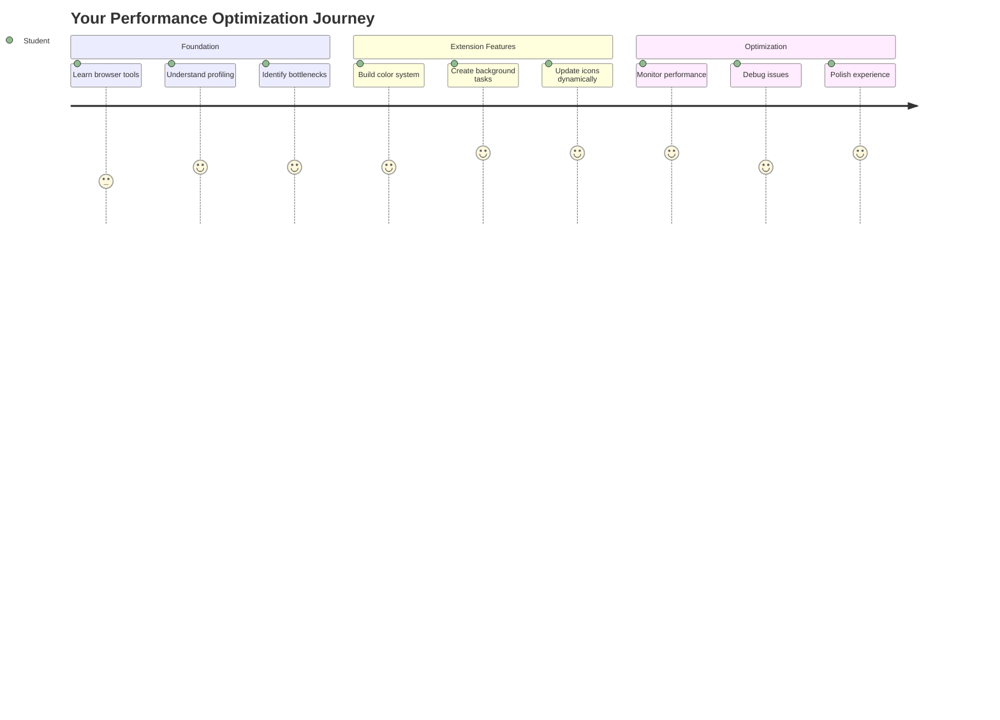
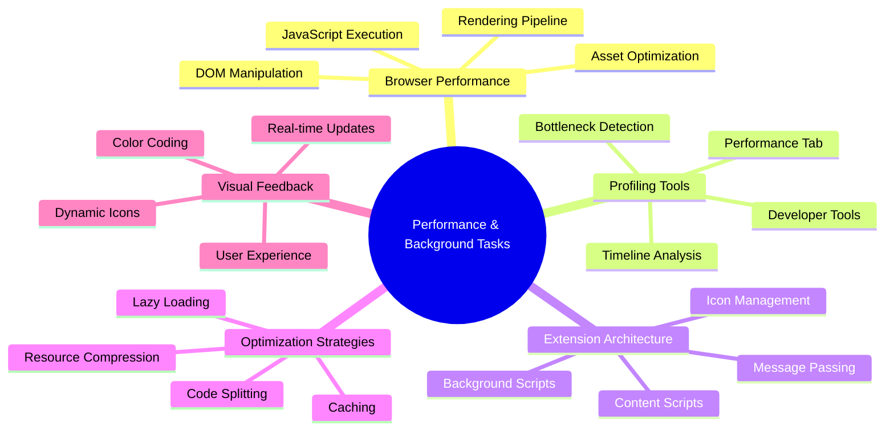
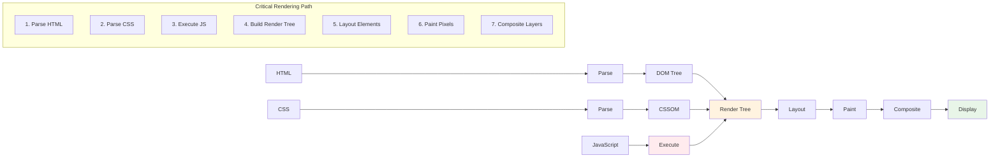
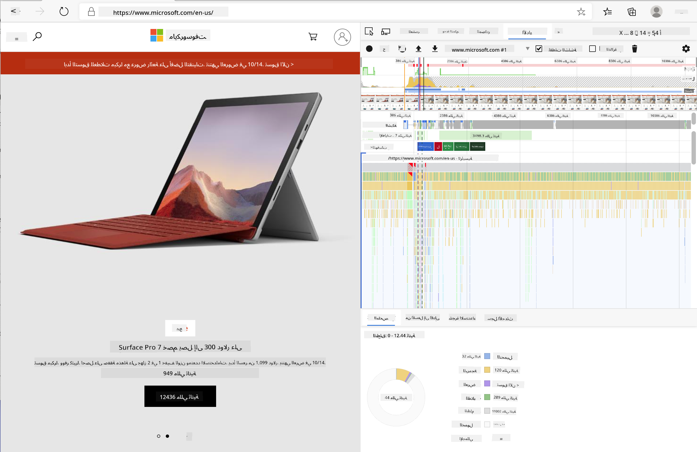
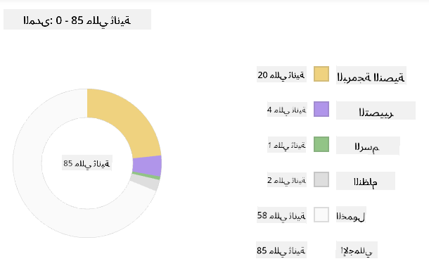
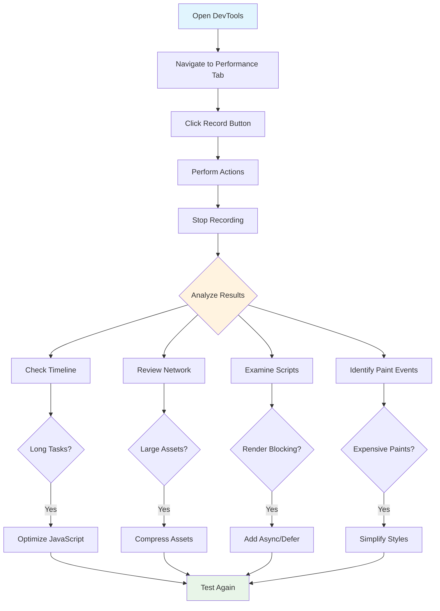
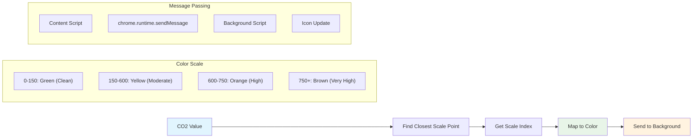
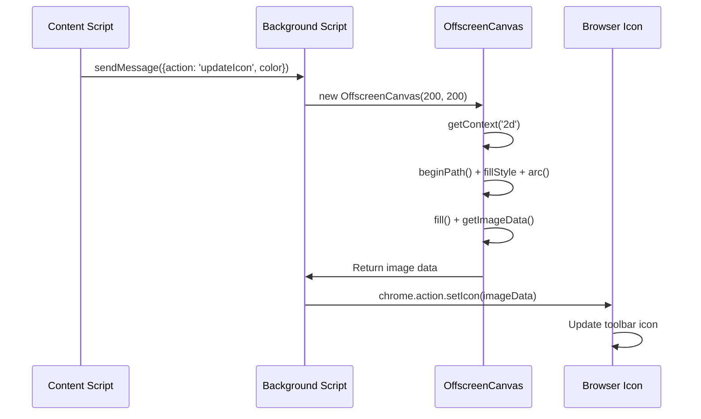
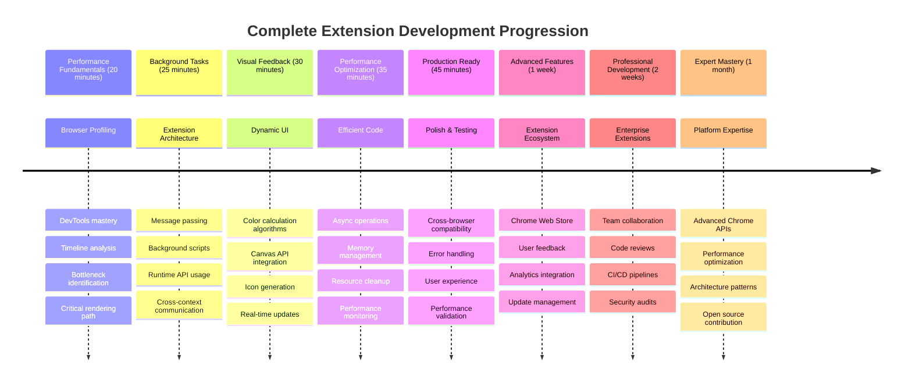

```mermaid
architecture-beta
    group browser(logos:chrome)[Browser]
    
    service popup(logos:html5)[Popup UI] in browser
    service content(logos:javascript)[Content Script] in browser
    service background(database)[Background Script] in browser
    service api(logos:api)[External API] in browser
    
    popup:R -- L:content
    content:R -- L:background
    background:T -- B:api
    content:T -- B:api
    
    junction junctionCenter in browser
    popup:R -- L:junctionCenter
    junctionCenter:R -- L:background
```

<!--
CO_OP_TRANSLATOR_METADATA:
{
  "original_hash": "b275fed2c6fc90d2b9b6661a3225faa2",
  "translation_date": "2025-11-03T12:48:14+00:00",
  "source_file": "5-browser-extension/3-background-tasks-and-performance/README.md",
  "language_code": "ar"
}
-->
# مشروع إضافة المتصفح الجزء الثالث: تعلم عن المهام الخلفية والأداء



هل تساءلت يومًا ما الذي يجعل بعض إضافات المتصفح تبدو سريعة وسلسة بينما تبدو أخرى بطيئة؟ السر يكمن في ما يحدث خلف الكواليس. بينما ينقر المستخدمون حول واجهة الإضافة الخاصة بك، هناك عالم كامل من العمليات الخلفية التي تدير جلب البيانات، تحديث الأيقونات، وموارد النظام بهدوء.

هذه هي الدرس الأخير في سلسلة إضافات المتصفح، وسنجعل متتبع بصمة الكربون الخاص بك يعمل بسلاسة. ستضيف تحديثات ديناميكية للأيقونات وتتعلم كيفية اكتشاف مشاكل الأداء قبل أن تصبح مشكلة. الأمر يشبه ضبط سيارة سباق - تحسينات صغيرة يمكن أن تحدث فرقًا كبيرًا في كيفية عمل كل شيء.

بحلول الوقت الذي ننتهي فيه، سيكون لديك إضافة مصقولة وستفهم مبادئ الأداء التي تميز التطبيقات الجيدة عن الرائعة. دعونا نغوص في عالم تحسين المتصفح.

## اختبار ما قبل المحاضرة

[اختبار ما قبل المحاضرة](https://ff-quizzes.netlify.app/web/quiz/27)

### المقدمة

في دروسنا السابقة، قمت ببناء نموذج، وربطه بـ API، وتناول جلب البيانات غير المتزامن. الإضافة الخاصة بك تتشكل بشكل جيد.

الآن نحتاج إلى إضافة اللمسات الأخيرة - مثل جعل أيقونة الإضافة تغير الألوان بناءً على بيانات الكربون. هذا يذكرني بكيفية اضطرار ناسا لتحسين كل نظام على مركبة الفضاء أبولو. لم يكن لديهم أي مجال لإهدار الدورات أو الذاكرة لأن الأداء كان مسألة حياة أو موت. بينما ليست إضافة المتصفح لدينا بهذه الأهمية، فإن نفس المبادئ تنطبق - الكود الفعال يخلق تجارب مستخدم أفضل.



## أساسيات أداء الويب

عندما يعمل الكود الخاص بك بكفاءة، يمكن للناس أن *يشعروا* بالفرق. تعرف تلك اللحظة عندما يتم تحميل الصفحة فورًا أو عندما تتدفق الرسوم المتحركة بسلاسة؟ هذا هو الأداء الجيد في العمل.

الأداء ليس فقط عن السرعة - إنه عن صنع تجارب ويب تبدو طبيعية بدلاً من أن تكون متعثرة ومحبطة. في الأيام الأولى للحوسبة، كانت غريس هوبر تحتفظ بنانو ثانية (قطعة من السلك بطول قدم تقريبًا) على مكتبها لتظهر مدى بعد الضوء في جزء من مليار من الثانية. كان هذا طريقتها لشرح لماذا كل ميكروثانية مهمة في الحوسبة. دعونا نستكشف أدوات التحري التي تساعدك على معرفة ما يبطئ الأمور.

> "أداء الموقع يتعلق بشيئين: مدى سرعة تحميل الصفحة، ومدى سرعة تشغيل الكود عليها." -- [زاك غروسبارت](https://www.smashingmagazine.com/2012/06/javascript-profiling-chrome-developer-tools/)

موضوع كيفية جعل مواقعك سريعة للغاية على جميع أنواع الأجهزة، لجميع أنواع المستخدمين، في جميع أنواع الظروف، ليس مفاجئًا أنه واسع. إليك بعض النقاط التي يجب أن تضعها في اعتبارك أثناء بناء مشروع ويب قياسي أو إضافة متصفح.

الخطوة الأولى في تحسين موقعك هي فهم ما يحدث بالفعل تحت السطح. لحسن الحظ، يأتي متصفحك بأدوات تحري قوية مدمجة.



لفتح أدوات المطور في Edge، انقر على تلك النقاط الثلاث في الزاوية العلوية اليمنى، ثم انتقل إلى أدوات إضافية > أدوات المطور. أو استخدم اختصار لوحة المفاتيح: `Ctrl` + `Shift` + `I` على Windows أو `Option` + `Command` + `I` على Mac. بمجرد أن تكون هناك، انقر على علامة تبويب الأداء - هذا هو المكان الذي ستقوم فيه بالتحقيق.

**إليك مجموعة أدوات التحري الخاصة بالأداء:**
- **افتح** أدوات المطور (ستستخدمها باستمرار كمطور!)
- **توجه** إلى علامة تبويب الأداء - فكر فيها كمتعقب لياقة تطبيق الويب الخاص بك
- **اضغط** على زر التسجيل وشاهد صفحتك أثناء العمل
- **ادرس** النتائج لتكتشف ما يبطئ الأمور

دعونا نجرب هذا. افتح موقعًا (Microsoft.com يعمل جيدًا لهذا) وانقر على زر "تسجيل". الآن قم بتحديث الصفحة وشاهد المحلل يلتقط كل ما يحدث. عندما تتوقف عن التسجيل، سترى تفصيلًا دقيقًا لكيفية قيام المتصفح بـ "البرمجة"، "التقديم"، و"الرسم" للموقع. يذكرني هذا بكيفية مراقبة مركز التحكم لكل نظام أثناء إطلاق الصاروخ - تحصل على بيانات في الوقت الفعلي حول ما يحدث ومتى.



✅ يحتوي [توثيق Microsoft](https://docs.microsoft.com/microsoft-edge/devtools-guide/performance/?WT.mc_id=academic-77807-sagibbon) على الكثير من التفاصيل إذا كنت تريد التعمق أكثر.

> نصيحة احترافية: قم بمسح ذاكرة التخزين المؤقت للمتصفح قبل الاختبار لترى كيف يعمل موقعك للزوار لأول مرة - عادةً ما يكون مختلفًا تمامًا عن الزيارات المتكررة!

حدد عناصر من خط الزمن الخاص بالملف الشخصي لتكبير الأحداث التي تحدث أثناء تحميل صفحتك.

احصل على لقطة لأداء صفحتك عن طريق تحديد جزء من خط الزمن الخاص بالملف الشخصي والنظر إلى لوحة الملخص:



تحقق من لوحة سجل الأحداث لترى إذا كان أي حدث استغرق أكثر من 15 مللي ثانية:


✅ تعرف على المحلل الخاص بك! افتح أدوات المطور على هذا الموقع وانظر إذا كانت هناك أي اختناقات. ما هو الأصل الذي يتم تحميله ببطء؟ الأسرع؟



## ما الذي تبحث عنه عند التحليل

تشغيل المحلل هو مجرد البداية - المهارة الحقيقية هي معرفة ما تخبرك به تلك الرسوم البيانية الملونة. لا تقلق، ستعتاد على قراءتها. تعلم المطورون ذوو الخبرة اكتشاف علامات التحذير قبل أن تصبح مشاكل كاملة.

دعونا نتحدث عن المشتبه بهم المعتادين - المشاكل التي تميل إلى التسلل إلى مشاريع الويب. مثلما كان على ماري كوري مراقبة مستويات الإشعاع بعناية في مختبرها، نحتاج إلى مراقبة أنماط معينة تشير إلى وجود مشاكل. اكتشاف هذه الأمور مبكرًا سيوفر لك (ولمستخدميك) الكثير من الإحباط.

**أحجام الأصول**: أصبحت المواقع "أثقل" على مر السنين، والكثير من هذا الوزن الزائد يأتي من الصور. إنه مثل أننا كنا نحشو المزيد والمزيد في حقائبنا الرقمية.

✅ تحقق من [أرشيف الإنترنت](https://httparchive.org/reports/page-weight) لترى كيف نمت أحجام الصفحات بمرور الوقت - إنه كاشف للغاية.

**إليك كيفية الحفاظ على أصولك محسنة:**
- **ضغط** تلك الصور! يمكن أن تقلل التنسيقات الحديثة مثل WebP من أحجام الملفات بشكل كبير
- **تقديم** حجم الصورة المناسب لكل جهاز - لا حاجة لإرسال صور ضخمة للهواتف
- **تصغير** CSS وJavaScript - كل بايت مهم
- **استخدام** التحميل الكسول بحيث يتم تنزيل الصور فقط عندما يقوم المستخدمون بالتمرير إليها

**التنقل عبر DOM**: يجب على المتصفح بناء نموذج الكائنات المستندة إلى الوثيقة بناءً على الكود الذي تكتبه، لذا من مصلحة الأداء الجيد للصفحة الحفاظ على العلامات إلى الحد الأدنى، واستخدام وتنسيق ما تحتاجه الصفحة فقط. على هذا النحو، يمكن تحسين CSS الزائد المرتبط بالصفحة؛ الأنماط التي تحتاج إلى استخدامها فقط في صفحة واحدة لا تحتاج إلى تضمينها في ورقة الأنماط الرئيسية، على سبيل المثال.

**استراتيجيات رئيسية لتحسين DOM:**
- **تقليل** عدد عناصر HTML ومستويات التداخل
- **إزالة** قواعد CSS غير المستخدمة ودمج أوراق الأنماط بكفاءة
- **تنظيم** CSS لتحميل ما هو مطلوب فقط لكل صفحة
- **هيكلة** HTML بشكل دلالي لتحسين تحليل المتصفح

**JavaScript**: يجب على كل مطور JavaScript مراقبة النصوص التي تعيق التقديم والتي يجب تحميلها قبل أن يتمكن DOM من التنقل والرسم في المتصفح. فكر في استخدام `defer` مع النصوص المضمنة الخاصة بك (كما هو الحال في وحدة Terrarium).

**تقنيات حديثة لتحسين JavaScript:**
- **استخدام** خاصية `defer` لتحميل النصوص بعد تحليل DOM
- **تنفيذ** تقسيم الكود لتحميل JavaScript الضروري فقط
- **تطبيق** التحميل الكسول للوظائف غير الحرجة
- **تقليل** استخدام المكتبات الثقيلة والأطر عند الإمكان

✅ جرب بعض المواقع على [موقع اختبار سرعة الموقع](https://www.webpagetest.org/) لتتعرف على الفحوصات الشائعة التي يتم إجراؤها لتحديد أداء الموقع.

### 🔄 **تقييم تربوي**
**فهم الأداء**: قبل بناء ميزات الإضافة، تأكد من أنك تستطيع:
- ✅ شرح المسار الحرج للتقديم من HTML إلى البكسل
- ✅ تحديد الاختناقات الشائعة في أداء تطبيقات الويب
- ✅ استخدام أدوات المطور الخاصة بالمتصفح لتحليل أداء الصفحة
- ✅ فهم كيف تؤثر أحجام الأصول وتعقيد DOM على السرعة

**اختبار ذاتي سريع**: ماذا يحدث عندما يكون لديك JavaScript يعيق التقديم؟
*الإجابة: يجب على المتصفح تنزيل وتنفيذ النص قبل أن يتمكن من متابعة تحليل HTML وتقديم الصفحة*

**تأثير الأداء في العالم الحقيقي**:
- **تأخير 100 مللي ثانية**: يلاحظ المستخدمون البطء
- **تأخير 1 ثانية**: يبدأ المستخدمون بفقدان التركيز
- **تأخير 3+ ثوانٍ**: 40% من المستخدمين يتخلون عن الصفحة
- **شبكات الهواتف المحمولة**: الأداء يصبح أكثر أهمية

الآن بعد أن لديك فكرة عن كيفية تقديم المتصفح للأصول التي ترسلها إليه، دعونا نلقي نظرة على آخر الأشياء التي تحتاج إلى القيام بها لإكمال الإضافة الخاصة بك:

### إنشاء وظيفة لحساب اللون

الآن سنقوم بإنشاء وظيفة تحول البيانات الرقمية إلى ألوان ذات معنى. فكر فيها كنظام إشارات المرور - الأخضر للطاقة النظيفة، الأحمر للكثافة الكربونية العالية.

هذه الوظيفة ستأخذ بيانات CO2 من API الخاص بنا وتحدد اللون الذي يمثل التأثير البيئي بشكل أفضل. إنها مشابهة لكيفية استخدام العلماء الترميز اللوني في خرائط الحرارة لتصور أنماط البيانات المعقدة - من درجات حرارة المحيطات إلى تشكيل النجوم. دعونا نضيف هذا إلى `/src/index.js`، مباشرة بعد تلك المتغيرات `const` التي قمنا بإعدادها سابقًا:



```javascript
function calculateColor(value) {
	// Define CO2 intensity scale (grams per kWh)
	const co2Scale = [0, 150, 600, 750, 800];
	// Corresponding colors from green (clean) to dark brown (high carbon)
	const colors = ['#2AA364', '#F5EB4D', '#9E4229', '#381D02', '#381D02'];

	// Find the closest scale value to our input
	const closestNum = co2Scale.sort((a, b) => {
		return Math.abs(a - value) - Math.abs(b - value);
	})[0];
	
	console.log(`${value} is closest to ${closestNum}`);
	
	// Find the index for color mapping
	const num = (element) => element > closestNum;
	const scaleIndex = co2Scale.findIndex(num);

	const closestColor = colors[scaleIndex];
	console.log(scaleIndex, closestColor);

	// Send color update message to background script
	chrome.runtime.sendMessage({ action: 'updateIcon', value: { color: closestColor } });
}
```

**دعونا نفصل هذه الوظيفة الذكية:**
- **إعداد** مصفوفتين - واحدة لمستويات CO2، وأخرى للألوان (الأخضر = نظيف، البني = ملوث!)
- **العثور** على أقرب تطابق لقيمة CO2 الفعلية باستخدام بعض الفرز الذكي للمصفوفة
- **الحصول** على اللون المطابق باستخدام طريقة findIndex()
- **إرسال** رسالة إلى نص الخلفية الخاص بـ Chrome مع اللون الذي اخترناه
- **استخدام** القوالب النصية (تلك العلامات الخلفية) لتنسيق النصوص بشكل أنظف
- **الحفاظ** على كل شيء منظمًا باستخدام التصريحات const

واجهة برمجة التطبيقات `chrome.runtime` [API](https://developer.chrome.com/extensions/runtime) تشبه الجهاز العصبي للإضافة الخاصة بك - فهي تتعامل مع كل الاتصالات والمهام التي تحدث خلف الكواليس:

> "استخدم واجهة برمجة التطبيقات chrome.runtime لاسترداد صفحة الخلفية، وإرجاع تفاصيل حول الملف التعريفي، والاستماع إلى الأحداث والاستجابة لها في دورة حياة التطبيق أو الإضافة. يمكنك أيضًا استخدام هذه الواجهة لتحويل المسارات النسبية لعناوين URL إلى عناوين URL مؤهلة بالكامل."

**لماذا واجهة برمجة التطبيقات Chrome Runtime مفيدة جدًا:**
- **تسمح** لأجزاء مختلفة من الإضافة بالتواصل مع بعضها البعض
- **تتعامل** مع العمل الخلفي دون تجميد واجهة المستخدم
- **تدير** أحداث دورة حياة الإضافة الخاصة بك
- **تجعل** تمرير الرسائل بين النصوص أمرًا سهلاً للغاية

✅ إذا كنت تطور هذه الإضافة للمتصفح Edge، قد يفاجئك أنك تستخدم واجهة برمجة تطبيقات Chrome. الإصدارات الأحدث من متصفح Edge تعمل على محرك متصفح Chromium، لذا يمكنك الاستفادة من هذه الأدوات.



> **نصيحة احترافية**: إذا كنت تريد تحليل أداء إضافة متصفح، قم بفتح أدوات المطور من داخل الإضافة نفسها، حيث إنها تعتبر مثيل متصفح منفصل. هذا يمنحك الوصول إلى مقاييس أداء خاصة بالإضافة.

### تعيين لون افتراضي للأيقونة

قبل أن نبدأ في جلب البيانات الحقيقية، دعونا نعطي الإضافة الخاصة بنا نقطة بداية. لا أحد يحب النظر إلى أيقونة فارغة أو تبدو مكسورة. سنبدأ بلون أخضر حتى يعرف المستخدمون أن الإضافة تعمل من اللحظة التي يقومون بتثبيتها.

في وظيفة `init()` الخاصة بك، دعونا نعد تلك الأيقونة الخضراء الافتراضية:

```javascript
chrome.runtime.sendMessage({
	action: 'updateIcon',
	value: {
		color: 'green',
	},
});
```

**ما الذي يحققه هذا التهيئة:**
- **تعيين** لون أخضر محايد كحالة افتراضية
- **توفير** ردود فعل بصرية فورية عند تحميل الإضافة
- **إنشاء** نمط الاتصال مع نص الخلفية
- **ضمان** أن يرى المستخدمون إضافة وظيفية قبل تحميل البيانات

### استدعاء الوظيفة، تنفيذ الاستدعاء

الآن دعونا نربط كل شيء معًا بحيث عندما تأتي بيانات CO2 الجديدة، يتم تحديث الأيقونة تلقائيًا باللون المناسب. إنه مثل توصيل الدائرة النهائية في جهاز إلكتروني - فجأة تعمل جميع المكونات الفردية كنظام واحد.

أضف هذا السطر مباشرة بعد الحصول على بيانات CO2 من API:

```javascript
// After retrieving CO2 data from the API
// let CO2 = data.data[0].intensity.actual;
calculateColor(CO2);
```

**ما الذي يحققه هذا التكامل:**
- **ربط** تدفق بيانات API مع نظام المؤشر البصري
- **تشغيل** تحديثات الأيقونة تلقائيًا عند وصول بيانات جديدة
- **ضمان** ردود فعل بصرية في الوقت الفعلي بناءً على كثافة الكربون الحالية
- **الحفاظ** على فصل الاهتمامات بين جلب البيانات ومنطق العرض

وأخيرًا، في `/dist/background.js`، أضف المستمع لهذه الاستدعاءات الخلفية:

```javascript
// Listen for messages from the content script
chrome.runtime.onMessage.addListener(function (msg, sender, sendResponse) {
	if (msg.action === 'updateIcon') {
		chrome.action.setIcon({ imageData: drawIcon(msg.value) });
	}
});

// Draw dynamic icon using Canvas API
// Borrowed from energy lollipop extension - nice feature!
function drawIcon(value) {
	// Create an offscreen canvas for better performance
	const canvas = new OffscreenCanvas(200, 200);
	const context = canvas.getContext('2d');

	// Draw a colored circle representing carbon intensity
	context.beginPath();
	context.fillStyle = value.color;
	context.arc(100, 100, 50, 0, 2 * Math.PI);
	context.fill();

	// Return the image data for the browser icon
	return context.getImageData(50, 50, 100, 100);
}
```

**ما الذي يفعله هذا النص الخلفي:**
- **الاستماع** إلى الرسائل من النص الرئيسي الخاص بك (مثل موظف استقبال يتلقى المكالمات)
- **معالجة** طلبات 'updateIcon' لتغيير أيقونة شريط الأدوات الخاص بك
- **إنشاء** أيقونات جديدة أثناء التنقل باستخدام واجهة برمجة التطبيقات Canvas
- **رسم** دائرة بسيطة ملونة تظهر كثافة الكربون الحالية
- **تحديث** شريط أدوات المتصفح الخاص بك بالأيقونة الجديدة
- **استخدام** OffscreenCanvas لأداء سلس (بدون تجميد واجهة المستخدم)

✅ ستتعلم المزيد عن واجهة برمجة التطبيقات Canvas في [دروس لعبة الفضاء](../../6-space-game/2-drawing-to-canvas/README.md).



### 🔄 **تقييم تربوي**
**فهم الإضافة بالكامل**: تحقق من إتقانك للنظام بأكمله:
- ✅ كيف يعمل تمرير الرسائل بين النصوص المختلفة للإضافة؟
- ✅ لماذا نستخدم OffscreenCanvas بدلاً من Canvas العادي لتحسين الأداء؟
- ✅ ما هو دور واجهة برمجة التطبيقات Chrome Runtime في بنية الإضافات؟
- ✅ كيف يقوم خوارزمية حساب الألوان بربط البيانات بالتغذية البصرية؟

**اعتبارات الأداء**: الآن تعرض إضافتك:
- **رسائل فعالة**: تواصل نظيف بين سياقات السكربت
- **عرض محسن**: OffscreenCanvas يمنع حجب واجهة المستخدم
- **تحديثات في الوقت الفعلي**: تغييرات ديناميكية للأيقونة بناءً على البيانات الحية
- **إدارة الذاكرة**: تنظيف مناسب ومعالجة الموارد

**حان وقت اختبار الإضافة:**
- **قم ببناء** كل شيء باستخدام `npm run build`
- **أعد تحميل** الإضافة في المتصفح (لا تنسَ هذه الخطوة)
- **افتح** الإضافة وشاهد كيف تتغير الأيقونة ألوانها
- **تحقق** من كيفية استجابتها لبيانات الكربون الحقيقية من جميع أنحاء العالم

الآن ستعرف بنظرة واحدة ما إذا كان الوقت مناسبًا لغسل الملابس أو إذا كان عليك الانتظار للحصول على طاقة أنظف. لقد قمت ببناء شيء مفيد حقًا وتعلمت عن أداء المتصفح في نفس الوقت.

## تحدي GitHub Copilot Agent 🚀

استخدم وضع Agent لإكمال التحدي التالي:

**الوصف:** تحسين قدرات مراقبة الأداء للإضافة عن طريق إضافة ميزة تتبع وعرض أوقات تحميل المكونات المختلفة للإضافة.

**المهمة:** قم بإنشاء نظام مراقبة الأداء للإضافة يقيس ويسجل الوقت الذي يستغرقه جلب بيانات CO2 من API، حساب الألوان، وتحديث الأيقونة. أضف وظيفة تسمى `performanceTracker` تستخدم Performance API لقياس هذه العمليات وعرض النتائج في وحدة تحكم المتصفح مع الطوابع الزمنية ومقاييس المدة.

تعرف على المزيد حول [وضع Agent](https://code.visualstudio.com/blogs/2025/02/24/introducing-copilot-agent-mode) هنا.

## 🚀 التحدي

إليك مهمة تحقيق مثيرة: اختر بعض المواقع المفتوحة المصدر التي كانت موجودة لسنوات (مثل Wikipedia، GitHub، أو Stack Overflow) وابحث في تاريخ الالتزامات الخاصة بها. هل يمكنك تحديد أين قاموا بتحسين الأداء؟ ما هي المشاكل التي استمرت في الظهور؟

**نهج التحقيق الخاص بك:**
- **ابحث** في رسائل الالتزام عن كلمات مثل "تحسين"، "أداء"، أو "أسرع"
- **انظر** إلى الأنماط - هل يستمرون في إصلاح نفس أنواع المشكلات؟
- **حدد** الأسباب الشائعة التي تؤدي إلى بطء المواقع
- **شارك** ما تكتشفه - يتعلم المطورون الآخرون من الأمثلة الواقعية

## اختبار ما بعد المحاضرة

[اختبار ما بعد المحاضرة](https://ff-quizzes.netlify.app/web/quiz/28)

## المراجعة والدراسة الذاتية

فكر في الاشتراك في [نشرة الأداء](https://perf.email/)

استكشف بعض الطرق التي تقيس بها المتصفحات أداء الويب من خلال النظر في علامات الأداء في أدوات الويب الخاصة بها. هل تجد أي اختلافات كبيرة؟

### ⚡ **ما يمكنك القيام به في الدقائق الخمس القادمة**
- [ ] افتح مدير مهام المتصفح (Shift+Esc في Chrome) لرؤية استخدام موارد الإضافة
- [ ] استخدم علامة الأداء في DevTools لتسجيل وتحليل أداء صفحة الويب
- [ ] تحقق من صفحة الإضافات في المتصفح لمعرفة أي الإضافات تؤثر على وقت بدء التشغيل
- [ ] حاول تعطيل الإضافات مؤقتًا لرؤية اختلافات الأداء

### 🎯 **ما يمكنك تحقيقه خلال الساعة**
- [ ] أكمل اختبار ما بعد الدرس وفهم مفاهيم الأداء
- [ ] قم بتنفيذ سكربت خلفي لإضافتك في المتصفح
- [ ] تعلم استخدام browser.alarms للمهام الخلفية الفعالة
- [ ] مارس تمرير الرسائل بين سكربتات المحتوى والسكربتات الخلفية
- [ ] قم بقياس وتحسين استخدام موارد الإضافة

### 📅 **رحلة الأداء الخاصة بك لمدة أسبوع**
- [ ] أكمل إضافة متصفح عالية الأداء مع وظائف خلفية
- [ ] أتقن عمال الخدمة وهندسة الإضافات الحديثة
- [ ] قم بتنفيذ استراتيجيات مزامنة البيانات والتخزين المؤقت الفعالة
- [ ] تعلم تقنيات تصحيح الأخطاء المتقدمة لأداء الإضافات
- [ ] قم بتحسين الإضافة من حيث الوظائف وكفاءة الموارد
- [ ] قم بإنشاء اختبارات شاملة لسيناريوهات أداء الإضافة

### 🌟 **إتقان التحسين على مدار شهر**
- [ ] قم ببناء إضافات متصفح على مستوى المؤسسات بأداء مثالي
- [ ] تعلم عن Web Workers، Service Workers، وأداء الويب الحديث
- [ ] ساهم في مشاريع مفتوحة المصدر تركز على تحسين الأداء
- [ ] أتقن أساسيات المتصفح وتقنيات تصحيح الأخطاء المتقدمة
- [ ] قم بإنشاء أدوات مراقبة الأداء وأدلة أفضل الممارسات
- [ ] كن خبيرًا في الأداء يساعد في تحسين تطبيقات الويب

## 🎯 جدول زمني لإتقان تطوير إضافات المتصفح



### 🛠️ مجموعة أدوات تطوير الإضافات الكاملة الخاصة بك

بعد إكمال هذه الثلاثية، أصبحت الآن خبيرًا في:
- **هندسة المتصفح**: فهم عميق لكيفية دمج الإضافات مع أنظمة المتصفح
- **تحليل الأداء**: القدرة على تحديد وإصلاح الاختناقات باستخدام أدوات المطور
- **برمجة غير متزامنة**: أنماط JavaScript الحديثة للعمليات المستجيبة وغير الحاجزة
- **تكامل API**: جلب البيانات الخارجية مع المصادقة ومعالجة الأخطاء
- **تصميم بصري**: تحديثات واجهة المستخدم الديناميكية وإنشاء الرسومات المستندة إلى Canvas
- **تمرير الرسائل**: التواصل بين السكربتات في هندسة الإضافات
- **تجربة المستخدم**: حالات التحميل، معالجة الأخطاء، وتفاعلات بديهية
- **مهارات الإنتاج**: اختبار، تصحيح، وتحسين للنشر في العالم الحقيقي

**تطبيقات العالم الحقيقي**: مهارات تطوير الإضافات الخاصة بك تنطبق مباشرة على:
- **تطبيقات الويب التقدمية**: أنماط هندسة وأداء مشابهة
- **تطبيقات سطح المكتب Electron**: تطبيقات عبر الأنظمة باستخدام تقنيات الويب
- **تطبيقات الهاتف الهجينة**: تطوير Cordova/PhoneGap باستخدام واجهات برمجة التطبيقات للويب
- **تطبيقات الويب المؤسسية**: أدوات لوحة القيادة والإنتاجية المعقدة
- **إضافات Chrome DevTools**: أدوات المطور المتقدمة وتصحيح الأخطاء
- **تكامل واجهات برمجة التطبيقات للويب**: أي تطبيق يتواصل مع خدمات خارجية

**التأثير المهني**: يمكنك الآن:
- **بناء** إضافات متصفح جاهزة للإنتاج من الفكرة إلى النشر
- **تحسين** أداء تطبيقات الويب باستخدام أدوات تحليل الأداء القياسية
- **تصميم** أنظمة قابلة للتوسع مع فصل مناسب للمكونات
- **تصحيح** العمليات غير المتزامنة المعقدة والتواصل بين السياقات
- **المساهمة** في مشاريع الإضافات مفتوحة المصدر ومعايير المتصفح

**فرص المستوى التالي**:
- **مطور Chrome Web Store**: نشر إضافات لملايين المستخدمين
- **مهندس أداء الويب**: التخصص في التحسين وتجربة المستخدم
- **مطور منصة المتصفح**: المساهمة في تطوير محركات المتصفح
- **منشئ إطار عمل الإضافات**: بناء أدوات تساعد المطورين الآخرين
- **علاقات المطورين**: مشاركة المعرفة من خلال التعليم وإنشاء المحتوى

🌟 **إنجاز محقق**: لقد قمت ببناء إضافة متصفح كاملة الوظائف تُظهر ممارسات تطوير احترافية ومعايير ويب حديثة!

## المهمة

[تحليل موقع للأداء](assignment.md)

---

**إخلاء المسؤولية**:  
تم ترجمة هذا المستند باستخدام خدمة الترجمة بالذكاء الاصطناعي [Co-op Translator](https://github.com/Azure/co-op-translator). بينما نسعى لتحقيق الدقة، يرجى العلم أن الترجمات الآلية قد تحتوي على أخطاء أو عدم دقة. يجب اعتبار المستند الأصلي بلغته الأصلية المصدر الرسمي. للحصول على معلومات حاسمة، يُوصى بالترجمة البشرية الاحترافية. نحن غير مسؤولين عن أي سوء فهم أو تفسيرات خاطئة تنشأ عن استخدام هذه الترجمة.