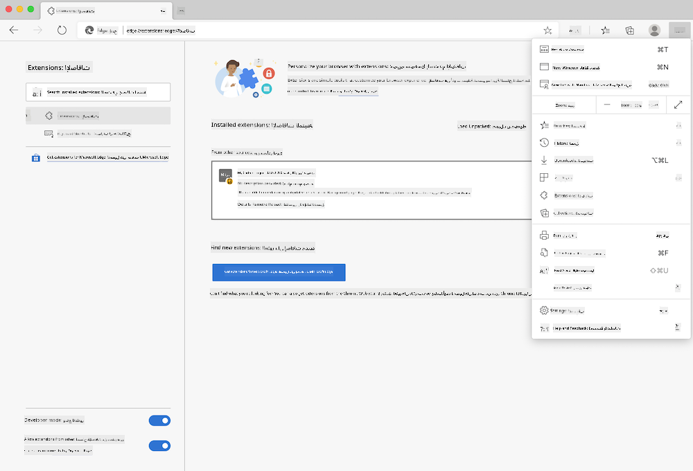

<!--
CO_OP_TRANSLATOR_METADATA:
{
  "original_hash": "fab4e6b4f0efcd587a9029d82991f597",
  "translation_date": "2025-08-25T23:50:02+00:00",
  "source_file": "5-browser-extension/solution/README.md",
  "language_code": "ar"
}
-->
# ملحق متصفح Carbon Trigger: الكود المكتمل

باستخدام واجهة برمجة التطبيقات C02 Signal الخاصة بـ tmrow لتتبع استخدام الكهرباء، قم ببناء ملحق متصفح بحيث يكون لديك تذكير مباشرة في متصفحك حول مدى كثافة استخدام الكهرباء في منطقتك. استخدام هذا الملحق بشكل عشوائي سيساعدك على اتخاذ قرارات بشأن أنشطتك بناءً على هذه المعلومات.


## البدء

ستحتاج إلى تثبيت [npm](https://npmjs.com). قم بتنزيل نسخة من هذا الكود إلى مجلد على جهاز الكمبيوتر الخاص بك.

قم بتثبيت جميع الحزم المطلوبة:

```
npm install
```

قم ببناء الملحق باستخدام webpack:

```
npm run build
```

لتثبيت الملحق على Edge، استخدم قائمة "النقاط الثلاث" في الزاوية العلوية اليمنى من المتصفح للعثور على لوحة الملحقات. من هناك، اختر "تحميل غير معبأ" لتحميل ملحق جديد. افتح مجلد "dist" عند المطالبة وسيتم تحميل الملحق. لاستخدامه، ستحتاج إلى مفتاح API لواجهة برمجة التطبيقات الخاصة بـ CO2 Signal ([احصل على واحد عبر البريد الإلكتروني هنا](https://www.co2signal.com/) - أدخل بريدك الإلكتروني في المربع الموجود على هذه الصفحة) ورمز منطقتك المقابل لـ [خريطة الكهرباء](http://api.electricitymap.org/v3/zones) ([Electricity Map](https://www.electricitymap.org/map)) (في بوسطن، على سبيل المثال، أستخدم "US-NEISO").



بمجرد إدخال مفتاح API والمنطقة في واجهة الملحق، يجب أن تتغير النقطة الملونة في شريط ملحق المتصفح لتعكس استخدام الطاقة في منطقتك وتقدم لك إشارة حول الأنشطة الثقيلة بالطاقة التي سيكون من المناسب القيام بها. تم استلهام فكرة هذا النظام "النقطة" من ملحق [Energy Lollipop](https://energylollipop.com/) لانبعاثات كاليفورنيا.

**إخلاء المسؤولية**:  
تم ترجمة هذا المستند باستخدام خدمة الترجمة بالذكاء الاصطناعي [Co-op Translator](https://github.com/Azure/co-op-translator). بينما نسعى لتحقيق الدقة، يرجى العلم أن الترجمات الآلية قد تحتوي على أخطاء أو معلومات غير دقيقة. يجب اعتبار المستند الأصلي بلغته الأصلية المصدر الموثوق. للحصول على معلومات حاسمة، يُوصى بالاستعانة بترجمة بشرية احترافية. نحن غير مسؤولين عن أي سوء فهم أو تفسيرات خاطئة تنشأ عن استخدام هذه الترجمة.