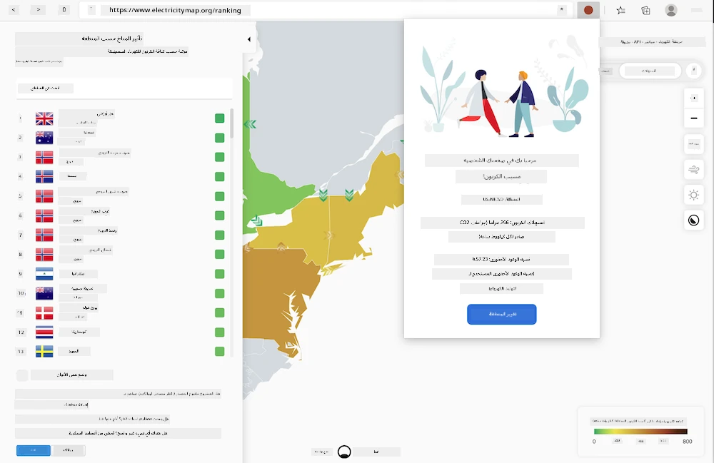
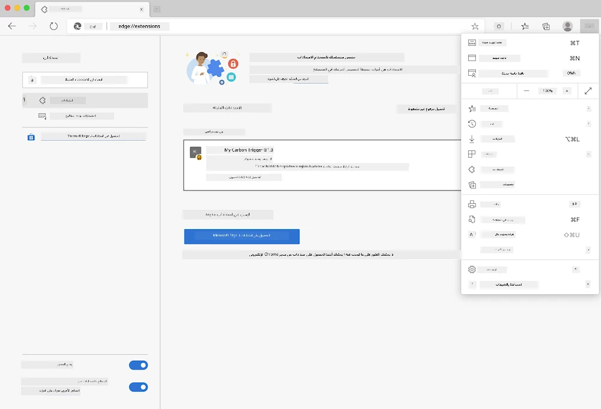

# ملحق متصفح Carbon Trigger: الكود المكتمل

باستخدام واجهة برمجة التطبيقات C02 Signal من tmrow لتتبع استهلاك الكهرباء، قم بإنشاء ملحق متصفح حتى تتمكن من الحصول على تذكير مباشرة في متصفحك حول استهلاك الكهرباء في منطقتك. استخدام هذا الملحق المخصص سيساعدك على اتخاذ قرارات بشأن أنشطتك بناءً على هذه المعلومات.



## البدء

ستحتاج إلى تثبيت [npm](https://npmjs.com). قم بتنزيل نسخة من هذا الكود في مجلد على جهاز الكمبيوتر الخاص بك.

قم بتثبيت جميع الحزم المطلوبة:

```
npm install
```

قم ببناء الملحق باستخدام webpack

```
npm run build
```

لتثبيت الملحق على Edge، استخدم قائمة "النقاط الثلاث" في الزاوية العلوية اليمنى من المتصفح للعثور على لوحة الملحقات. من هناك، اختر "تحميل ملحق غير مضغوط" لتحميل ملحق جديد. افتح مجلد "dist" عند الطلب وسيتم تحميل الملحق. لاستخدامه، ستحتاج إلى مفتاح API لواجهة برمجة التطبيقات CO2 Signal ([احصل على واحد عبر البريد الإلكتروني هنا](https://www.co2signal.com/) - أدخل بريدك الإلكتروني في المربع الموجود على هذه الصفحة) ورمز منطقتك المقابل لـ [خريطة الكهرباء](https://www.electricitymap.org/map) ([ابحث عن الرمز هنا](http://api.electricitymap.org/v3/zones)) (في بوسطن، على سبيل المثال، أستخدم "US-NEISO").



بمجرد إدخال مفتاح API والمنطقة في واجهة الملحق، يجب أن يتغير النقطة الملونة في شريط ملحق المتصفح لتعكس استهلاك الطاقة في منطقتك وتعطيك مؤشرًا على الأنشطة التي تستهلك الطاقة والتي سيكون من المناسب القيام بها. تم استلهام فكرة هذا النظام "النقاط" من [ملحق Energy Lollipop](https://energylollipop.com/) لانبعاثات كاليفورنيا.

**إخلاء المسؤولية**:  
تم ترجمة هذا المستند باستخدام خدمة الترجمة بالذكاء الاصطناعي [Co-op Translator](https://github.com/Azure/co-op-translator). بينما نسعى لتحقيق الدقة، يرجى العلم أن الترجمات الآلية قد تحتوي على أخطاء أو معلومات غير دقيقة. يجب اعتبار المستند الأصلي بلغته الأصلية المصدر الرسمي. للحصول على معلومات حاسمة، يُوصى بالاستعانة بترجمة بشرية احترافية. نحن غير مسؤولين عن أي سوء فهم أو تفسيرات خاطئة تنشأ عن استخدام هذه الترجمة.