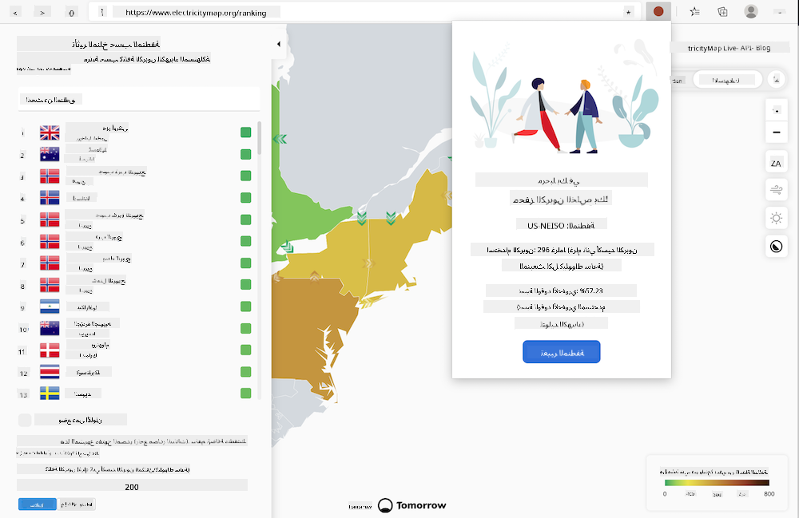

<!--
CO_OP_TRANSLATOR_METADATA:
{
  "original_hash": "3f5e6821e0febccfc5d05e7c944d9e3d",
  "translation_date": "2025-08-26T00:00:44+00:00",
  "source_file": "5-browser-extension/solution/translation/README.ja.md",
  "language_code": "ar"
}
-->
# ملحق متصفح كاربون تريجر: الكود المكتمل

قم ببناء ملحق متصفح يعرض تذكيرًا على المتصفح حول مدى كثافة استخدام الطاقة في منطقتك، باستخدام واجهة برمجة التطبيقات CO2 Signal من tmrow لتتبع استهلاك الطاقة. يمكنك استخدام هذا الملحق بشكل مخصص لاتخاذ قرارات بناءً على هذه المعلومات.



## البداية

يجب أن يكون لديك [npm](https://npmjs.com) مثبتًا. قم بتنزيل نسخة من هذا الكود إلى مجلد على جهاز الكمبيوتر الخاص بك.

قم بتثبيت جميع الحزم المطلوبة.

```
npm install
```

قم ببناء الملحق باستخدام webpack.

```
npm run build
```

لتثبيته على Edge، ابحث عن لوحة "الإضافات" من قائمة "النقاط الثلاث" في الزاوية اليمنى العليا من المتصفح. من هناك، اختر "Load Unpacked" لتحميل الملحق الجديد. عند ظهور المطالبة، افتح مجلد "dist"، وسيتم تحميل الملحق. لاستخدامه، ستحتاج إلى مفتاح API من CO2 Signal ([احصل على واحد عبر البريد الإلكتروني هنا](https://www.co2signal.com/) - أدخل بريدك الإلكتروني في المربع على هذه الصفحة)، بالإضافة إلى [رمز لمنطقتك](http://api.electricitymap.org/v3/zones) المتوافق مع [Electricity Map](https://www.electricitymap.org/map) (على سبيل المثال، في بوسطن، يتم استخدام 'US-NEISO').


بمجرد إدخال مفتاح API والمنطقة في واجهة الملحق، ستتغير النقطة الملونة التي تظهر في شريط ملحقات المتصفح لتعكس استهلاك الطاقة في منطقتك. ستساعدك هذه النقطة في تحديد الأنشطة التي تتطلب طاقة والتي من المناسب القيام بها. فكرة نظام "النقطة" مستوحاة من [ملحق Energy Lollipop](https://energylollipop.com/) الخاص بانبعاثات كاليفورنيا.

**إخلاء المسؤولية**:  
تم ترجمة هذا المستند باستخدام خدمة الترجمة بالذكاء الاصطناعي [Co-op Translator](https://github.com/Azure/co-op-translator). بينما نسعى لتحقيق الدقة، يرجى العلم أن الترجمات الآلية قد تحتوي على أخطاء أو معلومات غير دقيقة. يجب اعتبار المستند الأصلي بلغته الأصلية المصدر الرسمي. للحصول على معلومات حاسمة، يُوصى بالاستعانة بترجمة بشرية احترافية. نحن غير مسؤولين عن أي سوء فهم أو تفسيرات خاطئة تنشأ عن استخدام هذه الترجمة.