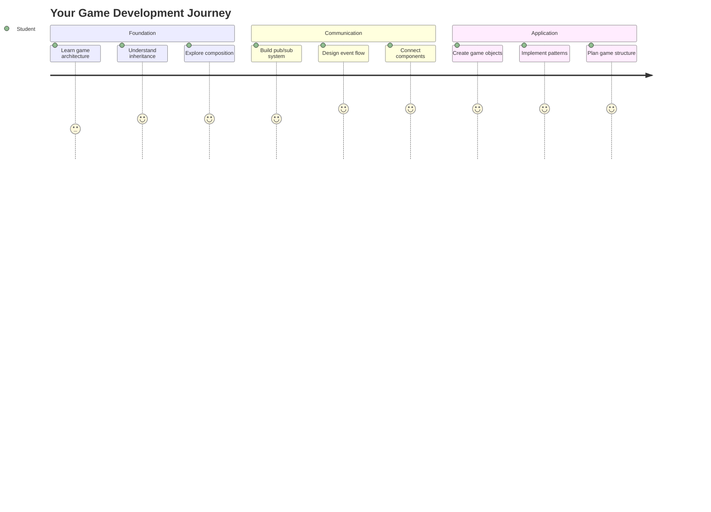
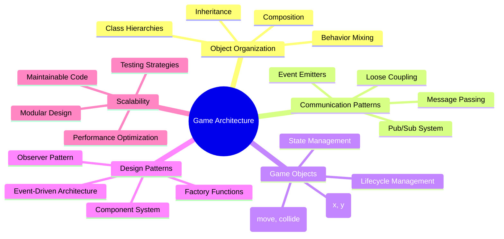
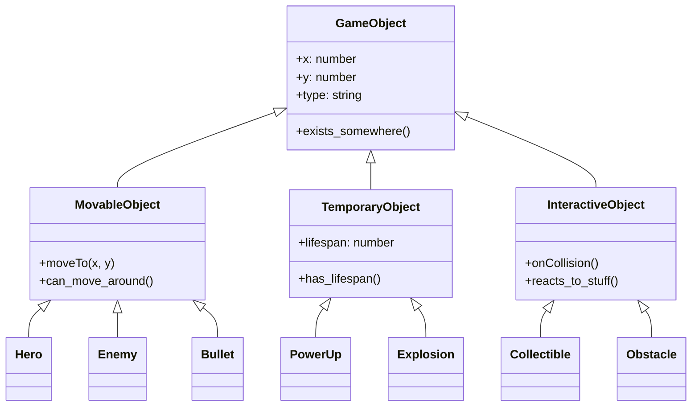
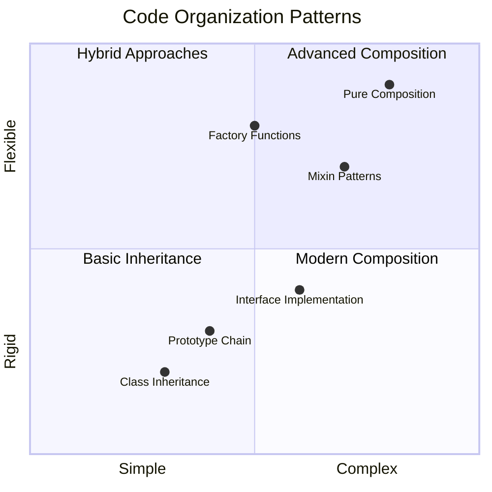
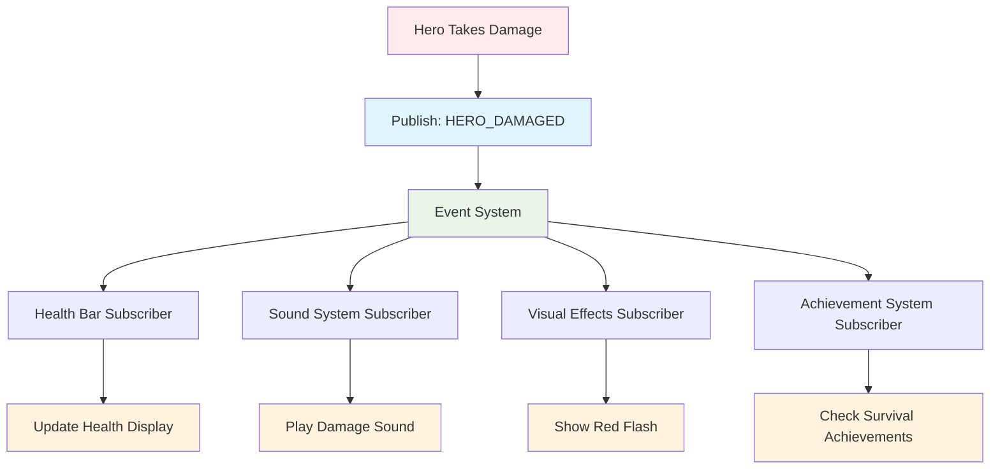
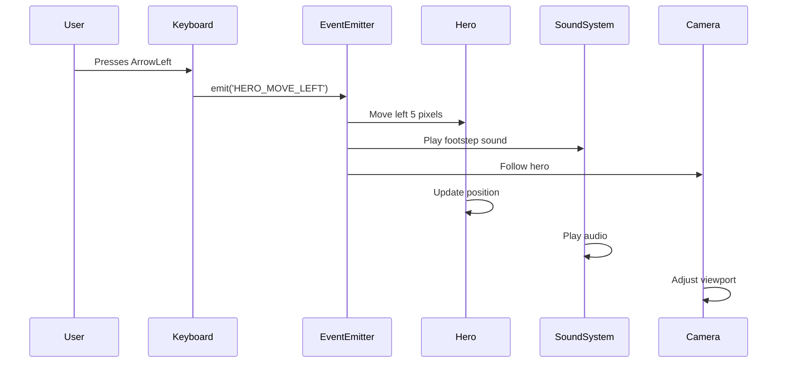
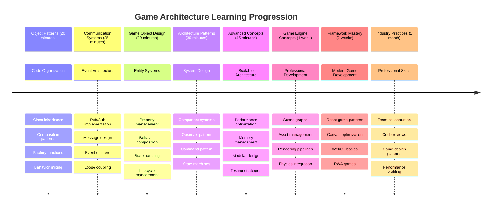

# بناء لعبة فضاء الجزء الأول: المقدمة




تمامًا كما تنسق وحدة التحكم في مهام ناسا بين الأنظمة المختلفة أثناء إطلاق المركبة الفضائية، سنقوم ببناء لعبة فضاء تُظهر كيف يمكن لأجزاء مختلفة من البرنامج أن تعمل معًا بسلاسة. أثناء إنشاء شيء يمكنك بالفعل اللعب به، ستتعلم مفاهيم البرمجة الأساسية التي تنطبق على أي مشروع برمجي.

سنستكشف نهجين أساسيين لتنظيم الكود: الوراثة والتركيب. هذه ليست مجرد مفاهيم أكاديمية – بل هي نفس الأنماط التي تدعم كل شيء من ألعاب الفيديو إلى أنظمة البنوك. سنقوم أيضًا بتنفيذ نظام اتصال يسمى pub/sub يعمل مثل شبكات الاتصال المستخدمة في المركبات الفضائية، مما يسمح للمكونات المختلفة بمشاركة المعلومات دون إنشاء تبعيات.

بحلول نهاية هذه السلسلة، ستفهم كيفية بناء تطبيقات يمكن أن تتوسع وتتطور – سواء كنت تطور ألعابًا أو تطبيقات ويب أو أي نظام برمجي آخر.



## اختبار ما قبل المحاضرة

[اختبار ما قبل المحاضرة](https://ff-quizzes.netlify.app/web/quiz/29)

## الوراثة والتركيب في تطوير الألعاب

مع نمو المشاريع في التعقيد، يصبح تنظيم الكود أمرًا بالغ الأهمية. ما يبدأ كبرنامج بسيط يمكن أن يصبح صعبًا في الصيانة بدون هيكل مناسب – تمامًا مثلما تطلبت مهمات أبولو تنسيقًا دقيقًا بين آلاف المكونات.

سنستكشف نهجين أساسيين لتنظيم الكود: الوراثة والتركيب. لكل منهما مزايا مميزة، وفهم كلاهما يساعدك على اختيار النهج المناسب للمواقف المختلفة. سنوضح هذه المفاهيم من خلال لعبة الفضاء الخاصة بنا، حيث يجب أن يتفاعل الأبطال والأعداء والمكافآت وغيرها من العناصر بكفاءة.

✅ أحد أشهر كتب البرمجة على الإطلاق يتعلق بـ [أنماط التصميم](https://en.wikipedia.org/wiki/Design_Patterns).

في أي لعبة، لديك `كائنات اللعبة` – العناصر التفاعلية التي تملأ عالم اللعبة. الأبطال، الأعداء، المكافآت، والمؤثرات البصرية كلها كائنات لعبة. كل منها موجود في إحداثيات شاشة محددة باستخدام قيم `x` و `y`، مشابهة لتحديد النقاط على مستوى إحداثي.

على الرغم من اختلافاتها البصرية، غالبًا ما تشترك هذه الكائنات في سلوكيات أساسية:

- **توجد في مكان ما** – كل كائن لديه إحداثيات x و y حتى تعرف اللعبة مكان رسمه
- **يمكن للكثير منها التحرك** – الأبطال يركضون، الأعداء يطاردون، الرصاص يطير عبر الشاشة
- **لديها عمر محدد** – بعضها يبقى للأبد، والبعض الآخر (مثل الانفجارات) يظهر لفترة وجيزة ويختفي
- **تتفاعل مع الأشياء** – عندما تصطدم الأشياء، يتم جمع المكافآت، وتحديث شريط الصحة

✅ فكر في لعبة مثل باك مان. هل يمكنك تحديد الأنواع الأربعة من الكائنات المذكورة أعلاه في هذه اللعبة؟



### التعبير عن السلوك من خلال الكود

الآن بعد أن فهمت السلوكيات المشتركة التي تشترك فيها كائنات اللعبة، دعنا نستكشف كيفية تنفيذ هذه السلوكيات في JavaScript. يمكنك التعبير عن سلوك الكائن من خلال طرق مرتبطة بالفئات أو الكائنات الفردية، وهناك عدة طرق للاختيار من بينها.

**النهج القائم على الفئات**

توفر الفئات والوراثة نهجًا منظمًا لتنظيم كائنات اللعبة. مثل نظام التصنيف الذي طوره كارل لينيوس، تبدأ بفئة أساسية تحتوي على الخصائص المشتركة، ثم تنشئ فئات متخصصة ترث هذه الأساسيات مع إضافة قدرات محددة.

✅ الوراثة مفهوم مهم لفهمه. تعرف على المزيد في [مقال MDN عن الوراثة](https://developer.mozilla.org/docs/Web/JavaScript/Inheritance_and_the_prototype_chain).

إليك كيفية تنفيذ كائنات اللعبة باستخدام الفئات والوراثة:

```javascript
// Step 1: Create the base GameObject class
class GameObject {
  constructor(x, y, type) {
    this.x = x;
    this.y = y;
    this.type = type;
  }
}
```

**لنقم بتفصيل هذا خطوة بخطوة:**
- نحن ننشئ قالبًا أساسيًا يمكن لكل كائن لعبة استخدامه
- يقوم المُنشئ بحفظ مكان وجود الكائن (`x`, `y`) ونوعه
- يصبح هذا الأساس الذي ستبني عليه جميع كائنات اللعبة

```javascript
// Step 2: Add movement capability through inheritance
class Movable extends GameObject {
  constructor(x, y, type) {
    super(x, y, type); // Call parent constructor
  }

  // Add the ability to move to a new position
  moveTo(x, y) {
    this.x = x;
    this.y = y;
  }
}
```

**في المثال أعلاه، قمنا بـ:**
- **تمديد** فئة GameObject لإضافة وظيفة الحركة
- **استدعاء** المُنشئ الأب باستخدام `super()` لتهيئة الخصائص الموروثة
- **إضافة** طريقة `moveTo()` التي تقوم بتحديث موقع الكائن

```javascript
// Step 3: Create specific game object types
class Hero extends Movable {
  constructor(x, y) {
    super(x, y, 'Hero'); // Set type automatically
  }
}

class Tree extends GameObject {
  constructor(x, y) {
    super(x, y, 'Tree'); // Trees don't need movement
  }
}

// Step 4: Use your game objects
const hero = new Hero(0, 0);
hero.moveTo(5, 5); // Hero can move!

const tree = new Tree(10, 15);
// tree.moveTo() would cause an error - trees can't move
```

**فهم هذه المفاهيم:**
- **إنشاء** أنواع كائنات متخصصة ترث السلوكيات المناسبة
- **إظهار** كيف تسمح الوراثة بتضمين الميزات بشكل انتقائي
- **توضيح** أن الأبطال يمكنهم التحرك بينما تبقى الأشجار ثابتة
- **إظهار** كيف تمنع التسلسل الهرمي للفئات الإجراءات غير المناسبة

✅ خذ بضع دقائق لإعادة تصور بطل باك مان (مثل إنكي، بينكي أو بلينكي) وكيف يمكن كتابته في JavaScript.

**نهج التركيب**

يتبع التركيب فلسفة التصميم المعياري، مشابهة لكيفية تصميم المهندسين للمركبات الفضائية بمكونات قابلة للتبديل. بدلاً من الوراثة من فئة رئيسية، تقوم بدمج سلوكيات محددة لإنشاء كائنات تحتوي على الوظائف التي تحتاجها بالضبط. يوفر هذا النهج مرونة دون قيود هرمية صارمة.

```javascript
// Step 1: Create base behavior objects
const gameObject = {
  x: 0,
  y: 0,
  type: ''
};

const movable = {
  moveTo(x, y) {
    this.x = x;
    this.y = y;
  }
};
```

**ما يفعله هذا الكود:**
- **يُعرّف** كائن لعبة أساسي بخصائص الموقع والنوع
- **ينشئ** كائن سلوك قابل للحركة منفصل مع وظيفة الحركة
- **يفصل** الاهتمامات من خلال الحفاظ على بيانات الموقع ومنطق الحركة بشكل مستقل

```javascript
// Step 2: Compose objects by combining behaviors
const movableObject = { ...gameObject, ...movable };

// Step 3: Create factory functions for different object types
function createHero(x, y) {
  return {
    ...movableObject,
    x,
    y,
    type: 'Hero'
  };
}

function createStatic(x, y, type) {
  return {
    ...gameObject,
    x,
    y,
    type
  };
}
```

**في المثال أعلاه، قمنا بـ:**
- **دمج** خصائص الكائن الأساسي مع سلوك الحركة باستخدام بناء الجملة المنتشر
- **إنشاء** وظائف المصنع التي تعيد كائنات مخصصة
- **تمكين** إنشاء كائنات مرنة دون تسلسل هرمي صارم للفئات
- **السماح** للكائنات بالحصول على السلوكيات التي تحتاجها بالضبط

```javascript
// Step 4: Create and use your composed objects
const hero = createHero(10, 10);
hero.moveTo(5, 5); // Works perfectly!

const tree = createStatic(0, 0, 'Tree');
// tree.moveTo() is undefined - no movement behavior was composed
```

**نقاط رئيسية يجب تذكرها:**
- **تكوين** الكائنات عن طريق مزج السلوكيات بدلاً من وراثتها
- **توفير** مرونة أكثر من التسلسل الهرمي للوراثة
- **السماح** للكائنات بالحصول على الميزات التي تحتاجها بالضبط
- **استخدام** بناء الجملة المنتشر الحديث في JavaScript لتجميع الكائنات بشكل نظيف
```

**Which Pattern Should You Choose?**

**Which Pattern Should You Choose?**



> 💡 **نصيحة احترافية**: كلا النمطين لهما مكانهما في تطوير JavaScript الحديث. تعمل الفئات بشكل جيد مع التسلسلات الهرمية المحددة بوضوح، بينما يبرز التركيب عندما تحتاج إلى أقصى قدر من المرونة.
> 
**إليك متى تستخدم كل نهج:**
- **اختر** الوراثة عندما يكون لديك علاقات "هو-نوع" واضحة (البطل *هو-نوع* كائن قابل للحركة)
- **اختر** التركيب عندما تحتاج إلى علاقات "يملك-نوع" (البطل *يملك* قدرات الحركة)
- **ضع في اعتبارك** تفضيلات فريقك ومتطلبات المشروع
- **تذكر** أنه يمكنك مزج كلا النهجين في نفس التطبيق

### 🔄 **تقييم تربوي**
**فهم تنظيم الكائنات**: قبل الانتقال إلى أنماط الاتصال، تأكد من أنك تستطيع:
- ✅ شرح الفرق بين الوراثة والتركيب
- ✅ تحديد متى تستخدم الفئات مقابل وظائف المصنع
- ✅ فهم كيفية عمل الكلمة المفتاحية `super()` في الوراثة
- ✅ التعرف على فوائد كل نهج لتطوير الألعاب

**اختبار سريع ذاتي**: كيف يمكنك إنشاء عدو طائر يمكنه التحرك والطيران؟
- **نهج الوراثة**: `class FlyingEnemy extends Movable`
- **نهج التركيب**: `{ ...movable, ...flyable, ...gameObject }`

**اتصال بالعالم الحقيقي**: تظهر هذه الأنماط في كل مكان:
- **مكونات React**: الخصائص (التركيب) مقابل الوراثة الفئوية
- **محركات الألعاب**: أنظمة الكائنات المكونة تستخدم التركيب
- **تطبيقات الهواتف المحمولة**: أطر واجهات المستخدم غالبًا ما تستخدم التسلسلات الهرمية للوراثة

## أنماط الاتصال: نظام Pub/Sub

مع نمو التطبيقات في التعقيد، يصبح إدارة الاتصال بين المكونات تحديًا. يحل نمط النشر-الاشتراك (pub/sub) هذه المشكلة باستخدام مبادئ مشابهة للبث الإذاعي – يمكن لجهاز إرسال واحد الوصول إلى عدة مستقبلين دون معرفة من يستمع.

فكر في ما يحدث عندما يتعرض البطل للضرر: يتم تحديث شريط الصحة، تشغيل المؤثرات الصوتية، وظهور ردود فعل بصرية. بدلاً من ربط كائن البطل مباشرة بهذه الأنظمة، يسمح pub/sub للبطل ببث رسالة "تم تلقي الضرر". يمكن لأي نظام يحتاج إلى الاستجابة الاشتراك في هذا النوع من الرسائل والتفاعل وفقًا لذلك.

✅ **Pub/Sub** تعني "النشر-الاشتراك"



### فهم بنية Pub/Sub

يحافظ نمط pub/sub على أجزاء مختلفة من تطبيقك غير مرتبطة بشكل وثيق، مما يعني أنها يمكن أن تعمل معًا دون أن تعتمد مباشرة على بعضها البعض. هذا الفصل يجعل الكود الخاص بك أكثر قابلية للصيانة، والاختبار، والمرونة للتغييرات.

**العناصر الرئيسية في pub/sub:**
- **الرسائل** – تسميات نصية بسيطة مثل `'PLAYER_SCORED'` تصف ما حدث (بالإضافة إلى أي معلومات إضافية)
- **الناشرون** – الكائنات التي تصرخ "حدث شيء ما!" لأي شخص يستمع
- **المشتركون** – الكائنات التي تقول "أنا أهتم بهذا الحدث" وتستجيب عندما يحدث
- **نظام الأحداث** – الوسيط الذي يضمن وصول الرسائل إلى المستمعين المناسبين

### بناء نظام أحداث

لنقم بإنشاء نظام أحداث بسيط ولكنه قوي يوضح هذه المفاهيم:

```javascript
// Step 1: Create the EventEmitter class
class EventEmitter {
  constructor() {
    this.listeners = {}; // Store all event listeners
  }
  
  // Register a listener for a specific message type
  on(message, listener) {
    if (!this.listeners[message]) {
      this.listeners[message] = [];
    }
    this.listeners[message].push(listener);
  }
  
  // Send a message to all registered listeners
  emit(message, payload = null) {
    if (this.listeners[message]) {
      this.listeners[message].forEach(listener => {
        listener(message, payload);
      });
    }
  }
}
```

**تفصيل ما يحدث هنا:**
- **إنشاء** نظام إدارة أحداث مركزي باستخدام فئة بسيطة
- **تخزين** المستمعين في كائن منظم حسب نوع الرسالة
- **تسجيل** مستمعين جدد باستخدام طريقة `on()`
- **بث** الرسائل لجميع المستمعين المهتمين باستخدام `emit()`
- **دعم** حمولات بيانات اختيارية لتمرير المعلومات ذات الصلة

### جمع كل شيء معًا: مثال عملي

حسنًا، دعنا نرى هذا عمليًا! سنقوم ببناء نظام حركة بسيط يظهر كيف يمكن أن يكون pub/sub نظيفًا ومرنًا:

```javascript
// Step 1: Define your message types
const Messages = {
  HERO_MOVE_LEFT: 'HERO_MOVE_LEFT',
  HERO_MOVE_RIGHT: 'HERO_MOVE_RIGHT',
  ENEMY_SPOTTED: 'ENEMY_SPOTTED'
};

// Step 2: Create your event system and game objects
const eventEmitter = new EventEmitter();
const hero = createHero(0, 0);
```

**ما يفعله هذا الكود:**
- **يُعرّف** كائنًا ثابتًا لمنع الأخطاء الإملائية في أسماء الرسائل
- **ينشئ** مثيلًا لمُصدر الأحداث للتعامل مع جميع الاتصالات
- **يُهيئ** كائن البطل في الموقع الابتدائي

```javascript
// Step 3: Set up event listeners (subscribers)
eventEmitter.on(Messages.HERO_MOVE_LEFT, () => {
  hero.moveTo(hero.x - 5, hero.y);
  console.log(`Hero moved to position: ${hero.x}, ${hero.y}`);
});

eventEmitter.on(Messages.HERO_MOVE_RIGHT, () => {
  hero.moveTo(hero.x + 5, hero.y);
  console.log(`Hero moved to position: ${hero.x}, ${hero.y}`);
});
```

**في المثال أعلاه، قمنا بـ:**
- **تسجيل** مستمعي الأحداث الذين يستجيبون لرسائل الحركة
- **تحديث** موقع البطل بناءً على اتجاه الحركة
- **إضافة** تسجيلات وحدة التحكم لتتبع تغييرات موقع البطل
- **فصل** منطق الحركة عن معالجة الإدخال

```javascript
// Step 4: Connect keyboard input to events (publishers)
window.addEventListener('keydown', (event) => {
  switch(event.key) {
    case 'ArrowLeft':
      eventEmitter.emit(Messages.HERO_MOVE_LEFT);
      break;
    case 'ArrowRight':
      eventEmitter.emit(Messages.HERO_MOVE_RIGHT);
      break;
  }
});
```

**فهم هذه المفاهيم:**
- **ربط** إدخال لوحة المفاتيح بأحداث اللعبة دون ارتباط وثيق
- **تمكين** نظام الإدخال من التواصل مع كائنات اللعبة بشكل غير مباشر
- **السماح** لأنظمة متعددة بالاستجابة لنفس أحداث لوحة المفاتيح
- **جعل** من السهل تغيير روابط المفاتيح أو إضافة طرق إدخال جديدة



> 💡 **نصيحة احترافية**: جمال هذا النمط هو المرونة! يمكنك بسهولة إضافة مؤثرات صوتية، اهتزاز الشاشة، أو تأثيرات الجسيمات ببساطة عن طريق إضافة المزيد من مستمعي الأحداث – لا حاجة لتعديل كود لوحة المفاتيح أو الحركة الحالي.
> 
**إليك لماذا ستحب هذا النهج:**
- يصبح إضافة ميزات جديدة أمرًا سهلاً للغاية – فقط استمع للأحداث التي تهتم بها
- يمكن لأشياء متعددة الاستجابة لنفس الحدث دون التداخل مع بعضها البعض
- يصبح الاختبار أسهل بكثير لأن كل جزء يعمل بشكل مستقل
- عندما يحدث خطأ ما، تعرف بالضبط أين تبحث

### لماذا يتوسع Pub/Sub بشكل فعال

يحافظ نمط pub/sub على البساطة مع نمو التطبيقات في التعقيد. سواء كنت تدير عشرات الأعداء، تحديثات واجهة المستخدم الديناميكية، أو أنظمة الصوت، فإن النمط يتعامل مع زيادة الحجم دون تغييرات معمارية. تتكامل الميزات الجديدة مع نظام الأحداث الحالي دون التأثير على الوظائف القائمة.

> ⚠️ **خطأ شائع**: لا تنشئ الكثير من أنواع الرسائل المحددة في وقت مبكر. ابدأ بفئات واسعة وقم بتحسينها مع وضوح احتياجات لعبتك.
> 
**أفضل الممارسات التي يجب اتباعها:**
- **تجميع** الرسائل ذات الصلة في فئات منطقية
- **استخدام** أسماء وصفية تشير بوضوح إلى ما حدث
- **الحفاظ** على حمولات الرسائل بسيطة ومركزة
- **توثيق** أنواع الرسائل للتعاون بين الفريق

### 🔄 **تقييم تربوي**
**فهم بنية الأحداث**: تحقق من فهمك للنظام الكامل:
- ✅ كيف يمنع نمط pub/sub الارتباط الوثيق بين المكونات؟
- ✅ لماذا يصبح من الأسهل إضافة ميزات جديدة مع بنية تعتمد على الأحداث؟
- ✅ ما الدور الذي يلعبه EventEmitter في تدفق الاتصالات؟
- ✅ كيف تمنع ثوابت الرسائل الأخطاء وتحسن قابلية الصيانة؟

**تحدي التصميم**: كيف ستتعامل مع هذه السيناريوهات في اللعبة باستخدام pub/sub؟
1. **موت العدو**: تحديث النقاط، تشغيل الصوت، ظهور المكافأة، الإزالة من الشاشة
2. **إكمال المستوى**: إيقاف الموسيقى، عرض واجهة المستخدم، حفظ التقدم، تحميل المستوى التالي
3. **جمع المكافأة**: تحسين القدرات، تحديث واجهة المستخدم، تشغيل التأثير، بدء المؤقت

**اتصال مهني**: يظهر هذا النمط في:
- **إطارات العمل الأمامية**: أنظمة الأحداث في React/Vue
- **الخدمات الخلفية**: اتصالات الخدمات المصغرة
- **محركات الألعاب**: نظام الأحداث في Unity
- **تطوير الهواتف المحمولة**: أنظمة الإشعارات في iOS/Android

---

## تحدي GitHub Copilot Agent 🚀

استخدم وضع الوكيل لإكمال التحدي التالي:

**الوصف:** قم بإنشاء نظام كائن لعبة بسيط باستخدام كل من الوراثة ونمط pub/sub. ستقوم بتنفيذ لعبة أساسية حيث يمكن للكائنات المختلفة التواصل من خلال الأحداث دون معرفة مباشرة ببعضها البعض.

**المهمة:** قم بإنشاء نظام لعبة JavaScript مع المتطلبات التالية: 1) إنشاء فئة GameObject الأساسية مع إحداثيات x و y وخصائص النوع. 2) إنشاء فئة Hero التي تمتد GameObject ويمكنها التحرك. 3) إنشاء فئة Enemy التي تمتد GameObject ويمكنها مطاردة البطل. 4) تنفيذ فئة EventEmitter لنمط pub/sub. 5) إعداد مستمعي الأحداث بحيث عندما يتحرك البطل، يتلقى الأعداء القريبون حدث 'HERO_MOVED' ويحدثون موقعهم للتحرك نحو البطل. قم بتضمين عبارات console.log لإظهار التواصل بين الكائنات.

تعرف على المزيد حول [وضع الوكيل](https://code.visualstudio.com/blogs/2025/02/24/introducing-copilot-agent-mode) هنا.

## 🚀 التحدي
فكر في كيفية تحسين بنية الألعاب باستخدام نمط النشر والاشتراك. حدد أي المكونات يجب أن تصدر الأحداث وكيف يجب أن يستجيب النظام. قم بتصميم فكرة لعبة ورسم خريطة لأنماط التواصل بين مكوناتها.

## اختبار ما بعد المحاضرة

[اختبار ما بعد المحاضرة](https://ff-quizzes.netlify.app/web/quiz/30)

## المراجعة والدراسة الذاتية

تعرف على المزيد حول النشر والاشتراك من خلال [قراءة المزيد عنه](https://docs.microsoft.com/azure/architecture/patterns/publisher-subscriber/?WT.mc_id=academic-77807-sagibbon).

### ⚡ **ما يمكنك القيام به في الدقائق الخمس القادمة**
- [ ] افتح أي لعبة HTML5 عبر الإنترنت وقم بفحص الكود الخاص بها باستخدام أدوات المطور
- [ ] أنشئ عنصر HTML5 Canvas بسيط وارسم شكلاً أساسيًا
- [ ] جرب استخدام `setInterval` لإنشاء حلقة رسوم متحركة بسيطة
- [ ] استكشف وثائق Canvas API وجرب طريقة رسم

### 🎯 **ما يمكنك إنجازه خلال هذه الساعة**
- [ ] أكمل اختبار ما بعد الدرس وافهم مفاهيم تطوير الألعاب
- [ ] قم بإعداد هيكل مشروع لعبتك باستخدام ملفات HTML وCSS وJavaScript
- [ ] أنشئ حلقة لعبة أساسية تقوم بالتحديث والعرض بشكل مستمر
- [ ] ارسم أول شخصيات لعبتك على اللوحة
- [ ] قم بتنفيذ تحميل الأصول الأساسية للصور والأصوات

### 📅 **إنشاء لعبة خلال أسبوع**
- [ ] أكمل لعبة الفضاء بالكامل مع جميع الميزات المخطط لها
- [ ] أضف رسومات محسنة، مؤثرات صوتية، ورسوم متحركة سلسة
- [ ] قم بتنفيذ حالات اللعبة (شاشة البداية، اللعب، نهاية اللعبة)
- [ ] أنشئ نظام تسجيل النقاط وتتبع تقدم اللاعب
- [ ] اجعل لعبتك متجاوبة وقابلة للوصول عبر الأجهزة المختلفة
- [ ] شارك لعبتك عبر الإنترنت واجمع آراء اللاعبين

### 🌟 **تطوير الألعاب خلال شهر**
- [ ] قم بإنشاء ألعاب متعددة تستكشف أنواع وآليات مختلفة
- [ ] تعلم إطار عمل لتطوير الألعاب مثل Phaser أو Three.js
- [ ] ساهم في مشاريع تطوير الألعاب مفتوحة المصدر
- [ ] أتقن أنماط البرمجة المتقدمة وتحسين الأداء
- [ ] أنشئ ملفًا شخصيًا يعرض مهاراتك في تطوير الألعاب
- [ ] قم بتوجيه الآخرين المهتمين بتطوير الألعاب والوسائط التفاعلية

## 🎯 جدول زمني لإتقان تطوير الألعاب



### 🛠️ ملخص أدوات بنية الألعاب الخاصة بك

بعد إكمال هذا الدرس، لديك الآن:
- **إتقان أنماط التصميم**: فهم الموازنة بين الوراثة والتركيب
- **بنية قائمة على الأحداث**: تنفيذ النشر والاشتراك لتواصل قابل للتوسع
- **تصميم كائني التوجه**: تسلسل الفئات وتركيب السلوكيات
- **JavaScript الحديثة**: وظائف المصنع، بناء الجملة المنتشر، وأنماط ES6+
- **بنية قابلة للتوسع**: تصميم غير مترابط ومبادئ التصميم المعياري
- **أساسيات تطوير الألعاب**: أنظمة الكيانات وأنماط المكونات
- **أنماط احترافية**: طرق تنظيم الكود وفقًا للمعايير الصناعية

**تطبيقات واقعية**: هذه الأنماط تنطبق مباشرة على:
- **إطارات العمل الأمامية**: بنية المكونات وإدارة الحالة في React/Vue
- **الخدمات الخلفية**: تواصل الخدمات المصغرة وأنظمة قائمة على الأحداث
- **تطوير الهواتف المحمولة**: بنية تطبيقات iOS/Android وأنظمة الإشعارات
- **محركات الألعاب**: Unity، Unreal، وتطوير الألعاب عبر الويب
- **برامج المؤسسات**: تصميم أنظمة الأحداث الموزعة
- **تصميم واجهات برمجة التطبيقات**: خدمات RESTful والتواصل في الوقت الفعلي

**مهارات احترافية مكتسبة**: يمكنك الآن:
- **تصميم** بنى برمجية قابلة للتوسع باستخدام أنماط مثبتة
- **تنفيذ** أنظمة قائمة على الأحداث تتعامل مع تفاعلات معقدة
- **اختيار** استراتيجيات تنظيم الكود المناسبة لسيناريوهات مختلفة
- **تصحيح الأخطاء** وصيانة الأنظمة غير المترابطة بفعالية
- **التواصل** حول القرارات التقنية باستخدام مصطلحات معيارية صناعية

**المستوى التالي**: أنت جاهز لتنفيذ هذه الأنماط في لعبة حقيقية، استكشاف مواضيع تطوير الألعاب المتقدمة، أو تطبيق هذه المفاهيم المعمارية على تطبيقات الويب!

🌟 **إنجاز محقق**: لقد أتقنت أنماط بنية البرمجيات الأساسية التي تدعم كل شيء من الألعاب البسيطة إلى أنظمة المؤسسات المعقدة!

## المهمة

[تصميم لعبة](assignment.md)

---

**إخلاء المسؤولية**:  
تم ترجمة هذا المستند باستخدام خدمة الترجمة بالذكاء الاصطناعي [Co-op Translator](https://github.com/Azure/co-op-translator). بينما نسعى لتحقيق الدقة، يرجى العلم أن الترجمات الآلية قد تحتوي على أخطاء أو عدم دقة. يجب اعتبار المستند الأصلي بلغته الأصلية المصدر الموثوق. للحصول على معلومات حاسمة، يُوصى بالترجمة البشرية الاحترافية. نحن غير مسؤولين عن أي سوء فهم أو تفسيرات خاطئة تنشأ عن استخدام هذه الترجمة.