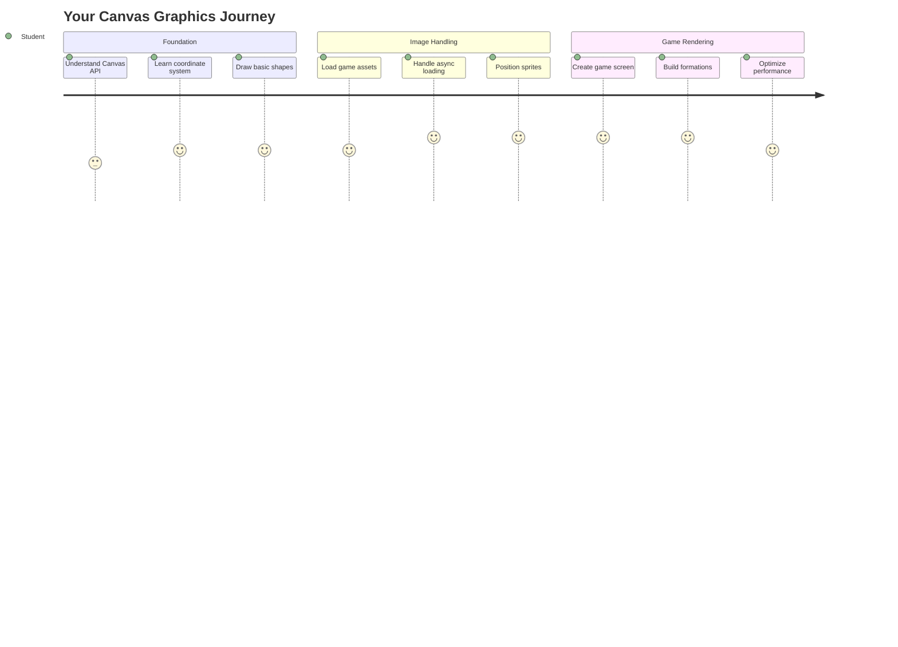
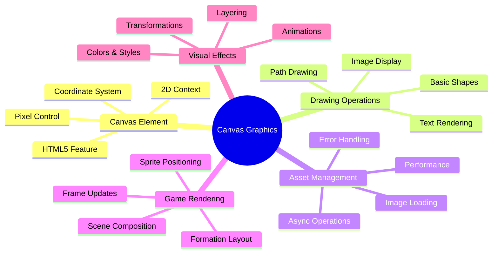
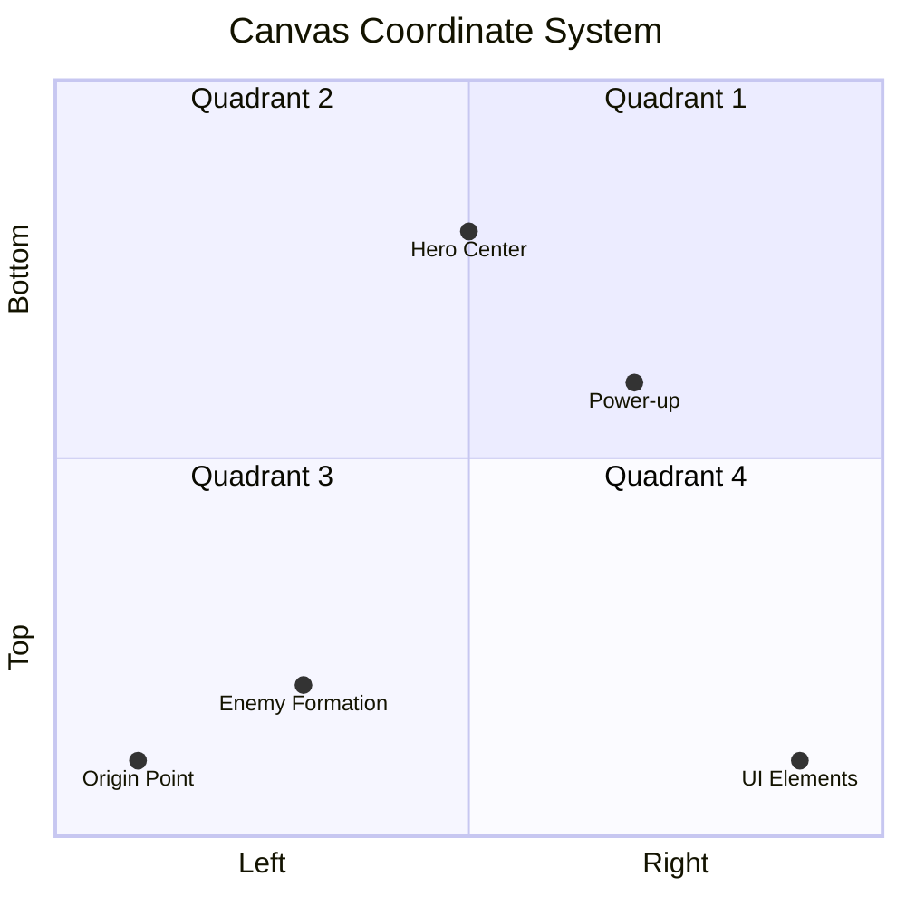
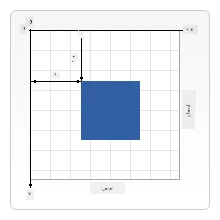
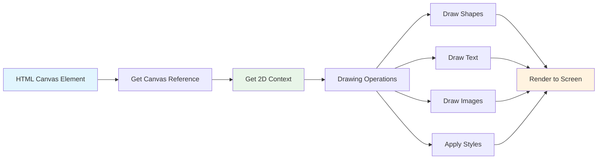
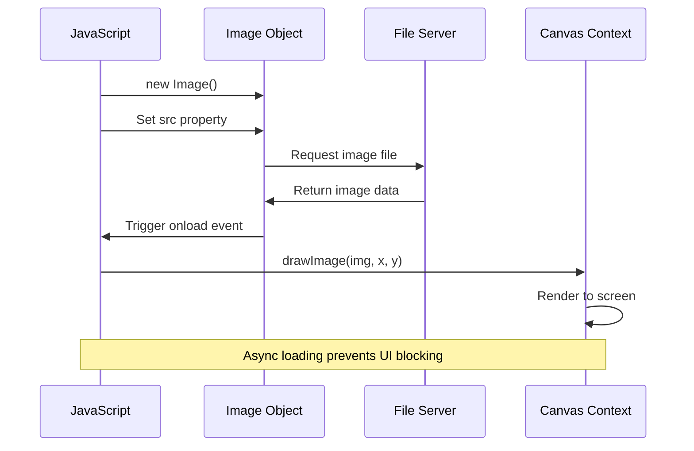
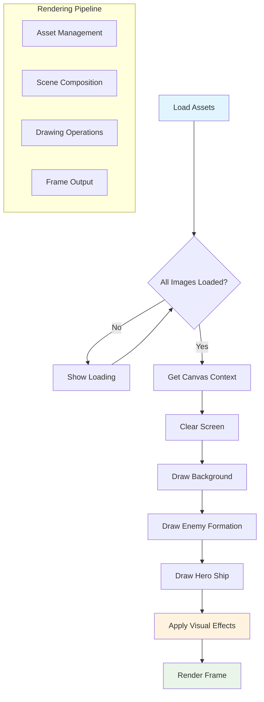
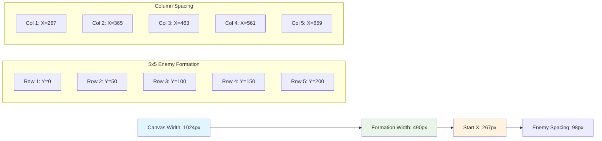
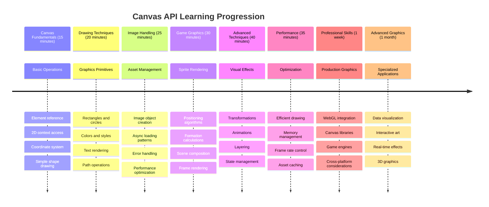

# بناء لعبة فضاء الجزء الثاني: رسم البطل والوحوش على اللوحة



تُعد واجهة برمجة التطبيقات الخاصة بـ Canvas واحدة من أقوى ميزات تطوير الويب لإنشاء رسومات ديناميكية وتفاعلية مباشرة في متصفحك. في هذا الدرس، سنحوّل عنصر HTML `<canvas>` الفارغ إلى عالم لعبة مليء بالأبطال والوحوش. فكر في اللوحة كلوحة فنية رقمية حيث يتحول الكود إلى صورة.

نحن نبني على ما تعلمته في الدرس السابق، والآن سنتعمق في الجوانب البصرية. ستتعلم كيفية تحميل وعرض صور اللعبة، وضع العناصر بدقة، وإنشاء الأساس البصري للعبة الفضاء الخاصة بك. هذا يربط بين صفحات الويب الثابتة والتجارب الديناميكية والتفاعلية.

بنهاية هذا الدرس، سيكون لديك مشهد لعبة كامل مع سفينة البطل في موقعها الصحيح وتشكيلات الأعداء جاهزة للمعركة. ستفهم كيف تقوم الألعاب الحديثة بعرض الرسومات في المتصفحات وستكتسب مهارات لإنشاء تجارب بصرية تفاعلية خاصة بك. دعونا نستكشف رسومات اللوحة ونُحيي لعبة الفضاء الخاصة بك!



## اختبار ما قبل الدرس

[اختبار ما قبل الدرس](https://ff-quizzes.netlify.app/web/quiz/31)

## اللوحة

ما هو بالضبط عنصر `<canvas>`؟ إنه حل HTML5 لإنشاء رسومات ديناميكية ورسوم متحركة في متصفحات الويب. على عكس الصور أو الفيديوهات العادية التي تكون ثابتة، تمنحك اللوحة التحكم على مستوى البكسل في كل ما يظهر على الشاشة. هذا يجعلها مثالية للألعاب، التصورات البيانية، والفن التفاعلي. فكر فيها كسطح رسم قابل للبرمجة حيث يصبح JavaScript فرشاة الرسم الخاصة بك.

بشكل افتراضي، يظهر عنصر اللوحة كأنه مستطيل فارغ وشفاف على صفحتك. لكن هنا تكمن الإمكانيات! تظهر قوتها الحقيقية عندما تستخدم JavaScript لرسم الأشكال، تحميل الصور، إنشاء الرسوم المتحركة، وجعل الأشياء تستجيب لتفاعلات المستخدم. إنها مشابهة للطريقة التي كان رواد الرسومات الحاسوبية في Bell Labs في الستينيات يبرمجون بها كل بكسل لإنشاء أول الرسوم المتحركة الرقمية.

✅ اقرأ [المزيد عن واجهة برمجة تطبيقات Canvas](https://developer.mozilla.org/docs/Web/API/Canvas_API) على MDN.

إليك كيف يتم إعلانها عادةً كجزء من جسم الصفحة:

```html
<canvas id="myCanvas" width="200" height="100"></canvas>
```

**ما الذي يفعله هذا الكود:**
- **يحدد** خاصية `id` حتى تتمكن من الإشارة إلى هذا العنصر المحدد في JavaScript
- **يعين** العرض بالبكسل للتحكم في حجم اللوحة الأفقي
- **يحدد** الارتفاع بالبكسل لتحديد أبعاد اللوحة العمودية

## رسم أشكال هندسية بسيطة

الآن بعد أن تعرفت على عنصر اللوحة، دعنا نستكشف كيفية الرسم عليها فعليًا! تستخدم اللوحة نظام إحداثيات قد يبدو مألوفًا من دروس الرياضيات، ولكن هناك لمسة مهمة خاصة بالرسومات الحاسوبية.

تستخدم اللوحة إحداثيات ديكارتية مع محور x (أفقي) ومحور y (عمودي) لتحديد موضع كل ما ترسمه. ولكن هنا الفرق الرئيسي: على عكس نظام الإحداثيات في الرياضيات، تبدأ نقطة الأصل `(0,0)` في الزاوية العلوية اليسرى، مع زيادة قيم x عند التحرك يمينًا وزيادة قيم y عند التحرك للأسفل. هذا النهج يعود إلى شاشات الكمبيوتر المبكرة حيث كانت أشعة الإلكترون تمسح من الأعلى إلى الأسفل، مما يجعل الزاوية العلوية اليسرى نقطة البداية الطبيعية.




> الصورة من [MDN](https://developer.mozilla.org/docs/Web/API/Canvas_API/Tutorial/Drawing_shapes)

لترسم على عنصر اللوحة، ستتبع نفس العملية المكونة من ثلاث خطوات التي تشكل أساس جميع رسومات اللوحة. بمجرد القيام بذلك عدة مرات، يصبح الأمر طبيعيًا:



1. **احصل على مرجع** لعنصر اللوحة الخاص بك من DOM (مثل أي عنصر HTML آخر)
2. **احصل على سياق الرسم ثنائي الأبعاد** – هذا يوفر جميع طرق الرسم
3. **ابدأ الرسم!** استخدم الطرق المدمجة في السياق لإنشاء رسوماتك

إليك كيف يبدو هذا في الكود:

```javascript
// Step 1: Get the canvas element
const canvas = document.getElementById("myCanvas");

// Step 2: Get the 2D rendering context
const ctx = canvas.getContext("2d");

// Step 3: Set fill color and draw a rectangle
ctx.fillStyle = 'red';
ctx.fillRect(0, 0, 200, 200); // x, y, width, height
```

**دعنا نوضح هذا خطوة بخطوة:**
- نحن **نحصل** على عنصر اللوحة باستخدام معرفه ونخزنه في متغير
- نحن **نحصل** على سياق الرسم ثنائي الأبعاد – هذه هي أدواتنا المليئة بطرق الرسم
- نحن **نخبر** اللوحة أننا نريد ملء الأشياء باللون الأحمر باستخدام خاصية `fillStyle`
- نحن **نرسم** مستطيلًا يبدأ من الزاوية العلوية اليسرى (0,0) بعرض وارتفاع 200 بكسل

✅ تركز واجهة برمجة تطبيقات Canvas بشكل أساسي على الأشكال ثنائية الأبعاد، ولكن يمكنك أيضًا رسم عناصر ثلاثية الأبعاد على موقع ويب؛ لهذا، قد تستخدم [واجهة برمجة تطبيقات WebGL](https://developer.mozilla.org/docs/Web/API/WebGL_API).

يمكنك رسم جميع أنواع الأشياء باستخدام واجهة برمجة تطبيقات Canvas مثل:

- **الأشكال الهندسية**، لقد أظهرنا بالفعل كيفية رسم مستطيل، ولكن هناك المزيد مما يمكنك رسمه.
- **النصوص**، يمكنك رسم نص بأي خط ولون ترغب فيه.
- **الصور**، يمكنك رسم صورة بناءً على أصل صورة مثل .jpg أو .png على سبيل المثال.

✅ جربها! أنت تعرف كيفية رسم مستطيل، هل يمكنك رسم دائرة على الصفحة؟ ألقِ نظرة على بعض رسومات اللوحة المثيرة للاهتمام على CodePen. إليك [مثال مثير للإعجاب](https://codepen.io/dissimulate/pen/KrAwx).

### 🔄 **مراجعة تربوية**
**فهم أساسيات اللوحة**: قبل الانتقال إلى تحميل الصور، تأكد من أنك تستطيع:
- ✅ شرح كيف يختلف نظام إحداثيات اللوحة عن الإحداثيات الرياضية
- ✅ فهم العملية المكونة من ثلاث خطوات لعمليات الرسم على اللوحة
- ✅ تحديد ما يوفره سياق الرسم ثنائي الأبعاد
- ✅ وصف كيف تعمل fillStyle و fillRect معًا

**اختبار ذاتي سريع**: كيف يمكنك رسم دائرة زرقاء في الموضع (100, 50) بنصف قطر 25؟
```javascript
ctx.fillStyle = 'blue';
ctx.beginPath();
ctx.arc(100, 50, 25, 0, 2 * Math.PI);
ctx.fill();
```

**طرق الرسم على اللوحة التي تعرفها الآن**:
- **fillRect()**: يرسم مستطيلات مملوءة
- **fillStyle**: يحدد الألوان والأنماط
- **beginPath()**: يبدأ مسارات رسم جديدة
- **arc()**: ينشئ دوائر ومنحنيات

## تحميل ورسم صورة

رسم الأشكال الأساسية مفيد للبدء، ولكن معظم الألعاب تحتاج إلى صور فعلية! الصور، الخلفيات، والقوام هي ما يمنح الألعاب جاذبيتها البصرية. يختلف تحميل وعرض الصور على اللوحة عن رسم الأشكال الهندسية، ولكنه بسيط بمجرد فهم العملية.

نحتاج إلى إنشاء كائن `Image`، تحميل ملف الصورة الخاص بنا (يحدث هذا بشكل غير متزامن، مما يعني "في الخلفية")، ثم رسمه على اللوحة بمجرد أن يصبح جاهزًا. يضمن هذا النهج عرض الصور بشكل صحيح دون تعطيل التطبيق أثناء تحميلها.



### تحميل الصور الأساسية

```javascript
const img = new Image();
img.src = 'path/to/my/image.png';
img.onload = () => {
  // Image loaded and ready to be used
  console.log('Image loaded successfully!');
};
```

**ما الذي يحدث في هذا الكود:**
- نحن **ننشئ** كائن صورة جديد تمامًا لحفظ الصورة أو القوام
- نحن **نخبره** أي ملف صورة يجب تحميله عن طريق تعيين مسار المصدر
- نحن **نستمع** لحدث التحميل حتى نعرف بالضبط متى تكون الصورة جاهزة للاستخدام

### طريقة أفضل لتحميل الصور

إليك طريقة أكثر قوة للتعامل مع تحميل الصور يستخدمها المطورون المحترفون عادةً. سنقوم بتغليف تحميل الصور في وظيفة تعتمد على Promise – هذا النهج، الذي أصبح شائعًا عندما أصبحت Promises معيارًا في ES6، يجعل الكود الخاص بك أكثر تنظيمًا ويتعامل مع الأخطاء بشكل أنيق:

```javascript
function loadAsset(path) {
  return new Promise((resolve, reject) => {
    const img = new Image();
    img.src = path;
    img.onload = () => {
      resolve(img);
    };
    img.onerror = () => {
      reject(new Error(`Failed to load image: ${path}`));
    };
  });
}

// Modern usage with async/await
async function initializeGame() {
  try {
    const heroImg = await loadAsset('hero.png');
    const monsterImg = await loadAsset('monster.png');
    // Images are now ready to use
  } catch (error) {
    console.error('Failed to load game assets:', error);
  }
}
```

**ما الذي قمنا به هنا:**
- **غلفنا** كل منطق تحميل الصور في Promise حتى نتمكن من التعامل معه بشكل أفضل
- **أضفنا** معالجة الأخطاء التي تخبرنا فعليًا عندما يحدث خطأ ما
- **استخدمنا** بناء الجملة الحديث async/await لأنه أكثر وضوحًا للقراءة
- **أدرجنا** كتل try/catch للتعامل مع أي مشاكل تحميل بشكل أنيق

بمجرد تحميل الصور الخاصة بك، فإن رسمها على اللوحة يكون في الواقع بسيطًا جدًا:

```javascript
async function renderGameScreen() {
  try {
    // Load game assets
    const heroImg = await loadAsset('hero.png');
    const monsterImg = await loadAsset('monster.png');

    // Get canvas and context
    const canvas = document.getElementById("myCanvas");
    const ctx = canvas.getContext("2d");

    // Draw images to specific positions
    ctx.drawImage(heroImg, canvas.width / 2, canvas.height / 2);
    ctx.drawImage(monsterImg, 0, 0);
  } catch (error) {
    console.error('Failed to render game screen:', error);
  }
}
```

**دعنا نوضح هذا خطوة بخطوة:**
- نحن **نحمل** صور البطل والوحش في الخلفية باستخدام await
- نحن **نحصل** على عنصر اللوحة ونحصل على سياق الرسم ثنائي الأبعاد الذي نحتاجه
- نحن **نضع** صورة البطل في المركز باستخدام بعض الرياضيات السريعة للإحداثيات
- نحن **نضع** صورة الوحش في الزاوية العلوية اليسرى لبدء تشكيل الأعداء
- نحن **نلتقط** أي أخطاء قد تحدث أثناء التحميل أو العرض



## الآن حان الوقت لبدء بناء لعبتك

الآن سنجمع كل شيء معًا لإنشاء الأساس البصري للعبة الفضاء الخاصة بك. لديك فهم قوي لأساسيات اللوحة وتقنيات تحميل الصور، لذا فإن هذا القسم العملي سيرشدك خلال بناء شاشة لعبة كاملة مع صور موضوعة بشكل صحيح.

### ما الذي ستبنيه

ستقوم ببناء صفحة ويب تحتوي على عنصر Canvas. يجب أن تعرض شاشة سوداء `1024*768`. لقد وفرنا لك صورتين:

- سفينة البطل

   

- 5*5 وحش

   

### الخطوات الموصى بها لبدء التطوير

حدد ملفات البداية التي تم إنشاؤها لك في مجلد `your-work`. يجب أن تحتوي بنية المشروع الخاصة بك على:

```bash
your-work/
├── assets/
│   ├── enemyShip.png
│   └── player.png
├── index.html
├── app.js
└── package.json
```

**ما الذي تعمل عليه:**
- **صور اللعبة** موجودة في مجلد `assets/` حتى يبقى كل شيء منظمًا
- **ملف HTML الرئيسي الخاص بك** يجهز عنصر اللوحة ويجهز كل شيء
- **ملف JavaScript** حيث ستكتب كل سحر عرض اللعبة الخاص بك
- **ملف package.json** الذي يجهز خادم تطوير حتى تتمكن من الاختبار محليًا

افتح هذا المجلد في Visual Studio Code لبدء التطوير. ستحتاج إلى بيئة تطوير محلية مع Visual Studio Code، NPM، و Node.js مثبتة. إذا لم يكن لديك `npm` مثبتًا على جهاز الكمبيوتر الخاص بك، [إليك كيفية تثبيته](https://www.npmjs.com/get-npm).

ابدأ خادم التطوير الخاص بك عن طريق الانتقال إلى مجلد `your-work`:

```bash
cd your-work
npm start
```

**هذا الأمر يقوم ببعض الأشياء الرائعة:**
- **يبدأ** خادمًا محليًا على `http://localhost:5000` حتى تتمكن من اختبار لعبتك
- **يخدم** جميع ملفاتك بشكل صحيح حتى يتمكن متصفحك من تحميلها بشكل صحيح
- **يراقب** ملفاتك للتغييرات حتى تتمكن من التطوير بسلاسة
- **يوفر لك** بيئة تطوير احترافية لاختبار كل شيء

> 💡 **ملاحظة**: سيعرض متصفحك صفحة فارغة في البداية – هذا متوقع! أثناء إضافة الكود، قم بتحديث المتصفح لرؤية التغييرات. هذا النهج التطويري التكراري مشابه للطريقة التي بنت بها ناسا كمبيوتر التوجيه الخاص بأبولو – اختبار كل مكون قبل دمجه في النظام الأكبر.

### أضف الكود

أضف الكود المطلوب إلى `your-work/app.js` لإكمال المهام التالية:

1. **ارسم لوحة بخلفية سوداء**
   > 💡 **إليك الطريقة**: ابحث عن TODO في `/app.js` وأضف سطرين فقط. قم بتعيين `ctx.fillStyle` إلى الأسود، ثم استخدم `ctx.fillRect()` بدءًا من (0,0) بأبعاد اللوحة الخاصة بك. سهل!

2. **تحميل قوام اللعبة**
   > 💡 **إليك الطريقة**: استخدم `await loadAsset()` لتحميل صور اللاعب والعدو. قم بتخزينها في متغيرات حتى تتمكن من استخدامها لاحقًا. تذكر – لن تظهر حتى تقوم برسمها فعليًا!

3. **ارسم سفينة البطل في الموضع السفلي الأوسط**
   > 💡 **إليك الطريقة**: استخدم `ctx.drawImage()` لوضع البطل. بالنسبة للإحداثي x، جرب `canvas.width / 2 - 45` لتوسيطه، وبالنسبة للإحداثي y استخدم `canvas.height - canvas.height / 4` لوضعه في المنطقة السفلية.

4. **ارسم تشكيلًا من 5×5 سفن الأعداء**
   > 💡 **إليك الطريقة**: ابحث عن وظيفة `createEnemies` وقم بإعداد حلقة متداخلة. ستحتاج إلى القيام ببعض الرياضيات للتباعد والتموضع، ولكن لا تقلق – سأريك بالضبط كيف!

أولاً، قم بتحديد الثوابت لتخطيط تشكيل الأعداء بشكل صحيح:

```javascript
const ENEMY_TOTAL = 5;
const ENEMY_SPACING = 98;
const FORMATION_WIDTH = ENEMY_TOTAL * ENEMY_SPACING;
const START_X = (canvas.width - FORMATION_WIDTH) / 2;
const STOP_X = START_X + FORMATION_WIDTH;
```

**دعنا نوضح ما تفعله هذه الثوابت:**
- نحن **نحدد** 5 أعداء لكل صف وعمود (شبكة جميلة 5×5)
- نحن **نحدد** مقدار المسافة بين الأعداء حتى لا تبدو مزدحمة
- نحن **نحسب** عرض التشكيل بالكامل
- نحن **نحدد** مكان البدء والانتهاء حتى يبدو التشكيل مركزيًا



ثم، قم بإنشاء حلقات متداخلة لرسم تشكيل الأعداء:

```javascript
for (let x = START_X; x < STOP_X; x += ENEMY_SPACING) {
  for (let y = 0; y < 50 * 5; y += 50) {
    ctx.drawImage(enemyImg, x, y);
  }
}
```

**ما الذي تفعله هذه الحلقة المتداخلة:**
- الحلقة الخارجية **تتحرك** من اليسار إلى اليمين عبر تشكيلنا
- الحلقة الداخلية **تذهب** من الأعلى إلى الأسفل لإنشاء صفوف مرتبة
- نحن **نرسم** كل صورة عدو في الإحداثيات x,y التي حسبناها
- كل شيء يبقى **متباعدًا بشكل متساوٍ** حتى يبدو احترافيًا ومنظمًا

### 🔄 **مراجعة تربوية**
**إتقان عرض اللعبة**: تحقق من فهمك لنظام العرض الكامل:
- ✅ كيف يمنع تحميل الصور غير المتزامن حجب واجهة المستخدم أثناء بدء تشغيل اللعبة؟
- ✅ لماذا نحسب مواضع تشكيل الأعداء باستخدام الثو
- **أنظمة الإحداثيات**: تحويل الرياضيات إلى مواقع على الشاشة  
- **إدارة الصور المتحركة**: تحميل وعرض الرسومات في الألعاب  
- **خوارزميات التشكيل**: أنماط رياضية لتصميم تخطيطات منظمة  
- **العمليات غير المتزامنة**: استخدام JavaScript الحديث لتجربة مستخدم سلسة  

## النتيجة  

يجب أن تبدو النتيجة النهائية كما يلي:  

  

## الحل  

حاول حلها بنفسك أولاً، ولكن إذا واجهت صعوبة، يمكنك الاطلاع على [الحل](../../../../6-space-game/2-drawing-to-canvas/solution/app.js)  

---

## تحدي GitHub Copilot Agent 🚀  

استخدم وضع الوكيل لإكمال التحدي التالي:  

**الوصف:** قم بتحسين لوحة لعبة الفضاء الخاصة بك عن طريق إضافة تأثيرات بصرية وعناصر تفاعلية باستخدام تقنيات Canvas API التي تعلمتها.  

**المهمة:** قم بإنشاء ملف جديد يسمى `enhanced-canvas.html` يحتوي على لوحة تعرض نجومًا متحركة في الخلفية، شريط صحة نابض لسفينة البطل، وسفن الأعداء التي تتحرك ببطء نحو الأسفل. قم بتضمين كود JavaScript يرسم نجومًا متلألئة باستخدام مواقع وألوان عشوائية، ينفذ شريط صحة يتغير لونه بناءً على مستوى الصحة (أخضر > أصفر > أحمر)، ويقوم بتحريك سفن الأعداء لتتحرك نحو الأسفل بسرعات مختلفة.  

تعرف على المزيد حول [وضع الوكيل](https://code.visualstudio.com/blogs/2025/02/24/introducing-copilot-agent-mode) هنا.  

## 🚀 التحدي  

لقد تعلمت كيفية الرسم باستخدام Canvas API المخصص للرسومات ثنائية الأبعاد؛ ألقِ نظرة على [WebGL API](https://developer.mozilla.org/docs/Web/API/WebGL_API)، وحاول رسم كائن ثلاثي الأبعاد.  

## اختبار ما بعد المحاضرة  

[اختبار ما بعد المحاضرة](https://ff-quizzes.netlify.app/web/quiz/32)  

## المراجعة والدراسة الذاتية  

تعرف على المزيد حول Canvas API من خلال [قراءة المزيد عنه](https://developer.mozilla.org/docs/Web/API/Canvas_API).  

### ⚡ **ما يمكنك القيام به في الدقائق الخمس القادمة**  
- [ ] افتح وحدة التحكم في المتصفح وأنشئ عنصر لوحة باستخدام `document.createElement('canvas')`  
- [ ] حاول رسم مستطيل باستخدام `fillRect()` على سياق اللوحة  
- [ ] جرب ألوانًا مختلفة باستخدام خاصية `fillStyle`  
- [ ] ارسم دائرة بسيطة باستخدام طريقة `arc()`  

### 🎯 **ما يمكنك تحقيقه خلال هذه الساعة**  
- [ ] أكمل اختبار ما بعد الدرس وافهم أساسيات اللوحة  
- [ ] أنشئ تطبيق رسم على اللوحة يحتوي على أشكال وألوان متعددة  
- [ ] قم بتنفيذ تحميل الصور وعرض الصور المتحركة للعبة الخاصة بك  
- [ ] أنشئ حركة بسيطة تحرك الكائنات عبر اللوحة  
- [ ] مارس تحويلات اللوحة مثل التكبير، الدوران، والترجمة  

### 📅 **رحلتك الأسبوعية مع اللوحة**  
- [ ] أكمل لعبة الفضاء برسومات محسنة وصور متحركة  
- [ ] أتقن تقنيات اللوحة المتقدمة مثل التدرجات، الأنماط، والتكوين  
- [ ] أنشئ تصورات تفاعلية باستخدام اللوحة لتمثيل البيانات  
- [ ] تعلم تقنيات تحسين اللوحة للحصول على أداء سلس  
- [ ] قم ببناء تطبيق رسم أو تلوين باستخدام أدوات متنوعة  
- [ ] استكشف أنماط البرمجة الإبداعية والفن التوليدي باستخدام اللوحة  

### 🌟 **رحلتك الشهرية لإتقان الرسومات**  
- [ ] قم ببناء تطبيقات بصرية معقدة باستخدام Canvas 2D وWebGL  
- [ ] تعلم مفاهيم برمجة الرسومات وأساسيات الشيفرات  
- [ ] ساهم في مكتبات الرسومات مفتوحة المصدر وأدوات التصور  
- [ ] أتقن تحسين الأداء للتطبيقات المكثفة الرسومية  
- [ ] أنشئ محتوى تعليمي حول برمجة اللوحة والرسومات الحاسوبية  
- [ ] كن خبيرًا في برمجة الرسومات يساعد الآخرين في إنشاء تجارب بصرية  

## 🎯 جدول زمني لإتقان رسومات اللوحة  


  
### 🛠️ ملخص أدوات رسومات اللوحة الخاصة بك  

بعد إكمال هذا الدرس، لديك الآن:  
- **إتقان Canvas API**: فهم كامل لبرمجة الرسومات ثنائية الأبعاد  
- **رياضيات الإحداثيات**: تحديد المواقع الدقيقة وخوارزميات التخطيط  
- **إدارة الأصول**: تحميل الصور بشكل احترافي ومعالجة الأخطاء  
- **خط أنابيب العرض**: نهج منظم لتكوين المشاهد  
- **رسومات الألعاب**: حسابات وضع الصور المتحركة والتشكيلات  
- **البرمجة غير المتزامنة**: أنماط JavaScript الحديثة لأداء سلس  
- **البرمجة البصرية**: تحويل المفاهيم الرياضية إلى رسومات على الشاشة  

**التطبيقات الواقعية**: مهاراتك في اللوحة تنطبق مباشرة على:  
- **تصور البيانات**: الرسوم البيانية ولوحات التحكم التفاعلية  
- **تطوير الألعاب**: الألعاب ثنائية الأبعاد، المحاكاة، والتجارب التفاعلية  
- **الفن الرقمي**: البرمجة الإبداعية ومشاريع الفن التوليدي  
- **تصميم واجهات المستخدم وتجربة المستخدم**: الرسومات المخصصة والعناصر التفاعلية  
- **البرمجيات التعليمية**: أدوات التعلم البصري والمحاكاة  
- **تطبيقات الويب**: الرسومات الديناميكية والتصورات في الوقت الفعلي  

**المهارات المهنية المكتسبة**: يمكنك الآن:  
- **إنشاء** حلول رسومات مخصصة بدون مكتبات خارجية  
- **تحسين** أداء العرض لتجارب مستخدم سلسة  
- **تصحيح الأخطاء** في المشكلات البصرية المعقدة باستخدام أدوات المطور في المتصفح  
- **تصميم** أنظمة رسومات قابلة للتوسع باستخدام المبادئ الرياضية  
- **دمج** رسومات اللوحة مع أطر عمل تطبيقات الويب الحديثة  

**طرق Canvas API التي أتقنتها**:  
- **إدارة العناصر**: getElementById، getContext  
- **عمليات الرسم**: fillRect، drawImage، fillStyle  
- **تحميل الأصول**: كائنات الصور، أنماط الوعد  
- **تحديد المواقع الرياضية**: حسابات الإحداثيات، خوارزميات التشكيل  

**المستوى التالي**: أنت جاهز لإضافة الحركة، التفاعل مع المستخدم، اكتشاف التصادم، أو استكشاف WebGL للرسومات ثلاثية الأبعاد!  

🌟 **إنجاز محقق**: لقد قمت ببناء نظام عرض ألعاب كامل باستخدام تقنيات Canvas API الأساسية!  

## المهمة  

[استمتع بالعمل مع Canvas API](assignment.md)  

---

**إخلاء المسؤولية**:  
تم ترجمة هذا المستند باستخدام خدمة الترجمة بالذكاء الاصطناعي [Co-op Translator](https://github.com/Azure/co-op-translator). بينما نسعى لتحقيق الدقة، يرجى العلم أن الترجمات الآلية قد تحتوي على أخطاء أو عدم دقة. يجب اعتبار المستند الأصلي بلغته الأصلية المصدر الرسمي. للحصول على معلومات حاسمة، يُوصى بالترجمة البشرية الاحترافية. نحن غير مسؤولين عن أي سوء فهم أو تفسيرات خاطئة تنشأ عن استخدام هذه الترجمة.