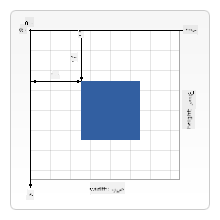

<!--
CO_OP_TRANSLATOR_METADATA:
{
  "original_hash": "41be8d35e7f30aa9dad10773c35e89c4",
  "translation_date": "2025-08-25T22:15:51+00:00",
  "source_file": "6-space-game/2-drawing-to-canvas/README.md",
  "language_code": "ar"
}
-->
# بناء لعبة فضاء الجزء الثاني: رسم البطل والوحوش على اللوحة

## اختبار ما قبل المحاضرة

[اختبار ما قبل المحاضرة](https://ff-quizzes.netlify.app/web/quiz/31)

## اللوحة

اللوحة هي عنصر HTML لا يحتوي على محتوى افتراضيًا؛ إنها مساحة فارغة. تحتاج إلى إضافة محتوى إليها عن طريق الرسم عليها.

✅ اقرأ [المزيد عن واجهة برمجة تطبيقات اللوحة](https://developer.mozilla.org/docs/Web/API/Canvas_API) على MDN.

عادةً ما يتم تعريفها كجزء من جسم الصفحة كما يلي:

```html
<canvas id="myCanvas" width="200" height="100"></canvas>
```

في الكود أعلاه، نقوم بتحديد `id` و`width` و`height`.

- `id`: يتم تعيينه للحصول على مرجع عند الحاجة للتفاعل معه.
- `width`: هذا هو عرض العنصر.
- `height`: هذا هو ارتفاع العنصر.

## رسم أشكال هندسية بسيطة

تستخدم اللوحة نظام إحداثيات ديكارتي للرسم. وبالتالي، تستخدم محور x ومحور y للتعبير عن موقع شيء ما. الموقع `0,0` هو الزاوية العلوية اليسرى، والزواية السفلية اليمنى هي ما تم تحديده كعرض وارتفاع اللوحة.


> الصورة من [MDN](https://developer.mozilla.org/docs/Web/API/Canvas_API/Tutorial/Drawing_shapes)

للرسم على عنصر اللوحة، ستحتاج إلى اتباع الخطوات التالية:

1. **الحصول على مرجع** لعنصر اللوحة.
1. **الحصول على مرجع** لعنصر السياق الذي يجلس على عنصر اللوحة.
1. **تنفيذ عملية الرسم** باستخدام عنصر السياق.

الكود لهذه الخطوات عادةً يبدو كما يلي:

```javascript
// draws a red rectangle
//1. get the canvas reference
canvas = document.getElementById("myCanvas");

//2. set the context to 2D to draw basic shapes
ctx = canvas.getContext("2d");

//3. fill it with the color red
ctx.fillStyle = 'red';

//4. and draw a rectangle with these parameters, setting location and size
ctx.fillRect(0,0, 200, 200) // x,y,width, height
```

✅ تركز واجهة برمجة تطبيقات اللوحة بشكل أساسي على الأشكال ثنائية الأبعاد، ولكن يمكنك أيضًا رسم عناصر ثلاثية الأبعاد على موقع ويب؛ لهذا، قد تستخدم [واجهة برمجة تطبيقات WebGL](https://developer.mozilla.org/docs/Web/API/WebGL_API).

يمكنك رسم العديد من الأشياء باستخدام واجهة برمجة تطبيقات اللوحة مثل:

- **الأشكال الهندسية**، لقد أظهرنا بالفعل كيفية رسم مستطيل، ولكن هناك المزيد مما يمكنك رسمه.
- **النصوص**، يمكنك رسم نص بأي خط ولون ترغب فيه.
- **الصور**، يمكنك رسم صورة بناءً على أصل صورة مثل .jpg أو .png على سبيل المثال.

✅ جربها! تعرف كيفية رسم مستطيل، هل يمكنك رسم دائرة على الصفحة؟ ألقِ نظرة على بعض الرسومات المثيرة للاهتمام باستخدام اللوحة على CodePen. إليك [مثال مثير للإعجاب](https://codepen.io/dissimulate/pen/KrAwx).

## تحميل ورسم أصل صورة

يمكنك تحميل أصل صورة عن طريق إنشاء كائن `Image` وتعيين خاصية `src` الخاصة به. ثم تستمع إلى حدث `load` لمعرفة متى يكون جاهزًا للاستخدام. الكود يبدو كما يلي:

### تحميل الأصل

```javascript
const img = new Image();
img.src = 'path/to/my/image.png';
img.onload = () => {
  // image loaded and ready to be used
}
```

### نمط تحميل الأصل

من المستحسن تغليف الكود أعلاه في بناء مثل هذا، بحيث يكون من الأسهل استخدامه ولا تحاول التلاعب به إلا عندما يتم تحميله بالكامل:

```javascript
function loadAsset(path) {
  return new Promise((resolve) => {
    const img = new Image();
    img.src = path;
    img.onload = () => {
      // image loaded and ready to be used
      resolve(img);
    }
  })
}

// use like so

async function run() {
  const heroImg = await loadAsset('hero.png')
  const monsterImg = await loadAsset('monster.png')
}

```

لرسم أصول اللعبة على الشاشة، سيكون الكود الخاص بك كما يلي:

```javascript
async function run() {
  const heroImg = await loadAsset('hero.png')
  const monsterImg = await loadAsset('monster.png')

  canvas = document.getElementById("myCanvas");
  ctx = canvas.getContext("2d");
  ctx.drawImage(heroImg, canvas.width/2,canvas.height/2);
  ctx.drawImage(monsterImg, 0,0);
}
```

## الآن حان الوقت لبدء بناء لعبتك

### ما الذي ستبنيه

ستقوم ببناء صفحة ويب تحتوي على عنصر لوحة. يجب أن تعرض شاشة سوداء بحجم `1024*768`. لقد وفرنا لك صورتين:

- سفينة البطل

   

- وحش بحجم 5*5

   

### الخطوات الموصى بها لبدء التطوير

حدد الملفات التي تم إنشاؤها لك في مجلد `your-work`. يجب أن يحتوي على ما يلي:

```bash
-| assets
  -| enemyShip.png
  -| player.png
-| index.html
-| app.js
-| package.json
```

افتح نسخة من هذا المجلد في Visual Studio Code. تحتاج إلى إعداد بيئة تطوير محلية، ويفضل أن تكون مع Visual Studio Code مع NPM وNode مثبتين. إذا لم يكن لديك `npm` مثبتًا على جهازك، [إليك كيفية القيام بذلك](https://www.npmjs.com/get-npm).

ابدأ مشروعك بالتنقل إلى مجلد `your_work`:

```bash
cd your-work
npm start
```

سيقوم الكود أعلاه بتشغيل خادم HTTP على العنوان `http://localhost:5000`. افتح متصفحًا وأدخل هذا العنوان. إنها صفحة فارغة الآن، ولكن هذا سيتغير.

> ملاحظة: لرؤية التغييرات على الشاشة، قم بتحديث المتصفح.

### إضافة الكود

أضف الكود المطلوب إلى `your-work/app.js` لحل ما يلي:

1. **رسم** لوحة بخلفية سوداء  
   > نصيحة: أضف سطرين تحت التعليق المناسب في `/app.js`، وقم بتعيين عنصر `ctx` ليكون أسودًا، وإعداد الإحداثيات العلوية/اليسرى عند 0,0، والارتفاع والعرض ليكونا مساويين لعرض وارتفاع اللوحة.

2. **تحميل** القوام  
   > نصيحة: أضف صور اللاعب والعدو باستخدام `await loadTexture` وتمرير مسار الصورة. لن تراها على الشاشة بعد!

3. **رسم** البطل في منتصف الشاشة في النصف السفلي  
   > نصيحة: استخدم واجهة برمجة تطبيقات `drawImage` لرسم heroImg على الشاشة، مع إعداد `canvas.width / 2 - 45` و`canvas.height - canvas.height / 4)`.

4. **رسم** وحوش بحجم 5*5  
   > نصيحة: الآن يمكنك إلغاء تعليق الكود لرسم الأعداء على الشاشة. بعد ذلك، انتقل إلى وظيفة `createEnemies` وقم ببنائها.

   أولاً، قم بإعداد بعض الثوابت:

    ```javascript
    const MONSTER_TOTAL = 5;
    const MONSTER_WIDTH = MONSTER_TOTAL * 98;
    const START_X = (canvas.width - MONSTER_WIDTH) / 2;
    const STOP_X = START_X + MONSTER_WIDTH;
    ```

    ثم، قم بإنشاء حلقة لرسم مصفوفة الوحوش على الشاشة:

    ```javascript
    for (let x = START_X; x < STOP_X; x += 98) {
        for (let y = 0; y < 50 * 5; y += 50) {
          ctx.drawImage(enemyImg, x, y);
        }
      }
    ```

## النتيجة

يجب أن تبدو النتيجة النهائية كما يلي:


## الحل

يرجى محاولة حلها بنفسك أولاً، ولكن إذا واجهت صعوبة، يمكنك الاطلاع على [الحل](../../../../6-space-game/2-drawing-to-canvas/solution/app.js).

---

## 🚀 التحدي

لقد تعلمت عن الرسم باستخدام واجهة برمجة تطبيقات اللوحة ثنائية الأبعاد؛ ألقِ نظرة على [واجهة برمجة تطبيقات WebGL](https://developer.mozilla.org/docs/Web/API/WebGL_API)، وحاول رسم كائن ثلاثي الأبعاد.

## اختبار ما بعد المحاضرة

[اختبار ما بعد المحاضرة](https://ff-quizzes.netlify.app/web/quiz/32)

## المراجعة والدراسة الذاتية

تعرف على المزيد حول واجهة برمجة تطبيقات اللوحة من خلال [قراءتها](https://developer.mozilla.org/docs/Web/API/Canvas_API).

## الواجب

[العب مع واجهة برمجة تطبيقات اللوحة](assignment.md)

**إخلاء المسؤولية**:  
تم ترجمة هذا المستند باستخدام خدمة الترجمة بالذكاء الاصطناعي [Co-op Translator](https://github.com/Azure/co-op-translator). بينما نسعى لتحقيق الدقة، يرجى العلم أن الترجمات الآلية قد تحتوي على أخطاء أو معلومات غير دقيقة. يجب اعتبار المستند الأصلي بلغته الأصلية المصدر الموثوق. للحصول على معلومات حاسمة، يُوصى بالاستعانة بترجمة بشرية احترافية. نحن غير مسؤولين عن أي سوء فهم أو تفسيرات خاطئة تنشأ عن استخدام هذه الترجمة.