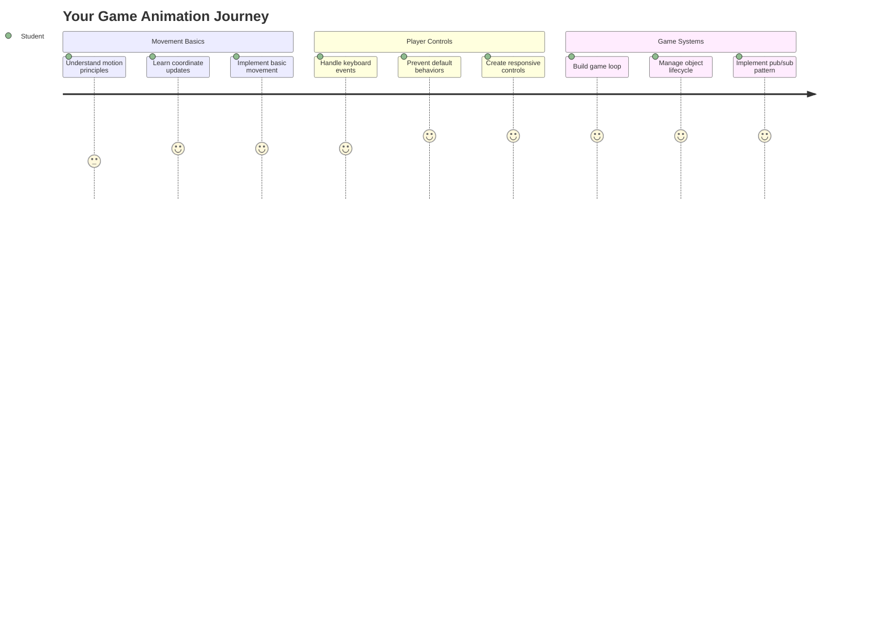
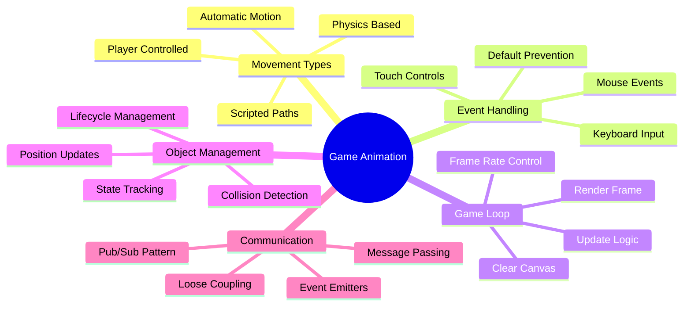
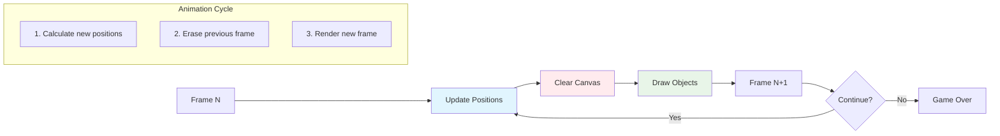
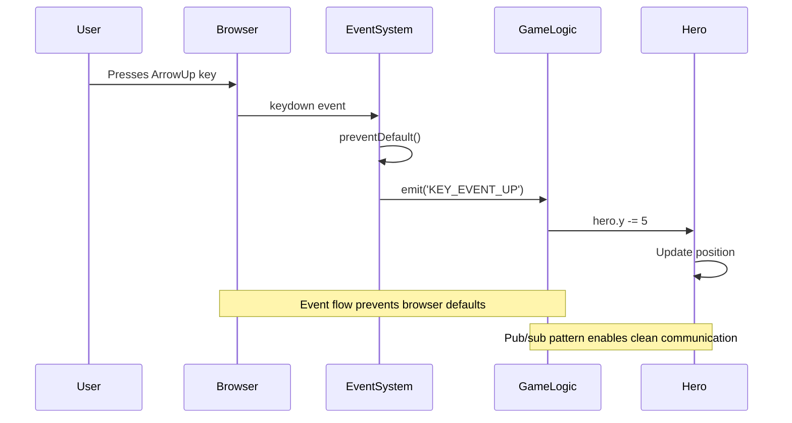
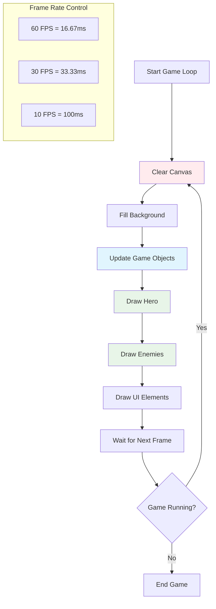
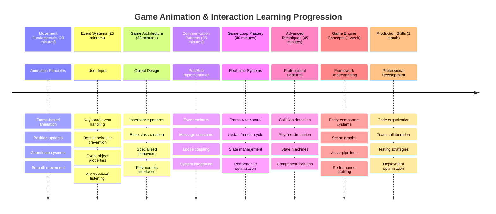

# بناء لعبة فضاء الجزء الثالث: إضافة الحركة



فكر في ألعابك المفضلة – ما يجعلها ممتعة ليس فقط الرسومات الجميلة، بل الطريقة التي تتحرك بها الأشياء وتستجيب لتفاعلاتك. في الوقت الحالي، لعبتك الفضائية تشبه لوحة جميلة، لكننا على وشك إضافة الحركة التي ستجعلها تنبض بالحياة.

عندما قام مهندسو ناسا ببرمجة الكمبيوتر الإرشادي لمهام أبولو، واجهوا تحديًا مشابهًا: كيف تجعل المركبة الفضائية تستجيب لمدخلات الطيار مع الحفاظ تلقائيًا على تصحيحات المسار؟ المبادئ التي سنتعلمها اليوم تعكس تلك المفاهيم نفسها – إدارة الحركة التي يتحكم بها اللاعب جنبًا إلى جنب مع سلوكيات النظام التلقائية.

في هذا الدرس، ستتعلم كيفية جعل السفن الفضائية تنزلق عبر الشاشة، تستجيب لأوامر اللاعب، وتخلق أنماط حركة سلسة. سنقسم كل شيء إلى مفاهيم قابلة للإدارة تبني على بعضها البعض بشكل طبيعي.

في النهاية، سيكون لديك لاعبون يحلقون بسفينة البطل حول الشاشة بينما تقوم سفن العدو بدوريات في الأعلى. والأهم من ذلك، ستفهم المبادئ الأساسية التي تشغل أنظمة حركة الألعاب.



## اختبار ما قبل المحاضرة

[اختبار ما قبل المحاضرة](https://ff-quizzes.netlify.app/web/quiz/33)

## فهم حركة الألعاب

تنبض الألعاب بالحياة عندما تبدأ الأشياء في التحرك، وهناك طريقتان أساسيتان لحدوث ذلك:

- **الحركة التي يتحكم بها اللاعب**: عندما تضغط على مفتاح أو تنقر بالماوس، يتحرك شيء ما. هذا هو الاتصال المباشر بينك وبين عالم اللعبة.
- **الحركة التلقائية**: عندما تقرر اللعبة نفسها تحريك الأشياء – مثل سفن العدو التي تحتاج إلى الدوريات على الشاشة سواء كنت تفعل شيئًا أم لا.

تحريك الأشياء على شاشة الكمبيوتر أبسط مما قد تعتقد. هل تتذكر تلك الإحداثيات x و y من صف الرياضيات؟ هذا بالضبط ما نعمل به هنا. عندما قام غاليليو بتتبع أقمار المشتري في عام 1610، كان يقوم أساسًا بنفس الشيء – رسم المواقع بمرور الوقت لفهم أنماط الحركة.

تحريك الأشياء على الشاشة يشبه إنشاء رسوم متحركة على شكل كتاب متحرك – تحتاج إلى اتباع هذه الخطوات الثلاث البسيطة:



1. **تحديث الموقع** – تغيير مكان الكائن (ربما تحريكه 5 بكسل إلى اليمين)
2. **مسح الإطار القديم** – تنظيف الشاشة حتى لا ترى آثارًا شبحية في كل مكان
3. **رسم الإطار الجديد** – وضع الكائن في موقعه الجديد

افعل ذلك بسرعة كافية، وستحصل على حركة سلسة تبدو طبيعية للاعبين.

إليك كيف يمكن أن يبدو ذلك في الكود:

```javascript
// Set the hero's location
hero.x += 5;
// Clear the rectangle that hosts the hero
ctx.clearRect(0, 0, canvas.width, canvas.height);
// Redraw the game background and hero
ctx.fillRect(0, 0, canvas.width, canvas.height);
ctx.fillStyle = "black";
ctx.drawImage(heroImg, hero.x, hero.y);
```

**ما يفعله هذا الكود:**
- **يحدث** إحداثيات x الخاصة بالبطل بمقدار 5 بكسل لتحريكه أفقيًا
- **يمسح** منطقة اللوحة بالكامل لإزالة الإطار السابق
- **يملأ** منطقة اللوحة بلون خلفية أسود
- **يعيد رسم** صورة البطل في موقعه الجديد

✅ هل يمكنك التفكير في سبب قد يؤدي إلى تكاليف أداء عند إعادة رسم البطل عدة إطارات في الثانية؟ اقرأ عن [بدائل لهذا النمط](https://developer.mozilla.org/en-US/docs/Web/API/Canvas_API/Tutorial/Optimizing_canvas).

## التعامل مع أحداث لوحة المفاتيح

هنا نربط مدخلات اللاعب بحركة اللعبة. عندما يضغط أحدهم على مفتاح المسافة لإطلاق الليزر أو يضغط على مفتاح السهم لتجنب الكويكب، تحتاج لعبتك إلى اكتشاف هذا المدخل والاستجابة له.

تحدث أحداث لوحة المفاتيح على مستوى النافذة، مما يعني أن نافذة المتصفح بأكملها تستمع لهذه الضغطات. من ناحية أخرى، يمكن ربط نقرات الماوس بعناصر محددة (مثل النقر على زر). بالنسبة للعبة الفضاء الخاصة بنا، سنركز على عناصر التحكم في لوحة المفاتيح لأنها تمنح اللاعبين ذلك الشعور الكلاسيكي لألعاب الأركيد.

هذا يذكرني بكيفية اضطرار مشغلي التلغراف في القرن التاسع عشر إلى ترجمة مدخلات شفرة مورس إلى رسائل ذات معنى – نحن نفعل شيئًا مشابهًا، نترجم ضغطات المفاتيح إلى أوامر اللعبة.

للتعامل مع حدث، تحتاج إلى استخدام طريقة `addEventListener()` الخاصة بالنافذة وتزويدها بمعاملين. المعامل الأول هو اسم الحدث، على سبيل المثال `keyup`. المعامل الثاني هو الوظيفة التي يجب استدعاؤها نتيجة لحدوث الحدث.

إليك مثال:

```javascript
window.addEventListener('keyup', (evt) => {
  // evt.key = string representation of the key
  if (evt.key === 'ArrowUp') {
    // do something
  }
});
```

**تفصيل ما يحدث هنا:**
- **يستمع** لأحداث لوحة المفاتيح على النافذة بأكملها
- **يلتقط** كائن الحدث الذي يحتوي على معلومات حول المفتاح الذي تم الضغط عليه
- **يتحقق** مما إذا كان المفتاح المضغوط يتطابق مع مفتاح معين (في هذه الحالة، سهم لأعلى)
- **ينفذ** الكود عندما يتم استيفاء الشرط

بالنسبة لأحداث المفاتيح، هناك خاصيتان على الحدث يمكنك استخدامهما لمعرفة المفتاح الذي تم الضغط عليه:

- `key` - هذا هو التمثيل النصي للمفتاح المضغوط، على سبيل المثال `'ArrowUp'`
- `keyCode` - هذا هو التمثيل الرقمي، على سبيل المثال `37`، الذي يتوافق مع `ArrowLeft`

✅ التلاعب بأحداث المفاتيح مفيد خارج تطوير الألعاب. ما الاستخدامات الأخرى التي يمكنك التفكير فيها لهذه التقنية؟



### المفاتيح الخاصة: تنبيه!

بعض المفاتيح لها سلوكيات مدمجة في المتصفح يمكن أن تتداخل مع لعبتك. مفاتيح الأسهم تقوم بتمرير الصفحة ومفتاح المسافة يقفز للأسفل – سلوكيات لا تريدها عندما يحاول أحدهم قيادة سفينته الفضائية.

يمكننا منع هذه السلوكيات الافتراضية وترك لعبتنا تتعامل مع المدخلات بدلاً من ذلك. هذا يشبه كيف كان على مبرمجي الكمبيوتر الأوائل تجاوز مقاطعات النظام لإنشاء سلوكيات مخصصة – نحن فقط نفعل ذلك على مستوى المتصفح. إليك الطريقة:

```javascript
const onKeyDown = function (e) {
  console.log(e.keyCode);
  switch (e.keyCode) {
    case 37:
    case 39:
    case 38:
    case 40: // Arrow keys
    case 32:
      e.preventDefault();
      break; // Space
    default:
      break; // do not block other keys
  }
};

window.addEventListener('keydown', onKeyDown);
```

**فهم كود المنع هذا:**
- **يتحقق** من رموز المفاتيح المحددة التي قد تسبب سلوكًا غير مرغوب فيه في المتصفح
- **يمنع** الإجراء الافتراضي للمتصفح لمفاتيح الأسهم ومفتاح المسافة
- **يسمح** للمفاتيح الأخرى بالعمل بشكل طبيعي
- **يستخدم** `e.preventDefault()` لإيقاف سلوك المتصفح المدمج

### 🔄 **تقييم تربوي**
**فهم التعامل مع الأحداث**: قبل الانتقال إلى الحركة التلقائية، تأكد من أنك تستطيع:
- ✅ شرح الفرق بين أحداث `keydown` و `keyup`
- ✅ فهم سبب منع سلوكيات المتصفح الافتراضية
- ✅ وصف كيفية ربط مستمعي الأحداث مدخلات المستخدم بمنطق اللعبة
- ✅ تحديد المفاتيح التي قد تتداخل مع عناصر التحكم في اللعبة

**اختبار سريع ذاتي**: ماذا سيحدث إذا لم تمنع السلوك الافتراضي لمفاتيح الأسهم؟
*الإجابة: سيقوم المتصفح بتمرير الصفحة، مما يتداخل مع حركة اللعبة*

**هيكل نظام الأحداث**: أنت الآن تفهم:
- **الاستماع على مستوى النافذة**: التقاط الأحداث على مستوى المتصفح
- **خصائص كائن الحدث**: سلاسل `key` مقابل أرقام `keyCode`
- **منع السلوك الافتراضي**: إيقاف السلوكيات غير المرغوب فيها للمتصفح
- **المنطق الشرطي**: الاستجابة لمجموعات المفاتيح المحددة

## الحركة الناتجة عن اللعبة

الآن دعونا نتحدث عن الكائنات التي تتحرك دون مدخلات اللاعب. فكر في سفن العدو التي تتجول عبر الشاشة، الرصاص الذي يطير في خطوط مستقيمة، أو السحب التي تنجرف في الخلفية. هذه الحركة التلقائية تجعل عالم لعبتك يبدو حيًا حتى عندما لا يلمس أحد عناصر التحكم.

نستخدم المؤقتات المدمجة في JavaScript لتحديث المواقع على فترات منتظمة. هذا المفهوم مشابه لكيفية عمل الساعات البندولية – آلية منتظمة تؤدي إلى إجراءات متسقة وموقوتة. إليك مدى بساطة ذلك:

```javascript
const id = setInterval(() => {
  // Move the enemy on the y axis
  enemy.y += 10;
}, 100);
```

**ما يفعله كود الحركة هذا:**
- **ينشئ** مؤقتًا يعمل كل 100 مللي ثانية
- **يحدث** إحداثيات y الخاصة بالعدو بمقدار 10 بكسل في كل مرة
- **يخزن** معرف الفاصل الزمني حتى نتمكن من إيقافه لاحقًا إذا لزم الأمر
- **يحرك** العدو تلقائيًا نحو الأسفل على الشاشة

## حلقة اللعبة

إليك المفهوم الذي يربط كل شيء معًا – حلقة اللعبة. إذا كانت لعبتك فيلمًا، فإن حلقة اللعبة ستكون جهاز العرض السينمائي، تعرض إطارًا بعد إطار بسرعة كبيرة بحيث يبدو كل شيء يتحرك بسلاسة.

كل لعبة لديها واحدة من هذه الحلقات تعمل خلف الكواليس. إنها وظيفة تقوم بتحديث جميع كائنات اللعبة، تعيد رسم الشاشة، وتكرر هذه العملية باستمرار. هذا يتتبع بطلك، جميع الأعداء، أي أشعة ليزر تطير – حالة اللعبة بأكملها.

هذا المفهوم يذكرني بكيفية اضطرار رسامي الأفلام الأوائل مثل والت ديزني إلى إعادة رسم الشخصيات إطارًا بعد إطار لإنشاء وهم الحركة. نحن نفعل الشيء نفسه، فقط بالكود بدلًا من الأقلام.

إليك كيف يمكن أن تبدو حلقة اللعبة عادةً، معبرًا عنها بالكود:



```javascript
const gameLoopId = setInterval(() => {
  function gameLoop() {
    ctx.clearRect(0, 0, canvas.width, canvas.height);
    ctx.fillStyle = "black";
    ctx.fillRect(0, 0, canvas.width, canvas.height);
    drawHero();
    drawEnemies();
    drawStaticObjects();
  }
  gameLoop();
}, 200);
```

**فهم هيكل حلقة اللعبة:**
- **يمسح** اللوحة بالكامل لإزالة الإطار السابق
- **يملأ** الخلفية بلون صلب
- **يرسم** جميع كائنات اللعبة في مواقعها الحالية
- **يكرر** هذه العملية كل 200 مللي ثانية لإنشاء حركة سلسة
- **يدير** معدل الإطارات عن طريق التحكم في توقيت الفاصل الزمني

## متابعة لعبة الفضاء

الآن سنضيف الحركة إلى المشهد الثابت الذي قمت ببنائه سابقًا. سنقوم بتحويله من لقطة شاشة إلى تجربة تفاعلية. سنعمل على ذلك خطوة بخطوة لضمان بناء كل جزء على الآخر.

احصل على الكود من حيث توقفنا في الدرس السابق (أو ابدأ بالكود الموجود في [مجلد البداية الجزء الثاني](../../../../6-space-game/3-moving-elements-around/your-work) إذا كنت بحاجة إلى بداية جديدة).

**إليك ما نبنيه اليوم:**
- **عناصر تحكم البطل**: مفاتيح الأسهم ستقود سفينتك الفضائية حول الشاشة
- **حركة العدو**: ستبدأ تلك السفن الفضائية الغريبة في التقدم

لنبدأ بتنفيذ هذه الميزات.

## الخطوات الموصى بها

حدد الملفات التي تم إنشاؤها لك في المجلد الفرعي `your-work`. يجب أن تحتوي على ما يلي:

```bash
-| assets
  -| enemyShip.png
  -| player.png
-| index.html
-| app.js
-| package.json
```

ابدأ مشروعك في مجلد `your-work` عن طريق كتابة:

```bash
cd your-work
npm start
```

**ما يفعله هذا الأمر:**
- **ينتقل** إلى دليل مشروعك
- **يبدأ** خادم HTTP على العنوان `http://localhost:5000`
- **يقدم** ملفات لعبتك حتى تتمكن من اختبارها في المتصفح

سيبدأ ما سبق خادم HTTP على العنوان `http://localhost:5000`. افتح متصفحًا وأدخل هذا العنوان، في الوقت الحالي يجب أن يعرض البطل وجميع الأعداء؛ لا شيء يتحرك - حتى الآن!

### إضافة الكود

1. **أضف كائنات مخصصة** لـ `hero` و `enemy` و `game object`، يجب أن تحتوي على خصائص `x` و `y`. (تذكر الجزء الخاص بـ [الوراثة أو التركيب](../README.md)).

   *تلميح*: يجب أن يكون `game object` هو الذي يحتوي على `x` و `y` والقدرة على رسم نفسه على اللوحة.

   > **نصيحة**: ابدأ بإضافة فئة جديدة `GameObject` مع منشئها كما هو موضح أدناه، ثم ارسمها على اللوحة:

    ```javascript
    class GameObject {
      constructor(x, y) {
        this.x = x;
        this.y = y;
        this.dead = false;
        this.type = "";
        this.width = 0;
        this.height = 0;
        this.img = undefined;
      }
    
      draw(ctx) {
        ctx.drawImage(this.img, this.x, this.y, this.width, this.height);
      }
    }
    ```

    **فهم هذه الفئة الأساسية:**
    - **تعرف** الخصائص المشتركة التي تشترك فيها جميع كائنات اللعبة (الموقع، الحجم، الصورة)
    - **تتضمن** علامة `dead` لتتبع ما إذا كان يجب إزالة الكائن
    - **توفر** طريقة `draw()` التي ترسم الكائن على اللوحة
    - **تحدد** قيمًا افتراضية لجميع الخصائص التي يمكن للفئات الفرعية تجاوزها

    ```mermaid
    classDiagram
        class GameObject {
            +x: number
            +y: number
            +dead: boolean
            +type: string
            +width: number
            +height: number
            +img: Image
            +draw(ctx)
        }
        
        class Hero {
            +speed: number
            +type: "Hero"
            +width: 98
            +height: 75
        }
        
        class Enemy {
            +type: "Enemy"
            +width: 98
            +height: 50
            +setInterval()
        }
        
        GameObject <|-- Hero
        GameObject <|-- Enemy
        
        class EventEmitter {
            +listeners: object
            +on(message, listener)
            +emit(message, payload)
        }
    ```

    الآن، قم بتمديد هذا `GameObject` لإنشاء `Hero` و `Enemy`:
    
    ```javascript
    class Hero extends GameObject {
      constructor(x, y) {
        super(x, y);
        this.width = 98;
        this.height = 75;
        this.type = "Hero";
        this.speed = 5;
      }
    }
    ```

    ```javascript
    class Enemy extends GameObject {
      constructor(x, y) {
        super(x, y);
        this.width = 98;
        this.height = 50;
        this.type = "Enemy";
        const id = setInterval(() => {
          if (this.y < canvas.height - this.height) {
            this.y += 5;
          } else {
            console.log('Stopped at', this.y);
            clearInterval(id);
          }
        }, 300);
      }
    }
    ```

    **المفاهيم الرئيسية في هذه الفئات:**
    - **ترث** من `GameObject` باستخدام الكلمة المفتاحية `extends`
    - **تستدعي** منشئ الوالد باستخدام `super(x, y)`
    - **تحدد** أبعادًا وخصائص محددة لكل نوع من الكائنات
    - **تنفذ** الحركة التلقائية للأعداء باستخدام `setInterval()`

2. **أضف معالجات أحداث المفاتيح** للتعامل مع التنقل بالمفاتيح (تحريك البطل لأعلى/أسفل، يسار/يمين)

   *تذكر*: إنه نظام إحداثيات، أعلى اليسار هو `0,0`. أيضًا تذكر إضافة الكود لإيقاف *السلوك الافتراضي*

   > **نصيحة**: أنشئ وظيفة `onKeyDown` الخاصة بك واربطها بالنافذة:

   ```javascript
   const onKeyDown = function (e) {
     console.log(e.keyCode);
     // Add the code from the lesson above to stop default behavior
     switch (e.keyCode) {
       case 37:
       case 39:
       case 38:
       case 40: // Arrow keys
       case 32:
         e.preventDefault();
         break; // Space
       default:
         break; // do not block other keys
     }
   };

   window.addEventListener("keydown", onKeyDown);
   ```
    
   **ما يفعله معالج الحدث هذا:**
   - **يستمع** لأحداث الضغط على المفاتيح على النافذة بأكملها
   - **يسجل** رمز المفتاح لمساعدتك في تصحيح الأخطاء ومعرفة المفاتيح التي يتم الضغط عليها
   - **يمنع** السلوك الافتراضي للمتصفح لمفاتيح الأسهم ومفتاح المسافة
   - **يسمح** للمفاتيح الأخرى بالعمل بشكل طبيعي
   
   تحقق من وحدة التحكم في المتصفح في هذه المرحلة، وشاهد ضغطات المفاتيح التي يتم تسجيلها.

3. **تنفيذ** [نمط النشر والاشتراك](../README.md)، سيحافظ هذا على نظافة الكود أثناء متابعة الأجزاء المتبقية.

   يساعد نمط النشر والاشتراك في تنظيم الكود عن طريق فصل اكتشاف الأحداث عن التعامل معها. هذا يجعل الكود أكثر تنظيمًا وأسهل في الصيانة.

   للقيام بهذا الجزء الأخير، يمكنك:

   1. **إضافة مستمع حدث** على النافذة:

       ```javascript
       window.addEventListener("keyup", (evt) => {
         if (evt.key === "ArrowUp") {
           eventEmitter.emit(Messages.KEY_EVENT_UP);
         } else if (evt.key === "ArrowDown") {
           eventEmitter.emit(Messages.KEY_EVENT_DOWN);
         } else if (evt.key === "ArrowLeft") {
           eventEmitter.emit(Messages.KEY_EVENT_LEFT);
         } else if (evt.key === "ArrowRight") {
           eventEmitter.emit(Messages.KEY_EVENT_RIGHT);
         }
       });
       ```

   **ما يفعله نظام الأحداث هذا:**
   - **يكتشف** مدخلات لوحة المفاتيح ويحولها إلى أحداث لعبة مخصصة
   - **يفصل** اكتشاف المدخلات عن منطق اللعبة
   - **يجعل** من السهل تغيير عناصر التحكم لاحقًا دون التأثير على كود اللعبة
   - **يسمح** لأنظمة متعددة بالاستجابة لنفس المدخلات

   ```mermaid
   flowchart TD
       A["Keyboard Input"] --> B["Window Event Listener"]
       B --> C["Event Emitter"]
       C --> D["KEY_EVENT_UP"]
       C --> E["KEY_EVENT_DOWN"]
       C --> F["KEY_EVENT_LEFT"]
       C --> G["KEY_EVENT_RIGHT"]
       
       D --> H["Hero Movement"]
       D --> I["Sound System"]
       D --> J["Visual Effects"]
       
       E --> H
       F --> H
       G --> H
       
       style A fill:#e1f5fe
       style C fill:#e8f5e8
       style H fill:#fff3e0
   ```

   2. **إنشاء فئة EventEmitter** للنشر والاشتراك في الرسائل:

       ```javascript
       class EventEmitter {
         constructor() {
           this.listeners = {};
         }
       
         on(message, listener) {
           if (!this.listeners[message]) {
             this.listeners[message] = [];
           }
           this.listeners[message].push(listener);
         }
       
   3. **إضافة الثوابت** وإعداد EventEmitter:

       ```javascript
       const Messages = {
         KEY_EVENT_UP: "KEY_EVENT_UP",
         KEY_EVENT_DOWN: "KEY_EVENT_DOWN",
         KEY_EVENT_LEFT: "KEY_EVENT_LEFT",
         KEY_EVENT_RIGHT: "KEY_EVENT_RIGHT",
       };
       
       let heroImg, 
           enemyImg, 
           laserImg,
           canvas, ctx, 
           gameObjects = [], 
           hero, 
           eventEmitter = new EventEmitter();
       ```

   **فهم الإعداد:**
   - **يحدد** ثوابت الرسائل لتجنب الأخطاء وجعل إعادة الهيكلة أسهل
   - **يعلن** عن متغيرات الصور، سياق اللوحة، وحالة اللعبة
   - **ينشئ** EventEmitter عالميًا لنظام النشر والاشتراك
   - **تهيئة** مصفوفة لتخزين جميع كائنات اللعبة

   4. **تهيئة اللعبة**

       ```javascript
       function initGame() {
         gameObjects = [];
         createEnemies();
         createHero();
       
         eventEmitter.on(Messages.KEY_EVENT_UP, () => {
           hero.y -= 5;
         });
       
         eventEmitter.on(Messages.KEY_EVENT_DOWN, () => {
           hero.y += 5;
         });
       
         eventEmitter.on(Messages.KEY_EVENT_LEFT, () => {
           hero.x -= 5;
         });
       
4. **إعداد حلقة اللعبة**

   قم بإعادة صياغة وظيفة `window.onload` لتهيئة اللعبة وإعداد حلقة اللعبة بفاصل زمني مناسب. ستضيف أيضًا شعاع الليزر:

    ```javascript
    window.onload = async () => {
      canvas = document.getElementById("canvas");
      ctx = canvas.getContext("2d");
      heroImg = await loadTexture("assets/player.png");
      enemyImg = await loadTexture("assets/enemyShip.png");
      laserImg = await loadTexture("assets/laserRed.png");
    
      initGame();
      const gameLoopId = setInterval(() => {
        ctx.clearRect(0, 0, canvas.width, canvas.height);
        ctx.fillStyle = "black";
        ctx.fillRect(0, 0, canvas.width, canvas.height);
        drawGameObjects(ctx);
      }, 100);
    };
    ```

   **فهم إعداد اللعبة:**
   - **ينتظر** تحميل الصفحة بالكامل قبل البدء
   - **يحصل** على عنصر اللوحة (canvas) وسياق الرسم ثنائي الأبعاد الخاص بها
   - **يحمل** جميع الصور بشكل غير متزامن باستخدام `await`
   - **يبدأ** تشغيل حلقة اللعبة بفواصل زمنية قدرها 100 مللي ثانية (10 إطارات في الثانية)
   - **يمسح** ويعيد رسم الشاشة بالكامل في كل إطار

5. **إضافة كود** لتحريك الأعداء بفاصل زمني معين

    قم بإعادة صياغة وظيفة `createEnemies()` لإنشاء الأعداء ودفعهم إلى فئة gameObjects الجديدة:

    ```javascript
    function createEnemies() {
      const MONSTER_TOTAL = 5;
      const MONSTER_WIDTH = MONSTER_TOTAL * 98;
      const START_X = (canvas.width - MONSTER_WIDTH) / 2;
      const STOP_X = START_X + MONSTER_WIDTH;
    
      for (let x = START_X; x < STOP_X; x += 98) {
        for (let y = 0; y < 50 * 5; y += 50) {
          const enemy = new Enemy(x, y);
          enemy.img = enemyImg;
          gameObjects.push(enemy);
        }
      }
    }
    ```

    **ما الذي تفعله عملية إنشاء الأعداء:**
    - **تحسب** المواقع لتوسيط الأعداء على الشاشة
    - **تنشئ** شبكة من الأعداء باستخدام الحلقات المتداخلة
    - **تخصص** صورة العدو لكل كائن عدو
    - **تضيف** كل عدو إلى مصفوفة كائنات اللعبة العالمية
    
    وأضف وظيفة `createHero()` للقيام بعملية مشابهة للبطل.

    ```javascript
    function createHero() {
      hero = new Hero(
        canvas.width / 2 - 45,
        canvas.height - canvas.height / 4
      );
      hero.img = heroImg;
      gameObjects.push(hero);
    }
    ```

    **ما الذي تفعله عملية إنشاء البطل:**
    - **تضع** البطل في أسفل وسط الشاشة
    - **تخصص** صورة البطل لكائن البطل
    - **تضيف** البطل إلى مصفوفة كائنات اللعبة للرسم

    وأخيرًا، أضف وظيفة `drawGameObjects()` لبدء الرسم:

    ```javascript
    function drawGameObjects(ctx) {
      gameObjects.forEach(go => go.draw(ctx));
    }
    ```

    **فهم وظيفة الرسم:**
    - **تتكرر** عبر جميع كائنات اللعبة في المصفوفة
    - **تستدعي** طريقة `draw()` لكل كائن
    - **تمرير** سياق اللوحة حتى يتمكن الكائنات من رسم أنفسهم

    ### 🔄 **مراجعة تعليمية**
    **فهم كامل لنظام اللعبة**: تحقق من إتقانك للهيكل الكامل:
    - ✅ كيف يسمح التوريث للبطل والعدو بمشاركة خصائص كائن اللعبة المشتركة؟
    - ✅ لماذا يجعل نمط pub/sub الكود أكثر قابلية للصيانة؟
    - ✅ ما هو دور حلقة اللعبة في إنشاء حركة سلسة؟
    - ✅ كيف تربط مستمعات الأحداث بين إدخال المستخدم وسلوك كائنات اللعبة؟

    **تكامل النظام**: الآن تظهر لعبتك:
    - **تصميم موجه للكائنات**: فئات أساسية مع توريث متخصص
    - **هندسة قائمة على الأحداث**: نمط pub/sub لتقليل الترابط
    - **إطار عمل الرسوم المتحركة**: حلقة اللعبة مع تحديثات إطار متسقة
    - **معالجة الإدخال**: أحداث لوحة المفاتيح مع منع السلوك الافتراضي
    - **إدارة الموارد**: تحميل الصور ورسم الشخصيات

    **أنماط احترافية**: لقد قمت بتنفيذ:
    - **فصل الاهتمامات**: فصل الإدخال والمنطق والرسم
    - **تعدد الأشكال**: جميع كائنات اللعبة تشترك في واجهة الرسم المشتركة
    - **تمرير الرسائل**: تواصل نظيف بين المكونات
    - **إدارة الموارد**: معالجة فعالة للشخصيات والرسوم المتحركة

    يجب أن يبدأ الأعداء بالتقدم نحو سفينة الفضاء الخاصة بالبطل!
      }
    }
    ```
    
    and add a `createHero()` function to do a similar process for the hero.
    
    ```javascript
    function createHero() {
      hero = new Hero(
        canvas.width / 2 - 45,
        canvas.height - canvas.height / 4
      );
      hero.img = heroImg;
      gameObjects.push(hero);
    }
    ```

    وأخيرًا، أضف وظيفة `drawGameObjects()` لبدء الرسم:

    ```javascript
    function drawGameObjects(ctx) {
      gameObjects.forEach(go => go.draw(ctx));
    }
    ```

    يجب أن يبدأ الأعداء بالتقدم نحو سفينة الفضاء الخاصة بالبطل!

---

## تحدي GitHub Copilot Agent 🚀

إليك تحدٍ لتحسين جودة لعبتك: إضافة حدود وتحكم سلس. حاليًا، يمكن للبطل الطيران خارج الشاشة، وقد تبدو الحركة متقطعة.

**مهمتك:** اجعل سفينة الفضاء الخاصة بك تبدو أكثر واقعية من خلال تنفيذ حدود الشاشة وحركة سلسة. عندما يضغط اللاعبون على مفتاح السهم، يجب أن تنزلق السفينة باستمرار بدلاً من التحرك بخطوات منفصلة. فكر في إضافة تأثير بصري عندما تصل السفينة إلى حدود الشاشة – ربما تأثير بسيط يشير إلى حافة منطقة اللعب.

تعرف على المزيد حول [وضع الوكيل](https://code.visualstudio.com/blogs/2025/02/24/introducing-copilot-agent-mode) هنا.

## 🚀 تحدي

تصبح أهمية تنظيم الكود أكثر وضوحًا مع نمو المشاريع. ربما لاحظت أن ملفك أصبح مزدحمًا بالوظائف والمتغيرات والفئات المختلطة معًا. هذا يذكرني بكيفية تنظيم مهندسي مهمة أبولو للكود لإنشاء أنظمة واضحة وقابلة للصيانة يمكن لفرق متعددة العمل عليها في وقت واحد.

**مهمتك:**
فكر كمهندس برمجيات. كيف يمكنك تنظيم الكود بحيث يمكنك أنت (أو زميلك) فهم ما يحدث بعد ستة أشهر؟ حتى لو بقي كل شيء في ملف واحد الآن، يمكنك إنشاء تنظيم أفضل:

- **تجميع الوظائف ذات الصلة** مع رؤوس تعليقات واضحة
- **فصل الاهتمامات** - احتفظ بمنطق اللعبة منفصلًا عن الرسم
- **استخدام تسميات متسقة** للمتغيرات والوظائف
- **إنشاء وحدات** أو مساحات أسماء لتنظيم الجوانب المختلفة للعبة
- **إضافة توثيق** يشرح الغرض من كل قسم رئيسي

**أسئلة للتفكير:**
- ما هي أجزاء الكود التي يصعب فهمها عند العودة إليها؟
- كيف يمكنك تنظيم الكود لجعله أسهل لشخص آخر للمساهمة؟
- ماذا سيحدث إذا أردت إضافة ميزات جديدة مثل تعزيزات القوة أو أنواع مختلفة من الأعداء؟

## اختبار ما بعد المحاضرة

[اختبار ما بعد المحاضرة](https://ff-quizzes.netlify.app/web/quiz/34)

## المراجعة والدراسة الذاتية

لقد قمنا ببناء كل شيء من الصفر، وهو أمر رائع للتعلم، ولكن إليك سر صغير – هناك بعض أطر عمل JavaScript المذهلة التي يمكنها التعامل مع الكثير من العمل الشاق نيابة عنك. بمجرد أن تشعر بالراحة مع الأساسيات التي غطيناها، من المفيد [استكشاف ما هو متاح](https://github.com/collections/javascript-game-engines).

فكر في الأطر كأنها صندوق أدوات مجهز جيدًا بدلاً من صنع كل أداة يدويًا. يمكنها حل العديد من تحديات تنظيم الكود التي تحدثنا عنها، بالإضافة إلى تقديم ميزات قد تستغرق أسابيع لبنائها بنفسك.

**أشياء تستحق الاستكشاف:**
- كيف تنظم محركات الألعاب الكود – ستندهش من الأنماط الذكية التي يستخدمونها
- حيل الأداء لجعل ألعاب اللوحة تعمل بسلاسة فائقة  
- ميزات JavaScript الحديثة التي يمكن أن تجعل الكود الخاص بك أكثر نظافة وقابلية للصيانة
- طرق مختلفة لإدارة كائنات اللعبة وعلاقاتها

## 🎯 جدول زمني لإتقان الرسوم المتحركة في الألعاب



### 🛠️ ملخص أدوات تطوير الألعاب الخاصة بك

بعد إكمال هذا الدرس، أصبحت الآن متقنًا:
- **مبادئ الرسوم المتحركة**: الحركة القائمة على الإطار والانتقالات السلسة
- **برمجة قائمة على الأحداث**: معالجة إدخال لوحة المفاتيح مع إدارة الأحداث بشكل صحيح
- **تصميم موجه للكائنات**: تسلسل التوريث وواجهات متعددة الأشكال
- **أنماط الاتصال**: هندسة pub/sub للكود القابل للصيانة
- **هيكل حلقة اللعبة**: تحديثات الوقت الفعلي ودورات الرسم
- **أنظمة الإدخال**: تعيين التحكم للمستخدم مع منع السلوك الافتراضي
- **إدارة الموارد**: تحميل الشخصيات وتقنيات الرسم الفعالة

### ⚡ **ما يمكنك القيام به في الدقائق الخمس القادمة**
- [ ] افتح وحدة التحكم في المتصفح وجرب `addEventListener('keydown', console.log)` لرؤية أحداث لوحة المفاتيح
- [ ] أنشئ عنصر div بسيط وحركه باستخدام مفاتيح الأسهم
- [ ] جرب `setInterval` لإنشاء حركة مستمرة
- [ ] حاول منع السلوك الافتراضي باستخدام `event.preventDefault()`

### 🎯 **ما يمكنك تحقيقه خلال هذه الساعة**
- [ ] أكمل اختبار ما بعد الدرس وافهم البرمجة القائمة على الأحداث
- [ ] قم ببناء سفينة البطل المتحركة مع تحكم كامل بلوحة المفاتيح
- [ ] نفذ أنماط حركة سلسة للأعداء
- [ ] أضف حدودًا لمنع كائنات اللعبة من مغادرة الشاشة
- [ ] أنشئ كشف تصادم أساسي بين كائنات اللعبة

### 📅 **رحلة الرسوم المتحركة الخاصة بك لمدة أسبوع**
- [ ] أكمل لعبة الفضاء بالكامل مع حركة وتفاعلات مصقولة
- [ ] أضف أنماط حركة متقدمة مثل المنحنيات، التسارع، والفيزياء
- [ ] نفذ انتقالات سلسة ووظائف التخفيف
- [ ] أنشئ تأثيرات جسيمية وأنظمة ردود فعل بصرية
- [ ] قم بتحسين أداء اللعبة للحصول على تشغيل سلس بسرعة 60 إطارًا في الثانية
- [ ] أضف تحكمات لمس للجوال وتصميم متجاوب

### 🌟 **تطوير تفاعلي لمدة شهر**
- [ ] قم ببناء تطبيقات تفاعلية مع أنظمة رسوم متحركة متقدمة
- [ ] تعلم مكتبات الرسوم المتحركة مثل GSAP أو أنشئ محرك الرسوم المتحركة الخاص بك
- [ ] ساهم في مشاريع تطوير الألعاب والرسوم المتحركة مفتوحة المصدر
- [ ] أتقن تحسين الأداء للتطبيقات المكثفة الرسومية
- [ ] أنشئ محتوى تعليمي حول تطوير الألعاب والرسوم المتحركة
- [ ] قم ببناء مجموعة أعمال تعرض مهارات البرمجة التفاعلية المتقدمة

**تطبيقات العالم الحقيقي**: مهارات الرسوم المتحركة الخاصة بك تنطبق مباشرة على:
- **تطبيقات الويب التفاعلية**: لوحات التحكم الديناميكية والواجهات في الوقت الفعلي
- **تصور البيانات**: الرسوم البيانية المتحركة والرسومات التفاعلية
- **البرامج التعليمية**: المحاكاة التفاعلية وأدوات التعلم
- **تطوير الجوال**: الألعاب القائمة على اللمس ومعالجة الإيماءات
- **تطبيقات سطح المكتب**: تطبيقات Electron مع رسوم متحركة سلسة
- **رسوم الويب**: مكتبات الرسوم المتحركة باستخدام CSS وJavaScript

**المهارات المهنية المكتسبة**: يمكنك الآن:
- **تصميم** أنظمة قائمة على الأحداث تتوسع مع التعقيد
- **تنفيذ** رسوم متحركة سلسة باستخدام المبادئ الرياضية
- **تصحيح** أنظمة التفاعل المعقدة باستخدام أدوات المطور في المتصفح
- **تحسين** أداء اللعبة للأجهزة والمتصفحات المختلفة
- **تصميم** هياكل كود قابلة للصيانة باستخدام أنماط مثبتة

**مفاهيم تطوير الألعاب المتقنة**:
- **إدارة معدل الإطارات**: فهم FPS وعناصر التحكم في التوقيت
- **معالجة الإدخال**: أنظمة لوحة المفاتيح والأحداث عبر المنصات
- **دورة حياة الكائن**: أنماط الإنشاء، التحديث، والتدمير
- **مزامنة الحالة**: الحفاظ على حالة اللعبة متسقة عبر الإطارات
- **هندسة الأحداث**: اتصال غير مترابط بين أنظمة اللعبة

**المستوى التالي**: أنت جاهز لإضافة كشف التصادم، أنظمة التسجيل، المؤثرات الصوتية، أو استكشاف أطر عمل الألعاب الحديثة مثل Phaser أو Three.js!

🌟 **إنجاز محقق**: لقد قمت ببناء نظام لعبة تفاعلي كامل مع أنماط هندسة احترافية!

## الواجب

[علق على الكود الخاص بك](assignment.md)

---

**إخلاء المسؤولية**:  
تم ترجمة هذا المستند باستخدام خدمة الترجمة بالذكاء الاصطناعي [Co-op Translator](https://github.com/Azure/co-op-translator). بينما نسعى لتحقيق الدقة، يرجى العلم أن الترجمات الآلية قد تحتوي على أخطاء أو عدم دقة. يجب اعتبار المستند الأصلي بلغته الأصلية المصدر الرسمي. للحصول على معلومات حاسمة، يُوصى بالترجمة البشرية الاحترافية. نحن غير مسؤولين عن أي سوء فهم أو تفسيرات خاطئة تنشأ عن استخدام هذه الترجمة.