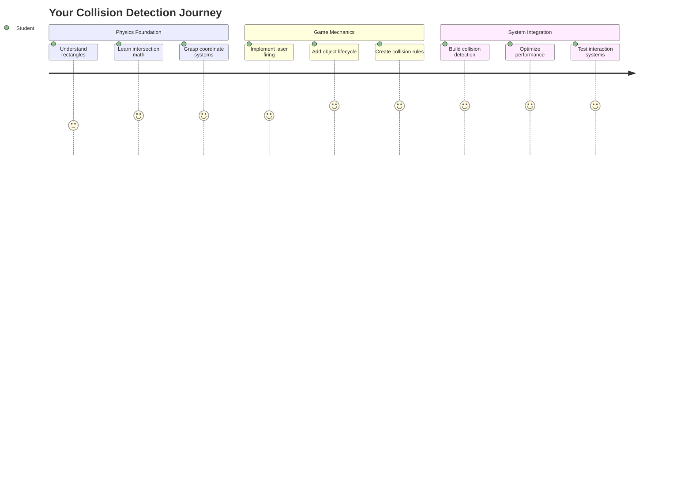
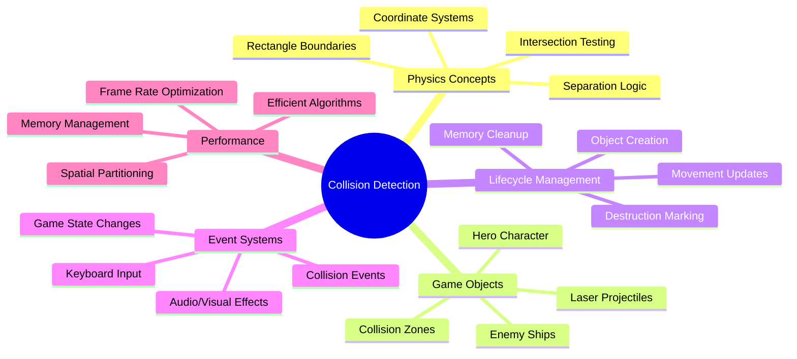
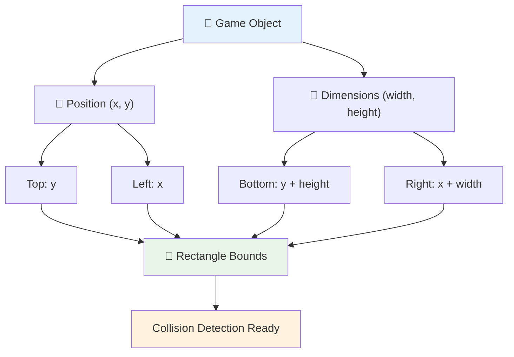
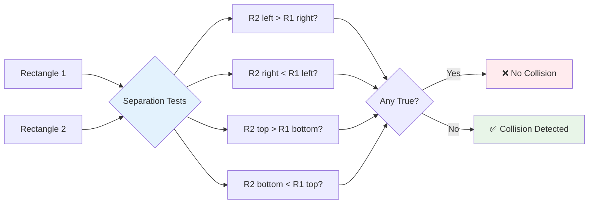
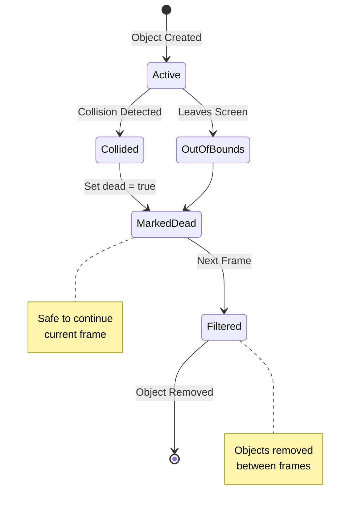
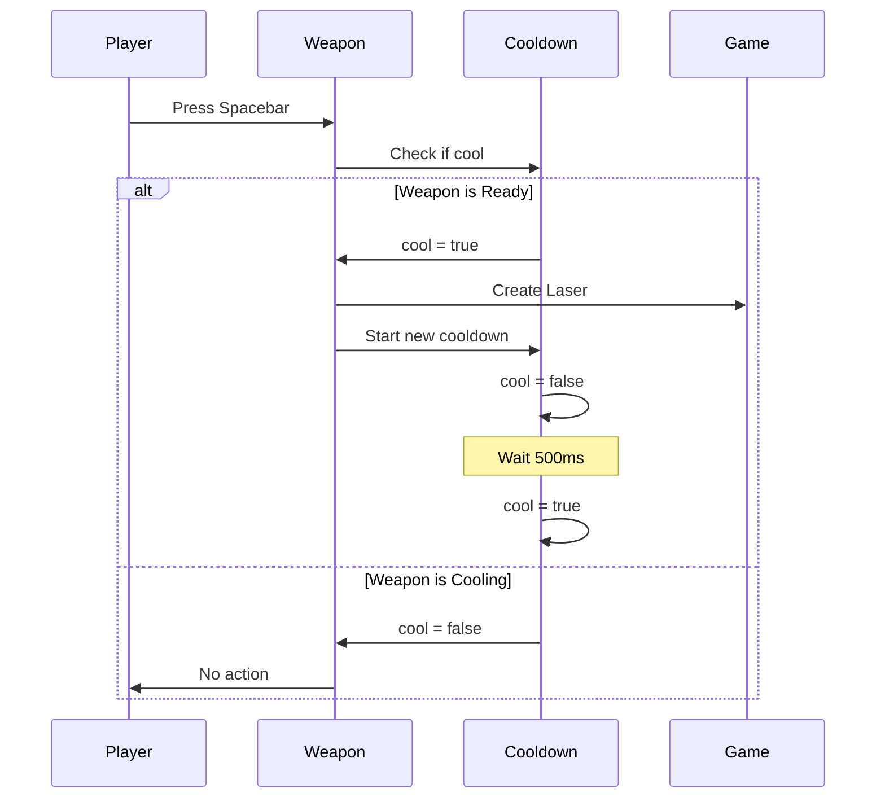
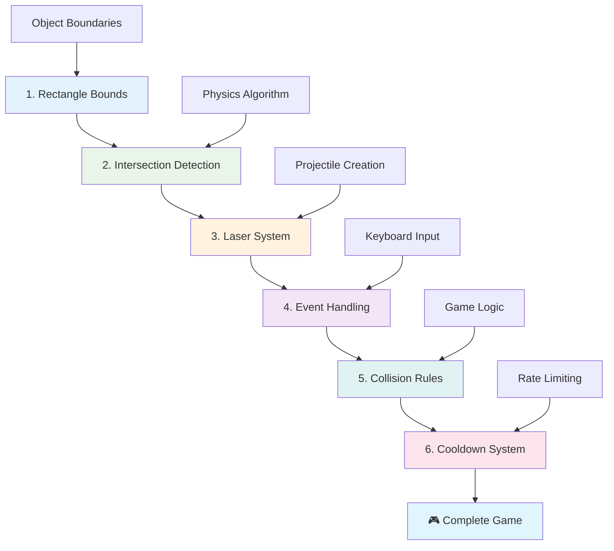
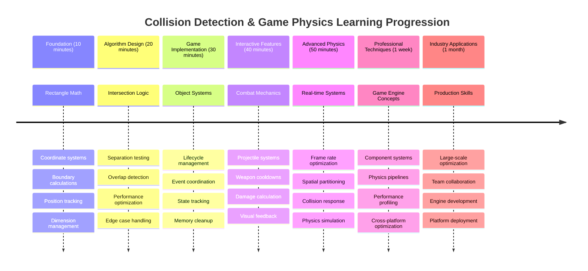

<!--
CO_OP_TRANSLATOR_METADATA:
{
  "original_hash": "039b4d8ce65f5edd82cf48d9c3e6728c",
  "translation_date": "2025-11-03T12:46:00+00:00",
  "source_file": "6-space-game/4-collision-detection/README.md",
  "language_code": "ar"
}
-->
# بناء لعبة الفضاء الجزء الرابع: إضافة الليزر واكتشاف التصادمات



## اختبار ما قبل المحاضرة

[اختبار ما قبل المحاضرة](https://ff-quizzes.netlify.app/web/quiz/35)

تذكر اللحظة في فيلم حرب النجوم عندما أصابت قذائف البروتون الخاصة بلوك منفذ عادم نجمة الموت. هذا الكشف الدقيق عن التصادم غيّر مصير المجرة! في الألعاب، يعمل اكتشاف التصادم بنفس الطريقة - فهو يحدد متى تتفاعل الأشياء وما الذي يحدث بعد ذلك.

في هذه الدرس، ستضيف أسلحة الليزر إلى لعبة الفضاء الخاصة بك وتنفذ اكتشاف التصادم. تمامًا مثل مخططي مهام ناسا الذين يحسبون مسارات المركبات الفضائية لتجنب الحطام، ستتعلم كيفية اكتشاف تقاطع الأشياء داخل اللعبة. سنقسم هذا إلى خطوات قابلة للإدارة تبني على بعضها البعض.

في النهاية، سيكون لديك نظام قتال يعمل حيث يدمر الليزر الأعداء وتؤدي التصادمات إلى أحداث داخل اللعبة. تُستخدم نفس مبادئ التصادم هذه في كل شيء بدءًا من محاكاة الفيزياء إلى واجهات الويب التفاعلية.



✅ قم بإجراء بحث صغير حول أول لعبة كمبيوتر تم كتابتها على الإطلاق. ما كانت وظيفتها؟

## اكتشاف التصادم

يعمل اكتشاف التصادم مثل أجهزة استشعار القرب في وحدة أبولو القمرية - فهو يتحقق باستمرار من المسافات ويطلق تنبيهات عندما تقترب الأشياء جدًا. في الألعاب، يحدد هذا النظام متى تتفاعل الأشياء وما الذي يجب أن يحدث بعد ذلك.

النهج الذي سنستخدمه يعامل كل كائن في اللعبة كأنه مستطيل، مشابهًا للطريقة التي تستخدم بها أنظمة مراقبة الحركة الجوية أشكالًا هندسية مبسطة لتتبع الطائرات. قد يبدو هذا النهج المستطيل بسيطًا، لكنه فعال من حيث الحساب ويعمل جيدًا لمعظم سيناريوهات الألعاب.

### تمثيل المستطيل

كل كائن في اللعبة يحتاج إلى حدود إحداثيات، مشابهًا للطريقة التي رسم بها مسبار المريخ "Pathfinder" موقعه على سطح المريخ. إليك كيفية تعريف هذه الحدود:



```javascript
rectFromGameObject() {
  return {
    top: this.y,
    left: this.x,
    bottom: this.y + this.height,
    right: this.x + this.width
  }
}
```

**لنقم بتفصيل هذا:**
- **الحافة العلوية**: هذا هو المكان الذي يبدأ فيه الكائن عموديًا (موضعه y)
- **الحافة اليسرى**: حيث يبدأ أفقيًا (موضعه x)
- **الحافة السفلية**: أضف الارتفاع إلى موضع y - الآن تعرف أين ينتهي!
- **الحافة اليمنى**: أضف العرض إلى موضع x - وهكذا تحصل على الحدود الكاملة

### خوارزمية التقاطع

اكتشاف تقاطعات المستطيلات يستخدم منطقًا مشابهًا للطريقة التي يحدد بها تلسكوب هابل الفضائي ما إذا كانت الأجسام السماوية تتداخل في مجال رؤيته. تتحقق الخوارزمية من الانفصال:



```javascript
function intersectRect(r1, r2) {
  return !(r2.left > r1.right ||
    r2.right < r1.left ||
    r2.top > r1.bottom ||
    r2.bottom < r1.top);
}
```

**اختبار الانفصال يعمل مثل أنظمة الرادار:**
- هل المستطيل 2 بالكامل على يمين المستطيل 1؟
- هل المستطيل 2 بالكامل على يسار المستطيل 1؟
- هل المستطيل 2 بالكامل أسفل المستطيل 1؟
- هل المستطيل 2 بالكامل فوق المستطيل 1؟

إذا لم تكن أي من هذه الشروط صحيحة، فلا بد أن المستطيلات تتداخل. هذا النهج يشبه الطريقة التي يحدد بها مشغلو الرادار ما إذا كانت الطائرتان على مسافات آمنة.

## إدارة دورة حياة الكائنات

عندما يصيب الليزر العدو، يجب إزالة كلا الكائنين من اللعبة. ومع ذلك، فإن حذف الكائنات أثناء الحلقة يمكن أن يسبب أعطالًا - درس تعلمناه بالطريقة الصعبة في أنظمة الكمبيوتر المبكرة مثل كمبيوتر التوجيه أبولو. بدلاً من ذلك، نستخدم نهج "التعليم للحذف" الذي يزيل الكائنات بأمان بين الإطارات.



إليك كيفية تعليم شيء ما للإزالة:

```javascript
// Mark object for removal
enemy.dead = true;
```

**لماذا يعمل هذا النهج:**
- نعلم الكائن بأنه "ميت" ولكن لا نحذفه على الفور
- هذا يسمح للإطار الحالي للعبة بالانتهاء بأمان
- لا توجد أعطال من محاولة استخدام شيء قد تم حذفه بالفعل!

ثم نقوم بتصفية الكائنات المعلمة قبل دورة العرض التالية:

```javascript
gameObjects = gameObjects.filter(go => !go.dead);
```

**ما الذي تفعله هذه التصفية:**
- تنشئ قائمة جديدة تحتوي فقط على الكائنات "الحية"
- تتخلص من أي شيء معلم بأنه ميت
- تحافظ على تشغيل اللعبة بسلاسة
- تمنع تراكم الكائنات المدمرة من تضخم الذاكرة

## تنفيذ ميكانيكية الليزر

تعمل قذائف الليزر في الألعاب على نفس مبدأ قذائف الفوتون في ستار تريك - إنها كائنات منفصلة تتحرك في خطوط مستقيمة حتى تصطدم بشيء ما. كل ضغطة على مفتاح المسافة تنشئ كائن ليزر جديد يتحرك عبر الشاشة.

لجعل هذا يعمل، نحتاج إلى تنسيق بعض الأجزاء المختلفة:

**المكونات الرئيسية للتنفيذ:**
- **إنشاء** كائنات الليزر التي تنطلق من موضع البطل
- **التعامل مع** إدخال لوحة المفاتيح لتفعيل إنشاء الليزر
- **إدارة** حركة الليزر ودورة حياته
- **تنفيذ** التمثيل البصري لقذائف الليزر

## تنفيذ التحكم في معدل الإطلاق

معدلات الإطلاق غير المحدودة ستثقل محرك اللعبة وتجعل اللعب سهلاً للغاية. تواجه أنظمة الأسلحة الحقيقية قيودًا مشابهة - حتى الفيزرات الخاصة بسفينة USS Enterprise تحتاج إلى وقت لإعادة الشحن بين الطلقات.

سننفذ نظام تبريد يمنع إطلاق النار السريع مع الحفاظ على التحكم السريع:



```javascript
class Cooldown {
  constructor(time) {
    this.cool = false;
    setTimeout(() => {
      this.cool = true;
    }, time);
  }
}

class Weapon {
  constructor() {
    this.cooldown = null;
  }
  
  fire() {
    if (!this.cooldown || this.cooldown.cool) {
      // Create laser projectile
      this.cooldown = new Cooldown(500);
    } else {
      // Weapon is still cooling down
    }
  }
}
```

**كيف يعمل التبريد:**
- عند الإنشاء، يبدأ السلاح "ساخنًا" (لا يمكن إطلاقه بعد)
- بعد فترة الانتظار، يصبح "باردًا" (جاهز للإطلاق)
- قبل الإطلاق، نتحقق: "هل السلاح بارد؟"
- هذا يمنع النقر السريع مع الحفاظ على التحكم السريع

✅ ارجع إلى الدرس الأول في سلسلة لعبة الفضاء لتذكير نفسك حول أنظمة التبريد.

## بناء نظام التصادم

ستقوم بتوسيع كود لعبة الفضاء الحالية لإنشاء نظام اكتشاف التصادم. مثل نظام تجنب التصادم الآلي لمحطة الفضاء الدولية، ستراقب لعبتك باستمرار مواقع الكائنات وتستجيب للتقاطعات.

بدءًا من كود الدرس السابق، ستضيف اكتشاف التصادم مع قواعد محددة تحكم تفاعلات الكائنات.

> 💡 **نصيحة احترافية**: صورة الليزر موجودة بالفعل في مجلد الأصول الخاص بك ومشار إليها في الكود الخاص بك، جاهزة للتنفيذ.

### قواعد التصادم التي يجب تنفيذها

**ميكانيكية اللعبة التي يجب إضافتها:**
1. **يصيب الليزر العدو**: يتم تدمير كائن العدو عند ضربه بقذيفة ليزر
2. **يصيب الليزر حدود الشاشة**: يتم إزالة الليزر عند وصوله إلى الحافة العلوية للشاشة
3. **تصادم العدو والبطل**: يتم تدمير كلا الكائنين عند تقاطعهما
4. **يصل العدو إلى الأسفل**: حالة انتهاء اللعبة عندما يصل الأعداء إلى أسفل الشاشة

### 🔄 **تقييم تربوي**
**أساسيات اكتشاف التصادم**: قبل التنفيذ، تأكد من فهمك:
- ✅ كيف تحدد حدود المستطيل مناطق التصادم
- ✅ لماذا يعتبر اختبار الانفصال أكثر كفاءة من حساب التقاطع
- ✅ أهمية إدارة دورة حياة الكائنات في حلقات اللعبة
- ✅ كيف تنسق الأنظمة القائمة على الأحداث استجابات التصادم

**اختبار سريع ذاتي**: ماذا سيحدث إذا قمت بحذف الكائنات فورًا بدلاً من تعليمها؟
*الإجابة: قد يؤدي الحذف أثناء الحلقة إلى أعطال أو تخطي الكائنات أثناء التكرار*

**فهم الفيزياء**: الآن تفهم:
- **أنظمة الإحداثيات**: كيف تخلق المواضع والأبعاد حدودًا
- **منطق التقاطع**: المبادئ الرياضية وراء اكتشاف التصادم
- **تحسين الأداء**: لماذا تعتبر الخوارزميات الفعالة مهمة في الأنظمة الفورية
- **إدارة الذاكرة**: أنماط دورة حياة الكائنات الآمنة للاستقرار

## إعداد بيئة التطوير الخاصة بك

خبر سار - لقد قمنا بالفعل بإعداد معظم الأساسيات لك! جميع أصول اللعبة والبنية الأساسية جاهزة في مجلد `your-work`، جاهزة لإضافة ميزات التصادم الرائعة.

### هيكل المشروع

```bash
-| assets
  -| enemyShip.png
  -| player.png
  -| laserRed.png
-| index.html
-| app.js
-| package.json
```

**فهم هيكل الملفات:**
- **يحتوي** على جميع صور الكائنات اللازمة للعبة
- **يتضمن** الوثيقة الرئيسية HTML وملف تطبيق JavaScript
- **يوفر** تكوين الحزمة لخادم التطوير المحلي

### بدء تشغيل خادم التطوير

انتقل إلى مجلد المشروع الخاص بك وابدأ الخادم المحلي:

```bash
cd your-work
npm start
```

**تسلسل الأوامر هذا:**
- **يغير** الدليل إلى مجلد المشروع الخاص بك
- **يبدأ** خادم HTTP محلي على `http://localhost:5000`
- **يقدم** ملفات اللعبة الخاصة بك للاختبار والتطوير
- **يتيح** التطوير المباشر مع إعادة التحميل التلقائي

افتح متصفحك وانتقل إلى `http://localhost:5000` لرؤية حالة اللعبة الحالية مع البطل والأعداء معروضين على الشاشة.

### التنفيذ خطوة بخطوة

مثل النهج المنهجي الذي استخدمته ناسا لبرمجة مركبة الفضاء Voyager، سننفذ اكتشاف التصادم بشكل منهجي، نبني كل مكون خطوة بخطوة.



#### 1. إضافة حدود تصادم المستطيل

أولاً، دعنا نعلم كائنات اللعبة كيفية وصف حدودها. أضف هذه الطريقة إلى فئة `GameObject`:

```javascript
rectFromGameObject() {
    return {
      top: this.y,
      left: this.x,
      bottom: this.y + this.height,
      right: this.x + this.width,
    };
  }
```

**ما تحققه هذه الطريقة:**
- **تنشئ** كائن مستطيل بحدود إحداثيات دقيقة
- **تحسب** الحواف السفلية واليمنية باستخدام الموضع بالإضافة إلى الأبعاد
- **تعيد** كائنًا جاهزًا لخوارزميات اكتشاف التصادم
- **توفر** واجهة موحدة لجميع كائنات اللعبة

#### 2. تنفيذ اكتشاف التقاطع

الآن دعنا ننشئ محقق التصادم - وظيفة يمكنها تحديد ما إذا كانت مستطيلاتان تتداخلان:

```javascript
function intersectRect(r1, r2) {
  return !(
    r2.left > r1.right ||
    r2.right < r1.left ||
    r2.top > r1.bottom ||
    r2.bottom < r1.top
  );
}
```

**تعمل هذه الخوارزمية عن طريق:**
- **اختبار** أربعة شروط انفصال بين المستطيلات
- **تعيد** `false` إذا كان أي شرط انفصال صحيحًا
- **تشير** إلى التصادم عندما لا يوجد انفصال
- **تستخدم** منطق النفي لاختبار التقاطع بكفاءة

#### 3. تنفيذ نظام إطلاق الليزر

هنا تصبح الأمور مثيرة! دعنا نعد نظام إطلاق الليزر.

##### ثوابت الرسائل

أولاً، دعنا نحدد بعض أنواع الرسائل حتى تتمكن أجزاء مختلفة من لعبتنا من التواصل مع بعضها البعض:

```javascript
KEY_EVENT_SPACE: "KEY_EVENT_SPACE",
COLLISION_ENEMY_LASER: "COLLISION_ENEMY_LASER",
COLLISION_ENEMY_HERO: "COLLISION_ENEMY_HERO",
```

**توفر هذه الثوابت:**
- **توحيد** أسماء الأحداث في التطبيق
- **تمكين** التواصل المتسق بين أنظمة اللعبة
- **منع** الأخطاء الإملائية في تسجيل معالجات الأحداث

##### التعامل مع إدخال لوحة المفاتيح

أضف اكتشاف مفتاح المسافة إلى مستمع حدث المفتاح الخاص بك:

```javascript
} else if(evt.keyCode === 32) {
  eventEmitter.emit(Messages.KEY_EVENT_SPACE);
}
```

**هذا المعالج للإدخال:**
- **يكتشف** ضغطات مفتاح المسافة باستخدام keyCode 32
- **يرسل** رسالة حدث موحدة
- **يمكن** منطق الإطلاق المفصول

##### إعداد مستمع الحدث

سجل سلوك الإطلاق في وظيفة `initGame()` الخاصة بك:

```javascript
eventEmitter.on(Messages.KEY_EVENT_SPACE, () => {
 if (hero.canFire()) {
   hero.fire();
 }
});
```

**هذا المستمع للحدث:**
- **يستجيب** لأحداث مفتاح المسافة
- **يتحقق** من حالة تبريد الإطلاق
- **يفعل** إنشاء الليزر عند السماح بذلك

أضف معالجة التصادم لتفاعلات الليزر-العدو:

```javascript
eventEmitter.on(Messages.COLLISION_ENEMY_LASER, (_, { first, second }) => {
  first.dead = true;
  second.dead = true;
});
```

**هذا المعالج للتصادم:**
- **يتلقى** بيانات حدث التصادم مع كلا الكائنين
- **يعلم** كلا الكائنين للإزالة
- **يضمن** التنظيف المناسب بعد التصادم

#### 4. إنشاء فئة الليزر

نفذ قذيفة ليزر تتحرك للأعلى وتدير دورة حياتها الخاصة:

```javascript
class Laser extends GameObject {
  constructor(x, y) {
    super(x, y);
    this.width = 9;
    this.height = 33;
    this.type = 'Laser';
    this.img = laserImg;
    
    let id = setInterval(() => {
      if (this.y > 0) {
        this.y -= 15;
      } else {
        this.dead = true;
        clearInterval(id);
      }
    }, 100);
  }
}
```

**تنفيذ هذه الفئة:**
- **تمدد** GameObject لتوريث الوظائف الأساسية
- **تحدد** الأبعاد المناسبة لصورة الليزر
- **تنشئ** حركة تلقائية للأعلى باستخدام `setInterval()`
- **تتعامل** مع التدمير الذاتي عند الوصول إلى أعلى الشاشة
- **تدير** توقيت الرسوم المتحركة والتنظيف الخاص بها

#### 5. تنفيذ نظام اكتشاف التصادم

أنشئ وظيفة اكتشاف التصادم الشاملة:

```javascript
function updateGameObjects() {
  const enemies = gameObjects.filter(go => go.type === 'Enemy');
  const lasers = gameObjects.filter(go => go.type === "Laser");
  
  // Test laser-enemy collisions
  lasers.forEach((laser) => {
    enemies.forEach((enemy) => {
      if (intersectRect(laser.rectFromGameObject(), enemy.rectFromGameObject())) {
        eventEmitter.emit(Messages.COLLISION_ENEMY_LASER, {
          first: laser,
          second: enemy,
        });
      }
    });
  });

  // Remove destroyed objects
  gameObjects = gameObjects.filter(go => !go.dead);
}
```

**هذا النظام للتصادم:**
- **يصفي** كائنات اللعبة حسب النوع لاختبار فعال
- **يختبر** كل ليزر ضد كل عدو للتقاطعات
- **يرسل** أحداث التصادم عند اكتشاف التقاطعات
- **ينظف** الكائنات المدمرة بعد معالجة التصادم

> ⚠️ **هام**: أضف `updateGameObjects()` إلى الحلقة الرئيسية للعبة في `window.onload` لتمكين اكتشاف التصادم.

#### 6. أضف نظام التبريد إلى فئة البطل

عزز فئة البطل بميكانيكية الإطلاق وتحديد معدل الإطلاق:

```javascript
class Hero extends GameObject {
  constructor(x, y) {
    super(x, y);
    this.width = 99;
    this.height = 75;
    this.type = "Hero";
    this.speed = { x: 0, y: 0 };
    this.cooldown = 0;
  }
  
  fire() {
    gameObjects.push(new Laser(this.x + 45, this.y - 10));
    this.cooldown = 500;

    let id = setInterval(() => {
      if (this.cooldown > 0) {
        this.cooldown -= 100;
      } else {
        clearInterval(id);
      }
    }, 200);
  }
  
  canFire() {
    return this.cooldown === 0;
  }
}
```

**فهم فئة البطل المحسنة:**
- **تبدأ** مؤقت التبريد عند الصفر (جاهز للإطلاق)
- **تنشئ** كائنات الليزر المتمركزة فوق سفينة البطل
- **تحدد** فترة التبريد لمنع الإطلاق السريع
- **تقلل** مؤقت التبريد باستخدام تحديثات تعتمد على الفاصل الزمني
- **توفر** فحص حالة الإطلاق من خلال طريقة `canFire()`

### 🔄 **تقييم تربوي**
**فهم النظام الكامل**: تحقق من إتقانك لنظام التصادم:
- ✅ كيف تمكن حدود المستطيل من اكتشاف التصادم بكفاءة؟
- ✅ لماذا تعتبر إدارة دورة حياة الكائنات ضرورية لاستقرار اللعبة؟
- ✅ كيف يمنع نظام التبريد مشاكل الأداء؟
- ✅ ما دور بنية الأحداث في معالجة التصادم؟

**تكامل النظام**: يظهر اكتشاف التصادم الخاص بك:
- **الدقة الرياضية**: خوارزميات تقاطع المستطيلات
- **تحسين الأداء**: أنماط اختبار التصادم الفعالة
- **إدارة الذاكرة**: إنشاء الكائنات وتدميرها بأمان
- **تنسيق الأحداث**: التواصل المنفصل بين الأنظمة
- **المعالجة الفورية**: دورات التحديث القائمة على الإطار

**أنماط احترافية**: لقد نفذت:
- **فصل الاهتمامات**: الفيزياء، العرض، والإدخال مفصولة
- **تصميم موجه للكائنات**: الوراثة وتعدد الأشكال
- **إدارة الحالة**: تتبع دورة حياة الكائنات وحالة اللعبة
- **تحسين الأداء**: خوارزميات فعالة للاستخدام الفوري

### اختبار التنفيذ الخاص بك

تتميز لعبة الفضاء الخاصة بك الآن باكتشاف التصادم الكامل وميكانيكية القتال. 🚀 اختبر هذه القدرات الجديدة:
- **تنقل** باستخدام مفاتيح الأسهم للتحقق من عناصر التحكم في الحركة
- **أطلق الليزر** باستخدام مفتاح المسافة - لاحظ كيف يمنع التبريد النقر السريع
- **راقب التصادمات** عندما يصيب الليزر الأعداء، مما يؤدي إلى الإزالة
- **تحقق من التنظيف** حيث تختفي الكائنات المدمرة من اللعبة

لقد نجحت في تنفيذ نظام اكتشاف التصادم باستخدام نفس المبادئ الرياضية التي توجه الملاحة الفضائية والروبوتات.

### ⚡ **ما يمكنك القيام به في الدقائق الخمس القادمة**
- [ ] افتح أدوات المطور في المتصفح وقم بتعيين نقاط توقف في وظيفة اكتشاف التصادم الخاصة بك
- [ ] حاول تعديل سرعة الليزر أو حركة العدو لرؤية تأثيرات التصادم
- [ ] جرب قيم تبريد مختلفة لاختبار معدلات الإطلاق
- [ ] أضف عبارات `console.log` لتتبع أحداث الاصطدام في الوقت الفعلي

### 🎯 **ما يمكنك إنجازه خلال هذه الساعة**
- [ ] أكمل اختبار ما بعد الدرس وافهم خوارزميات اكتشاف الاصطدام
- [ ] أضف تأثيرات بصرية مثل الانفجارات عند حدوث الاصطدامات
- [ ] نفذ أنواعًا مختلفة من المقذوفات بخصائص متنوعة
- [ ] أنشئ تعزيزات تزيد من قدرات اللاعب مؤقتًا
- [ ] أضف تأثيرات صوتية لجعل الاصطدامات أكثر إرضاءً

### 📅 **برمجة الفيزياء الخاصة بك على مدار الأسبوع**
- [ ] أكمل لعبة الفضاء بالكامل مع أنظمة اصطدام مصقولة
- [ ] نفذ أشكال اصطدام متقدمة تتجاوز المستطيلات (دوائر، مضلعات)
- [ ] أضف أنظمة الجسيمات لتأثيرات انفجار واقعية
- [ ] أنشئ سلوكًا معقدًا للأعداء مع تجنب الاصطدام
- [ ] قم بتحسين اكتشاف الاصطدام للحصول على أداء أفضل مع العديد من الكائنات
- [ ] أضف محاكاة فيزيائية مثل الزخم والحركة الواقعية

### 🌟 **إتقانك لفيزياء الألعاب على مدار الشهر**
- [ ] قم ببناء ألعاب باستخدام محركات فيزيائية متقدمة ومحاكاة واقعية
- [ ] تعلم اكتشاف الاصطدام ثلاثي الأبعاد وخوارزميات تقسيم الفضاء
- [ ] ساهم في مكتبات الفيزياء مفتوحة المصدر ومحركات الألعاب
- [ ] أتقن تحسين الأداء للتطبيقات المكثفة للرسومات
- [ ] أنشئ محتوى تعليميًا حول فيزياء الألعاب واكتشاف الاصطدام
- [ ] قم ببناء ملف أعمال يعرض مهارات البرمجة الفيزيائية المتقدمة

## 🎯 جدول زمني لإتقان اكتشاف الاصطدام



### 🛠️ ملخص أدوات فيزياء الألعاب الخاصة بك

بعد إكمال هذا الدرس، أصبحت الآن متقنًا:
- **رياضيات الاصطدام**: خوارزميات تقاطع المستطيلات وأنظمة الإحداثيات
- **تحسين الأداء**: اكتشاف الاصطدام بكفاءة للتطبيقات في الوقت الفعلي
- **إدارة دورة حياة الكائنات**: أنماط آمنة لإنشاء وتحديث وتدمير الكائنات
- **هندسة قائمة على الأحداث**: أنظمة مفصولة للاستجابة للاصطدام
- **تكامل حلقة اللعبة**: تحديثات الفيزياء القائمة على الإطار وتنسيق العرض
- **أنظمة الإدخال**: تحكم استجابي مع تحديد معدل التغذية الراجعة
- **إدارة الذاكرة**: استراتيجيات فعالة لتجميع الكائنات وتنظيفها

**تطبيقات واقعية**: مهاراتك في اكتشاف الاصطدام تنطبق مباشرة على:
- **المحاكاة التفاعلية**: النمذجة العلمية والأدوات التعليمية
- **تصميم واجهة المستخدم**: تفاعلات السحب والإفلات واكتشاف اللمس
- **تصور البيانات**: الرسوم البيانية التفاعلية والعناصر القابلة للنقر
- **تطوير التطبيقات المحمولة**: التعرف على إيماءات اللمس ومعالجة الاصطدام
- **برمجة الروبوتات**: تخطيط المسار وتجنب العقبات
- **رسومات الحاسوب**: تتبع الأشعة والخوارزميات المكانية

**المهارات المهنية المكتسبة**: يمكنك الآن:
- **تصميم** خوارزميات فعالة لاكتشاف الاصطدام في الوقت الفعلي
- **تنفيذ** أنظمة فيزيائية تتكيف مع تعقيد الكائنات
- **تصحيح الأخطاء** في أنظمة التفاعل المعقدة باستخدام المبادئ الرياضية
- **تحسين** الأداء للأجهزة المختلفة وقدرات المتصفح
- **تصميم** أنظمة ألعاب قابلة للصيانة باستخدام أنماط تصميم مثبتة

**مفاهيم تطوير الألعاب التي تم إتقانها**:
- **محاكاة الفيزياء**: اكتشاف الاصطدام والاستجابة في الوقت الفعلي
- **هندسة الأداء**: خوارزميات محسنة للتطبيقات التفاعلية
- **أنظمة الأحداث**: اتصال مفصول بين مكونات اللعبة
- **إدارة الكائنات**: أنماط دورة حياة فعالة للمحتوى الديناميكي
- **معالجة الإدخال**: تحكم استجابي مع تغذية راجعة مناسبة

**المستوى التالي**: أنت جاهز لاستكشاف محركات الفيزياء المتقدمة مثل Matter.js، وتنفيذ اكتشاف الاصطدام ثلاثي الأبعاد، أو بناء أنظمة جسيمات معقدة!

🌟 **إنجاز محقق**: لقد قمت ببناء نظام تفاعل كامل قائم على الفيزياء مع اكتشاف اصطدام بمستوى احترافي!

## تحدي GitHub Copilot Agent 🚀

استخدم وضع الوكيل لإكمال التحدي التالي:

**الوصف:** قم بتحسين نظام اكتشاف الاصطدام من خلال تنفيذ تعزيزات تظهر بشكل عشوائي وتوفر قدرات مؤقتة عند جمعها بواسطة سفينة البطل.

**المهمة:** أنشئ فئة PowerUp التي تمتد من GameObject ونفذ اكتشاف الاصطدام بين البطل والتعزيزات. أضف نوعين على الأقل من التعزيزات: واحدة تزيد من معدل إطلاق النار (تقلل من وقت التبريد) وأخرى تنشئ درعًا مؤقتًا. قم بتضمين منطق الإنشاء الذي ينشئ التعزيزات على فترات ومواقع عشوائية.

---

## 🚀 التحدي

أضف انفجارًا! ألقِ نظرة على أصول اللعبة في [مستودع فن الفضاء](../../../../6-space-game/solution/spaceArt/readme.txt) وحاول إضافة انفجار عندما يصطدم الليزر بكائن فضائي.

## اختبار ما بعد المحاضرة

[اختبار ما بعد المحاضرة](https://ff-quizzes.netlify.app/web/quiz/36)

## المراجعة والدراسة الذاتية

جرب تغيير الفواصل الزمنية في لعبتك حتى الآن. ماذا يحدث عندما تغيرها؟ اقرأ المزيد عن [أحداث توقيت JavaScript](https://www.freecodecamp.org/news/javascript-timing-events-settimeout-and-setinterval/).

## الواجب

[استكشاف الاصطدامات](assignment.md)

---

**إخلاء المسؤولية**:  
تم ترجمة هذا المستند باستخدام خدمة الترجمة بالذكاء الاصطناعي [Co-op Translator](https://github.com/Azure/co-op-translator). بينما نسعى لتحقيق الدقة، يرجى العلم أن الترجمات الآلية قد تحتوي على أخطاء أو عدم دقة. يجب اعتبار المستند الأصلي بلغته الأصلية المصدر الرسمي. للحصول على معلومات حاسمة، يُوصى بالترجمة البشرية الاحترافية. نحن غير مسؤولين عن أي سوء فهم أو تفسيرات خاطئة ناتجة عن استخدام هذه الترجمة.