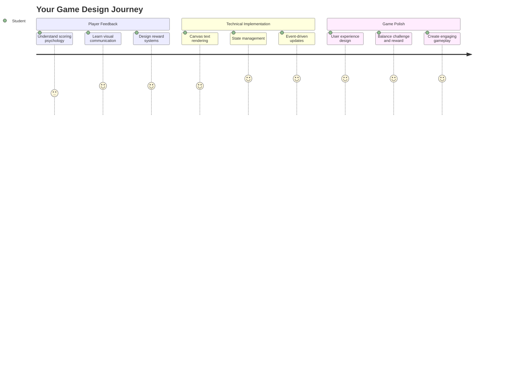
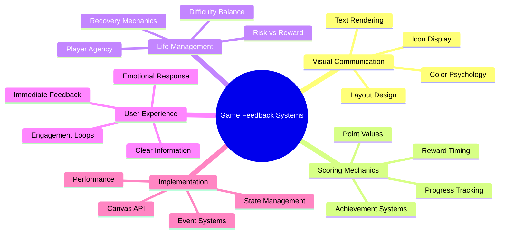
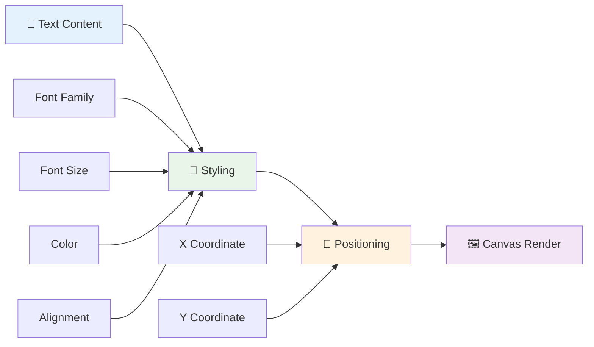
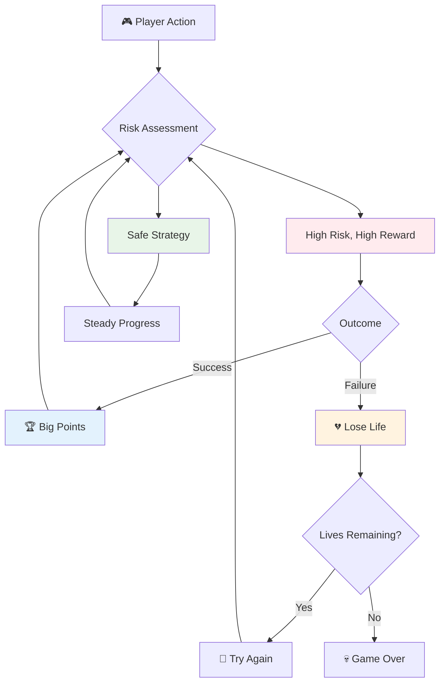
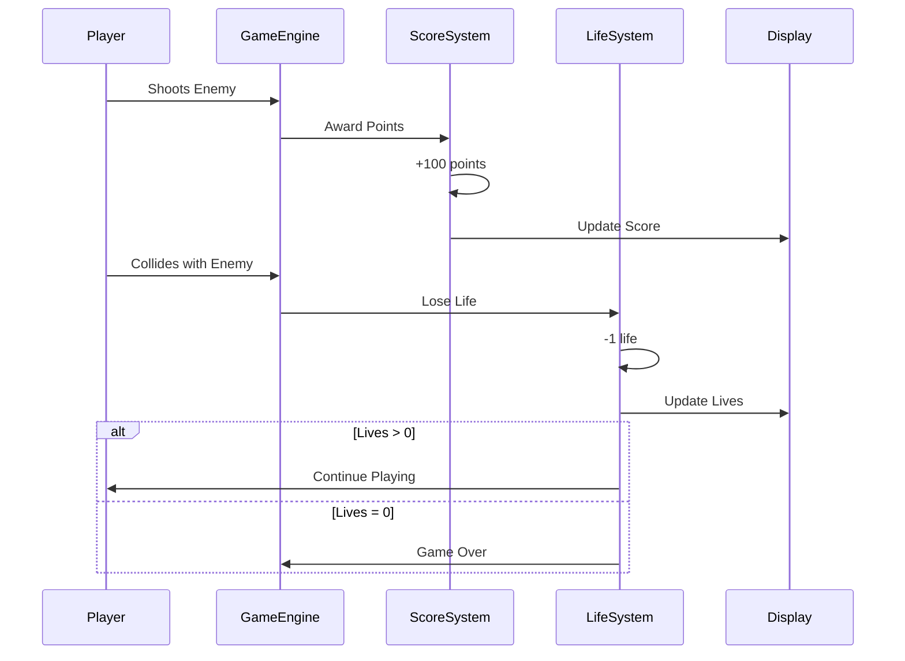
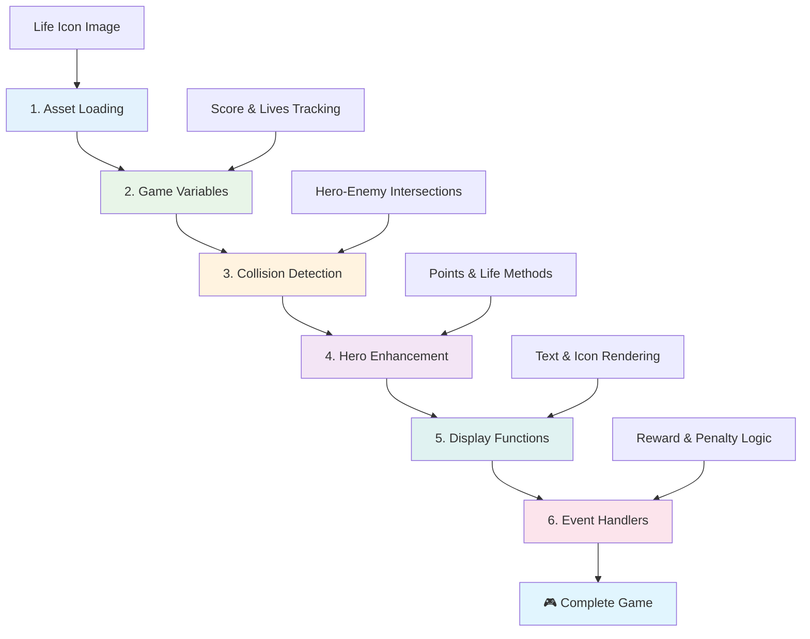
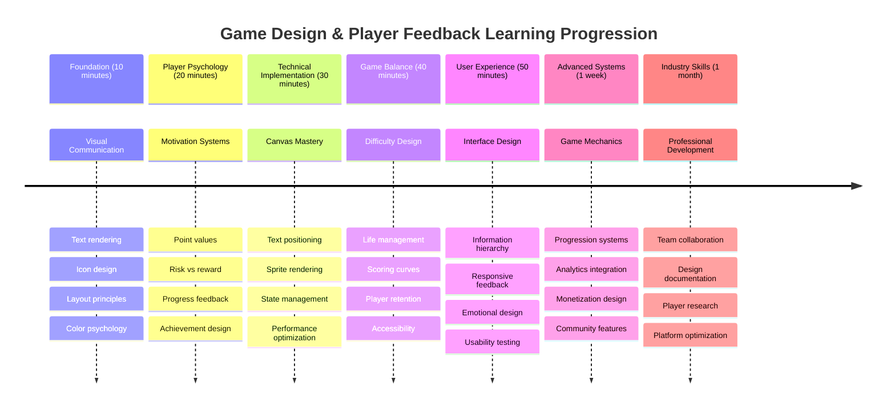

<!--
CO_OP_TRANSLATOR_METADATA:
{
  "original_hash": "2ed9145a16cf576faa2a973dff84d099",
  "translation_date": "2025-11-03T12:47:44+00:00",
  "source_file": "6-space-game/5-keeping-score/README.md",
  "language_code": "ar"
}
-->
# بناء لعبة فضاء الجزء الخامس: النقاط والأرواح



## اختبار ما قبل المحاضرة

[اختبار ما قبل المحاضرة](https://ff-quizzes.netlify.app/web/quiz/37)

هل أنت مستعد لجعل لعبة الفضاء الخاصة بك تبدو وكأنها لعبة حقيقية؟ دعنا نضيف نظام النقاط وإدارة الأرواح - الآليات الأساسية التي حولت ألعاب الأركيد المبكرة مثل Space Invaders من مجرد عروض بسيطة إلى ترفيه ممتع. هنا تصبح لعبتك قابلة للعب بشكل حقيقي.



## عرض النص على الشاشة - صوت لعبتك

لإظهار النقاط الخاصة بك، نحتاج إلى تعلم كيفية عرض النص على اللوحة. طريقة `fillText()` هي أداتك الأساسية لهذا - إنها نفس التقنية المستخدمة في ألعاب الأركيد الكلاسيكية لعرض النقاط ومعلومات الحالة.



لديك سيطرة كاملة على مظهر النص:

```javascript
ctx.font = "30px Arial";
ctx.fillStyle = "red";
ctx.textAlign = "right";
ctx.fillText("show this on the screen", 0, 0);
```

✅ استكشف المزيد حول [إضافة النص إلى اللوحة](https://developer.mozilla.org/docs/Web/API/Canvas_API/Tutorial/Drawing_text) - قد تتفاجأ بمدى الإبداع الذي يمكنك تحقيقه باستخدام الخطوط والتنسيق!

## الأرواح - أكثر من مجرد رقم

في تصميم الألعاب، تمثل "الحياة" هامش الخطأ للاعب. يعود هذا المفهوم إلى آلات الكرة والدبابيس، حيث تحصل على عدة كرات للعب بها. في ألعاب الفيديو المبكرة مثل Asteroids، كانت الأرواح تمنح اللاعبين الإذن للمخاطرة والتعلم من الأخطاء.



التمثيل البصري مهم للغاية - عرض أيقونات السفن بدلاً من مجرد "أرواح: 3" يخلق اعترافًا بصريًا فوريًا، مشابهًا للطريقة التي استخدمت بها خزائن الأركيد المبكرة الرموز للتواصل عبر الحواجز اللغوية.

## بناء نظام المكافآت في لعبتك

الآن سنقوم بتنفيذ أنظمة التغذية الراجعة الأساسية التي تبقي اللاعبين متحمسين:



- **نظام النقاط**: كل سفينة عدو يتم تدميرها تمنح 100 نقطة (الأرقام المستديرة أسهل للاعبين لحسابها ذهنيًا). يتم عرض النقاط في الزاوية السفلية اليسرى.
- **عداد الأرواح**: يبدأ بطلك بثلاث أرواح - معيار تم تحديده بواسطة ألعاب الأركيد المبكرة لتحقيق التوازن بين التحدي وقابلية اللعب. كل تصادم مع عدو يكلفك حياة واحدة. سنعرض الأرواح المتبقية في الزاوية السفلية اليمنى باستخدام أيقونات السفن .

## لنبدأ البناء!

أولاً، قم بإعداد مساحة العمل الخاصة بك. انتقل إلى الملفات في مجلد `your-work`. يجب أن ترى هذه الملفات:

```bash
-| assets
  -| enemyShip.png
  -| player.png
  -| laserRed.png
-| index.html
-| app.js
-| package.json
```

لاختبار لعبتك، قم بتشغيل خادم التطوير من مجلد `your_work`:

```bash
cd your-work
npm start
```

سيقوم هذا بتشغيل خادم محلي على `http://localhost:5000`. افتح هذا العنوان في متصفحك لرؤية لعبتك. اختبر التحكم باستخدام مفاتيح الأسهم وحاول إطلاق النار على الأعداء للتحقق من أن كل شيء يعمل.



### حان وقت البرمجة!

1. **احصل على الأصول البصرية التي ستحتاجها**. انسخ ملف `life.png` من مجلد `solution/assets/` إلى مجلد `your-work`. ثم أضف lifeImg إلى وظيفة window.onload الخاصة بك:

    ```javascript
    lifeImg = await loadTexture("assets/life.png");
    ```

1. لا تنسَ إضافة `lifeImg` إلى قائمة الأصول الخاصة بك:

    ```javascript
    let heroImg,
    ...
    lifeImg,
    ...
    eventEmitter = new EventEmitter();
    ```
  
2. **قم بإعداد متغيرات اللعبة الخاصة بك**. أضف بعض الأكواد لتتبع إجمالي النقاط (تبدأ من 0) والأرواح المتبقية (تبدأ من 3). سنعرض هذه على الشاشة حتى يعرف اللاعبون دائمًا مكانهم.

3. **تنفيذ اكتشاف التصادم**. قم بتوسيع وظيفة `updateGameObjects()` لاكتشاف عندما تصطدم الأعداء مع بطلك:

    ```javascript
    enemies.forEach(enemy => {
        const heroRect = hero.rectFromGameObject();
        if (intersectRect(heroRect, enemy.rectFromGameObject())) {
          eventEmitter.emit(Messages.COLLISION_ENEMY_HERO, { enemy });
        }
      })
    ```

4. **أضف تتبع الأرواح والنقاط إلى بطلك**. 
   1. **تهيئة العدادات**. تحت `this.cooldown = 0` في فئة `Hero`، قم بإعداد الأرواح والنقاط:

        ```javascript
        this.life = 3;
        this.points = 0;
        ```

   1. **عرض هذه القيم للاعب**. قم بإنشاء وظائف لعرض هذه القيم على الشاشة:

        ```javascript
        function drawLife() {
          // TODO, 35, 27
          const START_POS = canvas.width - 180;
          for(let i=0; i < hero.life; i++ ) {
            ctx.drawImage(
              lifeImg, 
              START_POS + (45 * (i+1) ), 
              canvas.height - 37);
          }
        }
        
        function drawPoints() {
          ctx.font = "30px Arial";
          ctx.fillStyle = "red";
          ctx.textAlign = "left";
          drawText("Points: " + hero.points, 10, canvas.height-20);
        }
        
        function drawText(message, x, y) {
          ctx.fillText(message, x, y);
        }

        ```

   1. **ربط كل شيء بحلقة اللعبة الخاصة بك**. أضف هذه الوظائف إلى وظيفة window.onload الخاصة بك مباشرة بعد `updateGameObjects()`:

        ```javascript
        drawPoints();
        drawLife();
        ```

### 🔄 **مراجعة تربوية**
**فهم تصميم الألعاب**: قبل تنفيذ العواقب، تأكد من فهمك:
- ✅ كيف يعبر التغذية البصرية عن حالة اللعبة للاعبين
- ✅ لماذا يحسن وضع عناصر واجهة المستخدم بشكل متسق سهولة الاستخدام
- ✅ علم النفس وراء قيم النقاط وإدارة الأرواح
- ✅ كيف يختلف عرض النص على اللوحة عن النص في HTML

**اختبار سريع ذاتي**: لماذا تستخدم ألعاب الأركيد عادةً أرقامًا مستديرة لقيم النقاط؟
*الإجابة: الأرقام المستديرة أسهل للاعبين لحسابها ذهنيًا وتخلق مكافآت نفسية مرضية*

**مبادئ تجربة المستخدم**: أنت الآن تطبق:
- **التسلسل الهرمي البصري**: وضع المعلومات المهمة بشكل بارز
- **التغذية الفورية**: تحديثات في الوقت الفعلي لإجراءات اللاعب
- **عبء الإدراك**: تقديم معلومات بسيطة وواضحة
- **التصميم العاطفي**: أيقونات وألوان تخلق ارتباطًا مع اللاعب

1. **تنفيذ عواقب اللعبة والمكافآت**. الآن سنضيف أنظمة التغذية الراجعة التي تجعل إجراءات اللاعب ذات معنى:

   1. **التصادمات تكلف الأرواح**. في كل مرة يصطدم بطلك مع عدو، يجب أن تخسر حياة.
   
      أضف هذه الطريقة إلى فئة `Hero` الخاصة بك:

        ```javascript
        decrementLife() {
          this.life--;
          if (this.life === 0) {
            this.dead = true;
          }
        }
        ```

   2. **إطلاق النار على الأعداء يكسب النقاط**. كل ضربة ناجحة تمنح 100 نقطة، مما يوفر تغذية إيجابية فورية لإطلاق النار بدقة.

      قم بتوسيع فئة Hero الخاصة بك بهذه الطريقة لزيادة النقاط:
    
        ```javascript
          incrementPoints() {
            this.points += 100;
          }
        ```

        الآن قم بتوصيل هذه الوظائف بأحداث التصادم:

        ```javascript
        eventEmitter.on(Messages.COLLISION_ENEMY_LASER, (_, { first, second }) => {
           first.dead = true;
           second.dead = true;
           hero.incrementPoints();
        })

        eventEmitter.on(Messages.COLLISION_ENEMY_HERO, (_, { enemy }) => {
           enemy.dead = true;
           hero.decrementLife();
        });
        ```

✅ هل أنت فضولي بشأن الألعاب الأخرى التي تم إنشاؤها باستخدام JavaScript وCanvas؟ قم ببعض الاستكشاف - قد تدهشك الإمكانيات!

بعد تنفيذ هذه الميزات، اختبر لعبتك لرؤية نظام التغذية الراجعة الكامل قيد العمل. يجب أن ترى أيقونات الأرواح في الزاوية السفلية اليمنى، والنقاط في الزاوية السفلية اليسرى، ومراقبة كيف تقل الأرواح مع التصادمات بينما تزيد النقاط مع الضربات الناجحة.

لعبتك الآن تحتوي على الآليات الأساسية التي جعلت ألعاب الأركيد المبكرة ممتعة للغاية - أهداف واضحة، تغذية راجعة فورية، وعواقب ذات معنى لإجراءات اللاعب.

### 🔄 **مراجعة تربوية**
**نظام تصميم الألعاب الكامل**: تحقق من إتقانك لأنظمة التغذية الراجعة للاعب:
- ✅ كيف تخلق آليات النقاط دافعًا ومشاركة للاعب؟
- ✅ لماذا تعتبر الاتساق البصري مهمًا لتصميم واجهة المستخدم؟
- ✅ كيف يوازن نظام الأرواح بين التحدي واحتفاظ اللاعب؟
- ✅ ما دور التغذية الفورية في خلق تجربة لعب مرضية؟

**تكامل النظام**: يظهر نظام التغذية الراجعة الخاص بك:
- **تصميم تجربة المستخدم**: تواصل بصري واضح وتسلسل هرمي للمعلومات
- **هندسة مدفوعة بالأحداث**: تحديثات استجابة لإجراءات اللاعب
- **إدارة الحالة**: تتبع وعرض بيانات اللعبة الديناميكية
- **إتقان اللوحة**: عرض النصوص ووضع الرموز
- **علم نفس الألعاب**: فهم دافع اللاعب ومشاركته

**أنماط احترافية**: لقد قمت بتنفيذ:
- **هندسة MVC**: فصل منطق اللعبة والبيانات والعرض
- **نمط المراقب**: تحديثات مدفوعة بالأحداث لتغييرات حالة اللعبة
- **تصميم المكونات**: وظائف قابلة لإعادة الاستخدام للعرض والمنطق
- **تحسين الأداء**: عرض فعال في حلقات اللعبة

### ⚡ **ما يمكنك القيام به في الدقائق الخمس القادمة**
- [ ] جرب أحجام وألوان خطوط مختلفة لعرض النقاط
- [ ] حاول تغيير قيم النقاط وشاهد كيف يؤثر ذلك على شعور اللعبة
- [ ] أضف عبارات console.log لتتبع تغييرات النقاط والأرواح
- [ ] اختبر الحالات الحافة مثل نفاد الأرواح أو تحقيق نقاط عالية

### 🎯 **ما يمكنك تحقيقه خلال هذه الساعة**
- [ ] أكمل اختبار ما بعد الدرس وفهم علم نفس تصميم الألعاب
- [ ] أضف تأثيرات صوتية للنقاط وفقدان الأرواح
- [ ] نفذ نظام النقاط العالية باستخدام localStorage
- [ ] أنشئ قيم نقاط مختلفة لأنواع الأعداء المختلفة
- [ ] أضف تأثيرات بصرية مثل اهتزاز الشاشة عند فقدان حياة

### 📅 **رحلة تصميم الألعاب الخاصة بك لمدة أسبوع**
- [ ] أكمل لعبة الفضاء بالكامل مع أنظمة التغذية الراجعة المصقولة
- [ ] نفذ آليات النقاط المتقدمة مثل مضاعفات الكومبو
- [ ] أضف الإنجازات والمحتوى القابل للفتح
- [ ] أنشئ أنظمة تقدم وصعوبة متوازنة
- [ ] صمم واجهات المستخدم للقوائم وشاشات نهاية اللعبة
- [ ] ادرس ألعابًا أخرى لفهم آليات المشاركة

### 🌟 **إتقان تطوير الألعاب خلال شهر**
- [ ] قم ببناء ألعاب كاملة بأنظمة تقدم متطورة
- [ ] تعلم تحليلات الألعاب وقياس سلوك اللاعب
- [ ] ساهم في مشاريع تطوير الألعاب مفتوحة المصدر
- [ ] أتقن أنماط تصميم الألعاب المتقدمة واستراتيجيات تحقيق الدخل
- [ ] أنشئ محتوى تعليمي حول تصميم الألعاب وتجربة المستخدم
- [ ] قم ببناء محفظة تعرض مهارات تصميم وتطوير الألعاب

## 🎯 جدول زمني لإتقان تصميم الألعاب



### 🛠️ ملخص أدوات تصميم الألعاب الخاصة بك

بعد إكمال هذا الدرس، أصبحت الآن قد أتقنت:
- **علم نفس اللاعب**: فهم الدافع والمخاطرة/المكافأة وحلقات المشاركة
- **التواصل البصري**: تصميم واجهات مستخدم فعالة باستخدام النصوص والرموز والتخطيط
- **أنظمة التغذية الراجعة**: استجابة فورية لإجراءات اللاعب وأحداث اللعبة
- **إدارة الحالة**: تتبع وعرض بيانات اللعبة الديناميكية بكفاءة
- **عرض النصوص على اللوحة**: عرض نصوص احترافية مع تنسيق ووضع
- **تكامل الأحداث**: ربط إجراءات المستخدم بعواقب اللعبة ذات المعنى
- **توازن اللعبة**: تصميم منحنيات الصعوبة وأنظمة تقدم اللاعب

**تطبيقات العالم الحقيقي**: مهارات تصميم الألعاب الخاصة بك تنطبق مباشرة على:
- **تصميم واجهة المستخدم**: إنشاء واجهات جذابة وبديهية
- **تطوير المنتجات**: فهم دافع المستخدم وحلقات التغذية الراجعة
- **التكنولوجيا التعليمية**: أنظمة التلعيب ومشاركة التعلم
- **تصور البيانات**: جعل المعلومات المعقدة سهلة الوصول وجذابة
- **تطوير التطبيقات المحمولة**: آليات الاحتفاظ وتصميم تجربة المستخدم
- **تكنولوجيا التسويق**: فهم سلوك المستخدم وتحسين التحويل

**المهارات المهنية المكتسبة**: يمكنك الآن:
- **تصميم** تجارب مستخدم تحفز وتشارك المستخدمين
- **تنفيذ** أنظمة التغذية الراجعة التي توجه سلوك المستخدم بفعالية
- **توازن** التحدي وسهولة الوصول في الأنظمة التفاعلية
- **إنشاء** تواصل بصري يعمل عبر مجموعات المستخدمين المختلفة
- **تحليل** سلوك المستخدم وتحسين التصميم بناءً على ذلك

**مفاهيم تطوير الألعاب التي تم إتقانها**:
- **دافع اللاعب**: فهم ما يحفز المشاركة والاحتفاظ
- **التصميم البصري**: إنشاء واجهات واضحة وجذابة وعملية
- **تكامل النظام**: ربط أنظمة اللعبة المتعددة لتجربة متماسكة
- **تحسين الأداء**: عرض فعال وإدارة الحالة
- **سهولة الوصول**: تصميم لمستويات مهارة واحتياجات اللاعبين المختلفة

**المستوى التالي**: أنت جاهز لاستكشاف أنماط تصميم الألعاب المتقدمة، تنفيذ أنظمة التحليلات، أو دراسة استراتيجيات تحقيق الدخل واحتفاظ اللاعب!

🌟 **إنجاز مفتوح**: لقد قمت ببناء نظام تغذية راجعة كامل للاعب باستخدام مبادئ تصميم الألعاب الاحترافية!

---

## تحدي GitHub Copilot Agent 🚀

استخدم وضع الوكيل لإكمال التحدي التالي:

**الوصف:** قم بتحسين نظام النقاط في لعبة الفضاء عن طريق تنفيذ ميزة النقاط العالية مع التخزين المستمر وآليات النقاط الإضافية.

**المهمة:** أنشئ نظام نقاط عالية يحفظ أفضل نقاط اللاعب في localStorage. أضف نقاطًا إضافية لقتل الأعداء المتتالي (نظام الكومبو) ونفذ قيم نقاط مختلفة لأنواع الأعداء المختلفة. قم بتضمين مؤشر بصري عندما يحقق اللاعب نقاطًا عالية جديدة وعرض النقاط العالية الحالية على شاشة اللعبة.

## 🚀 التحدي

لديك الآن لعبة وظيفية مع نظام النقاط والأرواح. فكر في الميزات الإضافية التي قد تعزز تجربة اللاعب.

## اختبار ما بعد المحاضرة

[اختبار ما بعد المحاضرة](https://ff-quizzes.netlify.app/web/quiz/38)

## المراجعة والدراسة الذاتية

هل تريد استكشاف المزيد؟ ابحث عن طرق مختلفة لأنظمة النقاط والأرواح في الألعاب. هناك محركات ألعاب رائعة مثل [PlayFab](https://playfab.com) التي تتعامل مع النقاط، لوحات الصدارة، وتقدم اللاعب. كيف يمكن أن يؤدي دمج شيء كهذا إلى رفع مستوى لعبتك؟

## المهمة

[بناء لعبة النقاط](assignment.md)

---

**إخلاء المسؤولية**:  
تم ترجمة هذا المستند باستخدام خدمة الترجمة بالذكاء الاصطناعي [Co-op Translator](https://github.com/Azure/co-op-translator). بينما نسعى لتحقيق الدقة، يرجى العلم أن الترجمات الآلية قد تحتوي على أخطاء أو عدم دقة. يجب اعتبار المستند الأصلي بلغته الأصلية المصدر الموثوق. للحصول على معلومات حاسمة، يُوصى بالترجمة البشرية الاحترافية. نحن غير مسؤولين عن أي سوء فهم أو تفسيرات خاطئة تنشأ عن استخدام هذه الترجمة.